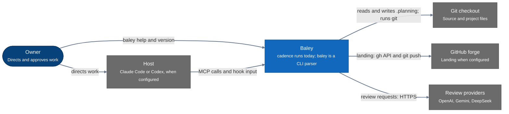
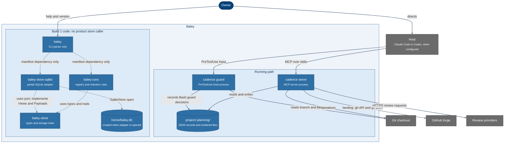

# Architecture as built

Baley coordinates AI-assisted engineering through an MCP server and a tool guard. The running implementation is still the `cadence` binary. A separate `baley` binary and SQLite storage crates are being built, but no product path calls that store yet. The binary entry points are in [`crates/cadence/src/main.rs`](../../crates/cadence/src/main.rs) and [`crates/baley/src/main.rs`](../../crates/baley/src/main.rs).

## System context

*Figure 1. C4 system context. The live external calls come from `cadence`: git commands and GitHub landing through `gh` or `git push`, plus configured HTTPS review providers. See [`crates/cadence/src/landing/forge.rs`](../../crates/cadence/src/landing/forge.rs), [`crates/cadence/src/landing/effects.rs`](../../crates/cadence/src/landing/effects.rs), and [`crates/cadence/src/review/provider/transport.rs`](../../crates/cadence/src/review/provider/transport.rs).*

## Containers and code boundaries

*Figure 2. C4 container view with the Build 1 libraries shown beside the processes. Solid arrows are running paths. Dashed arrows are source dependencies or adapter entry points; they do not connect the product to `baley.db`.*

`cadence serve` binds to a project's `.planning` directory and serves MCP over stdio; `cadence guard` reads `PreToolUse` input and can record Bash guard decisions in the same JSON store. The store names `state.json`, `decisions.jsonl`, and `items.jsonl`, and writes rendered project files there. See [`crates/cadence/src/main.rs`](../../crates/cadence/src/main.rs), [`crates/cadence/src/server.rs`](../../crates/cadence/src/server.rs), [`crates/cadence/src/guard/mod.rs`](../../crates/cadence/src/guard/mod.rs), [`crates/cadence/src/guard/bash.rs`](../../crates/cadence/src/guard/bash.rs), [`crates/cadence/src/session/mod.rs`](../../crates/cadence/src/session/mod.rs), [`crates/cadence/src/store/model.rs`](../../crates/cadence/src/store/model.rs), and [`crates/cadence/src/store/filesystem.rs`](../../crates/cadence/src/store/filesystem.rs). The checked-in hook invokes `cadence guard` for Bash, Write, and Edit in [`hooks/hooks.json`](../../hooks/hooks.json). This checkout has no `.mcp.json`; MCP host registration is not checked in.

`baley` defines an empty Clap CLI and calls only `Cli::parse()`, so it has help and version output but no store or domain command. Its manifest depends on `baley-core` and `baley-store-sqlite`; neither is called from [`crates/baley/src/main.rs`](../../crates/baley/src/main.rs) ([manifest](../../crates/baley/Cargo.toml)). `baley-core` has an event schema registry and retention rules and depends on the types and traits in `baley-store`. The SQLite crate depends on `baley-store`; it opens `<home>/baley.db` when `SqliteStore::open` is called and currently implements view and payload access plus transaction, retention, and view rebuild methods. See [`crates/baley-core/src/lib.rs`](../../crates/baley-core/src/lib.rs), [`crates/baley-store/src/ledger.rs`](../../crates/baley-store/src/ledger.rs), [`crates/baley-store-sqlite/src/store.rs`](../../crates/baley-store-sqlite/src/store.rs), [`crates/baley-store-sqlite/src/view.rs`](../../crates/baley-store-sqlite/src/view.rs), and [`crates/baley-store-sqlite/src/payload.rs`](../../crates/baley-store-sqlite/src/payload.rs).

The designed figures in [`design 0001`](../design/0001-evidence-ledger.md) show a CLI, MCP server, and guard sharing an event ledger behind the storage port, with chain heads anchored on the forge. Today the MCP server and guard still use `.planning` JSON, the new CLI has no commands, and no running path opens SQLite or publishes ledger anchors. GitHub contact in the current code is for landing work, not ledger anchoring. See [`crates/cadence/src/landing/forge.rs`](../../crates/cadence/src/landing/forge.rs), [`crates/baley/src/main.rs`](../../crates/baley/src/main.rs), and [`crates/baley-store-sqlite/src/store.rs`](../../crates/baley-store-sqlite/src/store.rs).
