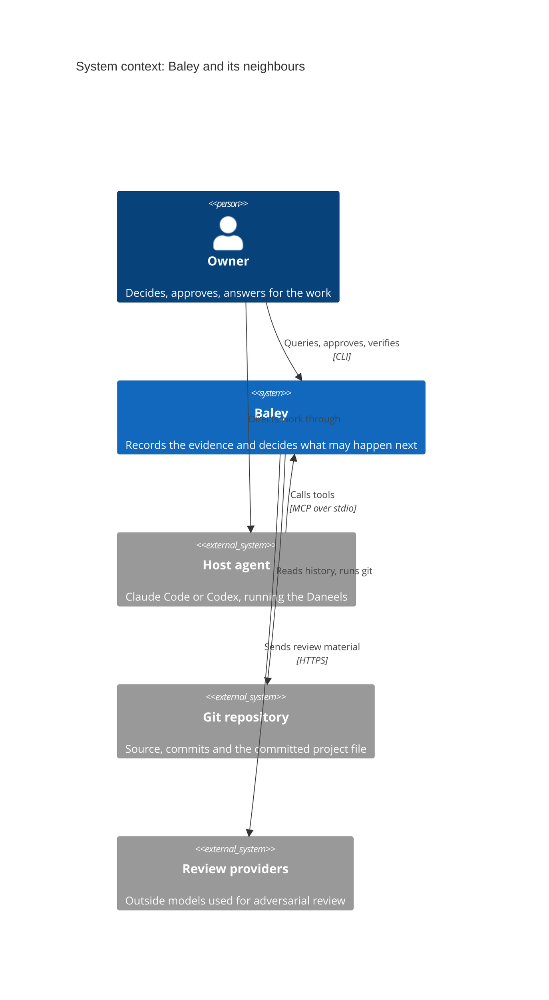
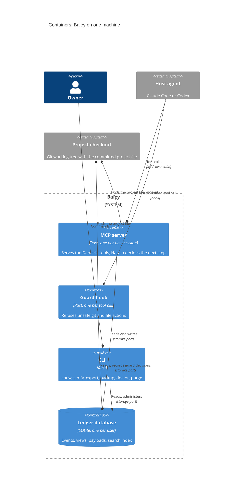
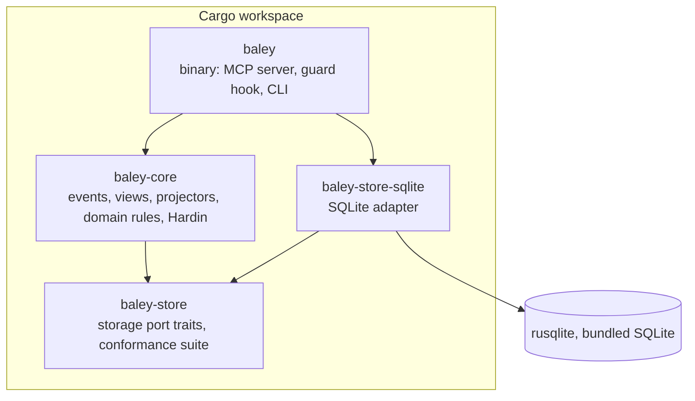
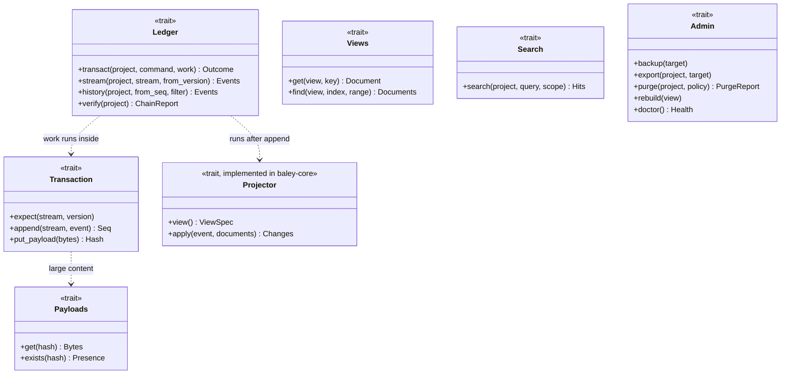
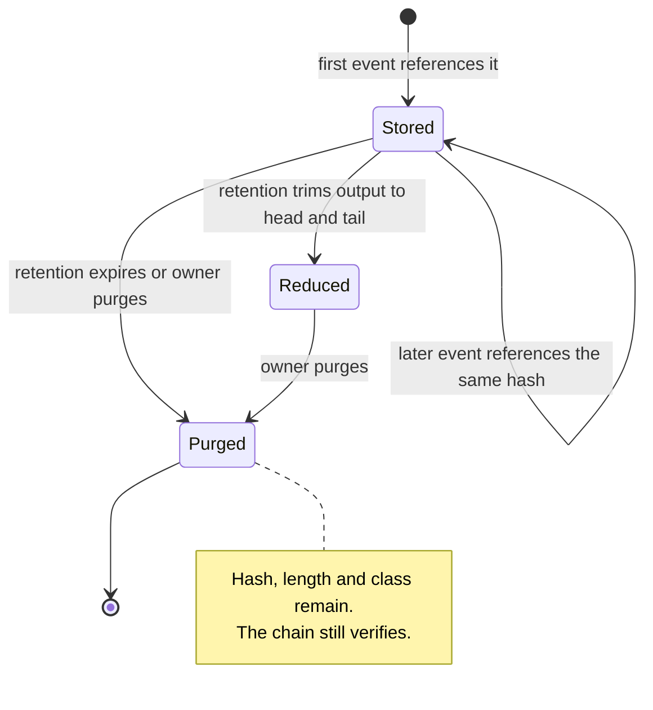
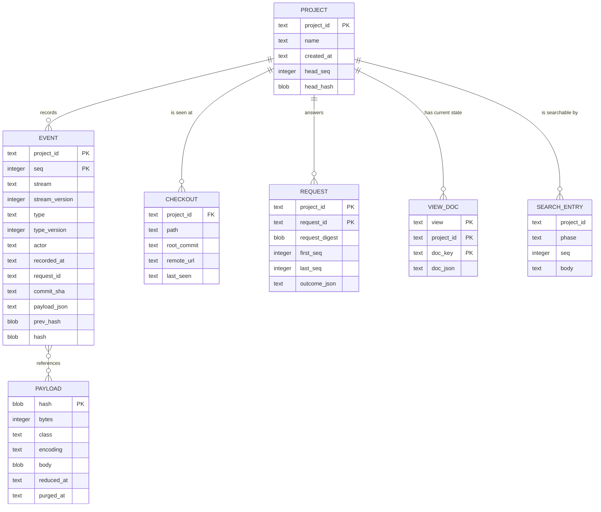
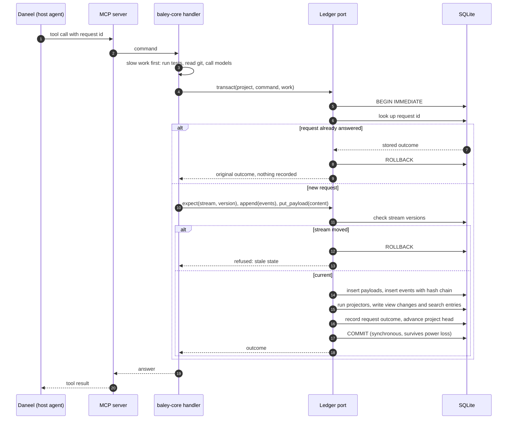
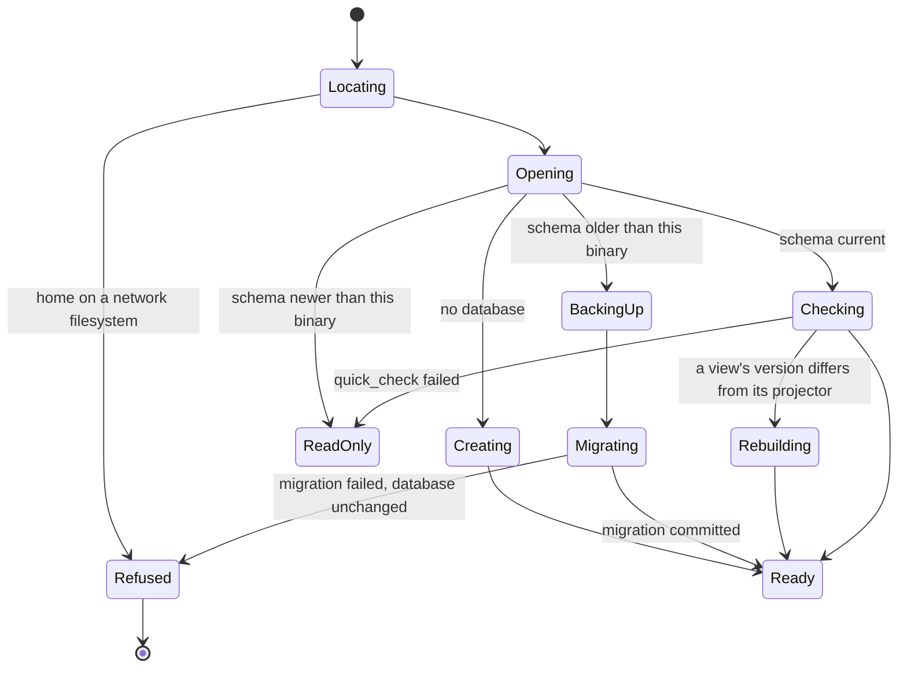
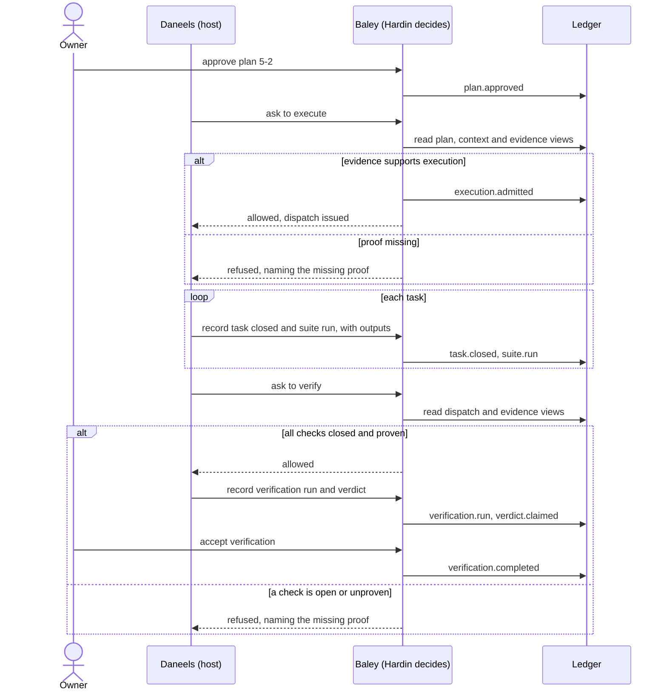

# 0001: The evidence ledger

| | |
|---|---|
| Status | Draft |
| Author | John Crenshaw |
| Reviewers | |
| Design issue | #4 |
| Milestone | Evidence |
| Requirement prefix | EVD |
| Supersedes | |
| Superseded by | |

## Summary

Baley records every fact about the work it governs (plans the owner approved, what each agent did, the test runs that prove it, the verdicts, the reviews) in one append-only, hash-chained event ledger, kept in a single SQLite database per user. Current state is a set of views derived from the ledger in the same transaction, large payloads are stored once by content hash, and all of it sits behind a storage port that domain code cannot see past. This replaces the JSON store, the `.planning/` directory and every Markdown copy the binary reads or writes today.

## Context

### What Baley is for

Baley is an owner's control plane for AI-assisted engineering. The owner decides and answers for the work; agents (the Daneels) do it; the part of Baley that decides what may happen next (Hardin) allows a step only when the recorded evidence supports it. The records are the product: a claim that has no record behind it does not count.

### What exists today

The binary keeps its records in three files under `<project>/.planning/`: `state.json`, one JSON document holding about 30 namespaces; `decisions.jsonl`, a log that mirrors many of those records in full; and `items.jsonl`, the capture queue. It also renders Markdown copies of its records into the same directory (phase `CONTEXT.md`, `PLAN-k.md`, `SUMMARY.md`, `UAT.md`, task, spike and debug records) and reads `ROADMAP.md` and `REQUIREMENTS.md` as inputs.

The same fact is routinely held three times: once in a snapshot namespace, once as a mirror line in the log, once as a Markdown file. Most of the store's machinery exists to keep those copies in agreement:

- every write re-renders and re-hashes the whole snapshot and both logs, and a multi-file intent journal carries the full new bytes of every changed file;
- a commit validator of about 650 lines compares whole namespaces before and after each write and re-derives each transition;
- records are bound to the physical directory through device and inode numbers, so the store cannot be moved, copied or rebuilt elsewhere;
- almost every read deserializes or deep-clones the whole store, and several readers scan the whole log to find one entry.

Measured on the store left by the Cadence 4.0 build (about three weeks, 40 phases): `state.json` was 99.1 MB and `decisions.jsonl` 76.3 MB. With duplicate copies and retired prompt text removed, the unique large content (plans, outputs, review material) is 3.6 MB, or 0.7 MB compressed; everything else, with large content replaced by hash references, is at most 38.9 MB, or 4.0 MB compressed. The long-running server reached 8.7 GB resident against a 62 MB store, and 2.5 GB after one cold read.

The Markdown inputs are also a second source of truth. Phases exist only as lines in `ROADMAP.md`; execution parses its task list out of `PLAN-k.md`; two features (`why` and `recall`) read old Markdown out of git history.

### Why now

Baley starts with an empty store (the Cadence records are not imported), so the record model can be chosen on its merits without a data migration.

## Goals

1. Every fact is recorded once, attributed, and cannot be altered without detection.
2. Any current-state question is answered by key, reading only what the answer needs.
3. Several processes on one machine use the store at once without corrupting it or waiting noticeably.
4. The storage engine is replaceable without touching domain code.
5. A project's history outlives any checkout of it and can be exported, backed up, verified and purged.
6. The working tree carries nothing of Baley's except one small committed project file.

## Non-goals

- **Moving records between machines.** The ledger is designed so it can travel later (see [Future work](#future-work)); no transport is built in this milestone.
- **Multi-user or server deployment.** One user, one machine. The port leaves room for a server adapter; none is built.
- **Signed checkpoints.** The hash chain gives tamper evidence; signing the chain head with the owner's key is future work.
- **Importing Cadence records.** The store starts empty.
- **Redesigning the domain rules.** Plans, execution, verification and review keep their current rules; only how they are recorded changes. Where a rule exists only to reconcile copies, it is removed.

## Requirements

| ID | Requirement | Source |
|---|---|---|
| EVD-R1 | Every fact is recorded exactly once, in the ledger. No other copy is maintained. | Context: triple copies |
| EVD-R2 | Recorded events are never modified or deleted. The only exception is a payload body removed under EVD-R14. | Goal 1 |
| EVD-R3 | Each project's events form a hash chain. Verification detects any modified, inserted, deleted or reordered event and names the first bad position. | Goal 1 |
| EVD-R4 | Every event records its actor (owner, agent role or Baley), its time, its project and, where relevant, the git commit it concerns. | Goal 1 |
| EVD-R5 | A command's events and view updates commit together or not at all. | Goal 3 |
| EVD-R6 | A request retried with the same request id returns the original outcome and records nothing new. The same id with different content is refused. | Hosts retry tool calls |
| EVD-R7 | A command decided on stale state is refused, never merged. | Goal 3 |
| EVD-R8 | The MCP servers of several sessions, the guard hook and the CLI can use the store at the same time on one machine. Readers never wait for writers. | Goal 3 |
| EVD-R9 | Every current-state question is answered from views by key (id, phase, plan, request id) without reading the log or unrelated records. Memory used by a query is proportional to its answer, not to the store. | Goal 2; store memory growth |
| EVD-R10 | Any view can be dropped and rebuilt from the ledger with an identical result. | Goal 4 |
| EVD-R11 | Payloads above a size threshold are stored once, compressed, addressed by SHA-256. Events reference them by hash. | Context: frozen copies |
| EVD-R12 | Domain code has no dependency on the storage engine, enforced by the crate graph. Every adapter passes one conformance suite. | Goal 4 |
| EVD-R13 | Recorded text can be searched with relevance ranking, scoped by project and phase. | Replaces custom recall index |
| EVD-R14 | Payload bodies can be removed by retention policy or by command without breaking EVD-R3. Each removal is itself an event. | Goal 5 |
| EVD-R15 | A project's ledger can be exported as a standalone database that verifies on its own. The whole store can be backed up while in use. | Goal 5 |
| EVD-R16 | There is one database per user, outside any checkout, in the platform data directory. `BALEY_HOME` overrides the location. | Goal 5 |
| EVD-R17 | A checkout maps to its project through a committed project file holding the project id. No record holds a filesystem identity. | Goal 5 |
| EVD-R18 | Baley writes nothing to a project's working tree except the project file, and only when the owner initializes the project. | Goal 6 |
| EVD-R19 | The database carries a schema version. A binary that finds a newer schema opens read-only. Migrations run in one transaction after an automatic backup. Stored events are never rewritten. | Goal 5; development builds share the machine |
| EVD-R20 | A command acknowledged to its caller survives power loss. | Goal 1 |
| EVD-R21 | Performance budgets hold on the reference workload, as set out in [Performance](#performance). | Goal 3 |
| EVD-R22 | The store files are readable and writable only by the owning user. | Records hold source and output |
| EVD-R23 | The store refuses to open on a network filesystem and says why. | SQLite write-ahead log constraint |
| EVD-R24 | The design works identically with Claude Code and Codex as host. Agents reach the store only through the MCP server. | Host neutrality |
| EVD-R25 | An owner can see the state and history of any record without reading files: through the CLI, through the MCP document query, and through an explicit export. | Replaces Markdown copies |

## Design

### Overview

Three ideas carry the design.

**The ledger is the only source of truth.** Everything Baley learns or decides is appended to the ledger as an event: a small, typed, attributed record of one fact, such as "plan 5-2 approved by the owner" or "suite run R7 passed". Events are never edited. A correction is a new event.

**Current state is a projection.** Hardin, the Daneels and the owner mostly ask what is true now: what phase 5's status is, which plan is approved, what the next allowed step is. Those answers live in views: keyed documents computed from the events by domain code and updated in the same transaction that appends the events. Views can be thrown away and rebuilt from the ledger, so they never become a second source of truth.

**Storage is behind a port.** Domain code sees traits that speak Baley's language (append these events, get this view by key, store this payload) and never SQL. SQLite is one adapter behind that port.



*Figure 1. Baley sits between the owner, the host agent that runs the Daneels, the repository and the outside reviewers.*



*Figure 2. Every process reaches the database through the same storage port. Nothing is written to the checkout.*

### Terms

| Term | Meaning |
|---|---|
| Event | One recorded fact. Immutable, typed, attributed, hash-chained. |
| Stream | The events of one thing that changes over time, such as one plan or one dispatch. Named, for example `plan/5-2`. Each stream has its own version counter. |
| Project sequence | The position of an event in its project's ledger. The hash chain follows this order. |
| View | A keyed collection of documents computed from events, answering one kind of current-state question. |
| Projector | Domain code that updates views from an event. Pure: event and current documents in, document changes out. |
| Payload | Content too large to keep inline in an event, stored once by hash. |
| Command | One request from a caller that may record events. It carries a request id. |
| Port | The set of storage traits the domain depends on. |
| Adapter | An implementation of the port for one engine. |
| Hardin | The part of Baley that reads views and names the one allowed next step. |
| Daneels | The agents, driven by a host, that do the work and record it through Baley's tools. |

### Detailed design

#### Crate structure (EVD-R12)



*Figure 3. Only the binary and the adapter know the engine exists. `baley-core` cannot import rusqlite, so domain code cannot reach SQL.*

The binary wires one adapter into the core at start-up. Tests of the domain run against the real SQLite adapter in a temporary directory or in memory; no fake store exists.

#### The storage port

The port is shaped around Baley's access patterns, measured in the current code: by id, by phase, by (phase, plan), by request id, the audit history of one thing, and search. It is not a generic create-read-update-delete repository.



*Figure 4. The storage port. Projectors live in the core and are handed to the adapter; the adapter never contains business rules.*

- **`transact`** runs one command. The caller's closure appends events and stores payloads; the adapter then runs every projector registered for those event types, writes the view changes and the search entries, records the request outcome, and commits. If any step fails, nothing is recorded (EVD-R5). The closure does no slow work: tests, model calls and git run before `transact` is called, and their results are passed in.
- **`expect`** declares the stream version the command's decision was based on. If the stream has moved, the command is refused with a stale-state error (EVD-R7).
- **Views** are declared by the core as a `ViewSpec`: a name, a version, a key shape and a list of indexed fields. The adapter decides how to store them. `find` reads by any declared index, never by scan.
- **Search** is a capability, not a query language. The SQLite adapter implements it with FTS5 and BM25 ranking; another adapter may implement it differently.
- **Admin** covers everything an owner does to the store as a whole.

#### Events

Every event has an envelope and a payload.

| Field | Meaning |
|---|---|
| `project_id` | The project the event belongs to. |
| `seq` | Project sequence, starting at 1, no gaps. |
| `stream`, `stream_version` | The stream and its version after this event. Unique together within a project. |
| `type`, `type_version` | The event type, such as `plan.approved`, and the version of its payload schema. |
| `actor` | `owner`, an agent role (for example `daneel:executor`), or `baley`. |
| `recorded_at` | UTC time the event was recorded. |
| `request_id` | The command that recorded it. |
| `commit` | The git commit the fact concerns, when it concerns one. |
| `payload` | The event's typed content, as canonical JSON. Content above the payload threshold is replaced by a reference `{ "payload": "<sha256>", "bytes": n }`. |
| `prev_hash`, `hash` | The hash chain (below). |

Payloads are JSON so that the ledger stays readable with standard tools and queryable through SQLite's JSON functions. For hashing, the envelope (without `hash`) and the payload are serialized with the JSON Canonicalization Scheme (RFC 8785), so the same event always hashes the same way on any platform.

Event types are named `<family>.<fact>` in the past tense and each has a payload schema version. A payload schema change adds a new version; old events are never rewritten and are read through an upcaster that converts old versions to the current shape (EVD-R19).

Streams used by the record families:

| Stream | Examples of events |
|---|---|
| `project` | `project.initialized`, `config.changed` |
| `roadmap` | `phase.declared`, `phase.renamed`, `phase.reordered`, `requirement.declared` |
| `phase/<n>` | `context.approved`, `phase.completed`, `phase.undone` |
| `plan/<n>-<k>` | `plan.submitted`, `plan.approved`, `plan.superseded` |
| `admission/<n>` | `execution.admitted`, `execution.extended` |
| `dispatch/<id>` | `dispatch.issued`, `task.started`, `task.run`, `task.closed`, `suite.run`, `dispatch.ended`, `worker.exited` |
| `verification/<id>` | `verification.started`, `verification.run`, `verdict.claimed`, `truth.waived`, `human.result`, `verification.completed` |
| `review/<id>` | `review.admitted`, `review.enqueued`, `review.delivered`, `review.returned`, `review.closed` |
| `risk/<n>` | `risk.observed`, `risk.fired`, `risk.receipt` |
| `milestone/<name>` | `milestone.closed`, `milestone.released`, `landing.recorded` |
| `task/<slug>`, `debug/<slug>`, `spike/<slug>` | the off-roadmap records |
| `capture` | `item.captured`, `item.resolved` |
| `guard` | `guard.allowed`, `guard.refused` |
| `retention` | `payload.purged` |

The full mapping from today's namespaces is in [Appendix A](#appendix-a-mapping-from-the-current-store).

#### The hash chain (EVD-R3)

Each project's events are chained in project-sequence order:

- `hash(1) = SHA-256("baley-ledger/1" || project_id || JCS(envelope(1)) || JCS(payload(1)))`
- `hash(n) = SHA-256(hash(n-1) || JCS(envelope(n)) || JCS(payload(n)))`

`prev_hash` is stored with each event so a break is located without recomputing from the start. A payload stored by hash enters the chain as its reference, so the chain commits to the content's hash and length, not its bytes. That is what lets a payload body be purged (EVD-R14) while the chain still proves the content existed and what it was.

The project record holds the head sequence and head hash. `baley verify` walks the chain, recomputes every hash, checks every stored payload against its hash, and reports the first mismatch. The chain is per project, so one project's ledger can be exported and verified without the others (EVD-R15).

Each project has one chain, and appending to it takes the database's single write lock, so the chain never forks.

#### Views and projectors (EVD-R9, EVD-R10)

A projector is registered for the event types it cares about. For each appended event, the adapter loads the documents the projector names by key, calls `apply`, and writes the returned changes. A view records the project sequence it has applied up to and its own version.

To rebuild a view (after a projector change, or with `baley doctor --rebuild`), the adapter empties it, sets its version, and replays the project's events through its projector. A view whose stored version differs from its projector's version is rebuilt on open before any query uses it.

Views planned for the first build, by the question they answer:

| View | Key | Indexed by | Answers |
|---|---|---|---|
| `roadmap` | project | | The ordered phases and their declared requirements |
| `phase` | (project, phase) | status | Status, context, completion |
| `plan` | (project, phase, plan) | status | Current content reference, approval, readiness |
| `evidence_map` | (project, phase, plan) | | The acceptance evidence a plan must produce |
| `admission` | (project, phase) | | What execution may touch |
| `dispatch` | (project, dispatch id) | phase, state | Active and ended dispatches, task and suite outcomes |
| `verification` | (project, attempt id) | phase, state | Attempts, runs, claims, waivers, completion |
| `review` | (project, review id) | phase, state | Review attempts and their outcomes |
| `risk` | (project, phase) | | Observations and receipts |
| `milestone` | (project, name) | | Closure, release, landing |
| `capture` | (project, item id) | phase, disposition | The capture queue |
| `request` | (project, request id) | | Outcome of each command, for retries |

Hardin reads only views. The next-action rules, progress and gate checks become queries over `phase`, `plan`, `dispatch`, `verification` and `capture`, not a walk over the whole store.

#### Payloads (EVD-R11, EVD-R14)

Content above 4 KiB (plan text, test output, review material, prompts) is stored as a payload: compressed with zstd, keyed by the SHA-256 of the uncompressed bytes. Storing the same content twice stores it once. SQLite's own measurements put the crossover at about 100 KB: smaller content reads faster inside the database, larger content faster from files. Baley's payloads are nearly all below that. The `Payloads` trait hides where bodies live, so an adapter can move large bodies to a content-addressed directory later without the ledger changing.

Each payload has a retention class set by the event that introduced it:

| Class | Examples | Default retention |
|---|---|---|
| `record` | plan text, context, verdicts | Kept for the life of the project |
| `output` | test and command output | Kept until the milestone that produced it closes, then reduced to its first and last 64 KiB |
| `material` | review material, prompts sent to models | Kept for 90 days after its review closes |

Purging removes the body, keeps the hash, length and class, and records a `payload.purged` event naming the hashes, the policy and the actor. `baley purge --payload <hash>` removes one body at once, for example a secret that reached test output by mistake.



*Figure 5. Payload lifecycle.*

#### Physical schema (SQLite adapter)



*Figure 6. Tables of the SQLite adapter. `VIEW_DOC` stands for one table per view, each with its declared key and index columns. `SEARCH_ENTRY` is an FTS5 virtual table.*

Further tables: `schema_meta` (schema version, created and migrated times), `view_meta` (per view: version, applied sequence), `event_payload` (the reference index for retention), and `trace` (diagnostics, outside the chain).

Indexes: `event(project_id, stream, stream_version)` unique; `event(project_id, type, seq)`; `event(project_id, commit_sha)` for `why`; each view's declared indexes.

Connection settings: `journal_mode=WAL`, `synchronous=FULL`, `foreign_keys=ON`, `busy_timeout=5000`, page size 8 KiB. rusqlite's bundled build compiles SQLite from source (3.53.2 with rusqlite 0.40.1) with FTS5 enabled, so no system SQLite is used.

#### Location and layout (EVD-R16, EVD-R22, EVD-R23)

The home directory is resolved in this order: `BALEY_HOME` if set, otherwise the platform data directory (`$XDG_DATA_HOME/baley`, falling back to `~/.local/share/baley` on Linux; `~/Library/Application Support/baley` on macOS; `%APPDATA%\baley` on Windows).

```
<home>/
  baley.db          the ledger database
  baley.db-wal      SQLite write-ahead log (managed by SQLite)
  baley.db-shm      SQLite shared memory index (managed by SQLite)
  backups/          automatic backups before migrations, and scheduled backups
```

The home directory is created with mode 0700 and the database files with 0600. On open, Baley checks the filesystem type of the home directory and refuses a network filesystem with a message naming the path and the reason.

User configuration lives in the platform configuration directory (`$XDG_CONFIG_HOME/baley`, `~/.config/baley` on Linux), separate from data.

Development builds and tests set `BALEY_HOME` so they never touch the owner's real ledger.

#### Project identity (EVD-R17, EVD-R18)

A project is initialized once with `baley init`. That creates the project in the ledger with a new random project id (UUID version 4) and writes the project file at the repository root, which the owner commits. The file holds:

- the project id and name;
- the project's policy: reviewers, routing and protected branches, the settings that today live in the repository config.

Baley finds a checkout's project the way git finds a repository: it walks up from the working directory to the first directory holding the project file, stopping at the repository root. The guard hook uses the same discovery. A directory with no project file is not managed and the guard stays silent.

Every checkout Baley sees is recorded in `checkout` with its path, root commit and remote URL. These are for diagnosis only; no record depends on them. If two checkouts whose remotes differ claim the same project id (a fork cloned beside its upstream), Baley refuses to record for the second and tells the owner to give it its own id with `baley init --new-id`.

Every change to the project file that Baley observes is recorded as a `config.changed` event with the file's digest, so the ledger keeps the policy history even though the file lives in git. Agents may not edit the project file; the guard refuses writes to it, as it refuses writes to the repository config today.

#### What replaces the Markdown files (EVD-R18, EVD-R25)

| Today | Replacement |
|---|---|
| `ROADMAP.md` phase list, read by every status query | `roadmap` stream and view. New commands declare, rename and reorder phases, which also gives the missing "add a phase" operation. |
| `REQUIREMENTS.md` traceability rows | `requirement.declared` events and the `roadmap` view. Completion and undo record events instead of editing rows. |
| `PROJECT.md` milestone version | The `milestone` view. |
| `phases/<n>/CONTEXT.md` | `context.approved` event; text is a `record` payload. |
| `phases/<n>/PLAN-k.md`, parsed by execution | `plan.approved` event; execution reads the typed plan from the `plan` view, never parses Markdown. |
| `phases/<n>/SUMMARY.md` | A query over the `dispatch` view. Git source accounting no longer needs an exemption for Baley's own files, because Baley writes none. |
| `phases/<n>/UAT.md` | `human.result` events. |
| task, spike and debug Markdown | Their own streams and views. |
| `why` and `recall` reading Markdown from git history | `why` joins commits to the events that name them (`event(project_id, commit_sha)`); `recall` uses the `Search` capability. Nothing is lost when phases are closed, because nothing is deleted. |
| Pause committing store files | Pause records a `pause` event. It still commits the owner's work in progress; it never commits Baley's records. |
| Milestone prune deleting phase directories | Closing a milestone marks its phases closed in the views. There are no files to delete. |

The owner reads records with `baley show <thing>` (for example `baley show plan 5-2`) and can write any record to a Markdown file with `baley export <thing> --to <path>`. Agents read them through the existing MCP `document` query, which is served from views. No file Baley exports is ever read back.

#### Processes and concurrency (EVD-R8)

Each process opens its own connection. SQLite's write-ahead log lets any number of readers run alongside one writer, and readers see a consistent snapshot.

- **MCP server.** One per host session. It keeps one write connection behind a single writer task, so its own commands queue in order, and a small pool of read connections.
- **Guard hook.** Starts per tool call, opens a connection, reads the views it needs and, for a decision worth recording, appends one `guard` event. It holds no write transaction while it evaluates.
- **CLI.** Opens connections on demand.

Write transactions start with `BEGIN IMMEDIATE`, so a writer takes the lock before reading and two writers never deadlock on an upgrade. A writer that finds the lock held waits up to 5 seconds, then fails with a clear "store busy" error that names the holder's process if SQLite can tell. Because every slow step happens before `transact`, a write transaction holds the lock for milliseconds.

Checkpoints: SQLite folds the write-ahead log into the database automatically every 1,000 pages. A reader that never finishes would stop that and let the log grow without bound; Baley's reads are short-lived by construction, and the server runs a passive checkpoint when idle. `baley doctor` reports the log size.

#### Writing a command



*Figure 7. One command. A retry with the same request id gets the original answer; a command decided on stale state is refused.*

A request id seen before with a different request digest is refused as a conflict (EVD-R6).

#### Reading

Hardin and the query tools call `Views::get` and `Views::find` on read connections. Queries are by key or declared index and return only the documents asked for. Payload bodies are fetched only when a caller asks for content, such as displaying a plan or sending review material, and are streamed, not loaded with the view.

#### Opening the store



*Figure 8. Opening the store. A binary never writes to a schema it does not understand, and a failed migration leaves the database as it was.*

On open the adapter runs SQLite's `quick_check`. The full `integrity_check` and chain verification run in `baley doctor` and before every backup.

### Workflows

#### From an approved plan to a verified phase



*Figure 9. One column per actor. Nobody but Baley writes to the ledger; each step's fact is recorded before Hardin allows the next one, and a refusal names the proof that is missing.*

#### A retried tool call

A host may deliver the same tool call twice after a timeout. The second delivery carries the same request id, finds the stored outcome at step 3 of Figure 7, and returns it. Nothing is recorded twice and the caller cannot tell a retry from the original.

#### Two sessions writing at once

Two sessions on different projects, or two agents on one project, each hold the write lock only for their commit. The second waits milliseconds at `BEGIN IMMEDIATE`. If both decided on the same stream version, the second is refused as stale and its caller re-reads and decides again.

## Cross-cutting concerns

### Security

- **Trust boundary.** The database is private to the owning user (mode 0600, directory 0700). Agents never open it; they reach it through the MCP server's typed operations, which decide what may be recorded.
- **Secrets.** Test output and review material can carry secrets. The existing fence that screens outbound review payloads stays. A leaked secret can be removed with a targeted purge, which leaves the chain valid and records who purged it and when.
- **Tampering.** Anyone who can write the database file can change it; the chain makes such a change detectable, not impossible. Signed checkpoints (future work) would make it attributable.
- **Network.** The store makes no network calls.

### Failure modes and recovery

| Failure | Detection | What the user sees | Recovery |
|---|---|---|---|
| Process killed mid-command | SQLite rolls back the uncommitted transaction on next open | The command did not happen; the host retries | Retry with the same request id |
| Power loss after acknowledgement | None needed | Nothing is lost (`synchronous=FULL`) | None |
| Store busy longer than 5 s | `SQLITE_BUSY` after the timeout | "store busy" naming the holder where possible | Retry; `baley doctor` shows long-running holders |
| Disk full | `SQLITE_FULL` | The command is refused, nothing recorded | Free space; retry |
| Database corruption | `quick_check` on open, `integrity_check` in doctor | Read-only, with the check's report | Restore the latest verified backup |
| Chain break (file edited outside Baley) | `baley verify` | The first bad sequence and what differs | Restore from backup; the break is itself evidence |
| Schema newer than the binary | Schema version on open | Read-only with the versions named | Use the newer binary |
| Migration fails | Transaction error | Refused; database unchanged; backup kept | Report the bug; the old binary still works |
| Home on a network filesystem | Filesystem check on open | Refused with the reason | Set `BALEY_HOME` to a local path |
| Write-ahead log grows | Log size in doctor | Warning in doctor | Idle checkpoint; find the long reader |

### Performance

Budgets on the reference workload (a store holding the equivalent of the Cadence 4.0 build, on a local SSD):

| Operation | Budget (p99) |
|---|---|
| Open a connection, schema and quick check | 20 ms |
| Commit a command of up to 10 events, excluding the command's own work | 10 ms |
| Get one view document by key | 2 ms |
| Guard hook, store work only | 25 ms |
| Longest wait for the write lock with 8 sessions writing continuously | 250 ms |
| Rebuild every view from the ledger | 10 s |

Size budget: the reference workload stores in at most 50 MB, against 175 MB today. Memory: no operation loads more than its answer; the server's resident memory does not grow with the store.

These budgets are measured by a benchmark harness before the design is accepted (see [Open questions](#open-questions)) and again at the end of the build. SQLite's limits sit far beyond them: 281 TB per database and about 1 GB per stored value.

### Observability

- `baley doctor` reports the schema version, `integrity_check` result, chain verification per project, write-ahead log size, database size by record family and payload class, view versions and lag, and backups present.
- The `trace` table records diagnostics (timings, retries, busy waits) outside the chain, with its own size cap and rotation.
- Every refusal carries a stable code and the facts that caused it, as refusals do today.

### Compatibility and migration

Nothing is migrated from the Cadence store; Baley starts empty. The work moves one record family at a time, so the binary stays usable throughout:

1. **Foundation.** The workspace split, the port, the SQLite adapter, the conformance suite, payloads, the hash chain, `verify`, `doctor`, `backup`. Nothing uses it yet.
2. **Identity and location.** The home directory, `baley init`, the project file, project discovery for the server and the guard.
3. **Record families, in dependency order.** Captures; configuration and routing; context; roadmap and requirements; plans and evidence maps; admissions, dispatch and execution; native evidence; verification; review; risk; milestones, landing and undo; task, debug and spike. Each family's move replaces its old namespace, its log lines and its Markdown in one slice.
4. **Hardin on views.** Progress, next action and the gates read only views.
5. **Search and why.** `recall` on the `Search` capability; `why` on commit-indexed events.
6. **Removal.** The JSON store, the intent journal, participants, root binding, the Markdown renderers and parsers, and every `.planning` path.

During steps 3 to 5, a family already moved is read from the ledger and the rest from the old store. Readers that span families (the progress overlay above all) read both until the last family moves. That transitional cost is accepted in exchange for a working binary at every step.

Rollback: until step 6, each slice can be reverted by its own commits. The old store is untouched by the new one.

## Alternatives considered

**Keep the JSON documents.** Rejected. The copies and the machinery to reconcile them are the problem, and a single document cannot answer a keyed query without reading the whole store (Context).

**SQLite as plain state tables, without a ledger.** Simpler: update rows in place. Rejected because it keeps only the present. Baley's product is the proof of what happened; overwriting rows discards it, and an audit trail bolted on afterwards becomes a second copy again.

**Git as the database**, as git-bug and git-appraise do. Attractive: content addressing, signing and transport come built in. Rejected for now because every query still needs a local index (both projects keep one), concurrent writers must serialize on reference updates, and query latency on large histories is poor. The ledger's shape keeps the door open: a hash-chained event stream can be pushed to a git ref later (Future work).

**An embedded key-value store** (redb, sled). Fast and pure Rust, but no query language, no full-text search, and every index would be hand-built, which is the mistake the current store made with JSON.

**A database server** (PostgreSQL). Rejected for a single-user tool: a daemon to install, run and upgrade, for concurrency Baley does not need. The port keeps it possible as a future adapter for teams.

**One database file per project.** Considered seriously: it contains the blast radius and makes per-project export trivial. Rejected in favour of one database per user because cross-project questions (what is in flight everywhere, routing learned across projects) become simple queries, there is one schema to migrate and one file to back up, and per-project chains plus `export` give the same per-project verifiability. See ADR 0003.

**The database inside `.git/`.** Shared by all worktrees and never committed, but deleted with the clone. Rejected because the ledger is the historical record and must outlive any checkout. See ADR 0003.

**Filesystem identity for projects** (today's inode binding). Rejected: the store could not move, be restored or be rebuilt. See ADR 0004.

## Testing

| Requirement | How it is proven |
|---|---|
| EVD-R2, R3, R14, R15 | Conformance tests append events, verify the chain, then alter, insert, delete and reorder rows in a copy of the database in a temporary directory and assert `verify` names the first bad position. A purged payload still verifies. An exported project verifies alone. |
| EVD-R5 | A conformance test fails a projector mid-command and asserts no event, view change, payload or request outcome was recorded. |
| EVD-R6, R7 | Conformance tests replay a request id (same content: original outcome; different content: conflict) and commit against a moved stream (refused). |
| EVD-R8 | Conformance tests open several connections to one database in a temporary directory and interleave reads and writes. |
| EVD-R9, R10 | Each projector has unit tests: event and documents in, changes out. A conformance test rebuilds every view and compares it with the live one. |
| EVD-R11 | Storing identical content twice yields one payload; the stored body decompresses to the original bytes and matches its hash. |
| EVD-R12 | The crate graph is the test: `baley-core` has no path to rusqlite, checked by `cargo tree` in CI. |
| EVD-R13 | Search returns ranked hits scoped by project and phase over a fixture corpus. |
| EVD-R16, R17, R23 | Location resolution and project discovery are tested against directory trees built in a temporary directory, with `BALEY_HOME` set. The network-filesystem check is tested through the function that classifies a filesystem type. |
| EVD-R19 | Opening a database stamped with a newer schema version yields read-only. A migration test upgrades a fixture of the previous schema and verifies a backup was taken first. |
| EVD-R20 | Relies on SQLite's documented durability with `synchronous=FULL`. Power loss is not reproducible in a portable test and is not re-tested. |
| EVD-R21 | The benchmark harness measures every budget on the reference workload. Timings are measured, not asserted in tests, because timing is not portable. |
| EVD-R22 | File and directory modes are asserted after creation in a temporary directory. |
| EVD-R24 | Covered by the operations' existing tests; the store adds no host-specific path. Verified by hand on both hosts before acceptance (Open questions). |
| EVD-R18, R25 | Tests over each command assert no file outside the home directory is written, and `show` and `export` render from views. |

The conformance suite lives in `baley-store` and runs against every adapter.

## Decisions

- [ADR 0001: Record evidence as an append-only, hash-chained event ledger](../adr/0001-event-ledger.md)
- [ADR 0002: Use SQLite as the storage engine](../adr/0002-sqlite.md)
- [ADR 0003: Keep one ledger database per user, outside any checkout](../adr/0003-per-user-database.md)
- [ADR 0004: Identify projects by a committed project file](../adr/0004-project-identity.md)
- [ADR 0005: Put storage behind a port with engine adapters](../adr/0005-storage-port.md)
- [ADR 0006: Keep every operational record in the ledger](../adr/0006-no-markdown-records.md)

## Future work

- **Records that travel.** Push a project's chain to a git ref so another machine can fetch and verify it.
- **Signed checkpoints.** Sign the chain head with the owner's key at milestones and releases.
- **A server adapter** for teams sharing one ledger.

## Open questions

1. **Host sandboxes.** Confirm on both Claude Code and Codex that the MCP server and the guard hook may write to the per-user home outside the repository. Must be answered before acceptance.
2. **Benchmarks.** Run the harness against the reference workload and confirm or revise the budgets in [Performance](#performance). Must be answered before acceptance.
3. **Project file name and format.** Proposed: `baley.toml` at the repository root. TOML allows comments, which a hand-edited policy file needs, and matches the Rust ecosystem's own files. The alternative is JSON, which the current config uses.
4. **Default retention.** Confirm the defaults for the `output` and `material` classes.

## Appendix A: Mapping from the current store

| Current namespace or file | Becomes |
|---|---|
| `context` | `phase/<n>` stream, `context.approved`; `phase` view |
| `plan_publications` (publications, receipts) | `plan/<n>-<k>` stream; `plan` view; receipts replaced by the `request` table |
| `acceptance_maps` | `plan.approved` payload; `evidence_map` view |
| `native_admissions` | `admission/<n>` stream; `admission` view |
| `execution` (occurrences, active, issues) | `dispatch/<id>` stream; `dispatch` view |
| `native_tasks`, `native_plans` | Task and suite events on `dispatch/<id>`; outputs become `output` payloads |
| `native_execution_summaries` | Dropped: the summary is a query |
| `native_execution_material` | `task.closed` payload |
| `rail_execution_material` | Dropped: written only by the legacy executor-patch path |
| `worker_exits`, `worker_interruptions` | `worker.exited` and `worker.interrupted` events |
| `verification` (attempts, runs, claims, patches, waivers, humans, completions) | `verification/<id>` stream; `verification` view. The copy of execution records inside each attempt is replaced by the sequence range it observed |
| `native_evidence` | Evidence events on the stream they concern; order comes from the project sequence, not a log scan |
| `review` | `review/<id>` stream; `review` view; retained material becomes `material` payloads |
| `rail_observations`, `rail_receipts` | `risk/<n>` stream; `risk` view |
| `milestones`, `milestone_prunes`, `milestone_releases`, `landings` | `milestone/<name>` stream; `milestone` view. Prune no longer deletes files |
| `undos`, `undo_requests` | `phase.undone` events; retries through the `request` table |
| `task`, `debug`, `spike` | Their own streams and views |
| `derivation.memo` | Dropped: the views are the derived state |
| `guard_audit` | `guard` stream |
| `import`, `layers` | Dropped: no import; configuration history is `config.changed` events |
| Envelope `operations`, `generation`, `integrity`, log digests | Replaced by the `request` table, stream versions and the hash chain |
| `decisions.jsonl` gate, routing and boundary lines | Replaced by the events themselves; nothing is mirrored |
| `items.jsonl` | `capture` stream; `capture` view |
| `trace.jsonl` | `trace` table |
| `.planning/*.md`, `phases/**` | See [What replaces the Markdown files](#what-replaces-the-markdown-files-evd-r18-evd-r25) |

Found unused in the current code and not carried forward: the store operations `AdmitExecution`, `ApplyExecutionPatch` and `RecordExecutionRefusal`; the helpers `installed_spikes`, `installed_debug` and `installed_tasks`; and the guard audit's `denial_policy` reader.
