# 0001: The evidence ledger

| | |
|---|---|
| Status | Accepted |
| Author | John Crenshaw |
| Reviewers | Codex, adversarial review, 2026-09-25 (25 findings, all addressed in this revision) |
| Design issue | #4 |
| Milestone | Evidence |
| Requirement prefix | EVD |
| Supersedes | |
| Superseded by | |

## Summary

Baley records every fact about the work it governs (plans the owner approved, what each agent did, the test runs that prove it, the verdicts, the reviews) in one append-only, hash-chained event ledger per project, kept in a single SQLite database per user and anchored to the forge so that a rewrite is detectable from outside the machine. Current state is a set of views derived from the ledger in the same transaction, large or sensitive payloads are stored once by content hash and can be purged by reference, and all of it sits behind a storage port that domain code cannot see past. This replaces the JSON store, the `.planning/` directory and every Markdown copy the binary reads or writes today.

## Context

### What Baley is for

Baley is an owner's control plane for AI-assisted engineering. The owner decides and answers for the work; agents (the Daneels) do it; the part of Baley that decides what may happen next (Hardin) allows a step only when the recorded evidence supports it. The records are the product: a claim that has no record behind it does not count.

### What exists today

The binary keeps its records in three files under `<project>/.planning/`: `state.json`, one JSON document holding about 30 namespaces; `decisions.jsonl`, a log that mirrors many of those records in full; and `items.jsonl`, the capture queue. It also renders Markdown copies of its records into the same directory (phase `CONTEXT.md`, `PLAN-k.md`, `SUMMARY.md`, `UAT.md`, task, spike and debug records), writes deferred-review JSON files there, and reads `ROADMAP.md` and `REQUIREMENTS.md` as inputs.

The same fact is routinely held three times: once in a snapshot namespace, once as a mirror line in the log, once as a Markdown file. Most of the store's machinery exists to keep those copies in agreement:

- every write re-renders and re-hashes the whole snapshot and both logs, and a multi-file intent journal carries the full new bytes of every changed file;
- a commit validator of about 650 lines compares whole namespaces before and after each write and re-derives each transition;
- records are bound to the physical directory through device and inode numbers, so the store cannot be moved, copied or rebuilt elsewhere;
- almost every read deserializes or deep-clones the whole store, and several readers scan the whole log to find one entry.

On the store left by the Cadence 4.0 build (about three weeks, 40 phases), `state.json` was 99.1 MB and `decisions.jsonl` 76.3 MB. The long-running server reached 8.7 GB resident against a 62 MB store, and 2.5 GB after one cold read. A first estimate, made on that JSON with duplicate copies and retired prompt text removed, puts the unique large content at 3.6 MB (0.7 MB compressed) and the rest at no more than 38.9 MB (4.0 MB compressed). That estimate is not evidence for the new design; the benchmark in [Performance](#performance) is.

The Markdown inputs are also a second source of truth. Phases exist only as lines in `ROADMAP.md`; execution parses its task list out of `PLAN-k.md`; two features (`why` and `recall`) read old Markdown out of git history.

### Why now

Baley starts with an empty store (the Cadence records are not imported), so the record model can be chosen on its merits without a data migration.

## Goals

1. Every fact is recorded once, attributed, and cannot be altered without detection, including by a process running as the owner.
2. Any current-state question is answered by key, reading only what the answer needs.
3. Several processes on one machine use the store at once without corrupting it or waiting noticeably.
4. The storage engine is replaceable without touching domain code.
5. A project's history outlives any checkout of it and can be exported, backed up, verified and purged.
6. Baley's records never live in the working tree.

## Non-goals

- **Moving records between machines.** The ledger is designed so it can travel later (see [Future work](#future-work)); only chain-head anchors leave the machine in this milestone.
- **Multi-user or server deployment.** One user, one machine. The port leaves room for a server adapter; none is built.
- **A separate operating-system user for Baley.** Real process separation is future work; this design uses the hosts' sandboxes (see [Threat model](#threat-model)).
- **Importing Cadence records.** The store starts empty.
- **Redesigning the domain rules.** Plans, execution, verification, review, guard, pause and milestones keep their current rules; only how they are recorded changes. [Rules preserved](#rules-preserved) lists each rule and where it lives in the new design. Where a rule exists only to reconcile copies, it is removed.
- **Windows.** Baley ships for Linux and macOS.

## Threat model

| Actor | Can | Defended by |
|---|---|---|
| Accidental failure: crash, power loss, disk error, a bug | Leave a transaction half-done, corrupt pages | SQLite transactions and durability, `integrity_check`, verified backups |
| A person or program editing the database outside Baley | Change rows directly | The hash chain detects naive edits; forge anchors detect edits that recompute the chain |
| An agent running as the owner's user | Everything the owner's files allow, including running `sqlite3` on the database and signing with the owner's cached GPG key | The host sandbox denies the agent access to Baley's home (prevention); the guard refuses file tools and shell commands that name the home (best effort); forge anchors detect a rewrite, truncation or rollback of anything before the latest anchor (detection) |
| Another local user | Read or write files they have access to | Private file modes and ownership checks on every open |
| A remote attacker | Nothing directly | The store makes no network calls; only the chain head is pushed to the forge |

Not defended in this milestone: an attacker with the owner's forge credentials and local access at once, who could both rewrite the database and push a matching anchor; and changes made after the latest anchor, which are detectable only against the local chain. The project id is an identity, not an authorization: holding it grants nothing.

## Requirements

Identifiers are stable. Requirements changed by the review keep their number; new ones are appended.

| ID | Requirement | Source |
|---|---|---|
| EVD-R1 | Every fact is recorded exactly once, in the ledger. No other copy is maintained. | Context: triple copies |
| EVD-R2 | Recorded events are never modified or deleted. The only exception is a payload body removed under EVD-R14. | Goal 1 |
| EVD-R3 | Each project's events form a hash chain whose head is anchored outside the machine. Verification detects any modified, inserted, deleted or reordered event, any truncation, and any rollback to an older database, up to the latest anchor, and names the first bad position. | Goal 1; threat model |
| EVD-R4 | Every event records its actor (owner, agent role or Baley), its time, its project, and the git facts it depends on (commit, tree, checkout). | Goal 1 |
| EVD-R5 | A command's events and view updates commit together or not at all. | Goal 3 |
| EVD-R6 | A request id is generated by the caller, scoped to its project and command kind, and bound to a digest of the command. A retry with the same id and digest returns the original outcome and records nothing new; the same id with a different digest is refused. | Hosts retry tool calls |
| EVD-R7 | A command's decision is made inside its write transaction from inputs read in that transaction, and its cheap git facts are re-checked there. A command whose inputs moved is refused, never merged. | Goal 3 |
| EVD-R8 | The MCP servers of several sessions, the guard hook and the CLI can use the store at the same time on one machine. Readers never wait for writers. | Goal 3 |
| EVD-R9 | Every current-state question is answered from views through a declared key or index, with defined ordering, paging and bounds, without reading the log or unrelated records. Memory used by a query is proportional to its answer, not to the store. | Goal 2; store memory growth |
| EVD-R10 | Any view can be rebuilt from the ledger with an identical result, including after any purge. Rebuilds never block writers for more than one short transaction. | Goal 4 |
| EVD-R11 | Payloads are stored once, compressed, addressed by SHA-256 of their bytes. Events reference them by hash. | Context: frozen copies |
| EVD-R12 | Domain code has no dependency on the storage engine, enforced by the crate graph. Every adapter passes one conformance suite. | Goal 4 |
| EVD-R13 | Recorded text can be searched with relevance ranking, scoped by project and phase, with semantics defined independently of the engine. | Replaces custom recall index |
| EVD-R14 | Payload bodies can be removed by retention policy or by command without breaking EVD-R3 or EVD-R10. Retention applies per reference. Each removal is an event in the chain of the project that makes it, and removes every derived copy Baley manages. | Goal 5 |
| EVD-R15 | A project's ledger can be exported as a standalone database that verifies on its own. The whole store can be backed up while in use. | Goal 5 |
| EVD-R16 | There is one database per user, outside any checkout, in the platform data directory on Linux and macOS. `BALEY_HOME` overrides the location. | Goal 5 |
| EVD-R17 | A checkout maps to its project through a committed project file holding the project id. No record holds a filesystem identity. | Goal 5 |
| EVD-R18 | Baley never writes its records into the working tree. The only working-tree writes are the ones named in [Working-tree writes](#working-tree-writes). | Goal 6 |
| EVD-R19 | The database carries a compatibility epoch, checked in every write transaction. A process that finds a newer epoch stops writing. Migrations run in one transaction after an automatic backup. Views only ever rebuild forward. Stored events are never rewritten. | Development builds share the machine |
| EVD-R20 | A command acknowledged to its caller survives power loss. | Goal 1 |
| EVD-R21 | Performance and size budgets hold on the reference workload, measured before acceptance, as set out in [Performance](#performance). | Goal 3 |
| EVD-R22 | The store files are owned by and private to the owning user. Every open checks ownership, modes and symbolic links on the real database path. | Records hold source and output |
| EVD-R23 | The store refuses to open on a network filesystem, judged at the real database path, and says why. | SQLite write-ahead log constraint |
| EVD-R24 | The design works with Claude Code and Codex as host, proven by the host matrix. Each host's sandbox denies agents access to Baley's home while Baley's server and hook can still write it. | Host neutrality; threat model |
| EVD-R25 | An owner can see the state and history of any record without reading files: through the CLI, through the MCP document query, and through an explicit export. | Replaces Markdown copies |
| EVD-R26 | A command with an effect outside the database claims its request and records its intent before acting, and records the result after. Retries and duplicates never repeat the effect. An active claim blocks only its own scope; an interrupted claim (lease expired) is reconciled before work in its scope continues. | External effects cannot be rolled back |
| EVD-R27 | A decision that grants authority (admission, completion, landing, release) confirms its deciding facts against events inside its transaction, so an edited view cannot grant authority. | Views are derived data |
| EVD-R28 | Every rule listed in [Rules preserved](#rules-preserved) behaves as it does today, proven by an equivalence test. | Non-goal: redesigning domain rules |

## Design

### Overview

Three ideas carry the design.

**The ledger is the only source of truth.** Everything Baley learns or decides is appended to the ledger as an event: a small, typed, attributed record of one fact, such as "plan 5-2 approved by the owner" or "suite run R7 passed". Events are never edited. A correction is a new event.

**Current state is a projection.** Hardin, the Daneels and the owner mostly ask what is true now: what phase 5's status is, which plan is approved, what the next allowed step is. Those answers live in views: keyed documents computed from the events by domain code and updated in the same transaction that appends the events. Views can be thrown away and rebuilt from the ledger, so they never become a second source of truth, and decisions that grant authority check the events themselves.

**Storage is behind a port.** Domain code sees traits that speak Baley's language (append these events, get this view by key, store this payload) and never SQL. SQLite is one adapter behind that port.

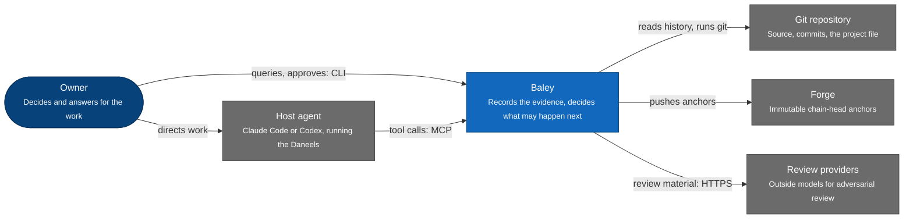

*Figure 1. System context, in the C4 model's sense. Baley sits between the owner, the host agent that runs the Daneels, the repository, the forge that holds its anchors, and the outside reviewers.*

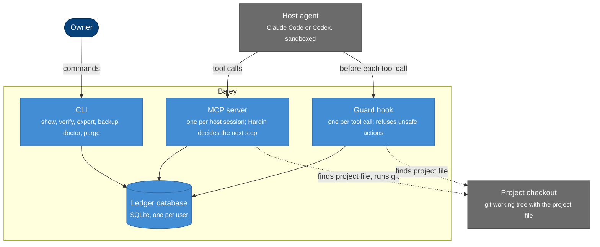

*Figure 2. Containers, in the C4 model's sense. Every solid arrow into the database goes through the same storage port. The host's sandbox keeps its agents out of Baley's home; only Baley's own processes reach the database.*

### Terms

| Term | Meaning |
|---|---|
| Event | One recorded fact. Immutable, typed, attributed, hash-chained. |
| Stream | The events of one thing that changes over time, such as one plan or one dispatch. Named, for example `plan/5-2`. Each stream has its own version counter. |
| Project sequence | The position of an event in its project's ledger. The hash chain follows this order. |
| Anchor | A copy of a project's chain head (sequence and hash) pushed to the forge as an immutable tag. |
| View | A keyed collection of documents computed from events, answering one kind of current-state question. |
| Generation | One complete set of a project's view documents. Readers and commands use the live generation; a rebuild builds the next one beside it. |
| View set version | The version a binary declares for its whole set of registered views, raised whenever a view is added, removed or renamed. |
| Projector | Domain code that updates views from an event. Pure: event and current documents in, document changes out. |
| Payload | Content stored once by hash, outside the event: large content, and every sensitive kind of content regardless of size. |
| Reference | One event's use of a payload, carrying the retention class for that use. |
| Command | One request from a caller that may record events. It carries a request id. |
| Claim | The intent event a command with an external effect records before acting. |
| Port | The set of storage traits the domain depends on. |
| Adapter | An implementation of the port for one engine. |
| Hardin | The part of Baley that reads views and names the one allowed next step. |
| Daneels | The agents, driven by a host, that do the work and record it through Baley's tools. |

### Detailed design

#### Crate structure (EVD-R12)

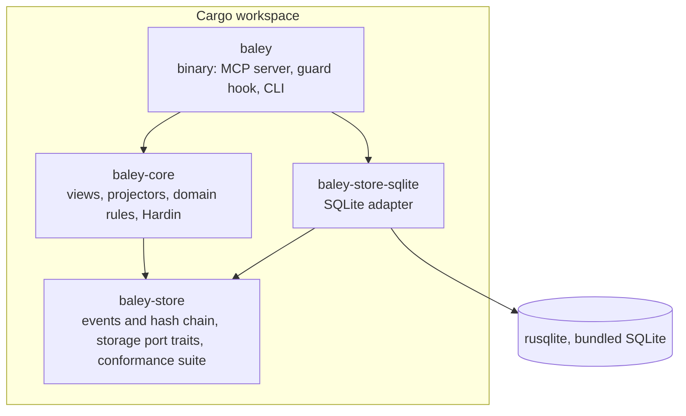

*Figure 3. Only the binary and the adapter know the engine exists. `baley-core` cannot import rusqlite, so domain code cannot reach SQL.*

The binary wires one adapter into the core at start-up. Tests of the domain run against the real SQLite adapter in a temporary directory or in memory; no fake store exists.

#### The storage port

The port is shaped around Baley's access patterns: by id, by phase, by (phase, plan), by request id, the audit history of one thing, and search. It is not a generic create-read-update-delete repository. [Appendix B](#appendix-b-reads-mapped-to-views) maps every current read to the view key that serves it.

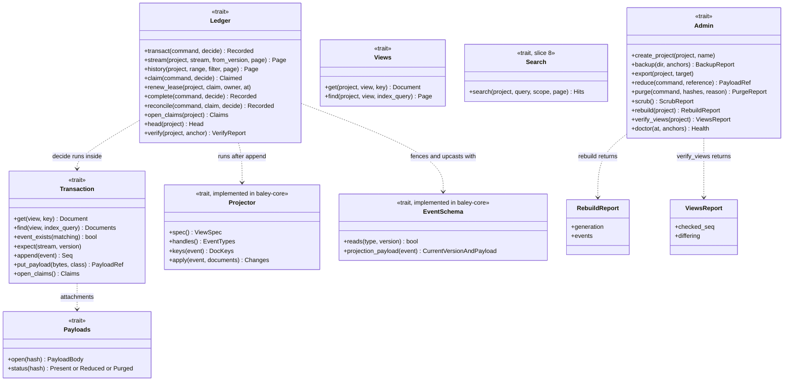

*Figure 4. The storage port. The decision runs inside the transaction with read access; projectors and the event schema live in the core and are handed to the adapter when the store opens, so the adapter never contains business rules. The `Projector` and `EventSchema` traits are defined in `baley-store`, and the store's own `request` projector lives there beside the `command.completed` event it reads (ADR 0010). `Search` arrives with slice 8.*

- **`transact`** runs one command's decision. The caller does its slow work first (tests, model calls, git work) and passes the results in. The adapter takes the writer queue, opens the write transaction and checks that the project's live `request` view was built at this binary's projector version. It checks the request, then fences a new request if any of the project's live views or its view set was built by a newer binary, or if the project holds an event type or version this binary cannot read (see [Views and projectors](#views-and-projectors-evd-r9-evd-r10-evd-r27)). A replay is answered before those fences. `decide` reads through `Transaction` and returns the inputs its caller observed. The adapter re-checks documents and absences against the store and compares the caller-supplied git facts seen and now. Reading git inside the transaction is issue #40, for Build 4. A decision confirms authority against events where required and appends events. Any `Transaction` operation's error fails the command, and a stored payload must be attached to an event. The adapter runs the projectors, writes each changed document once, and commits. If any step fails, nothing is recorded (EVD-R5).
- **`expect`** additionally names the stream that serializes a contested decision, so two commands that would both pass their own checks are ordered by one version counter. Each contested decision names its stream in [Serializing streams](#serializing-streams).
- **Views** are declared by the core as a `ViewSpec`: a name, a version, a key shape, indexed fields, the ordering of each index and a page-size bound. `find` reads by a declared index, never by scan, and returns a page with a cursor. A cursor is bound to the query, project, generation and view version that issued it and refused under any other. One query runs against one read snapshot, the same snapshot in which the adapter checks the project's live view versions.
- **`EventSchema`** is the core's registry of event types, handed to the adapter at open. `reads` says which types and versions this binary can read; a project holding any other is read-only for it. `projection_payload` gives an event's current type version and its payload upcast to that version. Projectors never see a stored event directly: ordinary projection and replay both hand them a copy carrying that version and payload.
- **Payloads** are read through a stream on its own connection and snapshot. A stream opened before a purge keeps reading its snapshot. A purged or reduced payload returns its status and tombstone. Bytes whose hash was reduced or purged cannot be stored again (`PayloadTombstoned`).
- **Search** is a capability with defined semantics: terms and quoted phrases, scoped by project and optionally phase, results in descending relevance with stable tie-breaking by sequence. The SQLite adapter implements it with FTS5 and BM25; nothing in the core depends on FTS5 syntax.
- **Admin** covers everything an owner does to the store as a whole. `scrub` is the standalone, idempotent end of a purge. `rebuild` returns a `RebuildReport`: the generation it made live and every event replayed into it, the final tail included, which for a chain without gaps is the head it flipped at. `verify_views` returns a `ViewsReport`: the head it compared at and each differing (view, key), sorted. The SQLite adapter provides `reduce`, `purge`, `scrub`, `rebuild` and `verify_views` as methods of its own until it implements the whole `Admin` trait with backup, export and doctor.

#### Events

Every event has an envelope and a payload.

| Field | Meaning |
|---|---|
| `project_id` | The project the event belongs to. |
| `seq` | Project sequence, starting at 1, no gaps. |
| `stream`, `stream_version` | The stream and its version after this event. Unique together within a project. |
| `type`, `type_version` | The event type, such as `plan.approved`, and the version of its payload schema. |
| `actor` | `owner`, an agent role (for example `daneel:executor`), or `baley`. |
| `recorded_at` | UTC time the event was recorded. |
| `request_id` | The command that recorded it. |
| `git` | The git facts the event depends on: `commit`, `tree`, and the `checkout` it was observed in. Absent when the event depends on none. |
| `policy_version` | The effective policy the command ran under. |
| `payload` | The event's typed content, as canonical JSON. Every fact a projector or the search index needs is inline. Attachments (outputs, review material, prompts, plan and context text) are references `{ "payload": "<sha256>", "bytes": n, "class": "<retention class>" }`. |
| `prev_hash`, `hash` | The hash chain. |

Payloads are JSON so that the ledger stays readable with standard tools and queryable through SQLite's JSON functions. For hashing, the envelope (without `hash`) and the payload are serialized with the JSON Canonicalization Scheme (RFC 8785), so the same event always hashes the same way on any platform.

Payload numbers are integers within ±(2^53 − 1); floats are refused, because RFC 8785 writes numbers as IEEE doubles. Events and view documents never carry payload body text: a decision puts body content in a payload and records its reference, and an inline fact is never an excerpt of a body. `command.*` and `payload.*` events are recorded only by the store; a decision that appends one is refused.

Event types are named `<family>.<fact>` in the past tense, and each has a payload schema version. A payload schema change adds a new version; old events are never rewritten and are read through an upcaster that converts old versions to the current shape (EVD-R19). Ordinary projection and replay both upcast in memory: projectors receive a copy of the event at its type's current version with its payload upcast, while the stored event, its hash and its references stay as recorded. The store's own `command.*` and `payload.*` types are read only at their exact recorded versions. An event type or version a binary does not know makes that project read-only for that binary.

Streams used by the record families:

| Stream | Examples of events |
|---|---|
| `project` | `project.initialized`, `policy.effective`, `checkout.seen` |
| `roadmap` | `phase.declared`, `phase.renamed`, `phase.reordered`, `requirement.declared` |
| `phase/<n>` | `context.approved`, `dispatch.issued` (serializes one active dispatch per phase), `phase.completed`, `completion.invalidated`, `phase.undone` |
| `plan/<n>-<k>` | `plan.submitted`, `plan.approved`, `plan.superseded` |
| `admission/<n>` | `execution.admitted`, `execution.extended` |
| `dispatch/<id>` | `task.started`, `task.run`, `task.closed`, `suite.run`, `dispatch.ended`, `worker.exited`, `worker.interrupted` |
| `verification/<id>` | `verification.started`, `verification.run`, `verdict.claimed`, `truth.waived`, `waiver.revoked`, `human.result`, `verification.completed` |
| `review/<id>` | `review.admitted`, `review.enqueued`, `review.delivered`, `review.returned`, `review.deferred`, `review.adjudicated`, `review.closed` |
| `risk/<n>` | `risk.observed`, `risk.fired`, `risk.receipt` |
| `milestone/<name>` | `milestone.close_ready`, `milestone.archived`, `release.proposed`, `release.confirmed`, `landing.started`, `landing.step`, `landing.completed` |
| `pause` | `pause.recorded`, `pause.resumed` |
| `task/<slug>`, `debug/<slug>`, `spike/<slug>` | the off-roadmap records |
| `capture` | `item.captured`, `item.resolved` |
| `guard` | `guard.allowed`, `guard.asked`, `guard.refused`, `guard.policy_recorded` |
| `command/<kind>` | `command.claimed`, `command.completed`, `command.reconciled` |
| `retention` | `payload.reduced`, `payload.purged` |

The full mapping from today's namespaces is in [Appendix A](#appendix-a-mapping-from-the-current-store).

#### Commands

A command is one request from a caller, carrying a request id.

**Request ids (EVD-R6).** The caller generates a fresh UUID for each command. Baley scopes it to the project and the command kind, so two sessions, two hosts or two command kinds can never collide or receive each other's answers. The request digest is the SHA-256 of the canonical form of the command kind and every field that carries authority (the approved content, the phase and plan, the target dispatch, the policy version). Guard decisions keep today's identity built from the host session and tool-call id.

**Outcomes.** Every command that reaches a domain outcome, success or a real refusal, records a `command.completed` event carrying the command kind, request id, digest, outcome kind, the git facts it depended on and the answer. An answer is inline when its canonical JSON is at most 4 KiB and is not sensitive; otherwise it is a `record` payload reference. This includes commands that record no other event. The `request` view is built from those events and is rebuildable like any other. A replay whose answer its own project released by purge or reduction returns its tombstone even when another project still requires the body. The event and request document keep the reference. Infrastructure failures (store busy, disk full) and stale-input refusals are not outcomes: nothing is recorded, and the caller re-reads and tries again with the same request id.

**Database-only commands** run in one transaction: check the request first, then decide, append, project and commit, as in Figure 6.

**Commands with an external effect (EVD-R26)** use three steps, because SQLite cannot roll back a git revert, a provider call or a pushed ref:

1. **Claim.** One short transaction checks the request and records `command.claimed` with the command's inputs and intended effect. A retry or a duplicate finds the claim and receives the in-progress or finished answer; it never repeats the effect.
2. **Act.** The external work runs outside any transaction.
3. **Record.** One more transaction re-checks the claim is still current, records the result events and `command.completed`.

**Active and interrupted claims.** A claim records its owner (process, host session and start time) and a scope. The owner holds a lease on the claim and renews it every 10 seconds while it works; the lease expires 60 seconds after the last renewal. Leases are liveness, not evidence: they live in a `claim_lease` table outside the chain, and renewing one records no event.

- A claim whose lease is current is **active**. It blocks only commands in its own scope; everything else proceeds.
- A claim whose lease has expired is **interrupted**: its owner died or lost its connection. Only an interrupted claim is reconciled.

| Claim | Scope it blocks while active or interrupted |
|---|---|
| Verification run or test | Another run of the same check |
| Undo's revert | Commands on that phase, and any command that writes git in that checkout |
| Landing step, release | The other steps of that milestone |
| Anchor push | Another anchor push for the project |
| Provider review call | Another delivery of the same review |

**Reconciliation.** When Baley finds an interrupted claim, at start or when a command in its scope arrives, it reconciles automatically wherever the real state can be read: an interrupted anchor push checks the remote for its tag, an interrupted test run is recorded as interrupted, an interrupted provider call is recorded as undelivered and may be retried under a new request. It stops for the owner only where the real state is ambiguous, as with a revert that may be half applied, which is today's undo rule. Either way, `command.reconciled` records what was found.

**Failures are outcomes.** An effect that fails cleanly (the remote refused the push, the provider returned an error) is a domain outcome: the record step commits `command.completed` with that result, and the claim is finished, not interrupted. A failed anchor push therefore never blocks work; the unanchored range grows, the next anchor point retries, and `doctor` warns once the unanchored range is more than a day old.

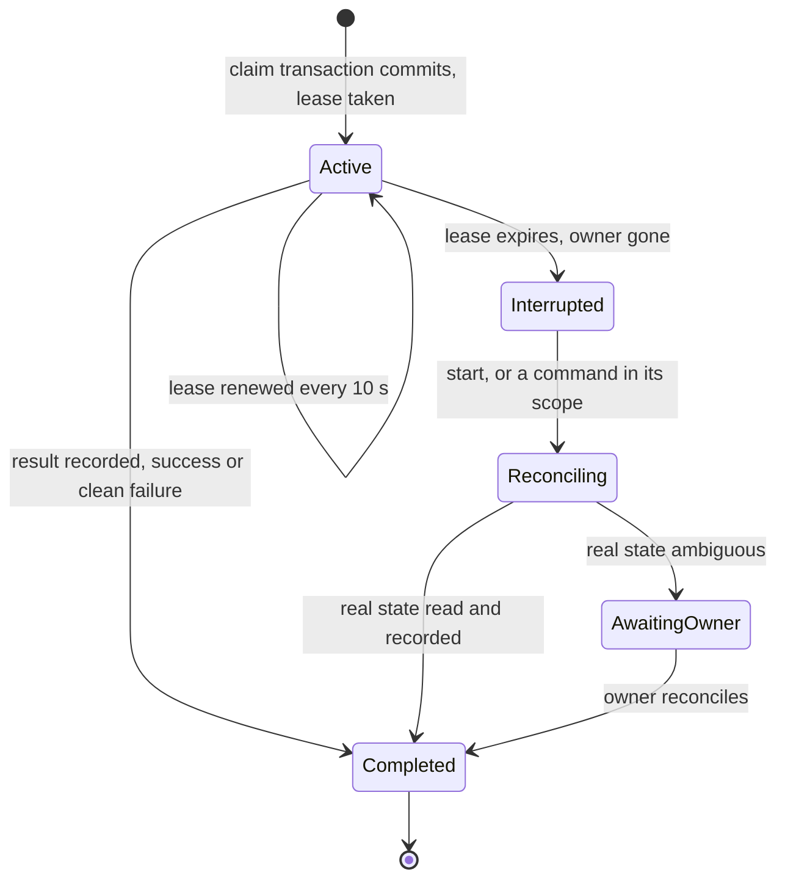

*Figure 5. A command with an external effect. An active claim blocks only its scope; only an interrupted claim is reconciled, automatically where the real state can be read. A claim is never re-executed.*

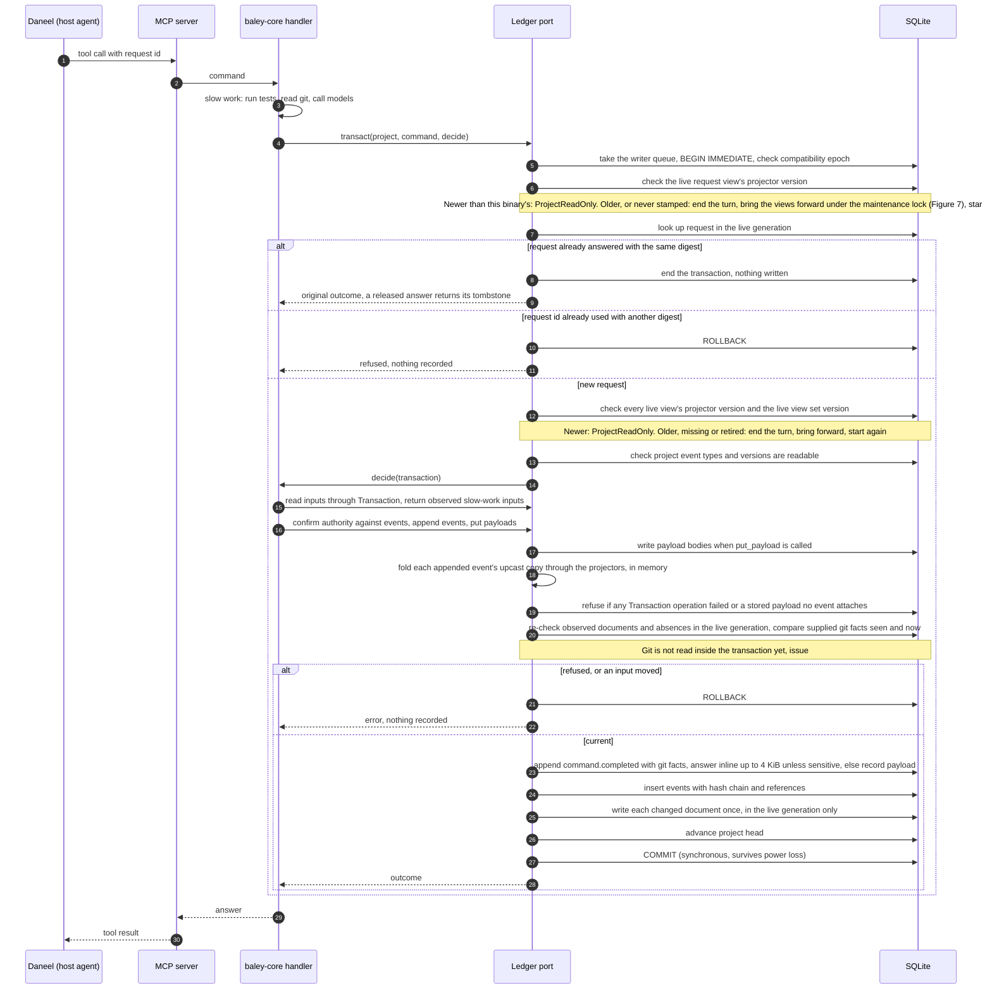

*Figure 6. A database-only command. The request is checked before the view and readability fences, and needs only the live `request` view at this binary's version. The caller supplies observed git facts; the adapter checks them and stores the outcome in the same transaction. A command writes only the live generation, even while a rebuild builds the next one.*

#### Serializing streams

| Contested decision | Serialized on |
|---|---|
| One active dispatch per phase | `phase/<n>` |
| Plan approval and supersession within a phase | `phase/<n>` |
| Admission and extension | `admission/<n>` |
| Verification completion and invalidation | `phase/<n>` |
| Milestone close, archive, release and landing | `milestone/<name>` |
| Roadmap changes | `roadmap` |
| Policy changes | `project` |

#### Git facts and checkouts (EVD-R4, EVD-R7)

Git state changes without any stream moving, so every event that depends on git records the facts it saw: HEAD commit, tree, and the checkout it came from. The cheap facts (HEAD and whether the index matches what the command observed) are supplied as seen and now values and compared inside the write transaction; anything that moved refuses the command. Reading git inside that transaction is issue #40, for Build 4. Slow git work stays before the transaction. Execution permission records the checkout it was granted to; another worktree of the same project must be admitted on its own.

The existing source checks are kept and run at these points:

| Check | Today | Runs |
|---|---|---|
| Verification claim recomputed at commit | `store/writer.rs:1196` | Inside `decide` for `verdict.claimed` |
| Source reachability, commit signatures, staged-path leases | `execution/receipts.rs:700-712` | Before `transact`, facts recorded; HEAD re-checked inside |
| Changed source or index refused on re-observation | `verification/inputs.rs:248` | Inside `decide` |
| HEAD unchanged during an execution request | `execution_service.rs:2131` | Inside `decide` |

#### The hash chain and anchors (EVD-R3)

Each project's events are chained in project-sequence order:

- `hash(1) = SHA-256("baley-ledger/1" || project_id || JCS(envelope(1)) || JCS(payload(1)))`
- `hash(n) = SHA-256(hash(n-1) || JCS(envelope(n)) || JCS(payload(n)))`

`prev_hash` is stored with each event so a break is located without recomputing from the start. A payload enters the chain as its reference, so the chain commits to the content's hash and length, not its bytes: it proves what was committed to, and when, even after the body is purged.

A chain whose head lives only in the database protects against accidents, not against someone who can rewrite the file and recompute every hash. So Baley anchors the head outside the machine. At every verified phase, every milestone step, and at least daily while a project is active, Baley pushes the tag `baley-anchor/<project_id>/<seq>`, whose annotation holds the sequence and head hash, to the project's forge remote. The repository's tag ruleset makes tags impossible to move or delete, for anyone. The anchor push is a command with an external effect and follows the claim, act, record steps.

`baley verify` walks the chain, recomputes every hash, checks every present payload against its hash, and compares the chain with the latest anchor fetched from the forge. It reports the first mismatch, a chain shorter than the anchor (truncation), or a head that differs from the anchor at the anchored sequence (rewrite or rollback). Changes after the latest anchor are checked against the local chain only; the report states the unanchored range. A project with no forge remote gets local verification only, and `doctor` says so.

The chain is per project, so one project's ledger can be exported and verified without the others (EVD-R15). Appending takes the database's single write lock, so a chain never forks.

#### Views and projectors (EVD-R9, EVD-R10, EVD-R27)

A projector is registered for the event types it cares about. For each appended event, the adapter makes a copy of the event at its type's current version with its payload upcast, loads the documents the projector names by key, calls `apply` with the copy, and folds the returned changes into the command's other changes in memory. Each changed document is written once, stamped with the project sequence of the last event that changed it and the projector version.

**Authority.** Views are fast, derived data. A decision that grants authority (admission, completion, landing, release) confirms its deciding facts against the events themselves inside its transaction, through `Transaction::event_exists`, so an edited view cannot grant authority.

**Generations.** Every view row carries a generation, and each project has one live generation, `project_gen.live_gen`, that readers and commands use. Commands write only the live generation, also while a rebuild runs. `view_gen` stamps each generation with each view's projector version and the view set version of the binary that built it, so an empty view still says which version built it. The `request` view is a view like any other and belongs to its generation.

**Rebuild.** A rebuild holds the maintenance lock (see [Processes and concurrency](#processes-and-concurrency-evd-r8-evd-r19)) from start to end. It first removes what an earlier rebuild left behind, then marks a new generation in `project_gen.building_gen`, numbered above the live generation and every generation still stored, and writes its `view_gen` stamps for every registered view, empty ones included. It replays the project's events into that generation in batches, each its own turn on the writer queue: at most 200 events, and once one event is applied, no further event after the batch has held the queue 15 ms. Each event goes through the same projectors as ordinary projection, as the same upcast copy, reading documents from the generation being built and never from the live one; each changed document is written once per batch, stamped with the last event that changed it, and `building_applied_seq` moves to the last event whose writes commit in that batch. After each batch the rebuild pauses as long as the batch held the queue. Commands that commit between batches change the live generation only, and a later batch reads their events. The final turn reads the current head, applies the tail after `building_applied_seq` and, only if the whole tail fits that same bounded turn, moves `live_gen` to the new generation and clears the marker in the same transaction, which switches every view at once. A tail too long for one turn commits its progress and tries again after the pause. Readers that open a snapshot after the flip see every view in the new generation, and readers already in a snapshot see the old one. A cursor issued under the old generation is refused as `InvalidCursor`, never translated.

The old generation is deleted before the rebuild returns, in turns of at most 200 document rows or 15 ms, each followed by the same pause: its rows in every view table `view_catalog` records, including tables of older versions and of views this binary no longer registers, then its `view_gen` stamps. A crash, or a rebuild abandoned between batches, leaves its generation and marker behind, never live; the next rebuild removes them before it starts, together with every generation that is neither live nor being built, found one at a time by keyed seeks on `view_gen` and on every view table. If deleting the old generation fails after the flip, the flip stands: `rebuild` returns an error saying the new generation is live, and the next rebuild removes what is left. Generation numbers only rise, so no number a cursor was issued under is used again.

**Versions.** The binary declares a version for its whole registered view set, `request` included, and raises it whenever a view is added, removed or renamed. When the store opens, `view_set_catalog` pins each set version to its sorted view names, as `view_catalog` pins each view version to its spec, and a set changed under a version already recorded is refused. Every `view_gen` row of a generation carries the same set version beside its view's projector version.

Before a project's views are used, by a read or a new command, the adapter compares the live stamps with this binary's: a read in the same snapshot as the document or page it returns, a command under the writer queue. A live set version, or a registered view's projector version, newer than this binary's makes the project read-only for this binary: its view reads and new commands are refused with `ProjectReadOnly`, because this binary's table at the newer generation can be empty, and answering from it would report an absence that is not true. History and payload reads still work. An older or missing set stamp, an older or missing view row, or a row for a view this binary retired rebuilds the project forward before use, under the maintenance lock; a caller that waited while another process did it finds the views current and goes on. A retired view's name alone never fences a project: the rebuild's cleanup removes its rows and stamps. A project with no events and no generation yet is stamped at generation 0 on first use, with nothing to replay. Open looks at no project, so a project whose views need work never keeps another from opening. A binary never rebuilds a view whose stored version is newer than its own; its `rebuild` and `verify --views` refuse that project too. A retry of a request already answered needs only the live `request` view at this binary's projector version, whatever the set stamp says.

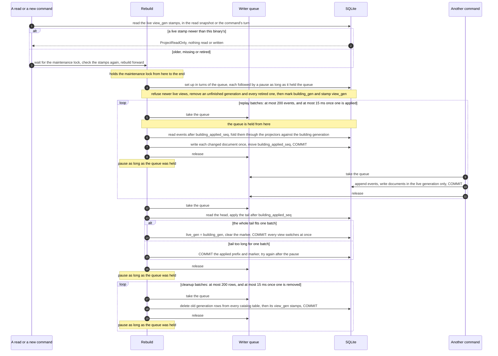

*Figure 7. A rebuild while commands run. The first use of a project whose views are behind this binary's starts one; `baley rebuild` starts one on its own. Each batch holds the writer queue only for its own turn and pauses outside it, so commands, which write only the live generation, run between batches. One transaction applies the tail and flips every view.*

**Verification of views.** `baley verify --views` takes the maintenance lock, so it never runs beside a rebuild. It first rebuilds forward views behind this binary's, and it refuses while an unfinished generation remains until a rebuild removes it. It replays the project's events into a scratch generation, stamped like a rebuild's, through the same batches and projectors, and never makes it live. In the turn that reaches the head it begins a read snapshot before releasing the writer queue, so scratch and live are compared at that one head however many commands follow. For every registered view it compares the two generations' rows key by key: key and index columns, `produced_seq`, `projector_version`, and the stored document text as bytes, so a live document that is not canonical JSON differs. It reports each missing, extra or unequal document once, as (view, key), with the head it checked. The scratch generation is deleted in the same batches afterwards, also after a replay or comparison error; a crash leaves it for the next rebuild. Verification never changes live rows, events or payloads. A report holds for the head it names only: a backup establishes its own snapshot.

Views planned for the first build, by the question they answer. Query contracts (keys, indexes, ordering, page bounds) are in [Appendix B](#appendix-b-reads-mapped-to-views).

| View | Key | Indexed by | Answers |
|---|---|---|---|
| `roadmap` | project | | The ordered phases and their declared requirements |
| `phase` | (project, phase) | status | Status, context, completion and whether it still applies |
| `plan` | (project, phase, plan) | status | Current content reference, approval binding, readiness |
| `evidence_map` | (project, phase, plan) | | The acceptance evidence a plan must produce |
| `admission` | (project, phase) | checkout | What execution may touch, and in which checkout |
| `dispatch` | (project, dispatch id) | phase, state | Active and ended dispatches, task and suite outcomes |
| `run` | (project, run id) | dispatch, phase | One run: launch, result, output reference |
| `verification` | (project, attempt id) | phase, state | Attempts, runs, claims, waivers, completion |
| `review` | (project, review id) | phase, state | Review attempts and their outcomes |
| `review_queue` | (project, item) | phase, state | Deferred reviews awaiting adjudication |
| `risk` | (project, phase) | | Observations and receipts |
| `milestone` | (project, name) | state | Close, archive, release and landing state |
| `pause` | project | | The active pause and its resume bindings |
| `policy` | (project, checkout) | | Effective policy and its layers |
| `guard_policy` | project | | The remembered denial policy |
| `capture` | (project, item id) | phase, disposition | The capture queue |
| `request` | (project, command kind, request id) | | Outcome of each command, for retries |

Hardin reads only views, and confirms authority against events. The next-action rules, progress and gate checks become queries over `phase`, `plan`, `dispatch`, `verification`, `review_queue`, `pause` and `capture`, not a walk over the whole store.

#### Payloads, retention and purge (EVD-R11, EVD-R14)

Content is stored as a payload when it is larger than 4 KiB, or when it is of a sensitive kind at any size: command output, review material, prompts. Payloads are compressed with zstd and keyed by the SHA-256 of the uncompressed bytes, so storing the same content twice stores it once. SQLite's own measurements put the crossover at about 100 KB: smaller content reads faster inside the database, larger content faster from files. The `Payloads` trait hides where bodies live, so an adapter can move large bodies to a content-addressed directory later without the ledger changing.

**Retention is per reference.** Each event that uses a payload records a reference with its own retention class:

| Class | Examples | Default retention |
|---|---|---|
| `record` | plan and context text, verdict detail | Kept for the life of the project |
| `output` | test and command output | Kept until the milestone that produced it closes, then reduced |
| `material` | review material, prompts sent to models | Kept for 90 days after its review closes |

These are the defaults. A project can change any of them in `baley.toml`, and `baley purge` removes a body at once regardless of class.

A reference stops requiring its body when its project records `payload.reduced` for it or `payload.purged` releasing it. A body is tombstoned when no unreleased reference remains in any project. A purge releases only the purging project's references and is recorded in that project's chain. Bodies are stored and read by hash, so a body another project still requires stays readable. A project may attach identical bytes again later as a new reference while another project still keeps the body.

**Reduction** applies only to an `output` reference. It stores the first and last 64 KiB as a new `record` payload attached to `payload.reduced`, which names the original hash, excerpt hash and byte ranges kept. An output of 128 KiB or less is kept whole and records no event. The store checks the original body's hash and length before releasing the reference. The original body is tombstoned only when no other reference still requires it whole. Reduction after purge is refused. Verification checks the excerpt in full and the original as a commitment.

**Purge** first releases the purging project's references to each named hash, including the excerpt references attached by that project's own reductions of an original. In one transaction it tombstones every body no unreleased reference requires, removes stored request answer bodies and derived trace rows, records `payload.purged` in the purging project's chain, and marks `scrub_pending`. Trace removal covers every row naming a removed body and the purging project's rows naming a body it no longer requires. A trace entry derived from a body must name it. Search rows join this removal in slice 8. Events, request rows and view documents remain; they hold no body text.

The `payload.purged` event lists each released reference as a `[source sequence, hash]` pair. Its `released` list and each `payload_ref.released_seq` can therefore be rebuilt from events alone. Trace removal covers a removed body's rows in every project and rows in the purging project only when that project has no other live reference to the hash. The report's `shared` list holds hashes released or requested whose body or excerpt is still required by another reference, in any project. This includes a requested original that stays reduced because another reduction requires its excerpt.

The standalone, idempotent scrub checks the compatibility epoch before any write, then holds the writer queue through a passive checkpoint, `VACUUM`, up to three truncating checkpoint attempts and the backup rewrite. It judges each truncating checkpoint's result row: only `busy = 0` completes the main database scrub and clears `scrub_pending`. Until then, purged bytes may remain in free pages or the write-ahead log, and `doctor` reports the pending marker. Each scrub rewrites the `.db` backups in the home for every hash that is not present in the live store. A backup receives tombstones without the removal event; its chain still verifies because the chain commits to hashes. A live reduced row becomes a purged backup tombstone with reason `reduced in live store`, since the backup may lack its excerpt. A backup skipped or not fully rewritten is listed as unreachable. If the scrub errors before the backup rewrite, the existing `backups` directory is listed as unreachable. A linked `backups` directory is listed and never followed. Exports are listed from T12's export records.

Purge removes a secret from everything Baley manages. A secret that has already reached a review provider, an export or any other system must still be rotated; the purge report says so.

**Invariant (EVD-R10).** Every fact a projector or the search index needs is inline in the event. Payloads are attachments only. So a purge never changes what a view knows, only whether an attachment's body can be shown, and a rebuild after any purge yields the same views, with tombstones in place of purged attachments. Replay after a reduction or purge reads the same inline facts: `payload.reduced` and `payload.purged` replay like any other event, the `request` view keeps each answer's reference, and replay never opens a payload body. So a rebuild or a view verification never reconstructs a purged body, an excerpt or a released reference. `payload_ref.released_seq` is not view data and a rebuild never touches it.

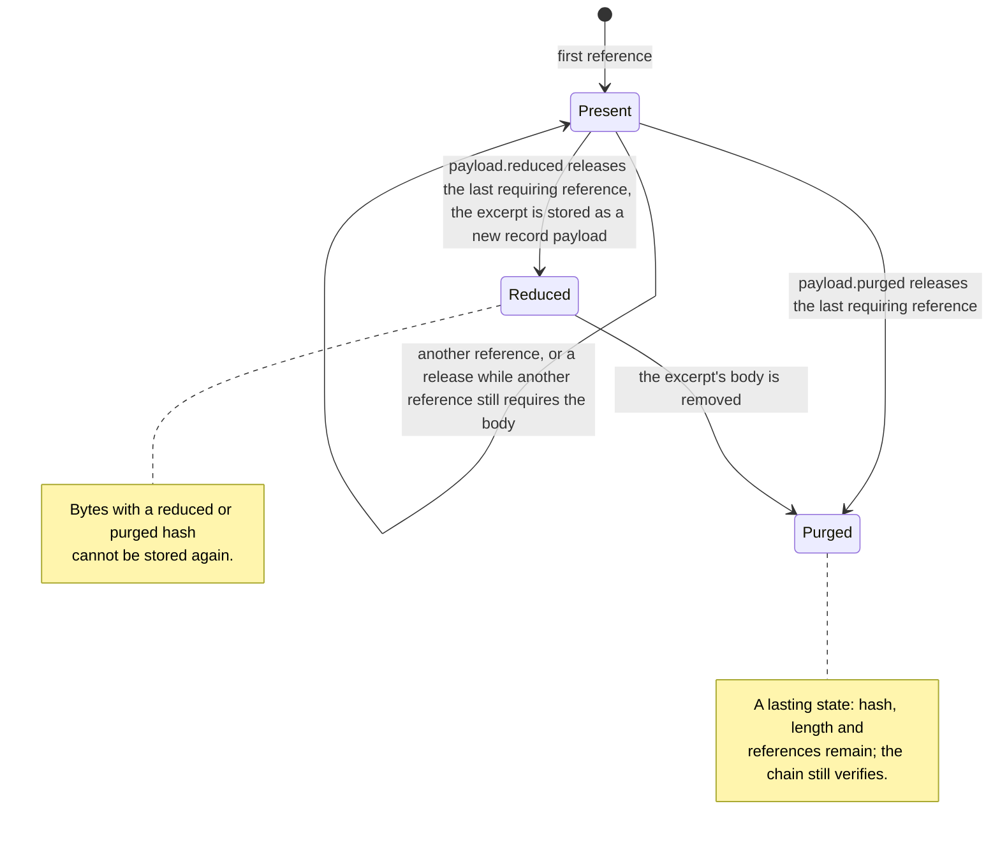

*Figure 8. Payload lifecycle. A body changes state only when its last requiring reference is released; there is no way back from a tombstone.*

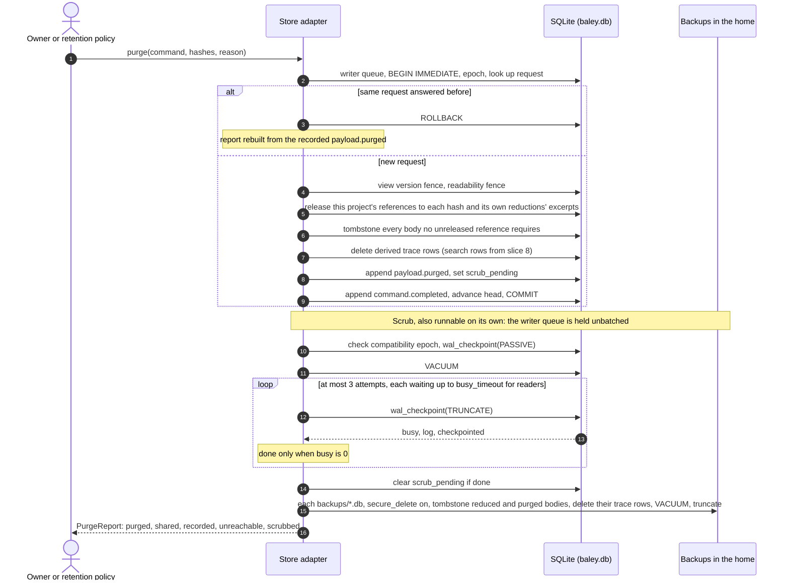

*Figure 9. A purge: the logical removal in one transaction, then the scrub. The scrub is idempotent and runs on its own too; a pending scrub is marked until it completes.*

#### Physical schema (SQLite adapter)

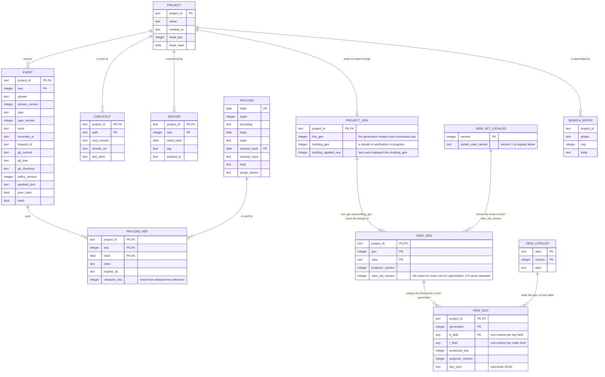

*Figure 10. Tables of the SQLite adapter at compatibility epoch 1. `VIEW_DOC` stands for one table per view version, `v_<view>_<version>`, with a `k_` column per key field and an `i_` column per index field; `request` is an ordinary view, and its documents belong to their generation like any other view's. `SEARCH_ENTRY` is an FTS5 virtual table that arrives with slice 8.*

Further tables: `schema_meta` (compatibility epoch, created and migrated times, and `scrub_pending`), `claim_lease`, and `trace` (diagnostics, outside the chain, size-capped, with an optional payload hash).

`project_gen` holds each project's live generation and, while a rebuild or verification runs, the generation it builds and the last event applied to it. `view_gen` holds, per generation, each view's projector version and the view set version of the binary that built it. Per generation, a view's documents and its `view_gen` stamp belong to that generation; a rebuild or cleanup never touches events, payloads, references and their `released_seq`, anchors, checkouts, leases, trace rows, `schema_meta` or either catalog. `view_catalog` records each view version's spec, and `view_set_catalog` each view set version's sorted view names, seeded with version 1 as `request` alone. Both are global and independent of any project's generations: they say what a version means, not which project uses it.

The schema stays at epoch 1 until the first release and is edited in place: `view_gen.view_set_version` and `view_set_catalog` are part of it, no table or column is added to an existing file at open, and a file written before such a change is disposable.

`PAYLOAD_REF.released_seq` is the sequence of the `payload.reduced` event naming its original `[seq, hash]` reference or of the `payload.purged` event listing that reference in `released`. It is derived from those events, not an independent fact.

Indexes: `event(project_id, stream, stream_version)` unique; `event(project_id, type, seq)`; `event(project_id, git_commit)` for `why`; `payload(excerpt_hash)` for non-null excerpts; `payload(state)` for non-present rows; `payload_ref(hash)`; `trace(payload_hash)` for a purge's trace removal; each view's declared indexes, each on (project, generation, its fields in their orders, the key).

Connection settings: `journal_mode=WAL`, `synchronous=FULL`, `foreign_keys=ON`, `secure_delete=ON`, `busy_timeout=5000`, page size 8 KiB. rusqlite's bundled build compiles SQLite from source (3.53.2 with rusqlite 0.40.1) with FTS5 enabled, so no system SQLite is used.

#### Location, layout and file safety (EVD-R16, EVD-R22, EVD-R23)

The home directory is `BALEY_HOME` if set, otherwise the platform data directory: `$XDG_DATA_HOME/baley`, falling back to `~/.local/share/baley`, on Linux; `~/Library/Application Support/baley` on macOS.

```
<home>/
  baley.db              the ledger database
  baley.db-wal          SQLite write-ahead log (managed by SQLite)
  baley.db-shm          SQLite shared memory index (managed by SQLite)
  baley.db.writer       the writer queue's lock file
  baley.db.maintenance  the lock a rebuild or view verification holds
  backups/              automatic backups before migrations, and scheduled backups
```

On every open, Baley resolves the real path of the database and checks: the home and database are owned by the current user; the home is mode 0700 and the files 0600, and anything more permissive is refused with the fix named; neither the home nor the database is a symbolic link; and the filesystem holding the real database path is local. Backups and exports are created private. User configuration lives in the platform configuration directory (`$XDG_CONFIG_HOME/baley`, `~/.config/baley` on Linux; `~/Library/Application Support/baley/config` on macOS).

Development builds and tests set `BALEY_HOME` so they never touch the owner's real ledger.

#### Project identity and policy (EVD-R17)

A project is initialized once with `baley init`. That creates the project in the ledger with a new random project id (UUID version 4) and writes the project file, `baley.toml`, at the repository root, which the owner commits. TOML allows comments, which a hand-edited policy file needs. The file holds the project id, the project name, and the project's policy: reviewers, routing and protected branches, the settings that today live in the repository config.

Baley finds a checkout's project the way git finds a repository: it walks up from the working directory to the first directory holding the project file, stopping at the repository root. The guard uses the same discovery. A directory with no project file is not managed and the guard stays silent. Every checkout Baley sees is recorded with `checkout.seen` (path, root commit, remote URL) for diagnosis only. If two checkouts whose remotes differ claim the same project id (a fork cloned beside its upstream), Baley refuses to record for the second and tells the owner to give it its own id with `baley init --new-id`.

**Effective policy.** Policy has layers, as today: built-in defaults, the owner's user configuration, and the project file, merged with today's precedence, and with settings that today are allowed only in the global file allowed only in the user configuration. Whenever the merged result changes, for any layer, Baley records `policy.effective` with the full merged policy and the layer each value came from. Every command records the policy version it ran under. Each checkout runs under the project file committed at its own HEAD; if two checkouts of one project run under different policies, Hardin reports the divergence and names both. The routing-admission rule is kept: a dispatch whose routing inputs changed since admission is refused.

Agents may not edit the project file; the guard refuses writes to it, as it refuses writes to the repository config today.

#### What replaces the Markdown and JSON files (EVD-R18, EVD-R25)

| Today | Replacement |
|---|---|
| `ROADMAP.md` phase list, read by every status query | `roadmap` stream and view. New commands declare, rename and reorder phases, which also gives the missing "add a phase" operation. |
| `REQUIREMENTS.md` traceability rows | `requirement.declared` events and the `roadmap` view. Completion and undo record events instead of editing rows. |
| `PROJECT.md` milestone version | The `milestone` view. |
| `phases/<n>/CONTEXT.md` | `context.approved` event; text is a `record` payload. |
| `phases/<n>/PLAN-k.md`, parsed by execution | `plan.approved` event carrying the approval binding; execution reads the typed plan from the `plan` view, never parses Markdown. |
| `phases/<n>/SUMMARY.md` | A query over the `dispatch` and `run` views. Git source accounting no longer needs an exemption for Baley's own files, because Baley writes none. |
| `phases/<n>/UAT.md` | `human.result` events. |
| `DEFERRED-*.json`, `ADJUDICATION-*.json` | `review.deferred` and `review.adjudicated` events; the `review_queue` view feeds next-action with today's precedence. |
| task, spike and debug Markdown | Their own streams and views. |
| `why` and `recall` reading Markdown from git history | `why` joins commits to the events that name them (`event(project_id, git_commit)`); `recall` uses the `Search` capability. Nothing is lost when a milestone is archived, because nothing is deleted. |
| Pause committing store files | `pause.recorded` carries today's resume bindings (preserved HEAD, branch, policy version, occurrence, next step); `pause.resumed` records a resume that passed those checks. Pause still commits the owner's work in progress; it never commits Baley's records. |
| Milestone prune deleting phase directories | `milestone.archived`, a separate owner-approved step bound to one exact `milestone.close_ready`, as prune is today. Archived phases leave the active roadmap; nothing is deleted. |

The owner reads records with `baley show <thing>` (for example `baley show plan 5-2`) and can write any record to a Markdown file with `baley export <thing> --to <path>`. Agents read them through the existing MCP `document` query, which is served from views. No file Baley exports is ever read back.

#### Working-tree writes

Baley's records never live in the working tree (EVD-R18). The only writes Baley makes there are:

- the project file, at `baley init` and when the owner changes policy through Baley;
- exports, to a path the owner names;
- the git operations that belong to commands: undo's revert, the release manifest bump, pause's work-in-progress commit, and landing.

#### Processes and concurrency (EVD-R8, EVD-R19)

Each process opens its own connection. SQLite's write-ahead log lets any number of readers run alongside one writer, and readers see a consistent snapshot.

- **MCP server.** One per host session. It keeps one write connection behind a single writer task, so its own commands queue in order, and a small pool of read connections.
- **Guard hook.** Starts per tool call, opens a connection without an integrity scan, reads the views it needs and, for a decision worth recording, appends one `guard` event. It holds no write transaction while it evaluates.
- **CLI.** Opens connections on demand.

**Writer queue.** Before `BEGIN IMMEDIATE`, every write, maintenance included, takes a blocking exclusive lock on `<home>/baley.db.writer`. The kernel parks waiting writers and wakes them when the lock is released, instead of SQLite's sleep-and-retry busy handler, which starved writers for seconds under load (see [Performance](#performance)). The lock is not strictly first-in, first-out, so rebuilds and generation cleanup run in short batches and pause after each batch for as long as they held the queue. The purge scrub is the one exception: it holds the queue unbatched through a passive checkpoint, `VACUUM` (one whole-database rebuild), the truncating checkpoint attempts and backup rewrite. It is an owner operation, so the pause is the owner's. Write transactions start with `BEGIN IMMEDIATE`, so a writer takes the database lock before reading and two writers never deadlock on an upgrade. `busy_timeout` stays at 5 seconds as a backstop, after which a writer fails with a clear "store busy" error. Projectors fold all of a transaction's events into their documents in memory and write each changed document once.

**Maintenance lock.** A rebuild or view verification also holds `<home>/baley.db.maintenance` from start to end, taken the way the writer queue is: an in-process mutex first, because `flock` belongs to the open file and two threads of one store would otherwise hold it at once, then a blocking `flock`, so threads of one process and separate processes take turns. Commands do not take it, so they run between a rebuild's batches. A read or command that finds its project's views behind this binary's waits for it with no timeout, checks the views again, and goes on without a rebuild if another process finished one meanwhile. A process that dies during a rebuild releases the lock and leaves the generation's marker for the next rebuild.

**Batch timing.** A store has one timing dependency, a monotonic clock and a pause, and every rebuild, cleanup and view verification batch uses it, whether started by the owner or by a project's first use. A batch's hold runs from acquiring the writer queue, not the wait for it, through commit and release; the 15 ms bound is read from the same clock, and the pause after the batch is as long as the hold. Tests supply their own instants and record the pauses asked for, so no test reads a live clock or sleeps.

**Compatibility epoch.** Every write transaction reads the compatibility epoch from `schema_meta` before anything else. A process whose epoch is older than the stored one stops writing, answers read-only, and tells the caller which binary is needed. Migrations raise the epoch in the same transaction that changes the schema, so an older process that is already running is fenced at its next write. Until the first release, the schema stays at epoch 1 and is edited in place: ledgers written before a release are disposable.

**Checkpoints.** SQLite folds the write-ahead log into the database automatically every 1,000 pages. A reader that never finishes would stop that and let the log grow without bound; Baley's reads are short-lived by construction, and the server runs a passive checkpoint when idle. `baley doctor` reports the log size.

#### Opening the store

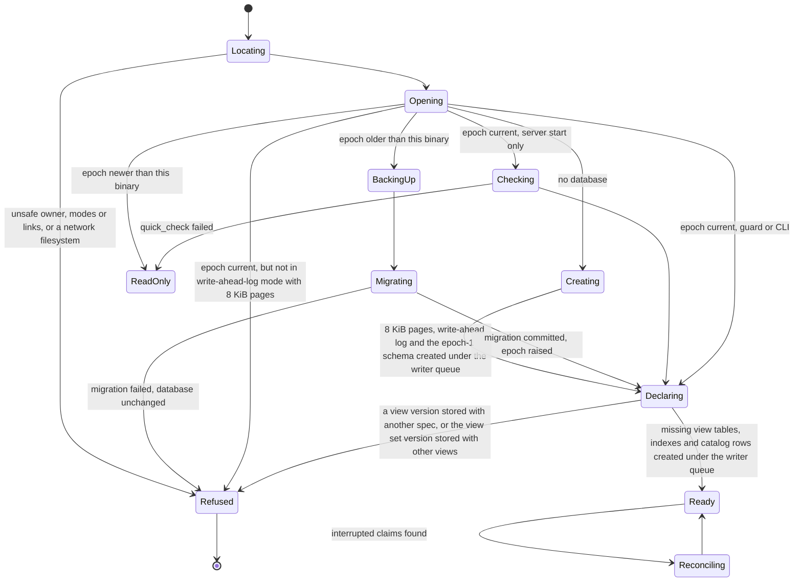

*Figure 11. Opening the store. A binary never writes to an epoch it does not understand, a failed migration leaves the database as it was, a changed view spec or view set needs a new version, and interrupted claims are reconciled before work in their scope continues.*

Open checks each declared view version's spec against `view_catalog` and the declared view set version's names against `view_set_catalog`, reading first on the read connection so that an open that finds everything in place takes no write. It records a spec or set version seen for the first time, creates missing view tables and indexes under the writer queue, and refuses a version already recorded with another spec or other names. It looks at no project's views: each project is brought to this binary's views on its first use, as in Figure 7, so one project that needs a rebuild never keeps the store from opening.

The MCP server runs SQLite's `quick_check` when it starts. The guard and the CLI do not, so a guard call never scans the database. The full `integrity_check`, chain and view verification run in `baley doctor` and before every backup.

### Workflows

#### From an approved plan to a verified phase

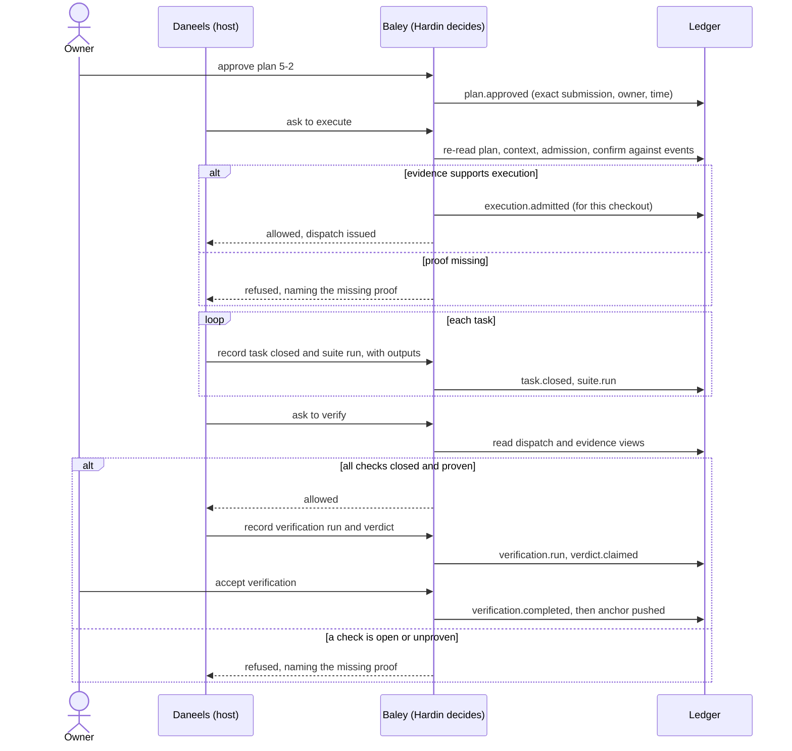

*Figure 12. One column per actor. Nobody but Baley writes to the ledger; each step's fact is recorded before Hardin allows the next one, a refusal names the proof that is missing, and a verified phase pushes an anchor.*

#### A retried tool call

A host may deliver the same tool call twice after a timeout. The second delivery carries the same request id, finds the stored outcome in Figure 6, and returns it. The lookup needs only the live `request` view at this binary's projector version; the project's other views and its view set stamp do not matter to a replay, even when a newer binary has since rebuilt them. Only a new request is fenced on every live view's version. If the retry's project released a stored answer by purge or reduction, the retry receives the tombstone even when another project still requires the body. The event and request document keep the reference. For a command with an external effect, the retry finds the claim and waits for, or returns, its result. Nothing is recorded twice and no effect runs twice.

#### Two sessions writing at once

Two sessions on different projects, or two agents on one project, each hold the write lock only for their commit. The second waits milliseconds at `BEGIN IMMEDIATE`. If both decided on inputs the first one changed, the second's `decide` re-reads them inside its transaction, sees the change, and refuses as stale; its caller re-reads and decides again.

## Rules preserved

Every rule below keeps its current behaviour (EVD-R28). Each gets an equivalence test that exercises today's case against the new design.

| Rule | Today | In the ledger |
|---|---|---|
| A plan's approval binds its exact submitted content, the owner and the time | `plan/persistence.rs:135` | `plan.approved` carries the submission digest, owner and time; admission confirms it against the event |
| Plan replay is scoped to its phase occurrence | `plan/persistence.rs:165` | Request scope (project, command kind) plus the phase in the digest |
| Completion binds context, publications, admissions and task and plan history, and stops applying when any of them changes or execution is undone | `verification/completion.rs:80-125` | The `phase` view computes applicability from the bound facts; `completion.invalidated` is projected when a bound fact changes; completion is confirmed against events when used |
| Verification records its launch before running | `verification/runner.rs:144-164` | Claim, act, record |
| Verification claims are recomputed at commit | `store/writer.rs:1196` | Inside `decide` |
| Undo records a pending state before its first revert and refuses to continue until an interrupted revert is reconciled | `undo_service.rs:108-112` | Claim, act, record, and reconciliation |
| Undo keeps its refusal receipts | `undo_service.rs:18` | `command.completed` for refusals |
| Landing records an intent per step and requires reconciliation | `landing_service.rs:245-287` | Claim, act, record per landing step |
| Release requires an exact unstarted landing and a retained confirmation | `milestone/release.rs:122-184` | `release.proposed` and `release.confirmed` as separate owner steps |
| Milestone close records readiness; prune is a later step bound to that exact close | `milestone_service.rs:113`, `milestone/prune.rs:94` | `milestone.close_ready`, then `milestone.archived` bound to it |
| Resume checks the preserved HEAD, branch, configuration and occurrence | `pause_service.rs:458-490` | `pause.recorded` bindings, checked by `pause.resumed` |
| Deferred reviews feed next-action with their precedence | `next_action/observations.rs:125`, `next_action/select.rs:93` | `review_queue` view |
| Config layers merge with repo over global, and some settings are global-only | `config/merge.rs:131`, `config/mod.rs:14` | `policy.effective` with the same precedence and scope rules |
| A dispatch whose routing inputs changed is refused | `config/reload.rs:190` | Kept; routing inputs are part of the policy version bound at admission |
| The guard falls back to its remembered denial policy when current config is missing or malformed; it remembers denials only, never permissions | `guard/bash.rs:169`, `guard/bash.rs:375`, `guard/audit.rs:165` | `guard.policy_recorded` events and the `guard_policy` view |
| The guard answers a re-delivered call with its confirmed answer, even after policy changes | `guard/bash.rs:486` | Request lookup on the guard's session and tool-call id |
| Guard outcomes: ask, deny, pass, pass on failure, redelivery, audit-storage failure | `guard/bash.rs`, `guard/audit.rs` | Same outcomes, recorded as `guard` events; storage failure keeps today's behaviour |
| One run can be read by its id | `execution_runner_service.rs:93` | `run` view |

## Cross-cutting concerns

### Security

See [Threat model](#threat-model) for who is defended against.

- **Agent isolation (EVD-R24).** Agents run as the owner's user, so file modes cannot keep them out. The barrier is the host's sandbox: Baley's setup adds a rule to each host's configuration that denies agents access to Baley's home. Claude Code's sandbox denies named paths for reading and writing. Codex's `workspace-write` sandbox confines agent writes to the workspace but grants full disk read under every policy, so on Codex an agent can read the ledger and cannot change it; nothing sensitive is kept outside payloads, and payloads can be purged. The host matrix showed on both hosts that agents are blocked from writing while Baley's server and hook still write. As a second, best-effort layer, the guard refuses file-tool writes into the home and shell commands that name it.
- **Detection.** Anchors on the forge make a rewrite, truncation or rollback detectable up to the latest anchor, even by an agent that can run `sqlite3` and sign with the owner's key.
- **Secrets.** Test output and review material can carry secrets. They are always payloads, so they can always be purged, with the limits stated in [Payloads, retention and purge](#payloads-retention-and-purge-evd-r11-evd-r14). The existing fence that screens outbound review payloads stays.
- **Network.** The store makes no network calls. Anchors are pushed with git to the project's own remote.

### Failure modes and recovery

| Failure | Detection | What the user sees | Recovery |
|---|---|---|---|
| Process killed in a database-only command | SQLite rolls back the uncommitted transaction | The command did not happen | Retry with the same request id |
| Process killed after a claim, during or after the external effect | The claim's lease expires | Commands in the claim's scope wait for reconciliation, naming the claim; other work continues | Reconcile against the real state; `command.reconciled` records it |
| Power loss after acknowledgement | None needed | Nothing is lost (`synchronous=FULL`) | None |
| Store busy longer than 5 s | `SQLITE_BUSY` after the timeout | "store busy" | Retry; `doctor` shows long-running holders |
| Disk full | `SQLITE_FULL` | The command is refused, nothing recorded | Free space; retry |
| Database corruption | `quick_check` at server start, `integrity_check` in doctor | Read-only, with the check's report | Restore the latest verified backup |
| Chain differs from its anchor | `baley verify` | The first bad sequence, truncation or rollback, and the unanchored range | Restore from backup; the difference is itself evidence |
| A view differs from its rebuild | `baley verify --views` | The documents that differ, and the head compared at | Rebuild the view; authority was never granted from it |
| Process killed during a rebuild or view verification | Its generation's marker remains in `project_gen.building_gen` | Nothing live changes; `verify --views` refuses until a rebuild | The next rebuild removes the unfinished generation before it starts |
| Deleting the old generation fails after a flip | The rebuild's cleanup error | `rebuild` says the new generation is live and the old one is left; a rebuild started by a project's first use goes on with the current views | The next rebuild removes the old generation |
| Older binary after a newer one rebuilt a project's views | The live view stamps, checked in each view read and new command | That project's view reads and new commands are refused as read-only; history, payloads and other projects still work | Use the newer binary |
| Older process after an upgrade | Epoch check in its next write | Read-only, naming the needed binary | Restart with the new binary |
| Migration fails | Transaction error | Refused; database unchanged; backup kept | Report the bug; the old binary still works |
| Unsafe home or a network filesystem | Checks on open | Refused with the reason and the fix | Fix modes or ownership, or set `BALEY_HOME` to a local path |
| Anchor push fails cleanly (remote unreachable or refused) | `command.completed` with the failure | Nothing blocks; `doctor` warns once the unanchored range is over a day old | Retried at the next anchor point |
| Write-ahead log grows | Log size in doctor | Warning in doctor | Idle checkpoint; find the long reader |
| Purge scrub held back by an open reader, or interrupted | The truncating checkpoint's row reports busy; `scrub_pending` remains | Scrub incomplete; `doctor` shows it pending | Close the reader and run the scrub |
| A backup in the home cannot be rewritten | The backup rewrite fails or skips it | Listed as unreachable | Fix or delete that backup file |

### Performance

Budgets on the reference workload, and what the benchmark measured: p99 unless stated, median of five runs, worst run in brackets, on a fast drive (Crucial T700) and a slower one (Crucial P3 Plus, QLC).

| Operation | Budget | Fast drive | Slower drive |
|---|---|---|---|
| Open a connection with the ownership, link, filesystem and epoch checks (guard, CLI) | 10 ms | 0.24 ms (0.27) | 0.26 ms (0.28) |
| Server start with `quick_check` (five projects) | 2 s | 174 ms (183) | 184 ms (192) |
| Commit a command, excluding the command's own work | 20 ms | 8.7 ms (14.0) | 11.0 ms (11.6) |
| Commit a command of 10 events | 20 ms | 9.0 ms (13.0) | 12.6 ms (17.6) |
| Get one view document by key and parse it | 2 ms | 0.02 ms | 0.02 ms |
| Guard hook, store work only, in a new process | 25 ms | 6.5 ms (15.5) | 11.7 ms (17.0) |
| Wait for the write lock with 8 sessions writing continuously | 250 ms | 34 ms (52); longest 78 ms | 51 ms (68); longest 64 ms |
| Rebuild every view of the reference project while writers run | 30 s | 8.5 s (9.0) | 10.9 s (11.4) |
| Longest rebuild batch | 100 ms | 43 ms (99) | 38 ms (39) |
| Rebuild's final flip | 50 ms | 2.8 ms (4.1) | 4.4 ms (4.8) |

Size budget: the reference workload stores in at most 50 MB, counting the database, its write-ahead log after a checkpoint, and every payload body under default retention, with retired prompt text included. **Measured: 24.5 MB**, against 175 MB for the same history in the JSON store. Memory: no operation loads more than its answer; the server's resident memory does not grow with the store. The prototype has no long-running server, so this is verified during the build.

A rebuild batch is timed from acquiring the writer queue to releasing it, commit included and the wait to acquire it excluded; the pause after it is not part of it. The final flip is the last turn of a rebuild, measured the same way: reading the head, applying the tail and moving `live_gen`.

The commit budget was 10 ms before the benchmark. Commit time is mostly the flush that makes a commit durable, and it spikes occasionally on both drives; 20 ms keeps the same meaning (a commit a person never notices) with the flush measured. The rebuild-batch budget moved from 50 to 100 ms for the same reason.

**How it was measured.** A prototype of the SQLite adapter in [`spikes/evidence-ledger-bench`](../../spikes/evidence-ledger-bench/README.md) replays a numbers-only profile of the Cadence 4.0 build (1,551 commands, 1,615 events, 618 attachments), with synthetic content calibrated to the zstd ratio measured on each class of real content. It pays every cost the design puts in a transaction: the request check, the decision's re-reads, the authority check against events, the cheap git facts, the hash chain as specified, payloads and references, projectors, the search index, claim and record transactions for external effects, and `command.completed`. Writers run as separate processes; rebuild and backup run while writers write. Each drive ran five independent runs, with the page cache warm. Raw results are in `spikes/evidence-ledger-bench/results/`. Across all runs on both drives: no errors with the writer queue, and a rebuild or a purge never changed a view.

**What the benchmark changed in this design.**

- **Writer queue.** With SQLite's busy handler alone, 8 writers waited 629 ms at p99 and up to 4.9 s on the fast drive, and some writers failed on the slower one; commands per writer ranged from 743 to 2,014. With the queue, every writer committed 1,176 or 1,177 commands and none failed. See [Processes and concurrency](#processes-and-concurrency-evd-r8-evd-r19).
- **Maintenance yields.** The queue's file lock is not first-in, first-out, so a rebuild taking batch after batch made one writer wait 761 ms. Maintenance now pauses after each batch for as long as it held the queue.
- **One write per document per transaction.** Projectors fold all of a transaction's events into their documents in memory and write each document once. Before, a 10-event command rewrote the same documents ten times.
- **Generations for rebuilds.** Swapping rebuilt rows into the live tables took up to 60 ms per view. Views now carry a generation, and a rebuild flips one number (see [Views and projectors](#views-and-projectors-evd-r9-evd-r10-evd-r27)).
- **Purge.** Search rows derived from a payload are found through an index, not a scan (the purge transaction went from 220 ms to 9 ms), and a purge ends with a truncating checkpoint after `VACUUM`.

SQLite's limits sit far beyond these numbers: 281 TB per database and about 1 GB per stored value.

### Observability

- `baley doctor` reports the compatibility epoch, `integrity_check`, chain verification against the latest anchor per project, view verification, write-ahead log size, database size by record family and retention class, view versions and lag, active and interrupted claims, the age of the unanchored range, and backups present.
- The `trace` table records diagnostics (timings, retries, busy waits) outside the chain, with its own size cap and rotation.
- Every refusal carries a stable code and the facts that caused it, as refusals do today.

### Host neutrality (EVD-R24)

| Concern | Claude Code | Codex | Evidence |
|---|---|---|---|
| Project discovery from the working directory | Hook and MCP server start in the session's directory, which may be a subdirectory | Same | Shown: both hosts start the MCP server with the session's directory as its working directory, and today's server binds that directory as the project. The hook already walks up. The server walks up too (slice 2). |
| Hook contract (tool names, event names, answer format) | `PreToolUse`, `Bash`, `Write`, `Edit`; answers `allow`, `deny`, `ask` | The same `PreToolUse` event and stdin fields, `Bash` for shell; answers `deny` and exit code 2 only: `ask` is rejected as unsupported and the command runs | Shown: the hook's input needs no adapter. The guard's answer does: on Codex every `ask` becomes `deny` with the same reason, so a push that would ask for permission on Claude Code is refused on Codex. Proven at slice 3. |
| Re-delivered tool calls | Retries after timeout | Retries after timeout | Shown for the hook: the same session and `tool_use_id` get the confirmed answer. Proven for MCP calls at slice 1, where the `request` view lands. |
| Access to Baley's home | Server and hook write; agents denied read and write by the sandbox rule | Server and hook write; agents denied write by `workspace-write`, reads allowed | Shown on both. Claude Code: a denied read looks like a missing file, a denied write exits 0 and nothing lands. Codex: the write is refused with "Read-only file system"; every Codex sandbox policy grants full disk read, so on Codex agents can read the ledger. |
| Store unreachable | Guard applies today's rules for a missing or failed audit store | Same | Shown: the guard answers pass-on-failure with its reason, and a denial still stands. |

**How it was measured.** The probes in [`spikes/host-matrix`](../../spikes/host-matrix/README.md) run one throwaway non-interactive session per host from a subdirectory of this repository, with a hook and a stand-in MCP server that record where they ran and whether they could write a stand-in home outside the checkout, and an agent that is asked to read and write that home. Run on 2026-09-25 with Codex CLI 0.156.1 and Claude Code 2.1.282 on Linux. The matrix is run again before each release.

### Compatibility and migration

Nothing is migrated from the Cadence store; Baley starts empty. Ledgers written while the migration is under way are disposable, and the builds in between are development builds: nobody else uses Baley yet. No data rollback is promised; each slice can be reverted as code.

Families are moved by what is written together, not one at a time:

| Family | Written in the same transaction as | Read together with |
|---|---|---|
| Roadmap, requirements | Plan publication (seeds requirements), completion (ticks phase and requirements), undo | Progress, next action, audit |
| Context | Plan publication (validates against it) | Admission, verification, review selection |
| Plans, evidence maps | Requirements | Admission, dispatch, verification |
| Admission, execution, dispatch, runs | Native summaries, evidence | Verification, progress, undo |
| Native evidence | Task checkpoints | Next action, execution |
| Verification | Completion edits roadmap and requirements | Progress, milestone |
| Review | Review families only | Selection reads plans and context |
| Risk | Risk families only | Suggest, milestone preflight |
| Milestones, landing, undo | Undo edits roadmap and requirements | Progress |
| Captures, config and routing, task, debug, spike, guard | Their own families | Their own readers |

Slices:

1. **Foundation.** The workspace split, the port, the SQLite adapter, the conformance suite, payloads and references, the hash chain, anchors, `verify`, `doctor`, `backup`. Nothing uses it yet.
2. **Identity, location and policy.** The home directory and its checks, `baley init`, the project file, discovery for the server and the guard, `policy.effective`, host sandbox rules.
3. **Standalone families.** Captures; guard, with the Codex answer adapter (`ask` becomes `deny`); task, debug and spike.
4. **The lifecycle slice.** Roadmap, requirements, context, plans, evidence maps, admission, execution, dispatch, runs, native evidence and verification move together, built as a series of pull requests on one branch and merged when the whole slice works.
5. **Review and risk.**
6. **Milestones, landing, undo and pause.**
7. **Hardin on views.** Progress, next action and the gates read only views.
8. **Search and why.**
9. **Removal.** The JSON store, the intent journal, participants, root binding, the Markdown renderers and parsers, and every `.planning` path.

## Alternatives considered

**Keep the JSON documents.** Rejected. The copies and the machinery to reconcile them are the problem, and a single document cannot answer a keyed query without reading the whole store (Context).

**SQLite as plain state tables, without a ledger.** Simpler: update rows in place. Rejected because it keeps only the present. Baley's product is the proof of what happened; overwriting rows discards it, and an audit trail bolted on afterwards becomes a second copy again.

**Git as the database**, as git-bug and git-appraise do. Attractive: content addressing, signing and transport come built in. Rejected for now because every query still needs a local index (both projects keep one), concurrent writers must serialize on reference updates, and query latency on large histories is poor. Git is used for what it does best here: holding the immutable anchors.

**An embedded key-value store** (redb, sled). Fast and pure Rust, but no query language, no full-text search, and every index would be hand-built, which is the mistake the current store made with JSON.

**A database server** (PostgreSQL). Rejected for a single-user tool: a daemon to install, run and upgrade, for concurrency Baley does not need. The port keeps it possible as a future adapter for teams.

**One database file per project.** It contains the blast radius and makes per-project export trivial. Rejected in favour of one database per user because cross-project questions become simple queries and there is one schema to migrate and one file to back up; per-project chains and `export` give the same per-project verifiability. See ADR 0003.

**The database inside `.git/`.** Shared by all worktrees and never committed, but deleted with the clone. Rejected because the ledger is the historical record and must outlive any checkout. See ADR 0003.

**Filesystem identity for projects** (today's inode binding). Rejected: the store could not move, be restored or be rebuilt. See ADR 0004.

**A chain anchored only inside the database.** Rejected: the attacker Baley exists to stop, an agent running as the owner, can recompute it. See ADR 0007.

**Tracking every read's version instead of deciding inside the transaction.** Correct in principle, but a single missed read is a silent bug. Deciding inside the single-writer transaction is correct by construction.

**A separate operating-system user for Baley.** Real separation, but it needs a daemon, a privileged install step and different setups on Linux and macOS. Kept as future work. See ADR 0008.

## Testing

| Requirement | How it is proven |
|---|---|
| EVD-R2, R3 | Conformance tests append events, verify the chain, then in a copy of the database in a temporary directory: alter, insert, delete and reorder rows; recompute the whole chain after an edit; truncate the tail; restore an older copy. Against a local anchor fixture, `verify` names the first bad position, the truncation or the rollback. |
| EVD-R5 | A conformance test fails a projector mid-command and asserts no event, view change, payload, reference or outcome was recorded. |
| EVD-R6 | Replay of a request id with the same digest returns the original outcome; with a different digest it is refused; two sessions using the same id for different command kinds do not collide. |
| EVD-R7 | A command whose view input, absence query or HEAD changes between its slow work and its transaction is refused as stale. |
| EVD-R8 | Several connections to one database in a temporary directory interleave reads and writes. |
| EVD-R9 | Each view's query contract (key, index, ordering, paging, bound) is tested against a fixture. |
| EVD-R10 | Each projector has unit tests: event and documents in, changes out. Two fixture views with hand-written expected documents: live projection and a rebuild both produce them, the rebuild with a corrupted live document present; a command committed between two replay batches reaches the new generation; a projector failing on the tail in the final turn leaves `live_gen` and both views on the old generation; an abandoned rebuild changes nothing live and the next rebuild removes it; an old event replays upcast without its stored row changing; after a reduction and a purge the rebuilt `request` document is unchanged; a view added or removed with a new view set version fences an older binary or rebuilds and cleans the removed view's rows. `verify --views` reports a corrupted live document by key at the head it compared and removes its scratch generation after a projector error. A cursor issued before a flip is refused. A conformance test rebuilds every view, including through a simulated crash mid-rebuild, and compares it with the live one; the same after a policy purge and after a targeted purge. |
| EVD-R11, R14 | Identical content is stored once; the body decompresses to the original bytes and matches its hash; reduction stores an excerpt with its own hash; a shared body survives one project's purge; a purge removes stored request answer bodies and derived trace rows while leaving view documents and the request row unchanged. Search entries are covered from slice 8. |
| EVD-R12 | The crate graph is the test: `baley-core` has no path to rusqlite, checked by `cargo tree` in CI. |
| EVD-R13 | Search returns hits in relevance order with stable ties, scoped by project and phase, over a fixture corpus. |
| EVD-R15 | An exported project verifies alone. |
| EVD-R16, R17, R22, R23 | Location resolution, project discovery and the open checks run against directory trees built in a temporary directory with `BALEY_HOME` set: wrong owner, permissive modes, a symbolic-linked home or database, and a filesystem classified as networked. |
| EVD-R18 | Each command's test asserts it writes nothing in the working tree beyond the named exceptions. |
| EVD-R19 | Opening a database stamped with a newer epoch yields read-only; a second connection at the old epoch is fenced at its next write; a migration test upgrades a fixture of the previous schema and verifies a backup was taken first; a newer view is never rebuilt backward, and a project whose live view or view set a newer binary built refuses an older binary's view reads and new commands; an older or missing view stamp rebuilds forward before use; a view set changed without a new version is refused at open. |
| EVD-R20 | Relies on SQLite's documented durability with `synchronous=FULL`. Power loss is not reproducible in a portable test and is not re-tested. |
| EVD-R21 | The benchmark harness measures every budget on the reference workload. Timings are measured, not asserted in tests, because timing is not portable. |
| EVD-R24 | The host matrix, run by hand on both hosts before acceptance (done 2026-09-25, `spikes/host-matrix`), and again before each release. |
| EVD-R25 | `show` and `export` render every record family from views. |
| EVD-R26 | While a claim is active, commands outside its scope proceed and commands inside it wait; a retry during the effect never repeats it. After the owner is killed and the lease expires, a command in scope triggers reconciliation; an anchor claim reconciles automatically from the remote; a revert claim waits for the owner. A cleanly failed anchor push completes the claim and blocks nothing. |
| EVD-R27 | An edited view document that says "approved" or "complete" does not grant admission or completion, because the event is missing. |
| EVD-R28 | One equivalence test per row of [Rules preserved](#rules-preserved). |

The conformance suite lives in `baley-store` and runs against every adapter.

## Decisions

- [ADR 0001: Record evidence as an append-only, hash-chained event ledger](../adr/0001-event-ledger.md)
- [ADR 0002: Use SQLite as the storage engine](../adr/0002-sqlite.md)
- [ADR 0003: Keep one ledger database per user, outside any checkout](../adr/0003-per-user-database.md)
- [ADR 0004: Identify projects by a committed project file](../adr/0004-project-identity.md)
- [ADR 0005: Put storage behind a port with engine adapters](../adr/0005-storage-port.md), superseded in part by ADR 0010
- [ADR 0006: Keep every operational record in the ledger](../adr/0006-no-markdown-records.md)
- [ADR 0007: Anchor chain heads on the forge](../adr/0007-forge-anchors.md)
- [ADR 0008: Use host sandboxes to keep agents out of the ledger](../adr/0008-host-sandbox-isolation.md)
- [ADR 0009: Serve instructions from the binary; files on disk are stubs](../adr/0009-served-instructions.md)
- [ADR 0010: Define the projector and event schema traits in the port](../adr/0010-projector-traits-in-the-port.md), superseding ADR 0005 in part

## Future work

- **Records that travel.** Push a project's chain to a git ref so another machine can fetch and verify it.
- **Signed checkpoints** with a key the agent cannot use, for example a hardware key that needs a touch.
- **A separate operating-system user** for the store.
- **A server adapter** for teams sharing one ledger.

## Open questions

None. The benchmark and the host matrix, the two acceptance gates, are answered above.

## Appendix A: Mapping from the current store

| Current namespace or file | Becomes |
|---|---|
| `context` | `phase/<n>` stream, `context.approved`; `phase` view |
| `plan_publications` (publications, receipts) | `plan/<n>-<k>` stream; `plan` view; receipts replaced by `command.completed` and the `request` view |
| `acceptance_maps` | `plan.approved` payload; `evidence_map` view |
| `native_admissions` | `admission/<n>` stream; `admission` view |
| `execution` (occurrences, active, issues) | `phase/<n>` and `dispatch/<id>` streams; `dispatch` view |
| `native_tasks`, `native_plans` | Task and suite events on `dispatch/<id>`; `run` view; outputs become `output` payloads |
| `native_execution_summaries` | Dropped: the summary is a query |
| `native_execution_material` | `task.closed` payload |
| `rail_execution_material` | Dropped: written only by the legacy executor-patch path |
| `worker_exits`, `worker_interruptions` | `worker.exited` and `worker.interrupted` events |
| `verification` (attempts, runs, claims, patches, waivers, humans, completions) | `verification/<id>` stream; `verification` view. The copy of execution records inside each attempt is replaced by the sequence range it observed |
| `native_evidence` | Evidence events on the stream they concern; order comes from the project sequence, not a log scan |
| `review` | `review/<id>` stream; `review` and `review_queue` views; retained material becomes `material` payloads |
| `rail_observations`, `rail_receipts` | `risk/<n>` stream; `risk` view |
| `milestones`, `milestone_prunes`, `milestone_releases`, `landings` | `milestone/<name>` stream with separate close, archive, release and landing steps; `milestone` view |
| `undos`, `undo_requests` | `phase.undone` events through claim, act, record; refusals through `command.completed` |
| `task`, `debug`, `spike` | Their own streams and views |
| `derivation.memo` | Dropped: the views are the derived state |
| `guard_audit` (initialization, `denial_policy`) | `guard` stream; `guard.policy_recorded` and the `guard_policy` view keep the remembered denial policy |
| `import`, `layers` | Dropped: no import; configuration history is `policy.effective` events |
| Envelope `operations`, `generation`, `integrity`, log digests | Replaced by `command.completed`, stream versions, the compatibility epoch and the hash chain |
| `decisions.jsonl` gate, routing and boundary lines | Replaced by the events themselves; nothing is mirrored |
| `items.jsonl` | `capture` stream; `capture` view |
| `trace.jsonl` | `trace` table |
| `phases/*/DEFERRED-*.json`, `ADJUDICATION-*.json` | `review.deferred`, `review.adjudicated`; `review_queue` view |
| `.planning/*.md`, `phases/**` | See [What replaces the Markdown and JSON files](#what-replaces-the-markdown-and-json-files-evd-r18-evd-r25) |

Found unused in the current code and not carried forward: the store operations `AdmitExecution`, `ApplyExecutionPatch` and `RecordExecutionRefusal`, and the helpers `installed_spikes`, `installed_debug` and `installed_tasks`.

## Appendix B: Reads mapped to views

Every read the MCP server serves today, and the view and key that serve it. All queries page with a cursor and are bounded; lists are ordered as stated.

| Query operation | View and key | Order |
|---|---|---|
| `progress` | `roadmap` (project); `phase` by status; `dispatch` by state; `capture` by disposition; `review_queue` by state; `pause` (project) | Roadmap order |
| `execute-next` | `phase`, `plan`, `admission`, `dispatch` for (project, phase); evidence events for the phase | |
| `verify-next` | `phase`, `plan`, `evidence_map`, `dispatch`, `verification` for (project, phase) | |
| `verification-read` | `verification` (project, attempt id), or by phase index | Newest first |
| `verification-audit` | `roadmap` requirements; `phase` and `verification` by phase | Roadmap order |
| `execution-history` | `dispatch` by phase; `run` (project, run id) with a payload stream for output | Sequence |
| `evidence-read` | `evidence_map` (project, phase, plan); evidence events for the plan | Sequence |
| `plan-read` | `plan` by phase; `evidence_map` | Plan number |
| `context-intake` | `phase` (project, phase); `roadmap` | |
| `document` | By identity: `phase` for phase context; `plan` for a phase plan; `dispatch` for a dispatch; `verification` for an attempt; `run` for run output; `review` for a review entry; `roadmap` for a roadmap row; `task`, `debug`, `spike` by slug | |
| `document-search` | `Search` scoped to (project, phase), returning identities and parts | Relevance |
| `recall` | `Search` scoped to the project, optionally a phase | Relevance |
| `why` | `event(project_id, git_commit)` index, then the events' streams | Sequence |
| `suggest` | `risk` by phase; routing and outcome events by type | Newest first |
| `risk-status` | `risk` (project, phase) | |
| `route`, `config-entry`, `config-facts`, `config-interview` | `policy` (project, checkout) | |
| `milestone-read` | `milestone` (project, name) | |
| `land-read` | `milestone` (project, name), landing steps | Step order |
| `undo-read` | `phase` undo history; `request` for refusals | Newest first |
| `debug-list`, `debug-status`, `debug-continue` | `debug` (project) and (project, slug) | Newest first |
| `help`, `schema`, `detect-surfaces` | No store read | |
