# 0001: The evidence ledger

| | |
|---|---|
| Status | Accepted |
| Author | John Crenshaw |
| Reviewers | Codex, adversarial review, 2026-09-25 (25 findings, all addressed in this revision) |
| Design issue | #4 |
| Milestone | Evidence |
| Requirement prefix | EVD |
| Supersedes | |
| Superseded by | |

## Summary

Baley records every fact about the work it governs (plans the owner approved, what each agent did, the test runs that prove it, the verdicts, the reviews) in one append-only, hash-chained event ledger per project, kept in a single SQLite database per user and anchored to the forge so that a rewrite is detectable from outside the machine. Current state is a set of views derived from the ledger in the same transaction, large or sensitive payloads are stored once by content hash and can be purged by reference, and all of it sits behind a storage port that domain code cannot see past. This replaces the JSON store, the `.planning/` directory and every Markdown copy the binary reads or writes today.

## Context

### What Baley is for

Baley is an owner's control plane for AI-assisted engineering. The owner decides and answers for the work; the host session and its workers do it; the part of Baley that decides what may happen next (Hardin) allows a step only when the recorded evidence supports it. The records are the product: a claim that has no record behind it does not count.

### What exists today

The binary keeps its records in three files under `<project>/.planning/`: `state.json`, one JSON document holding about 30 namespaces; `decisions.jsonl`, a log that mirrors many of those records in full; and `items.jsonl`, the capture queue. It also renders Markdown copies of its records into the same directory (phase `CONTEXT.md`, `PLAN-k.md`, `SUMMARY.md`, `UAT.md`, task, spike and debug records), writes deferred-review JSON files there, and reads `ROADMAP.md` and `REQUIREMENTS.md` as inputs.

The same fact is routinely held three times: once in a snapshot namespace, once as a mirror line in the log, once as a Markdown file. Most of the store's machinery exists to keep those copies in agreement:

- every write re-renders and re-hashes the whole snapshot and both logs, and a multi-file intent journal carries the full new bytes of every changed file;
- a commit validator of about 650 lines compares whole namespaces before and after each write and re-derives each transition;
- records are bound to the physical directory through device and inode numbers, so the store cannot be moved, copied or rebuilt elsewhere;
- almost every read deserializes or deep-clones the whole store, and several readers scan the whole log to find one entry.

On the store Baley replaced (about three weeks, 40 phases), `state.json` was 99.1 MB and `decisions.jsonl` 76.3 MB. The long-running server reached 8.7 GB resident against a 62 MB store, and 2.5 GB after one cold read. A first estimate, made on that JSON with duplicate copies and retired prompt text removed, puts the unique large content at 3.6 MB (0.7 MB compressed) and the rest at no more than 38.9 MB (4.0 MB compressed). That estimate is not evidence for the new design; the benchmark in [Performance](#performance) is.

The Markdown inputs are also a second source of truth. Phases exist only as lines in `ROADMAP.md`; execution parses its task list out of `PLAN-k.md`; two features (`why` and `recall`) read old Markdown out of git history.

### Why now

Baley starts with an empty store (the old records are not imported), so the record model can be chosen on its merits without a data migration.

## Goals

1. Every fact is recorded once, attributed, and cannot be altered without detection, including by a process running as the owner.
2. Any current-state question is answered by key, reading only what the answer needs.
3. Several processes on one machine use the store at once without corrupting it or waiting noticeably.
4. The storage engine is replaceable without touching domain code.
5. A project's history outlives any checkout of it and can be exported, verified and purged.
6. Baley's records never live in the working tree.

## Non-goals

- **Moving records between machines.** The ledger is designed so it can travel later (see [Future work](#future-work)); only chain-head anchors leave the machine in this milestone.
- **Multi-user or server deployment.** One user, one machine. The port leaves room for a server adapter; none is built.
- **A separate operating-system user for Baley.** Real process separation is future work; this design uses the host's sandbox (see [Threat model](#threat-model)).
- **Importing records from the old store.** The store starts empty.
- **Windows in the first release.** The first release ships for Linux and macOS; Windows comes in a later release ([0002](0002-system-design.md), SYS-R14).

## Threat model

| Actor | Can | Defended by |
|---|---|---|
| Accidental failure: crash, power loss, disk error, a bug | Leave a transaction half-done, corrupt pages | SQLite transactions and durability, `integrity_check`, and `verify` on any restored copy |
| A person or program editing the database outside Baley | Change rows directly | The hash chain detects naive edits; forge anchors detect edits that recompute the chain |
| An agent running as the owner's user | Everything the owner's files allow, including running `sqlite3` on the database and signing with the owner's cached GPG key | Claude Code's sandbox and its `Read` and `Edit` deny rules deny the agent reads and writes of Baley's home and config folder (prevention); the guard refuses Read, Grep and Glob calls into them, and file-tool writes into either (best effort); forge anchors detect a rewrite, truncation or rollback of anything before the latest anchor (detection) |
| Another local user | Read or write files they have access to | Private file modes and ownership checks on every open |
| A remote attacker | Nothing directly | The store makes no network calls; only the chain head is pushed to the forge |

Not defended in this milestone: an attacker with the owner's forge credentials and local access at once, who could both rewrite the database and push a matching anchor; and changes made after the latest anchor, which are detectable only against the local chain. The project id is an identity, not an authorization: holding it grants nothing.

## Requirements

Identifiers are stable. Requirements changed by the review keep their number; new ones are appended.

| ID | Requirement | Source |
|---|---|---|
| EVD-R1 | Every fact is recorded exactly once, in the ledger. No other copy is maintained. | Context: triple copies |
| EVD-R2 | Recorded events are never modified or deleted. The only exception is a payload body removed under EVD-R14. | Goal 1 |
| EVD-R3 | Each project's events form a hash chain whose head is anchored outside the machine. Verification detects any modified, inserted, deleted or reordered event, any truncation, and any rollback to an older database, up to the latest anchor, and names the first bad position. | Goal 1; threat model |
| EVD-R4 | Every event records its actor (owner, agent role or Baley), its time, its project, and the git facts it depends on (commit, tree, checkout). | Goal 1 |
| EVD-R5 | A command's events and view updates commit together or not at all. | Goal 3 |
| EVD-R6 | A request id is generated by the caller, scoped to its project and command kind, and bound to a digest of the command. A retry with the same id and digest returns the original outcome and records nothing new; the same id with a different digest is refused. | Hosts retry tool calls |
| EVD-R7 | A command's decision is made inside its write transaction from inputs read in that transaction, and its cheap git facts are re-checked there. A command whose inputs moved is refused, never merged. | Goal 3 |
| EVD-R8 | The MCP servers of several sessions, the guard hook and the CLI can use the store at the same time on one machine. Readers never wait for writers. | Goal 3 |
| EVD-R9 | Every current-state question is answered from views through a declared key or index, with defined ordering, paging and bounds, without reading the log or unrelated records. Memory used by a query is proportional to its answer, not to the store. | Goal 2; store memory growth |
| EVD-R10 | Any view can be rebuilt from the ledger with an identical result, including after any purge. Rebuilds never block writers for more than one short transaction. | Goal 4 |
| EVD-R11 | Payloads are stored once, compressed, addressed by SHA-256 of their bytes. Events reference them by hash. | Context: frozen copies |
| EVD-R12 | Domain code has no dependency on the storage engine, enforced by the crate graph. Every adapter passes one conformance suite. | Goal 4 |
| EVD-R13 | Recorded text can be searched with relevance ranking, scoped by project and phase, with semantics defined independently of the engine. | Replaces custom recall index |
| EVD-R14 | Payload bodies can be removed by retention policy or by command without breaking EVD-R3 or EVD-R10. Retention applies per reference. Each removal is an event in the chain of the project that makes it, and removes every derived copy Baley manages. | Goal 5 |
| EVD-R15 | A project's ledger can be exported as a standalone database that verifies on its own. | Goal 5 |
| EVD-R16 | There is one database per user, outside any checkout, in Baley's data folder under the crenshawdev vendor folder: `$XDG_DATA_HOME/crenshawdev/baley` on Linux and `~/Library/Application Support/crenshawdev/baley` on macOS. `BALEY_HOME` overrides the location. | Goal 5 |
| EVD-R17 | A checkout maps to its project through a committed project file holding the project id. No record holds a filesystem identity. | Goal 5 |
| EVD-R18 | Baley never writes its records into the working tree. The only working-tree writes are the ones named in [Working-tree writes](#working-tree-writes). | Goal 6 |
| EVD-R19 | The database carries a compatibility epoch, checked in every write transaction. A process that finds a newer epoch stops writing. Migrations run in one transaction. Views only ever rebuild forward. Stored events are never rewritten. | Development builds share the machine |
| EVD-R20 | A command acknowledged to its caller survives power loss. | Goal 1 |
| EVD-R21 | Performance and size budgets hold on the reference workload, measured before acceptance, as set out in [Performance](#performance). | Goal 3 |
| EVD-R22 | The store files are owned by and private to the owning user. Every open checks ownership, modes and symbolic links on the real home path and each store file in it. | Records hold source and output |
| EVD-R23 | Withdrawn. The store makes no filesystem check; a data folder on a network share is not supported, because SQLite's write-ahead log does not work over a network filesystem ([Location, layout and file safety](#location-layout-and-file-safety-evd-r16-evd-r22), [ADR 0027](../adr/0027-vendor-folders-and-plain-keys.md)). | |
| EVD-R24 | The design works with Claude Code as host, proven by the host matrix. Claude Code's sandbox denies agents reads and writes of Baley's home and its config folder, through shell commands and their child processes, and its `Read` and `Edit` deny rules do the same for its built-in file tools. Baley's server and hook still write the home. A host is added only when the matrix shows the same on it (ADR 0033). The ledger's integrity never depends on reads being denied. | Host seam and the host matrix; threat model |
| EVD-R25 | An owner can see the state and history of any record without reading files: through the CLI, through the MCP document query, and through an explicit export. | Replaces Markdown copies |
| EVD-R26 | A command with an effect outside the database claims its request and records its intent before acting, and records the result after. Retries and duplicates never repeat the effect. An active claim blocks only its own scope; an interrupted claim (lease expired) is reconciled before work in its scope continues. | External effects cannot be rolled back |
| EVD-R27 | A decision that grants authority (admission, completion, landing, release) confirms its deciding facts against events inside its transaction, so an edited view cannot grant authority. | Views are derived data |
| EVD-R28 | Withdrawn. The domain rules are owned, specified and tested by the area design documents ([0002](0002-system-design.md)); this design records where each one lives in the ledger ([Where the domain rules live](#where-the-domain-rules-live)). | |

## Design

### Overview

Three ideas carry the design.

**The ledger is the only source of truth.** Everything Baley learns or decides is appended to the ledger as an event: a small, typed, attributed record of one fact, such as "plan 5-2 approved by the owner" or "suite run R7 passed". Events are never edited. A correction is a new event.

**Current state is a projection.** Hardin, the workers and the owner mostly ask what is true now: what phase 5's status is, which plan is approved, what the next allowed step is. Those answers live in views: keyed documents computed from the events by domain code and updated in the same transaction that appends the events. Views can be thrown away and rebuilt from the ledger, so they never become a second source of truth, and decisions that grant authority check the events themselves.

**Storage is behind a port.** Domain code sees traits that speak Baley's language (append these events, get this view by key, store this payload) and never SQL. SQLite is one adapter behind that port.

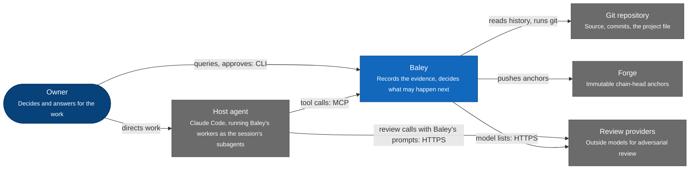
```mermaid
flowchart LR
  owner(["Owner<br/><small>Decides and answers for the work</small>"])
  host["Host agent<br/><small>Claude Code, running Baley's workers as the session's subagents</small>"]
  baley["Baley<br/><small>Records the evidence, decides what may happen next</small>"]
  git["Git repository<br/><small>Source, commits, the project file</small>"]
  forge["Forge<br/><small>Immutable chain-head anchors</small>"]
  prov["Review providers<br/><small>Outside models for adversarial review</small>"]
  owner -->|directs work| host
  owner -->|queries, approves: CLI| baley
  host -->|tool calls: MCP| baley
  baley -->|reads history, runs git| git
  baley -->|pushes anchors| forge
  host -->|review calls with Baley's prompts: HTTPS| prov
  baley -->|model lists: HTTPS| prov
  classDef person fill:#08427b,stroke:#052e56,color:#fff
  classDef system fill:#1168bd,stroke:#0b4884,color:#fff
  classDef external fill:#6b6b6b,stroke:#4d4d4d,color:#fff
  class owner person
  class baley system
  class host,git,forge,prov external
```

*Figure 1. System context, in the C4 model's sense. Baley sits between the owner, Claude Code, whose session runs Baley's workers as its subagents, the repository, the forge that holds its anchors, and the outside providers. The host session makes the review calls with the prompts Baley built, and Baley itself asks a provider only for its model list.*

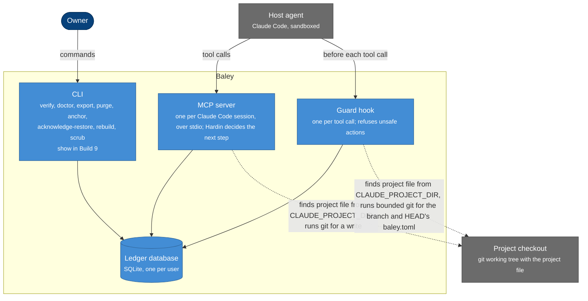
```mermaid
flowchart TB
  owner(["Owner"])
  host["Host agent<br/><small>Claude Code, sandboxed</small>"]
  subgraph baley [Baley]
    direction TB
    server["MCP server<br/><small>one per Claude Code session, over stdio; Hardin decides the next step</small>"]
    guard["Guard hook<br/><small>one per tool call; refuses unsafe actions</small>"]
    cli["CLI<br/><small>verify, doctor, export, purge, anchor,<br/>acknowledge-restore, rebuild, scrub<br/>show in Build 9</small>"]
    db[("Ledger database<br/><small>SQLite, one per user</small>")]
  end
  checkout["Project checkout<br/><small>git working tree with the project file</small>"]
  host -->|tool calls| server
  host -->|before each tool call| guard
  owner -->|commands| cli
  server --> db
  guard --> db
  cli --> db
  server -.->|finds project file from CLAUDE_PROJECT_DIR, runs git for a write| checkout
  guard -.->|finds project file from CLAUDE_PROJECT_DIR, runs bounded git for the branch and HEAD's baley.toml| checkout
  classDef person fill:#08427b,stroke:#052e56,color:#fff
  classDef container fill:#438dd5,stroke:#2e6295,color:#fff
  classDef external fill:#6b6b6b,stroke:#4d4d4d,color:#fff
  class owner person
  class server,guard,cli,db container
  class host,checkout external
```

*Figure 2. Containers, in the C4 model's sense. Every solid arrow into the database goes through the same storage port. Each Claude Code session starts its own MCP server, so several can run beside the guard hook and the command line. Claude Code's sandbox and its `Read` and `Edit` deny rules keep agents from reading or writing Baley's home and config folder, and only Baley's own processes write the database. The server finds the project file from its session's `CLAUDE_PROJECT_DIR` and runs git only to prepare a write, as Baley with the call's caller. The guard finds the project file the same way, and runs git only for the branch and for HEAD's copy of `baley.toml`, within its time budget ([0010](0010-guard.md), GRD-R14). The reader of HEAD's copy for the guard is built, and Build 3 T10 wires it into the hook. Until then the live hook runs git only for the branch.*

### Terms

| Term | Meaning |
|---|---|
| Event | One recorded fact. Immutable, typed, attributed, hash-chained. |
| Stream | The events of one thing that changes over time, such as one plan or one dispatch. Named, for example `plan/5-2`. Each stream has its own version counter. |
| Project sequence | The position of an event in its project's ledger. The hash chain follows this order. |
| Anchor | A copy of a project's chain head (sequence and hash) pushed to the forge as an immutable tag. |
| View | A keyed collection of documents computed from events, answering one kind of current-state question. |
| Generation | One complete set of a project's view documents. Readers and commands use the live generation; a rebuild builds the next one beside it. |
| View set version | The version a binary declares for its whole set of registered views, raised whenever a view is added, removed or renamed. |
| Projector | Code that updates one view from an event. Pure: event and current documents in, document changes out. Domain projectors live in `baley-core`; the store's own `request` projector is in `baley-store`. |
| Payload | Content stored once by hash, outside the event: large content, and every sensitive kind of content regardless of size. |
| Reference | One event's use of a payload, carrying the retention class for that use. |
| Command | One request from a caller that may record events. It carries a request id. |
| Claim | The intent event a command with an external effect records before acting. |
| Lease | A claim's renewal time outside the chain. It is liveness only and expires 60 seconds after renewal. |
| Scope token | An exact string declared on a command. An open claim holds its tokens and blocks other commands that declare one of them. |
| Port | The set of storage traits the domain depends on. |
| Adapter | An implementation of the port for one engine. |
| Hardin | The part of Baley that reads views and names the one allowed next step. |
| Worker | A subagent the host session starts for one work order. The host session and its workers do the work and record it through Baley's tools. |

### Detailed design

#### Crate structure (EVD-R12)

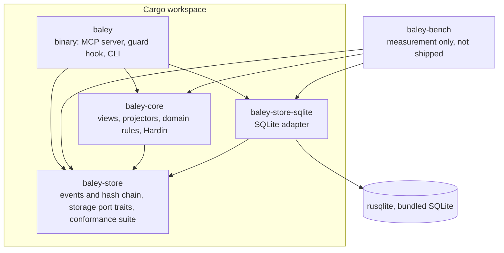
```mermaid
flowchart TB
  subgraph workspace [Cargo workspace]
    server["baley<br/>binary: MCP server, guard hook, CLI"]
    core["baley-core<br/>views, projectors, domain rules, Hardin"]
    port["baley-store<br/>events and hash chain, storage port traits, conformance suite"]
    sqlite["baley-store-sqlite<br/>SQLite adapter"]
  end
  rusqlite[("rusqlite, bundled SQLite")]
  server --> core
  server --> port
  server --> sqlite
  bench["baley-bench<br/>measurement only, not shipped"]
  bench --> sqlite
  bench --> core
  bench --> port
  core --> port
  sqlite --> port
  sqlite --> rusqlite
```

*Figure 3. Only the binary, the adapter and the measurement harness know the engine exists. `baley-core` cannot import rusqlite, so domain code cannot reach SQL.*

The binary wires one adapter into the core at start-up. `crates/baley-bench` measures the real adapter through the port with fixture projectors and is never shipped. The binary crate also holds the inherited code until each build replaces it. Tests of the domain run against the real SQLite adapter in a fresh temporary directory; no fake store exists. Core tests that need a store live in the adapter's crate, which takes `baley-core` as a test dependency only, so the graph the binary builds is the one drawn here.

#### The storage port

The port is shaped around Baley's access patterns: by id, by phase, by (phase, plan), by request id, the audit history of one thing, and search. It is not a generic create-read-update-delete repository. [Appendix B](#appendix-b-reads-mapped-to-views) maps every current read to the view key that serves it.

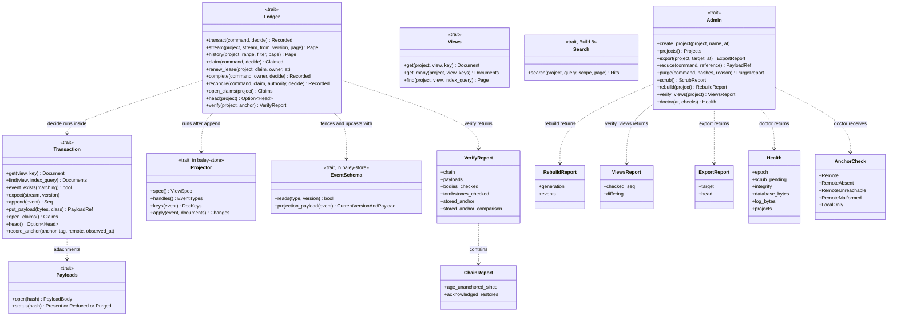
```mermaid
classDiagram
  class Ledger {
    <<trait>>
    +transact(command, decide) Recorded
    +stream(project, stream, from_version, page) Page
    +history(project, range, filter, page) Page
    +claim(command, decide) Claimed
    +renew_lease(project, claim, owner, at)
    +complete(command, owner, decide) Recorded
    +reconcile(command, claim, authority, decide) Recorded
    +open_claims(project) Claims
    +head(project) Option~Head~
    +verify(project, anchor) VerifyReport
  }
  class Transaction {
    <<trait>>
    +get(view, key) Document
    +find(view, index_query) Documents
    +event_exists(matching) bool
    +expect(stream, version)
    +append(event) Seq
    +put_payload(bytes, class) PayloadRef
    +open_claims() Claims
    +head() Option~Head~
    +record_anchor(anchor, tag, remote, observed_at)
  }
  class Views {
    <<trait>>
    +get(project, view, key) Document
    +get_many(project, view, keys) Documents
    +find(project, view, index_query) Page
  }
  class Payloads {
    <<trait>>
    +open(hash) PayloadBody
    +status(hash) Present or Reduced or Purged
  }
  class Search {
    <<trait, Build 8>>
    +search(project, query, scope, page) Hits
  }
  class Admin {
    <<trait>>
    +create_project(project, name, at)
    +projects() Projects
    +export(project, target, at) ExportReport
    +reduce(command, reference) PayloadRef
    +purge(command, hashes, reason) PurgeReport
    +scrub() ScrubReport
    +rebuild(project) RebuildReport
    +verify_views(project) ViewsReport
    +doctor(at, checks) Health
  }
  class Projector {
    <<trait, in baley-store>>
    +spec() ViewSpec
    +handles() EventTypes
    +keys(event) DocKeys
    +apply(event, documents) Changes
  }
  class EventSchema {
    <<trait, in baley-store>>
    +reads(type, version) bool
    +projection_payload(event) CurrentVersionAndPayload
  }
  class RebuildReport {
    +generation
    +events
  }
  class ViewsReport {
    +checked_seq
    +differing
  }
  class VerifyReport {
    +chain
    +payloads
    +bodies_checked
    +tombstones_checked
    +stored_anchor
    +stored_anchor_comparison
  }
  class ChainReport {
    +age_unanchored_since
    +acknowledged_restores
  }
  class AnchorCheck {
    +Remote
    +RemoteAbsent
    +RemoteUnreachable
    +RemoteMalformed
    +LocalOnly
  }
  class ExportReport {
    +target
    +head
  }
  class Health {
    +epoch
    +scrub_pending
    +integrity
    +database_bytes
    +log_bytes
    +projects
  }
  Ledger ..> Transaction : decide runs inside
  Ledger ..> Projector : runs after append
  Ledger ..> EventSchema : fences and upcasts with
  Transaction ..> Payloads : attachments
  Admin ..> RebuildReport : rebuild returns
  Admin ..> ViewsReport : verify_views returns
  Admin ..> ExportReport : export returns
  Admin ..> Health : doctor returns
  Admin ..> AnchorCheck : doctor receives
  VerifyReport ..> ChainReport : contains
  Ledger ..> VerifyReport : verify returns
```

*Figure 4. The storage port. The decision runs inside the transaction with read access. `Transaction::head` is `None` for a project with no events, so an empty chain has nothing to anchor. The `Projector` and `EventSchema` traits are defined in `baley-store` (ADR 0010). The core implements domain projectors and the event type registry. The store-owned `request` and `claim_scope` projectors live in `baley-store` (ADR 0021). An adapter opened without the core's registry reads none of the core's types. The anchor passed to `verify` is the latest anchor the core fetched through its forge seam; no store crate reaches the forge. The core builds one `AnchorCheck` per project for `doctor`, distinguishing a remote anchor from absence, an unreachable or malformed remote, and a local-only project. `Search` arrives with Build 8.*

- **`transact`** runs one command's decision. The caller does its slow work first (tests, model calls, git work) and passes the results in. The adapter takes the writer queue, opens the write transaction and checks that the project's live `request` view was built at this binary's projector version. It checks the request, then fences a new request if any of the project's live views or its view set was built by a newer binary, or if the project holds an event type or version this binary cannot read (see [Views and projectors](#views-and-projectors-evd-r9-evd-r10-evd-r27)). A replay is answered before those fences. `decide` reads through `Transaction` and returns the inputs its caller observed. The adapter re-checks documents and absences against the store and compares the caller-supplied git facts seen and now. Reading git inside the transaction is issue #40, for Build 4. A decision confirms authority against events where required and appends events. Any `Transaction` operation's error fails the command, and a stored payload must be attached to an event. The adapter runs the projectors, writes each changed document once, and commits. If any step fails, nothing is recorded (EVD-R5).
- **Claims** use the same write path. `claim` records `command.claimed` and a lease before the effect, or records a refusal as `command.completed`. `renew_lease` changes only the lease row. `complete` records the acting owner's outcome and closes the claim, even after lease expiry if reconciliation has not closed it. `reconcile` records a finding and either closes an interrupted claim or holds it for the owner. `open_claims` pages through claimed and awaiting-owner request documents and joins their matching lease rows. The SQLite adapter implements `Ledger` by delegating to these write methods of its own, unchanged. The lease and scope rules, event shapes and `claim_scope` view are store-owned in `baley-store` (ADR 0021).
- **`record_anchor`** writes the project's anchor row in the command's transaction, so the row commits or rolls back with its `anchor.pushed` event. It refuses a row unless an `anchor.pushed` event appended earlier in the same command carries exactly its tag, sequence, head, remote and time, and the tag is `baley-anchor/<project_id>/<seq>` for the command's project. A row already stored for the sequence must agree in every value, or the command is refused and nothing is written.
- **`stream`, `history` and `head`** read stored events exactly as recorded, never upcast. `stream` returns a stream's events from a version on, in stream-version order; `history` returns a project's events in a sequence range, in sequence order, that have any of the named types (all types when none are named) and, when a commit is named, recorded it. Each page holds at most `min(limit, 100)` events, read with SQL `LIMIT`, and its cursor is bound to the project, the query and the page's last position; another query refuses it with `InvalidCursor`. `head` is `None` for a project with no events and `UnknownProject` for an absent one. None of the three reads a view, so they work on a project this binary may not write.
- **`verify`** takes the anchor the core fetched from the forge, or none. It walks the project's whole chain through the pure verifier one stored event at a time, compares the latest local anchor row with the supplied anchor without trusting it, and streams every present body the project references and every excerpt a reduced body retains, hashing the uncompressed bytes and checking the stored length. The `VerifyReport` holds the chain report (`first_break`, an anchor verdict that can be `Acknowledged`, the raw unanchored range, `acknowledged_restores` and `age_unanchored_since`), each missing or corrupt body, the bodies checked, the tombstones counted, and the latest local row and its comparison (`NotCompared`, `Matches`, `MissingLocal`, `LocalBehind`, `LocalAhead` or `Conflict`).
- **`expect`** additionally names the stream that serializes a contested decision, so two commands that would both pass their own checks are ordered by one version counter. Each contested decision names its stream in [Serializing streams](#serializing-streams).
- **Views** are declared by the core as a `ViewSpec`: a name, a version, a key shape, indexed fields, the ordering of each index and a page-size bound. `find` reads by a declared index, never by scan, and returns a page with a cursor. A cursor is bound to the query, project, generation and view version that issued it and refused under any other. One query runs against one read snapshot, the same snapshot in which the adapter checks the project's live view versions. `get_many` reads several keys of one view as one query, so documents a caller joins, such as `baley models list`'s catalog version and rows, come from one committed state.
- **`EventSchema`** is the core's registry of event types, handed to the adapter at open. `reads` says which types and versions this binary can read; a project holding any other is read-only for it. `projection_payload` gives an event's current type version and its payload upcast to that version. Projectors never see a stored event directly: ordinary projection and replay both hand them a copy carrying that version and payload.
- **Payloads** are read through a stream on its own read-only connection and snapshot. A stream opened before a purge keeps reading its snapshot. A purged or reduced payload returns its status and tombstone. Bytes whose hash was reduced or purged cannot be stored again (`PayloadTombstoned`).
- **Search** is a capability with defined semantics: terms and quoted phrases, scoped by project and optionally phase, results in descending relevance with stable tie-breaking by sequence. The SQLite adapter implements it with FTS5 and BM25; nothing in the core depends on FTS5 syntax.
- **Admin** covers everything an owner does to the store as a whole. `scrub` is the standalone, idempotent end of a purge. `rebuild` returns a `RebuildReport`: the generation it made live and every event replayed into it, the final tail included, which for a chain without gaps is the head it flipped at. `verify_views` returns a `ViewsReport`: the head it compared at and each differing (view, key), sorted. A failed command records nothing. An operation that first brought a project's views forward to this binary's (a read, a command, `verify_views`) may have committed that forward rebuild before a later error. `CleanupFailed` follows a rebuild whose generation is already live, and names that generation. `UnfinishedGeneration` names the generation an unfinished rebuild or verification left, which verification refuses to run beside, or the scratch generation a verification could not remove. `LiveGenerationProtected` names the live generation when the building marker names it, as when the marker is damaged: a rebuild refuses rather than remove it, a verification refuses rather than report it unfinished, and nothing was removed. The SQLite adapter implements `Admin`: export creates and verifies a standalone project home and records the copy for later purge reports; doctor reports store and per-project health from supplied checks and time.

#### Events

Every event has an envelope and a payload.

| Field | Meaning |
|---|---|
| `project_id` | The project the event belongs to. |
| `seq` | Project sequence, starting at 1, no gaps. |
| `stream`, `stream_version` | The stream and its version after this event. Unique together within a project. |
| `type`, `type_version` | The event type, such as `plan.approved`, and the version of its payload schema. |
| `actor` | `owner`, an agent role (for example `daneel:executor`), or `baley`. |
| `caller` | Who asked for the append. It is absent, with no key, for command-line commands and for reconciliation: never `null`, and never a `cli` value. Otherwise it is an object of one of two forms, and every event a command appends carries that command's caller, the store's own `command.*` and `payload.*` events included. The server form (`form` is `server`) is what the Baley server records for a request. It requires `project_directory`, `working_directory`, `host`, `baley_session` and `call`, and takes `client_version`, `host_session`, `work_order` and `instructions`. The hook form (`form` is `hook`) is what the guard hook records for a tool call. It requires `working_directory`, `host` and `call`, and takes `project_directory`, `host_session`, `work_order` and `instructions`. It has no `baley_session`, so a hook caller cannot carry a Baley session, and a hook object that holds the key is refused. `call` is `{ "text", "source" }`. A server's `source` is `jsonrpc_id` and its `text` is the request's JSON-RPC id written as JSON, so the integer `1` and the string `"1"` stay apart. A hook's `source` is `tool_use_id` and its `text` is the id Claude Code gave the tool call. `instructions` is a list of 1 to 32 entries, each `{ "identity", "version", "hash" }`, and has no key when it is empty. Every text is non-empty and has a byte limit: directories 4096 and absolute, `host` 64 of lower-case letters, digits and `-` starting with a letter, `baley_session` exactly 36 as a lower-case UUID version 4, `client_version` 128, `host_session` 128, `call.text` 256, `work_order` 256, and an instruction's `identity` 256, `version` 64 and `hash` 128. Where documentation leaves a length open, the limit is a choice. An empty text or a `null` is refused, never read as absent, and so is an unknown key. A stored caller that fails these checks on reading makes history and verification unavailable. No caller enters a request digest or request key, so a replay records nothing and keeps the original caller, read from the event the request document's `produced_seq` names. |
| `recorded_at` | UTC time the event was recorded. |
| `request_id` | The command that recorded it. |
| `git` | The git facts the event depends on: `commit`, `tree`, and the `checkout` it was observed in. Absent when the event depends on none. |
| `policy_version` | The effective policy the command ran under. |
| `payload` | The event's typed content, as canonical JSON. Every fact a projector needs is inline. Attachments (outputs, review material, prompts, plan and context text, capture text over 4 KiB) are references `{ "payload": "<sha256>", "bytes": n, "class": "<retention class>" }`. Build 8's search rows derived from an attachment's body are keyed by the body's hash and are not held in the event (EVD-R10). |
| `prev_hash`, `hash` | The hash chain. |

Payloads are JSON so that the ledger stays readable with standard tools and queryable through SQLite's JSON functions. For hashing, the envelope (without `hash`) and the payload are serialized with the JSON Canonicalization Scheme (RFC 8785), so the same event always hashes the same way on any platform. The envelope includes the nested `caller` when the event has one and leaves the key out when it has none, as it does `git`, so an event with no caller hashes exactly as it did before the field existed.

Payload numbers are integers within ±(2^53 − 1); floats are refused, because RFC 8785 writes numbers as IEEE doubles. Events and view documents never carry payload body text: a decision puts body content in a payload and records its reference, and an inline fact is never an excerpt of a body. `command.*` and `payload.*` events are recorded only by the store; a decision that appends one is refused.

Event types are named `<family>.<fact>` in the past tense, and each has a payload schema version. A payload schema change adds a new version; old events are never rewritten and are read through an upcaster that converts old versions to the current shape (EVD-R19). Ordinary projection and replay both upcast in memory: projectors receive a copy of the event at its type's current version with its payload upcast, while the stored event, its hash and its references stay as recorded. The store's own `command.*` and `payload.*` types are read only at their exact recorded versions. An event type or version a binary does not know makes that project read-only for that binary.

`command.claimed` version 1 carries the kind, request id, digest, intent, scope and owner. `command.reconciled` version 1 carries the claim's kind and request id, claim sequence, finding and resolution (`resolved` or `awaiting_owner`). `command.completed` version 2 carries `scope`: the closed claim's tokens when it closes a claim, or `[]` otherwise. The store reads these events only at those exact versions. A project holding version 1 of `command.completed` is read-only for this binary. T10 requires a fresh ledger; ledgers written before the first release are disposable.

The anchor command records its result on the `project` stream. `anchor.pushed` version 1 is exactly `{"tag", "seq", "head", "remote", "observed_at"}`: the tag confirmed on the remote, the pre-claim sequence and lower-case head hash it names, the configured remote's name (never a URL, never credentials) and the supplied time Baley confirmed the tag, which is not necessarily when the forge created it. `anchor.failed` version 1 carries the same five fields and `reason`: a refused, unreachable or missing remote at the push, or the mismatch that stopped it before the push. `anchor.restore_acknowledged` version 1 is exactly `{"remote", "tag", "seq", "head", "restored_seq", "restored_head", "checked_at"}`: the remote anchor accepted by the owner, the local head before this event (sequence zero and null head for an empty chain), and the time the remote was checked. All three are core types registered at version 1 by `baley_core::register_anchor_events`; `Registry::new` stays empty. The port defines their names, versions and exact codecs, so the adapter can check an anchor row against its event and the verifier can recognize a valid acknowledgement.

Streams used by the record families:

| Stream | Examples of events |
|---|---|
| `project` | `project.initialized`, `project.described`, `scope.approved`, `forge.checked`, `policy.effective`, `checkout.seen`, `anchor.pushed`, `anchor.failed`, `anchor.restore_acknowledged` |
| `roadmap` | `phase.declared`, `phase.reordered`, `phase.withdrawn`, `story.declared`, `story.corrected`, `story.reassigned`, `story.reprioritized`, `story.dropped` ([0004](0004-starting-a-project-and-changing-scope.md)), `story.refined`, and `questions.opened`, `question.answered`, `question.deferred` and `questions.abandoned` for a story's question set ([0005](0005-context-plans-and-acceptance.md)) |
| `phase/<n>` | `plan.approved`, `plan.checked`, `plan.replaced`, `phase.retrospective`, and `questions.opened`, `question.answered`, `question.deferred` and `questions.abandoned` for a plan draft's question set ([0005](0005-context-plans-and-acceptance.md)), `plan.admitted`, `dispatch.issued` (serializes one active dispatch per phase), the task, run, suite and plan outcome events of [0006](0006-execution.md), `phase.completed`, `completion.invalidated`, `phase.undone` |
| `plan/<n>-<k>` | `plan.submitted`, `plan.approved`, `plan.superseded` |
| `admission/<n>` | `execution.admitted`, `execution.extended` |
| `dispatch/<id>` | `task.started`, `task.run`, `task.closed`, `suite.run`, `dispatch.ended`, `worker.exited`, `worker.interrupted` |
| `verification/<id>` | `verification.started`, `verification.run`, `verdict.claimed`, `observation.recorded`, `item.overruled`, `truth.waived`, `waiver.revoked`, `verification.completed` ([0007](0007-verification.md)) |
| `review/<id>` | `review.admitted`, `review.issued`, `review.returned`, `review.failed`, `review.adjudication`, `review.adjudicated`, `review.settled`, `review.deferred`, `finding.filed`, `finding.declined`, `finding.uncertain` ([0008](0008-review.md)) |
| `risk/<n>` | `risk.observed`, `risk.fired`, `risk.receipt` |
| `milestone/<name>` | `milestone.close_ready`, `milestone.archived`, `release.proposed`, `release.confirmed`, `landing.started`, `landing.authorized`, `landing.claimed`, `landing.step`, `landing.reconciled`, `landing.confirmed`, `landing.completed`, `tracker.checked` ([0011](0011-milestones-landing-undo-pause.md)) |
| `pause` | `pause.recorded`, `pause.resumed` |
| `capture`, `task/<slug>`, `debug/<slug>`, `spike/<slug>` | the support families' records ([0014](0014-support-families.md)) |
| `guard` | `guard.allowed`, `guard.asked`, `guard.refused`, `guard.policy_recorded` |
| `command/<kind>` | `command.claimed`, `command.completed`, `command.reconciled` |
| `retention` | `payload.reduced`, `payload.purged` |
| `models` | `models.seeded`, `models.owner_changed`, `models.detected`, `models.detection_failed`. The stream lives only in the reserved per-user project `user`, whose records carry policy version 0 ([0003](0003-configuration-and-routing.md)) |

The full mapping from today's namespaces is in [Appendix A](#appendix-a-mapping-from-the-current-store).

#### Commands

A command is one request from a caller, carrying a request id and a scope: a list of exact tokens. An empty scope holds no token and skips the scope gate. The same-request rule still applies: another entry under an open claim's request id is `Blocked` whatever its scope. Scope carries authority and belongs in the request digest.

**Request ids (EVD-R6).** The caller generates a fresh UUID for each command. Baley scopes it to the project and the command kind, so two sessions or two command kinds can never collide or receive each other's answers. The request digest is the SHA-256 of the canonical form of the command kind and every field that carries authority (the approved content, the phase and plan, the target dispatch, the policy version). Guard decisions keep today's identity built from the host session and tool-call id.

**Outcomes.** Every command that reaches a domain outcome, success or a real refusal, records a `command.completed` event carrying the command kind, request id, digest, outcome kind, the git facts it depended on and the answer. An answer is inline when its canonical JSON is at most 4 KiB and is not sensitive; otherwise it is a `record` payload reference. This includes commands that record no other event. The `request` view is built from those events and is rebuildable like any other. A replay whose answer its own project released by purge or reduction returns its tombstone even when another project still requires the body. The event and request document keep the reference. Infrastructure failures (store busy, disk full) and stale-input refusals are not outcomes. A failed database-only transaction records nothing. An external command can fail after its claim commits or its effect lands, so the CLI prints the anchor request id and directs the owner to reconcile after the lease expires rather than promise a clean no-op. Each CLI invocation uses a fresh UUID; a repeated invocation is a new request governed by the store's rules.

**Database-only commands** run in one transaction: check the request first, then the command's scope, then decide, append, project and commit, as in Figure 7. `Blocked` is a store error, not a recorded outcome, so a command may be retried after reconciliation.

**Commands with an external effect (EVD-R26)** use three steps, because SQLite cannot roll back a git revert, a provider call or a pushed ref:

1. **Claim.** One short transaction checks the request and scope, reads the pre-claim head through `Transaction::head` where the effect needs it, and records `command.claimed` with the command's inputs, intended effect and owner. It takes a lease in the same transaction. A retry or duplicate finds the claim and receives `InProgress` or `Replayed`; it never repeats the effect.
2. **Act.** The external work runs outside any transaction.
3. **Record.** One more transaction re-checks the claim and acting owner, records the result events and `command.completed`, and removes the lease. It carries the same digest and scope in the command. A changed scope is refused before the scope check. An owner resolution uses `reconcile` with an owner actor.

**Active and interrupted claims.** A claim records its owner (process, host session and start time) and scope. A command-line claim puts `cli` in the owner's `host_session`. A server claim puts the Baley session UUID its server minted there and the operating system's process id, as decimal text, in the owner's `process`. The host's own session id stays in the event's caller, not in the owner. The store checks neither `host_session`'s form nor `process`'s, and no server claim path exists yet: Build 5 is its first user. The payload versions stay `command.claimed` 1, `command.reconciled` 1 and `command.completed` 2. The owner holds a lease, renews it as soon as its claim commits, and then renews it every 10 seconds while it works. From supplied times, the lease is active strictly before the instant 60 seconds after its last renewal and interrupted at that instant. The row is liveness, not evidence: `claim_lease` lives outside the chain and is matched to the claim event by `claim_seq`. A missing or mismatched row means interrupted at once. Renewal records no event. A renewal by another owner, of a closed or held claim, at an invalid time, or before the matching row's time is refused. With no matching row, the floor is the claim event's time. The owner may renew an expired open claim or record its result after expiry, until reconciliation closes it.

- A claim whose lease is current is **active**. It blocks only commands in its own scope; everything else proceeds.
- A claim whose lease has expired is **interrupted**: its owner died or lost its connection. An interrupted claim can be reconciled automatically; a claim held for the owner needs the owner's reconciliation.

| Claim | Scope it blocks while active or interrupted |
|---|---|
| Verification run or test | Another run of the same check |
| Undo's revert | Commands on that phase, and any command that writes git in that checkout |
| Landing step, release | The other steps of that milestone |
| Anchor push | Another anchor push for the project |
| Provider review call | Another delivery of the same review |

The command declares exact-string tokens. Build 1 has `anchor` for anchor pushes; later builds declare their verification, provider, revert, landing and release tokens. For every command with tokens, the store reads only those keys in `claim_scope`, validates each holder against its `request` document and fails the command without writing if the views disagree. It excludes the claim a record or reconciliation step is closing. A valid holder returns `Blocked` with the claim and its active, interrupted or awaiting-owner state. A claim stays open in the `request` view while claimed or awaiting owner; `open_claims` pages those states by index and joins matching lease rows.

**Reconciliation.** The caller checks interrupted claims on its first use of a project after starting, and when a scoped command receives `Blocked { Interrupted }`. A session's server does the first-use check at its first scoped operation for a project. Build 5, its first user, adds that check to the server's preparation. Build 3 creates no `ClaimOwner` and records no reconciliation, and a capture needs none. The command line's anchor reconciliation is unchanged, and the anchor command is the first scoped caller: it fetches the tag through the forge, judges the observation and retries its original request after resolution. An interrupted test run is recorded as interrupted; an interrupted provider call is recorded as undelivered and may be retried under a new request. A finding is recorded as `command.reconciled`, followed by the claim's completion when resolved and the reconciling command's own completion. An unreachable remote finds nothing, records nothing in the chain, writes a trace row and leaves the claim interrupted. Ambiguous real state, such as a half-applied revert, makes the `request` document `awaiting_owner`. It keeps blocking its scope, refuses automatic reconciliation and is resolved only through the owner's `reconcile`.

A claim reconciled as not pushed can land late because leases measure liveness, not evidence. This is harmless for anchors because verification reads the remote. The finding carries `checked_at`, the time of the remote check, not a promise that the tag stayed absent. A late owner record step receives the reconciliation's outcome as a replay and changes nothing; the anchor command reports it together with whether its own push said it landed.

**Failures are outcomes.** An effect that fails cleanly (the remote refused the push or could not be reached, the provider returned an error) is a domain outcome: the record step commits `command.completed` with that result, and the claim is finished, not interrupted. A failed anchor push therefore never blocks work; the unanchored range grows, the next anchor point retries, and `doctor` warns once the unanchored range is more than a day old.

**The anchor push.** `baley-core::anchor` runs the anchor command over the port and a forge seam the binary supplies; each of its steps is also callable on its own over supplied observations.

- *Request.* The digest binds the kind `anchor.push`, the project, the actor, the policy version, the configured remote's name and the scope `["anchor"]`. No head, sequence or tag enters it, so a retry of the same request keeps its digest while the head moves.
- *Claim.* The decision reads the head once through `Transaction::head` and records it, with the remote's name, as the claim's intent. With no remote (no `git.remote`) or no events it refuses on the merits and takes no lease. The tag is `baley-anchor/<project_id>/<seq>` for that pre-claim sequence, never the sequence of `command.claimed`.
- *Heartbeat.* Once the claim commits, the command renews the lease at once and starts a ticker that renews it every 10 seconds, on one thread scheduled against monotonic deadlines, handing each renewal wall-clock time in the store's UTC form, through the fetch, any verification and any push. A failed renewal is returned beside the outcome and never cancels the check or a permitted push; the record step's owner and claim checks decide the result. The ticker's `stop` sends a stop message and joins its thread before the record step on every path.
- *Check.* Under that heartbeat the command fetches the latest remote anchor. Only a well-formed latest tag, or a confirmed absence of any anchor, leads to verification: the command verifies the whole local chain against that anchor, or locally when there is none, as `verify` does. A chain that agrees with the anchor, including an owner-acknowledged restore, may be pushed; with a confirmed absence, a chain that verifies locally may be anchored for the first time. A truncated, rewritten or broken chain without an accepted acknowledgement refuses the anchor with a recorded outcome naming the mismatch and pushes nothing. A malformed latest tag, an unreachable remote, or none, refuses without verifying: the outcome names what the fetch found, nothing is pushed, and it is recorded as a failed push is. Damaged payload bodies found by the verification are reported and do not stop the anchor. The local anchor row never stands in for the remote.
- *Record.* A confirmed tag records `anchor.pushed` and the anchor row in one transaction, as `done`. A refused, unreachable or missing remote at the push, or a refused check, records `anchor.failed` with its reason, as `refused`, and no row. The step carries the original request id, digest, scope and owner.
- *Blocked.* When the claim meets `Blocked { Interrupted }`, the command reads that holder through `open_claims`, fetches the holder's own tag, takes `checked_at` from the clock right after the fetch, and reconciles under a separate `anchor.reconcile` command attributed to Baley, with an empty scope, recorded at `checked_at`, and a digest bound to the holder's claim, the observation and `checked_at`. A matching tag records `anchor.pushed` and the row at `checked_at`; a conflicting or malformed tag, or a confirmed absence, records `anchor.failed`. The original request then retries once, with its own identity and a fresh time, and its claim reads the head as it then stands. An unreachable remote, or none to ask, is unknown: one `claim.unreachable` trace row names the claim's kind, request id and sequence, nothing enters the chain and the claim stays interrupted. An active or awaiting-owner holder is left alone, and a reconciliation that loses a race to a renewal or completion stops without pushing.

The anchor push changes no source, so it needs no authorization (0011, LND-R18). The triggers that call it (a verified phase, a milestone step, at least daily) arrive with Build 6; until then only the owner runs it.

**Acknowledging a restore.** The owner fetches the latest remote anchor and verifies the restored copy against it. A locally broken chain must be restored from an earlier copy instead, and that copy lacks the purges recorded after it, so the owner re-runs the purges they know of. A matching or already acknowledged chain needs no acknowledgement. For a locally intact chain truncated before or rewritten at that anchor, `anchor.acknowledge_restore` uses the `anchor` scope, checks that the head still equals the verified head inside its transaction, and records `anchor.restore_acknowledged` with the remote anchor and restored head. A non-owner actor is refused without a record. An open anchor claim blocks the scope until it is reconciled. The request digest includes the remote anchor but not the moving local head, so a retry replays. The event makes the gap visible and lets anchoring resume. The success output, whether the acknowledgement is new or replayed, carries the purge warning of [ADR 0035](../adr/0035-restore-purge-uncertainty.md): purges recorded in history the copy lacks may be missing and their bodies may have reappeared. The owner re-runs the purges they know of with `baley purge` for each project, from records kept outside the store, and rotates every affected secret. A refusal prints no warning.

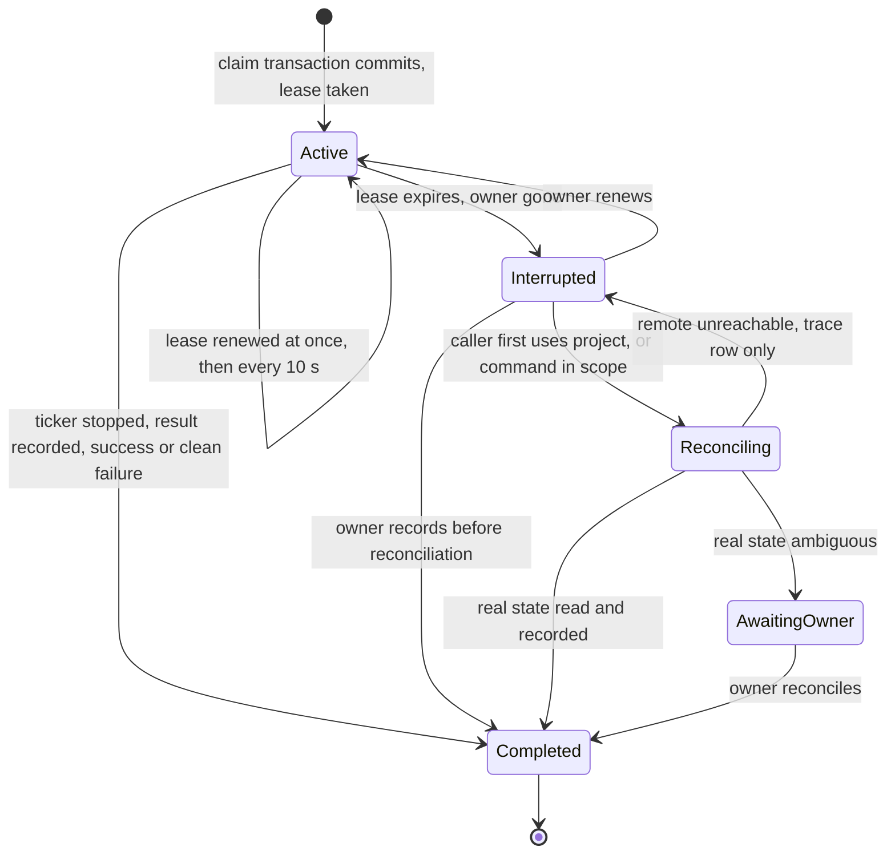
```mermaid
stateDiagram-v2
  [*] --> Active : claim transaction commits, lease taken
  Active --> Active : lease renewed at once, then every 10 s
  Active --> Completed : ticker stopped, result recorded, success or clean failure
  Active --> Interrupted : lease expires, owner gone
  Interrupted --> Active : owner renews
  Interrupted --> Completed : owner records before reconciliation
  Interrupted --> Reconciling : caller first uses project, or command in scope
  Reconciling --> Completed : real state read and recorded
  Reconciling --> Interrupted : remote unreachable, trace row only
  Reconciling --> AwaitingOwner : real state ambiguous
  AwaitingOwner --> Completed : owner reconciles
  Completed --> [*]
```

*Figure 5. A command with an external effect. An active claim blocks only its scope. An interrupted claim can be reconciled automatically where the real state can be read; a held claim needs the owner's reconciliation. An unreachable remote is not a finding. A claim is never re-executed. The owner stops renewing before it records.*

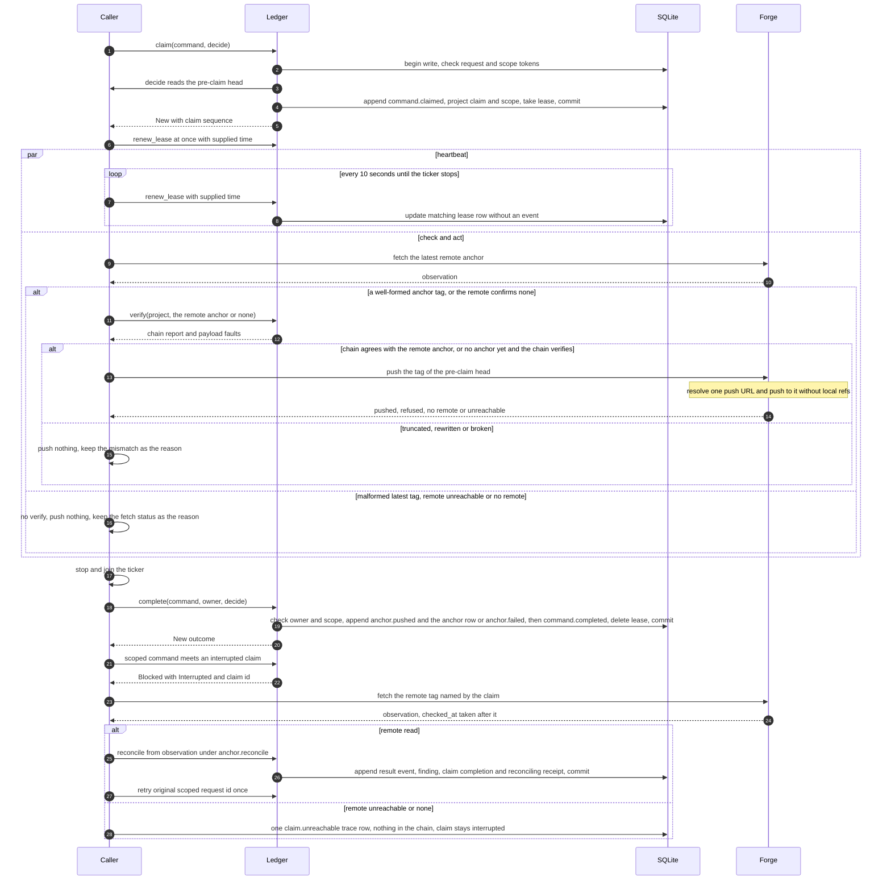
```mermaid
sequenceDiagram
  autonumber
  participant C as Caller
  participant L as Ledger
  participant Q as SQLite
  participant F as Forge
  C->>L: claim(command, decide)
  L->>Q: begin write, check request and scope tokens
  L->>C: decide reads the pre-claim head
  L->>Q: append command.claimed, project claim and scope, take lease, commit
  L-->>C: New with claim sequence
  C->>L: renew_lease at once with supplied time
  par heartbeat
    loop every 10 seconds until the ticker stops
      C->>L: renew_lease with supplied time
      L->>Q: update matching lease row without an event
    end
  and check and act
    C->>F: fetch the latest remote anchor
    F-->>C: observation
    alt a well-formed anchor tag, or the remote confirms none
      C->>L: verify(project, the remote anchor or none)
      L-->>C: chain report and payload faults
      alt chain agrees with the remote anchor, or no anchor yet and the chain verifies
        C->>F: push the tag of the pre-claim head
        Note over F: resolve one push URL and push to it without local refs
        F-->>C: pushed, refused, no remote or unreachable
      else truncated, rewritten or broken
        C->>C: push nothing, keep the mismatch as the reason
      end
    else malformed latest tag, remote unreachable or no remote
      C->>C: no verify, push nothing, keep the fetch status as the reason
    end
  end
  C->>C: stop and join the ticker
  C->>L: complete(command, owner, decide)
  L->>Q: check owner and scope, append anchor.pushed and the anchor row or anchor.failed, then command.completed, delete lease, commit
  L-->>C: New outcome
  C->>L: scoped command meets an interrupted claim
  L-->>C: Blocked with Interrupted and claim id
  C->>F: fetch the remote tag named by the claim
  F-->>C: observation, checked_at taken after it
  alt remote read
    C->>L: reconcile from observation under anchor.reconcile
    L->>Q: append result event, finding, claim completion and reconciling receipt, commit
    C->>L: retry original scoped request id once
  else remote unreachable or none
    C->>Q: one claim.unreachable trace row, nothing in the chain, claim stays interrupted
  end
```

*Figure 6. Claim, act and record, drawn for an anchor push. The lease is renewed as soon as the claim commits and every 10 seconds through the latest-anchor fetch, any verification and any push, outside the chain; the ticker is stopped before the record step whether the check refused or the push ran. Only a well-formed latest tag or a confirmed absence leads to `verify`; a malformed tag, an unreachable remote or none refuses without it. An interrupted holder is reconciled from a fetch of its own tag before the blocked request retries once. Apart from that retry the command never resends its request; a caller that resends one gets `InProgress` while the claim is open and `Replayed` once it completes, with no write and no second push.*

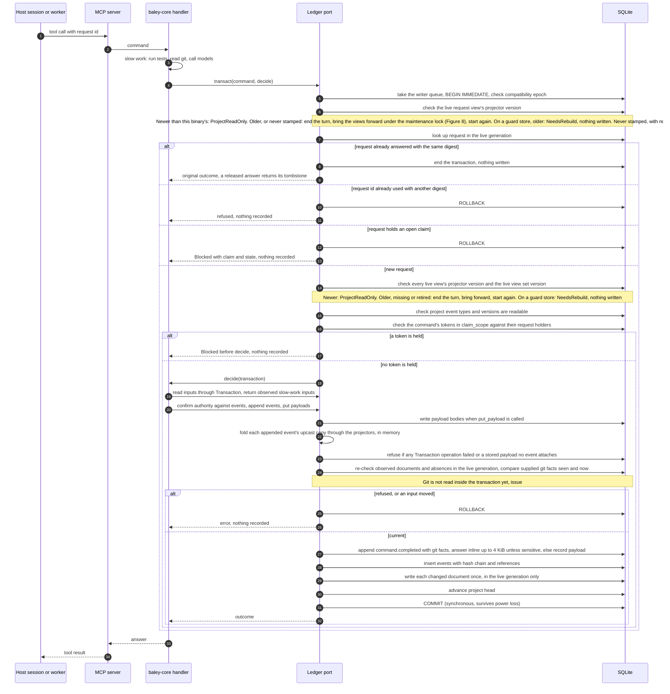
```mermaid
sequenceDiagram
  autonumber
  participant D as Host session or worker
  participant S as MCP server
  participant C as baley-core handler
  participant L as Ledger port
  participant Q as SQLite
  D->>S: tool call with request id
  S->>C: command
  C->>C: slow work: run tests, read git, call models
  C->>L: transact(command, decide)
  L->>Q: take the writer queue, BEGIN IMMEDIATE, check compatibility epoch
  L->>Q: check the live request view's projector version
  Note over L,Q: Newer than this binary's: ProjectReadOnly. Older, or never stamped: end the turn, bring the views forward under the maintenance lock (Figure 8), start again. On a guard store, older: NeedsRebuild, nothing written. Never stamped, with no events: stamp generation 0 in a bounded turn, start again
  L->>Q: look up request in the live generation
  alt request already answered with the same digest
    L->>Q: end the transaction, nothing written
    L-->>C: original outcome, a released answer returns its tombstone
  else request id already used with another digest
    L->>Q: ROLLBACK
    L-->>C: refused, nothing recorded
  else request holds an open claim
    L->>Q: ROLLBACK
    L-->>C: Blocked with claim and state, nothing recorded
  else new request
    L->>Q: check every live view's projector version and the live view set version
    Note over L,Q: Newer: ProjectReadOnly. Older, missing or retired: end the turn, bring forward, start again. On a guard store: NeedsRebuild, nothing written
    L->>Q: check project event types and versions are readable
    L->>Q: check the command's tokens in claim_scope against their request holders
    alt a token is held
      L-->>C: Blocked before decide, nothing recorded
    else no token is held
      L->>C: decide(transaction)
    C->>L: read inputs through Transaction, return observed slow-work inputs
    C->>L: confirm authority against events, append events, put payloads
    L->>Q: write payload bodies when put_payload is called
    L->>L: fold each appended event's upcast copy through the projectors, in memory
    L->>Q: refuse if any Transaction operation failed or a stored payload no event attaches
    L->>Q: re-check observed documents and absences in the live generation, compare supplied git facts seen and now
    Note over L,Q: Git is not read inside the transaction yet, issue #40 (Build 4)
    alt refused, or an input moved
      L->>Q: ROLLBACK
      L-->>C: error, nothing recorded
    else current
      L->>Q: append command.completed with git facts, answer inline up to 4 KiB unless sensitive, else record payload
      L->>Q: insert events with hash chain and references
      L->>Q: write each changed document once, in the live generation only
      L->>Q: advance project head
      L->>Q: COMMIT (synchronous, survives power loss)
      L-->>C: outcome
    end
    end
  end
  C-->>S: answer
  S-->>D: tool result
```

*Figure 7. A database-only command. An open claim under the same request id returns `Blocked` without writing, and every token is checked through `claim_scope` before the decision. The request is checked before the view and readability fences, and needs only the live `request` view at this binary's version. The caller supplies observed git facts; the adapter checks them and stores the outcome in the same transaction. A command writes only the live generation, even while a rebuild builds the next one. A store opened for the guard takes the writer queue by bounded tries and rebuilds no views, and once its `BEGIN IMMEDIATE` succeeds the command runs to commit or rollback like any other.*

#### Serializing streams

| Contested decision | Serialized on |
|---|---|
| One active dispatch per phase | `phase/<n>` |
| Plan approval and supersession within a phase | `phase/<n>` |
| Admission and extension | `admission/<n>` |
| Verification completion and invalidation | `phase/<n>` |
| Milestone close, archive, release and landing | `milestone/<name>` |
| Roadmap changes | `roadmap` |
| Policy changes | `project` |

#### Git facts and checkouts (EVD-R4, EVD-R7)

Git state changes without any stream moving, so every event that depends on git records the facts it saw: HEAD commit, tree, and the checkout it came from. The cheap facts (HEAD and whether the index matches what the command observed) are supplied as seen and now values and compared inside the write transaction; anything that moved refuses the command. Reading git inside that transaction is issue #40, for Build 4. Slow git work stays before the transaction. Execution permission records the checkout it was granted to; another worktree of the same project must be admitted on its own.

The existing source checks are kept and run at these points:

| Check | Today | Runs |
|---|---|---|
| Verification claim recomputed at commit | `store/writer.rs:1436` | Inside `decide` for `verdict.claimed` |
| Source reachability, commit signatures, staged-path leases | `execution/receipts.rs:1137-1210` | Before `transact`, facts recorded; HEAD re-checked inside |
| Changed source or index refused on re-observation | `verification/inputs.rs:458-461` | Inside `decide` |
| HEAD unchanged during an execution request | `execution_service.rs:2825` | Inside `decide` |

#### The hash chain and anchors (EVD-R3)

Each project's events are chained in project-sequence order:

- `hash(1) = SHA-256("baley-ledger/1" || project_id || JCS(envelope(1)) || JCS(payload(1)))`
- `hash(n) = SHA-256(hash(n-1) || JCS(envelope(n)) || JCS(payload(n)))`

The envelope in these formulas includes the nested `caller` when the event has one and has no `caller` key when it has none. A caller-free event hashes exactly as before, and the formulas and the `baley-ledger/1` prefix do not change.

`prev_hash` is stored with each event so a break is located without recomputing from the start. A payload enters the chain as its reference, so the chain commits to the content's hash and length, not its bytes: it proves what was committed to, and when, even after the body is purged.

A chain whose head lives only in the database protects against accidents, not against someone who can rewrite the file and recompute every hash. So Baley anchors the head outside the machine. The triggers Build 6 adds push at every verified phase, every milestone step, and at least daily while a project is active. Until then the owner runs `baley anchor`. Baley pushes the tag `baley-anchor/<project_id>/<seq>`, whose annotation holds the sequence and head hash, to the remote the project's `git.remote` setting names. The annotation's first line is canonical JSON, `{"head":"<64 lower-case hex digits>","seq":<decimal>}`, and a line feed ends it (ADR 0007 records why anchors live on the forge). A reader takes only that first line, so a tag signature after it is ignored, requires exactly that form, and requires the tag's sequence to be the annotation's. A tag whose first line is anything else exists but is not an anchor: it is malformed, never absent. The repository should enforce a tag ruleset that makes anchors impossible to move or delete, for anyone. Where the forge cannot hold one, as on a private GitHub repository without a paid plan, Baley still anchors and reports the tags as unprotected ([ADR 0026](../adr/0026-anchors-read-by-baley.md)). Checking that ruleset at project start arrives in Build 6 with PRJ-R8. Anchors are read by Baley through git: GitHub's web interface does not list a tag on a tree, while `git ls-remote` and the API do. The anchor push is a command with an external effect and follows the claim, act, record steps ([The anchor push](#commands)). After claiming and before pushing, it checks the local chain against the latest remote anchor, as `verify` does, and refuses with a recorded outcome on an unacknowledged truncation, rewrite or rollback, even once the local chain grows past the remote anchor.

**The git forge.** The binary's `crates/baley/src/ledger/forge.rs` writes an annotated tag on the empty tree, with tagger `Baley <baley@localhost>` at the push's Unix time and offset `+0000` ([ADR 0025](../adr/0025-anchor-tag-objects.md)). `git hash-object -t tree -w --stdin` writes the empty tree, then `git mktag` writes the tag object from the core's annotation. Both object ids must be one line of 40 or 64 lower-case hex digits. Before writing either object, the forge requires the remote to be an exact line of `git remote`, then resolves `git remote get-url --push --all REMOTE` and requires exactly one non-empty URL. Git applies `pushurl` and `pushInsteadOf` during that lookup. The push is `git push --porcelain --no-verify PUSH_URL SHA:refs/tags/TAG`. It names the URL so the remote's configured fetch mappings cannot create a local tag after the push. No local ref is created. Settings keyed to the remote's name, including `remote.<name>.push` and `remote.<name>.receivepack`, do not apply to this push.

A fetch makes the same `git remote` check and the same push-URL lookup, then runs `git ls-remote --tags --exit-code PUSH_URL` with the query's ref patterns. Reads go to the push URL so that a remote whose `url` and `pushurl` name different repositories is read where its anchors were written. An exact query asks for both `refs/tags/TAG` and `refs/tags/TAG^{}` and requires an exact ref name. A latest query asks for `refs/tags/baley-anchor/PROJECT/*`, ignores peeled and foreign names and selects the highest numeric sequence. An annotated tag is fetched with `git fetch --no-tags --no-write-fetch-head --refmap= PUSH_URL refs/tags/TAG`, then read with `git cat-file tag SHA`. The message after its first empty line is passed to the core, including any signature. This transfers the tag and tree without creating a local ref or fetching commit history. Git 2.29 or later is needed for `--no-write-fetch-head`.

| Git observation | Forge observation |
|---|---|
| Push porcelain `*` or `=` for the requested ref, and git exits 0 | `Pushed` |
| Push porcelain `!` for the requested ref | `Refused`, with its summary and reason |
| Failed `git remote`, an empty, multiple or failed push-URL lookup, push without the requested porcelain line, `*` or `=` with a non-zero exit, a failed object write, a launch failure, timeout or output past 16 MiB | `Unreachable` |
| `ls-remote` exit 2, or no exact or valid latest ref | `Absent` |
| Matching ref without its exact peeled line | `Present` with an empty annotation, which the core reports as malformed |
| Matching annotated ref and successful fetch and read | `Present` with the tag message |
| Failed `git remote`, an empty, multiple or failed push-URL lookup, a failed or unparsable listing, a failed fetch or read, timeout or output past 16 MiB | `Unreachable`, never confirmed absence |
| The `git.remote` remote absent from `git remote` | `NoRemote` in the forge, refused by the CLI before recording or fetching |

Every git launch uses the process port's `AnchorForge` caller, its own process group, a 60-second deadline and `GIT_TERMINAL_PROMPT=0`. Git never prompts. Before a command records or fetches, the CLI requires the remote to be an exact line in `git remote` in the current directory's repository.

The remote is the project setting `git.remote`, read from HEAD's copy of the checkout's `baley.toml` together with the global file, as [0003](0003-configuration-and-routing.md) section 9 says. The project comes from discovery from the working directory. `anchor [PROJECT]` and `acknowledge-restore [PROJECT]` take an optional project, which must be the discovered one. They read the settings, check the remote and run the policy step, then run the command with the version in force. A refusal at any of those steps records nothing. With no `git.remote`, `anchor` records its refusal on the merits, and `acknowledge-restore` refuses before recording, since an acknowledgement names the remote that holds the anchor.

`verify [PROJECT]` with no flag is the anchored form. It reads the settings with no catalog, no `policy` view read and no append, so a project that is read-only to this binary can still be verified. An invalid settings file refuses it with `config-unavailable`, and outside a checkout it refuses, pointing to `verify --local-only <project>`. `verify --local-only PROJECT` and `verify --views PROJECT` read no settings. `doctor` takes no flags. It checks the discovered project against its `git.remote` and every other project locally, as not checked against a remote from this directory. A `git.remote` missing from `git remote` refuses the whole report before any check.

`baley verify` walks the chain, recomputes every hash, checks every present payload against its hash, and compares the chain with the latest anchor fetched from the forge. The core fetches it through its forge seam, as the project's anchor tag with the highest numeric sequence, parses it and hands it to `Ledger::verify`; no store crate reaches the forge. It reports the first mismatch, a chain shorter than the anchor (truncation), or a head that differs from the anchor at the anchored sequence (rewrite or rollback). Changes after the latest anchor are checked against the local chain only; the report states the unanchored range as raw sequences, the anchor command's own events included. The latest local anchor row is reported beside the remote anchor and compared with it, and a difference is reported, never repaired: a remote anchor newer than the row can be a push that landed before its record step.

The core's report says what the fetch found: a remote anchor, a confirmed absence, an unreachable remote, a malformed latest tag, or local only for a project with no remote. Only a well-formed remote anchor is handed to the store as the outside witness; the local row never stands in for it. With the remote unreachable or its latest tag malformed, anchored verification is inconclusive, and the whole chain and every body are still checked locally. A project is verified locally only when the discovered project sets no `git.remote`, and, in `doctor`, when it is any project other than the discovered one or its settings could not be read. `doctor` names which of these it is.

An `anchor.restore_acknowledged` event counts only with its exact version-1 payload, an owner actor, the tag for its project and remote sequence, and the restored head equal to the chain head just before the event. If that remote anchor is still the latest, verification reports `Acknowledged` instead of truncation or rewrite and lists the accepted gap in `ChainReport.acknowledged_restores`. A later anchor at a sequence the remote already holds may be refused because tags cannot move; the next anchor point can try a higher sequence. Once an anchor lands above the old latest tag, verification reports `Matches`, while the earlier acknowledgement remains listed. A process able to rewrite the database can append such an event, so neither `verify` nor `doctor` hides one. While any accepted gap is listed, `verify` (anchored and local-only), each `doctor` project block and the output of a failed export print the purge warning once per report, including after a later anchor matches, and the warning changes no exit code. An unacknowledged truncation or rewrite is already a finding and adds no warning of its own, so with no accepted gap on record it prints none, while an earlier accepted gap still listed keeps the warning on that report. A matching anchor, or no anchor, does not prove the purge history complete, because loss after the latest anchor shows no gap, so no report prints a completeness line ([ADR 0035](../adr/0035-restore-purge-uncertainty.md)).

`doctor` measures the unanchored age from `ChainReport.age_unanchored_since`: the recorded time of the first accepted work event after the remote anchor, or after the last acknowledgement of that anchor. The anchor command's claim, result and completion, the reconciler's completion, and the acknowledgement event and completion do not start the age. An idle project whose only unanchored events are anchor attempts therefore has no age and no warning. The verifier finds that time in one walk; `doctor` compares it with its supplied time, for local-only projects too, and warns strictly after one day. An unreachable or malformed remote, a failed verify, or a stored work time that cannot be read makes the age `Unchecked`. No clock is read for it.

The chain is per project, so one project's ledger can be exported and verified without the others (EVD-R15). Appending takes the database's single write lock, so a chain never forks.

#### Views and projectors (EVD-R9, EVD-R10, EVD-R27)

A projector is registered for the event types it cares about. For each appended event, the adapter makes a copy of the event at its type's current version with its payload upcast, loads the documents the projector names by key, calls `apply` with the copy, and folds the returned changes into the command's other changes in memory. Each changed document is written once, stamped with the project sequence of the last event that changed it and the projector version.

**Authority.** Views are fast, derived data. A decision that grants authority (admission, completion, landing, release) confirms its deciding facts against the events themselves inside its transaction, through `Transaction::event_exists`, so an edited view cannot grant authority.

**Generations.** Every view row carries a generation, and each project has one live generation, `project_gen.live_gen`, that readers and commands use. Commands write only the live generation, also while a rebuild runs. `view_gen` stamps each generation with each view's projector version and the view set version of the binary that built it, so an empty view still says which version built it. The `request` view is a view like any other and belongs to its generation.

**Rebuild.** A rebuild holds the maintenance lock (see [Processes and concurrency](#processes-and-concurrency-evd-r8-evd-r19)) from start to end. It first removes what an earlier rebuild left behind, then marks a new generation in `project_gen.building_gen`, numbered above the live generation and every generation still stored, and writes its `view_gen` stamps for every registered view, empty ones included. It replays the project's events into that generation in batches, each its own turn on the writer queue: at most 200 events, and once one event is applied, no further event after the batch has held the queue 15 ms. Setup reads no events, so it never holds the queue for the whole history; replay stops at the first event this binary cannot read, before applying it, and refuses the project as `ProjectReadOnly`, leaving the live generation as it was. Each event goes through the same projectors as ordinary projection, as the same upcast copy, reading documents from the generation being built and never from the live one; each changed document is written once per batch, stamped with the last event that changed it, and `building_applied_seq` moves to the last event whose writes commit in that batch. After each batch the rebuild pauses as long as the batch held the queue. Commands that commit between batches change the live generation only, and a later batch reads their events. The final turn reads the current head, applies the tail after `building_applied_seq` and, only if the whole tail fits that same bounded turn, moves `live_gen` to the new generation and clears the marker in the same transaction, which switches every view at once. A tail too long for one turn commits its progress and tries again after the pause. Readers that open a snapshot after the flip see every view in the new generation, and readers already in a snapshot see the old one. A cursor issued under the old generation is refused as `InvalidCursor`, never translated.

The old generation is deleted before the rebuild returns, one row at a time in turns of at most 200 document rows, and once one row is removed, no further row after the turn has held the queue 15 ms, each turn followed by the same pause: its rows in every view table `view_catalog` records, including tables of older versions and of views this binary no longer registers, then its `view_gen` stamps. A crash, or a rebuild abandoned between batches, leaves its generation and marker behind, never live; the next rebuild removes them before it starts, together with every generation that is neither live nor being built, found one at a time by keyed seeks on `view_gen` and on every view table. Every removal turn first reads `live_gen` and refuses the live generation before deleting a row: a damaged marker that names it makes the rebuild return `LiveGenerationProtected`, and the live rows stay. If deleting the old generation fails after the flip, the flip stands: `rebuild` returns `CleanupFailed`, naming the generation now live and the error that stopped the cleanup, and the next rebuild removes what is left. Generation numbers only rise, so no number a cursor was issued under is used again.

**Versions.** The binary declares a version for its whole registered view set, `request` and `claim_scope` included, and raises it whenever a view is added, removed or renamed. Version 1 names `request` alone; version 2 is the store's own `claim_scope request` set. A binary adding domain views declares a higher number. When the store opens, `view_set_catalog` pins each set version to its sorted view names, as `view_catalog` pins each view version to its spec, and a set changed under a version already recorded is refused. Every `view_gen` row of a generation carries the same set version beside its view's projector version.

Before a project's views are used, by a read or a new command, the adapter compares the live stamps with this binary's: a read in the same snapshot as the document or page it returns, a command under the writer queue. A live set version, or a registered view's projector version, newer than this binary's makes the project read-only for this binary: its view reads and new commands are refused with `ProjectReadOnly`, because this binary's table at the newer generation can be empty, and answering from it would report an absence that is not true. History and payload reads still work. An older or missing set stamp, an older or missing view row, or a row for a view this binary retired rebuilds the project forward before use, under the maintenance lock; a caller that waited while another process did it finds the views current and goes on. A store opened for the guard rebuilds nothing and takes no maintenance lock: it refuses that read or command with `NeedsRebuild`, naming the project, with nothing read or written. A retired view's name alone never fences a project: the rebuild's cleanup removes its rows and stamps. A project with no events and no generation yet is stamped at generation 0 on first use, with nothing to replay. Open looks at no project, so a project whose views need work never keeps another from opening. A binary never rebuilds a view whose stored version is newer than its own; its `rebuild` and `verify --views` refuse that project too. A retry of a request already answered needs only the live `request` view at this binary's projector version, whatever the set stamp says.

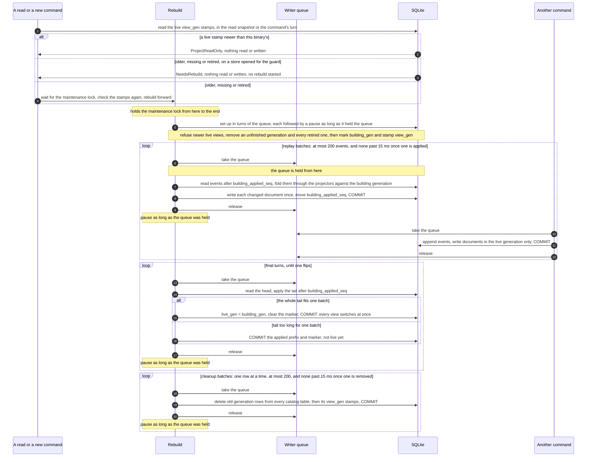
```mermaid
sequenceDiagram
  autonumber
  participant U as A read or a new command
  participant R as Rebuild
  participant W as Writer queue
  participant Q as SQLite
  participant C as Another command
  U->>Q: read the live view_gen stamps, in the read snapshot or the command's turn
  alt a live stamp newer than this binary's
    Q-->>U: ProjectReadOnly, nothing read or written
  else older, missing or retired, on a store opened for the guard
    Q-->>U: NeedsRebuild, nothing read or written, no rebuild started
  else older, missing or retired
    U->>R: wait for the maintenance lock, check the stamps again, rebuild forward
  end
  Note over R: holds the maintenance lock from here to the end
  R->>Q: set up in turns of the queue, each followed by a pause as long as it held the queue
  Note over R,Q: refuse newer live views, remove an unfinished generation and every retired one, then mark building_gen and stamp view_gen
  loop replay batches: at most 200 events, and none past 15 ms once one is applied
    R->>W: take the queue
    Note over R,Q: the queue is held from here
    R->>Q: read events after building_applied_seq, fold them through the projectors against the building generation
    R->>Q: write each changed document once, move building_applied_seq, COMMIT
    R->>W: release
    Note over R: pause as long as the queue was held
    C->>W: take the queue
    C->>Q: append events, write documents in the live generation only, COMMIT
    C->>W: release
  end
  loop final turns, until one flips
    R->>W: take the queue
    R->>Q: read the head, apply the tail after building_applied_seq
    alt the whole tail fits one batch
      R->>Q: live_gen = building_gen, clear the marker, COMMIT: every view switches at once
    else tail too long for one batch
      R->>Q: COMMIT the applied prefix and marker, not live yet
    end
    R->>W: release
    Note over R: pause as long as the queue was held
  end
  loop cleanup batches: one row at a time, at most 200, and none past 15 ms once one is removed
    R->>W: take the queue
    R->>Q: delete old generation rows from every catalog table, then its view_gen stamps, COMMIT
    R->>W: release
    Note over R: pause as long as the queue was held
  end
```

*Figure 8. A rebuild while commands run. The first use of a project whose views are behind this binary's starts one, except on a store opened for the guard, which answers `NeedsRebuild` instead; `baley rebuild` starts one on its own. Each batch holds the writer queue only for its own turn and pauses outside it, so commands, which write only the live generation, run between batches. One transaction applies the tail and flips every view.*

**Verification of views.** `baley verify <project> --views` takes the maintenance lock, so it never runs beside a rebuild. It first rebuilds forward views behind this binary's, and while an unfinished generation remains it refuses with `UnfinishedGeneration`, naming that generation, until a rebuild removes it. A building marker that names the live generation is not unfinished work a rebuild can remove: verification refuses it with `LiveGenerationProtected`, as a rebuild does. It replays the project's events into a scratch generation, stamped like a rebuild's, through the same batches and projectors, and never makes it live. In the turn that reaches the head it begins a read snapshot, on a read-only connection of its own, before releasing the writer queue, so scratch and live are compared at that one head however many commands follow, and the store's other reads go on meanwhile. For every registered view it compares the two generations' rows key by key: key and index columns, `produced_seq`, `projector_version`, and the stored document text as bytes, so a live document that is not canonical JSON differs. It reports each missing, extra or unequal document once, as (view, key), with the head it checked. Deleting the scratch generation in the same batches is tried afterwards, also after a replay or comparison error. If that deletion fails, verification returns `UnfinishedGeneration` naming the scratch generation, whether or not the comparison failed too, and its marker stays for the next rebuild; only once the scratch generation is gone does the report or the comparison's error come back. A crash leaves it for the next rebuild too. Verification changes no live row, event or payload, except through the forward rebuild it runs first for views behind this binary's. A report holds for the head it names only: an export establishes its own snapshot.

Views planned for the first build, by the question they answer. Query contracts (keys, indexes, ordering, page bounds) are in [Appendix B](#appendix-b-reads-mapped-to-views).

The store-owned `request` view is at version 2. It projects `command.claimed` to a claimed document, `command.reconciled` with an owner hold to an awaiting-owner document, and `command.completed` to a completed document. Its `by_state` index pages open claims with a bound of 100. The `claim_scope` view is at version 1, keyed by one exact token with page bound 1. `command.claimed` puts its tokens and a claim completion removes only tokens still naming that claim. Both views rebuild from events.

| View | Key | Indexed by | Answers |
|---|---|---|---|
| `roadmap` | project | | The ordered phases and their declared stories |
| `phase` | (project, phase) | status | Status, context, completion and whether it still applies |
| `plan` | (project, phase, plan) | status | Current content reference, approval binding, readiness |
| `evidence_map` | (project, phase, plan) | | The acceptance evidence a plan must produce |
| `admission` | (project, phase) | checkout | What execution may touch, and in which checkout |
| `dispatch` | (project, dispatch id) | phase, state | Active and ended dispatches, task and suite outcomes |
| `run` | (project, run id) | dispatch, phase | One run: launch, result, output reference |
| `verification` | (project, attempt id) | phase, state | Attempts, runs, claims, waivers, completion |
| `review` | (project, review id) | phase, state | Review attempts and their outcomes |
| `review_queue` | (project, item) | phase, state | Deferred reviews with rulings owed |
| `dismissal` | (project, finding fingerprint) | | The standing dismissal of a finding's fingerprint, matched when a finding returns ([0008](0008-review.md), REV-R22) |
| `risk` | (project, phase) | | Observations and receipts |
| `milestone` | (project, name) | state | Close, archive, release and landing state |
| `pause` | project | | The active pause and its resume bindings |
| `policy` | (project, checkout, host) | | The latest `policy.effective` per checkout and host, with its version |
| `checkout` | (project, path) | path | Each checkout's latest `checkout.seen`, its root commit and remote URL, which checkout admission judges a fork against |
| `guard_policy` | project | | The remembered denial policy |
| `capture` | (project, recording sequence) | capture id | Each capture's kind, phase, size, time and short text, or a long text's body hash with its purge state |
| `request` | (project, command kind, request id) | state | Each request's open claim, held claim or outcome, for retries and open claims |
| `claim_scope` | (project, scope token) | | The open claim holding each scope token, for the scope check |
| `model_catalog` | (project, catalog) | | The model names each host and provider accepts, with their source, tier and placement, and the catalog version ([0003](0003-configuration-and-routing.md)) |

Hardin reads only views, and confirms authority against events. The next-action rules, progress and gate checks become queries over `phase`, `plan`, `dispatch`, `verification`, `review_queue`, `pause` and `capture`, not a walk over the whole store.

#### Payloads, retention and purge (EVD-R11, EVD-R14)

Content is stored as a payload when it is larger than 4 KiB, or when it is of a sensitive kind at any size: command output, review material, prompts. Payloads are compressed with zstd and keyed by the SHA-256 of the uncompressed bytes, so storing the same content twice stores it once. SQLite's own measurements put the crossover at about 100 KB: smaller content reads faster inside the database, larger content faster from files. The `Payloads` trait hides where bodies live, so an adapter can move large bodies to a content-addressed directory later without the ledger changing.

**Retention is per reference.** Each event that uses a payload records a reference with its own retention class:

| Class | Examples | Default retention |
|---|---|---|
| `record` | plan and context text, verdict detail, capture text over 4 KiB | Kept for the life of the project |
| `output` | test and command output | Kept until the milestone that produced it closes, then reduced |
| `material` | review material, prompts sent to models | Kept for 90 days after its review closes |

These are the defaults. A project can change any of them in `baley.toml`, and `baley purge` removes a body at once regardless of class.

A reference stops requiring its body when its project records `payload.reduced` for it or `payload.purged` releasing it. A body is tombstoned when no unreleased reference remains in any project. A purge releases only the purging project's references and is recorded in that project's chain. Bodies are stored and read by hash, so a body another project still requires stays readable. A project may attach identical bytes again later as a new reference while another project still keeps the body.

**Reduction** applies only to an `output` reference. It stores the first and last 64 KiB as a new `record` payload attached to `payload.reduced`, which names the original hash, excerpt hash and byte ranges kept. An output of 128 KiB or less is kept whole and records no event. The store checks the original body's hash and length before releasing the reference. The original body is tombstoned only when no other reference still requires it whole. Reduction after purge is refused. Verification checks the excerpt in full and the original as a commitment.

**Purge** first releases the purging project's references to each named hash, including the excerpt references attached by that project's own reductions of an original. In one transaction it tombstones every body no unreleased reference requires, removes stored request answer bodies and derived trace rows, records `payload.purged` in the purging project's chain, and marks `scrub_pending`. Trace removal covers every row naming a removed body and the purging project's rows naming a body it no longer requires. A trace entry derived from a body must name it. Build 8's search rows derived from a body are removed by the same step, beside the trace rows, keyed to the body's hash. That step is `remove_derived` in `crates/baley-store-sqlite/src/retention.rs`, the derived-data seam the search slice extends. Events, request rows and view documents remain; they hold no payload body. A capture of 4,096 bytes or less is not a payload: its text is inline in the hashed `capture.recorded` event and in the `capture` view, so purge cannot remove it.

The `payload.purged` event lists each released reference as a `[source sequence, hash]` pair. Its `released` list and each `payload_ref.released_seq` can therefore be rebuilt from events alone. Trace removal covers a removed body's rows in every project and rows in the purging project only when that project has no other live reference to the hash. The report's `shared` list holds hashes released or requested whose body or excerpt is still required by another reference, in any project. This includes a requested original that stays reduced because another reduction requires its excerpt.

The standalone, idempotent scrub checks the compatibility epoch before any write, then holds the writer queue through a passive checkpoint, `VACUUM` and up to three truncating checkpoint attempts. It judges each truncating checkpoint's result row: only `busy = 0` completes the main database scrub and clears `scrub_pending`. Until then, purged bytes may remain in free pages or the write-ahead log, and `doctor` reports the pending marker. A purge also reads `export_record` in its logical transaction, on first run and replay. `PurgeReport.unreachable` lists sorted, distinct export targets that already received any removed or shared hash through a reference live at the export's recorded head, including an excerpt of a reduced original. A pending export is listed whenever its project references the hash. An export made after its project released the reference is not listed. Standalone `scrub` lists nothing.

Purge removes a secret held in a payload body from everything Baley manages. It cannot remove a secret written inline, such as in a capture of 4,096 bytes or less, which stays in the hashed event and the `capture` view. A secret that has already reached a review provider, an export or any other system must still be rotated; the purge report says so.

**Invariant (EVD-R10).** Every fact a projector needs is inline in the event. Payloads are attachments only. So a purge changes no view except through the `payload.purged` event it records, as the `capture` view's purge state does, and otherwise changes only whether an attachment's body can be shown. A rebuild after any purge replays that event too, so it yields the same views, with tombstones in place of purged attachments. Replay after a reduction or purge reads the same inline facts: `payload.reduced` and `payload.purged` replay like any other event, the `request` view keeps each answer's reference, and replay never opens a payload body. So a rebuild or a view verification never reconstructs a purged body, an excerpt or a released reference. `payload_ref.released_seq` is not view data and a rebuild never touches it. Build 8's search rows derived from a body are not views either: they are derived data keyed by the body's hash, removed on purge by `remove_derived`, and never rebuilt from events.

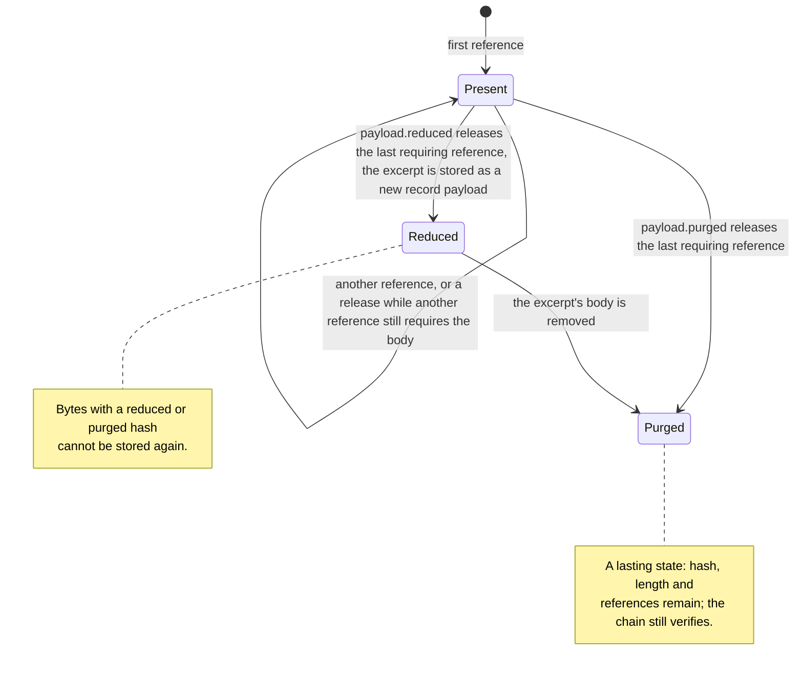
```mermaid
stateDiagram-v2
  [*] --> Present : first reference
  Present --> Present : another reference, or a release while another reference still requires the body
  Present --> Reduced : payload.reduced releases the last requiring reference, the excerpt is stored as a new record payload
  Present --> Purged : payload.purged releases the last requiring reference
  Reduced --> Purged : the excerpt's body is removed
  note right of Reduced
    Bytes with a reduced or purged hash
    cannot be stored again.
  end note
  note right of Purged
    A lasting state: hash, length and
    references remain; the chain still verifies.
  end note
```

*Figure 9. Payload lifecycle. A body changes state only when its last requiring reference is released; there is no way back from a tombstone in the store that holds it. An earlier copy restored in its place has no tombstone and may hold the body again.*

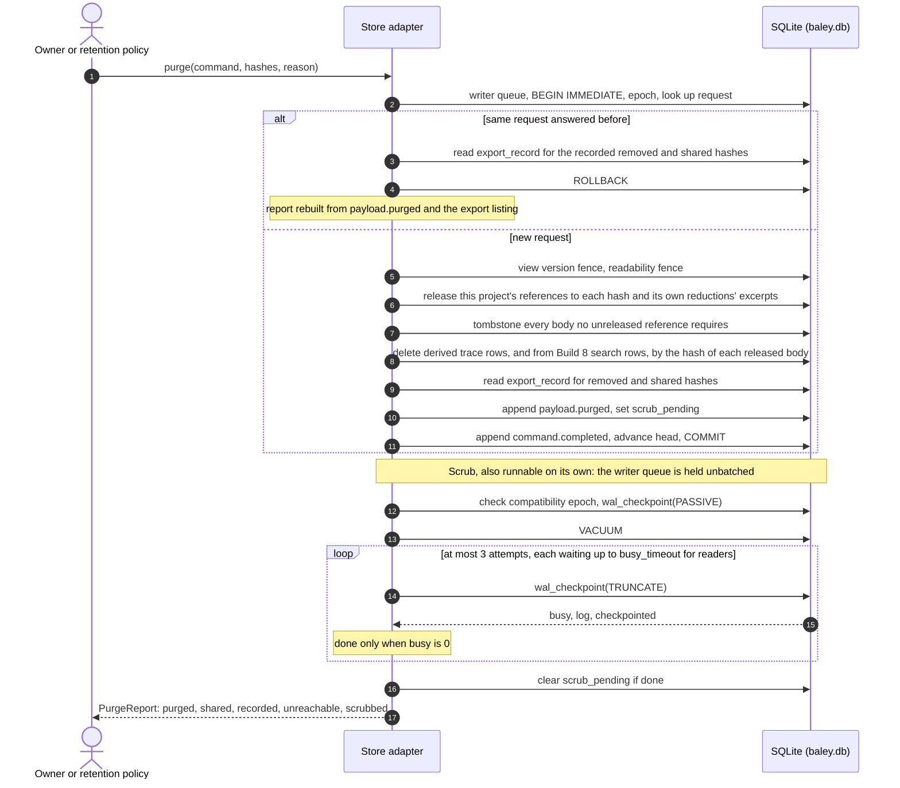
```mermaid
sequenceDiagram
  autonumber
  actor O as Owner or retention policy
  participant L as Store adapter
  participant Q as SQLite (baley.db)
  O->>L: purge(command, hashes, reason)
  L->>Q: writer queue, BEGIN IMMEDIATE, epoch, look up request
  alt same request answered before
    L->>Q: read export_record for the recorded removed and shared hashes
    L->>Q: ROLLBACK
    Note over L: report rebuilt from payload.purged and the export listing
  else new request
    L->>Q: view version fence, readability fence
    L->>Q: release this project's references to each hash and its own reductions' excerpts
    L->>Q: tombstone every body no unreleased reference requires
    L->>Q: delete derived trace rows, and from Build 8 search rows, by the hash of each released body
    L->>Q: read export_record for removed and shared hashes
    L->>Q: append payload.purged, set scrub_pending
    L->>Q: append command.completed, advance head, COMMIT
  end
  Note over L,Q: Scrub, also runnable on its own: the writer queue is held unbatched
  L->>Q: check compatibility epoch, wal_checkpoint(PASSIVE)
  L->>Q: VACUUM
  loop at most 3 attempts, each waiting up to busy_timeout for readers
    L->>Q: wal_checkpoint(TRUNCATE)
    Q-->>L: busy, log, checkpointed
    Note over L: done only when busy is 0
  end
  L->>Q: clear scrub_pending if done
  L-->>O: PurgeReport: purged, shared, recorded, unreachable, scrubbed
```

*Figure 10. A purge: the logical removal in one transaction, then the scrub. The logical removal deletes, by body hash, the derived rows that name a released body: the trace rows, and from Build 8 the search rows, in the same step. The scrub is idempotent and runs on its own too; a pending scrub is marked until it completes.*

#### Physical schema (SQLite adapter)

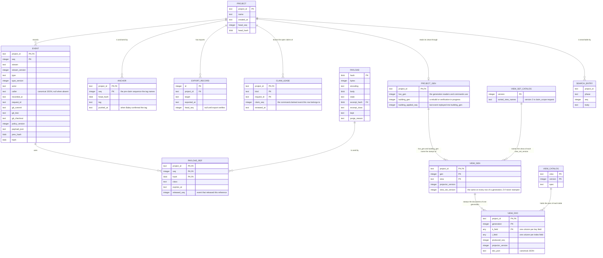
```mermaid
erDiagram
  PROJECT ||--o{ EVENT : "records"
  PROJECT ||--o{ ANCHOR : "is anchored by"
  PROJECT ||--o{ EXPORT_RECORD : "has exports"
  PROJECT ||--o{ CLAIM_LEASE : "leases the open claims of"
  EVENT ||--o{ PAYLOAD_REF : "uses"
  PAYLOAD ||--o{ PAYLOAD_REF : "is used by"
  PROJECT ||--o| PROJECT_GEN : "reads its views through"
  PROJECT_GEN ||--|{ VIEW_GEN : "live_gen and building_gen name the stamps of"
  VIEW_GEN ||--o{ VIEW_DOC : "stamps the documents of one generation"
  VIEW_SET_CATALOG ||--o{ VIEW_GEN : "names the views of each view_set_version"
  VIEW_CATALOG ||--o{ VIEW_DOC : "holds the spec of each table"
  PROJECT ||--o{ SEARCH_ENTRY : "is searchable by"
  PROJECT {
    text project_id PK
    text name
    text created_at
    integer head_seq
    blob head_hash
  }
  ANCHOR {
    text project_id PK, FK
    integer seq PK "the pre-claim sequence the tag names"
    blob head_hash
    text tag
    text pushed_at "when Baley confirmed the tag"
  }
  EXPORT_RECORD {
    integer id PK
    text project_id FK
    text target
    text exported_at
    integer head_seq "null until export verifies"
  }
  CLAIM_LEASE {
    text project_id PK, FK
    text kind PK
    text request_id PK
    integer claim_seq "the command.claimed event this row belongs to"
    text renewed_at
  }
  EVENT {
    text project_id PK, FK
    integer seq PK
    text stream
    integer stream_version
    text type
    integer type_version
    text actor
    text caller "canonical JSON, null when absent"
    text recorded_at
    text request_id
    text git_commit
    text git_tree
    text git_checkout
    integer policy_version
    text payload_json
    blob prev_hash
    blob hash
  }
  PAYLOAD {
    blob hash PK
    integer bytes
    text encoding
    blob body
    text state
    blob excerpt_hash FK
    text excerpt_class
    text kept
    text purge_reason
  }
  PAYLOAD_REF {
    text project_id PK, FK
    integer seq PK, FK
    blob hash PK, FK
    text class
    text expires_at
    integer released_seq "event that released this reference"
  }
  PROJECT_GEN {
    text project_id PK, FK
    integer live_gen "the generation readers and commands use"
    integer building_gen "a rebuild or verification in progress"
    integer building_applied_seq "last event replayed into building_gen"
  }
  VIEW_GEN {
    text project_id PK, FK
    integer gen PK
    text view PK
    integer projector_version
    integer view_set_version "the same on every row of a generation, 0 if never stamped"
  }
  VIEW_SET_CATALOG {
    integer version PK
    text sorted_view_names "version 2 is claim_scope request"
  }
  VIEW_CATALOG {
    text view PK
    integer version PK
    text spec
  }
  VIEW_DOC {
    text project_id PK, FK
    integer generation PK
    any k_field PK "one column per key field"
    any i_field "one column per index field"
    integer produced_seq
    integer projector_version
    text doc_json "canonical JSON"
  }
  SEARCH_ENTRY {
    text project_id
    text phase
    integer seq
    text body
  }
```

*Figure 11. Tables of the SQLite adapter at compatibility epoch 1. `VIEW_DOC` stands for one table per view version, `v_<view>_<version>`, with a `k_` column per key field and an `i_` column per index field; `request` is an ordinary view, and its documents belong to their generation like any other view's. `SEARCH_ENTRY` is an FTS5 virtual table that arrives with Build 8. `EVENT.caller` is null for an event with no caller.*

Further tables: `schema_meta` (compatibility epoch, `schema_digest`, creation time and `scrub_pending`) and `trace` (diagnostics, outside the chain, size-capped, with an optional payload hash). `export_record` records project id, canonical target, export time and verified head sequence; a null head means pending. It is operational metadata outside the chain, read by purge to list copies it cannot reach. A `claim_lease` row is liveness only, matched to its claim by `claim_seq`, and never rebuilt. An `anchor` row caches a tag Baley confirmed on the remote. `Transaction::record_anchor` writes it in the transaction that records its `anchor.pushed` event, so neither commits without the other, and a second row for the same sequence must agree in every value. The row is outside the chain and outside generation rebuilds, and it is never the witness `verify` compares against: it is reported beside the remote anchor, and a difference is reported, not corrected.

`project_gen` holds each project's live generation and, while a rebuild or verification runs, the generation it builds and the last event applied to it. `view_gen` holds, per generation, each view's projector version and the view set version of the binary that built it. Per generation, a view's documents and its `view_gen` stamp belong to that generation; a rebuild or cleanup never touches events, payloads, references and their `released_seq`, anchors, leases, trace rows, `schema_meta` or either catalog. `view_catalog` records each view version's spec, and `view_set_catalog` each view set version's sorted view names, seeded with version 1 as `request` alone and version 2 as `claim_scope request`. Both are global and independent of any project's generations: they say what a version means, not which project uses it.

`event.caller` holds the caller's canonical JSON ([Events](#events)) under a `json_valid` check, as `payload.kept` does, and is `NULL` when the event has no caller. It has no index, and export copies it with the rest of the row.

The schema stays at epoch 1 until the first release and is edited in place: `view_gen.view_set_version`, `view_set_catalog`, `export_record` and `event.caller` are part of it, no table or column is added to an existing file at open, and a file written before Build 2 T13 removed the `checkout` table, or before `event.caller` was added, is disposable, so it refuses to open and the owner is told to delete it. No migration adds the column. `schema_meta` records the SHA-256 digest of the schema text at creation. A build whose schema text differs refuses to open the file and tells the owner to delete it; there is no migration.

`PAYLOAD_REF.released_seq` is the sequence of the `payload.reduced` event naming its original `[seq, hash]` reference or of the `payload.purged` event listing that reference in `released`. It is derived from those events, not an independent fact.

Indexes: `event(project_id, stream, stream_version)` unique; `event(project_id, type, seq)`; `event(project_id, git_commit)` for `why`; `payload(excerpt_hash)` for non-null excerpts; `payload_ref(hash)`; `export_record(project_id)`; `trace(payload_hash)` for a purge's trace removal; each view's declared indexes, each on (project, generation, its fields in their orders, the key).

Connection settings: `journal_mode=WAL`, `synchronous=FULL`, `foreign_keys=ON`, `secure_delete=ON`, `busy_timeout=5000`, page size 8 KiB. A store opened for the guard sets the busy timeout of its write and read connections to its storage time left, before each statement, instead (see [Processes and concurrency](#processes-and-concurrency-evd-r8-evd-r19)). rusqlite's bundled build compiles SQLite from source (3.53.2 with the locked rusqlite 0.40.2) with FTS5 enabled, so no system SQLite is used.

#### Location, layout and file safety (EVD-R16, EVD-R22)

The home directory is `BALEY_HOME` if set, otherwise Baley's data folder under the crenshawdev vendor folder: `$XDG_DATA_HOME/crenshawdev/baley`, falling back to `~/.local/share/crenshawdev/baley` when `XDG_DATA_HOME` is unset, empty or relative, on Linux; `~/Library/Application Support/crenshawdev/baley` on macOS. An empty or relative `BALEY_HOME`, or one with no final folder name (`/` or a path ending in `.` or `..`), is refused with `baley-home-invalid`, so a development build never falls back to the owner's ledger. When `HOME` is needed and is missing, empty or relative, Baley refuses with `user-home-invalid`. The command line creates a missing home with mode 0700 and its parents with the default mode, and never changes an existing folder or file. Each crenshawdev application has its own folder there, and nothing is shared at the vendor level ([ADR 0027](../adr/0027-vendor-folders-and-plain-keys.md)).

```
<home>/                created 0700 by the command line
  baley.db              ledger database, created 0600 by the adapter
  baley.db-wal          write-ahead log, given the database's mode by SQLite
  baley.db-shm          shared memory index, given the database's mode by SQLite
  baley.db.writer       writer queue lock, created 0600 by the adapter
  baley.db.maintenance  rebuild and view verification lock, created 0600 by the adapter
```

On every open, the store resolves the home's real path, following a link above the home, and checks the home and each store file present: `baley.db`, its log, its shared-memory file and both lock files. None may be a symbolic link; the home must be a folder and each file a regular file, owned by the effective user, with no permission bit beyond 0700 for the home or 0600 for a file. Only permission bits are judged, not setuid, setgid or sticky bits. Anything else is refused with `unsafe-home`, naming each path, what is wrong and the fix (`chmod 700`, `chmod 600`, `chown`, or replacing the link with the real folder or file), before anything is opened or created. For a path of the wrong kind, the fix is to remove or rename it. Known faults take precedence over unreadable files; with no known fault, an inspection failure makes the store unavailable. The caller must create the home before the adapter opens it. The checks and the open are separate steps: they do not defend against the owner swapping a link between them. Exports are created private. Settings are TOML files, one global and one per project ([0002](0002-system-design.md), SYS-R13), and provider keys are lines in `keys.env`; where they live is set by [0003: Configuration and routing](0003-configuration-and-routing.md) (CFG-R2, CFG-R3, CFG-R24). On macOS the global file `config.toml` and `keys.env` sit in the same folder as the ledger; on Linux they are in the config folder, `$XDG_CONFIG_HOME/crenshawdev/baley`, or `~/.config/crenshawdev/baley` when `XDG_CONFIG_HOME` is unset, empty or relative. When `BALEY_HOME` is set, `config.toml`, `keys.env` and the database all live in it. Where the folder holding `keys.env` is the home (on macOS, or when `BALEY_HOME` is set), the home's own open checks above apply to it; the `keys.env` check itself does not check the folder (CFG-R24).

**Network shares are not supported.** SQLite's write-ahead log does not work over a network filesystem ([sqlite.org/wal.html](https://www.sqlite.org/wal.html)). Baley makes no filesystem check.

**Copies of the store.** Baley makes no backups. The owner can copy the whole store with SQLite's backup API, a filesystem snapshot, or Baley stopped. A restore returns the ledger only to the copy's moment. After restoring behind the latest remote anchor, the owner runs `acknowledge-restore`; verification keeps that accepted gap visible. A restore also loses the purges recorded after the copy, so a body they removed may be back. The acknowledgement and every later report that lists the gap warn about this, and the owner re-runs the purges they know of for each project from records kept outside the store and rotates affected secrets. A purge cannot reach such copies. An export is a new home of mode 0700 with a mode-0600 `baley.db` containing only one project.

Development builds set `BALEY_HOME` so they never touch the owner's real ledger. The ledger's tests never read the environment: folder resolution takes supplied values and store tests open private temporary folders.

#### Project identity and policy (EVD-R17)

A project is initialized with `baley init`, run at the repository root. It writes the project file, `baley.toml`, at the root, with a new random project id (a lower-case UUID version 4) and the project's name, which is the root folder's name unless `--name` gives another; the owner commits the file. It then creates the project in the ledger. What follows has two orders, which turn on whether the project's chain already holds events. On an empty chain, init records `project.initialized` version 1, payload `{"name"}`, on the `project` stream with policy version 0, then admits the checkout, as checkout admission below says, then runs the policy step. On a chain that already holds events, init admits the checkout first, then records a missing `project.initialized` at version 0, then runs the step. Init reads whether the chain is empty in the transaction that appends `project.initialized`, so when it finds events there it records nothing and goes on in the second order. That order is what stops a plain init in a fork from appending to a chain it does not own: over a chain that holds another remote's `checkout.seen` and no `project.initialized`, the checkout admission refuses before anything is appended. On every run that passes its refusals, the step records `policy.effective` when the policy changed, the first one on a new project, and init last runs detection silently. The step is Baley's own command and records the first `policy.effective` at policy version 0, the version it replaces, while `project.initialized` keeps version 0.

Each step is skipped when its result already exists. An interrupted init is finished by running it again, and a checkout where the file, the project and the event all exist and whose checkout and policy are unchanged records nothing in the project's chain, not even a completed command. A rerun after a policy change records only `policy.effective`, and init still reports the project as already initialized. A crash between `project.initialized` and the first `policy.effective` is finished by the next run, since the step runs on every run, not only on one that records `project.initialized`. A second init racing the first records one `project.initialized`, because the check that the chain is empty runs in the same transaction that appends it. Plain `baley init` never changes an existing project file: its id and name are used, and a `--name` that differs is reported as not applied. A clone on another machine has the committed file but not the project, so `baley init` there creates the project in that machine's ledger from the committed id and records its `project.initialized`.

`baley init` refuses, before it writes anything or opens the ledger, with the first of these that holds, in this order:

- the working directory is not inside a git repository: `not-a-repository`;
- the working directory is inside a repository but below its root: `not-repository-root`, naming the root;
- the project file is not a regular file, cannot be read, does not parse, lacks the project's id or name, or holds an id that is not a lower-case UUID version 4: `config-unavailable`, naming the file;
- no project file exists, no `--name` is given, and the root has no folder name Baley can use as the project's name (a repository at `/`, or a folder name that is not UTF-8): `project-name-required`;
- the global file is not a regular file, cannot be read or is invalid, or HEAD's copy of `baley.toml` cannot be read or is invalid: `config-unavailable`, naming the file and the fault, a fault in HEAD's copy as HEAD's copy of the file; a file that cannot be read is named before a file that is invalid, and within each the global file before HEAD's copy;
- the repository root, or a settings file's path, is not UTF-8: `config-unavailable`, naming the path;
- git fails while reading the checkout's root commit: refused, naming the git command;
- `git.remote` names a remote the checkout lacks: refused with "remote X is not configured in the git repository at <root>";
- git fails while reading the checkout's remote URL: refused, naming the git command.

One refusal comes after the ledger opens, because it needs the project's checkouts: plain `baley init` in a checkout that is a fork is refused `project-id-conflict` at checkout admission, naming `baley init --new-id`, and records nothing.

TOML is a format people already read, diff and edit by hand; when Baley writes the file, comments and key order in it are not kept ([ADR 0027](../adr/0027-vendor-folders-and-plain-keys.md)). The file holds the project id, the project name, and the project's policy: reviewers, routing and protected branches, the project-level settings (0002, SYS-R13). Its location and discovery are designed in [0003](0003-configuration-and-routing.md) (CFG-R3, CFG-R4).

Baley finds a checkout's project the way git finds a repository: it walks up from a directory to the first directory holding the project file, stopping at the repository root. The command line walks from its working directory, and the server and the guard from their session's `CLAUDE_PROJECT_DIR`, the server afresh on every project call. A directory with no project file is not managed and the guard stays silent.

**Checkout admission.** Every command that records in a project's chain from a checkout of that project admits the checkout first, by judging it against the project's other checkouts and recording `checkout.seen` (path, root commit, remote URL). Those commands are `baley init`, `purge` from a checkout of the project it names, `baley config set` after a write in a project in this machine's ledger, `anchor` and `acknowledge-restore`. These admit nothing: `verify`, `doctor`, `export`, `rebuild`, `scrub`, a `config set` that changes nothing or runs outside a ledgered project, a `purge` run anywhere else, and the records in the per-user project `user`. The session server's write preparation admits the checkout for each write, a read admits nothing, and the guard never does.

The order is the same for each. The project is discovered and its settings are read and validated (on the server, a write's request is looked up first, and a request the ledger already holds is answered with its original receipt, with no checkout admission and no step, even when a settings file has since broken), and for `anchor` and `acknowledge-restore` `git.remote` is checked against `git remote` by exact name. The checkout's root commit and remote URL are gathered. The judgement and `checkout.seen` are made in one transaction. The policy step then runs in a transaction of its own, and the command last. A refusal at or before checkout admission records nothing in the project's chain. The step is a transaction of its own, so on the server a ledger fault at the step can follow a `checkout.seen` that was already recorded.

The remote a checkout records is the fetch URL, as `git remote get-url` gives it, of the remote the project setting `git.remote` names, else of `origin`, else none. A `git.remote` that names a remote the checkout lacks refuses, since a checkout recording none is never judged a fork and would let a fork name a remote it lacks. A checkout with no `origin` and no `git.remote` records none, and any other git failure refuses, naming the git command. User information in a `scheme://...@host` URL is removed before the URL is recorded or compared, a bare user included, so a token used as a user name never enters the ledger and a rotated token is not a fork. An scp-style `git@host:path` is kept. Only user information is removed, so a credential elsewhere in a URL, such as in a query string, is kept. The root commit comes from `git rev-list --max-parents=0 HEAD`, the lexically smallest when HEAD has several roots, and is none on an unborn HEAD.

The judgement reads the project's `checkout` view, which holds one row per path and never removes one. A conflict exists when this checkout has a remote URL and another path's row holds a different one, compared as exact strings. An https clone and an ssh clone of one repository are therefore a fork until `git remote set-url` in one of them makes the URLs agree. Because rows never expire, a checkout deleted while it still held an old URL keeps the conflict until `baley init --new-id` gives the project a new id. A conflict is refused `project-id-conflict`, naming both checkouts and `baley init --new-id`, and nothing is recorded in that project, not even a refusal. Otherwise `checkout.seen` is recorded when the checkout is new or its root commit or remote URL changed. It is recorded as Baley's own command, `checkout.admit` by actor `baley`, carrying the policy version stored for that checkout and no host, or 0 when none is stored. On the server the actor is still `baley`, and the command carries the call's caller and the server's time. The command line passes no caller. A checkout that is unchanged opens no command. Two checkouts admitted at once are judged in queue order, since the judgement is made again inside the transaction that records. `baley config set` writes its file before it admits, so in a fork it is refused after the write, and the refusal says the change stands.

`baley init --new-id` gives a fork its own project, and works whether or not a conflict exists. It writes a fresh id into `baley.toml`, keeping the project's name, its other keys and every other table, though comments and key order are not kept, and it refuses `config-conflict` when the file changed since init read it. It then creates that project, records its `project.initialized`, admits the checkout under the new id, and runs the step and detection as any init does. The old project is left as it was, and the owner commits the new file. A `--name` is not applied over an existing file, and with no file `--new-id` is plain `init`.

**Effective policy.** Policy has layers: built-in defaults, the owner's global settings and the project settings, merged as [0003](0003-configuration-and-routing.md) specifies (CFG-R5, CFG-R6), with each host's section applying only to that host (0002, SYS-R13). Whenever the merged result changes, for any layer, Baley records `policy.effective` with the full merged policy and the layer each value came from. Policy version 0 means that no recorded policy applies. Each command records a version as this table says, as in 0003 (CFG-R8, CFG-R9):

| Command | Project from | Policy step | Version recorded |
|---|---|---|---|
| `baley init` | discovery at the repository root | yes, after `project.initialized` and checkout admission | 0 on `project.initialized` |
| `baley config set` in a project | discovery | yes, after the write, when the project is in this machine's ledger | the version in force after it, or 0 when the project is not in this machine's ledger, where `baley init` records the policy |
| `baley config interview` | discovery | only through its one `config set` | that set's version, and none when the interview is declined or every answer is blank |
| `anchor`, `acknowledge-restore` | discovery | yes | the version in force |
| `purge` | its argument | only when run from a checkout of that project | the version in force there, otherwise 0 |
| `verify --local-only`, `verify --views`, `export`, `rebuild` | their argument | no: no event is appended | none |
| `verify` with no flag | discovery, with an optional argument naming the same project | no: it reads the settings and appends nothing | none |
| `doctor` | discovery for the discovered project's remote, every other project checked locally | no: it reads the settings and appends nothing | none |
| `scrub` | none | no: no event is appended | none |
| `baley models add`, `remove` and `update`, detection, seeding | the per-user project `user` | no | 0 |
| a session server's project call | discovery at the session's `CLAUDE_PROJECT_DIR` | a write: yes, under the host's key, after checkout admission. A read: no. A write the ledger already holds: no | a write: the version the step returned, recorded on its own command, and checkout admission carries the version stored for the checkout and no host. A read: none, it records nothing. A write the ledger already holds: none, it gets its original receipt |
| `policy.effective` itself | the command it belongs to | it is the step's own record | the version it replaces, 0 for the first of its key |
| `checkout.seen` itself | the command it belongs to | no: it runs before the step, as a command of its own | the policy version stored for the checkout and no host, 0 when none is stored |

The policy step runs before every command that appends to a project's chain from a checkout, and a command that appends to no chain runs no step. It re-reads both files and is a command of its own, `policy.record` by actor `baley`, and it opens no command when nothing changed. The command line's step is keyed by the checkout and no host. The server's step is keyed by the host, records the policy with that host's sections applied, carries the call's caller, and returns the version its write records on its own command. A server read runs no step, and neither does a write whose request the ledger already holds. Checkout admission, described above, runs before the step for every command that runs one. Records in the per-user project `user` carry 0 and build no policy. `purge` is the one chain-writing command that may run outside a checkout: it runs the step only from a checkout of the project it names, and anywhere else it reads no settings file and records 0. From a managed checkout whose `baley.toml` yields no id (it cannot be read, does not parse, or holds no valid id), `purge` refuses with `config-unavailable`, naming the file and saying that a purge run outside a checkout of the project records policy version 0. A `baley config set` outside any project, one in a project that is not in this machine's ledger, and one that changes nothing run no step. The first two give 0, since no recorded policy applies, and one that changes nothing gives the version in force. `baley config interview` runs no step of its own: its one `config set` runs the step as that set does, and an interview that is declined or has every answer blank opens no store and runs no step.

Each checkout runs under the project file committed at its own HEAD; if two checkouts of one project run under different policies, Hardin reports the divergence and names both. The project id is taken from the working-tree `baley.toml`, so a new project is managed before its first commit, while the project's settings come from the copy committed at HEAD. An unborn HEAD, or a project file not yet committed, gives an empty project layer; any other failure to read HEAD's copy refuses with `config-unavailable`, naming the file. When the working-tree file differs from HEAD's copy, or is not yet committed, `baley config show` and `baley doctor` show a diagnostic that its changes apply once committed; the policy step itself prints nothing. That diagnostic is a note about the file, not part of the effective policy Baley records, so an uncommitted edit is not a policy change, and `baley config set` on the project file likewise says the change applies once committed. The routing-admission rule is kept: a dispatch whose routing inputs changed since admission is refused.


Agents may not edit the project file; the guard refuses writes to it.

#### What replaces the Markdown and JSON files (EVD-R18, EVD-R25)

| Today | Replacement |
|---|---|
| `ROADMAP.md` phase list, read by every status query | `roadmap` stream and view. The commands of [0004](0004-starting-a-project-and-changing-scope.md) declare, edit, reorder and withdraw phases. |
| `REQUIREMENTS.md` traceability rows | `story.declared`, `story.corrected`, `story.reassigned` and `story.dropped` events ([0004](0004-starting-a-project-and-changing-scope.md)) and the `roadmap` view. Completion and undo record events instead of editing rows. |
| `PROJECT.md` milestone version | The `milestone` view. |
| `phases/<n>/CONTEXT.md` | `story.refined` events on the stories a phase commits ([0005](0005-context-plans-and-acceptance.md)). Each carries the id of the question set its truths were drafted from; the answers and deferrals are that set's own `question.answered` and `question.deferred` records (0005 section 6). |
| `phases/<n>/PLAN-k.md`, parsed by execution | `plan.approved` event carrying the approval binding; execution reads the typed plan from the `plan` view, never parses Markdown. |
| `phases/<n>/SUMMARY.md` | A query over the `dispatch` and `run` views. Git source accounting no longer needs an exemption for Baley's own files, because Baley writes none. |
| `phases/<n>/UAT.md` | `observation.recorded` events ([0007](0007-verification.md)). |
| `DEFERRED-*.json`, `ADJUDICATION-*.json` | `review.deferred` and `review.adjudicated` events; the `review_queue` view feeds next-action with the precedence [0008](0008-review.md) defines (REV-R11). |
| task, spike and debug Markdown | Their own streams and views. |
| `why` and `recall` reading Markdown from git history | `why` joins commits to the events that name them (`event(project_id, git_commit)`); `recall` uses the `Search` capability. Nothing is lost when a milestone is archived, because nothing is deleted. |
| Pause committing store files | `pause.recorded` carries today's resume bindings (preserved HEAD, branch, policy version, occurrence, next step); `pause.resumed` records a resume that passed those checks. Pause still commits the owner's work in progress; it never commits Baley's records. |
| Milestone prune deleting phase directories | `milestone.archived`, a separate owner-approved step bound to one exact `milestone.close_ready`, as prune is today. Archived phases leave the active roadmap; nothing is deleted. |

The owner reads records with `baley show <thing>` (for example `baley show plan 5-2`) and can write any record to a Markdown file. Both arrive in Build 9, which settles the record export's spelling beside `baley export <project> --to <dir>`, the standalone project export that exists now. Agents read them through the existing MCP `document` query, which is served from views. No file Baley exports is ever read back.

#### Working-tree writes

Baley's records never live in the working tree (EVD-R18). The only writes Baley makes there are:

- the project file, when `baley init` finds none at the root, when `baley init --new-id` rewrites it with a new project id and every other key kept, and when the owner changes policy through Baley;
- exports, to a path the owner names;
- the git operations that belong to commands: undo's revert, the release manifest bump, pause's work-in-progress commit, and landing.

#### Processes and concurrency (EVD-R8, EVD-R19)

Each process opens its own connection. SQLite's write-ahead log lets any number of readers run alongside one writer, and readers see a consistent snapshot.

- **MCP server.** One per Claude Code session, over stdio, serving the session and its subagents (0002, SYS-R1). Each server opens its own write connection and read connection to the per-user store, beside the guard hook's and the command line's, and the ledger adapter holds one of each per store.
- **Guard hook.** Starts per tool call and opens the store with the guard's options: no integrity scan, and a storage time from its budget of at most 2 seconds ([0010](0010-guard.md), GRD-R14). It takes every lock and connection it needs by nonblocking tries against that time and answers busy when the time runs out. It reads the views it needs and, for a decision worth recording, appends one `guard` event. A project whose views are behind this binary's answers needs-rebuild: the guard never rebuilds views and never takes the maintenance lock. A project with no events and no generation yet is stamped in the guard's own bounded writer turn. It holds no write transaction while it evaluates.
- **CLI.** Opens one store per command. Chain verification uses its own read-only connection. An anchor renews its lease on a second thread, stopped and joined before the record step.

**Writer queue.** Before `BEGIN IMMEDIATE`, every write, maintenance included, takes a blocking exclusive lock on `<home>/baley.db.writer`. The kernel parks waiting writers and wakes them when the lock is released, instead of SQLite's sleep-and-retry busy handler, which starved writers for seconds under load (see [Performance](#performance)). The lock is not strictly first-in, first-out, so rebuilds and generation cleanup run in short batches and pause after each batch for as long as they held the queue. The purge scrub is the one exception: it holds the queue unbatched through a passive checkpoint, `VACUUM` (one whole-database rebuild) and the truncating checkpoint attempts. It is an owner operation, so the pause is the owner's. A store opened for the guard never blocks on its own queue: it tries the in-process mutex and then `flock` with `LOCK_NB`, and after a refusal pauses 10 ms, or the time left if that is less, and tries again, until its storage time is spent, when the write answers busy with nothing written. It takes its write and read connections by the same tries, and a guard whose time runs out while it takes one answers busy before anything begins. A guard meeting a running scrub therefore answers busy. Write transactions start with `BEGIN IMMEDIATE`, so a writer takes the database lock before reading and two writers never deadlock on an upgrade. `busy_timeout` stays at 5 seconds as a backstop, after which a writer fails with a clear "store busy" error. On a guard store it is instead the storage time left, set before each statement and zero once the time is spent. Once a write transaction has begun it runs to commit or rollback, on every store: a deadline bounds the waits before it, never the work inside it. Projectors fold all of a transaction's events into their documents in memory and write each changed document once. Export reads one source snapshot without holding this queue; it takes the queue only to write and complete its export record. It waits for the new copy's own queue without limit, even from a store opened for the guard (#203), which the guard never exports from.

**Maintenance lock.** A rebuild or view verification also holds `<home>/baley.db.maintenance` from start to end, taken the way the writer queue is: an in-process mutex first, because `flock` belongs to the open file and two threads of one store would otherwise hold it at once, then a blocking `flock`, so threads of one process and separate processes take turns. Commands do not take it, so they run between a rebuild's batches. A read or command that finds its project's views behind this binary's waits for it with no timeout, checks the views again, and goes on without a rebuild if another process finished one meanwhile. On a store opened for the guard it does not wait: views behind answer needs-rebuild with nothing written, and the lock is never taken, so a rebuild in progress reaches the guard as needs-rebuild until its flip. A project with no events and no generation yet needs no rebuild, and a guard stamps it in its own bounded writer turn without the lock. A process that dies during a rebuild releases the lock and leaves the generation's marker for the next rebuild.

**Batch timing.** A store has one timing dependency, a monotonic clock and a pause, and every rebuild, cleanup and view verification batch uses it, whether started by the owner or by a project's first use. A batch's hold runs from acquiring the writer queue, not the wait for it, through commit and release; the 15 ms bound is read from the same clock, and the pause after the batch is as long as the hold. A store opened for the guard reads the same clock to fix when its storage time ends and to know the time left before each try and statement, and pauses through it between tries. Tests supply their own instants and record the pauses asked for, so no test reads a live clock or sleeps.

**Compatibility epoch.** Every write transaction reads the compatibility epoch from `schema_meta` before anything else. A process whose epoch is older than the stored one stops writing, answers read-only, and tells the caller which binary is needed. A session's server keeps the binary it started with, so after an upgrade it answers read-only until a new session starts the new binary, and nothing hands its session over. The exit checkpoint reads the stored epoch and skips a store that is not at its own. No migration exists yet, so an older epoch is refused at open. Until the first release, the schema stays at epoch 1 and is edited in place: ledgers written before a release are disposable. `schema_meta` records the digest of the schema text at creation; a build with a different epoch-1 schema refuses to open the file as a schema change and tells the owner to delete it. That covers a file written before `event.caller` existed, and an export home, which opens through the same check.

**Verification.** `verify` opens a read-only connection of its own, which cannot create a missing database file and sets only the busy timeout, and holds one read transaction for the project's events, its latest anchor row, its references, bodies and excerpts, as a payload stream and a view comparison do. The store's read connection stays free, and commands keep committing beside it, unseen by the snapshot. It holds one stored event, or one 64 KiB chunk of one body, at a time, plus the report.

**Checkpoints.** SQLite folds the write-ahead log into the database automatically every 1,000 pages, and in steady state nothing else does: a server checkpoints at no idle moment and runs no timer while its connection is open. A reader that never finishes would stop the automatic fold and let the log grow without bound; Baley's reads are short-lived by construction, apart from a view verification's comparison snapshot, which lasts one project's comparison, and a chain verification's snapshot, which lasts one project's walk. When a session's server exits, it stops taking calls, gives accepted work at most ten seconds and then makes one `PASSIVE` attempt. The attempt takes a free connection without waiting and sets its busy timeout to zero, and it takes neither the writer queue nor the maintenance lock, so it cannot hold up another session or the guard. It never loops or retries, and it may be incomplete: the server says on stderr whether it was complete, incomplete, unavailable or an error, and never claims the log was shortened. It is skipped on a fenced store. A server that is killed rather than stopped makes no attempt, and the automatic fold covers the log later. `baley doctor` reports the log size and warns above 8,192,000 bytes, 1,000 pages of this store's 8 KiB page size.

#### Opening the store

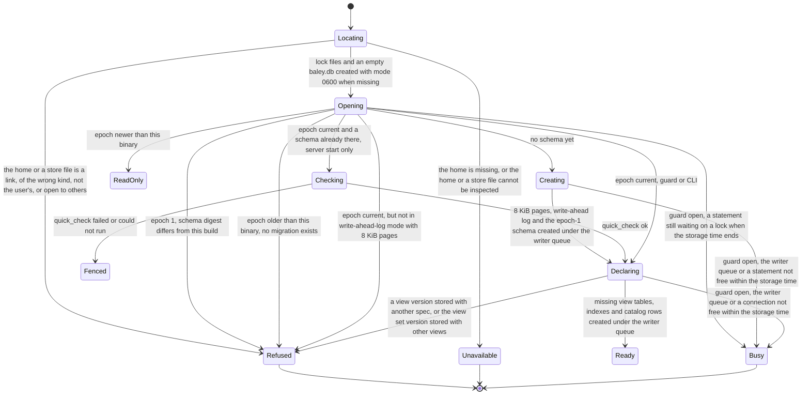
```mermaid
stateDiagram-v2
  [*] --> Locating
  Locating --> Refused : the home or a store file is a link, of the wrong kind, not the user's, or open to others
  Locating --> Unavailable : the home is missing, or the home or a store file cannot be inspected
  Locating --> Opening : lock files and an empty baley.db created with mode 0600 when missing
  Opening --> Creating : no schema yet
  Creating --> Declaring : 8 KiB pages, write-ahead log and the epoch-1 schema created under the writer queue
  Opening --> Refused : epoch 1, schema digest differs from this build
  Opening --> ReadOnly : epoch newer than this binary
  Opening --> Refused : epoch older than this binary, no migration exists
  Opening --> Refused : epoch current, but not in write-ahead-log mode with 8 KiB pages
  Opening --> Checking : epoch current and a schema already there, server start only
  Checking --> Declaring : quick_check ok
  Checking --> Fenced : quick_check failed or could not run
  Opening --> Declaring : epoch current, guard or CLI
  Declaring --> Refused : a view version stored with another spec, or the view set version stored with other views
  Declaring --> Ready : missing view tables, indexes and catalog rows created under the writer queue
  Opening --> Busy : guard open, a statement still waiting on a lock when the storage time ends
  Creating --> Busy : guard open, the writer queue or a statement not free within the storage time
  Declaring --> Busy : guard open, the writer queue or a connection not free within the storage time
  Refused --> [*]
  Unavailable --> [*]
  Busy --> [*]
```

*Figure 12. Opening the store. A binary never writes to an epoch it does not understand or to an epoch-1 file of another schema. A changed view spec or view set needs a new version. Reconciliation at start belongs to the caller on its first use of each project. The command line resolves the home and creates it with mode 0700 when missing. Locating checks the real home and each store file present before anything is opened or created. A store whose `quick_check` failed stays open but fenced: every write is refused, reads continue and no view is declared. An open for the guard waits for nothing past its storage time and answers busy rather than return a store without its schema or its views.*

Open checks each declared view version's spec against `view_catalog` and the declared view set version's names against `view_set_catalog`, reading first on the read connection so that an open that finds everything in place takes no write. It records a spec or set version seen for the first time, creates missing view tables and indexes under the writer queue, and refuses a version already recorded with another spec or other names. It looks at no project's views: each project is brought to this binary's views on its first use, as in Figure 8, so one project that needs a rebuild never keeps the store from opening. A store opened for the guard answers that first use with needs-rebuild instead (see [Processes and concurrency](#processes-and-concurrency-evd-r8-evd-r19)).

The guard opens with a storage time from its budget, cut to at most 2 seconds, and open reads the store's clock once to fix when that time ends. Every statement open runs, each connection's own settings included, has the time left when it starts as its busy timeout, zero once the time is spent. Creating the schema and declaring a view set seen for the first time take the writer queue by nonblocking tries against the same time, and so does creating the per-user `user` project and its first stamps after open. None of this is skipped: when the time runs out first, each answers busy, and an open that answers busy returns no store, while a busy schema creation leaves no schema.

A session's MCP server runs SQLite's `quick_check` when it opens a store whose schema already exists, after the epoch, schema-digest and file-setting checks and before any view is declared. A schema that open creates skips it. A check that fails, or cannot run, fences the store: every write is refused as unavailable and carries the check's report, reads continue, nothing is declared and the exit checkpoint is skipped. The refusal is not a read-only one, because a damaged file needs no newer binary. The fence belongs to that open and is not recorded in the file. The guard and the CLI never run the check, so a guard call never scans the database and they open the same file as before. The full `integrity_check`, chain and view verification run in `baley doctor`.

### Workflows

#### From an approved plan to a verified phase

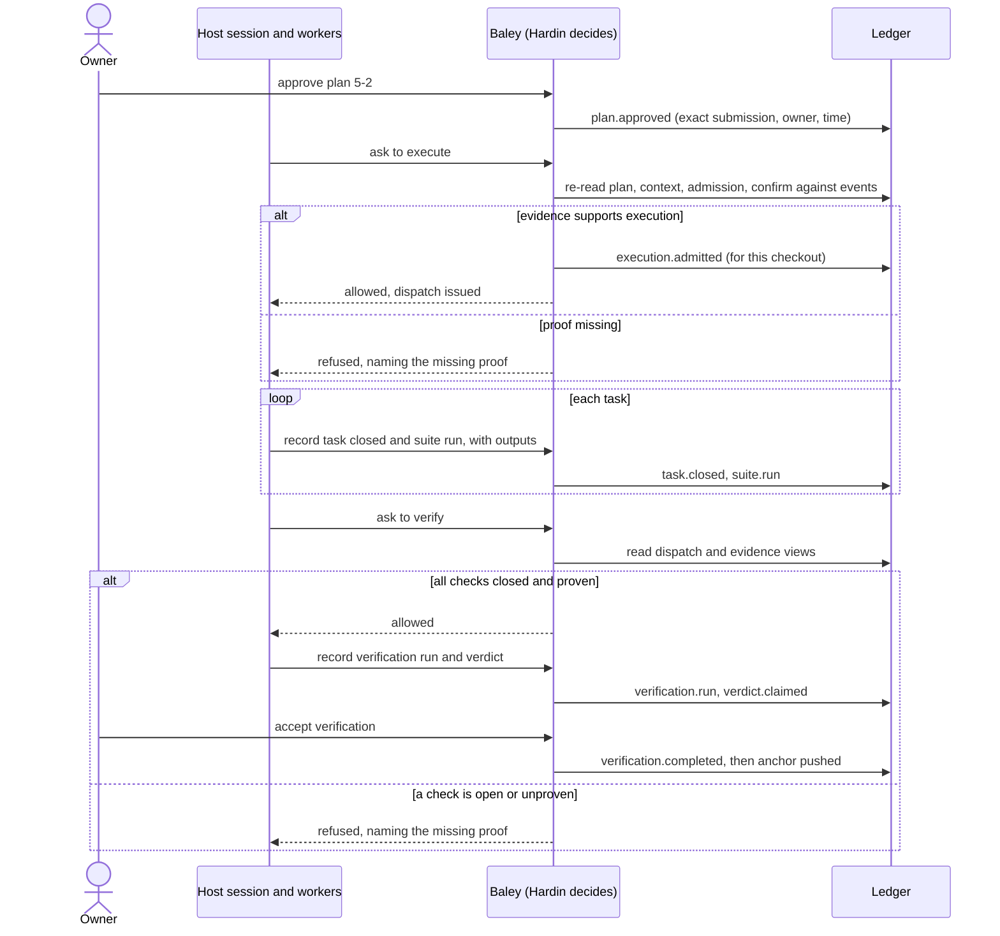
```mermaid
sequenceDiagram
  actor O as Owner
  participant D as Host session and workers
  participant B as Baley (Hardin decides)
  participant L as Ledger
  O->>B: approve plan 5-2
  B->>L: plan.approved (exact submission, owner, time)
  D->>B: ask to execute
  B->>L: re-read plan, context, admission, confirm against events
  alt evidence supports execution
    B->>L: execution.admitted (for this checkout)
    B-->>D: allowed, dispatch issued
  else proof missing
    B-->>D: refused, naming the missing proof
  end
  loop each task
    D->>B: record task closed and suite run, with outputs
    B->>L: task.closed, suite.run
  end
  D->>B: ask to verify
  B->>L: read dispatch and evidence views
  alt all checks closed and proven
    B-->>D: allowed
    D->>B: record verification run and verdict
    B->>L: verification.run, verdict.claimed
    O->>B: accept verification
    B->>L: verification.completed, then anchor pushed
  else a check is open or unproven
    B-->>D: refused, naming the missing proof
  end
```

*Figure 13. One column per actor. Nobody but Baley writes to the ledger; each step's fact is recorded before Hardin allows the next one, a refusal names the proof that is missing, and a verified phase pushes an anchor.*

#### A retried tool call

A host may deliver the same tool call twice after a timeout. The second delivery carries the same request id. A completed request gets `Replayed`, and an open claim gets `InProgress`; neither re-executes the effect. The lookup needs only the live `request` view at this binary's projector version; the project's other views and its view set stamp do not matter to a replay, even when a newer binary has since rebuilt them. Only a new request is fenced on every live view's version. If the retry's project released a stored answer by purge or reduction, the retry receives the tombstone even when another project still requires the body. The event and request document keep the reference. Nothing is recorded twice and no effect runs twice.

#### Two sessions writing at once

Two sessions on different projects, or two agents on one project, each hold the write lock only for their commit. The second waits milliseconds at `BEGIN IMMEDIATE`. If both decided on inputs the first one changed, the second's `decide` re-reads them inside its transaction, sees the change, and refuses as stale; its caller re-reads and decides again.

## Where the domain rules live

The domain rules are owned, specified and tested by the area design documents ([0002](0002-system-design.md)); nothing is required to behave as it did in the earlier system. This table records, for each rule the ledger has to carry, which area owns it and how the ledger records it.

| Rule | Owned by | In the ledger |
|---|---|---|
| Lease state and the 60-second expiry | [0001: The evidence ledger](0001-evidence-ledger.md) | `baley-store::claim::lease_state`, enforced by the shared command path |
| Scope blocking by exact token | [0001: The evidence ledger](0001-evidence-ledger.md) | The `claim_scope` view and `baley-store::claim::blocking`, run by the store for every command |
| Anchor reconciliation judgement | [0011: Milestones, landing, undo and pause](0011-milestones-landing-undo-pause.md), LND-R18 | `baley-core::reconcile`, recorded as `command.reconciled` |
| The anchor command's kind, scope, result event types and versions, the `anchor.pushed` payload, the tag name, and which events are the command's own | [0001: The evidence ledger](0001-evidence-ledger.md), with [0011](0011-milestones-landing-undo-pause.md) LND-R18 | `baley-store::anchor`, read by both the core and the adapter |
| The anchor command: pre-claim intent, stable digest, latest-anchor check before the push, heartbeat, record and reconciliation from the command, and the tag annotation codec | [0011: Milestones, landing, undo and pause](0011-milestones-landing-undo-pause.md), LND-R18 | `baley-core::anchor` and `baley-core::forge`, with the binary's git forge in `crates/baley/src/ledger/forge.rs`; recorded as `command.claimed`, `anchor.pushed` or `anchor.failed`, and `command.completed` |
| An owner acknowledges a restored chain behind the latest remote anchor | [0011: Milestones, landing, undo and pause](0011-milestones-landing-undo-pause.md), LND-R18 | `baley-core::restore` records `anchor.restore_acknowledged`; `baley-store::chain` recognizes it and always reports the accepted gap |
| An anchor row only beside its `anchor.pushed` event, and chain, body and anchor-row verification | [0001: The evidence ledger](0001-evidence-ledger.md), EVD-R3 | The adapter's `Transaction::record_anchor` and `Ledger::verify` |
| A plan's approval binds its exact submitted content, the owner and the time | [0005: Context, plans and acceptance](0005-context-plans-and-acceptance.md), PLN-R15 | `plan.approved` carries the submission digest, owner and time; admission confirms it against the event |
| Plan replay is scoped to its phase occurrence | [0005: Context, plans and acceptance](0005-context-plans-and-acceptance.md), PLN-R15 | Request scope (project, command kind) plus the phase in the digest |
| Completion binds context, publications, admissions and task and plan history, and stops applying when any of them changes or execution is undone | [0007: Verification](0007-verification.md), VER-R13 | The `phase` view computes applicability from the bound facts; `completion.invalidated` is projected when a bound fact changes; completion is confirmed against events when used |
| Verification records its launch before running | [0007: Verification](0007-verification.md), VER-R2 | Claim, act, record |
| Verification claims are recomputed at commit | [0007: Verification](0007-verification.md), VER-R2 | Inside `decide` |
| Undo records a pending state before its first revert and refuses to continue until an interrupted revert is reconciled | [0011: Milestones, landing, undo and pause](0011-milestones-landing-undo-pause.md), LND-R15 | Claim, act, record, and reconciliation |
| Undo keeps its refusal receipts | [0011: Milestones, landing, undo and pause](0011-milestones-landing-undo-pause.md), LND-R19 | `command.completed` for refusals |
| Landing records an intent per step and requires reconciliation | [0011: Milestones, landing, undo and pause](0011-milestones-landing-undo-pause.md), LND-R3 | Claim, act, record per landing step |
| Release requires an exact unstarted landing and a retained confirmation | [0011: Milestones, landing, undo and pause](0011-milestones-landing-undo-pause.md), LND-R14 | `release.proposed` and `release.confirmed` as separate owner steps |
| Milestone close records readiness; prune is a later step bound to that exact close | [0011: Milestones, landing, undo and pause](0011-milestones-landing-undo-pause.md), LND-R12, LND-R13 | `milestone.close_ready`, then `milestone.archived` bound to it |
| Resume checks the preserved HEAD, branch, configuration and occurrence | [0011: Milestones, landing, undo and pause](0011-milestones-landing-undo-pause.md), LND-R16 | `pause.recorded` bindings, checked by `pause.resumed` |
| Deferred reviews feed next-action with their precedence | [0008: Review](0008-review.md), REV-R11 | `review_queue` view |
| Settings layers merge, project over global | [0003: Configuration and routing](0003-configuration-and-routing.md), CFG-R6 | `policy.effective` with the precedence and scope the configuration design defines |
| A dispatch whose routing inputs changed is refused | [0003: Configuration and routing](0003-configuration-and-routing.md), CFG-R10 | Kept; routing inputs are part of the policy version bound at admission |
| The guard falls back to its remembered denial policy when current config is missing or malformed; it remembers denials only, never permissions | [0010: Guard](0010-guard.md), GRD-R7 | `guard.policy_recorded` events and the `guard_policy` view |
| The guard answers a re-delivered call with its confirmed answer, even after policy changes | [0010: Guard](0010-guard.md), GRD-R10 | Request lookup on the guard's session and tool-call id |
| Guard outcomes: ask, deny, pass, pass on failure, redelivery, audit-storage failure | [0010: Guard](0010-guard.md), GRD-R6 to GRD-R10 | Same outcomes, recorded as `guard` events; storage-failure behaviour per GRD-R9 |
| One run can be read by its id | [0006: Execution](0006-execution.md), EXE-R7 | `run` view |

## Cross-cutting concerns

### Security

See [Threat model](#threat-model) for who is defended against.

- **Agent isolation (EVD-R24).** Agents run as the owner's user, so file modes cannot keep them out. The barrier is Claude Code's, and three mechanisms carry it: the sandbox, which denies shell commands and their child processes reads and writes of Baley's home and its config folder; the `Read` and `Edit` deny rules, which cover its built-in file tools; and the guard's refusal of Read, Grep and Glob calls into either folder. Claude Code applies `Read` rules to Grep and Glob only on a best-effort basis, which is why the guard refusal is needed. An unavailable sandbox is reported, never passed over. The owner's own Claude Code settings can loosen the barrier, and `baley doctor` reports what an agent can reach. With these in place, `keys.env` and the ledger are out of an agent's reach (0003, CFG-R24). That holds for `keys.env` as a file in the config folder (or the home); where it is a symbolic link, which CFG-R24 follows, the target is protected only when it too lies inside those folders. Baley does not claim to hide the ledger from a process running as the owner outside the host. What Baley guarantees whether or not reads are denied: writes are refused, tampering is detected by the chain and the anchors, API keys never enter the ledger, nothing else sensitive is kept outside payloads, and payloads can be purged. The 2026-09-25 host matrix showed this for a stand-in home through Bash: the agent was blocked from reading and writing while Baley's server and hook still wrote. The extended probe adds the config folder and the built-in file tools. The guard also refuses file-tool writes into the home and the config folder, as a best-effort layer.
- **Detection.** Anchors on the forge make a rewrite, truncation or rollback detectable up to the latest anchor, even by an agent that can run `sqlite3` and sign with the owner's key.
- **Secrets.** Test output and review material can carry secrets. They are always payloads, so they can always be purged, with the limits stated in [Payloads, retention and purge](#payloads-retention-and-purge-evd-r11-evd-r14). The existing fence that screens outbound review payloads stays.
- **Network.** The store makes no network calls. Anchors are pushed with git to the project's own remote, and the latest anchor is fetched from it, through the core's forge seam; the binary implements that seam, and the store only receives the fetched anchor. A remote is named in the ledger by its configured name, never by URL or credentials. Git runs without prompts. The remote is the project's `git.remote`, from the committed `baley.toml`, and must be configured in the repository at the current directory.

### Failure modes and recovery

| Failure | Detection | What the user sees | Recovery |
|---|---|---|---|
| Process killed in a database-only command | SQLite rolls back the uncommitted transaction | The command did not happen | Retry with the same request id |
| Process killed after a claim, during or after the external effect | The claim's lease expires | Commands in the claim's scope return `Blocked` naming the claim and its state; other work continues | Reconcile against the real state; a finding records `command.reconciled` |
| Remote unreachable, or none configured, during reconciliation of an interrupted anchor claim | The fetch of the claim's own tag is unreachable, or there is no remote to ask | Nothing is recorded in the chain; one `claim.unreachable` trace row names the claim's kind, request id and sequence, and the claim stays interrupted | Retry reconciliation after the remote is reachable |
| A claim awaits the owner | The `request` document is `awaiting_owner` | Commands in its scope return `Blocked { AwaitingOwner }` | The owner's `reconcile` resolves it |
| `claim_scope` and `request` disagree on a holder | The scope check validates the holder's request identity, sequence and token | The scoped command fails with nothing written | `verify --views` shows the difference; rebuild repairs it |
| Power loss after acknowledgement | None needed | Nothing is lost (`synchronous=FULL`) | None |
| Store busy longer than 5 s | `SQLITE_BUSY` after the timeout | "store busy"; the CLI says the ledger is busy and to run the command again | Retry; `doctor` reports claim states and log size |
| Disk full | `SQLITE_FULL` | The current transaction fails; an earlier claim or external effect may remain | Free space and retry; for an anchor, follow the printed reconciliation step |
| Database corruption | `quick_check` when a session's server opens the store, `integrity_check` in doctor | The server refuses every write as unavailable with the check's report, and reads continue | Restore an earlier copy of the store and run `verify`; the restore returns to the copy's moment, so the copy lacks the purges recorded after it and the owner re-runs the purges they know of |
| Chain differs from its anchor | `baley verify` | The first bad sequence, truncation or rollback, and the unanchored range | Restore an earlier copy; the difference is itself evidence, and the copy lacks the purges recorded after it, so the owner re-runs the purges they know of |
| A view differs from its rebuild | `baley verify <project> --views` | The documents that differ, and the head compared at | Run `baley rebuild <project>`; authority was never granted from it |
| Process killed during a rebuild or view verification | Its generation's marker remains in `project_gen.building_gen` | Nothing live changes; `verify --views` refuses with `UnfinishedGeneration` until a rebuild | Run `baley rebuild <project>` to remove the unfinished generation before replay |
| A view verification cannot delete its scratch generation | The cleanup error | `verify --views` returns `UnfinishedGeneration` naming the scratch generation, and refuses the same way until a rebuild | Run `baley rebuild <project>` to remove the scratch generation before replay |
| A building marker names the live generation | Every removal turn checks `live_gen` before deleting a row, and verification compares the marker with `live_gen` before it starts | `rebuild`, `verify --views`, or a read or command that must first rebuild the project, returns `LiveGenerationProtected`; nothing is removed and the live views stand | Restore an earlier copy of the store and run `verify`; the restore returns to the copy's moment, so the copy lacks the purges recorded after it and the owner re-runs the purges they know of |
| Deleting the old generation fails after a flip | The rebuild's cleanup error | `rebuild` returns `CleanupFailed` with the generation now live and the cause, and the old one is left; a rebuild started by a project's first use goes on with the current views | The next rebuild removes the old generation |
| Older binary after a newer one rebuilt a project's views | The live view stamps, checked in each view read and new command | That project's view reads and new commands are refused as read-only; history, payloads and other projects still work | Use the newer binary |
| Older process after an upgrade | Epoch check in its next write | Read-only, naming the needed binary | Start a new session, which starts the new binary |
| Migration fails | Transaction error | Refused; database unchanged | Report the bug; the old binary still works |
| Unsafe home | The ownership, kind, mode and link checks at every open | Refused with `unsafe-home`, naming each path, what is wrong and the fix; nothing is opened or created | Run the fix named: `chmod 700`, `chmod 600`, `chown`, replace the link with the real folder or file, or remove or rename a wrong-kind path |
| No usable home location | `BALEY_HOME` empty, relative or without a final folder name, or `HOME` missing, empty or relative when needed | Refused before anything is created, naming the variable | Set `BALEY_HOME` to an absolute path ending in the home folder's name, or set `HOME` |
| Home on a network share | Not detected | Not supported: SQLite's write-ahead log does not work over a network filesystem | Move the home to a local disk, or set `BALEY_HOME` to a local path |
| Anchor push fails cleanly (remote unreachable, refused or missing at the push or at the latest-anchor fetch) | `anchor.failed` and `command.completed` refused, the claim completed | Nothing blocks; `doctor` warns once the unanchored range, not counting the anchor command's own events, is over a day old | Retried at the next anchor point |
| Local chain behind or different from the latest remote anchor at an anchor push, as after a restore of an older copy | The latest-anchor fetch and the chain comparison, after the claim and before the push | `anchor.failed` and a refused outcome naming the mismatch (truncation, rewrite or break); nothing is pushed | The owner runs `acknowledge-restore` on an intact restored chain. Its event names the restored head and remote anchor; anchoring resumes, while `verify` reports the accepted gap. The success output and every later report that lists the gap print the purge warning, and the owner re-runs the purges they know of for each project from records kept outside the store and rotates affected secrets |
| Remote unreachable or latest tag malformed at `verify` | The core's latest-anchor fetch | The report says the remote could not be checked or its tag is not an anchor; the chain and bodies are checked locally and nothing is taken as the outside witness | Verify again once the remote is reachable; a malformed tag is itself evidence to report |
| Write-ahead log grows | Log size above 8,192,000 bytes in doctor, 1,000 pages of the store's 8 KiB page size | Warning in doctor | Find the long reader. The log folds at the next commit past the threshold, or at the session server's one `PASSIVE` attempt as it exits, not when the reader ends |
| Purge scrub held back by an open reader, or interrupted | The truncating checkpoint's row reports busy; `scrub_pending` remains | Scrub incomplete; `doctor` shows it pending | Close the reader and run `baley scrub` |
| Git cannot run or cannot write a tag object at a push | Forge observes unreachable | `anchor.failed`, and the CLI prints git's message | Fix git or the repository and retry the anchor |
| `git.remote` names no remote of the repository | Exact-name check of `git remote` before recording or fetching | Refused, nothing recorded, and `doctor` refuses its whole report | Add the remote to the checkout, or set `git.remote` to a configured remote and commit it |
| An exported copy fails `verify` | The export verifies its new database before completion | Export refused, target removed | Repair or restore the source and retry |
| Export interrupted after intent was recorded | `export_record.head_seq` remains null | Every purge lists the pending target when its project references an affected hash | Inspect and remove the incomplete copy, then retry |
| Remote confirms absence while a local anchor row remains | `doctor` compares the supplied remote check with the latest local row | The row appears as `remote_absent_local_row` | Investigate the missing remote tag; the row is not treated as an outside witness |

### Performance

The real adapter is measured by `crates/baley-bench`. Latency figures are each run's p99, reported as the median of five runs with the worst run in brackets. The longest rebuild batch uses each run's maximum, not its p99. Totals, flip and size use one value per run. The longest lock wait is the single longest wait across all five runs. The open row was measured on 2026-09-28, after Build 2 added the ownership, mode and link checks, with the same command, machine and drives. The other rows were measured on 2026-09-27 before those checks, and the guard hook row includes an open without them. Those measurements used `baley-bench run HOME --runs 5` (30 seconds per writer phase), five runs per drive with the page cache warm after loading: AMD Ryzen 7 9800X3D, Linux 7.2.7, SQLite 3.53.2, btrfs with zstd compression on both drives.

| Operation | Budget | Crucial T700 | Crucial P3 Plus (QLC) |
|---|---|---|---|
| Open with ownership, mode, link, epoch, schema-digest and view-catalog checks (guard, CLI) | 10 ms | 0.81 ms (0.86) | 0.80 ms (0.81) |
| Commit a command, including claim and complete for external effects | 20 ms | 5.9 ms (11.9) | 10.2 ms (11.2) |
| Commit a command of 10 events | 20 ms | 7.0 ms (11.6) | 10.3 ms (11.1) |
| Get one view document by key and parse it | 2 ms | 0.023 ms (0.025) | 0.022 ms (0.027) |
| Guard hook, store work only, in a new process | 25 ms | 7.6 ms (16.2) | 12.8 ms (16.6) |
| Wait for the write lock with 8 sessions, p99 and longest wait | 250 ms | 37 ms (65), longest 136 ms | 58 ms (59), longest 72 ms |
| Rebuild every view of the reference project while writers run | 30 s | 4.1 s (4.2) | 4.0 s (4.1) |
| Longest rebuild batch | 100 ms | 16.7 ms (23.9) | 19.4 ms (19.6) |
| Rebuild's final flip | 50 ms | 8.0 ms (11.3) | 12.8 ms (13.3) |
| Size, database and log after all handles close | 50 MB | 15.3 MB | 15.3 MB |
| Purge, including scrub | No budget | 42 ms (74) | 62 ms (66) |
| Standalone scrub | No budget | 30 ms (50) | 38 ms (43) |
| Verify reference project | No budget | 49 ms (57) | 48 ms (49) |
| Server start with `quick_check` (the per-session server is built, measured in Build 9) | 2 s | Measured in Build 9 | Measured in Build 9 |
| Search | Defined in Build 8 | Measured in Build 8 | Measured in Build 8 |
| Server resident memory | Does not grow with store size | Measured in Build 9 | Measured in Build 9 |

**Prototype record.** The following table and size figure are the prototype's measurements, retained unchanged. They are not measurements of the workspace adapter.

Budgets on the reference workload, and what the benchmark measured: p99 unless stated, median of five runs, worst run in brackets, on a fast drive (Crucial T700) and a slower one (Crucial P3 Plus, QLC).

| Operation | Budget | Fast drive | Slower drive |
|---|---|---|---|
| Open a connection with the ownership, link, filesystem and epoch checks (guard, CLI) | 10 ms | 0.24 ms (0.27) | 0.26 ms (0.28) |
| Server start with `quick_check` (five projects) | 2 s | 174 ms (183) | 184 ms (192) |
| Commit a command, excluding the command's own work | 20 ms | 8.7 ms (14.0) | 11.0 ms (11.6) |
| Commit a command of 10 events | 20 ms | 9.0 ms (13.0) | 12.6 ms (17.6) |
| Get one view document by key and parse it | 2 ms | 0.02 ms | 0.02 ms |
| Guard hook, store work only, in a new process | 25 ms | 6.5 ms (15.5) | 11.7 ms (17.0) |
| Wait for the write lock with 8 sessions writing continuously | 250 ms | 34 ms (52); longest 78 ms | 51 ms (68); longest 64 ms |
| Rebuild every view of the reference project while writers run | 30 s | 8.5 s (9.0) | 10.9 s (11.4) |
| Longest rebuild batch | 100 ms | 43 ms (99) | 38 ms (39) |
| Rebuild's final flip | 50 ms | 2.8 ms (4.1) | 4.4 ms (4.8) |

Size budget: the reference workload stores in at most 50 MB, counting the database, its write-ahead log after a checkpoint, and every payload body under default retention, with retired prompt text included. **Measured: 24.5 MB**, against 175 MB for the same history in the JSON store. Memory: no operation loads more than its answer; the server's resident memory does not grow with the store. `verify` costs one walk of the project's events and one read and decompression of every present body it references; no latency budget is set for it, and it holds one event or one 64 KiB body chunk at a time. The prototype has no long-running server, so this is verified during the build.

A rebuild batch is timed from acquiring the writer queue to releasing it, commit included and the wait to acquire it excluded; the pause after it is not part of it. The final flip is the last turn of a rebuild, measured the same way: reading the head, applying the tail and moving `live_gen`.

The commit budget was 10 ms before the benchmark. Commit time is mostly the flush that makes a commit durable, and it spikes occasionally on both drives; 20 ms keeps the same meaning (a commit a person never notices) with the flush measured. The rebuild-batch budget moved from 50 to 100 ms for the same reason.

**How the real adapter is measured.** `crates/baley-bench` replays the same numbers-only profile through the port with synthetic payloads and fixture projectors for the prototype's 15 view families. It loads one-project and five-project homes, measures 1,000 opens, profile commits, 300 ten-event commits, 20,000 keyed reads and 500 guard processes. Eight writer processes report queue waits through the adapter's optional `queue_wait` observer. Four writers run during a rebuild, whose timing seam records each batch hold as its requested pause. A cursor issued before replay is retried after each pause: the first `InvalidCursor` marks the flip's hold. The report says not measured if no cursor was available. It also reports size after all handles close, material purge including scrub, a standalone scrub and chain verification. Search returns in Build 8, and the server's start and resident memory are measured in Build 9. Every open measured by the current benchmark includes the ownership, mode and link checks. There is no backup figure. `baley-bench seed <home>` creates a separate CLI-readable project and prints a sensitive answer's payload hash for hand runs.

**How the prototype was measured.** A prototype of the SQLite adapter in [`spikes/evidence-ledger-bench`](../../spikes/evidence-ledger-bench/README.md) replays a numbers-only profile of the store Baley replaced (1,551 commands, 1,615 events, 618 attachments), with synthetic content calibrated to the zstd ratio measured on each class of real content. It pays every cost the design puts in a transaction: the request check, the decision's re-reads, the authority check against events, the cheap git facts, the hash chain as specified, payloads and references, projectors, the search index, claim and record transactions for external effects, and `command.completed`. Writers run as separate processes; rebuild and backup run while writers write. Each drive ran five independent runs, with the page cache warm. Raw results are in `spikes/evidence-ledger-bench/results/`. Across all runs on both drives: no errors with the writer queue, and a rebuild or a purge never changed a view.

**What the benchmark changed in this design.**

- **Writer queue.** With SQLite's busy handler alone, 8 writers waited 629 ms at p99 and up to 4.9 s on the fast drive, and some writers failed on the slower one; commands per writer ranged from 743 to 2,014. With the queue, every writer committed 1,176 or 1,177 commands and none failed. See [Processes and concurrency](#processes-and-concurrency-evd-r8-evd-r19).
- **Maintenance yields.** The queue's file lock is not first-in, first-out, so a rebuild taking batch after batch made one writer wait 761 ms. Maintenance now pauses after each batch for as long as it held the queue.
- **One write per document per transaction.** Projectors fold all of a transaction's events into their documents in memory and write each document once. Before, a 10-event command rewrote the same documents ten times.
- **Generations for rebuilds.** Swapping rebuilt rows into the live tables took up to 60 ms per view. Views now carry a generation, and a rebuild flips one number (see [Views and projectors](#views-and-projectors-evd-r9-evd-r10-evd-r27)).
- **Purge.** Search rows derived from a payload are found through an index, not a scan (the purge transaction went from 220 ms to 9 ms), and a purge ends with a truncating checkpoint after `VACUUM`.

SQLite's limits sit far beyond these numbers: 281 TB per database and about 1 GB per stored value.

### Observability

- `baley doctor` reports the compatibility epoch, any pending scrub time, every row of `integrity_check`, the database and log file sizes, and each project's chain and body verification, view verification, raw live versions and building lag, and active, interrupted and awaiting-owner claims. Each project carries its supplied `AnchorCheck`: a remote anchor, confirmed absence, unreachable, malformed or local only, and the report names the reason for a local check: the discovered project's `git.remote` is not set, its settings could not be read, or the project is not checked against a remote from this directory. The report also prints the settings lines: each diagnostic of the global file, then of HEAD's copy of the discovered `baley.toml`, with its file and position, then the note that the working-tree file's changes apply once committed. A settings fault, an invalid or unreadable settings file or a `baley.toml` that yields no id, is printed with its file, and every other check still runs. An unreachable or malformed remote, a failed verify, or a stored work time that cannot be read gives `Unchecked` age. A confirmed-absent remote with a local anchor row is reported separately. The chain report lists every acknowledged restore even after a later anchor matches, prints the purge warning once while any is listed, and its first unanchored work time drives the one-day warning.
- The CLI prints this report and exits 1 for any integrity or verification finding, pending scrub, unchecked or old unanchored work, a local row beside confirmed remote absence, newer live views or view set, a building marker, a view difference, an error reading a project's verification, view check, view versions or claims, interrupted or awaiting-owner claims, log size above 8,192,000 bytes, or a settings fault. Active claims alone are not a finding, and neither are settings diagnostics and the pending note.
- The `trace` table records diagnostics (timings, retries, busy waits) outside the chain, with its own size cap and rotation.
- Every refusal carries a stable code and the facts that caused it, as refusals do today.

### Host seam and the host matrix (EVD-R24)

Claude Code is the only supported host. A host is added when the matrix shows the same on it (ADR 0033), and the table below is the matrix as it stands for Claude Code.

| Concern | Claude Code | Evidence |
|---|---|---|
| Project discovery from the working directory | Hook and MCP server start in the session's directory, which may be a subdirectory, and Claude Code gives both `CLAUDE_PROJECT_DIR` | Shown on 2026-09-25, and again on 2026-10-02 for a stdio server: Claude Code starts the MCP server in the session's directory. Its documentation does not promise that directory, so the server takes its project from `CLAUDE_PROJECT_DIR` and records its working directory beside it, rather than binding the directory it starts in. The hook already walks up, and the server walks up from the project too (Build 3). |
| Hook contract (tool names, event names, answer format) | `PreToolUse` with the matcher `Bash\|Monitor\|PowerShell\|Read\|Grep\|Glob\|Write\|Edit\|NotebookEdit`, answering `allow`, `deny` and `ask` | Shown for Bash on 2026-09-25: the hook's input needs no adapter. The other tools are measured by the extended probe. |
| Re-delivered tool calls | Retries after timeout | Shown for the hook: the same session and `tool_use_id` get the confirmed answer. Proven for MCP calls in Build 1, where the `request` view lands. |
| Access to Baley's home and config folder | Server and hook write. Agents are denied reads and writes of both | The home was shown through Bash on 2026-09-25: a denied read looks like a missing file, a denied write exits 0 and nothing lands. The config folder and the built-in file tools are measured before release by Build 3 T12, and again before each release. |
| Store unreachable | Guard applies today's rules for a missing or failed audit store | Shown: the guard answers pass-on-failure with its reason, and a denial still stands. |

**How it was measured.** The probes in [`spikes/host-matrix`](../../spikes/host-matrix/README.md) started with one throwaway non-interactive session per host from a subdirectory of this repository, with a hook and a stand-in MCP server that recorded where they ran and whether they could write a stand-in home outside the checkout, and an agent that was asked to read and write that home. The 2026-09-25 run used Codex CLI 0.156.1 and Claude Code 2.1.282 on Linux. Its Codex results are why Codex was removed (ADR 0033). The Claude Code probe now prepares separate stand-in home and config folders and their settings, and prints a procedure for an interactive session the owner runs. It covers shell commands, their children and the built-in file tools. Build 3 T12 runs it first, and it runs again before each release. The Codex probe stays, to measure Codex against the bar.

### Compatibility and migration

Nothing is migrated from the store Baley replaced; Baley starts empty. Ledgers written while the migration is under way are disposable, and the builds in between are development builds: nobody else uses Baley yet. No data rollback is promised; each build can be reverted as code.

Families are moved by what is written together, not one at a time:

| Family | Written in the same transaction as | Read together with |
|---|---|---|
| Roadmap, stories | Plan publication (seeds `REQUIREMENTS.md` rows), completion (ticks the phase in `ROADMAP.md` and its rows in `REQUIREMENTS.md`), undo | Progress, next action, audit |
| Context | Plan publication (validates against it) | Admission, verification, review selection |
| Plans, evidence maps | Stories | Admission, dispatch, verification |
| Admission, execution, dispatch, runs | Native summaries, evidence | Verification, progress, undo |
| Native evidence | Task checkpoints | Next action, execution |
| Verification | Completion edits `ROADMAP.md` and `REQUIREMENTS.md` | Progress, milestone |
| Review | Review families only | Selection reads plans and context |
| Risk | Risk families only | Suggest, milestone preflight |
| Milestones, landing, undo | Undo edits `ROADMAP.md` and `REQUIREMENTS.md` | Progress |
| Captures, config and routing, task, debug, spike, guard | Their own families | Their own readers |

Builds:

1. **Foundation.** The workspace split, the port, the SQLite adapter, the conformance suite, payloads and references, the hash chain, anchors and the command line: `verify`, `doctor`, `export`, `purge`, `scrub`, `rebuild`, `anchor` and `acknowledge-restore`. The inherited command surface stays beside these. Nothing in the lifecycle uses the ledger yet.
2. **Identity, settings and keys.** Folders and open checks, keys and `baley exec`, settings and `policy.effective`, `baley init`, discovery, checkouts, the model catalog and detection.
3. **Hosts.** The per-session stdio server, install, the guard's answer in Claude Code's hook form, Claude Code's sandbox and file-tool deny rules over the home and the config folder, stubs and captures.
4. **Planning.** Project start, stories, phases, plans, plan review and risk scan, the first dispatches, and routing finished.
5. **Doing the work.** Execution, runs, verification, diff review and the completion risk scan.
6. **Milestones, landing, undo and pause.** The anchor triggers and the forge check.
7. **Next action and progress.**
8. **Search, why and support work.** Task, debug and spike.
9. **Removal.** The JSON store, the intent journal, participants, root binding, the Markdown renderers and parsers, and every `.planning` path.

## Alternatives considered

**Keep the JSON documents.** Rejected. The copies and the machinery to reconcile them are the problem, and a single document cannot answer a keyed query without reading the whole store (Context).

**SQLite as plain state tables, without a ledger.** Simpler: update rows in place. Rejected because it keeps only the present. Baley's product is the proof of what happened; overwriting rows discards it, and an audit trail bolted on afterwards becomes a second copy again.

**Git as the database**, as git-bug and git-appraise do. Attractive: content addressing, signing and transport come built in. Rejected for now because every query still needs a local index (both projects keep one), concurrent writers must serialize on reference updates, and query latency on large histories is poor. Git is used for what it does best here: holding the immutable anchors.

**An embedded key-value store** (redb, sled). Fast and pure Rust, but no query language, no full-text search, and every index would be hand-built, which is the mistake the current store made with JSON.

**A database server** (PostgreSQL). Rejected for a single-user tool: a daemon to install, run and upgrade, for concurrency Baley does not need. The port keeps it possible as a future adapter for teams.

**One database file per project.** It contains the blast radius and makes per-project export trivial. Rejected in favour of one database per user because cross-project questions become simple queries and there is one schema to migrate and one file to back up; per-project chains and `export` give the same per-project verifiability. See ADR 0003.

**The database inside `.git/`.** Shared by all worktrees and never committed, but deleted with the clone. Rejected because the ledger is the historical record and must outlive any checkout. See ADR 0003.

**Filesystem identity for projects** (today's inode binding). Rejected: the store could not move, be restored or be rebuilt. See ADR 0004.

**A chain anchored only inside the database.** Rejected: the attacker Baley exists to stop, an agent running as the owner, can recompute it. See ADR 0007.

**Tracking every read's version instead of deciding inside the transaction.** Correct in principle, but a single missed read is a silent bug. Deciding inside the single-writer transaction is correct by construction.

**A separate operating-system user for Baley.** Real separation, but it needs a daemon, a privileged install step and different setups on Linux and macOS. Kept as future work. See ADR 0008.

## Testing

| Requirement | How it is proven |
|---|---|
| EVD-R2, R3 | The conformance suite damages a store in its check's own temporary directory: payload edits, inserted and deleted events, reordered events, recomputed chains, tail truncation, restored copies and regrowth. It checks the first bad position, anchors and unanchored ranges, owner-acknowledged restores, unchanged events after purge, bodies, excerpts, tombstones and local anchor-row comparisons. It also replaces a stored caller with another valid caller, leaving the hashes as they were, and finds the break at that event's sequence. The binary's render tests, over supplied reports and answers, check that successful acknowledgements (new, replayed or unreadable) carry the purge warning and refusals carry none, that a report carries it once while an accepted gap is listed, including after a later match, that a clean report, or one with an unacknowledged gap and no accepted gap on record, carries none, and that exit codes are unchanged. The core's tests over the adapter retain remote fetch statuses, pre-push refusal of rolled-back chains, and the rule that anchor events start no unanchored age. Adapter tests retain undecodable bodies, wrong stored anchor tags and the core observation's reported status, and an undecodable stored caller, which history and verification report as unavailable, never as absent. The binary's git forge mapping is tested over literal git output and the process fake; no test runs git. |
| EVD-R5 | Conformance checks a swallowed projector error and rollback of history, head, views, request and payload, then a retry that runs again. SQLite's enforced reference foreign keys and the absent payload and event establish that no reference remains. |
| EVD-R6 | Conformance checks replay returns the original outcome without running the decision or recording again, another digest is refused, and request ids are scoped to both project and command kind. It also checks that every event a command appends carries that command's caller, the completion included, and that the events retention records carry theirs. A replay under another caller records nothing, and the original caller stays on the event at the request's produced sequence. The adapter retains replay beside a raw newer set stamp and raw claim lease/request row counts, and checks the caller column's stored text: the caller's canonical JSON, or null for a command with none. |
| EVD-R7 | Conformance checks moved view documents, event and document absences, and supplied HEAD changes are stale and record nothing. |
| EVD-R8 | Conformance checks two independent connections in one process: a read runs during a write and alternating writes extend one chain. Writer-queue and BEGIN IMMEDIATE mechanisms remain adapter tests; no test starts multiple processes. |
| EVD-R9 | Conformance checks declared keys and indexes, ordering with ties and descending fields, prefix equality, paging, bounds and cursor binding. SQL plans and SQL limits remain adapter tests. |
| EVD-R10 | Each projector has its own pure unit tests. Conformance checks live and replayed fixture views against hand-written documents, ignores corrupted live documents during rebuild, catches up commands committed between batches, preserves live documents after a failed tail or abandoned replay, rebuilds after abandonment, protects a live generation named by a damaged marker, refuses unreadable events, and upcasts without rewriting history. A reduction and a purge leave replay independent of bodies and preserve request references. View verification reports differences once by key at the checked head, cleans up ordinary projector failures, refuses unfinished work and live markers repeatedly, and cursors cannot cross a flip. Adapter tests retain pause timing, cleanup time bounds, cleanup failure after flip, the tail and flip in one transaction, scratch cleanup failures, the snapshot pinned before queue release and the free read connection. They also inspect raw generation numbers, rows and stamps, deleted retired-view rows and stamps, scratch rows removed after a projector error, and stored payload text preserved during upcasting. |
| EVD-R11, R14 | Conformance checks SHA-256 addressing and original length, chunked byte-for-byte streaming, excerpt edges and their own hash, shared bodies surviving one project's purge, request documents retained after answer purge, and retries receiving tombstones. Identical content stored once, compression and derived trace removal remain adapter tests. Search entries are covered from Build 8. |
| EVD-R12 | The crate graph proves the first half: baley-core and baley-store have no normal dependency path to rusqlite, and baley-store has none to baley-core. Each adapter runs the conformance suite as one test per check for the second half. |
| EVD-R13 | Search returns hits in relevance order with stable ties, scoped by project and phase, over a fixture corpus. |
| EVD-R15 | Conformance opens exports independently, lists only the exported project, compares history, verifies the chain, refuses the other project's body, checks released-body tombstones and the reported head, and checks purge export listings including replay and shared references. It also checks that an export keeps the callers of every event, server and hook, and the absence of one. Export records, pending exports and stored released-body bytes remain adapter tests. Rows of a project an export does not list are not observable through the port; the adapter counts them in the exported file. |
| EVD-R16, R22 | Folder resolution is tested as a pure function of the platform and supplied values; the open checks' judge over supplied user ids, modes and kinds. A linked home, a linked database and a link above the home are checked at open in the test's own temporary folder. No test asserts a mode the filesystem produced, and macOS paths are tested on Linux as values. |
| EVD-R17 | Discovery is tested as a pure function over supplied ancestors. The fork judgement, the user-information strip and the checkout admission plan are tested over supplied values. The root commit and the remote URL are tested through the process fake. The `checkout` view, its one row per path and a refused checkout admission leaving the chain head unchanged are tested in a store in a fresh temporary directory. All in Build 2. |
| EVD-R18 | Each command's test asserts it writes nothing in the working tree beyond the named exceptions. |
| EVD-R19 | Conformance checks opening a newer epoch read-only and fencing an already-open connection, newer view and view-set read/write fences, refusal to rebuild backward, forward rebuilds before first use including removed views, and changed sets refused without a new version. An adapter test refuses a store, and an export home, stamped with the schema digest from before `event.caller`. A missing view stamp, the raw epoch getter and epoch fences on trace writes remain adapter tests. The migration check arrives with the first migration. |
| EVD-R20 | Relies on SQLite's documented durability with `synchronous=FULL`. Power loss is not reproducible in a portable test and is not re-tested. |
| EVD-R21 | `crates/baley-bench` measures real-adapter open, commits, keyed reads, guard store work, writer waits, rebuild total and batches, flip, size, purge, scrub and verification. Search, server start and memory are measured in the builds named in Performance. The open figure includes the checks. Timings are measurements, never test assertions. |
| EVD-R23 | Withdrawn. |
| EVD-R24 | The host matrix, run by hand on Claude Code before acceptance and again before each release. The 2026-09-25 run, on both hosts at the time (`spikes/host-matrix`), covered the home through Bash only. Build 3 T12 measures the extended bar: the config folder and the built-in file tools. |
| EVD-R25 | From Build 9, `show` and the record export render every record family from views. |
| EVD-R26 | The conformance suite proves the store half with supplied times and findings: commands outside an active claim's scope proceed, commands inside return Blocked before deciding, a retry returns InProgress, a clean failure completes the claim, an interrupted claim reconciles from a supplied finding, and an awaiting-owner claim refuses automatic reconciliation and accepts owner resolution. It also checks that a claim and its completion by two callers are each attributed to their own caller, that reconciliation refuses a caller, and that a caller-free reconciliation records none and copies none from the claim. The core's tests over the adapter prove the anchor call path in separate units: the claim step acts only after its claim event exists and names the pre-claim head; missing remote, in-progress, replayed and blocked requests do not act; refused and unreachable pushes complete the claim with `anchor.failed`; a successful record writes `anchor.pushed`, the completion and the row together, and a conflicting row leaves all three unwritten; matching, conflicting and absent holder tags reconcile and retry once under the original identity; an unreachable holder fetch writes one trace row and leaves the claim open; the heartbeat renews at once, ticks through the work and stops before the record step, and a failed renewal cancels nothing. The binary's git forge is tested over literal output and the process fake, and its ticker over a scripted pace and a ticker-local worker join seam. No test runs git. Build 6 proves a real revert held for the owner. |
| EVD-R27 | An edited view document that says "approved" or "complete" does not grant admission or completion, because the event is missing. |
| EVD-R28 | Withdrawn. |

The CLI's argument parsing, refusal texts and report text are tested as pure units, with folder resolution tested over supplied values. Its command wiring is not unit-tested.

**The conformance suite.** Each check in `baley-store` is a public function named after its fault. Each adapter invokes `conformance_suite!` as one test per check, evaluating a fresh factory inside each test. The factory creates and reopens stores as a given binary, damages rows, copies and restores the database file into a new home, opens an export, and stops or interleaves a rebuild, all inside one temporary directory per check. No check reads a clock, sleeps, starts a process or reaches a network. Each adapter keeps its own mechanism tests, as [ADR 0024](../adr/0024-conformance-suite-and-adapter-tests.md) records.

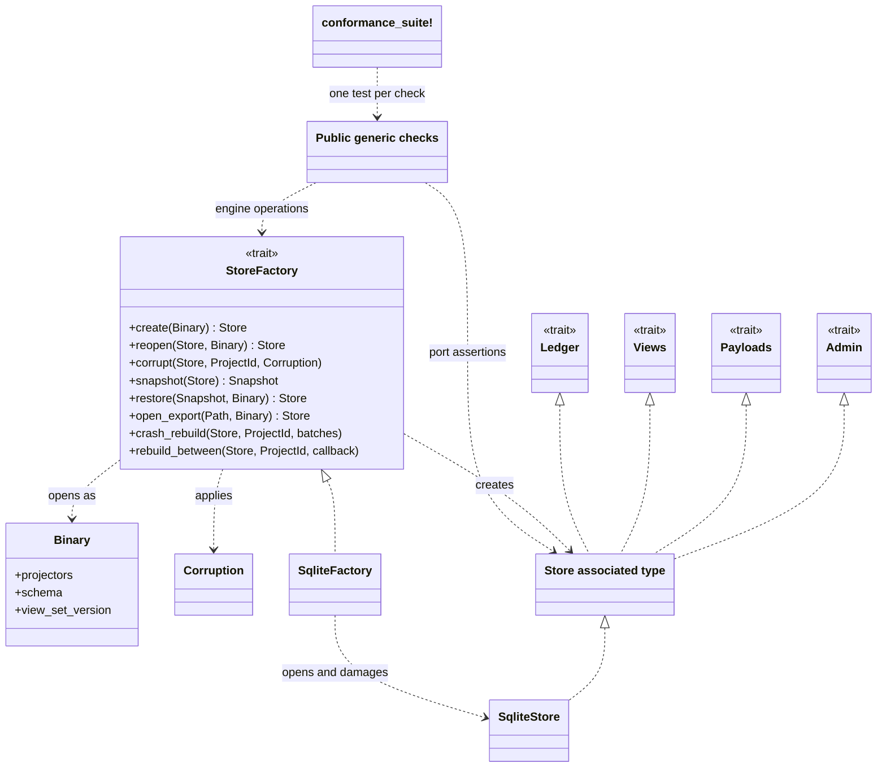
```mermaid
classDiagram
    class Suite["conformance_suite!"]
    class Checks["Public generic checks"]
    class StoreFactory {
        <<trait>>
        +create(Binary) Store
        +reopen(Store, Binary) Store
        +corrupt(Store, ProjectId, Corruption)
        +snapshot(Store) Snapshot
        +restore(Snapshot, Binary) Store
        +open_export(Path, Binary) Store
        +crash_rebuild(Store, ProjectId, batches)
        +rebuild_between(Store, ProjectId, callback)
    }
    class Binary {
        +projectors
        +schema
        +view_set_version
    }
    class Corruption
    class Store["Store associated type"]
    class Ledger { <<trait>> }
    class Views { <<trait>> }
    class Payloads { <<trait>> }
    class Admin { <<trait>> }
    class SqliteFactory
    class SqliteStore
    Suite ..> Checks : one test per check
    Checks ..> StoreFactory : engine operations
    Checks ..> Store : port assertions
    StoreFactory ..> Binary : opens as
    StoreFactory ..> Corruption : applies
    StoreFactory ..> Store : creates
    Ledger <|.. Store
    Views <|.. Store
    Payloads <|.. Store
    Admin <|.. Store
    StoreFactory <|.. SqliteFactory
    SqliteFactory ..> SqliteStore : opens and damages
    Store <|.. SqliteStore
```

*Figure 14. The port crate owns the scenarios, assertions and factory contract. The SQLite test harness owns homes, raw damage, file copies and rebuild interleaving. Each check gets a fresh directory.*


## Decisions

- [ADR 0001: Record evidence as an append-only, hash-chained event ledger](../adr/0001-event-ledger.md)
- [ADR 0002: Use SQLite as the storage engine](../adr/0002-sqlite.md), superseded in part by ADR 0027
- [ADR 0003: Keep one ledger database per user, outside any checkout](../adr/0003-per-user-database.md), superseded in part by ADR 0023 and ADR 0027
- [ADR 0004: Identify projects by a committed project file](../adr/0004-project-identity.md)
- [ADR 0005: Put storage behind a port with engine adapters](../adr/0005-storage-port.md), superseded in part by ADR 0010
- [ADR 0006: Keep every operational record in the ledger](../adr/0006-no-markdown-records.md)
- [ADR 0007: Anchor chain heads on the forge](../adr/0007-forge-anchors.md), superseded in part by ADR 0026
- [ADR 0008: Use host sandboxes to keep agents out of the ledger](../adr/0008-host-sandbox-isolation.md), superseded in part by ADR 0020 and ADR 0033
- [ADR 0009: Serve instructions from the binary; files on disk are stubs](../adr/0009-served-instructions.md)
- [ADR 0010: Define the projector and event schema traits in the port](../adr/0010-projector-traits-in-the-port.md), superseding ADR 0005 in part, superseded in part by ADR 0021
- [ADR 0020: State what each host's sandbox denies; reads are the host's policy](../adr/0020-sandbox-is-a-write-barrier.md), superseding ADR 0008 in part, superseded in part by ADR 0027 and ADR 0033
- [ADR 0021: Claim liveness and scope rules in the port](../adr/0021-claim-rules-in-the-port.md)
- [ADR 0022: Report owner-acknowledged restores behind a remote anchor](../adr/0022-acknowledged-restore.md), superseded in part by ADR 0035
- [ADR 0023: Keep whole-store backups outside Baley](../adr/0023-no-backups-in-baley.md)
- [ADR 0024: Separate port conformance from adapter mechanism tests](../adr/0024-conformance-suite-and-adapter-tests.md)
- [ADR 0025: Point anchor tags at the empty tree](../adr/0025-anchor-tag-objects.md)
- [ADR 0026: Anchors are read by Baley, and a missing tag ruleset is reported](../adr/0026-anchors-read-by-baley.md), superseding ADR 0007 in part
- [ADR 0027: Keep Baley's files in its own crenshawdev folders, with provider keys in a plain keys.env](../adr/0027-vendor-folders-and-plain-keys.md), superseding ADR 0002 and ADR 0003 in part, superseded in part by ADR 0032 and ADR 0033
- [ADR 0033: Support only hosts whose sandboxing and execution controls meet Baley's requirements](../adr/0033-host-security-bar.md), superseding ADR 0008, ADR 0018, ADR 0020, ADR 0027 and ADR 0029 in part
- [ADR 0034: Run one Baley server per session over stdio](../adr/0034-one-server-per-session.md)
- [ADR 0035: Report purge uncertainty after restoring a store](../adr/0035-restore-purge-uncertainty.md), superseding ADR 0022 in part

## Future work

- **Records that travel.** Push a project's chain to a git ref so another machine can fetch and verify it.
- **Signed checkpoints** with a key the agent cannot use, for example a hardware key that needs a touch.
- **A separate operating-system user** for the store.
- **A server adapter** for teams sharing one ledger.

## Open questions

None. The benchmark and the host matrix, the two acceptance gates, are answered above.

## Appendix A: Mapping from the current store

| Current namespace or file | Becomes |
|---|---|
| `context` | `roadmap` stream, `story.refined`; `backlog` and `phase` views ([0005](0005-context-plans-and-acceptance.md)) |
| `plan_publications` (publications, receipts) | `plan/<n>-<k>` stream; `plan` view; receipts replaced by `command.completed` and the `request` view |
| `acceptance_maps` | `plan.approved` payload; `evidence_map` view |
| `native_admissions` | `admission/<n>` stream; `admission` view |
| `execution` (occurrences, active, issues) | `phase/<n>` and `dispatch/<id>` streams; `dispatch` view |
| `native_tasks`, `native_plans` | Task and suite events on `dispatch/<id>`; `run` view; outputs become `output` payloads |
| `native_execution_summaries` | Dropped: the summary is a query |
| `native_execution_material` | `task.closed` payload |
| `rail_execution_material` | Dropped: written only by the legacy executor-patch path |
| `worker_exits`, `worker_interruptions` | `worker.exited` and `worker.interrupted` events |
| `verification` (attempts, runs, claims, patches, waivers, humans, completions) | `verification/<id>` stream; `verification` view. The copy of execution records inside each attempt is replaced by the sequence range it observed |
| `native_evidence` | Evidence events on the stream they concern; order comes from the project sequence, not a log scan |
| `review` | `review/<id>` stream; `review` and `review_queue` views; retained material becomes `material` payloads |
| `rail_observations`, `rail_receipts` | `risk/<n>` stream; `risk` view |
| `milestones`, `milestone_prunes`, `milestone_releases`, `landings` | `milestone/<name>` stream with separate close, archive, release and landing steps; `milestone` view |
| `undos`, `undo_requests` | `phase.undone` events through claim, act, record; refusals through `command.completed` |
| `task`, `debug`, `spike` | Their own streams and views |
| `derivation.memo` | Dropped: the views are the derived state |
| `guard_audit` (initialization, `denial_policy`) | `guard` stream; `guard.policy_recorded` and the `guard_policy` view keep the remembered denial policy |
| `import`, `layers` | Dropped: no import; configuration history is `policy.effective` events |
| Envelope `operations`, `generation`, `integrity`, log digests | Replaced by `command.completed`, stream versions, the compatibility epoch and the hash chain |
| `decisions.jsonl` gate, routing and boundary lines | Replaced by the events themselves; nothing is mirrored |
| `items.jsonl` | `capture` stream; `capture` view |
| `trace.jsonl` | `trace` table |
| `phases/*/DEFERRED-*.json`, `ADJUDICATION-*.json` | `review.deferred`, `review.adjudicated`; `review_queue` view |
| `.planning/*.md`, `phases/**` | See [What replaces the Markdown and JSON files](#what-replaces-the-markdown-and-json-files-evd-r18-evd-r25) |

Found unused in the current code and not carried forward: the store operations `AdmitExecution`, `ApplyExecutionPatch` and `RecordExecutionRefusal`, and the helpers `installed_spikes`, `installed_debug` and `installed_tasks`.

## Appendix B: Reads mapped to views

The reads the inherited server served, with the view and key that will serve each. `help` and `schema` read no store. `document` is served for a capture identity only, read through the `capture` view by capture id, and refuses any other identity kind as invalid arguments until the build that records it. Every other read answers operation-unavailable until the build that replaces it. All queries page with a cursor and are bounded; lists are ordered as stated.

| Query operation | View and key | Order |
|---|---|---|
| `progress` | `roadmap` (project); `phase` by status; `dispatch` by state; `capture` by disposition, an index the built view lacks, which Builds 7 and 8 add with a projector version bump; `review_queue` by state; `pause` (project) | Roadmap order |
| `execute-next` | `phase`, `plan`, `admission`, `dispatch` for (project, phase); evidence events for the phase | |
| `verify-next` | `phase`, `plan`, `evidence_map`, `dispatch`, `verification` for (project, phase) | |
| `verification-read` | `verification` (project, attempt id), or by phase index | Newest first |
| `verification-audit` | `roadmap` stories; `phase` and `verification` by phase | Roadmap order |
| `execution-history` | `dispatch` by phase; `run` (project, run id) with a payload stream for output | Sequence |
| `evidence-read` | `evidence_map` (project, phase, plan); evidence events for the plan | Sequence |
| `plan-read` | `plan` by phase; `evidence_map` | Plan number |
| `context-intake` | `phase` (project, phase); `roadmap` | |
| `document` | By identity: `capture` by capture id for a note or story; `phase` for phase context; `plan` for a phase plan; `dispatch` for a dispatch; `verification` for an attempt; `run` for run output; `review` for a review entry; `roadmap` for a roadmap row; `task`, `debug`, `spike` by slug | |
| `document-search` | `Search` scoped to (project, phase), returning identities and parts | Relevance |
| `recall` | `Search` scoped to the project, optionally a phase | Relevance |
| `why` | `event(project_id, git_commit)` index, then the events' streams | Sequence |
| `suggest` | `risk` by phase; routing and outcome events by type | Newest first |
| `risk-status` | `risk` (project, phase) | |
| `route`, `config-entry`, `config-facts`, `config-interview` | `policy` (project, checkout, host) | |
| `milestone-read` | `milestone` (project, name) | |
| `land-read` | `milestone` (project, name), landing steps | Step order |
| `undo-read` | `phase` undo history; `request` for refusals | Newest first |
| `debug-list`, `debug-status`, `debug-continue` | `debug` (project) and (project, slug) | Newest first |
| `help`, `schema`, `detect-surfaces` | No store read | |
