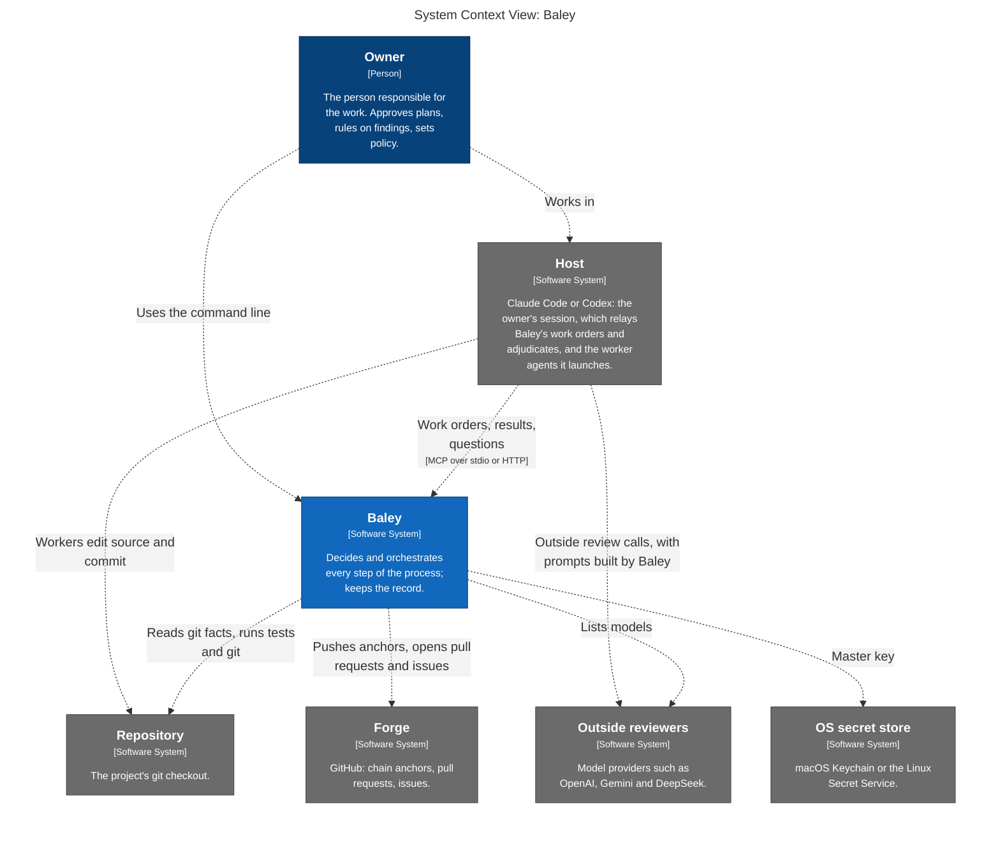
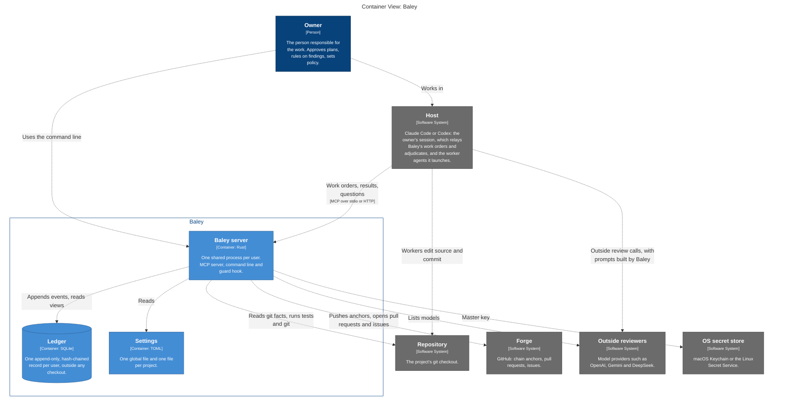

# 0002: System design

| | |
|---|---|
| Status | Accepted |
| Requirement prefix | SYS |
| Product requirements | [PRD](prd/baley.md) |
| Store | [0001: The evidence ledger](0001-evidence-ledger.md) |
| C4 model | [c4/workspace.dsl](c4/workspace.dsl) |

This document is the architecture every area design follows. It states who is responsible for what, the patterns every area applies, how the parts of Baley fit together, and the decisions that cut across all areas. Each area document (configuration, planning, execution, review and the rest) applies these patterns without restating them.

## 1. Purpose

Baley is the owner's control plane for AI-assisted engineering. The owner decides and answers for the work. Baley decides every step of the process with deterministic code. Models do the engineering judgment. Nothing counts until Baley has recorded the evidence that proves it.

Principles behind the design:

- Someone has to answer for AI-written code, and that someone is the owner. The model is a tool that is shaped and checked, not a party that is trusted.
- The truth about the work lives outside the model, in Baley's record.
- A rule that matters is enforced by Baley, never by instructions asking the model to comply.
- Baley makes the process decisions. The model does not.

## 2. Separation of concerns

Three parties, one authority each.

| Party | Authority | Never does |
|---|---|---|
| Owner | Intent and accountability: approves plans, rules on findings, grants waivers and landing steps, sets policy | Edits the record by hand; is approved for by anyone else |
| Baley | The truth about the process, every process decision, and orchestration: what happens next, which worker runs with which work order, when to ask the owner. If it can be derived from the record, git or the settings, the model does not decide it. | Claims to understand code, plans or evidence; acts on a finding by itself |
| Model | Engineering judgment: what should be built, what code means, whether a plan makes sense, what caused a failure | Decides state, order, routing, model, effort, or whether proof is enough; writes a prompt or agent frontmatter |

The host's main session is the model too. Baley gives it two jobs:

- **Relay.** It launches the worker Baley names with Baley's work order, hands the results back, and puts Baley's questions to the owner. In this job it keeps no state and makes no decision.
- **Adjudicator.** When Baley asks, it judges other models' output. In adversarial and refute reviews it checks each finding against the code, drops what does not hold, and brings the owner each finding that survives, in plain words, with the options for fixing it. It does the same for the planner, plan checker and assumptions analyzer. The owner rules; Baley records the ruling.

Skills a host loads only tell the main session how to reach Baley's MCP server.

Consequences:

- The model is never the state machine. Every "what happens next" is Baley's answer.
- Facts and meaning never cross-parse. Baley holds process facts as typed records; the model receives engineering content as content. Neither side parses the other's language to recover a fact it should have been given.
- The model and Baley can change independently. A different model can do the work without knowing Baley's machinery, and Baley's rules can change without changing how the model understands its work.
- Documents explain why, skills point at Baley, Baley decides and orchestrates, models judge. Nothing else holds a process rule, so nothing drifts.

## 3. System context

<!-- c4:context -->

<!-- /c4:context -->

*Figure 1. System context.*

| Actor | What it is | Its part |
|---|---|---|
| Owner | The person responsible for the work | Approves, rules and sets policy |
| Baley | One Rust binary, run as one shared server per user | Decides, orchestrates, validates and keeps the record |
| Host | Claude Code or Codex | Its main session relays and adjudicates; the worker agents it launches do one piece of engineering judgment each |
| Outside reviewers | Model providers such as OpenAI, Gemini and DeepSeek | Review plans and diffs when the owner's policy asks for them; called by the host session, never by Baley. Baley itself only asks a provider which models a stored key can use ([0003](0003-configuration-and-routing.md), CFG-R20) |
| Repository | The project's git checkout | Holds the source; Baley reads git facts and runs tests and git there |
| Forge | GitHub | Holds chain anchors, pull requests and issues |
| OS secret store | macOS Keychain or the Linux Secret Service | Holds the master key that encrypts Baley's stored API keys ([0003](0003-configuration-and-routing.md)) |

## 4. The flow the owner works in

The working loop comes from Cadence: discuss, plan, check, execute, verify, land, with an approved plan before any work, one signed commit per task, and proof before anything counts. The loop is kept because it is familiar; nothing underneath it is required to work the way Cadence did.

| Step | Owner | Baley | Model (worker) | Host session |
|---|---|---|---|---|
| Start a project | Describes the project; approves requirements and roadmap | Records them; decides the first phase | Planner drafts requirements and roadmap | Relays |
| Context | Discusses the phase; approves its truths | Enforces the truth rules; records by digest | Analyzer surfaces assumptions; drafts truths | Adjudicates the analyzer's output |
| Plan | Approves the plan | Enforces the plan rules (one check per truth, evidence map, file leases); routes planner and checker | Planner writes the plan; plan checker judges it | Launches workers; adjudicates the planner's and checker's output |
| Plan review | Rules on each finding | Decides whether review runs and how strictly; builds the review work order; records rulings | Reviewers critique | Makes outside review calls; adjudicates the findings |
| Execute | Answers repair and stop questions | Admits, orders, allocates checks, runs the tests, enforces red then green and the suite gate | Executor writes tests and code, one signed commit per task | Launches the executor; returns its results |
| Diff review and risk | Rules on findings and risk | Detects risk, decides which review fires, holds the gate until ruled | Reviewers critique | Makes outside review calls; adjudicates the findings |
| Verify | Waives or overrules, with a reason | Re-runs each check; derives each truth's status from the verdicts; decides completion | Verifier gives one verdict per piece of evidence | Launches the verifier |
| Land and release | Approves each external step | Enforces order and authorization; claims, acts and records each git and forge step | None | Relays |

## 5. The work lifecycle

```mermaid
flowchart LR
  start[Project start] --> scope[Requirements and roadmap]
  scope --> ctx[Phase context: truths]
  ctx --> plan[Plan: evidence map, tasks, checks]
  plan --> check[Plan check and review]
  check --> approve{{Owner approves}}
  approve --> exec[Execution: red then green, suite gate]
  exec --> rr[Diff review and risk]
  rr --> verify[Verification: verdicts]
  verify --> done[Phase complete]
  done --> ms[Milestone close, landing, release]
```

*Figure 2. The work lifecycle. Side flows: capture, task, debug and spike; pause and undo; scope changes. At every arrow Baley checks the recorded evidence before the next step is allowed, and the owner acts wherever SYS-P5 requires.*

## 6. Architectural patterns

Every area document applies these.

| Id | Pattern |
|---|---|
| SYS-P1 | **Baley decides; the model judges.** Every process decision is deterministic code in Baley, made from the record and the settings: what may happen next, which role, which model, which effort, which review, whether the proof is enough. |
| SYS-P2 | **Complete work orders.** Baley builds each dispatch whole (section 8). The host session delivers it unchanged. A worker gets a work order id and reads its parts from Baley. |
| SYS-P3 | **Typed results, validated.** A worker returns typed pieces of judgment, never a document. Baley validates each result against its work order and the record before it counts, and refuses a result that fails with a code and a location. |
| SYS-P4 | **Evidence-gated lifecycle.** The state of all work is derived from the record, never stored beside it. Hardin, the part of Baley that answers "what may happen next", allows a step only when the recorded evidence supports it, and refuses anything else, naming what is missing. |
| SYS-P5 | **Owner authority.** Approving a plan, ruling on a finding, a waiver, a suite repair and each external landing step need the owner. An approval binds to the exact content by digest, with the owner and the time. Baley never acts on a finding, reruns or re-plans by itself. |
| SYS-P6 | **One source of truth.** Every fact is an event in the ledger (0001): attributed, hash-chained, anchored on the forge. Views are projections that can be rebuilt. No Markdown or other file is a record. |
| SYS-P7 | **Claim, act, record.** Any effect outside the ledger (git, forge, a test run) is claimed first, then done, then recorded. An interrupted effect is reconciled, never blindly repeated. |
| SYS-P8 | **Ports and adapters.** The domain core is plain synchronous code. Everything outside it is behind a port: storage, host, forge, and the process runner for git and tests. Baley has no port to outside models. Baley identifies its host and version on every connection, from the client information the host sends, and that host's adapter chooses the mechanisms: notification or waiting in steps, how a work order is delivered, where effort goes. A new host means a new adapter. |
| SYS-P9 | **Instructions are part of the binary.** Every instruction a model sees is compiled into Baley and served in bounded parts by id. Files a host must load (skills, agent definitions) are stubs Baley renders ([ADR 0009](../adr/0009-served-instructions.md)). |
| SYS-P10 | **A small, typed wire.** Few MCP tools, typed operations, operation names that are only ever added. Nothing is sent twice and nothing is echoed back. A refusal names a code and a place. |
| SYS-P11 | **Enforcement by mechanism.** A rule that matters is enforced by Baley or its guard, never by prose asking the model to comply. The guard checks git commands and file writes at the host's edge; the host sandbox keeps agents out of Baley's home ([ADR 0008](../adr/0008-host-sandbox-isolation.md)). |
| SYS-P12 | **Host neutrality.** Everything works with Claude Code or Codex as the host. Each wire, tool or instruction decision is judged on both, and the host that offers less sets the floor. Every capability reaches every agent, not only the main session. |

## 7. Inside Baley

<!-- c4:containers -->

<!-- /c4:containers -->

*Figure 3. Containers: the shared Baley server, the ledger and the settings files.*

```mermaid
graph LR
  linkStyle default fill:none

  subgraph diagram ["Component View: Baley - Baley server"]
    style diagram fill:none,stroke:none

    1["<div style='font-weight: bold'>Owner</div><div style='font-size: 70%; margin-top: 0px'>[Person]</div><div style='font-size: 80%; margin-top:10px'>The person responsible for<br />the work. Approves plans,<br />rules on findings, sets<br />policy.</div>"]
    style 1 fill:#08427b,stroke:#052e56,color:#ffffff

    14["<div style='font-weight: bold'>Host</div><div style='font-size: 70%; margin-top: 0px'>[Software System]</div><div style='font-size: 80%; margin-top:10px'>Claude Code or Codex: the<br />owner's session, which relays<br />Baley's work orders and<br />adjudicates, and the worker<br />agents it launches.</div>"]
    style 14 fill:#6b6b6b,stroke:#4d4d4d,color:#ffffff
    15["<div style='font-weight: bold'>Repository</div><div style='font-size: 70%; margin-top: 0px'>[Software System]</div><div style='font-size: 80%; margin-top:10px'>The project's git checkout.</div>"]
    style 15 fill:#6b6b6b,stroke:#4d4d4d,color:#ffffff
    16["<div style='font-weight: bold'>Forge</div><div style='font-size: 70%; margin-top: 0px'>[Software System]</div><div style='font-size: 80%; margin-top:10px'>GitHub: chain anchors, pull<br />requests, issues.</div>"]
    style 16 fill:#6b6b6b,stroke:#4d4d4d,color:#ffffff
    17["<div style='font-weight: bold'>Outside reviewers</div><div style='font-size: 70%; margin-top: 0px'>[Software System]</div><div style='font-size: 80%; margin-top:10px'>Model providers such as<br />OpenAI, Gemini and DeepSeek.</div>"]
    style 17 fill:#6b6b6b,stroke:#4d4d4d,color:#ffffff
    18["<div style='font-weight: bold'>OS secret store</div><div style='font-size: 70%; margin-top: 0px'>[Software System]</div><div style='font-size: 80%; margin-top:10px'>macOS Keychain or the Linux<br />Secret Service.</div>"]
    style 18 fill:#6b6b6b,stroke:#4d4d4d,color:#ffffff

    subgraph 2 ["Baley"]
      style 2 fill:none,stroke:#0b4884,color:#0b4884

      subgraph 3 ["Baley server"]
        style 3 fill:none,stroke:#2e6295,color:#2e6295

        10["<div style='font-weight: bold'>Model catalog</div><div style='font-size: 70%; margin-top: 0px'>[Component]</div><div style='font-size: 80%; margin-top:10px'>The models each host and<br />provider offers, seeded from<br />the binary and refreshed by<br />detection.</div>"]
        style 10 fill:#85bbf0,stroke:#5d82a8,color:#000000
        11["<div style='font-weight: bold'>Ports and adapters</div><div style='font-size: 70%; margin-top: 0px'>[Component]</div><div style='font-size: 80%; margin-top:10px'>Storage, git and test runner,<br />forge and host adapters. The<br />core sees only these ports.</div>"]
        style 11 fill:#85bbf0,stroke:#5d82a8,color:#000000
        4["<div style='font-weight: bold'>Host interface</div><div style='font-size: 70%; margin-top: 0px'>[Component]</div><div style='font-size: 80%; margin-top:10px'>MCP server (stdio and HTTP),<br />command line and guard hook:<br />the only ways in.</div>"]
        style 4 fill:#85bbf0,stroke:#5d82a8,color:#000000
        5["<div style='font-weight: bold'>Hardin</div><div style='font-size: 70%; margin-top: 0px'>[Component]</div><div style='font-size: 80%; margin-top:10px'>Derives the state of the work<br />from the record, answers what<br />may happen next and refuses<br />the rest.</div>"]
        style 5 fill:#85bbf0,stroke:#5d82a8,color:#000000
        6["<div style='font-weight: bold'>Domain areas</div><div style='font-size: 70%; margin-top: 0px'>[Component]</div><div style='font-size: 80%; margin-top:10px'>The rules of each process<br />area: planning, execution,<br />verification, review, risk,<br />landing and the rest.</div>"]
        style 6 fill:#85bbf0,stroke:#5d82a8,color:#000000
        7["<div style='font-weight: bold'>Work order composer</div><div style='font-size: 70%; margin-top: 0px'>[Component]</div><div style='font-size: 80%; margin-top:10px'>Builds every dispatch: role,<br />model and effort from policy,<br />instructions from the binary,<br />inputs from the record.</div>"]
        style 7 fill:#85bbf0,stroke:#5d82a8,color:#000000
        8["<div style='font-weight: bold'>Policy</div><div style='font-size: 70%; margin-top: 0px'>[Component]</div><div style='font-size: 80%; margin-top:10px'>Reads the global and project<br />settings, resolves the values<br />in effect and records which<br />applied.</div>"]
        style 8 fill:#85bbf0,stroke:#5d82a8,color:#000000
        9["<div style='font-weight: bold'>Key store</div><div style='font-size: 70%; margin-top: 0px'>[Component]</div><div style='font-size: 80%; margin-top:10px'>Holds provider API keys<br />encrypted in the ledger; the<br />master key sits in the OS<br />secret store.</div>"]
        style 9 fill:#85bbf0,stroke:#5d82a8,color:#000000
      end

      12[("<div style='font-weight: bold'>Ledger</div><div style='font-size: 70%; margin-top: 0px'>[Container: SQLite]</div><div style='font-size: 80%; margin-top:10px'>One append-only, hash-chained<br />record per user, outside any<br />checkout.</div>")]
      style 12 fill:#438dd5,stroke:#2e6295,color:#ffffff
      13["<div style='font-weight: bold'>Settings</div><div style='font-size: 70%; margin-top: 0px'>[Container: TOML]</div><div style='font-size: 80%; margin-top:10px'>One global file and one file<br />per project.</div>"]
      style 13 fill:#438dd5,stroke:#2e6295,color:#ffffff
    end

    1-. "<div>Works in</div><div style='font-size: 70%'></div>" .->14
    1-. "<div>Uses the command line</div><div style='font-size: 70%'></div>" .->4
    14-. "<div>Work orders, results,<br />questions</div><div style='font-size: 70%'>[MCP over stdio or HTTP]</div>" .->4
    14-. "<div>Workers edit source and<br />commit</div><div style='font-size: 70%'></div>" .->15
    14-. "<div>Outside review calls, with<br />prompts built by Baley</div><div style='font-size: 70%'></div>" .->17
    4-. "<div>Asks what may happen next</div><div style='font-size: 70%'></div>" .->5
    5-. "<div>Applies the area's rules</div><div style='font-size: 70%'></div>" .->6
    6-. "<div>Requests work orders</div><div style='font-size: 70%'></div>" .->7
    7-. "<div>Resolves role, model and<br />effort</div><div style='font-size: 70%'></div>" .->8
    8-. "<div>Reads</div><div style='font-size: 70%'></div>" .->13
    8-. "<div>Checks model names</div><div style='font-size: 70%'></div>" .->10
    8-. "<div>Records the effective policy<br />and each route</div><div style='font-size: 70%'></div>" .->11
    4-. "<div>Settings, key and model<br />commands</div><div style='font-size: 70%'></div>" .->8
    4-. "<div>Injects a key into one<br />command</div><div style='font-size: 70%'></div>" .->9
    9-. "<div>Master key</div><div style='font-size: 70%'></div>" .->18
    9-. "<div>Encrypted keys</div><div style='font-size: 70%'></div>" .->11
    10-. "<div>Key for detection</div><div style='font-size: 70%'></div>" .->9
    10-. "<div>Lists models</div><div style='font-size: 70%'></div>" .->17
    10-. "<div>Records detections</div><div style='font-size: 70%'></div>" .->11
    6-. "<div>Records and acts through</div><div style='font-size: 70%'></div>" .->11
    11-. "<div>Appends events, reads views</div><div style='font-size: 70%'></div>" .->12
    11-. "<div>Reads git facts, runs tests<br />and git</div><div style='font-size: 70%'></div>" .->15
    11-. "<div>Pushes anchors, opens pull<br />requests and issues</div><div style='font-size: 70%'></div>" .->16

  end
```

<!-- c4:components -->

<!-- /c4:components -->

*Figure 4. Components inside the Baley server.*

| Component | Responsibility |
|---|---|
| Host interface | The MCP server (stdio and HTTP), the command line and the guard hook: the only ways in |
| Hardin | Derives the state of the work from the ledger's views, answers what may happen next, refuses the rest |
| Domain areas | The rules of each process area, one design document each |
| Work order composer | Builds every dispatch: role, model and effort from policy, instructions from the binary, inputs from the ledger |
| Policy | Reads the global and project settings, resolves the values in effect, records which applied ([0003](0003-configuration-and-routing.md)) |
| Key store | Holds provider API keys encrypted in the ledger, with the master key in the OS secret store ([0003](0003-configuration-and-routing.md)) |
| Model catalog | The model names each host and provider offers, seeded from the binary and refreshed by detection ([0003](0003-configuration-and-routing.md)) |
| Ports and adapters | The store, git and the test runner, the forge, the host adapters |

## 8. Work orders

The one contract between Baley and every worker, including the outside reviews the host session makes.

| Part | Content | Source |
|---|---|---|
| Identity | Work order id, project, phase, plan, attempt | Ledger |
| Role | Planner, assumptions analyzer, plan checker, executor, verifier or reviewer | The area that issues it |
| Model and effort | Resolved from the settings, with the setting that decided it | Policy |
| Instructions | The role's compiled instructions, by id | Binary (SYS-P9) |
| Inputs | The records the role needs: truths, plan, checks, review material | Ledger |
| Expected result | The typed result the worker must return | The issuing area |

## 9. Requirements

| Id | Requirement | Why |
|---|---|---|
| SYS-R1 | One Baley server runs per user and serves every session and worker. | One process for the one per-user ledger; every session and worker reaches the same server. |
| SYS-R2 | The server accepts MCP over stdio and over HTTP, and answers both protocol revisions 2025-11-25 and 2026-07-28 on each. | Each host gets the newest protocol it can speak, over either transport. |
| SYS-R3 | At install Baley detects the operating system and asks whether to run in the background. If yes, Baley writes, starts and on uninstall removes its own systemd user unit (Linux) or launchd agent (macOS), `baley doctor` checks it, and hosts connect over HTTP. If no, the host starts a small stdio launcher that starts the shared server or joins it. The owner can change the choice later. | No service is required; HTTP is available to anyone who wants it; Baley always knows how it was started. |
| SYS-R4 | Both start routes lead to the same single server; a launcher joins a running server and never starts a second one. The server exits after a quiet period when it was started on demand and no session is connected. | One server per user in every case. |
| SYS-R5 | Connections are handled asynchronously at the edge; the decision core runs as synchronous code on a worker pool. A failure in one request never takes the server down, each session gets a bounded queue so none starves the others, memory stays bounded however large the ledger grows, and an upgrade replaces the server while sessions reconnect. | A shared server must be safe for every session at once. |
| SYS-R6 | Writes use optimistic concurrency: events are appended, never overwritten; one short write transaction at a time; each command's decision is made inside its write from inputs read there, and a command whose inputs changed is refused as stale, never merged. No record is locked while an agent works. | Several sessions, the guard hook and the command line write at once; contention within a project is low because only one dispatch per phase is active. Builds on 0001 EVD-R6, EVD-R7, EVD-R8 and EVD-R26. |
| SYS-R7 | Long work (test runs, git and forge steps) is claimed and started, then recorded when it ends. Where the host supports being notified when a call finishes, Baley keeps the call open; everywhere else the session waits in steps, each call returning on completion or after a timeout with "still running". The host adapter chooses. | Hosts limit how long a tool call may run. |
| SYS-R8 | Baley runs the test suite and each check's command itself. It judges results by exit code, with an optional standard report (such as JUnit XML) for which tests failed. | Evidence is first-hand, and every language works. |
| SYS-R9 | Outside models are called by the host session, never by Baley. Baley decides whether an outside review runs and with which providers, and builds the complete prompt and material as a work order; the host session makes the call and returns typed findings. | Responsibility stays with the party that acts. |
| SYS-R10 | Each outside provider uses either its own command-line login or an API key, as the owner chooses. | No one is forced to hand over a key. |
| SYS-R11 | An API key reaches a call only through `baley exec --key <provider> -- <command>`, which sets it in that one command's environment and replaces any copy of it in the command's output before the model sees it. | Keys stay out of conversations, transcripts and logs. The owner's own session keeps its own login. |
| SYS-R12 | Baley stores API keys itself, out of reasonable reach, never in a plain file in a folder and never in environment variables, and they are managed only through Baley's command line. | Keys are owned and handled by Baley. |
| SYS-R13 | Settings are TOML: one global file for everything shared across projects and one project file that overrides it. Branch, forge and repository settings live only in the project file. Settings that differ per host sit in a section for each host. Baley's command line and interview write the files; the model is never told about them; the ledger records the effective settings Baley acted under. | Familiar, reviewable settings with a record of what applied. |
| SYS-R14 | The first release supports Linux and macOS. | Windows is planned for a later release. |

## 10. Cross-cutting concerns

- **Trust.** Agents run as the owner's user. The design guards against accidental exposure, not a determined agent. The ledger is protected by the host sandbox, and tampering is detected through the hash chain and forge anchors.
- **Failure and recovery.** Claim, act, record (SYS-P7). A killed process is never taken as success. The log is good enough to diagnose a live failure.
- **Resources.** Memory use and read cost are defects a user sees: no loading the whole store, bounded reads, streaming.
- **Concurrency.** One user, one machine, one shared server; several sessions write through its single writer with optimistic concurrency (SYS-R6). No parallel or worktree execution.
- **Observability.** Every decision records its inputs, including the setting that decided a route.
- **Testing.** Baley's own tests and the tests Baley derives for the projects it manages follow the same rules: a test checks one behavior of one unit with plain values, depends only on the language toolchain and its test libraries, starts no program, and gives the same result on any machine. There are no end-to-end tests; live behavior is checked by an acceptance run on both hosts before release.

## 11. Decisions

Decision records this design produces.

- One shared Baley server per user, over stdio and HTTP (SYS-R1 to SYS-R4): [ADR 0011](../adr/0011-one-shared-server.md)
- Optimistic concurrency in the shared server (SYS-R6): [ADR 0012](../adr/0012-optimistic-concurrency.md)
- Outside models are called by the host session, not Baley (SYS-R9 to SYS-R12): [ADR 0013](../adr/0013-host-session-calls-outside-models.md)
- Baley runs tests itself and judges by exit code (SYS-R8): [ADR 0014](../adr/0014-baley-runs-tests.md)
- Settings in TOML, global and project, with host sections (SYS-R13): [ADR 0015](../adr/0015-settings-in-toml.md)

## 12. Open questions

| Question | Where it is decided |
|---|---|
| How effort reaches each host, how the launcher passes the host's identity, and whether Codex connects over HTTP | [0012: Host interface](0012-host-interface.md) (HST-R3, HST-R4, HST-R12; the HTTP test is its open question) |
| Reading git facts inside the write transaction (issue #40) | Build 4 |
