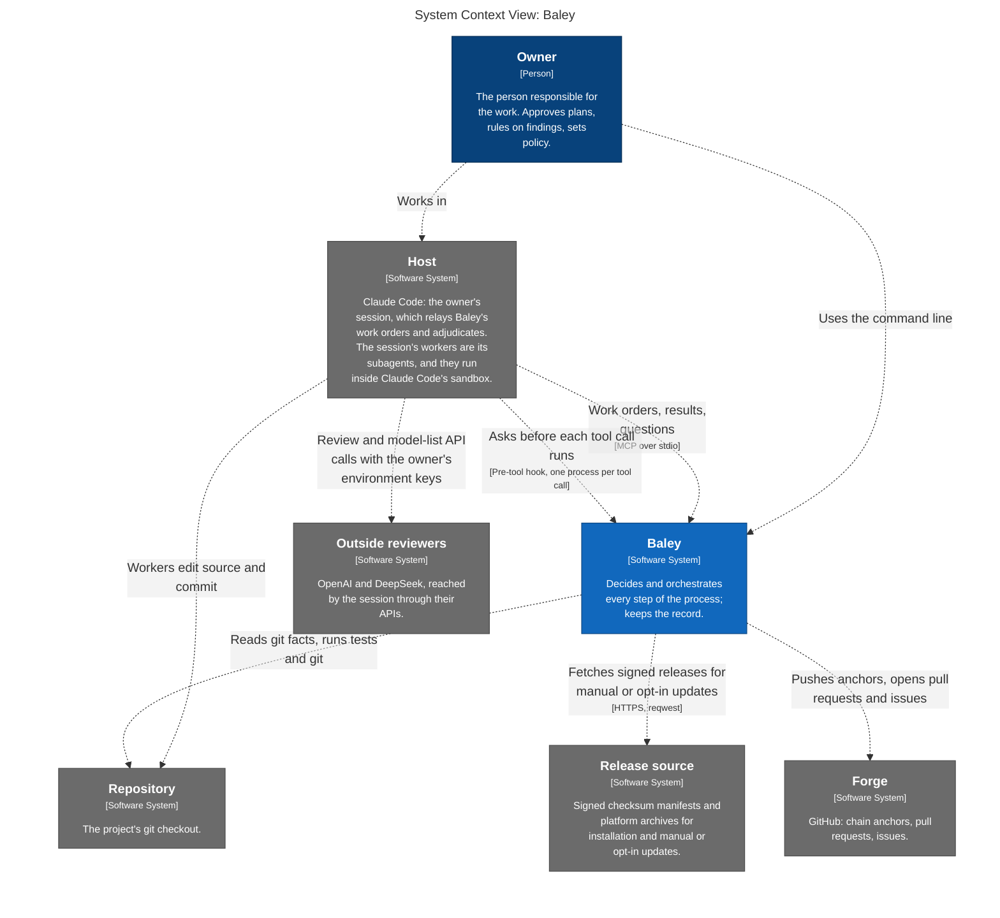
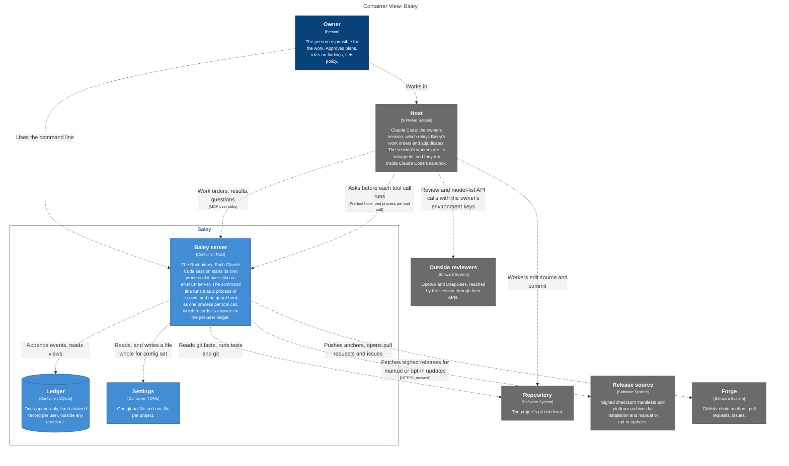
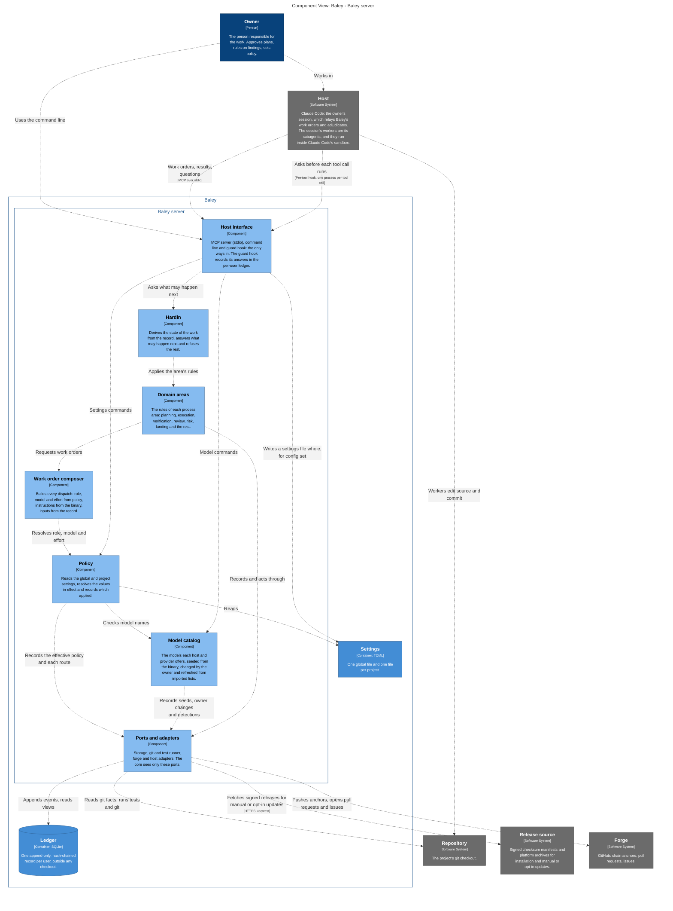

# 0002: System design

| | |
|---|---|
| Status | Accepted |
| Requirement prefix | SYS |
| Product requirements | [PRD](prd/baley.md) |
| Store | [0001: The evidence ledger](0001-evidence-ledger.md) |
| C4 model | [c4/workspace.dsl](c4/workspace.dsl) |

This document is the architecture every area design follows. It states who is responsible for what, the patterns every area applies, how the parts of Baley fit together, and the decisions that cut across all areas. Each area document (configuration, planning, execution, review and the rest) applies these patterns without restating them.

## 1. Purpose

Baley is the owner's control plane for AI-assisted engineering. The owner decides and answers for the work. Baley decides every step of the process with deterministic code. Models do the engineering judgment. Nothing counts until Baley has recorded the evidence that proves it.

Principles behind the design:

- Someone has to answer for AI-written code, and that someone is the owner. The model is a tool that is shaped and checked, not a party that is trusted.
- The truth about the work lives outside the model, in Baley's record.
- A rule that matters is enforced by Baley, never by instructions asking the model to comply.
- Baley makes the process decisions. The model does not.

## 2. Separation of concerns

Three parties, one authority each.

| Party | Authority | Never does |
|---|---|---|
| Owner | Intent and accountability: approves plans, rules on findings, grants waivers and landing steps, sets policy | Edits the record by hand; is approved for by anyone else |
| Baley | The truth about the process, every process decision, and orchestration: what happens next, which worker runs with which work order, when to ask the owner. If it can be derived from the record, git or the settings, the model does not decide it. | Claims to understand code, plans or evidence; acts on a finding by itself |
| Model | Engineering judgment: what should be built, what code means, whether a plan makes sense, what caused a failure | Decides state, order, routing, model, effort, or whether proof is enough; writes a prompt or agent frontmatter |

The host's main session is the model too. Baley gives it two jobs:

- **Relay.** It starts the worker Baley names as its own subagent, with Baley's work order, hands the results back, and puts Baley's questions to the owner. There is no headless worker path. In this job it keeps no state and makes no decision.
- **Adjudicator.** When Baley asks, it judges other models' output. In adversarial and refute reviews it checks each finding against the code, drops what does not hold, and brings the owner each finding that survives, in plain words, with the options for fixing it. It does the same for the planner's plans, the plan checker's findings and the analyzer's draft truths. It does not adjudicate questions: the analyzer's and the planner's questions go to the owner as returned, in the rounds Baley works out, and the owner's answers come back unchanged ([0005](0005-context-plans-and-acceptance.md), PLN-R24). The owner rules; Baley records the ruling.

Skills a host loads only tell the main session how to reach Baley's MCP server.

Consequences:

- The model is never the state machine. Every "what happens next" is Baley's answer.
- Facts and meaning never cross-parse. Baley holds process facts as typed records; the model receives engineering content as content. Neither side parses the other's language to recover a fact it should have been given.
- The model and Baley can change independently. A different model can do the work without knowing Baley's machinery, and Baley's rules can change without changing how the model understands its work.
- Documents explain why, skills point at Baley, Baley decides and orchestrates, models judge. Nothing else holds a process rule, so nothing drifts.

## 3. System context

<!-- c4:context -->

```mermaid
graph LR
  linkStyle default fill:none

  subgraph diagram ["System Context View: Baley"]
    style diagram fill:none,stroke:none

    1["<div style='font-weight: bold'>Owner</div><div style='font-size: 70%; margin-top: 0px'>[Person]</div><div style='font-size: 80%; margin-top:10px'>The person responsible for<br />the work. Approves plans,<br />rules on findings, sets<br />policy.</div>"]
    style 1 fill:#08427b,stroke:#052e56,color:#ffffff
    13["<div style='font-weight: bold'>Host</div><div style='font-size: 70%; margin-top: 0px'>[Software System]</div><div style='font-size: 80%; margin-top:10px'>Claude Code: the owner's<br />session, which relays Baley's<br />work orders and adjudicates.<br />The session's workers are its<br />subagents, and they run<br />inside Claude Code's sandbox.</div>"]
    style 13 fill:#6b6b6b,stroke:#4d4d4d,color:#ffffff
    14["<div style='font-weight: bold'>Repository</div><div style='font-size: 70%; margin-top: 0px'>[Software System]</div><div style='font-size: 80%; margin-top:10px'>The project's git checkout.</div>"]
    style 14 fill:#6b6b6b,stroke:#4d4d4d,color:#ffffff
    15["<div style='font-weight: bold'>Release source</div><div style='font-size: 70%; margin-top: 0px'>[Software System]</div><div style='font-size: 80%; margin-top:10px'>Signed checksum manifests and<br />platform archives for<br />installation and manual or<br />opt-in updates.</div>"]
    style 15 fill:#6b6b6b,stroke:#4d4d4d,color:#ffffff
    16["<div style='font-weight: bold'>Forge</div><div style='font-size: 70%; margin-top: 0px'>[Software System]</div><div style='font-size: 80%; margin-top:10px'>GitHub: chain anchors, pull<br />requests, issues.</div>"]
    style 16 fill:#6b6b6b,stroke:#4d4d4d,color:#ffffff
    17["<div style='font-weight: bold'>Outside reviewers</div><div style='font-size: 70%; margin-top: 0px'>[Software System]</div><div style='font-size: 80%; margin-top:10px'>OpenAI and DeepSeek, reached<br />by the session through their<br />APIs.</div>"]
    style 17 fill:#6b6b6b,stroke:#4d4d4d,color:#ffffff
    2["<div style='font-weight: bold'>Baley</div><div style='font-size: 70%; margin-top: 0px'>[Software System]</div><div style='font-size: 80%; margin-top:10px'>Decides and orchestrates<br />every step of the process;<br />keeps the record.</div>"]
    style 2 fill:#1168bd,stroke:#0b4884,color:#ffffff

    1-. "<div>Works in</div><div style='font-size: 70%'></div>" .->13
    1-. "<div>Uses the command line</div><div style='font-size: 70%'></div>" .->2
    13-. "<div>Work orders, results,<br />questions</div><div style='font-size: 70%'>[MCP over stdio]</div>" .->2
    13-. "<div>Asks before each tool call<br />runs</div><div style='font-size: 70%'>[Pre-tool hook, one process per tool call]</div>" .->2
    13-. "<div>Workers edit source and<br />commit</div><div style='font-size: 70%'></div>" .->14
    13-. "<div>Review and model-list API<br />calls with the owner's<br />environment keys</div><div style='font-size: 70%'></div>" .->17
    2-. "<div>Reads git facts, runs tests<br />and git</div><div style='font-size: 70%'></div>" .->14
    2-. "<div>Pushes anchors, opens pull<br />requests and issues</div><div style='font-size: 70%'></div>" .->16
    2-. "<div>Fetches signed releases for<br />manual or opt-in updates</div><div style='font-size: 70%'>[HTTPS, reqwest]</div>" .->15

  end
```
<!-- /c4:context -->

*Figure 1. System context. The host reaches Baley two ways: over MCP from its session, and through its pre-tool hook before each tool call runs. The session sends review and model-list requests to providers. Baley contacts the release source for manual or opt-in updates.*

| Actor | What it is | Its part |
|---|---|---|
| Owner | The person responsible for the work | Approves, rules and sets policy |
| Baley | One Rust binary, started by each Claude Code session as its own MCP server over stdio, and by the host's pre-tool hook once per tool call | Decides, orchestrates, validates and keeps the record |
| Host | Claude Code | Its main session relays and adjudicates, and the subagents it starts each do one piece of engineering judgment |
| Release source | Signed checksum manifests and platform archives | Supplies installation and update downloads; automatic update checks require opt-in |
| Outside reviewers | OpenAI and DeepSeek | Review plans and diffs through their APIs, called by the host session. The session also fetches model lists with the owner's environment keys and returns the raw answers to Baley ([0003](0003-configuration-and-routing.md), CFG-R20) |
| Repository | The project's git checkout | Holds the source; Baley reads git facts and runs tests and git there |
| Forge | GitHub | Holds chain anchors, pull requests and issues |

## 4. The flow the owner works in

The working loop comes from the earlier system: discuss, plan, check, execute, verify, land, with an approved plan before any work, one signed commit per task, and proof before anything counts. The loop is kept because it is familiar; nothing underneath it is required to work the same way.

| Step | Owner | Baley | Model (worker) | Host session |
|---|---|---|---|---|
| Start a project | Describes the project; approves the first stories and roadmap | Records them; decides the first phase | Planner drafts the stories and roadmap | Relays |
| Refinement | Answers each story's questions round by round, or defers one with a reason; approves the story's truths | Works out each round from the questions' dependencies; records answers and deferrals as given; enforces the truth rules; records truths by digest | Analyzer finds the facts in the code and the records, asks questions only for the decisions left to the owner, then drafts truths from the answers | Relays the questions and the answers unchanged; adjudicates the draft truths |
| Plan | Answers the plan's questions round by round; approves the plan | Enforces the plan rules (one check per truth, evidence map, file leases); works out the rounds of the plan's questions; routes planner and checker | Planner writes the plan on its recommended answers; plan checker judges it | Launches workers; relays the plan's questions and the answers unchanged; adjudicates the planner's and checker's output |
| Plan review | Rules on each finding | Decides whether review runs and how strictly; builds the review work order; records rulings | Reviewers critique | Makes outside review calls; adjudicates the findings |
| Execute | Answers repair and stop questions | Admits, orders, allocates checks, runs the tests, enforces red then green and the suite gate | Executor writes tests and code, one signed commit per task | Launches the executor; returns its results |
| Diff review and risk | Rules on findings and risk | Detects risk, decides which review fires, holds the gate until ruled | Reviewers critique | Makes outside review calls; adjudicates the findings |
| Verify | Waives or overrules, with a reason | Re-runs each check; derives each truth's status from the verdicts; decides completion | Verifier gives one verdict per piece of evidence | Launches the verifier |
| Land and release | Approves each external step | Enforces order and authorization; claims, acts and records each git and forge step | None | Relays |

## 5. The work lifecycle

```mermaid
flowchart LR
  start[Project start] --> scope[Stories and roadmap]
  scope --> ctx[Phase context: truths]
  ctx --> plan[Plan: evidence map, tasks, checks]
  plan --> check[Plan check and review]
  check --> approve{{Owner approves}}
  approve --> exec[Execution: red then green, suite gate]
  exec --> rr[Diff review and risk]
  rr --> verify[Verification: verdicts]
  verify --> done[Phase complete]
  done --> ms[Milestone close, landing, release]
```

*Figure 2. The work lifecycle. Side flows: capture, task, debug and spike; pause and undo; scope changes. At every arrow Baley checks the recorded evidence before the next step is allowed, and the owner acts wherever SYS-P5 requires.*

## 6. Architectural patterns

Every area document applies these.

| Id | Pattern |
|---|---|
| SYS-P1 | **Baley decides; the model judges.** Every process decision is deterministic code in Baley, made from the record and the settings: what may happen next, which role, which model, which effort, which review, whether the proof is enough. |
| SYS-P2 | **Complete work orders.** Baley builds each dispatch whole (section 8). The host session delivers it unchanged. A worker gets a work order id and reads its parts from Baley. |
| SYS-P3 | **Typed results, validated.** A worker returns typed pieces of judgment, never a document. Baley validates each result against its work order and the record before it counts, and refuses a result that fails with a code and a location. |
| SYS-P4 | **Evidence-gated lifecycle.** The state of all work is derived from the record, never stored beside it. Hardin, the part of Baley that answers "what may happen next", allows a step only when the recorded evidence supports it, and refuses anything else, naming what is missing. |
| SYS-P5 | **Owner authority.** Approving a plan, ruling on a finding, a waiver, a suite repair and each external landing step need the owner. An approval binds to the exact content by digest, with the owner and the time. Baley never acts on a finding, reruns or re-plans by itself. |
| SYS-P6 | **One source of truth.** Every fact is an event in the ledger (0001): attributed, hash-chained, anchored on the forge. Views are projections that can be rebuilt. No Markdown or other file is a record. |
| SYS-P7 | **Claim, act, record.** Any effect outside the ledger (git, forge, a test run) is claimed first, then done, then recorded. An interrupted effect is reconciled, never blindly repeated. |
| SYS-P8 | **Ports and adapters.** The domain core is plain synchronous code. Everything outside it is behind a port: storage, host, forge, and the process runner for git and tests. Baley has no port to outside models. Baley identifies its host and version from the client information the host sends, and that host's adapter chooses the mechanisms: notification or waiting in steps, how a work order is delivered, where effort goes. A new host means a new adapter. |
| SYS-P9 | **Instructions are part of the binary.** Every instruction a model sees is compiled into Baley and served in bounded parts by id. Files a host must load (skills, agent definitions) are stubs Baley renders ([ADR 0009](../adr/0009-served-instructions.md)). |
| SYS-P10 | **A small, typed wire.** Few MCP tools, typed operations, operation names that are only ever added. Nothing is sent twice and nothing is echoed back. A refusal names a code and a place. |
| SYS-P11 | **Enforcement by mechanism.** A rule that matters is enforced by Baley or its guard, never by prose asking the model to comply. The guard checks git commands and file writes at the host's edge; Claude Code's sandbox and its `Read` and `Edit` deny rules keep agents from reading or writing Baley's home and config folder ([ADR 0008](../adr/0008-host-sandbox-isolation.md), [ADR 0020](../adr/0020-sandbox-is-a-write-barrier.md), [ADR 0033](../adr/0033-host-security-bar.md)). |
| SYS-P12 | **The security bar.** Claude Code is the reference host. Baley supports a host only when the host matrix shows that its sandboxing and execution controls meet the bar [ADR 0033](../adr/0033-host-security-bar.md) states, and adding one takes a new ADR and an adapter. Baley does not lower its security defaults to accommodate a host. A host that offers more than Claude Code may offer more, as an addition its adapter declares; no step of the process depends on an addition, and on a host without it `baley doctor` names it as unavailable and a setting that asks for it is refused there ([ADR 0029](../adr/0029-a-host-may-offer-more.md)). Every capability reaches every agent, not only the main session. |

## 7. Inside Baley

<!-- c4:containers -->

```mermaid
graph LR
  linkStyle default fill:none

  subgraph diagram ["Container View: Baley"]
    style diagram fill:none,stroke:none

    1["<div style='font-weight: bold'>Owner</div><div style='font-size: 70%; margin-top: 0px'>[Person]</div><div style='font-size: 80%; margin-top:10px'>The person responsible for<br />the work. Approves plans,<br />rules on findings, sets<br />policy.</div>"]
    style 1 fill:#08427b,stroke:#052e56,color:#ffffff
    13["<div style='font-weight: bold'>Host</div><div style='font-size: 70%; margin-top: 0px'>[Software System]</div><div style='font-size: 80%; margin-top:10px'>Claude Code: the owner's<br />session, which relays Baley's<br />work orders and adjudicates.<br />The session's workers are its<br />subagents, and they run<br />inside Claude Code's sandbox.</div>"]
    style 13 fill:#6b6b6b,stroke:#4d4d4d,color:#ffffff
    14["<div style='font-weight: bold'>Repository</div><div style='font-size: 70%; margin-top: 0px'>[Software System]</div><div style='font-size: 80%; margin-top:10px'>The project's git checkout.</div>"]
    style 14 fill:#6b6b6b,stroke:#4d4d4d,color:#ffffff
    15["<div style='font-weight: bold'>Release source</div><div style='font-size: 70%; margin-top: 0px'>[Software System]</div><div style='font-size: 80%; margin-top:10px'>Signed checksum manifests and<br />platform archives for<br />installation and manual or<br />opt-in updates.</div>"]
    style 15 fill:#6b6b6b,stroke:#4d4d4d,color:#ffffff
    16["<div style='font-weight: bold'>Forge</div><div style='font-size: 70%; margin-top: 0px'>[Software System]</div><div style='font-size: 80%; margin-top:10px'>GitHub: chain anchors, pull<br />requests, issues.</div>"]
    style 16 fill:#6b6b6b,stroke:#4d4d4d,color:#ffffff
    17["<div style='font-weight: bold'>Outside reviewers</div><div style='font-size: 70%; margin-top: 0px'>[Software System]</div><div style='font-size: 80%; margin-top:10px'>OpenAI and DeepSeek, reached<br />by the session through their<br />APIs.</div>"]
    style 17 fill:#6b6b6b,stroke:#4d4d4d,color:#ffffff

    subgraph 2 ["Baley"]
      style 2 fill:none,stroke:#0b4884,color:#0b4884

      11[("<div style='font-weight: bold'>Ledger</div><div style='font-size: 70%; margin-top: 0px'>[Container: SQLite]</div><div style='font-size: 80%; margin-top:10px'>One append-only, hash-chained<br />record per user, outside any<br />checkout.</div>")]
      style 11 fill:#438dd5,stroke:#2e6295,color:#ffffff
      12["<div style='font-weight: bold'>Settings</div><div style='font-size: 70%; margin-top: 0px'>[Container: TOML]</div><div style='font-size: 80%; margin-top:10px'>One global file and one file<br />per project.</div>"]
      style 12 fill:#438dd5,stroke:#2e6295,color:#ffffff
      3["<div style='font-weight: bold'>Baley server</div><div style='font-size: 70%; margin-top: 0px'>[Container: Rust]</div><div style='font-size: 80%; margin-top:10px'>The Rust binary. Each Claude<br />Code session starts its own<br />process of it over stdio as<br />an MCP server. The command<br />line runs it as a process of<br />its own, and the guard hook<br />as one process per tool call,<br />which records its answers in<br />the per-user ledger.</div>"]
      style 3 fill:#438dd5,stroke:#2e6295,color:#ffffff
    end

    1-. "<div>Works in</div><div style='font-size: 70%'></div>" .->13
    1-. "<div>Uses the command line</div><div style='font-size: 70%'></div>" .->3
    13-. "<div>Work orders, results,<br />questions</div><div style='font-size: 70%'>[MCP over stdio]</div>" .->3
    13-. "<div>Asks before each tool call<br />runs</div><div style='font-size: 70%'>[Pre-tool hook, one process per tool call]</div>" .->3
    13-. "<div>Workers edit source and<br />commit</div><div style='font-size: 70%'></div>" .->14
    13-. "<div>Review and model-list API<br />calls with the owner's<br />environment keys</div><div style='font-size: 70%'></div>" .->17
    3-. "<div>Reads, and writes a file<br />whole for config set</div><div style='font-size: 70%'></div>" .->12
    3-. "<div>Appends events, reads views</div><div style='font-size: 70%'></div>" .->11
    3-. "<div>Reads git facts, runs tests<br />and git</div><div style='font-size: 70%'></div>" .->14
    3-. "<div>Pushes anchors, opens pull<br />requests and issues</div><div style='font-size: 70%'></div>" .->16
    3-. "<div>Fetches signed releases for<br />manual or opt-in updates</div><div style='font-size: 70%'>[HTTPS, reqwest]</div>" .->15

  end
```
<!-- /c4:containers -->

*Figure 3. Containers: the Baley server, one process per session over MCP and one per tool call through the pre-tool hook, with the ledger and the settings files. Provider calls and credentials stay with the host session. Release downloads use the binary's HTTP client, with automatic checks in a detached process only after opt-in. The guard hook records its answers in the per-user ledger ([0010](0010-guard.md)).*

<!-- c4:components -->

```mermaid
graph LR
  linkStyle default fill:none

  subgraph diagram ["Component View: Baley - Baley server"]
    style diagram fill:none,stroke:none

    1["<div style='font-weight: bold'>Owner</div><div style='font-size: 70%; margin-top: 0px'>[Person]</div><div style='font-size: 80%; margin-top:10px'>The person responsible for<br />the work. Approves plans,<br />rules on findings, sets<br />policy.</div>"]
    style 1 fill:#08427b,stroke:#052e56,color:#ffffff

    13["<div style='font-weight: bold'>Host</div><div style='font-size: 70%; margin-top: 0px'>[Software System]</div><div style='font-size: 80%; margin-top:10px'>Claude Code: the owner's<br />session, which relays Baley's<br />work orders and adjudicates.<br />The session's workers are its<br />subagents, and they run<br />inside Claude Code's sandbox.</div>"]
    style 13 fill:#6b6b6b,stroke:#4d4d4d,color:#ffffff
    14["<div style='font-weight: bold'>Repository</div><div style='font-size: 70%; margin-top: 0px'>[Software System]</div><div style='font-size: 80%; margin-top:10px'>The project's git checkout.</div>"]
    style 14 fill:#6b6b6b,stroke:#4d4d4d,color:#ffffff
    15["<div style='font-weight: bold'>Release source</div><div style='font-size: 70%; margin-top: 0px'>[Software System]</div><div style='font-size: 80%; margin-top:10px'>Signed checksum manifests and<br />platform archives for<br />installation and manual or<br />opt-in updates.</div>"]
    style 15 fill:#6b6b6b,stroke:#4d4d4d,color:#ffffff
    16["<div style='font-weight: bold'>Forge</div><div style='font-size: 70%; margin-top: 0px'>[Software System]</div><div style='font-size: 80%; margin-top:10px'>GitHub: chain anchors, pull<br />requests, issues.</div>"]
    style 16 fill:#6b6b6b,stroke:#4d4d4d,color:#ffffff

    subgraph 2 ["Baley"]
      style 2 fill:none,stroke:#0b4884,color:#0b4884

      subgraph 3 ["Baley server"]
        style 3 fill:none,stroke:#2e6295,color:#2e6295

        10["<div style='font-weight: bold'>Ports and adapters</div><div style='font-size: 70%; margin-top: 0px'>[Component]</div><div style='font-size: 80%; margin-top:10px'>Storage, git and test runner,<br />forge and host adapters. The<br />core sees only these ports.</div>"]
        style 10 fill:#85bbf0,stroke:#5d82a8,color:#000000
        4["<div style='font-weight: bold'>Host interface</div><div style='font-size: 70%; margin-top: 0px'>[Component]</div><div style='font-size: 80%; margin-top:10px'>MCP server (stdio), command<br />line and guard hook: the only<br />ways in. The guard hook<br />records its answers in the<br />per-user ledger.</div>"]
        style 4 fill:#85bbf0,stroke:#5d82a8,color:#000000
        5["<div style='font-weight: bold'>Hardin</div><div style='font-size: 70%; margin-top: 0px'>[Component]</div><div style='font-size: 80%; margin-top:10px'>Derives the state of the work<br />from the record, answers what<br />may happen next and refuses<br />the rest.</div>"]
        style 5 fill:#85bbf0,stroke:#5d82a8,color:#000000
        6["<div style='font-weight: bold'>Domain areas</div><div style='font-size: 70%; margin-top: 0px'>[Component]</div><div style='font-size: 80%; margin-top:10px'>The rules of each process<br />area: planning, execution,<br />verification, review, risk,<br />landing and the rest.</div>"]
        style 6 fill:#85bbf0,stroke:#5d82a8,color:#000000
        7["<div style='font-weight: bold'>Work order composer</div><div style='font-size: 70%; margin-top: 0px'>[Component]</div><div style='font-size: 80%; margin-top:10px'>Builds every dispatch: role,<br />model and effort from policy,<br />instructions from the binary,<br />inputs from the record.</div>"]
        style 7 fill:#85bbf0,stroke:#5d82a8,color:#000000
        8["<div style='font-weight: bold'>Policy</div><div style='font-size: 70%; margin-top: 0px'>[Component]</div><div style='font-size: 80%; margin-top:10px'>Reads the global and project<br />settings, resolves the values<br />in effect and records which<br />applied.</div>"]
        style 8 fill:#85bbf0,stroke:#5d82a8,color:#000000
        9["<div style='font-weight: bold'>Model catalog</div><div style='font-size: 70%; margin-top: 0px'>[Component]</div><div style='font-size: 80%; margin-top:10px'>The models each host and<br />provider offers, seeded from<br />the binary, changed by the<br />owner and refreshed from<br />imported lists.</div>"]
        style 9 fill:#85bbf0,stroke:#5d82a8,color:#000000
      end

      11[("<div style='font-weight: bold'>Ledger</div><div style='font-size: 70%; margin-top: 0px'>[Container: SQLite]</div><div style='font-size: 80%; margin-top:10px'>One append-only, hash-chained<br />record per user, outside any<br />checkout.</div>")]
      style 11 fill:#438dd5,stroke:#2e6295,color:#ffffff
      12["<div style='font-weight: bold'>Settings</div><div style='font-size: 70%; margin-top: 0px'>[Container: TOML]</div><div style='font-size: 80%; margin-top:10px'>One global file and one file<br />per project.</div>"]
      style 12 fill:#438dd5,stroke:#2e6295,color:#ffffff
    end

    1-. "<div>Works in</div><div style='font-size: 70%'></div>" .->13
    1-. "<div>Uses the command line</div><div style='font-size: 70%'></div>" .->4
    13-. "<div>Work orders, results,<br />questions</div><div style='font-size: 70%'>[MCP over stdio]</div>" .->4
    13-. "<div>Asks before each tool call<br />runs</div><div style='font-size: 70%'>[Pre-tool hook, one process per tool call]</div>" .->4
    13-. "<div>Workers edit source and<br />commit</div><div style='font-size: 70%'></div>" .->14
    4-. "<div>Asks what may happen next</div><div style='font-size: 70%'></div>" .->5
    5-. "<div>Applies the area's rules</div><div style='font-size: 70%'></div>" .->6
    6-. "<div>Requests work orders</div><div style='font-size: 70%'></div>" .->7
    7-. "<div>Resolves role, model and<br />effort</div><div style='font-size: 70%'></div>" .->8
    8-. "<div>Reads</div><div style='font-size: 70%'></div>" .->12
    4-. "<div>Writes a settings file whole,<br />for config set</div><div style='font-size: 70%'></div>" .->12
    8-. "<div>Checks model names</div><div style='font-size: 70%'></div>" .->9
    8-. "<div>Records the effective policy<br />and each route</div><div style='font-size: 70%'></div>" .->10
    4-. "<div>Settings commands</div><div style='font-size: 70%'></div>" .->8
    4-. "<div>Model commands</div><div style='font-size: 70%'></div>" .->9
    9-. "<div>Records seeds, owner changes<br />and detections</div><div style='font-size: 70%'></div>" .->10
    6-. "<div>Records and acts through</div><div style='font-size: 70%'></div>" .->10
    10-. "<div>Appends events, reads views</div><div style='font-size: 70%'></div>" .->11
    10-. "<div>Reads git facts, runs tests<br />and git</div><div style='font-size: 70%'></div>" .->14
    10-. "<div>Pushes anchors, opens pull<br />requests and issues</div><div style='font-size: 70%'></div>" .->16
    10-. "<div>Fetches signed releases for<br />manual or opt-in updates</div><div style='font-size: 70%'>[HTTPS, reqwest]</div>" .->15

  end
```
<!-- /c4:components -->

*Figure 4. Components inside the Baley server, the binary each session starts over stdio and the pre-tool hook starts for each tool call. The model catalog reads imported lists and has no provider connection or key reader. Ports also fetch signed releases for manual or opt-in updates.*

| Component | Responsibility |
|---|---|
| Host interface | The MCP server (stdio), the command line and the guard hook: the only ways in |
| Hardin | Derives the state of the work from the ledger's views, answers what may happen next, refuses the rest |
| Domain areas | The rules of each process area, one design document each |
| Work order composer | Builds every dispatch: role, model and effort from policy, instructions from the binary, inputs from the ledger |
| Policy | Reads the global and project settings, resolves the values in effect, records which applied ([0003](0003-configuration-and-routing.md)) |
| Model catalog | The model names each host and provider offers, seeded from the binary, changed by the owner and refreshed from imported lists ([0003](0003-configuration-and-routing.md)) |
| Ports and adapters | The store, git and the test runner, the forge, the host adapters |

## 8. Work orders

The one contract between Baley and every worker, including the outside reviews the host session makes.

| Part | Content | Source |
|---|---|---|
| Identity | Work order id, project, phase, plan, attempt | Ledger |
| Role | Planner, analyzer, plan checker, executor, verifier or reviewer | The area that issues it |
| Model and effort | Resolved from the settings, with the setting that decided it | Policy |
| Instructions | The role's compiled instructions, by id | Binary (SYS-P9) |
| Inputs | The records the role needs: truths, plan, checks, review material | Ledger |
| Expected result | The typed result the worker must return | The issuing area |

## 9. Requirements

| Id | Requirement | Why |
|---|---|---|
| SYS-R1 | Each Claude Code session starts its own Baley server over stdio. The session's subagents reach it through the session's connection, and every worker in this release is a subagent of its session. | The host already starts one stdio server per session and routes its subagents through it, so the process is the session and every call is tied to its project and session ([ADR 0034](../adr/0034-one-server-per-session.md)). |
| SYS-R2 | The server accepts MCP over stdio only, and answers the protocol revisions 2025-11-25 and 2026-07-28, the two it has been tested on. | The session gets the newest revision it can speak, and no revision Baley has not been tested on is offered. |
| SYS-R3 | Withdrawn. There is no install-time choice of start route and no service or launcher: Claude Code starts the server for each session ([ADR 0034](../adr/0034-one-server-per-session.md)). | |
| SYS-R4 | Withdrawn. There is no single shared server to join and no idle exit; a server's lifetime is its session's (SYS-R1, SYS-R5). | |
| SYS-R5 | A session's calls are handled asynchronously at the edge and decided one at a time on the server's own worker, as synchronous code. A failure in one call never takes the server down. One bounded queue serves the session and every subagent: one call running and four waiting, with at most 16 MiB of raw frames among them, and a call beyond either bound gets a retryable overload answer. Memory stays bounded however large the ledger grows. At end of input the server stops taking calls, lets accepted work run for at most ten seconds and makes one `PASSIVE` checkpoint attempt. | Subagents share their session's connection, so one queue keeps them from starving each other, and the bounds are what a session may cost. |
| SYS-R6 | Writes use optimistic concurrency across processes: each session's server, the guard hook and the command line open the per-user store. Every write takes the writer queue, `BEGIN IMMEDIATE` and the epoch check, and each command's decision is made inside its transaction from inputs read there. Events are appended, never overwritten, and a command whose inputs changed is refused as stale, never merged. No record is locked while an agent works. | Several sessions' servers, the guard hook and the command line write the one per-user ledger from separate processes; contention within a project is low because only one dispatch per phase is active. Builds on 0001 EVD-R6, EVD-R7, EVD-R8 and EVD-R26. |
| SYS-R7 | Long work (test runs, git and forge steps) is claimed and started, then recorded when it ends. Where the host supports being notified when a call finishes, Baley keeps the call open; everywhere else the session waits in steps, each call returning on completion or after a timeout with "still running". The host adapter chooses. | Hosts limit how long a tool call may run. |
| SYS-R8 | Baley runs the test suite and each check's command itself. It judges results by exit code, with an optional standard report (such as JUnit XML) for which tests failed. | Evidence is first-hand, and every language works. |
| SYS-R9 | Outside models are called by the host session, never by Baley. Baley decides whether an outside review runs and with which providers, builds the complete prompt and request as a work order, and parses and validates the raw response returned through `review return`. | Responsibility stays with the party that acts. |
| SYS-R10 | Outside reviews use provider APIs only in release 1. The host reviewer is a Claude Code subagent. Provider command-line agents are outside this release. | One bounded request and response contract for outside reviewers ([ADR 0039](../adr/0039-session-owned-provider-credentials.md)). |
| SYS-R11 | Baley never reads, stores or sends an API key. Owners keep keys in their own environment. A work order names the address, authentication header and environment variable, and the session sends the request. `keys.env` and `baley exec --key` are removed. Baley has no output scrubber. | Credentials stay with the owner and calls stay with the session ([ADR 0039](../adr/0039-session-owned-provider-credentials.md)). |
| SYS-R12 | Before an outside provider is enabled, the interview asks which providers to use, states the risks, takes a typed confirmation and records the acknowledgement and warning version in the ledger. A changed warning requires confirmation again, and no entry point bypasses it. | Every program Claude Code starts can see environment keys, agents and subagents included. Nothing scrubs a printed key. Review material goes to the chosen provider under its terms. |
| SYS-R13 | Settings are TOML: one global file for everything shared across projects and one project file that overrides it. Branch, forge and repository settings live only in the project file. Settings that differ per host sit in a section for each host. Baley's command line and interview write the files; the model is never told about them; the ledger records the effective settings Baley acted under. | Familiar, reviewable settings with a record of what applied. |
| SYS-R14 | The first release supports Linux and macOS. | Windows is planned for a later release. |

## 10. Cross-cutting concerns

- **Trust.** The installer and updater contact the release source to fetch signed manifests and release archives; automatic checks require opt-in, and these requests send no project content or provider credentials. Baley never reads API keys. Keys in the session's environment are visible to every program Claude Code starts, agents and subagents included. Nothing scrubs a key a command prints. Code sent for review goes to the chosen provider under its terms. Agents run as the owner's user. The design guards against accidental exposure, not a determined agent. The ledger is protected by the host sandbox, and tampering is detected through the hash chain and forge anchors.
- **Failure and recovery.** Claim, act, record (SYS-P7). A killed process is never taken as success. The log is good enough to diagnose a live failure.
- **Resources.** Memory use and read cost are defects a user sees: no loading the whole store, bounded reads, streaming.
- **Concurrency.** One user, one machine, one server process per session; several processes write the one per-user ledger through the store, with no single writer, and optimistic concurrency keeps them from overwriting each other (SYS-R6). No parallel or worktree execution.
- **Observability.** Every decision records its inputs, including the setting that decided a route.
- **Testing.** Baley's own tests and the tests Baley derives for the projects it manages follow the same rules: a test checks one behavior of one unit with plain values, depends only on the language toolchain and its test libraries, starts no program, and gives the same result on any machine. There are no end-to-end tests; live behavior is checked by an acceptance run on Claude Code before release.

## 11. Decisions

Decision records this design produces.

- One Baley server per Claude Code session over stdio, sharing the per-user ledger through the store (SYS-R1, SYS-R2, SYS-R5, SYS-R6): [ADR 0034](../adr/0034-one-server-per-session.md), superseding ADR 0011
- Optimistic concurrency across the processes that write the ledger (SYS-R6): [ADR 0012](../adr/0012-optimistic-concurrency.md)
- Outside models are called by the host session, not Baley (SYS-R9): [ADR 0013](../adr/0013-host-session-calls-outside-models.md), superseded in part by ADR 0027 and ADR 0039
- Baley runs tests itself and judges by exit code (SYS-R8): [ADR 0014](../adr/0014-baley-runs-tests.md)
- Settings in TOML, global and project, with host sections (SYS-R13): [ADR 0015](../adr/0015-settings-in-toml.md), superseded in part by ADR 0027
- Baley's own crenshawdev folders (SYS-R13): [ADR 0027](../adr/0027-vendor-folders-and-plain-keys.md), superseded in part by ADR 0032, ADR 0033 and ADR 0039
- One HTTP client, `reqwest`, for Baley's outgoing calls, including release updates: [ADR 0028](../adr/0028-one-http-stack.md), its MCP server part superseded by ADR 0034 and its authenticated model-list path by ADR 0039
- A host may offer more than Claude Code as a declared addition (SYS-P12): [ADR 0029](../adr/0029-a-host-may-offer-more.md), superseded in part by ADR 0033
- One term per concept across every document, kept in the glossary [CONTEXT.md](../../CONTEXT.md), with phase for the working increment and story for the owner's declared work: [ADR 0031](../adr/0031-one-term-per-concept.md), superseding ADR 0017 in part
- Support only hosts whose sandboxing and execution controls meet Baley's requirements (SYS-P12): [ADR 0033](../adr/0033-host-security-bar.md), superseding ADR 0008, 0018, 0020, 0027 and 0029 in part
- One-command installation and opt-in verified updates: [ADR 0038](../adr/0038-installer-and-opt-in-updates.md)
- Session-owned credentials, API-only outside reviews and imported model lists (SYS-R9 to SYS-R12): [ADR 0039](../adr/0039-session-owned-provider-credentials.md)

## 12. Open questions

| Question | Where it is decided |
|---|---|
| Reading git facts inside the write transaction (issue #40) | Build 4 |
| Which build removes the built key reader, `baley exec --key` and HTTPS model lister? | The owner must assign it. The removal is unassigned, and no code changes with this design. See [0003 section 11](0003-configuration-and-routing.md#11-build-status). |
