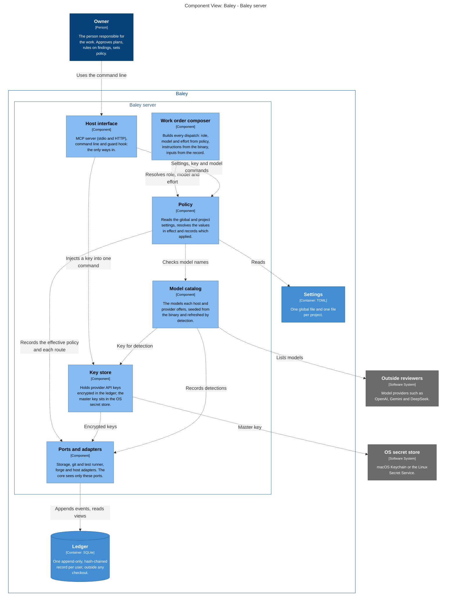
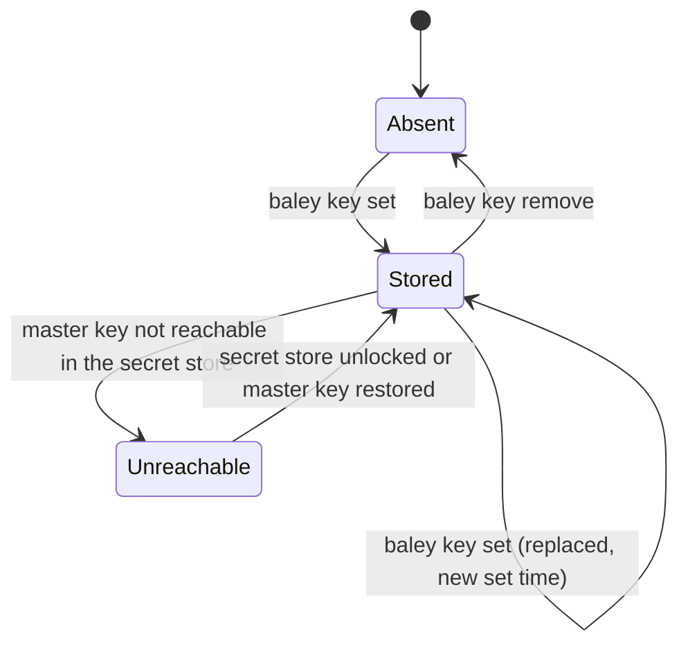
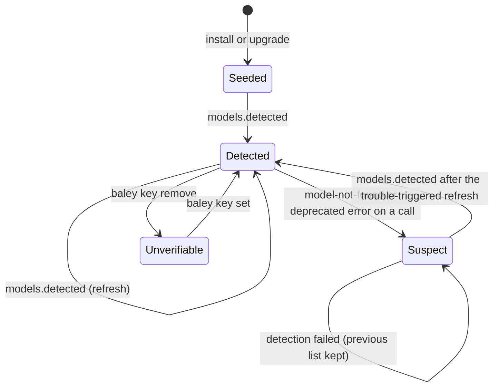
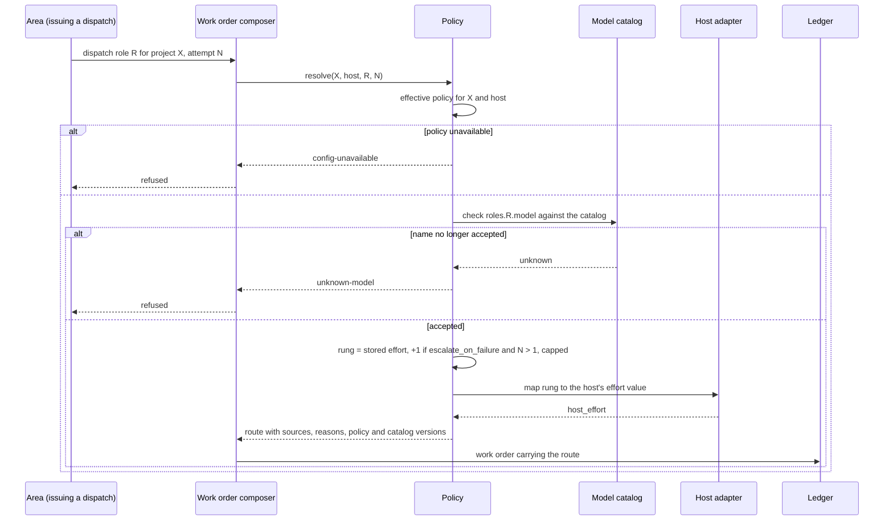
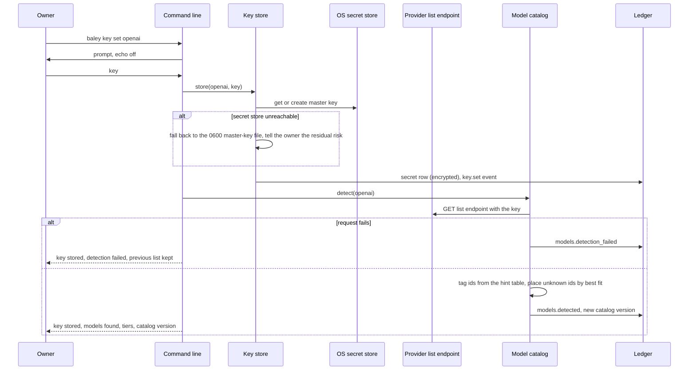
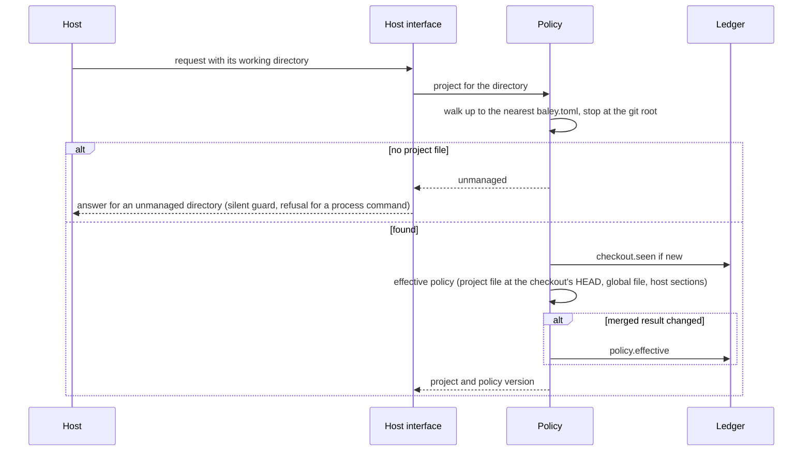

# 0003: Configuration and routing

| | |
|---|---|
| Status | Draft |
| Design issue | none; build issue [#23](https://github.com/crenshawdev/baley/issues/23) |
| Requirement prefix | CFG |
| Applies | [0002: System design](0002-system-design.md) |
| Related | ADRs: [0003](../adr/0003-per-user-database.md), [0004](../adr/0004-project-identity.md), [0009](../adr/0009-served-instructions.md), settings in TOML [TARGET], key store [TARGET] · C4 view: configuration |

The current design of this area, and nothing else. Edit it in place when the design changes; git holds the history. It describes the design only, never the work still to do.

## 1. Purpose and scope

This area decides:

- which settings exist, where each one may be set, and how the layers merge into the policy in effect;
- where the settings files live and how a checkout finds its project;
- how a role's model and effort are resolved for every work order, and what a retry changes;
- which model names Baley accepts for each host and provider, and how that list stays current;
- how provider API keys are stored and reached.

It does not decide the meaning of settings owned by other areas (section 9 lists every setting and its owner), how a work order reaches a host or how effort is delivered there ([0012: Host interface](0012-host-interface.md) [TARGET]), whether a review or a risk gate fires ([0008: Review](0008-review.md), [0009: Risk](0009-risk.md)), or what the guard does with git commands ([0010: Guard](0010-guard.md)).

Hand-offs: the work order composer ([0002](0002-system-design.md) section 8) asks this area for the model and effort of each dispatch; the ledger ([0001](0001-evidence-ledger.md)) stores what this area records; `baley init` ([0001](0001-evidence-ledger.md), EVD-R17, ADR 0004) creates the project file this area reads.

<!-- c4:configuration -->

<!-- /c4:configuration -->

*Figure 1. The parts of the Baley server this area designs: Policy, the Key store and the Model catalog, and what they talk to.*

## 2. Terms

| Term | Meaning |
|---|---|
| Setting | One named value Baley reads, such as `git.on_protected`. A setting has a type, a default and a scope. |
| Layer | One source of settings: the built-in defaults, the global file, or the project file. |
| Host section | A table inside a settings file, `[host.<name>]`, whose values apply only when that host is connected. Host names are those the host adapter recognizes: `claude-code`, `codex`. |
| Scope | Where a setting may be set: `global`, `project`, or `both`. A value in a layer outside its scope is ignored and reported. |
| Effective policy | The result of merging every layer for one project and one host, plus the layer each value came from. |
| Policy version | The identity of one recorded effective policy. Every command records the version it ran under. |
| Role | A kind of worker Baley dispatches: planner, assumptions analyzer, plan checker, executor, verifier, reviewer. |
| Rung | One of Baley's five effort levels, in order: `low`, `medium`, `high`, `xhigh`, `max`. |
| Route | The result of resolving one role for one dispatch: model, rung, the settings that decided them, and whether a retry moved the rung. |
| Model catalog | The list of model names Baley accepts, per host and per provider, with the source each name came from. |
| Host alias | A short model name a host resolves itself, such as `opus` in Claude Code. Aliases follow new model releases without any change on Baley's side. |
| Provider | An outside model vendor reached by API key or its own command-line login: Anthropic, OpenAI, Gemini, DeepSeek. |
| Detection | Asking a provider's list endpoint, with the owner's key, which model names that key can use. |
| Hint table | A table compiled into Baley that tags known model names with a tier (`flagship`, `balanced`, `cheap`) and whether they accept high effort. |
| Key store | The part of Baley that holds provider API keys. |
| Master key | The one random key that encrypts every stored API key. |
| Secret store | The operating system's own store for secrets: Keychain on macOS, the Secret Service (GNOME Keyring, KWallet, over D-Bus) on Linux. |

## 3. Requirements

| Id | Rule | Why | Depends on | Status |
|---|---|---|---|---|
| CFG-R1 | Settings are TOML in two files: one global file per user and one project file per repository; there is no other settings file. | One familiar, reviewable format; nothing else to find or protect. | SYS-R13 | Active |
| CFG-R2 | The global file is `$XDG_CONFIG_HOME/baley/baley.toml` (default `~/.config/baley/baley.toml`) on Linux and `~/Library/Application Support/baley/baley.toml` on macOS; when `BALEY_HOME` is set, the global file is `$BALEY_HOME/baley.toml`. | Each platform's own place; tests and development builds never touch the owner's file. | ADR 0003, SYS-R14 | Active |
| CFG-R3 | The project file is `baley.toml` at the repository root, committed with the code. | Policy travels with the code; every clone and every teammate runs under the same project settings. | ADR 0004 | Active |
| CFG-R4 | Every request names the working directory it is made from; Baley finds the project by walking up from that directory to the nearest `baley.toml`, stopping at the git repository root. The guard uses the same walk. A directory with no project file is unmanaged and Baley stays silent about it. When project files are nested, the nearest one applies and nothing is inherited from the outer one. | One shared server serves many sessions in many projects, so the project is a property of the request, not of the process. | SYS-R1, ADR 0004 | Active |
| CFG-R5 | Each setting has a scope: `global`, `project` or `both`. Branch, forge and repository settings and the test and lint commands are `project`. Roles and the escalation switch are `both`. A value written in a layer outside the setting's scope is ignored and reported as a scope diagnostic; the command line refuses to write it. | Repository facts belong to the repository; per-user choices must not leak into a committed file by mistake. | SYS-R13 | Active |
| CFG-R6 | Layers merge in this order, later winning per setting: built-in defaults, global file, global `[host.<name>]` section, project file, project `[host.<name>]` section. Only the section of the connected host applies. A setting written as `null` resets to the built-in default. | The project overrides the user; a host section refines the file it is in. | CFG-R5 | Active |
| CFG-R7 | Every setting in the schema has a reader in the code; a setting nothing reads is removed from the schema. An unknown name in a file is ignored and reported; the command line refuses to write it. | A setting that changes nothing misleads the owner. | | Active |
| CFG-R8 | Whenever the merged result changes, for any layer, Baley records `policy.effective` with the full merged policy and the layer and file each value came from; every command records the policy version it ran under. | The record says what Baley acted under, not what the files say now. | EVD-R17 | Active |
| CFG-R9 | The effective policy is re-read and re-validated before every command that writes to the ledger. An invalid file (unparseable, wrong type, value outside its grammar) makes the policy unavailable, and every command that needs it is refused with `config-unavailable` naming the file and the fault. | Never act on a torn or half-edited policy. | CFG-R8 | Active |
| CFG-R10 | A dispatch whose routing inputs changed between admission and its run is refused as `routing-inputs-changed`. | A worker must run under the route the owner's policy produced when it was admitted. | CFG-R8, SYS-R6 | Active |
| CFG-R11 | Only Baley's command line and its interview write the settings files. The guard refuses any agent write to either file. Instructions served to models never mention the files. | The owner sets policy; the model never does. | SYS-P11, SYS-R13 | Active |
| CFG-R12 | Six roles are routed: `planner`, `analyzer`, `checker`, `executor`, `verifier`, `reviewer`. Each has `roles.<role>.model` (a model name, default absent) and `roles.<role>.effort` (a rung; defaults: planner, analyzer, executor and verifier `high`, reviewer `medium`, checker `low`). | Every worker Baley dispatches has an owner-set cost. | SYS-P1 | Active |
| CFG-R13 | An absent model means the host session's own model; Baley then passes no model to the host. | The owner's session choice is the default everywhere. | CFG-R12 | Active |
| CFG-R14 | A model name is checked against the model catalog for the host or provider it is written for, at write time; an unknown name is refused by the command line and interview with `unknown-model`, naming the catalog entries that exist. A name is never silently dropped at dispatch. | A misspelled model must fail where the owner can see it. | CFG-R12, CFG-R19 | Active |
| CFG-R15 | The five rungs are Baley's scale. The host adapter maps a rung to what the host accepts, and the mapping used is recorded with the route. | Hosts differ in the effort levels they take. | SYS-P8 | Active |
| CFG-R16 | `escalate_on_failure` (default `false`): when true, a retry of a failed dispatch runs one rung above the stored rung, capped at `max`; a further retry holds there. Baley supplies the attempt number from the ledger. When false, every attempt runs at the stored rung. | A failure earns one step more effort, decided by Baley, never by the model. | CFG-R12 | Active |
| CFG-R17 | Every route records the role, the model, the starting rung, the rung run, the attempt, the setting and layer that supplied the model and the effort, and each reason in plain words. The work order carries the route; nothing else does. | The owner can always see why a worker ran as it did. | SYS-P2, CFG-R8 | Active |
| CFG-R18 | The plan-time risk floor never changes a model or a rung. | Effort is the owner's choice; risk changes the review gate ([0009](0009-risk.md)), not the cost. | | Active |
| CFG-R19 | The model catalog is data in the per-user database, seeded from the binary at install and at every upgrade, never a setting. Host aliases (for Claude Code: `opus`, `sonnet`, `haiku`, `fable`) come from the host adapter's compiled table. Exact model ids are accepted beside aliases. | Aliases track new models by themselves; the owner's choice stays small. | ADR 0003 | Active |
| CFG-R20 | For each provider Baley holds a key for, the catalog is refreshed by detection: Baley calls the provider's list endpoint with that key, records every id returned, tags each id from the hint table, and places an untagged id by best fit (newest first) unless the owner chooses. Detection runs at install, when a key is set, when a project is initialized, when a call fails with a model-not-found or deprecated error, and on `baley models update`. It never runs on a timer. Detection sends no prompt and no project content. | The vendor's list is the truth; Baley's table is a hint. Nothing waits on a Baley release. | CFG-R21, SYS-R9 | Active |
| CFG-R21 | Detection that fails (offline, bad key, rate limit) leaves the previous catalog in place, is recorded as `models.detection_failed`, and never blocks a command. | Setup and dispatch must not depend on a network call. | CFG-R20 | Active |
| CFG-R22 | The owner can add or remove a catalog name by hand (`baley models add`, `baley models remove`); a hand-added name wins over detection and is never removed by it. | A model newer than every list is still usable at once. | CFG-R19 | Active |
| CFG-R23 | Each route and each detection records the catalog version it was checked against. | The record says which list was in force. | CFG-R17, CFG-R20 | Active |
| CFG-R24 | Provider API keys are stored encrypted in a `secret` table in the per-user database. The master key lives in the OS secret store when one is reachable (macOS Keychain; Linux Secret Service); when none is reachable, the master key is a file in the Baley home, mode 0600, and the residual risk (a process running as the owner can read it) is stated to the owner when that fallback is chosen. Baley picks the most secure mechanism the machine offers and records which one is in use. | Keys are Baley's to hold, out of reasonable reach, with the strongest protection the machine has. | SYS-R12, ADR 0003 | Active |
| CFG-R25 | Keys are managed only by `baley key set`, `baley key remove` and `baley key list`. `set` reads the key from the terminal, never from an argument or a file. `list` shows names, set times and the store in use, never a value. No key is ever read from an environment variable or a plain key file. | Keys stay out of shell history, files and transcripts. | SYS-R12 | Active |
| CFG-R26 | The ledger records that a key exists for a provider and when it was set or removed, never the key. Keys never enter backups, exports or any view. | The record is shareable; the keys are not. | EVD-R14, CFG-R24 | Active |
| CFG-R27 | Baley reads a stored key for two uses only: to inject it into one command through `baley exec --key <provider>` (SYS-R11) and to call a provider's list endpoint for detection (CFG-R20). | The fewest places a key can leak from. | SYS-R11, CFG-R20 | Active |
| CFG-R28 | A provider the owner reaches by its own command-line login needs no key in Baley; every command that needs a key says which provider lacks one, and no command forces a key to be set. | No one is forced to hand over a key. | SYS-R10 | Active |
| CFG-R29 | `git.forge_provider` accepts `github`, `gitlab` and `forgejo`; the first release acts on `github` only, and choosing another value is accepted and reported as not yet supported by [0011: Landing](0011-milestones-landing-undo-pause.md) [TARGET]. | All three forges are planned; the setting must not need to change when they arrive. | | Active |

## 4. Roles and actors

| Actor | Receives | Returns | Model and effort from |
|---|---|---|---|
| Owner | Prompts from the settings interview; refusals naming file, setting and fault | Settings values; keys typed at the terminal; catalog additions | Not applicable |
| Baley command line | `baley config`, `baley key`, `baley models` commands | Receipts, facts, refusals | Not applicable |
| Policy (component) | A project, a host name, a role, an attempt | The effective policy; a route | Not applicable |
| Key store (component) | A provider name | An encrypted key decrypted for one use; facts about keys | Not applicable |
| Model catalog (component) | A host or provider name and a model name | Whether the name is accepted; the catalog version | Not applicable |
| Work order composer ([0002](0002-system-design.md) section 8) | A route | A work order carrying it | The route |
| Guard hook ([0010](0010-guard.md)) | A working directory | The project and its effective policy, or "unmanaged" | Not applicable |
| Host adapter ([0012](0012-host-interface.md) [TARGET]) | A rung and a model name | The host's own effort value and model parameter | Not applicable |
| Dispatched workers (the six roles) | A work order | A typed result | `roles.<role>.model`, `roles.<role>.effort`, `escalate_on_failure` |

No worker is dispatched by this area; it supplies the route others dispatch with.

## 5. Commands and operations

All operations of this area are command-line commands run by the owner. Nothing in this area is exposed over MCP: a work order carries the route it needs (CFG-R17), and the model is never told about the settings files (CFG-R11). The one exception is the settings interview, which a project start runs through the host's question mechanism when settings are missing ([0004](0004-starting-a-project-and-changing-scope.md), PRJ-R9); the answers are still written by Baley. Every command names the working directory it runs in, and every command that needs a project resolves it as CFG-R4 says.

### baley config show

- **Inputs:** optional `--host <name>` (default: none, which shows every host section), optional setting names.
- **Outputs:** for each setting: the schema (type, default, scope), the stored global and project values, the effective value, the layer it came from, and every diagnostic (scope, unknown name, invalid value); the paths of both files.
- **Refusals:**

  | Code | When | Requirement |
  |---|---|---|
  | `not-a-project` | The directory has no project file and a project-scoped setting was asked for | CFG-R4 |

### baley config set

- **Inputs:** `--global` or `--project` (required), optional `--host <name>`, one or more `name=value` pairs; `name=null` resets.
- **Outputs:** the settings changed, the file written, and the facts as `config show` returns them; a new `policy.effective` when the merged result changed.
- **Refusals:**

  | Code | When | Requirement |
  |---|---|---|
  | `unknown-setting` | The name is not in the schema | CFG-R7 |
  | `invalid-value` | The value is off type, outside its bounds or enum, or fails its grammar | CFG-R9 |
  | `wrong-layer` | The setting's scope excludes the requested layer | CFG-R5 |
  | `unknown-model` | A `roles.<role>.model` value is not in the catalog for that host or provider | CFG-R14 |
  | `config-conflict` | The file changed between read and write | CFG-R9 |
  | `not-a-project` | `--project` outside a project | CFG-R4 |

### baley config interview

- **Inputs:** `--global` or `--project` (default: global when the global file has no `[roles]` table, otherwise project), optional `--host <name>`.
- **Outputs:** twelve ordered questions, model then effort for each of the six roles, each showing the value in force and the layer it comes from; then `escalate_on_failure`; the answers are written as one `config set`.
- **Refusals:** as `config set`; a declined interview writes nothing.
- **Also run by:** `project start` when the global file or the project's settings are missing ([0004](0004-starting-a-project-and-changing-scope.md), PRJ-R9); the same questions, put to the owner through the host when the start runs from a session.

### baley key set

- **Inputs:** a provider name; the key is read from the terminal with echo off.
- **Outputs:** a receipt naming the provider, the store in use (Keychain, Secret Service or file), and the detection result that follows (CFG-R20).
- **Refusals:**

  | Code | When | Requirement |
  |---|---|---|
  | `unknown-provider` | The name is not a provider Baley knows | CFG-R25 |
  | `key-store-unavailable` | No master key can be created or reached | CFG-R24 |

### baley key remove

- **Inputs:** a provider name.
- **Outputs:** a receipt; the catalog entries detected with that key are marked as no longer verifiable.
- **Refusals:** `no-such-key` when no key is stored for the provider (CFG-R25).

### baley key list

- **Inputs:** none.
- **Outputs:** one row per provider: whether a key is stored, when it was set, the store in use; never a value.
- **Refusals:** none.

### baley exec

- **Inputs:** `--key <provider>`, `--`, the command and its arguments.
- **Outputs:** the command's exit code; its output with every occurrence of the key replaced by `[baley:<provider>-key]`.
- **Refusals:** `no-such-key` (CFG-R27, SYS-R11). The full contract of this command belongs to [0012: Host interface](0012-host-interface.md) [TARGET].

### baley models update

- **Inputs:** optional provider names (default: every provider with a stored key).
- **Outputs:** per provider: ids added, removed and unchanged, the tier each got and from what (hint table, best fit, owner), and the new catalog version; a `models.detected` or `models.detection_failed` event per provider.
- **Refusals:** none; a failed detection is reported, not refused (CFG-R21).

### baley models add, baley models remove

- **Inputs:** a host or provider name and a model name; `add` takes an optional tier.
- **Outputs:** the new catalog version.
- **Refusals:** `unknown-provider` (CFG-R22).

### baley models list

- **Inputs:** optional host or provider name.
- **Outputs:** every accepted name with its source (host alias, seed, detected, owner), tier and the catalog version.
- **Refusals:** none.

### Route resolution (internal)

Called by the work order composer for every dispatch, never by a host.

- **Inputs:** project, host name, role, attempt.
- **Outputs:** a route (section 6).
- **Refusals:**

  | Code | When | Requirement |
  |---|---|---|
  | `config-unavailable` | The effective policy cannot be built | CFG-R9 |
  | `unknown-model` | A stored model name is no longer in the catalog (it was removed by the owner) | CFG-R14 |
  | `routing-inputs-changed` | At the run, the policy version differs from the one at admission | CFG-R10 |

## 6. Records

### The global file (TOML)

| Table | Content |
|---|---|
| top level | `escalate_on_failure`; any `both`-scoped setting |
| `[roles.<role>]` | `model`, `effort` for the six roles |
| `[host.<name>]` and `[host.<name>.roles.<role>]` | The same settings, applied only when that host is connected |
| `[review]`, `[review.providers.
.tiers]`, `[review.triggers.<t>]`, `[review.consult]` | Settings owned by [0008](0008-review.md) and [0009](0009-risk.md) |
| `[memory]`, `[planning]` | Settings owned by [0014](0014-support.md) [TARGET] |

### The project file `baley.toml` (TOML)

| Table | Content |
|---|---|
| `[project]` | `id` (UUID version 4), `name` (ADR 0004) |
| `[git]` | `protected_branches`, `on_protected`, `guard_hard_fail`, `integration_branch`, `auto_branch`, `base_branch`, `forge_provider`, `forge_repo`, `forge_host`, and the landing settings owned by [0011](0011-milestones-landing-undo-pause.md) [TARGET] |
| `[workflow]` | `test_command`, `lint_command`, `skip_discuss` |
| `[roles.<role>]`, `[host.<name>...]`, `[review...]` | Overrides of the global values, same shape as the global file |

### policy.effective (event)

| Field | Type | Meaning |
|---|---|---|
| `project` | project id | The project the policy is for |
| `host` | string | The host name the host sections were taken for |
| `values` | table | Every setting with its effective value |
| `sources` | table | Per setting: the layer (`default`, `global`, `global-host`, `project`, `project-host`) and, for a file layer, the file's path and content digest |
| `diagnostics` | list | Scope, unknown-name and grammar diagnostics found in the files |
| `catalog_version` | integer | The model catalog version the model names were checked against |

The `policy` view holds the latest `policy.effective` per project and host. Its event sequence number is the policy version other records cite.

### route (part of a work order)

| Field | Type | Meaning |
|---|---|---|
| `role` | enum | One of the six roles |
| `model` | string or absent | The model name passed to the host, absent for the session's model |
| `starting_rung`, `rung` | rung | The stored rung and the rung run after escalation |
| `attempt` | integer | The attempt number Baley supplied |
| `escalated` | bool | Whether the rung moved |
| `host_effort` | string | The host's own effort value the adapter mapped the rung to |
| `effort_source`, `model_source` | table | Setting name, layer and file for each |
| `policy_version`, `catalog_version` | integer | The versions in force |
| `reasons` | list of strings | One plain sentence per decision made |

### key (secret table and events)

The `secret` table (per-user database) holds per provider: the provider name, the ciphertext, the nonce, the master-key id and the set time. The table is excluded from backups, exports and every view (CFG-R26).

| Event | Fields |
|---|---|
| `key.set` | provider, set time, store kind (`keychain`, `secret-service`, `file`) |
| `key.removed` | provider, time |

The `keys` view holds, per provider, whether a key is stored, its set time and the store kind.

### model catalog (table and events)

The `model_catalog` table holds per entry: host or provider, name, source (`alias`, `seed`, `detected`, `owner`), tier, high-effort flag, first seen, last verified, and the catalog version that added it.

| Event | Fields |
|---|---|
| `models.detected` | provider, ids added, ids removed, catalog version, hint-table version |
| `models.detection_failed` | provider, reason, catalog version left in place |
| `models.owner_changed` | host or provider, name, added or removed, catalog version |

## 7. States

*Figure 2. States of a provider key. Unreachable keys make `baley exec --key` and detection refuse with `key-store-unavailable`; nothing is deleted.*

*Figure 3. States of one provider's catalog entries. Host aliases and owner entries have no lifecycle: they are present until the binary or the owner changes them.*

## 8. Workflows

```mermaid
sequenceDiagram
  participant O as Owner
  participant C as Command line
  participant P as Policy
  participant L as Ledger
  O->>C: baley config set --project git.on_protected=refuse
  C->>P: validate (schema, scope, grammar, catalog)
  alt invalid
    P-->>C: unknown-setting / invalid-value / wrong-layer / unknown-model
    C-->>O: refusal naming the setting and the fault
  else valid
    P->>P: re-read the file, compare digest
    alt file changed since read
      P-->>C: config-conflict
      C-->>O: refusal, retry
    else unchanged
      P->>P: write the file
      P->>L: policy.effective (merged values, sources, diagnostics)
      L-->>P: policy version
      P-->>C: receipt and facts
      C-->>O: what changed, which file, the policy version
    end
  end
```

*Figure 4. Writing a setting.*

*Figure 5. Resolving a route for a dispatch.*

*Figure 6. Setting a key and detecting the provider's models.*

*Figure 7. Finding the project and its policy on a request.*

## 9. Settings

Every setting Baley reads, with the area that owns its meaning. This area owns the first group; for the rest, this table is the registry and the owner's document is the design.

| Setting | Type | Default | Scope | Owner | Effect |
|---|---|---|---|---|---|
| `roles.<role>.model` | model name or absent | absent | both | 0003 | The model passed to the host for that role; absent means the session's model (CFG-R13) |
| `roles.<role>.effort` | rung | planner, analyzer, executor, verifier `high`; reviewer `medium`; checker `low` | both | 0003 | The starting rung for that role (CFG-R12) |
| `escalate_on_failure` | bool | `false` | both | 0003 | One rung up on a retry (CFG-R16) |
| `git.protected_branches` | list of branch names | `["main", "master"]` | project | [0010](0010-guard.md) | Branches the guard protects |
| `git.on_protected` | `ask`, `refuse`, `allow` | `ask` | project | [0010](0010-guard.md) | What the guard does with a commit on a protected branch |
| `git.guard_hard_fail` | bool | `false` | project | [0010](0010-guard.md) | Whether a guard that cannot decide refuses instead of passing loudly |
| `git.integration_branch` | `milestone`, `trunk` | `milestone` | project | 0011 [TARGET] | Where task work is integrated |
| `git.auto_branch` | `ask`, `auto`, `off` | `ask` | project | 0011 [TARGET] | Whether Baley creates the working branch |
| `git.base_branch` | branch name or absent | absent | project | 0011 [TARGET] | The branch work starts from |
| `git.create_tag` | bool | `true` | project | 0011 [TARGET] | Whether a release creates a tag |
| `git.on_land_cleanup` | bool | `true` | project | 0011 [TARGET] | Whether landing deletes the merged branch |
| `git.issue_check` | bool | `true` | project | 0011 [TARGET] | Whether landing checks the linked issue |
| `git.forge_provider` | `github`, `gitlab`, `forgejo` | absent | project | 0011 [TARGET] | Which forge the project uses (CFG-R29) |
| `git.forge_repo` | `owner/repo` | absent | project | 0011 [TARGET] | The repository on the forge |
| `git.forge_host` | host name, optional port | absent | project | 0011 [TARGET] | The forge's host for self-hosted forges |
| `workflow.test_command` | command line | absent | project | [0006](0006-execution.md) | The suite Baley runs (SYS-R8) |
| `workflow.lint_command` | command line | absent | project | [0006](0006-execution.md) | The lint Baley runs |
| `workflow.skip_discuss` | bool | `false` | project | 0013 [TARGET] | Whether next-action skips the discussion step |
| `planning.sprint_capacity` | integer, min 1, or absent | absent | both | [0005](0005-context-plans-and-acceptance.md) | The ceiling on a sprint's size in tasks (PLN-R9) |
| `planning.max_capture_bullets` | integer, min 1 | 40 | both | 0014 [TARGET] | Report-only bound on active captured items |
| `memory.backend` | `none`, `builtin` | `builtin` | both | 0014 [TARGET] | Whether recall is on |
| `review.reviewers` | list of `host`, `openai`, `gemini`, `deepseek` | `["host"]` | both | [0008](0008-review.md) | Which reviewers run on every triggered review |
| `review.request_timeout_ms` | integer, 1 to 600000 | 540000 | both | [0008](0008-review.md) | Timeout of one outside review call |
| `review.max_prompt_tokens` | integer, min 1 | 120000 | both | [0008](0008-review.md) | Bound on review prompt size |
| `review.providers.
.tiers.<flagship,balanced,cheap>` | model name | absent | both | [0008](0008-review.md) | The model each tier maps to per provider; checked against the catalog (CFG-R14) |
| `review.triggers.<plan,diff,risk_surface>.gate` | `off`, `advisory`, `deferred`, `blocking`, `adjudicated` | plan `advisory`, diff `off`, risk_surface `blocking` | both | [0008](0008-review.md) | How strictly each trigger's review holds work; the plan gate is also the plan checker's switch ([0005](0005-context-plans-and-acceptance.md), PLN-R16) |
| `review.triggers.<t>.tier` | `flagship`, `balanced`, `cheap` | `cheap` | both | [0008](0008-review.md) | Which provider tier reviews |
| `review.triggers.<t>.effort` | `minimal`, `low`, `medium`, `high` | plan `low`, diff `minimal`, risk_surface `low` | both | [0008](0008-review.md) | The effort of a provider review |
| `review.triggers.risk_surface.surfaces` | list of `auth`, `migrations`, `billing`, `concurrency`, `destructive`, `secrets`, `api_contract`, `untrusted_input` | absent | project | [0009](0009-risk.md) | Which risk surfaces the project declares |
| `review.triggers.risk_surface.waive_routing_floor` | same list | absent | project | [0009](0009-risk.md) | Surfaces whose floor the owner waives |
| `review.consult.enabled`, `.tier`, `.effort`, `.attempt_threshold` | bool; tier; effort; integer min 1 | `false`; `flagship`; `high`; 3 | both | 0014 [TARGET] | The consult call in debug after repeated failures |

Settings removed from the schema because nothing reads them (CFG-R7), plus `review.mode` (every reviewer runs, [0008](0008-review.md)): `granularity`, `workflow.research`, `workflow.plan_check`, `workflow.verifier`, `workflow.inline_plan_threshold`, `workflow.max_plan_tasks`, `workflow.max_plan_bytes`, `planning.commit_docs`, `review.key_file`, `review.decision_review.tier`, `review.decision_review.effort`. Sprint capacity is designed in [0005](0005-context-plans-and-acceptance.md) (PLN-R9), not as free numbers here.

## 10. Instructions served

Not applicable. This area serves no instructions: the model is never told about settings, keys or the catalog (CFG-R11). The route reaches a worker inside its work order, composed by [0002](0002-system-design.md) section 8 and delivered as [0012](0012-host-interface.md) [TARGET] specifies.

## 11. Build status

The code today is the Cadence engine crate awaiting rename. It reads JSON files under `.planning/` and `~/.claude/cadence/`, which this design replaces.

| Requirement | Status | Where |
|---|---|---|
| CFG-R1, CFG-R2, CFG-R3 | Not built | JSON layers at `crates/cadence/src/config/write.rs:19-24` and `crates/cadence/src/server.rs:222-228` |
| CFG-R4 | Partly built | Bash guard walks up to `.planning` (`crates/cadence/src/guard/bash.rs:27-44`); the server binds one project per process (`crates/cadence/src/server.rs:730-737`); Write/Edit guard does not walk (`crates/cadence/src/guard/mod.rs:323-334`) |
| CFG-R5 | Partly built | `GLOBAL_ONLY` and `repo_only` flags (`crates/cadence/src/config/mod.rs:14-18`, `crates/cadence/src/config/merge.rs:59-87`); scopes differ from this design |
| CFG-R6 | Partly built | defaults, global, repo merge (`crates/cadence/src/config/merge.rs:35-49`); no host sections |
| CFG-R7 | Partly built | unknown keys dropped with a diagnostic (`crates/cadence/src/config/merge.rs:93-129`); eleven keys without readers still in `crates/cadence/src/config/schema.json` |
| CFG-R8 | Not built | routes persist config inputs only (`crates/cadence/src/config/reload.rs:147-161`) |
| CFG-R9 | Built | `crates/cadence/src/config/reload.rs:280-292`, `crates/cadence/src/session/mod.rs:474-485` |
| CFG-R10 | Built | `crates/cadence/src/config/reload.rs:190-201`, `crates/cadence/src/execution/boundary.rs:149` |
| CFG-R11 | Partly built | guard denies both config paths (`crates/cadence/src/guard/mod.rs:186-207`); the MCP `config-apply` and interview operations still exist (`crates/cadence/src/config_service.rs:19-31`) |
| CFG-R12, CFG-R13 | Built | `crates/cadence/src/config/roles.rs:7-14, 106-116`, defaults in `crates/cadence/src/config/schema.json` |
| CFG-R14 | Not built | unsupported names are dropped with a warning at dispatch (`crates/cadence/src/config/roles.rs:122-132`) |
| CFG-R15 | Partly built | rungs exist (`crates/cadence/src/config/roles.rs:15`); the map to a host is the 30 agent names (`crates/cadence/src/config/roles.rs:17-60`), no per-host mapping |
| CFG-R16 | Partly built | resolution at `crates/cadence/src/config/roles.rs:117-121`; every caller passes attempt `None` (#69) |
| CFG-R17 | Partly built | reasons and sources in `crates/cadence/src/config/roles.rs:133-170`; no policy or catalog version |
| CFG-R18 | Built | `crates/cadence/src/config/policy.rs:108-129` |
| CFG-R19 to CFG-R23 | Not built | fixed list at `crates/cadence/src/config/roles.rs:16` |
| CFG-R24 to CFG-R27 | Not built | keys read from env and a key file (`crates/cadence/src/review/provider/credentials.rs:48-97`) |
| CFG-R28 | Built | provider reviewers are optional (`crates/cadence/src/config/policy.rs:78-93`) |
| CFG-R29 | Partly built | enum in `crates/cadence/src/config/schema.json`; no not-yet-supported report |

## 12. Open questions

| Question | Decided by |
|---|---|
| The exact host names and their compiled alias tables, and how the launcher passes the host's identity to the shared server | [0012: Host interface](0012-host-interface.md) [TARGET] |
| The tier hint table's contents for each provider at first release | The owner, when the model catalog is built |
