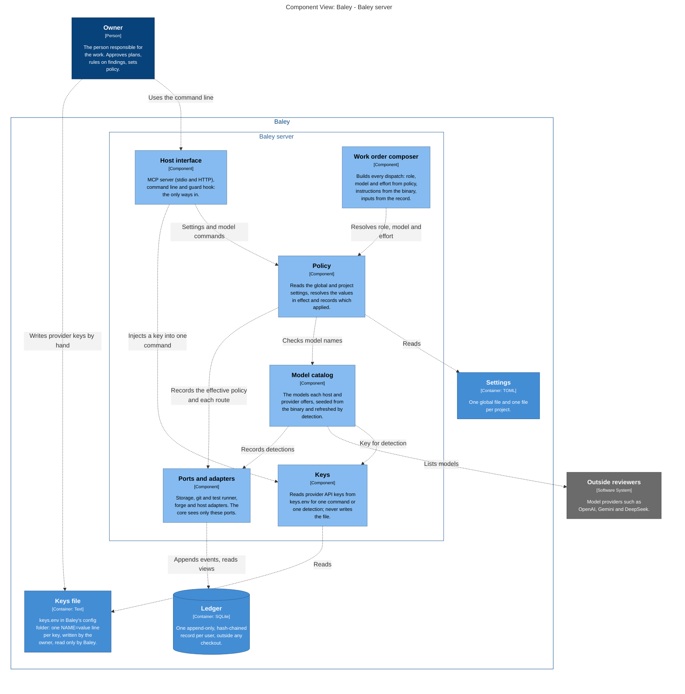
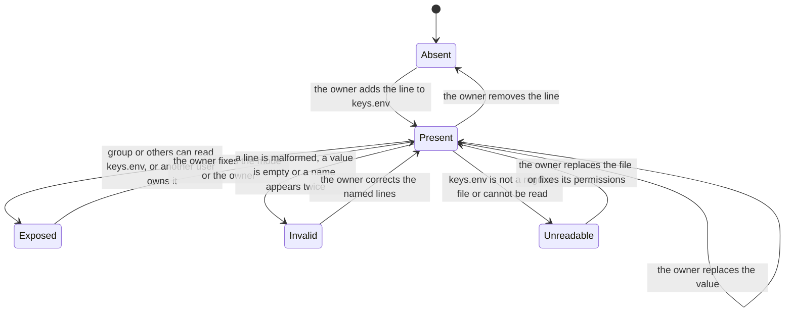
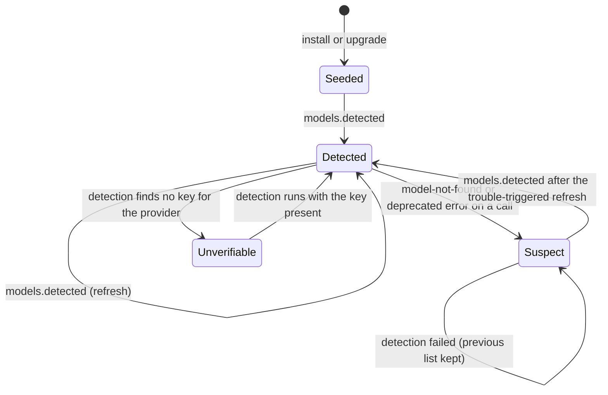
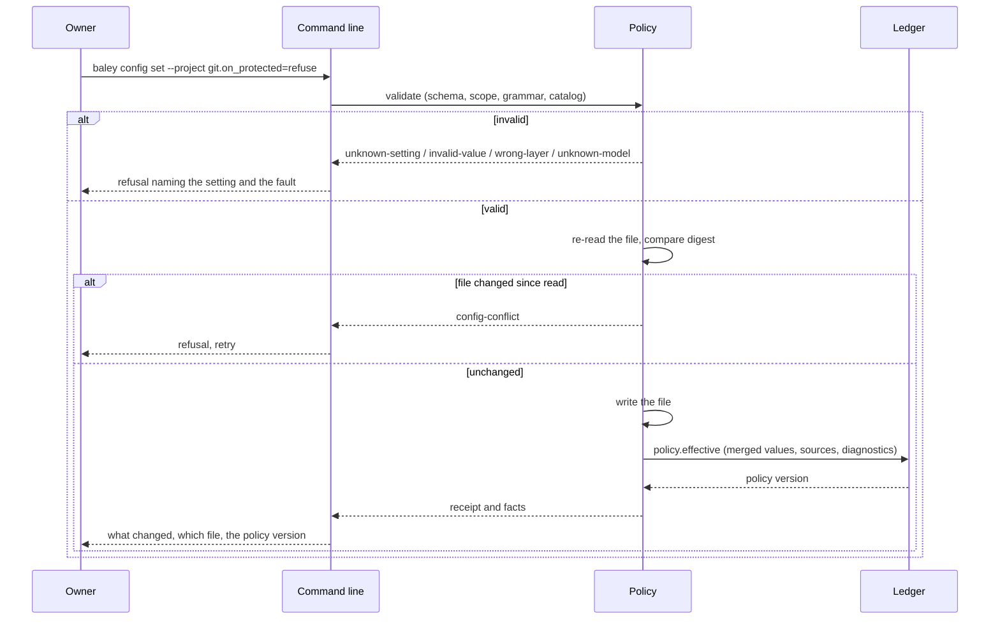
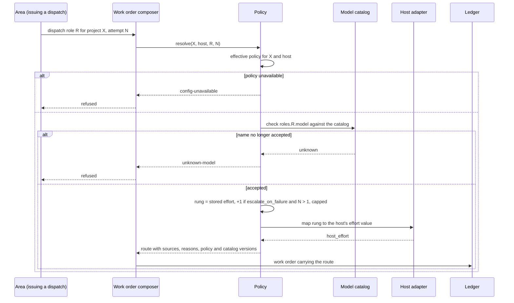
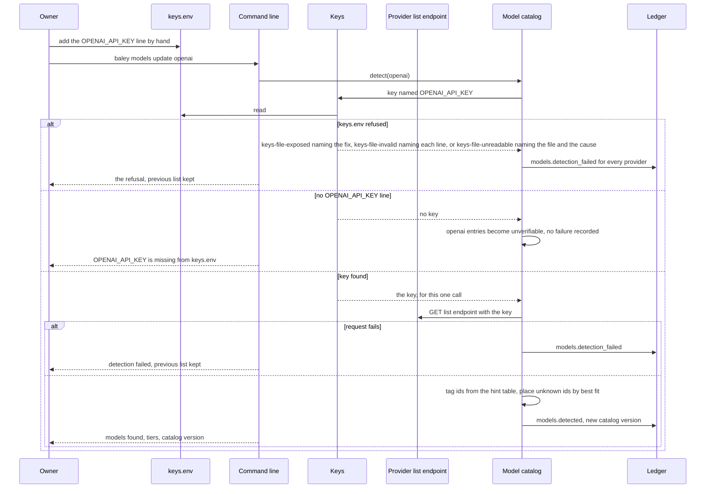
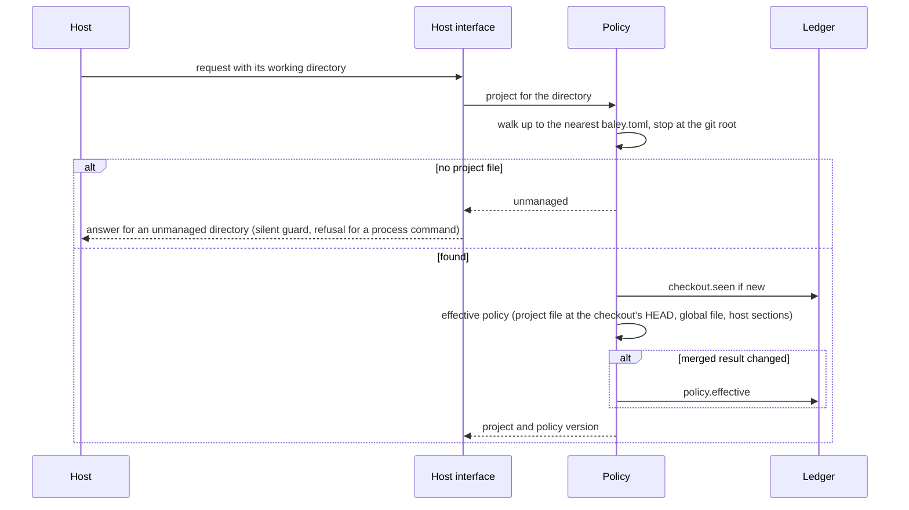

# 0003: Configuration and routing

| | |
|---|---|
| Status | Accepted |
| Design issue | none; build issue [#23](https://github.com/crenshawdev/baley/issues/23) |
| Requirement prefix | CFG |
| Applies | [0002: System design](0002-system-design.md) |
| Related | ADRs: [0003](../adr/0003-per-user-database.md), [0004](../adr/0004-project-identity.md), [0009](../adr/0009-served-instructions.md), [0015](../adr/0015-settings-in-toml.md), [0016](../adr/0016-key-store.md), [0027](../adr/0027-vendor-folders-and-plain-keys.md), [0028](../adr/0028-one-http-stack.md) · C4 view: configuration |

The current design of this area, and nothing else. Edit it in place when the design changes; git holds the history. It describes the design only, never the work still to do.

## 1. Purpose and scope

This area decides:

- which settings exist, where each one may be set, and how the layers merge into the policy in effect;
- where the settings files live and how a checkout finds its project;
- how a role's model and effort are resolved for every work order, and what a retry changes;
- which model names Baley accepts for each host and provider, and how that list stays current;
- where provider API keys are read from and how they reach a call.

It does not decide the meaning of settings owned by other areas (section 9 lists every setting and its owner), how a work order reaches a host or how effort is delivered there ([0012: Host interface](0012-host-interface.md)), whether a review or a risk gate fires ([0008: Review](0008-review.md), [0009: Risk](0009-risk.md)), or what the guard does with git commands ([0010: Guard](0010-guard.md)).

Hand-offs: the work order composer ([0002](0002-system-design.md) section 8) asks this area for the model and effort of each dispatch; the ledger ([0001](0001-evidence-ledger.md)) stores what this area records; `baley init` ([0001](0001-evidence-ledger.md), EVD-R17, ADR 0004) creates the project file this area reads.

<!-- c4:configuration -->

```mermaid
graph LR
  linkStyle default fill:none

  subgraph diagram ["Component View: Baley - Baley server"]
    style diagram fill:none,stroke:none

    1["<div style='font-weight: bold'>Owner</div><div style='font-size: 70%; margin-top: 0px'>[Person]</div><div style='font-size: 80%; margin-top:10px'>The person responsible for<br />the work. Approves plans,<br />rules on findings, sets<br />policy.</div>"]
    style 1 fill:#08427b,stroke:#052e56,color:#ffffff

    18["<div style='font-weight: bold'>Outside reviewers</div><div style='font-size: 70%; margin-top: 0px'>[Software System]</div><div style='font-size: 80%; margin-top:10px'>Model providers such as<br />OpenAI, Gemini and DeepSeek.</div>"]
    style 18 fill:#6b6b6b,stroke:#4d4d4d,color:#ffffff

    subgraph 2 ["Baley"]
      style 2 fill:none,stroke:#0b4884,color:#0b4884

      subgraph 3 ["Baley server"]
        style 3 fill:none,stroke:#2e6295,color:#2e6295

        10["<div style='font-weight: bold'>Model catalog</div><div style='font-size: 70%; margin-top: 0px'>[Component]</div><div style='font-size: 80%; margin-top:10px'>The models each host and<br />provider offers, seeded from<br />the binary and refreshed by<br />detection.</div>"]
        style 10 fill:#85bbf0,stroke:#5d82a8,color:#000000
        11["<div style='font-weight: bold'>Ports and adapters</div><div style='font-size: 70%; margin-top: 0px'>[Component]</div><div style='font-size: 80%; margin-top:10px'>Storage, git and test runner,<br />forge and host adapters. The<br />core sees only these ports.</div>"]
        style 11 fill:#85bbf0,stroke:#5d82a8,color:#000000
        4["<div style='font-weight: bold'>Host interface</div><div style='font-size: 70%; margin-top: 0px'>[Component]</div><div style='font-size: 80%; margin-top:10px'>MCP server (stdio and HTTP),<br />command line and guard hook:<br />the only ways in.</div>"]
        style 4 fill:#85bbf0,stroke:#5d82a8,color:#000000
        7["<div style='font-weight: bold'>Work order composer</div><div style='font-size: 70%; margin-top: 0px'>[Component]</div><div style='font-size: 80%; margin-top:10px'>Builds every dispatch: role,<br />model and effort from policy,<br />instructions from the binary,<br />inputs from the record.</div>"]
        style 7 fill:#85bbf0,stroke:#5d82a8,color:#000000
        8["<div style='font-weight: bold'>Policy</div><div style='font-size: 70%; margin-top: 0px'>[Component]</div><div style='font-size: 80%; margin-top:10px'>Reads the global and project<br />settings, resolves the values<br />in effect and records which<br />applied.</div>"]
        style 8 fill:#85bbf0,stroke:#5d82a8,color:#000000
        9["<div style='font-weight: bold'>Keys</div><div style='font-size: 70%; margin-top: 0px'>[Component]</div><div style='font-size: 80%; margin-top:10px'>Reads provider API keys from<br />keys.env for one command or<br />one detection; never writes<br />the file.</div>"]
        style 9 fill:#85bbf0,stroke:#5d82a8,color:#000000
      end

      12[("<div style='font-weight: bold'>Ledger</div><div style='font-size: 70%; margin-top: 0px'>[Container: SQLite]</div><div style='font-size: 80%; margin-top:10px'>One append-only, hash-chained<br />record per user, outside any<br />checkout.</div>")]
      style 12 fill:#438dd5,stroke:#2e6295,color:#ffffff
      13["<div style='font-weight: bold'>Settings</div><div style='font-size: 70%; margin-top: 0px'>[Container: TOML]</div><div style='font-size: 80%; margin-top:10px'>One global file and one file<br />per project.</div>"]
      style 13 fill:#438dd5,stroke:#2e6295,color:#ffffff
      14["<div style='font-weight: bold'>Keys file</div><div style='font-size: 70%; margin-top: 0px'>[Container: Text]</div><div style='font-size: 80%; margin-top:10px'>keys.env in Baley's config<br />folder: one NAME=value line<br />per key, written by the<br />owner, read only by Baley.</div>"]
      style 14 fill:#438dd5,stroke:#2e6295,color:#ffffff
    end

    1-. "<div>Uses the command line</div><div style='font-size: 70%'></div>" .->4
    1-. "<div>Writes provider keys by hand</div><div style='font-size: 70%'></div>" .->14
    7-. "<div>Resolves role, model and<br />effort</div><div style='font-size: 70%'></div>" .->8
    8-. "<div>Reads</div><div style='font-size: 70%'></div>" .->13
    8-. "<div>Checks model names</div><div style='font-size: 70%'></div>" .->10
    8-. "<div>Records the effective policy<br />and each route</div><div style='font-size: 70%'></div>" .->11
    4-. "<div>Settings and model commands</div><div style='font-size: 70%'></div>" .->8
    4-. "<div>Injects a key into one<br />command</div><div style='font-size: 70%'></div>" .->9
    9-. "<div>Reads</div><div style='font-size: 70%'></div>" .->14
    10-. "<div>Key for detection</div><div style='font-size: 70%'></div>" .->9
    10-. "<div>Lists models</div><div style='font-size: 70%'></div>" .->18
    10-. "<div>Records detections</div><div style='font-size: 70%'></div>" .->11
    11-. "<div>Appends events, reads views</div><div style='font-size: 70%'></div>" .->12

  end
```
<!-- /c4:configuration -->

*Figure 1. The parts of the Baley server this area designs: Policy, Keys and the Model catalog, and what they talk to.*

## 2. Terms

| Term | Meaning |
|---|---|
| Setting | One named value Baley reads, such as `git.on_protected`. A setting has a type, a default and a scope. |
| Layer | One source of settings: the built-in defaults, the global file, its host section, the project file, or its host section. |
| Host section | A table inside a settings file, `[host.<name>]`, whose values apply only when that host is connected. Host names are those the host adapter recognizes: `claude-code`, `codex`. |
| Scope | Where a setting may be set: `global`, `project`, or `both`. A value in a layer outside its scope is ignored and reported. |
| Effective policy | The result of merging every layer for one project and one host, plus the layer each value came from. |
| Policy version | The identity of one recorded effective policy. Every command records the version it ran under. |
| Role | A kind of worker Baley dispatches: planner, analyzer (the refinement role that asks the owner questions and drafts truths), plan checker, executor, verifier, reviewer. |
| Rung | One of Baley's five effort levels, in order: `low`, `medium`, `high`, `xhigh`, `max`. |
| Route | The result of resolving one role for one dispatch: model, rung, the settings that decided them, and whether a retry moved the rung. |
| Model catalog | The list of model names Baley accepts, per host and per provider, with the source each name came from. |
| Host alias | A short model name a host resolves itself, such as `opus` in Claude Code. Aliases follow new model releases without any change on Baley's side. |
| Provider | An outside model vendor reached by API key or its own command-line login: Anthropic, OpenAI, Gemini, DeepSeek. |
| Detection | Asking a provider's list endpoint, with the owner's key, which model names that key can use. |
| Hint table | A table compiled into Baley that tags known model names with a tier (`flagship`, `balanced`, `cheap`) and whether they accept high effort. |
| Config folder | Baley's own folder under the crenshawdev vendor folder: `$XDG_CONFIG_HOME/crenshawdev/baley` on Linux (an empty or relative `XDG_CONFIG_HOME` counts as unset), `~/Library/Application Support/crenshawdev/baley` on macOS, or `BALEY_HOME` when it is set. It holds the global file and the keys file. |
| Keys file | `keys.env` in the config folder: one `NAME=value` line per provider API key, written by the owner by hand and only read by Baley. |
| Key name | The name on the left of a line in the keys file, such as `OPENAI_API_KEY`. |
| Keys | The part of Baley that reads a key from the keys file for one use. |

## 3. Requirements

| Id | Rule | Why | Depends on | Status |
|---|---|---|---|---|
| CFG-R1 | Settings are TOML in two files: one global file per user and one project file per repository; there is no other settings file. | One familiar, reviewable format for every setting; no other file holds settings. | SYS-R13 | Active |
| CFG-R2 | The global file is `config.toml` in Baley's config folder: `$XDG_CONFIG_HOME/crenshawdev/baley/config.toml` (default `~/.config/crenshawdev/baley/config.toml`) on Linux and `~/Library/Application Support/crenshawdev/baley/config.toml` on macOS; when `BALEY_HOME` is set, the global file is `$BALEY_HOME/config.toml`. An empty or relative `XDG_CONFIG_HOME` is treated as unset. Each crenshawdev application has its own folder under the vendor folder, and nothing is shared at the vendor level. | Each platform's own place, grouped under one vendor folder; tests and development builds never touch the owner's file. | ADR 0003, ADR 0027, SYS-R14 | Active |
| CFG-R3 | The project file is `baley.toml` at the repository root, committed with the code. | Policy travels with the code; every clone and every teammate runs under the same project settings. | ADR 0004 | Active |
| CFG-R4 | Every request names the working directory it is made from; Baley finds the project by walking up from that directory to the nearest `baley.toml`, stopping at the git repository root. The guard uses the same walk. A directory with no project file is unmanaged and Baley stays silent about it. When project files are nested, the nearest one applies and nothing is inherited from the outer one. | One shared server serves many sessions in many projects, so the project is a property of the request, not of the process. | SYS-R1, ADR 0004 | Active |
| CFG-R5 | Each setting has a scope: `global`, `project` or `both`. Branch, forge and repository settings and the test and lint commands are `project`. Roles and the escalation switch are `both`. A value written in a layer outside the setting's scope is ignored and reported as a scope diagnostic; the command line refuses to write it. | Repository facts belong to the repository; per-user choices must not leak into a committed file by mistake. | SYS-R13 | Active |
| CFG-R6 | Layers merge in this order, later winning per setting: built-in defaults, global file, global `[host.<name>]` section, project file, project `[host.<name>]` section. Only the section of the connected host applies. | The project overrides the user; a host section refines the file it is in. | CFG-R5 | Active |
| CFG-R7 | Every setting in the schema has a reader in the code; a setting nothing reads is removed from the schema. An unknown name in a file is ignored and reported; the command line refuses to write it. | A setting that changes nothing misleads the owner. | | Active |
| CFG-R8 | Whenever the merged result changes, for any layer, Baley records `policy.effective` with the full merged policy and the layer and file each value came from; every command records the policy version it ran under. | The record says what Baley acted under, not what the files say now. | EVD-R17 | Active |
| CFG-R9 | The effective policy is re-read and re-validated before every command that writes to the ledger. An invalid file (unparseable, wrong type, value outside its grammar) makes the policy unavailable, and every command that needs it is refused with `config-unavailable` naming the file and the fault and, for a parse, type or grammar fault, its line and column. A missing file is an empty layer; a file that exists but is not a regular file or cannot be read makes the policy unavailable in the same way, naming the file and the cause. | Never act on a torn or half-edited policy. | CFG-R8 | Active |
| CFG-R10 | A dispatch whose routing inputs changed between admission and its run is refused as `routing-inputs-changed`. | A worker must run under the route the owner's policy produced when it was admitted. | CFG-R8, SYS-R6 | Active |
| CFG-R11 | Only Baley's command line and its interview write the settings files. The host sandbox and the guard refuse any agent write to Baley's config folder (the global file and the keys file) and to the project file. Instructions served to models never mention the files. | The owner sets policy; the model never does. | SYS-P11, SYS-R13 | Active |
| CFG-R12 | Six roles are routed: `planner`, `analyzer`, `checker`, `executor`, `verifier`, `reviewer`. Each has `roles.<role>.model` (a model name, default absent) and `roles.<role>.effort` (a rung; defaults: planner, analyzer, executor and verifier `high`, reviewer `medium`, checker `low`). | Every worker Baley dispatches has an owner-set cost. | SYS-P1 | Active |
| CFG-R13 | An absent model means the host session's own model; Baley then passes no model to the host. | The owner's session choice is the default everywhere. | CFG-R12 | Active |
| CFG-R14 | A model name is checked against the model catalog for the host or provider it is written for, at write time; an unknown name is refused by the command line and interview with `unknown-model`, naming the catalog entries that exist. A name is never silently dropped at dispatch. | A misspelled model must fail where the owner can see it. | CFG-R12, CFG-R19 | Active |
| CFG-R15 | The five rungs are Baley's scale. The host adapter maps a rung to what the host accepts, and the mapping used is recorded with the route. | Hosts differ in the effort levels they take. | SYS-P8 | Active |
| CFG-R16 | `escalate_on_failure` (default `false`): when true, a retry of a failed dispatch runs one rung above the stored rung, capped at `max`; a further retry holds there. Baley supplies the attempt number from the ledger. When false, every attempt runs at the stored rung. | A failure earns one step more effort, decided by Baley, never by the model. | CFG-R12 | Active |
| CFG-R17 | Every route records the role, the model, the starting rung, the rung run, the attempt, the setting and layer that supplied the model and the effort, and each reason in plain words. The work order carries the route; nothing else does. | The owner can always see why a worker ran as it did. | SYS-P2, CFG-R8 | Active |
| CFG-R18 | The plan-time risk floor never changes a model or a rung. | Effort is the owner's choice; risk changes the review gate ([0009](0009-risk.md)), not the cost. | | Active |
| CFG-R19 | The model catalog is data in the per-user database, seeded from the binary at install and at every upgrade, never a setting. Host aliases (for Claude Code: `opus`, `sonnet`, `haiku`, `fable`) come from the host adapter's compiled table. Exact model ids are accepted beside aliases. | Aliases track new models by themselves; the owner's choice stays small. | ADR 0003 | Active |
| CFG-R20 | For each provider whose key is in the keys file, the catalog is refreshed by detection: Baley calls the provider's list endpoint with that key, records every id returned, tags each id from the hint table, and places an untagged id by best fit (newest first) unless the owner chooses. Baley finds a provider's key by a small compiled table of key names: `OPENAI_API_KEY` for OpenAI, `GEMINI_API_KEY` for Gemini, `DEEPSEEK_API_KEY` for DeepSeek. Detection runs at install, at `baley init`, when a call fails with a model-not-found or deprecated-model error, and on `baley models update`. It never runs on a timer. Detection sends no prompt and no project content. | The vendor's list is the truth; Baley's table is a hint. Nothing waits on a Baley release. | CFG-R21, SYS-R9 | Active |
| CFG-R21 | Detection that fails (offline, bad key, rate limit, or a keys file Baley refuses) leaves the previous catalog in place, is recorded as `models.detection_failed`, and never blocks a command. A refused keys file records the failure for every provider. A provider with no key in the keys file is not detected and is not recorded as a failure; its detected catalog entries become unverifiable (Figure 3). An automatic trigger skips it quietly; when the owner names it in `baley models update`, Baley says which key name is missing from the keys file (CFG-R28). | Setup and dispatch must not depend on a network call. | CFG-R20 | Active |
| CFG-R22 | The owner can add or remove a catalog name by hand (`baley models add`, `baley models remove`); a hand-added name wins over detection and is never removed by it. | A model newer than every list is still usable at once. | CFG-R19 | Active |
| CFG-R23 | Each route and each detection records the catalog version it was checked against. | The record says which list was in force. | CFG-R17, CFG-R20 | Active |
| CFG-R24 | Provider API keys are plain `NAME=value` lines in one file, `keys.env`, in Baley's config folder beside `config.toml` (`$BALEY_HOME/keys.env` when `BALEY_HOME` is set). A missing file means no keys. A line is blank, a comment whose first byte is `#`, or `NAME=value` with an optional `export ` prefix. A name is `[A-Za-z_][A-Za-z0-9_]*` followed directly by `=`. Trailing spaces, tabs and carriage returns are removed. An unquoted value runs to the end of the line and holds no space or tab, since a shell reads such a line differently. A quoted value is everything between matching single or double quotes that end the line, with no escapes. A value, quoted or not, holds no control byte (`0x00` to `0x1F`, or `0x7F`) except a tab inside quotes; refusal catches a stray carriage return from a paste instead of sending a wrong key. Baley refuses the file with `keys-file-exposed` when a group or other read bit is set (`mode & 0o044`), naming the file and the `chmod 600` fix, or another user owns it, naming the numeric `chown` fix; both faults are named when both hold, owner first. Other mode bits are not judged. A fix named in a refusal tells the owner what to do: Baley never runs it, never checks that it works in the owner's shell, and never creates, changes or repairs the file. `keys-file-invalid` refuses a repeated name, an empty value or any other invalid line, including non-UTF-8 outside a comment, a byte-order mark on line 1, unquoted space or tab, and a forbidden control character. Every faulty line is named by number, never its text. `keys-file-unreadable` refuses a path that is not a regular file or cannot be read, naming the file and the cause. Any of these three refusals makes `baley exec` refuse and detection record `models.detection_failed` for every provider. A symbolic link to the file is followed. This check does not check the folder; where the folder is Baley's home (on macOS, or when `BALEY_HOME` is set), the home's own open checks apply when a command opens the ledger; `baley exec` opens none ([0001](0001-evidence-ledger.md), EVD-R22). Keys are not encrypted; there is no master key and no OS secret store. Stated limit: an agent under a host whose sandbox allows reads (Codex) can read the file, as it can any file the owner's user can read; that is the operating-system user boundary, not Baley's to close. | The file's mode protects the keys the way it protects any key the owner keeps in a file; nothing Baley added would protect them better from a process running as the owner. | SYS-R12, ADR 0027 | Active |
| CFG-R25 | Baley only reads the keys file and never writes it; the owner edits it by hand. Baley has no command that sets, removes or lists keys. Keys come only from that file, never from an environment variable. | The owner holds the keys; Baley has no second copy to keep in step. | SYS-R12 | Active |
| CFG-R26 | The ledger may record that a key was used and how (for example a review by OpenAI through its API with `OPENAI_API_KEY`), never the key's value. Keys never enter the ledger, exports or any view. | The record is shareable; the keys are not. | EVD-R14, CFG-R24 | Active |
| CFG-R27 | Baley reads a key from the keys file for two uses only: to inject it into one command through `baley exec --key <NAME>` (SYS-R11) and to call a provider's list endpoint for detection (CFG-R20). | The fewest places a key can leak from. | SYS-R11, CFG-R20 | Active |
| CFG-R28 | A provider the owner reaches by its own command-line login needs no line in the keys file; every command that needs a key names the key missing from the file, and no command forces the owner to add one. | No one is forced to hand over a key. | SYS-R10 | Active |
| CFG-R29 | `git.forge_provider` accepts `github`, `gitlab` and `forgejo`; the first release acts on `github` only, and choosing another value is accepted and reported as not yet supported by [0011: Landing](0011-milestones-landing-undo-pause.md). | All three forges are planned; the setting must not need to change when they arrive. | | Active |

## 4. Roles and actors

| Actor | Receives | Returns | Model and effort from |
|---|---|---|---|
| Owner | Prompts from the settings interview; refusals naming file, setting and fault | Settings values; keys written into the keys file by hand; catalog additions | Not applicable |
| Baley command line | `baley config`, `baley exec`, `baley models` commands | Receipts, facts, refusals | Not applicable |
| Policy (component) | A project, a host name, a role, an attempt | The effective policy; a route | Not applicable |
| Keys (component) | A key name | The key's value for one use; a refusal when the name has no line or the file is refused (CFG-R24) | Not applicable |
| Model catalog (component) | A host or provider name and a model name | Whether the name is accepted; the catalog version | Not applicable |
| Work order composer ([0002](0002-system-design.md) section 8) | A route | A work order carrying it | The route |
| Guard hook ([0010](0010-guard.md)) | A working directory | The project and its effective policy, or "unmanaged" | Not applicable |
| Host adapter ([0012](0012-host-interface.md)) | A rung and a model name | The host's own effort value and model parameter | Not applicable |
| Dispatched workers (the six roles) | A work order | A typed result | `roles.<role>.model`, `roles.<role>.effort`, `escalate_on_failure` |

No worker is dispatched by this area; it supplies the route others dispatch with.

## 5. Commands and operations

All operations of this area are command-line commands run by the owner. Nothing in this area is exposed over MCP: a work order carries the route it needs (CFG-R17), and the model is never told about the settings files (CFG-R11). The one exception is the settings interview, which a project start runs through the host's question mechanism when settings are missing ([0004](0004-starting-a-project-and-changing-scope.md), PRJ-R9); the answers are still written by Baley. Every command names the working directory it runs in, and every command that needs a project resolves it as CFG-R4 says.

### baley config show

- **Inputs:** optional `--host <name>` (default: none, which shows every host section), optional setting names.
- **Outputs:** for each setting: the schema (type, default, scope), the stored global and project values, the effective value, the layer it came from, and every diagnostic (scope, unknown name, invalid value); the paths of both files.
- **Refusals:**

  | Code | When | Requirement |
  |---|---|---|
  | `not-a-project` | The directory has no project file and a project-scoped setting was asked for | CFG-R4 |

### baley config set

- **Inputs:** `--global` or `--project` (required), optional `--host <name>`, one or more `name=value` pairs; `name=null` resets.
- **Outputs:** the settings changed, the file written, and the facts as `config show` returns them; a new `policy.effective` when the merged result changed. Baley writes the whole file to a temporary file in the same folder and renames it over the old one; comments and key order in the file are not kept ([ADR 0027](../adr/0027-vendor-folders-and-plain-keys.md)).
- **Refusals:**

  | Code | When | Requirement |
  |---|---|---|
  | `unknown-setting` | The name is not in the schema | CFG-R7 |
  | `invalid-value` | The value is off type, outside its bounds or enum, or fails its grammar | CFG-R9 |
  | `wrong-layer` | The setting's scope excludes the requested layer | CFG-R5 |
  | `unknown-model` | A `roles.<role>.model` value is not in the catalog for that host or provider | CFG-R14 |
  | `config-conflict` | The file changed between read and write | CFG-R9 |
  | `not-a-project` | `--project` outside a project | CFG-R4 |

### baley config interview

- **Inputs:** `--global` or `--project` (default: global when the global file has no `[roles]` table, otherwise project), optional `--host <name>`.
- **Outputs:** twelve ordered questions, model then effort for each of the six roles, each showing the value in force and the layer it comes from; then `escalate_on_failure`; the answers are written as one `config set`.
- **Refusals:** as `config set`; a declined interview writes nothing.
- **Also run by:** `project start` when the global file or the project's settings are missing ([0004](0004-starting-a-project-and-changing-scope.md), PRJ-R9); the same questions, put to the owner through the host when the start runs from a session.

There is no command that sets, removes or lists keys (CFG-R25): the owner writes `keys.env` by hand.

### baley exec

- **Inputs:** `--key <NAME>`, once, the key's name exactly as written in `keys.env`; `--`; the command and its arguments, passed on unchanged. The command reads Baley's stdin.
- **Outputs:** the command's stdout and stderr, each with every occurrence of the key's exact bytes replaced by `[baley:<NAME>]`, for example `[baley:OPENAI_API_KEY]`. Output is passed on as it arrives, except that the latest bytes, up to the key's length, wait until more arrives or the stream ends. Both streams are pipes, not the terminal. The key is set under that same name in the command's environment only. There is no time limit and no process group of the command's own. The exit code is the command's, or 128 plus the number of the signal that ended it. Nothing is recorded: `baley exec` opens no ledger and creates no folder or file. Encoded copies of the key are not replaced.
- **Refusals:** each on stderr as `baley: <code>: ...`, exit 2, before the command runs: `baley-home-invalid` and `user-home-invalid` when Baley's folders cannot be resolved ([0001](0001-evidence-ledger.md)); `no-such-key` when `keys.env` has no line with that name (CFG-R27, SYS-R11); `keys-file-exposed` when group or others can read `keys.env` (naming the file and the `chmod 600` fix) or another user owns it (naming the `chown` fix); `keys-file-invalid` when a line is not a valid key line, a value is empty or a name appears twice (naming each line by number); `keys-file-unreadable` when `keys.env` is not a regular file or cannot be read (naming the file and the cause) (CFG-R24); `command-not-started` when the command cannot be started (naming it and the cause). A missing `--key`, `--` or command is a usage error, exit 2. When waiting for the command fails, or its output cannot be passed on for a reason other than the reader closing Baley's output, Baley says so on stderr and exits 3. The full contract of this command belongs to [0012: Host interface](0012-host-interface.md).

### baley models update

- **Inputs:** optional provider names (default: every provider whose key is in `keys.env`).
- **Outputs:** per provider: ids added, removed and unchanged, the tier each got and from what (hint table, best fit, owner), and the new catalog version; a `models.detected` or `models.detection_failed` event per provider. A provider named here that has no key in `keys.env` gets no event: the output names the key missing from `keys.env`, and its detected entries become unverifiable (CFG-R21).
- **Refusals:** none; a failed detection is reported, not refused (CFG-R21).

### baley models add, baley models remove

- **Inputs:** a host or provider name and a model name; `add` takes an optional tier.
- **Outputs:** the new catalog version.
- **Refusals:** `unknown-provider` (CFG-R22).

### baley models list

- **Inputs:** optional host or provider name.
- **Outputs:** every accepted name with its source (host alias, seed, detected, owner), tier and the catalog version.
- **Refusals:** none.

### Route resolution (internal)

Called by the work order composer for every dispatch, never by a host.

- **Inputs:** project, host name, role, attempt.
- **Outputs:** a route (section 6).
- **Refusals:**

  | Code | When | Requirement |
  |---|---|---|
  | `config-unavailable` | The effective policy cannot be built | CFG-R9 |
  | `unknown-model` | A stored model name is no longer in the catalog (it was removed by the owner) | CFG-R14 |
  | `routing-inputs-changed` | At the run, the policy version differs from the one at admission | CFG-R10 |

## 6. Records

### The global file `config.toml` (TOML)

| Table | Content |
|---|---|
| top level | `escalate_on_failure`; any `both`-scoped setting |
| `[roles.<role>]` | `model`, `effort` for the six roles |
| `[host.<name>]` and `[host.<name>.roles.<role>]` | The same settings, applied only when that host is connected |
| `[review]`, `[review.providers.
.tiers]`, `[review.triggers.<t>]` | Settings owned by [0008](0008-review.md) and [0009](0009-risk.md) |
| `[planning]`, `[debug]` | Settings owned by [0014](0014-support-families.md) |

### The project file `baley.toml` (TOML)

| Table | Content |
|---|---|
| `[project]` | `id` (UUID version 4), `name` (ADR 0004) |
| `[git]` | `protected_branches`, `on_protected`, `guard_hard_fail`, `integration_branch`, `auto_branch`, `base_branch`, `forge_provider`, `forge_repo`, `forge_host`, and the landing settings owned by [0011](0011-milestones-landing-undo-pause.md) |
| `[workflow]` | `test_command`, `lint_command` |
| `[roles.<role>]`, `[host.<name>...]`, `[review...]` | Overrides of the global values, same shape as the global file |

### policy.effective (event)

| Field | Type | Meaning |
|---|---|---|
| `project` | project id | The project the policy is for |
| `host` | string | The host name the host sections were taken for |
| `values` | table | Every setting with its effective value |
| `sources` | table | Per setting: the layer (`default`, `global`, `global-host`, `project`, `project-host`) and, for a file layer, the file's path and content digest |
| `diagnostics` | list | Scope, unknown-name and grammar diagnostics found in the files |
| `catalog_version` | integer | The model catalog version the model names were checked against |

The `policy` view holds the latest `policy.effective` per project and host. Its event sequence number is the policy version other records cite.

### route (part of a work order)

| Field | Type | Meaning |
|---|---|---|
| `role` | enum | One of the six roles |
| `model` | string or absent | The model name passed to the host, absent for the session's model |
| `starting_rung`, `rung` | rung | The stored rung and the rung run after escalation |
| `attempt` | integer | The attempt number Baley supplied |
| `escalated` | bool | Whether the rung moved |
| `host_effort` | string | The host's own effort value the adapter mapped the rung to |
| `effort_source`, `model_source` | table | Setting name, layer and file for each |
| `policy_version`, `catalog_version` | integer | The versions in force |
| `reasons` | list of strings | One plain sentence per decision made |

### The keys file `keys.env`

One `NAME=value` line per key, in the config folder beside `config.toml`, for example a line for `OPENAI_API_KEY`. The owner writes it; Baley reads it and never writes it (CFG-R24, CFG-R25). It is not a settings file and is not part of the ledger. The grammar, refusals and ownership and mode checks are those of CFG-R24.

Lines split on LF, with CRLF accepted. Trailing spaces, tabs and carriage returns are removed before interpreting a line. Blank lines and comments count in the one-based line numbers; a final LF does not start another line. Every line but a comment must be UTF-8. A comment starts at the first byte with `#`, and its remaining bytes are ignored without decoding. Line 1 must not start with a byte-order mark. The optional `export ` prefix has exactly one space. Names are compared exactly, and only accepted lines register a name for duplicate checks. Quoted values keep all bytes between their first and last matching quotes, including inner quotes and literal backslashes. Unquoted values hold no space or tab. No value holds a control byte (`0x00` to `0x1F`, or `0x7F`) except a tab inside quotes; a value that does is refused with `keys-file-invalid` naming its line. All faulty lines are reported in file order, by number and never by text.

A symbolic link is followed, and the opened file's kind, owner and mode are judged before its lines. A known kind or exposure fault takes precedence over an incomplete read. A missing file or folder means no keys; a key looked up in it gives `no-such-key` naming the key and the configured file path and saying the file does not exist. Lookup is by exact name, without trimming or case folding. A key prints only as `[baley:<NAME>]` through `Debug` and has no `Display` or `Serialize`. Its crate-private value accessor is read by `baley exec`, for the command's environment and the redactor, and from Build 2 T8 by the detection request header. A launch's `Debug` prints each environment value as `[redacted]`, and the redactor has no `Debug`. Neither the file bytes nor the key strings are wiped from memory when dropped.

The ledger may record that a key was used and how, such as a review by OpenAI through its API with `OPENAI_API_KEY`, never the key's value (CFG-R26).

### model catalog (table and events)

The `model_catalog` table holds per entry: host or provider, name, source (`alias`, `seed`, `detected`, `owner`), tier, high-effort flag, first seen, last verified, and the catalog version that added it.

| Event | Fields |
|---|---|
| `models.detected` | provider, ids added, ids removed, catalog version, hint-table version |
| `models.detection_failed` | provider, reason, catalog version left in place |
| `models.owner_changed` | host or provider, name, added or removed, catalog version |

## 7. States

```mermaid
stateDiagram-v2
  [*] --> Absent
  Absent --> Present: the owner adds the line to keys.env
  Present --> Present: the owner replaces the value
  Present --> Absent: the owner removes the line
  Present --> Exposed: group or others can read keys.env, or another user owns it
  Exposed --> Present: the owner fixes the mode or the owner
  Present --> Invalid: a line is malformed, a value is empty or a name appears twice
  Invalid --> Present: the owner corrects the named lines
  Present --> Unreadable: keys.env is not a regular file or cannot be read
  Unreadable --> Present: the owner replaces the file or fixes its permissions
```

*Figure 2. States of a provider key as Baley finds it when it reads `keys.env`. Every transition is the owner's edit; Baley never writes the file. An exposed file makes `baley exec --key` refuse with `keys-file-exposed`, naming the fix (`chmod 600`, with the file, or `chown`); an invalid file makes it refuse with `keys-file-invalid`, naming each line by number and never its text; an unreadable file makes it refuse with `keys-file-unreadable`, naming the file and the cause. A missing file leaves every key Absent. Any of the three refusals makes detection record `models.detection_failed` for every provider, leaving the catalog as it was. The reader and `baley exec` are built; detection is a later Build 2 task (section 11).*

```mermaid
stateDiagram-v2
  [*] --> Seeded: install or upgrade
  Seeded --> Detected: models.detected
  Detected --> Detected: models.detected (refresh)
  Detected --> Suspect: model-not-found or deprecated error on a call
  Suspect --> Detected: models.detected after the trouble-triggered refresh
  Suspect --> Suspect: detection failed (previous list kept)
  Detected --> Unverifiable: detection finds no key for the provider
  Unverifiable --> Detected: detection runs with the key present
```

*Figure 3. States of one provider's catalog entries. Host aliases and owner entries have no lifecycle: they are present until the binary or the owner changes them.*

## 8. Workflows

```mermaid
sequenceDiagram
  participant O as Owner
  participant C as Command line
  participant P as Policy
  participant L as Ledger
  O->>C: baley config set --project git.on_protected=refuse
  C->>P: validate (schema, scope, grammar, catalog)
  alt invalid
    P-->>C: unknown-setting / invalid-value / wrong-layer / unknown-model
    C-->>O: refusal naming the setting and the fault
  else valid
    P->>P: re-read the file, compare digest
    alt file changed since read
      P-->>C: config-conflict
      C-->>O: refusal, retry
    else unchanged
      P->>P: write the file
      P->>L: policy.effective (merged values, sources, diagnostics)
      L-->>P: policy version
      P-->>C: receipt and facts
      C-->>O: what changed, which file, the policy version
    end
  end
```

*Figure 4. Writing a setting.*

```mermaid
sequenceDiagram
  participant A as Area (issuing a dispatch)
  participant W as Work order composer
  participant P as Policy
  participant K as Model catalog
  participant H as Host adapter
  participant L as Ledger
  A->>W: dispatch role R for project X, attempt N
  W->>P: resolve(X, host, R, N)
  P->>P: effective policy for X and host
  alt policy unavailable
    P-->>W: config-unavailable
    W-->>A: refused
  else
    P->>K: check roles.R.model against the catalog
    alt name no longer accepted
      K-->>P: unknown
      P-->>W: unknown-model
      W-->>A: refused
    else accepted
      P->>P: rung = stored effort, +1 if escalate_on_failure and N > 1, capped
      P->>H: map rung to the host's effort value
      H-->>P: host_effort
      P-->>W: route with sources, reasons, policy and catalog versions
      W->>L: work order carrying the route
    end
  end
```

*Figure 5. Resolving a route for a dispatch.*

```mermaid
sequenceDiagram
  participant O as Owner
  participant F as keys.env
  participant C as Command line
  participant S as Keys
  participant V as Provider list endpoint
  participant K as Model catalog
  participant L as Ledger
  O->>F: add the OPENAI_API_KEY line by hand
  O->>C: baley models update openai
  C->>K: detect(openai)
  K->>S: key named OPENAI_API_KEY
  S->>F: read
  alt keys.env refused
    S-->>K: keys-file-exposed naming the fix, keys-file-invalid naming each line, or keys-file-unreadable naming the file and the cause
    K->>L: models.detection_failed for every provider
    C-->>O: the refusal, previous list kept
  else no OPENAI_API_KEY line
    S-->>K: no key
    K->>K: openai entries become unverifiable, no failure recorded
    C-->>O: OPENAI_API_KEY is missing from keys.env
  else key found
    S-->>K: the key, for this one call
    K->>V: GET list endpoint with the key
    alt request fails
      K->>L: models.detection_failed
      C-->>O: detection failed, previous list kept
    else
      K->>K: tag ids from the hint table, place unknown ids by best fit
      K->>L: models.detected, new catalog version
      C-->>O: models found, tiers, catalog version
    end
  end
```

*Figure 6. Detecting a provider's models with the key the owner wrote into `keys.env`. The same detection runs at install, at `baley init` and after a model-not-found or deprecated-model failure (CFG-R20); there, a provider with no key is skipped quietly instead of being named to the owner (CFG-R21).*

```mermaid
sequenceDiagram
  participant H as Host
  participant I as Host interface
  participant P as Policy
  participant L as Ledger
  H->>I: request with its working directory
  I->>P: project for the directory
  P->>P: walk up to the nearest baley.toml, stop at the git root
  alt no project file
    P-->>I: unmanaged
    I-->>H: answer for an unmanaged directory (silent guard, refusal for a process command)
  else found
    P->>L: checkout.seen if new
    P->>P: effective policy (project file at the checkout's HEAD, global file, host sections)
    alt merged result changed
      P->>L: policy.effective
    end
    P-->>I: project and policy version
  end
```

*Figure 7. Finding the project and its policy on a request.*

## 9. Settings

Every setting Baley reads, with the area that owns its meaning. This area owns the first group; for the rest, this table is the registry and the owner's document is the design.

| Setting | Type | Default | Scope | Owner | Effect |
|---|---|---|---|---|---|
| `roles.<role>.model` | model name or absent | absent | both | 0003 | The model passed to the host for that role; absent means the session's model (CFG-R13) |
| `roles.<role>.effort` | rung | planner, analyzer, executor, verifier `high`; reviewer `medium`; checker `low` | both | 0003 | The starting rung for that role (CFG-R12) |
| `escalate_on_failure` | bool | `false` | both | 0003 | One rung up on a retry (CFG-R16) |
| `git.protected_branches` | list of branch names | `["main", "master"]` | project | [0010](0010-guard.md) | Branches the guard protects |
| `git.on_protected` | `ask`, `refuse`, `allow` | `ask` | project | [0010](0010-guard.md) | What the guard does with a commit on a protected branch |
| `git.guard_hard_fail` | bool | `false` | project | [0010](0010-guard.md) | Whether a guard that cannot decide refuses instead of passing loudly |
| `git.integration_branch` | `phase`, `milestone`, `trunk` | `phase` | project | [0011](0011-milestones-landing-undo-pause.md) | Where task commits go and what a landing lands (LND-R1) |
| `git.auto_branch` | `ask`, `auto`, `off` | `ask` | project | [0011](0011-milestones-landing-undo-pause.md) | Whether Baley creates the working branch |
| `git.base_branch` | branch name or absent | absent | project | [0011](0011-milestones-landing-undo-pause.md) | The branch work starts from |
| `git.forge_provider` | `github`, `gitlab`, `forgejo` | absent | project | [0011](0011-milestones-landing-undo-pause.md) | Which forge the project uses (CFG-R29) |
| `git.forge_repo` | `owner/repo` | absent | project | [0011](0011-milestones-landing-undo-pause.md) | The repository on the forge |
| `git.forge_host` | host name, optional port | absent | project | [0011](0011-milestones-landing-undo-pause.md) | The forge's host for self-hosted forges |
| `workflow.test_command` | command line | absent | project | [0006](0006-execution.md) | The suite Baley runs (SYS-R8) |
| `workflow.lint_command` | command line | absent | project | [0006](0006-execution.md) | The lint Baley runs |
| `planning.phase_capacity` | integer, min 1, or absent | absent | both | [0005](0005-context-plans-and-acceptance.md) | The ceiling on a phase's size in tasks (PLN-R9) |
| `planning.max_capture_bullets` | integer, min 1 | 40 | both | [0014](0014-support-families.md) | Report-only bound on active captured items |
| `review.reviewers` | list of `host`, `openai`, `gemini`, `deepseek` | `["host"]` | both | [0008](0008-review.md) | Which reviewers run on every triggered review |
| `review.request_timeout_ms` | integer, 1 to 600000 | 540000 | both | [0008](0008-review.md) | Timeout of one outside review call |
| `review.max_prompt_tokens` | integer, min 1 | 120000 | both | [0008](0008-review.md) | Bound on review prompt size |
| `review.providers.
.tiers.<flagship,balanced,cheap>` | model name | absent | both | [0008](0008-review.md) | The model each tier maps to per provider; checked against the catalog (CFG-R14) |
| `review.triggers.<plan,diff,risk_surface>.gate` | `off`, `advisory`, `deferred`, `blocking`, `adjudicated` | plan `advisory`, diff `off`, risk_surface `blocking` | both | [0008](0008-review.md) | How strictly each trigger's review holds work; the plan gate is also the plan checker's switch ([0005](0005-context-plans-and-acceptance.md), PLN-R16) |
| `review.triggers.<t>.tier` | `flagship`, `balanced`, `cheap` | `cheap` | both | [0008](0008-review.md) | Which provider tier reviews |
| `review.triggers.<t>.effort` | `minimal`, `low`, `medium`, `high` | plan `low`, diff `minimal`, risk_surface `low` | both | [0008](0008-review.md) | The effort of a provider review |
| `review.triggers.risk_surface.surfaces` | list of `auth`, `migrations`, `billing`, `concurrency`, `destructive`, `secrets`, `api_contract`, `untrusted_input` | absent | project | [0009](0009-risk.md) | Which risk surfaces the project declares |
| `review.triggers.risk_surface.waive_routing_floor` | same list | absent | project | [0009](0009-risk.md) | Surfaces whose floor the owner waives |
| `debug.attempt_threshold` | integer, min 1 | 3 | both | [0014](0014-support-families.md) | Attempts before a diagnosis review is offered |

The code's schema holds a setting from the task that builds its first reader (CFG-R7). It holds `roles.<role>.model`, `roles.<role>.effort` and `escalate_on_failure`, read by route resolution. A file that names any other setting in this table gets an unknown-name diagnostic until that setting's reader exists, and the command line refuses to write it.

Settings removed from the schema because nothing reads them (CFG-R7): `granularity`, `workflow.research`, `workflow.plan_check`, `workflow.verifier`, `workflow.inline_plan_threshold`, `workflow.max_plan_tasks`, `workflow.max_plan_bytes`, `git.create_tag`, `git.on_land_cleanup`, `git.issue_check` (removed for good: tag and reap are the owner's choice at each merge confirmation and the tracker check always runs, [0011](0011-milestones-landing-undo-pause.md)), `review.decision_review.tier`, `review.decision_review.effort`. Removed because the design replaces them: `review.mode` (every reviewer runs, [0008](0008-review.md)), `workflow.skip_discuss` (refinement is never skipped, [0013](0013-next-action-and-progress.md)), `memory.backend` and `review.consult.*` (recall always available; consult is the diagnosis review, [0014](0014-support-families.md)), `review.key_file` (keys come only from `keys.env`, CFG-R25) and `planning.commit_docs` (Baley writes no records into the working tree, [0001](0001-evidence-ledger.md) EVD-R18). Phase capacity is designed in [0005](0005-context-plans-and-acceptance.md) (PLN-R9), not as free numbers here.

## 10. Instructions served

Not applicable. This area serves no instructions: the model is never told about settings, keys or the catalog (CFG-R11). The route reaches a worker inside its work order, composed by [0002](0002-system-design.md) section 8 and delivered as [0012](0012-host-interface.md) specifies.

## 11. Build status

The binary crate holds the inherited engine. It reads JSON files under `.planning/` and `~/.claude/baley/`, which this design replaces.

| Requirement | Status | Where |
|---|---|---|
| CFG-R1 | Partly built | The policy module reads `config.toml` and `baley.toml` as TOML (`crates/baley-core/src/policy/parse.rs:312-367`, `crates/baley/src/settings.rs:21-96`); the inherited engine still reads its JSON layers (`crates/baley/src/config/write.rs:19-24`, `crates/baley/src/server.rs:224-230`) until Build 9. |
| CFG-R2 | Built | Platform config folders and `BALEY_HOME` in `crates/baley/src/folders.rs:83-134`; the global file's path and reader in `crates/baley/src/settings.rs:13-96`. The inherited engine still reads its own JSON global file. |
| CFG-R3 | Not built | The project file is read only as bytes supplied to the policy module; discovery and the committed copy are Build 2 T5. |
| CFG-R4 | Partly built | Bash guard walks up to `.planning` (`crates/baley/src/guard/bash.rs:27-44`); the server binds one project per process (`crates/baley/src/server.rs:810-817`); Write/Edit guard does not walk (`crates/baley/src/guard/mod.rs:323-334`) |
| CFG-R5 | Partly built | Scopes in the schema and the scope diagnostic in the walk (`crates/baley-core/src/policy/schema.rs:123-132`, `crates/baley-core/src/policy/parse.rs:518-568`); the command-line refusal `wrong-layer` is Build 2 T10. The inherited `GLOBAL_ONLY` and `repo_only` flags (`crates/baley/src/config/mod.rs:14-18`, `crates/baley/src/config/merge.rs:59-87`) stay until Build 9. |
| CFG-R6 | Built | In the policy module: five layers in order and only the connected host's section (`crates/baley-core/src/policy/merge.rs:139-203`); the command line connects no host. The inherited merge of defaults, global and repo (`crates/baley/src/config/merge.rs:131-177`) has no host sections and stays until Build 9. |
| CFG-R7 | Partly built | An unknown name is ignored with a diagnostic (`crates/baley-core/src/policy/parse.rs:464-497`, `crates/baley-core/src/policy/parse.rs:570-587`); the twelve settings without readers are gone from `crates/baley/src/config/schema.json`; the command-line refusal `unknown-setting` is Build 2 T10. |
| CFG-R8 | Not built | routes persist config inputs only (`crates/baley/src/config/reload.rs:168-181`) |
| CFG-R9 | Partly built | Validation and `config-unavailable` naming file, line, column and fault (`crates/baley-core/src/policy/parse.rs:208-268`, `crates/baley-core/src/policy/parse.rs:312-391`), and a file that is not a regular file or cannot be read (`crates/baley/src/settings.rs:83-96`); re-reading before every ledger write is Build 2 T9. The inherited engine re-reads and validates its JSON layers before each write (`crates/baley/src/config/reload.rs:300-312`, `crates/baley/src/session/mod.rs:498-509`) until Build 9. |
| CFG-R10 | Built | `crates/baley/src/config/reload.rs:210-221`, `crates/baley/src/execution/boundary.rs:172` |
| CFG-R11 | Partly built | guard denies both config paths (`crates/baley/src/guard/mod.rs:186-207`); the MCP `config-apply` and interview operations still exist (`crates/baley/src/config_service.rs:19-31`) |
| CFG-R12, CFG-R13 | Built | In the policy module: the six roles and their defaults (`crates/baley-core/src/policy/schema.rs:208-243`), and an absent model passed as none (`crates/baley-core/src/policy/route.rs:176-279`). The inherited `crates/baley/src/config/roles.rs:7-14` keeps its `bal-*` roles until Build 9. |
| CFG-R14 | Partly built | Resolution refuses `unknown-model` against the supplied accepted names (`crates/baley-core/src/policy/route.rs:200-211`); the catalog is Build 2 T7 and the write-time check Build 2 T10. The inherited `crates/baley/src/config/roles.rs:132-142` still drops unsupported names at dispatch. |
| CFG-R15 | Partly built | The five rungs and the rung map argument of `resolve_route`, whose mapped value the route carries as `host_effort` (`crates/baley-core/src/policy/schema.rs:52-95`, `crates/baley-core/src/policy/route.rs:25-40`, `crates/baley-core/src/policy/route.rs:219`); each host's map is Build 3. The inherited resolution maps a rung to one of 30 agent names (`crates/baley/src/config/roles.rs:15-60`) until Build 9. |
| CFG-R16 | Partly built | The escalation rule in `resolve_route` (`crates/baley-core/src/policy/route.rs:212-218`); Build 4 supplies the attempt. The inherited resolution (`crates/baley/src/config/roles.rs:127-131`) is called with attempt `None` everywhere (#69). |
| CFG-R17 | Partly built | The route type carries every field of section 6 (`crates/baley-core/src/policy/route.rs:72-99`); a work order carrying it is Build 4. The inherited resolution (`crates/baley/src/config/roles.rs:143-180`) has no policy or catalog version. |
| CFG-R18 | Built | `crates/baley/src/config/policy.rs:108-129` |
| CFG-R19 to CFG-R23 | Not built | fixed list at `crates/baley/src/config/roles.rs:16` |
| CFG-R24 | Built | `crates/baley/src/keys.rs:8-480`: file gathering, exposure checks, grammar and exact lookup |
| CFG-R25 | Partly built | `crates/baley/src/keys.rs:262-351` has no write and reads no environment variable. The inherited review engine still reads environment variables and `providers.env` (`crates/baley/src/review/provider/credentials.rs:52-112`) until Build 4 replaces `credentials.rs::resolve`. |
| CFG-R26 | Partly built | The key type prints only `[baley:<NAME>]` and has no `Display` or `Serialize` (`crates/baley/src/keys.rs:17-74`). A launch's `Debug` prints environment values as `[redacted]` (`crates/baley/src/process.rs:60-91`), and `baley exec` records nothing (`crates/baley/src/exec.rs:188-203`). Detection's request is Build 2 T8; recording key use belongs to Build 4. |
| CFG-R27 | Partly built | `baley exec --key` reads a key for one command (`crates/baley/src/exec.rs:188-203`); detection is Build 2 T8. The inherited review engine reads keys itself (`crates/baley/src/review/provider/credentials.rs:52-112`) until Build 4. |
| CFG-R28 | Built | provider reviewers are optional (`crates/baley/src/config/policy.rs:78-93`) |
| CFG-R29 | Partly built | enum in `crates/baley/src/config/schema.json`; no not-yet-supported report |

## 12. Open questions

| Question | Decided by |
|---|---|
| The exact host alias tables at first release | [0012](0012-host-interface.md) HST-R4 names the hosts (`claude-code`, `codex`); the tables are filled when the adapters are built |
| The tier hint table's contents for each provider at first release | The owner, when the model catalog is built |
