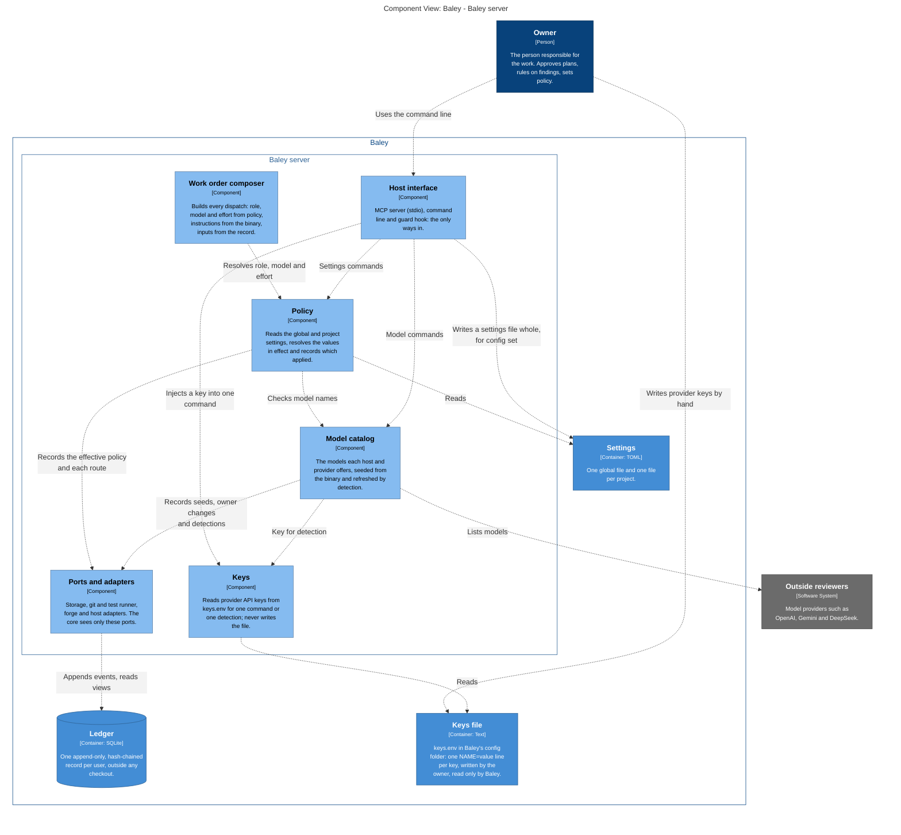
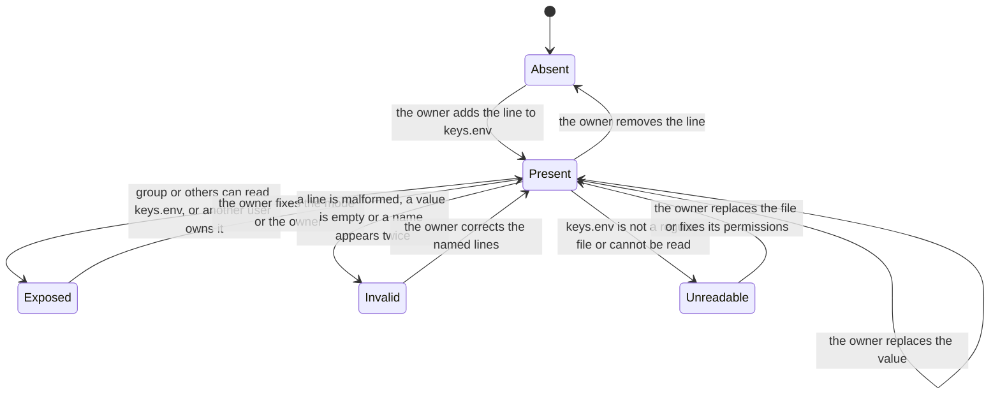
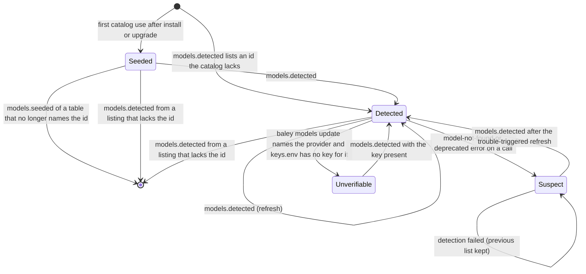
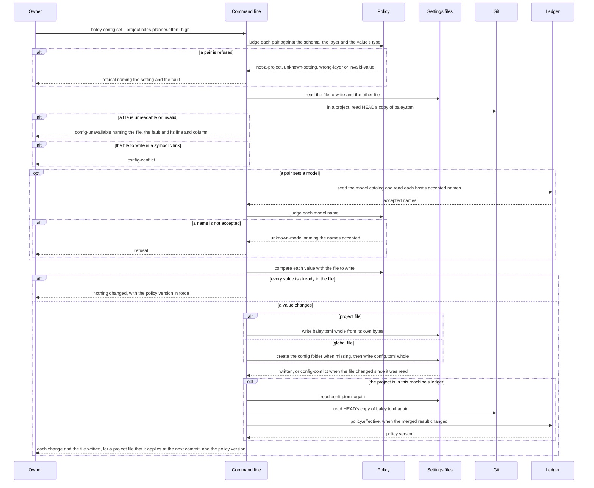
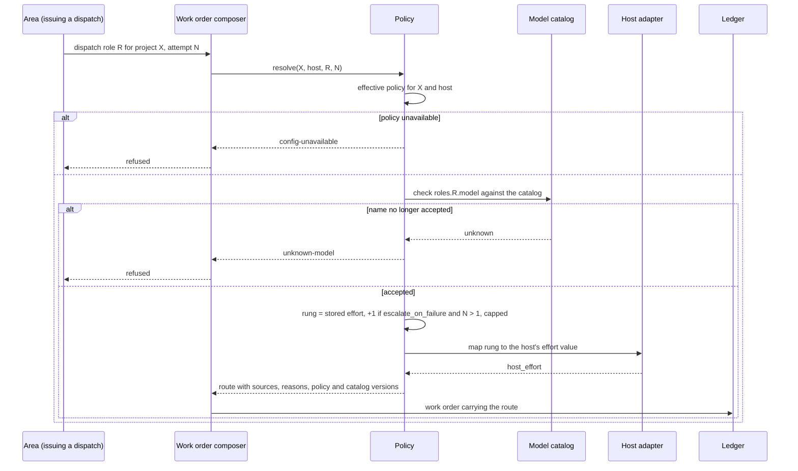
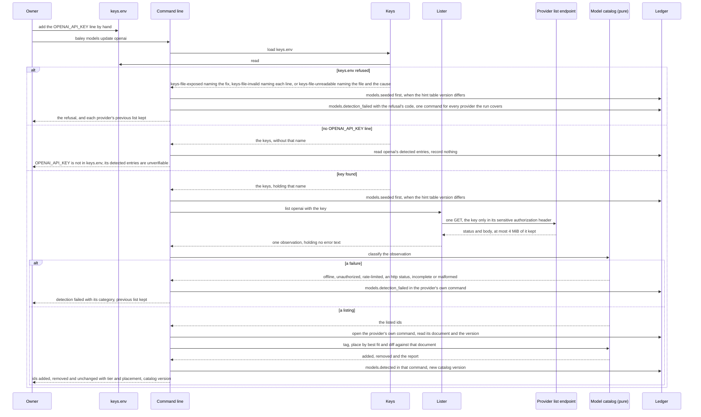
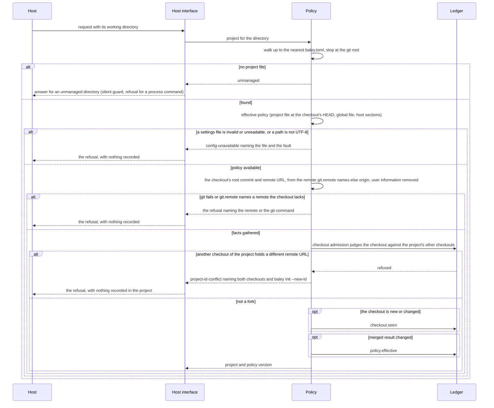

# 0003: Configuration and routing

| | |
|---|---|
| Status | Accepted |
| Design issue | none; build issue [#23](https://github.com/crenshawdev/baley/issues/23) |
| Requirement prefix | CFG |
| Applies | [0002: System design](0002-system-design.md) |
| Related | ADRs: [0003](../adr/0003-per-user-database.md), [0004](../adr/0004-project-identity.md), [0009](../adr/0009-served-instructions.md), [0015](../adr/0015-settings-in-toml.md), [0016](../adr/0016-key-store.md), [0027](../adr/0027-vendor-folders-and-plain-keys.md), [0028](../adr/0028-one-http-stack.md), [0032](../adr/0032-gemini-is-not-a-provider.md), [0033](../adr/0033-host-security-bar.md) · C4 view: configuration |

The current design of this area, and nothing else. Edit it in place when the design changes; git holds the history. It describes the design only, never the work still to do.

## 1. Purpose and scope

This area decides:

- which settings exist, where each one may be set, and how the layers merge into the policy in effect;
- where the settings files live and how a checkout finds its project;
- how a role's model and effort are resolved for every work order, and what a retry changes;
- which model names Baley accepts for each host and provider, and how that list stays current;
- where provider API keys are read from and how they reach a call.

It does not decide the meaning of settings owned by other areas (section 9 lists every setting and its owner), how a work order reaches a host or how effort is delivered there ([0012: Host interface](0012-host-interface.md)), whether a review or a risk gate fires ([0008: Review](0008-review.md), [0009: Risk](0009-risk.md)), or what the guard does with git commands ([0010: Guard](0010-guard.md)).

Hand-offs: the work order composer ([0002](0002-system-design.md) section 8) asks this area for the model and effort of each dispatch; the ledger ([0001](0001-evidence-ledger.md)) stores what this area records; `baley init` ([0001](0001-evidence-ledger.md), EVD-R17, ADR 0004) creates the project file this area reads.

<!-- c4:configuration -->

```mermaid
graph LR
  linkStyle default fill:none

  subgraph diagram ["Component View: Baley - Baley server"]
    style diagram fill:none,stroke:none

    1["<div style='font-weight: bold'>Owner</div><div style='font-size: 70%; margin-top: 0px'>[Person]</div><div style='font-size: 80%; margin-top:10px'>The person responsible for<br />the work. Approves plans,<br />rules on findings, sets<br />policy.</div>"]
    style 1 fill:#08427b,stroke:#052e56,color:#ffffff

    18["<div style='font-weight: bold'>Outside reviewers</div><div style='font-size: 70%; margin-top: 0px'>[Software System]</div><div style='font-size: 80%; margin-top:10px'>Model providers such as<br />OpenAI, Gemini and DeepSeek.</div>"]
    style 18 fill:#6b6b6b,stroke:#4d4d4d,color:#ffffff

    subgraph 2 ["Baley"]
      style 2 fill:none,stroke:#0b4884,color:#0b4884

      subgraph 3 ["Baley server"]
        style 3 fill:none,stroke:#2e6295,color:#2e6295

        10["<div style='font-weight: bold'>Model catalog</div><div style='font-size: 70%; margin-top: 0px'>[Component]</div><div style='font-size: 80%; margin-top:10px'>The models each host and<br />provider offers, seeded from<br />the binary and refreshed by<br />detection.</div>"]
        style 10 fill:#85bbf0,stroke:#5d82a8,color:#000000
        11["<div style='font-weight: bold'>Ports and adapters</div><div style='font-size: 70%; margin-top: 0px'>[Component]</div><div style='font-size: 80%; margin-top:10px'>Storage, git and test runner,<br />forge and host adapters. The<br />core sees only these ports.</div>"]
        style 11 fill:#85bbf0,stroke:#5d82a8,color:#000000
        4["<div style='font-weight: bold'>Host interface</div><div style='font-size: 70%; margin-top: 0px'>[Component]</div><div style='font-size: 80%; margin-top:10px'>MCP server (stdio), command<br />line and guard hook: the only<br />ways in.</div>"]
        style 4 fill:#85bbf0,stroke:#5d82a8,color:#000000
        7["<div style='font-weight: bold'>Work order composer</div><div style='font-size: 70%; margin-top: 0px'>[Component]</div><div style='font-size: 80%; margin-top:10px'>Builds every dispatch: role,<br />model and effort from policy,<br />instructions from the binary,<br />inputs from the record.</div>"]
        style 7 fill:#85bbf0,stroke:#5d82a8,color:#000000
        8["<div style='font-weight: bold'>Policy</div><div style='font-size: 70%; margin-top: 0px'>[Component]</div><div style='font-size: 80%; margin-top:10px'>Reads the global and project<br />settings, resolves the values<br />in effect and records which<br />applied.</div>"]
        style 8 fill:#85bbf0,stroke:#5d82a8,color:#000000
        9["<div style='font-weight: bold'>Keys</div><div style='font-size: 70%; margin-top: 0px'>[Component]</div><div style='font-size: 80%; margin-top:10px'>Reads provider API keys from<br />keys.env for one command or<br />one detection; never writes<br />the file.</div>"]
        style 9 fill:#85bbf0,stroke:#5d82a8,color:#000000
      end

      12[("<div style='font-weight: bold'>Ledger</div><div style='font-size: 70%; margin-top: 0px'>[Container: SQLite]</div><div style='font-size: 80%; margin-top:10px'>One append-only, hash-chained<br />record per user, outside any<br />checkout.</div>")]
      style 12 fill:#438dd5,stroke:#2e6295,color:#ffffff
      13["<div style='font-weight: bold'>Settings</div><div style='font-size: 70%; margin-top: 0px'>[Container: TOML]</div><div style='font-size: 80%; margin-top:10px'>One global file and one file<br />per project.</div>"]
      style 13 fill:#438dd5,stroke:#2e6295,color:#ffffff
      14["<div style='font-weight: bold'>Keys file</div><div style='font-size: 70%; margin-top: 0px'>[Container: Text]</div><div style='font-size: 80%; margin-top:10px'>keys.env in Baley's config<br />folder: one NAME=value line<br />per key, written by the<br />owner, read only by Baley.</div>"]
      style 14 fill:#438dd5,stroke:#2e6295,color:#ffffff
    end

    1-. "<div>Uses the command line</div><div style='font-size: 70%'></div>" .->4
    1-. "<div>Writes provider keys by hand</div><div style='font-size: 70%'></div>" .->14
    7-. "<div>Resolves role, model and<br />effort</div><div style='font-size: 70%'></div>" .->8
    8-. "<div>Reads</div><div style='font-size: 70%'></div>" .->13
    4-. "<div>Writes a settings file whole,<br />for config set</div><div style='font-size: 70%'></div>" .->13
    8-. "<div>Checks model names</div><div style='font-size: 70%'></div>" .->10
    8-. "<div>Records the effective policy<br />and each route</div><div style='font-size: 70%'></div>" .->11
    4-. "<div>Settings commands</div><div style='font-size: 70%'></div>" .->8
    4-. "<div>Model commands</div><div style='font-size: 70%'></div>" .->10
    4-. "<div>Injects a key into one<br />command</div><div style='font-size: 70%'></div>" .->9
    9-. "<div>Reads</div><div style='font-size: 70%'></div>" .->14
    10-. "<div>Key for detection</div><div style='font-size: 70%'></div>" .->9
    10-. "<div>Lists models</div><div style='font-size: 70%'></div>" .->18
    10-. "<div>Records seeds, owner changes<br />and detections</div><div style='font-size: 70%'></div>" .->11
    11-. "<div>Appends events, reads views</div><div style='font-size: 70%'></div>" .->12

  end
```
<!-- /c4:configuration -->

*Figure 1. The parts of the Baley server this area designs: Policy, Keys and the Model catalog, and what they talk to.*

## 2. Terms

| Term | Meaning |
|---|---|
| Setting | One named value Baley reads, such as `git.on_protected`. A setting has a type, a default and a scope. |
| Layer | One source of settings: the built-in defaults, the global file, its host section, the project file, or its host section. |
| Host section | A table inside a settings file, `[host.<name>]`, whose values apply only when that host is connected. The one host name is `claude-code`, the host Baley supports ([ADR 0033](../adr/0033-host-security-bar.md)). A section naming any other host is ignored with one diagnostic, never validated and never deleted (CFG-R7). The seam stays: a host admitted under ADR 0033 adds its name. |
| Scope | Where a setting may be set: `global`, `project`, or `both`. A value in a layer outside its scope is ignored and reported. |
| Effective policy | The result of merging every layer for one project and the connected host, if there is one, plus the layer each value came from. |
| Policy version | The identity of one recorded effective policy. Every command records the version it ran under. |
| Role | A kind of worker Baley dispatches: planner, analyzer (the refinement role that asks the owner questions and drafts truths), plan checker, executor, verifier, reviewer. |
| Rung | One of Baley's five effort levels, in order: `low`, `medium`, `high`, `xhigh`, `max`. |
| Route | The result of resolving one role for one dispatch: model, rung, the settings that decided them, and whether a retry moved the rung. |
| Model catalog | The list of model names Baley accepts, per host and per provider, with the source each name came from. It is the `model_catalog` view of the reserved per-user ledger project `user` (section 6). |
| Host alias | A short model name a host resolves itself, such as `opus` in Claude Code. Aliases follow new model releases without any change on Baley's side. Each host's aliases are compiled into Baley and never recorded. |
| Provider | An outside model vendor reached by API key or its own command-line login. OpenAI and DeepSeek are reached by key, and each has a catalog of its own that detection fills. Anthropic is reached only through the Claude Code login, so its names are the `claude-code` host catalog and `anthropic` is no catalog name. |
| Detection | Asking a provider's list endpoint, with the owner's key, which model names that key can use. |
| Hint table | A table compiled into Baley that tags known model names with a tier (`flagship`, `balanced`, `cheap`) and whether they accept high effort. It has a version, raised whenever a row changes. Its exact-id rows are seeded into the catalog; its prefix rows tag, for detection, the ids that start with a known prefix and that no exact row names. |
| Config folder | Baley's own folder under the crenshawdev vendor folder: `$XDG_CONFIG_HOME/crenshawdev/baley` on Linux (an empty or relative `XDG_CONFIG_HOME` counts as unset), `~/Library/Application Support/crenshawdev/baley` on macOS, or `BALEY_HOME` when it is set. It holds the global file and the keys file. |
| Keys file | `keys.env` in the config folder: one `NAME=value` line per provider API key, written by the owner by hand and only read by Baley. |
| Key name | The name on the left of a line in the keys file, such as `OPENAI_API_KEY`. |
| Keys | The part of Baley that reads a key from the keys file for one use. |

## 3. Requirements

| Id | Rule | Why | Depends on | Status |
|---|---|---|---|---|
| CFG-R1 | Settings are TOML in two files: one global file per user and one project file per repository; there is no other settings file. | One familiar, reviewable format for every setting; no other file holds settings. | SYS-R13 | Active |
| CFG-R2 | The global file is `config.toml` in Baley's config folder: `$XDG_CONFIG_HOME/crenshawdev/baley/config.toml` (default `~/.config/crenshawdev/baley/config.toml`) on Linux and `~/Library/Application Support/crenshawdev/baley/config.toml` on macOS; when `BALEY_HOME` is set, the global file is `$BALEY_HOME/config.toml`. An empty or relative `XDG_CONFIG_HOME` is treated as unset. Each crenshawdev application has its own folder under the vendor folder, and nothing is shared at the vendor level. | Each platform's own place, grouped under one vendor folder; tests and development builds never touch the owner's file. | ADR 0003, ADR 0027, SYS-R14 | Active |
| CFG-R3 | The project file is `baley.toml` at the repository root, committed with the code. | Policy travels with the code; every clone and every teammate runs under the same project settings. | ADR 0004 | Active |
| CFG-R4 | Every request names the working directory it is made from; Baley finds the project by walking up from that directory to the nearest `baley.toml`, stopping at the git repository root. The guard uses the same walk. A directory with no project file is unmanaged and Baley stays silent about it. When project files are nested, the nearest one applies and nothing is inherited from the outer one. | One shared server serves many sessions in many projects, so the project is a property of the request, not of the process. | SYS-R1, ADR 0004 | Active |
| CFG-R5 | Each setting has a scope: `global`, `project` or `both`. Branch, forge and repository settings and the test and lint commands are `project`. Roles and the escalation switch are `both`. A value written in a layer outside the setting's scope is ignored and reported as a scope diagnostic; the command line refuses to write it. | Repository facts belong to the repository; per-user choices must not leak into a committed file by mistake. | SYS-R13 | Active |
| CFG-R6 | Layers merge in this order, later winning per setting: built-in defaults, global file, global `[host.<name>]` section, project file, project `[host.<name>]` section. Only the section of the connected host applies. | The project overrides the user; a host section refines the file it is in. | CFG-R5 | Active |
| CFG-R7 | Every setting in the schema has a reader in the code; a setting nothing reads is removed from the schema. An unknown name in a file is ignored and reported; the command line refuses to write it. | A setting that changes nothing misleads the owner. | | Active |
| CFG-R8 | Whenever the merged result changes, for any layer, Baley records `policy.effective` with the full merged policy and the layer and file each value came from; every command records the policy version it ran under, 0 when no recorded policy applies, as the table below says. | The record says what Baley acted under, not what the files say now. | EVD-R17 | Active |
| CFG-R9 | The effective policy is re-read and re-validated before every command that appends to a project's chain from a checkout. An invalid file (unparseable, wrong type, value outside its grammar) makes the policy unavailable, and every command that needs it is refused with `config-unavailable` naming the file and the fault and, for a parse, type or grammar fault, its line and column. A missing file is an empty layer; a file that exists but is not a regular file or cannot be read makes the policy unavailable in the same way, naming the file and the cause. HEAD's copy of the project file, which holds the project's settings, makes the policy unavailable in the same way when git cannot read it. A checkout, or a settings file the policy reads, whose path is not UTF-8 makes the policy unavailable in the same way, naming the path, since the record holds paths as text. | Never act on a torn or half-edited policy. | CFG-R8 | Active |
| CFG-R10 | A dispatch whose routing inputs changed between admission and its run is refused as `routing-inputs-changed`. | A worker must run under the route the owner's policy produced when it was admitted. | CFG-R8, SYS-R6 | Active |
| CFG-R11 | Only Baley's command line and its interview write the settings files. The host sandbox and the guard refuse any agent write to Baley's config folder (the global file and the keys file) and to the project file. Instructions served to models never mention the files. | The owner sets policy; the model never does. | SYS-P11, SYS-R13 | Active |
| CFG-R12 | Six roles are routed: `planner`, `analyzer`, `checker`, `executor`, `verifier`, `reviewer`. Each has `roles.<role>.model` (a model name, default absent) and `roles.<role>.effort` (a rung; defaults: planner, analyzer, executor and verifier `high`, reviewer `medium`, checker `low`). | Every worker Baley dispatches has an owner-set cost. | SYS-P1 | Active |
| CFG-R13 | An absent model means the host session's own model; Baley then passes no model to the host. | The owner's session choice is the default everywhere. | CFG-R12 | Active |
| CFG-R14 | A model name is checked against the model catalog for the host or provider it is written for, at write time; an unknown name is refused by the command line and interview with `unknown-model`, naming the catalog entries that exist. A name is never silently dropped at dispatch. | A misspelled model must fail where the owner can see it. | CFG-R12, CFG-R19 | Active |
| CFG-R15 | The five rungs are Baley's scale, and the host adapter's map takes a rung to what the host accepts. Claude Code's map is the identity: each rung runs at the effort level of the same name. Support depends on the model. Claude Code runs a level a model does not support as the highest supported level at or below it, and Opus and Sonnet 4.6 have no `xhigh`. A model with no effort level (Haiku) gets "not applicable", never a made-up level. The route records the requested rung and the effective level apart, from a dated per-model table of supported levels. The table's source is Claude Code's model configuration documentation (https://code.claude.com/docs/en/model-config#adjust-effort-level). An alias not yet resolved, or a host cap on effort, stays recorded as unknown until observed. `RungMap` is unchanged. | Hosts differ in the effort levels they take. | SYS-P8 | Active |
| CFG-R16 | `escalate_on_failure` (default `false`): when true, a retry of a failed dispatch runs one rung above the stored rung, capped at `max`; a further retry holds there. Baley supplies the attempt number from the ledger. When false, every attempt runs at the stored rung. | A failure earns one step more effort, decided by Baley, never by the model. | CFG-R12 | Active |
| CFG-R17 | Every route records the role, the model, the starting rung, the rung run, the attempt, the setting and layer that supplied the model and the effort, and each reason in plain words. The work order carries the route; nothing else does. | The owner can always see why a worker ran as it did. | SYS-P2, CFG-R8 | Active |
| CFG-R18 | The plan-time risk floor never changes a model or a rung. | Effort is the owner's choice; risk changes the review gate ([0009](0009-risk.md)), not the cost. | | Active |
| CFG-R19 | The model catalog is data in the per-user database, seeded from the binary at install and at every upgrade, never a setting. Host aliases (for Claude Code: `opus`, `sonnet`, `haiku`, `fable`) come from the host adapter's compiled table. Exact model ids are accepted beside aliases. | Aliases track new models by themselves; the owner's choice stays small. | ADR 0003 | Active |
| CFG-R20 | For each provider whose key is in the keys file, the catalog is refreshed by detection: Baley calls the provider's list endpoint with that key, records every id returned, tags each id from the hint table, and places an untagged id by best fit (newest first) unless the owner chooses. Baley finds a provider's key by a small compiled table of key names: `OPENAI_API_KEY` for OpenAI, `DEEPSEEK_API_KEY` for DeepSeek. Detection runs at install, at `baley init`, when a call fails with a model-not-found or deprecated-model error, and on `baley models update`. It never runs on a timer. Detection sends no prompt and no project content. | The vendor's list is the truth; Baley's table is a hint. Nothing waits on a Baley release. | CFG-R21, SYS-R9 | Active |
| CFG-R21 | Detection that fails (offline, bad key, rate limit, or a keys file Baley refuses) leaves the previous catalog in place, is recorded as `models.detection_failed`, and never blocks a command. A refused keys file records the failure for every provider the run covers. A provider with no key in the keys file is not detected and is not recorded as a failure; its detected catalog entries become unverifiable (Figure 3). An automatic trigger skips it quietly; when the owner names it in `baley models update`, Baley says which key name is missing from the keys file (CFG-R28). | Setup and dispatch must not depend on a network call. | CFG-R20 | Active |
| CFG-R22 | The owner can add or remove a catalog name by hand (`baley models add`, `baley models remove`); a hand-added name wins over detection and is never removed by it. | A model newer than every list is still usable at once. | CFG-R19 | Active |
| CFG-R23 | Each route and each detection records the catalog version it was checked against. | The record says which list was in force. | CFG-R17, CFG-R20 | Active |
| CFG-R24 | Provider API keys are plain `NAME=value` lines in one file, `keys.env`, in Baley's config folder beside `config.toml` (`$BALEY_HOME/keys.env` when `BALEY_HOME` is set). A missing file means no keys. A line is blank, a comment whose first byte is `#`, or `NAME=value` with an optional `export ` prefix. A name is `[A-Za-z_][A-Za-z0-9_]*` followed directly by `=`. Trailing spaces, tabs and carriage returns are removed. An unquoted value runs to the end of the line and holds no space or tab, since a shell reads such a line differently. A quoted value is everything between matching single or double quotes that end the line, with no escapes. A value, quoted or not, holds no control byte (`0x00` to `0x1F`, or `0x7F`) except a tab inside quotes; refusal catches a stray carriage return from a paste instead of sending a wrong key. Baley refuses the file with `keys-file-exposed` when a group or other read bit is set (`mode & 0o044`), naming the file and the `chmod 600` fix, or another user owns it, naming the numeric `chown` fix; both faults are named when both hold, owner first. Other mode bits are not judged. A fix named in a refusal tells the owner what to do: Baley never runs it, never checks that it works in the owner's shell, and never creates, changes or repairs the file. `keys-file-invalid` refuses a repeated name, an empty value or any other invalid line, including non-UTF-8 outside a comment, a byte-order mark on line 1, unquoted space or tab, and a forbidden control character. Every faulty line is named by number, never its text. `keys-file-unreadable` refuses a path that is not a regular file or cannot be read, naming the file and the cause. Any of these three refusals makes `baley exec` refuse and detection record `models.detection_failed` for every provider the run covers. A symbolic link to the file is followed. This check does not check the folder; where the folder is Baley's home (on macOS, or when `BALEY_HOME` is set), the home's own open checks apply when a command opens the ledger; `baley exec` opens none ([0001](0001-evidence-ledger.md), EVD-R22). Keys are not encrypted; there is no master key and no OS secret store. Stated limit: Claude Code's sandbox and its `Read` deny rules keep agents from reading the file ([0001](0001-evidence-ledger.md), EVD-R24, [ADR 0033](../adr/0033-host-security-bar.md)). That holds for `keys.env` as a file in the config folder (or the home); where it is a symbolic link, the target is protected only when it too lies inside those folders. The owner's own Claude Code settings can loosen them, and `baley doctor` reports that. Outside the host the file is as readable as any file the owner's user can read; that is the operating-system user boundary, not Baley's to close. | The file's mode protects the keys the way it protects any key the owner keeps in a file; nothing Baley added would protect them better from a process running as the owner. | SYS-R12, ADR 0027 | Active |
| CFG-R25 | Baley only reads the keys file and never writes it; the owner edits it by hand. Baley has no command that sets, removes or lists keys. Keys come only from that file, never from an environment variable. | The owner holds the keys; Baley has no second copy to keep in step. | SYS-R12 | Active |
| CFG-R26 | The ledger may record that a key was used and how (for example a review by OpenAI through its API with `OPENAI_API_KEY`), never the key's value. Keys never enter the ledger, exports or any view. | The record is shareable; the keys are not. | EVD-R14, CFG-R24 | Active |
| CFG-R27 | Baley reads a key from the keys file for two uses only: to inject it into one command through `baley exec --key <NAME>` (SYS-R11) and to call a provider's list endpoint for detection (CFG-R20). | The fewest places a key can leak from. | SYS-R11, CFG-R20 | Active |
| CFG-R28 | A provider the owner reaches by its own command-line login needs no line in the keys file; every command that needs a key names the key missing from the file, and no command forces the owner to add one. | No one is forced to hand over a key. | SYS-R10 | Active |
| CFG-R29 | `git.forge_provider` accepts `github`, `gitlab` and `forgejo`; the first release acts on `github` only, and choosing another value is accepted and reported as not yet supported by [0011: Landing](0011-milestones-landing-undo-pause.md). | All three forges are planned; the setting must not need to change when they arrive. | | Active |

Which policy each command runs under (CFG-R8, CFG-R9). Policy version 0 means that no recorded policy applies. Checkout admission runs before the policy step for every command that runs one: it judges the checkout against the project's other checkouts and records `checkout.seen` when the checkout is new or changed ([0001](0001-evidence-ledger.md), EVD-R17). The policy step runs before every command that appends to a project's chain from a checkout: it re-reads both files, records `policy.effective` when the merged result changed, and returns the version in force for the command's own record. A command that appends to no chain runs no step. Records in the per-user project `user` carry 0 and build no policy. `purge` is the one chain-writing command that may run outside a checkout, and records 0 there. A `baley config set` outside any project, one in a project that is not in this machine's ledger, and one that changes nothing run no step. The first two give 0, since no recorded policy applies, and one that changes nothing gives the version in force. `baley config interview` runs no step of its own: its one `config set` runs the step as that set does, and an interview that is declined or has every answer blank opens no store and runs no step.

| Command | Project from | Policy step | Version recorded |
|---|---|---|---|
| `baley init` | discovery at the repository root | yes, after `project.initialized` and checkout admission | 0 on `project.initialized` |
| `baley config set` in a project | discovery | yes, after the write, when the project is in this machine's ledger | the version in force after it, or 0 when the project is not in this machine's ledger, where `baley init` records the policy |
| `baley config interview` | discovery | only through its one `config set` | that set's version, and none when the interview is declined or every answer is blank |
| `anchor`, `acknowledge-restore` | discovery | yes | the version in force |
| `purge` | its argument | only when run from a checkout of that project | the version in force there, otherwise 0 |
| `verify --local-only`, `verify --views`, `export`, `rebuild` | their argument | no: no event is appended | none |
| `verify` with no flag | discovery, with an optional argument naming the same project | no: it reads the settings and appends nothing | none |
| `doctor` | discovery for the discovered project's remote, every other project checked locally | no: it reads the settings and appends nothing | none |
| `scrub` | none | no: no event is appended | none |
| `baley models add`, `remove` and `update`, detection, seeding | the per-user project `user` | no | 0 |
| `policy.effective` itself | the command it belongs to | it is the step's own record | the version it replaces, 0 for the first of its key |
| `checkout.seen` itself | the command it belongs to | no: it runs before the step, as a command of its own | the policy version stored for the checkout and no host, 0 when none is stored |

## 4. Roles and actors

| Actor | Receives | Returns | Model and effort from |
|---|---|---|---|
| Owner | Prompts from the settings interview; refusals naming file, setting and fault | Settings values; keys written into the keys file by hand; catalog additions | Not applicable |
| Baley command line | `baley config`, `baley exec`, `baley models` commands | Receipts, facts, refusals | Not applicable |
| Policy (component) | A project, a host name, a role, an attempt | The effective policy; a route | Not applicable |
| Keys (component) | A key name | The key's value for one use; a refusal when the name has no line or the file is refused (CFG-R24) | Not applicable |
| Model catalog (component) | A host or provider name and a model name | Whether the name is accepted; the catalog version | Not applicable |
| Work order composer ([0002](0002-system-design.md) section 8) | A route | A work order carrying it | The route |
| Guard hook ([0010](0010-guard.md)) | A working directory | The project and its effective policy, or "unmanaged" | Not applicable |
| Host adapter ([0012](0012-host-interface.md)) | A rung and a model name | The model's effort level, or none for a model without effort, and the model parameter | Not applicable |
| Dispatched workers (the six roles) | A work order | A typed result | `roles.<role>.model`, `roles.<role>.effort`, `escalate_on_failure` |

No worker is dispatched by this area; it supplies the route others dispatch with.

## 5. Commands and operations

All operations of this area are command-line commands run by the owner. Nothing in this area is exposed over MCP: a work order carries the route it needs (CFG-R17), and the model is never told about the settings files (CFG-R11). The one exception is the settings interview, which a project start runs through the host's question mechanism when settings are missing ([0004](0004-starting-a-project-and-changing-scope.md), PRJ-R9); the answers are still written by Baley. Every command names the working directory it runs in, and every command that needs a project resolves it as CFG-R4 says.

### baley config show

- **Inputs:** optional `--host <name>`, optional setting names. An unknown host name is refused when the arguments are parsed, exit 2, with text naming `claude-code` as the supported host. With no `--host`, which is how the command line runs, every host section's stored values are shown and the effective value applies no host section. With `--host`, only that host's section is shown, and its sections apply to the effective value. With no setting names, every setting is shown, in the schema's order.
- **Outputs:**
  - for each setting: its type, default and scope;
  - its stored global values, each host section included;
  - its stored project values, read from the working-tree `baley.toml`. Where HEAD's committed value differs, it is shown beside the working-tree value with the note that it applies once committed;
  - its effective value, with the layer and the file it came from. The effective value is merged from the global file and HEAD's copy of `baley.toml`, since HEAD's copy is the policy the ledger records;
  - then the diagnostics of the global file and HEAD's copy: scope, unknown name and unknown host. A value that fails its type or grammar makes the file unavailable and is refused, so it is not listed;
  - the note that the project file's changes apply once committed, when the working-tree file differs from HEAD's copy or is not committed;
  - the path of the global file, and the path of the project file when the directory is in a project.

  `config show` opens no ledger, runs no policy step and records nothing.
- **Refusals,** in the order judged. The names are judged first, since they need no file. Then each file is read in the order global file, working-tree `baley.toml`, HEAD's copy, and then each is parsed in that order.

  | Code | When | Requirement |
  |---|---|---|
  | `unknown-setting` | A named setting is not in the schema | CFG-R7 |
  | `not-a-project` | The directory has no project file and a project-scoped setting was named | CFG-R4 |
  | `config-unavailable` | The global file, the working-tree `baley.toml` or HEAD's copy cannot be read or is invalid, naming the file and the fault and, for a parse, type or grammar fault, its line and column. A fault in HEAD's copy is named as HEAD's copy of the file, since the working-tree file at that path may not share it | CFG-R9 |

### baley config set

- **Inputs:**
  - `--global` or `--project`, exactly one, required;
  - optional `--host <name>`, refused when the arguments are parsed if the name is unknown, exit 2, with text naming `claude-code` as the supported host. With it, each value is written in that host's `[host.<name>]` section;
  - one or more `name=value` pairs, split at the first `=`.

  A value is read by its setting's type and is never parsed as TOML: `true` or `false` for a boolean, a rung name written exactly as the scale spells it, or a non-empty model name. A file that should hold a default has the default written as its value.
- **Outputs:**
  - **A project-file set:** the file written, each setting changed with its new value, that the change applies at the next commit, and the policy version in force. The step reads HEAD's copy of the file, so the version is usually the one already recorded until the change is committed.
  - **A global set:** each setting changed, the file written and the policy version. A global file applies as soon as it is written, so it never says next commit.
  - **A set that changes nothing,** where every value is already in the file: nothing is written and no policy step runs. The output says nothing changed and gives the policy version in force.
  - **Version 0:** the output says what it means. Outside a project no recorded policy applies. In a project not in this machine's ledger, such as a fresh clone, no recorded policy applies to the project and `baley init` records it.
  - **The write:**
    - Baley writes the whole file to a temporary file in the same folder and renames it over the old one. Comments and key order in the file are not kept ([ADR 0027](../adr/0027-vendor-folders-and-plain-keys.md)). Every other key the file holds is kept.
    - The config folder is created private when it is missing.
    - A `--project` set is rewritten from the working-tree `baley.toml`'s own bytes, never from HEAD's copy, so uncommitted edits in that file are kept.
  - **The policy step:** in a project in this machine's ledger, the step runs after the write. It re-reads both files, taking the project layer from HEAD's copy, and records `policy.effective` when the merged result changed. A project-file change is therefore recorded once it is committed and a later command that writes the chain runs.
  - A refusal exits 2. A write that fails for another reason exits 3.
- **Refusals,** in the order judged. Each check runs over every pair before the next begins, and nothing is written until all have passed:

  | Code | When | Requirement |
  |---|---|---|
  | `not-a-project` | `--project` outside a project | CFG-R4 |
  | `unknown-setting` | The name is not in the schema | CFG-R7 |
  | `wrong-layer` | The setting's scope excludes the requested layer | CFG-R5 |
  | `invalid-value` | The value is not of the setting's type, or fails its grammar | CFG-R9 |
  | `config-unavailable` | A file the set checks cannot be read or is invalid: the working-tree project file and its project id, then the global file and, in a project, HEAD's copy, then the file the set writes. A fault in HEAD's copy is named as HEAD's copy of the file | CFG-R9 |
  | `unknown-model` | A `roles.<role>.model` value is not in the catalog of the host `--host` names, or with no `--host`, in no host's catalog. The refusal names the entries each catalog accepts | CFG-R14 |
  | `config-conflict` | The file to write is a symbolic link, or the file changed between read and write | CFG-R9 |

  A symbolic link is refused before the catalog is read, so a set that changes nothing refuses on one as a changing set does. A file that changed between read and write is found at the write itself, when the file's bytes no longer match the ones the new file was rendered from. The catalog is read, after it is seeded, only when a pair sets a model.

### baley config interview

- **Inputs:**
  - `--global` or `--project`, optional and exclusive. Both together are refused when the arguments are parsed;
  - with neither, the global file when it holds no role value at its top level, and the project file otherwise. A role value is a `roles.<role>.model` or `roles.<role>.effort` written outside a host section. An empty `[roles]` table, or one that holds only unknown keys, holds none, and a host section's role value does not count, with or without `--host`;
  - a project target outside a project is refused `not-a-project` before the first question, and the interview never falls back to the global file;
  - optional `--host <name>`, refused when the arguments are parsed if the name is unknown, exit 2, with text naming `claude-code` as the supported host. With it, that host's sections apply to each value in force, and every answer is written into `[host.<name>]`.
- **Outputs:**
  - thirteen ordered questions: model then effort for each of the six roles, then `escalate_on_failure`;
  - with each question, the value in force and the layer it comes from. The value is merged over the global file and HEAD's copy of `baley.toml`, as `config show` merges it. An unset model shows as absent;
  - for a project target, the note that the project file's changes apply once committed, printed once before the first question when the working-tree file differs from HEAD's copy or is not committed. No question shows a working-tree value;
  - a blank answer keeps the value in force and sends nothing. An effort that is not a rung, or an `escalate_on_failure` answer other than `true` or `false`, is asked again. A model is any non-empty text. No answer clears a value, and an answer is not compared with the value in force;
  - after the last question, the confirmation: the interview lists each `name=value` it will send and the file, and asks once. Only `yes` writes, as one `config set`;
  - when every answer is blank, no confirmation is asked, and the interview says nothing changed and exits 0;
  - piped input is read as a terminal's is. Input that ends before the confirmation declines.

  `config interview` opens no ledger and runs no policy step of its own. Its one `config set` runs the step as that set does (section 3).
- **Refusals:**
  - before the first question: `not-a-project`, and `config-unavailable` for the global file, the working-tree `baley.toml` and its project id, and HEAD's copy, as `config set` judges them;
  - at the end: every refusal of `config set`. A model answer is not checked while the interview asks, so `unknown-model` comes from that set, naming the entries each catalog accepts, and the model is not asked again. The catalog is seeded only after the owner accepts with a model answer;
  - a declined interview, with any answer but `yes` or with the input ended, writes nothing, opens no store, says so and exits 0.
- **Also run by:** `project start` when the global file or the project's settings are missing ([0004](0004-starting-a-project-and-changing-scope.md), PRJ-R9); the same questions, put to the owner through the host when the start runs from a session.

There is no command that sets, removes or lists keys (CFG-R25): the owner writes `keys.env` by hand.

### baley exec

- **Inputs:** `--key <NAME>`, once, the key's name exactly as written in `keys.env`; `--`; the command and its arguments, passed on unchanged. The command reads Baley's stdin.
- **Outputs:** the command's stdout and stderr, each with every occurrence of the key's exact bytes replaced by `[baley:<NAME>]`, for example `[baley:OPENAI_API_KEY]`. Output is passed on as it arrives, except that the latest bytes, up to the key's length, wait until more arrives or the stream ends. Both streams are pipes, not the terminal. The key is set under that same name in the command's environment only. There is no time limit and no process group of the command's own. The exit code is the command's, or 128 plus the number of the signal that ended it. Nothing is recorded: `baley exec` opens no ledger and creates no folder or file. Encoded copies of the key are not replaced.
- **Refusals:** each on stderr as `baley: <code>: ...`, exit 2, before the command runs: `baley-home-invalid` and `user-home-invalid` when Baley's folders cannot be resolved ([0001](0001-evidence-ledger.md)); `no-such-key` when `keys.env` has no line with that name (CFG-R27, SYS-R11); `keys-file-exposed` when group or others can read `keys.env` (naming the file and the `chmod 600` fix) or another user owns it (naming the `chown` fix); `keys-file-invalid` when a line is not a valid key line, a value is empty or a name appears twice (naming each line by number); `keys-file-unreadable` when `keys.env` is not a regular file or cannot be read (naming the file and the cause) (CFG-R24); `command-not-started` when the command cannot be started (naming it and the cause). A missing `--key`, `--` or command is a usage error, exit 2. When waiting for the command fails, or its output cannot be passed on for a reason other than the reader closing Baley's output, Baley says so on stderr and exits 3. The full contract of this command belongs to [0012: Host interface](0012-host-interface.md).

### baley models update

- **Inputs:** optional provider names, each `openai` or `deepseek`; a name given twice counts once. With none, every provider whose key is in `keys.env` runs, and the rest are skipped quietly.
- **Outputs:** on stdout, in this order.
  - `seeded the model catalog with hint table version <n>`, when the run seeded. `update` seeds first only when it will record something: some provider it covers has a key, or `keys.env` is refused. Otherwise it creates no per-user project `user` and records nothing.
  - A refused `keys.env` prints the refusal's own text once, such as `keys-file-exposed: ... (fix: chmod 600 ...)`, and every provider the run covers records `models.detection_failed` with the refusal's code as its category.
  - A provider detected prints `<provider>: detected <n> added, <n> removed, <n> unchanged; catalog version <v>`, then a table with the columns `PROVIDER`, `ID`, `STATUS`, `TIER` and `PLACED`. It has one row per listed or removed id, in id order: its status (`added`, `unchanged` or `removed`), the tier it holds (`-` for none) and how it was placed (`hint`, `prefix`, `best-fit` or `owner`). A listing with no ids and no removals prints no table. The version is the one this provider's command committed.
  - A provider whose detection failed prints `<provider>: detection failed: <category>; the previous list is kept`, with a category of section 6. A body cut short at the 4 MiB bound fails as `incomplete` and removes no id. Each endpoint answers its whole list in one response, so that bound is the only one.
  - A provider named here with no key in `keys.env` gets no event. The output names that provider's own key name from CFG-R20, `<provider>: <key name> is not in <keys file>, so its detected entries are unverifiable`, then lists that provider's detected entries in the same table with status `unverifiable`, or says `<provider>: no detected entries`. Nothing is stored, so each entry keeps its last-verified time (CFG-R21, CFG-R28).
  - A provider the run does not cover, or one without a key that the owner did not name, prints nothing.

  Each provider records in its own command, `models.update`, in the per-user project `user` (section 6). The command exits 0 whether detection succeeds or fails.
- **Refusals:** each on stderr as `baley: <code>: ...`, exit 2, before the ledger is opened: `baley-home-invalid` and `user-home-invalid` when Baley's folders cannot be resolved ([0001](0001-evidence-ledger.md)), and `unknown-provider` for the host catalog `claude-code` or any name other than the two providers, `gemini` included, as `unknown-provider: "<name>" is no provider Baley detects; providers: openai, deepseek`. A failed detection is reported, not refused (CFG-R21).

### baley models add, baley models remove

- **Inputs:** a host or provider name, one of `claude-code`, `openai` or `deepseek`, and a model name, which is never empty; `add` takes an optional `--tier` of `flagship`, `balanced` or `cheap`. A missing or empty name or any other tier is a usage error, exit 2.
- **Outputs:** the change and the new catalog version, such as `added "gpt-test-1" to openai at tier cheap; catalog version 3`, with `models.owner_changed` recorded in the per-user project `user` (section 6).
  - Adding a name the catalog already holds, other than a host alias, makes it the owner's entry. With `--tier` it takes that tier and shows as placed by the owner, and it keeps its high-effort flag, since `--tier` says nothing about effort.
  - Adding a name the owner removed accepts it again.
  - Removing a seeded or detected id hides it, and no later seed or detection brings it back. Only an owner addition does.
  - A change that leaves every catalog's accepted names as they were, such as a change of tier alone, leaves the catalog version.
  - Like `baley models list`, it first seeds the catalog when the binary's hint table version differs from the latest one recorded, higher or lower (section 6), while `baley models update` seeds only when it records. The seed is its own command, recorded before the owner's.
- **Refusals:** each on stderr as `baley: <code>: ...`, exit 2. `baley-home-invalid`, `user-home-invalid`, `unknown-provider`, `alias-not-addable` and `alias-not-removable` refuse before the ledger is opened, so a refused command creates no ledger home. `unknown-model` is judged inside the removal's own transaction, after the seeding step, and the refused removal records only its `command.completed`.

  | Code | When | Requirement |
  |---|---|---|
  | `unknown-provider` | The name is none of the three catalogs, `anthropic` and `gemini` included, since nothing seeds or detects a catalog for either | CFG-R22 |
  | `alias-not-addable` | `add` names a host alias compiled into Baley, which the host already accepts; an owner entry for it would change no accepted name and could never be removed | CFG-R19 |
  | `alias-not-removable` | `remove` names a host alias compiled into Baley, which the host resolves whatever the catalog says | CFG-R19 |
  | `unknown-model` | `remove` names a name the catalog does not hold, or one the owner already removed | CFG-R22 |

### baley models list

- **Inputs:** an optional host or provider name (default: every catalog).
- **Outputs:** the line `catalog version <n>`, then a table with the columns `CATALOG`, `NAME`, `SOURCE`, `TIER` and `PLACED`: every accepted name with its source (`alias` for a host alias, `seed`, `detected` or `owner`), its tier, and how it was placed (`hint`, `prefix`, `best-fit` or `owner`). A `-` stands for no tier (a host alias, or a name the owner added new to the catalog without `--tier`) and for no placement (a host alias). Rows run by catalog in the order of the inputs above, then by name. A name that is both a host alias and an owner entry has both rows, and a name the owner removed has none. The version and the rows are read from one snapshot of the view. The first use on a fresh ledger creates the per-user project `user` and records `models.seeded` before it lists, and says so first: `seeded the model catalog with hint table version <n>`.
- **Refusals:** `unknown-provider` for a name that is no host or provider, on stderr, exit 2, before the ledger is opened (CFG-R22).

### Route resolution (internal)

Called by the work order composer for every dispatch, never by a host.

- **Inputs:** project, host name, role, attempt.
- **Outputs:** a route (section 6).
- **Refusals:**

  | Code | When | Requirement |
  |---|---|---|
  | `config-unavailable` | The effective policy cannot be built | CFG-R9 |
  | `unknown-model` | A stored model name is no longer in the catalog (it was removed by the owner) | CFG-R14 |
  | `routing-inputs-changed` | At the run, the policy version differs from the one at admission | CFG-R10 |

## 6. Records

### The global file `config.toml` (TOML)

| Table | Content |
|---|---|
| top level | `escalate_on_failure`; any `both`-scoped setting |
| `[roles.<role>]` | `model`, `effort` for the six roles |
| `[host.<name>]` and `[host.<name>.roles.<role>]` | The same settings, applied only when that host is connected |
| `[review]`, `[review.providers.
.tiers]`, `[review.triggers.<t>]` | Settings owned by [0008](0008-review.md) and [0009](0009-risk.md) |
| `[planning]`, `[debug]` | Settings owned by [0014](0014-support-families.md) |

### The project file `baley.toml` (TOML)

| Table | Content |
|---|---|
| `[project]` | `id` (UUID version 4), `name` (ADR 0004) |
| `[git]` | `protected_branches`, `on_protected`, `guard_hard_fail`, `integration_branch`, `auto_branch`, `base_branch`, `forge_provider`, `forge_repo`, `forge_host`, and the landing settings owned by [0011](0011-milestones-landing-undo-pause.md) |
| `[workflow]` | `test_command`, `lint_command` |
| `[roles.<role>]`, `[host.<name>...]`, `[review...]` | Overrides of the global values, same shape as the global file |

### policy.effective (event)

| Field | Type | Meaning |
|---|---|---|
| `project` | project id | The project the policy is for |
| `checkout` | string | The checkout: the canonical repository root that discovery gives, as text |
| `host` | string, or `null` for the command line | The host name the host sections were taken for; `null` for the command line, where no host section applies |
| `values` | table | Every setting with its effective value, `null` for an absent default |
| `sources` | table | Per setting: the layer (`default`, `global`, `global-host`, `project`, `project-host`) and, for a file layer, the file's `path`, its content `digest` (the lower-case hex SHA-256 of its bytes), and the `line` and `column` the value was written at |
| `diagnostics` | list | Each name a file wrote that the policy ignored, the global file's first, each in file order: its `layer` (`global` or `project`), the file's `path`, the `name` as written, its `line` and `column`, and its `kind` (`unknown-name`, `unknown-host` or `wrong-scope`), with the setting's `scope` (`global`, `project` or `both`) for `wrong-scope` |
| `catalog_version` | integer | The model catalog version the model names were checked against: read from the per-user project `user`'s catalog state outside any transaction, and 0 when `user` is absent. The step never seeds the catalog. |

The policy step records the event as a command of its own: kind `policy.record`, actor `baley`, on the project's `project` stream. The command's policy version is the version its event replaces, 0 for the first record of its key. The step compares the payload it would record with the latest record for the project, checkout and host, on values, sources, diagnostics and catalog version, and records only when one differs. When nothing differs it opens no command, so a rerun records nothing, not even a completed command. The project layer is HEAD's copy of `baley.toml`, and the "applies once committed" note and the whole-file refs of a file that supplies no setting are not recorded. So an uncommitted edit records nothing, and neither does a comment in a file that supplies no setting, unless it moves a name the policy ignores, since that name's diagnostic carries its line and column. Any byte change to a file that supplies a setting moves that setting's source digest and records. The command hands the store the `policy` document it observed. When another record of the key landed first, the store refuses the command as stale and the step observes again, at most three attempts in all, so the version a command carries is always the one its event replaces. The step returns the version in force, the new event's sequence or the stored record's, to the command that called it.

The `policy` view holds the latest `policy.effective` per project, checkout and host. The project is the view's scope, and the checkout and host are its key, both text. The command line's host text is `""`, which no host name can take. A document's body is the event's payload with `host_key`, the host's key text, and `version`, the event's sequence. The view has no index and page bound 1, since every read is by key; Build 7 adds the listing index its report of checkouts under different policies needs. Its event sequence number is the policy version other records cite.

### route (part of a work order)

| Field | Type | Meaning |
|---|---|---|
| `role` | enum | One of the six roles |
| `model` | string or absent | The model name passed to the host, absent for the session's model |
| `starting_rung`, `rung` | rung | The stored rung and the rung run after escalation |
| `attempt` | integer | The attempt number Baley supplied |
| `escalated` | bool | Whether the rung moved |
| `host_effort` | string | The host's own effort value the adapter mapped the rung to |
| `effort_source`, `model_source` | table | Setting name, layer and file for each |
| `policy_version`, `catalog_version` | integer | The versions in force |
| `reasons` | list of strings | One plain sentence per decision made |

### The keys file `keys.env`

One `NAME=value` line per key, in the config folder beside `config.toml`, for example a line for `OPENAI_API_KEY`. The owner writes it; Baley reads it and never writes it (CFG-R24, CFG-R25). It is not a settings file and is not part of the ledger. The grammar, refusals and ownership and mode checks are those of CFG-R24.

Lines split on LF, with CRLF accepted. Trailing spaces, tabs and carriage returns are removed before interpreting a line. Blank lines and comments count in the one-based line numbers; a final LF does not start another line. Every line but a comment must be UTF-8. A comment starts at the first byte with `#`, and its remaining bytes are ignored without decoding. Line 1 must not start with a byte-order mark. The optional `export ` prefix has exactly one space. Names are compared exactly, and only accepted lines register a name for duplicate checks. Quoted values keep all bytes between their first and last matching quotes, including inner quotes and literal backslashes. Unquoted values hold no space or tab. No value holds a control byte (`0x00` to `0x1F`, or `0x7F`) except a tab inside quotes; a value that does is refused with `keys-file-invalid` naming its line. All faulty lines are reported in file order, by number and never by text.

A symbolic link is followed, and the opened file's kind, owner and mode are judged before its lines. A known kind or exposure fault takes precedence over an incomplete read. A missing file or folder means no keys; a key looked up in it gives `no-such-key` naming the key and the configured file path and saying the file does not exist. Lookup is by exact name, without trimming or case folding. A key prints only as `[baley:<NAME>]` through `Debug` and has no `Display` or `Serialize`. Its crate-private value accessor is read by `baley exec`, for the command's environment and the redactor, and by the detection list request. That request puts the key only in the provider's `authorization` header, marked sensitive so that the request's `Debug` prints `Sensitive` for it, and never in a URL. A launch's `Debug` prints each environment value as `[redacted]`, and the redactor has no `Debug`. Neither the file bytes nor the key strings are wiped from memory when dropped.

The ledger may record that a key was used and how, such as a review by OpenAI through its API with `OPENAI_API_KEY`, never the key's value (CFG-R26).

### model catalog (view and events)

The model catalog is the `model_catalog` view of the reserved per-user project `user`. Its id is no UUID, so no `baley.toml` can name it. It holds the `models` stream for the catalog events and the `command/<kind>` streams for its commands' records, such as the `command.completed` that is all a refused removal records. Its records carry policy version 0 since the catalog runs no policy step, and the first catalog use creates it.

The view holds one document per catalog, keyed by the catalog's name (`claude-code`, `openai` or `deepseek`), and one state document, keyed `state`, holding the catalog version and the latest seeded hint table version. A catalog nothing has been recorded into has no document and reads as empty. A catalog document holds its entries in id order, and each entry holds:

| Field | Meaning |
|---|---|
| `id` | The model name |
| `source` | `seed`, `detected` or `owner`. There is no `alias` source: host aliases are compiled into Baley, never recorded, and the lookup adds them. |
| `tier` | `flagship`, `balanced` or `cheap`; absent only for a name the owner added new to the catalog without `--tier` |
| `high_effort` | Whether the model accepts high effort |
| `placed` | How it got its tier: `hint`, `prefix`, `best-fit` or `owner` |
| `first_seen` | The recorded time of the event that first put the id there |
| `last_verified` | The recorded time of the latest detection of its provider that ran while the entry was accepted and did not remove it; absent until one runs. A detection leaves it on an entry the owner removed, so a hidden entry keeps the time it had. |
| `accepted_seq` | The catalog version that last made the id accepted, which is that event's sequence; absent for an id the owner removed before anything accepted it |
| `owner_removed` | The owner removed the id. The entry is kept, hidden, so no seed or detection brings it back. |

Every event is on stream `models` at version 1. First-seen and last-verified times come from the event's recorded time, never from a payload field.

| Event | Recorded by | Fields |
|---|---|---|
| `models.seeded` | Baley, as command `models.seed` | `hint_version`; `catalog_version`; `rows`, one `{provider, name, tier, high_effort}` per exact-id row of the hint table |
| `models.owner_changed` | The owner, as command `models.add` or `models.remove` | `catalog` (a host or provider); `name`; `change`, `added` or `removed`; `tier`, absent when `--tier` is not given and on every removal; `catalog_version` |
| `models.detected` | The owner, as command `models.update`, or Baley, as command `models.detect` at `baley init`; one command per provider | `provider`; `added`, one `{id, tier, high_effort, placed}` per id, with `placed` one of `hint`, `prefix` or `best-fit`; `removed`, a list of ids; `catalog_version`; `hint_version` |
| `models.detection_failed` | The owner, as command `models.update`, or Baley, as command `models.detect` at `baley init`; one command per provider | `provider`; `category`, one of the categories below; `catalog_version` |

The catalog version is the sequence of the latest event that changed the accepted names of some catalog, and 0 before any. A seed or owner change that only changes a tier leaves it, `models.detection_failed` leaves the view as it was, and a detection that adds and removes nothing moves last-verified only. Each event's `catalog_version` is the version before it, read from the state document inside the recording transaction: 0 when nothing is recorded.

The projector applies these rules:

- It reads only its events and documents, never the compiled hint table, so a later binary's table changes no replayed tier and a rebuild gives the same catalog.
- A seed makes each provider's seeded entries exactly its rows: a seeded id the rows no longer name is dropped, a seeded id they still name takes their tier and high-effort flag, and detected and owner entries are left as they are.
- Owner entries win over seeds and detection. A seed leaves them as they are, and a detection sets only an owner entry's high-effort flag, since the owner has no way to set one. An owner addition over a seeded or detected id makes it the owner's, and with `--tier` it takes that tier and `placed` becomes `owner`. An owner removal hides the id, and no later seed or detection brings it back. Only an owner addition does.
- A detection adds the ids it names that the catalog lacks, makes a seeded or detected id it names a detected entry with the event's tier, flag and placement, drops the seeded and detected ids it removes, and sets last-verified on every other accepted entry of its provider.
- A host accepts its compiled aliases and its owner entries. A provider accepts its seeded, detected and owner entries.

A detection lists one provider and records one event in a command of its own on `user`: `models.update`, actor owner, when the owner runs `baley models update`, or `models.detect`, actor baley, when `baley init` runs it. Each command has its own request id, so one provider's store error rolls back no other's record. Its answer holds the event's name and the counts of ids added, removed and unchanged, or the event's name and the category, and its request digest covers the kind, the actor and the provider. Neither holds a key, an id or any text a provider sent.

The request is a GET of OpenAI's `https://api.openai.com/v1/models` or DeepSeek's `https://api.deepseek.com/models`, with the key in an `authorization: Bearer` header and no query. The key reaches only that header, marked sensitive, and never a URL (the keys file, above). The client is https only, follows no redirect, and waits at most 20 seconds per request, body included. The two providers' requests run concurrently. Each endpoint answers its whole list in one response, so one request per provider is the whole listing, and at most 4 MiB of its body is kept. Detection sends no prompt and no project content.

A 2xx body lists the models as `{"data": [{"id": ...}, ...]}`. Each item's string `id` is one id, and the `created` time OpenAI reports, in whole seconds, is kept to break best-fit ties; DeepSeek reports none. A repeated id counts once. Every id is recorded, with no filter by model kind: embedding, speech, image and moderation ids are placed like any other and stay accepted until the owner removes them with `baley models remove`.

The listing is gathered before the recording transaction. The diff, the tags and best fit are computed inside it, from the provider's document and the state document read there, so an owner change committed since the listing is not overwritten. The event's `catalog_version` is the version read there, and its `hint_version` is the compiled table's, which is the recorded one because detection seeds first.

- `added` holds every id the provider listed that the owner has not removed, not only new ones, each with the tier, high-effort flag and placement this run gave it. So a listed seeded id becomes a detected entry, an owner entry's high-effort flag is filled in, and a best-fit placement is redone with the current table on every run. The catalog version still moves only when some catalog's accepted names change.
- `removed` holds the provider's accepted `seed` and `detected` ids that the listing did not return, never an owner entry or an id the owner removed. A seeded id removed this way stays gone until a new hint table version seeds again.

Each listed id is placed from its own provider's rows: an exact row, else the longest matching prefix row, else best fit. Best fit's candidates are this listing's ids tagged by a row, and the document's accepted entries with a tier placed `hint`, `prefix` or `owner`, never an id placed by best fit and never the id itself. Segments are whole `-`-separated tokens, and the candidate sharing the longest leading run of segments with the id gives its tier and high-effort flag. Ties prefer a candidate with a creation time, the newest first, then the name that sorts last. An id sharing no first segment with any candidate is `balanced` without high effort. Either way the id is placed `best-fit`, and shows so until a later table's row tags it or the owner places it with `baley models add --tier`. The table has rows for OpenAI and DeepSeek families only, so an owner's `--tier` on one id of a family the table lacks is what places that family's later ids.

A detection that fails records `models.detection_failed` with exactly one category and leaves the catalog as it was. The first that applies wins, in this order: a transport failure, the status, a body cut short, the body's shape.

- `offline`: DNS, connect, TLS, a timeout, or a connection dropped mid-body.
- `unauthorized`: 401 or 403.
- `rate-limited`: 429.
- `http-<status>`: any other status that is not 2xx, an unfollowed redirect included.
- `incomplete`: the body passed the 4 MiB bound.
- `malformed`: a 2xx body not in the list shape, or one item without a non-empty string `id`, which rejects the whole listing.
- `keys-file-exposed`, `keys-file-invalid` and `keys-file-unreadable`: `keys.env` was refused, and the category is the refusal's own code. Nothing is listed.

A category holds at most a status number. No error body and no transport error text is ever recorded or printed, since a provider's 401 body can echo part of the key. An empty 2xx list is a valid listing, so it removes that provider's seeded and detected ids. A failed or cut listing removes nothing. When `keys.env` is refused, one `models.detection_failed` is recorded for every provider the run covers: the providers the owner named, or both when none is named and at `baley init`. A provider with no key is not detected and records nothing (CFG-R21).

The binary records `models.seeded` at the first catalog use after an install or upgrade: `baley models list`, `add` and `remove` first compare the compiled hint table version with the latest one recorded, and seed on any difference, a downgrade included. Detection, from `baley models update` or `baley init`, seeds the same way first, but only when it will record something: some provider it covers has a key, or `keys.env` is refused. With no key present, detection creates no `user` and appends nothing. A match records nothing. The comparison runs again inside the transaction, so two runs racing record one seed.

## 7. States

```mermaid
stateDiagram-v2
  [*] --> Absent
  Absent --> Present: the owner adds the line to keys.env
  Present --> Present: the owner replaces the value
  Present --> Absent: the owner removes the line
  Present --> Exposed: group or others can read keys.env, or another user owns it
  Exposed --> Present: the owner fixes the mode or the owner
  Present --> Invalid: a line is malformed, a value is empty or a name appears twice
  Invalid --> Present: the owner corrects the named lines
  Present --> Unreadable: keys.env is not a regular file or cannot be read
  Unreadable --> Present: the owner replaces the file or fixes its permissions
```

*Figure 2. States of a provider key as Baley finds it when it reads `keys.env`. Every transition is the owner's edit; Baley never writes the file. An exposed file makes `baley exec --key` refuse with `keys-file-exposed`, naming the fix (`chmod 600`, with the file, or `chown`); an invalid file makes it refuse with `keys-file-invalid`, naming each line by number and never its text; an unreadable file makes it refuse with `keys-file-unreadable`, naming the file and the cause. A missing file leaves every key Absent. Any of the three refusals makes detection record `models.detection_failed` for every provider the run covers, leaving the catalog as it was. The reader, `baley exec` and detection, in `baley models update` and `baley init`, are built (section 11).*

```mermaid
stateDiagram-v2
  [*] --> Seeded: first catalog use after install or upgrade
  [*] --> Detected: models.detected lists an id the catalog lacks
  Seeded --> Detected: models.detected
  Seeded --> [*]: models.seeded of a table that no longer names the id
  Seeded --> [*]: models.detected from a listing that lacks the id
  Detected --> Detected: models.detected (refresh)
  Detected --> [*]: models.detected from a listing that lacks the id
  Detected --> Suspect: model-not-found or deprecated error on a call
  Suspect --> Detected: models.detected after the trouble-triggered refresh
  Suspect --> Suspect: detection failed (previous list kept)
  Detected --> Unverifiable: baley models update names the provider and keys.env has no key for it
  Unverifiable --> Detected: models.detected with the key present
```

*Figure 3. States of one provider's catalog entries. Host aliases and owner entries have no lifecycle: they are present until the binary or the owner changes them, and an owner addition takes a seeded or detected id out of this one. An owner removal hides a seeded or detected id in any state, and no later seed or detection brings it back. Only an owner addition does. A failed detection leaves every entry where it was. Unverifiable is reported by `baley models update` for a provider the owner named that has no key in `keys.env`, and is never recorded: the entries keep their last-verified time. Seeding and detection, in `baley models update` and `baley init`, are built. Suspect arrives in Build 4, with the model-not-found and deprecated-model trigger.*

## 8. Workflows

```mermaid
sequenceDiagram
  participant O as Owner
  participant C as Command line
  participant P as Policy
  participant F as Settings files
  participant G as Git
  participant L as Ledger
  O->>C: baley config set --project roles.planner.effort=high
  C->>P: judge each pair against the schema, the layer and the value's type
  alt a pair is refused
    P-->>C: not-a-project, unknown-setting, wrong-layer or invalid-value
    C-->>O: refusal naming the setting and the fault
  end
  C->>F: read the file to write and the other file
  C->>G: in a project, read HEAD's copy of baley.toml
  alt a file is unreadable or invalid
    C-->>O: config-unavailable naming the file, the fault and its line and column
  end
  alt the file to write is a symbolic link
    C-->>O: config-conflict
  end
  opt a pair sets a model
    C->>L: seed the model catalog and read each host's accepted names
    L-->>C: accepted names
    C->>P: judge each model name
    alt a name is not accepted
      P-->>C: unknown-model naming the names accepted
      C-->>O: refusal
    end
  end
  C->>P: compare each value with the file to write
  alt every value is already in the file
    C-->>O: nothing changed, with the policy version in force
  else a value changes
    alt project file
      C->>F: write baley.toml whole from its own bytes
    else global file
      C->>F: create the config folder when missing, then write config.toml whole
    end
    F-->>C: written, or config-conflict when the file changed since it was read
    opt the project is in this machine's ledger
      C->>F: read config.toml again
      C->>G: read HEAD's copy of baley.toml again
      C->>L: policy.effective, when the merged result changed
      L-->>C: policy version
    end
    C-->>O: each change and the file written, for a project file that it applies at the next commit, and the policy version
  end
```

*Figure 4. Writing a setting with `baley config set`. Every pair is judged before anything is read or written, in the order `not-a-project`, `unknown-setting`, `wrong-layer`, `invalid-value`. Then the file to write, the other file and, in a project, HEAD's copy are read, and any that cannot be read or is invalid refuses with `config-unavailable`. A file to write that is a symbolic link is refused as `config-conflict`. A model name is checked against each host's accepted names after the catalog is seeded, and a name no catalog accepts refuses with `unknown-model`. A set whose every value is already in the file writes nothing and runs no policy step. Otherwise a project-file set rewrites the working-tree `baley.toml` from its own bytes, and a global set rewrites `config.toml` and creates the config folder when it is missing. Either ends in `config-conflict` when the file changed after it was read. In a project in this machine's ledger the policy step then runs. It reads both files again, the project file from HEAD's copy, so a project-file change is recorded once it is committed and a later command that writes the chain runs, and a global change is recorded at once. Elsewhere the version is 0.*

```mermaid
sequenceDiagram
  participant A as Area (issuing a dispatch)
  participant W as Work order composer
  participant P as Policy
  participant K as Model catalog
  participant H as Host adapter
  participant L as Ledger
  A->>W: dispatch role R for project X, attempt N
  W->>P: resolve(X, host, R, N)
  P->>P: effective policy for X and host
  alt policy unavailable
    P-->>W: config-unavailable
    W-->>A: refused
  else
    P->>K: check roles.R.model against the catalog
    alt name no longer accepted
      K-->>P: unknown
      P-->>W: unknown-model
      W-->>A: refused
    else accepted
      P->>P: rung = stored effort, +1 if escalate_on_failure and N > 1, capped
      P->>H: map rung to the host's effort value
      H-->>P: host_effort
      P-->>W: route with sources, reasons, policy and catalog versions
      W->>L: work order carrying the route
    end
  end
```

*Figure 5. Resolving a route for a dispatch.*

```mermaid
sequenceDiagram
  participant O as Owner
  participant F as keys.env
  participant C as Command line
  participant S as Keys
  participant G as Lister
  participant V as Provider list endpoint
  participant K as Model catalog (pure)
  participant L as Ledger
  O->>F: add the OPENAI_API_KEY line by hand
  O->>C: baley models update openai
  C->>S: load keys.env
  S->>F: read
  alt keys.env refused
    S-->>C: keys-file-exposed naming the fix, keys-file-invalid naming each line, or keys-file-unreadable naming the file and the cause
    C->>L: models.seeded first, when the hint table version differs
    C->>L: models.detection_failed with the refusal's code, one command for every provider the run covers
    C-->>O: the refusal, and each provider's previous list kept
  else no OPENAI_API_KEY line
    S-->>C: the keys, without that name
    C->>L: read openai's detected entries, record nothing
    C-->>O: OPENAI_API_KEY is not in keys.env, its detected entries are unverifiable
  else key found
    S-->>C: the keys, holding that name
    C->>L: models.seeded first, when the hint table version differs
    C->>G: list openai with the key
    G->>V: one GET, the key only in its sensitive authorization header
    V-->>G: status and body, at most 4 MiB of it kept
    G-->>C: one observation, holding no error text
    C->>K: classify the observation
    alt a failure
      K-->>C: offline, unauthorized, rate-limited, an http status, incomplete or malformed
      C->>L: models.detection_failed in the provider's own command
      C-->>O: detection failed with its category, previous list kept
    else a listing
      K-->>C: the listed ids
      C->>L: open the provider's own command, read its document and the version
      C->>K: tag, place by best fit and diff against that document
      K-->>C: added, removed and the report
      C->>L: models.detected in that command, new catalog version
      C-->>O: ids added, removed and unchanged with tier and placement, catalog version
    end
  end
```

*Figure 6. Detecting a provider's models with the key the owner wrote into `keys.env`. The command line reads the keys and calls the lister, which sends one request per provider. The catalog's pure code classifies what the lister saw, tags and places the ids and diffs them against the catalog, and the command line records each provider in a command of its own. With no provider named, every provider whose key is in `keys.env` is listed, concurrently, and a provider without a key is skipped quietly. `baley init` runs the same detection silently after its ledger steps, also skipping a provider with no key quietly. Install is Build 3's trigger, and a model-not-found or deprecated-model failure is Build 4's (CFG-R20). Detection sends no prompt and no project content.*

```mermaid
sequenceDiagram
  participant H as Host
  participant I as Host interface
  participant P as Policy
  participant L as Ledger
  H->>I: request with its working directory
  I->>P: project for the directory
  P->>P: walk up to the nearest baley.toml, stop at the git root
  alt no project file
    P-->>I: unmanaged
    I-->>H: answer for an unmanaged directory (silent guard, refusal for a process command)
  else found
    P->>P: effective policy (project file at the checkout's HEAD, global file, host sections)
    alt a settings file is invalid or unreadable, or a path is not UTF-8
      P-->>I: config-unavailable naming the file and the fault
      I-->>H: the refusal, with nothing recorded
    else policy available
      P->>P: the checkout's root commit and remote URL, from the remote git.remote names else origin, user information removed
      alt git fails or git.remote names a remote the checkout lacks
        P-->>I: the refusal naming the remote or the git command
        I-->>H: the refusal, with nothing recorded
      else facts gathered
        P->>L: checkout admission judges the checkout against the project's other checkouts
        alt another checkout of the project holds a different remote URL
          L-->>P: refused
          P-->>I: project-id-conflict naming both checkouts and baley init --new-id
          I-->>H: the refusal, with nothing recorded in the project
        else not a fork
          opt the checkout is new or changed
            P->>L: checkout.seen
          end
          opt merged result changed
            P->>L: policy.effective
          end
          P-->>I: project and policy version
        end
      end
    end
  end
```

*Figure 7. Finding the project and its policy on a request. The steps built so far serve the command line: the walk up to the nearest `baley.toml`, stopping at the git root (`discover`), the read of the project file at the checkout's HEAD (`committed::read`), the merge with the global file and host sections, the gathering of the checkout's facts, checkout admission and the policy step. `baley init`, `purge`, `baley config set`, `baley config show`, `baley config interview`, `anchor`, `acknowledge-restore`, anchored `verify` and `doctor` call the walk. `baley init`, `purge` and `config set` read HEAD's copy through the policy step. `anchor` and `acknowledge-restore` read it through the policy step's reads and check the project's `git.remote` against `git remote` by exact name. `config show`, `config interview`, anchored `verify` and `doctor` read it through the step's gatherer and record nothing, and the interview's answers are written by its one `config set`. Checkout admission and the recording of `policy.effective` are built for the command line, in the order the figure shows, for `baley init`, `purge` from a checkout of the project it names, `config set` after its write in a project in this machine's ledger, `anchor` and `acknowledge-restore`: the settings are read and validated, the checkout's root commit and remote URL are gathered, the checkout is judged and `checkout.seen` is recorded when it is new or changed, then `policy.effective` is recorded when the merged result changed, and the command's own events follow. The remote a checkout records is the fetch URL of the remote `git.remote` names, else of `origin`, with user information removed, and a named remote the checkout lacks is refused. A checkout whose remote URL differs from another checkout's in the project is a fork. It is refused `project-id-conflict`, naming both checkouts and `baley init --new-id`, and nothing is recorded in the project. `config set` writes its file before it admits the checkout, so in a fork the refusal comes after the write and says the change stands. `baley init` has two orders: on an empty chain it records `project.initialized` before checkout admission, and on a chain that holds events it admits the checkout first and records a missing `project.initialized` after, so a fork's plain init is refused before it appends anything. The command line connects no host, so no host section applies to it unless `--host` names one for `config show` or `config interview`. An invalid or unreadable settings file, or a checkout or settings path that is not UTF-8, refuses with `config-unavailable` before checkout admission or the step records anything. `baley init` refuses before it writes a file or opens the ledger, except for the fork refusal, which needs the ledger. `doctor` is the exception to the settings refusal: it reports such a file as a finding and keeps checking. The host's request through the host interface is Build 3's, which takes discovery, checkout admission and the policy step as its seam.*

## 9. Settings

Every setting Baley reads, with the area that owns its meaning. This area owns the first group; for the rest, this table is the registry and the owner's document is the design.

| Setting | Type | Default | Scope | Owner | Effect |
|---|---|---|---|---|---|
| `roles.<role>.model` | model name or absent | absent | both | 0003 | The model passed to the host for that role; absent means the session's model (CFG-R13) |
| `roles.<role>.effort` | rung | planner, analyzer, executor, verifier `high`; reviewer `medium`; checker `low` | both | 0003 | The starting rung for that role (CFG-R12) |
| `escalate_on_failure` | bool | `false` | both | 0003 | One rung up on a retry (CFG-R16) |
| `git.protected_branches` | list of branch names | `["main", "master"]` | project | [0010](0010-guard.md) | Branches the guard protects |
| `git.on_protected` | `ask`, `refuse`, `allow` | `ask` | project | [0010](0010-guard.md) | What the guard does with a commit on a protected branch |
| `git.guard_hard_fail` | bool | `false` | project | [0010](0010-guard.md) | Whether a guard that cannot decide refuses instead of passing loudly |
| `git.integration_branch` | `phase`, `milestone`, `trunk` | `phase` | project | [0011](0011-milestones-landing-undo-pause.md) | Where task commits go and what a landing lands (LND-R1) |
| `git.auto_branch` | `ask`, `auto`, `off` | `ask` | project | [0011](0011-milestones-landing-undo-pause.md) | Whether Baley creates the working branch |
| `git.base_branch` | branch name or absent | absent | project | [0011](0011-milestones-landing-undo-pause.md) | The branch work starts from |
| `git.forge_provider` | `github`, `gitlab`, `forgejo` | absent | project | [0011](0011-milestones-landing-undo-pause.md) | Which forge the project uses (CFG-R29) |
| `git.forge_repo` | `owner/repo` | absent | project | [0011](0011-milestones-landing-undo-pause.md) | The repository on the forge |
| `git.forge_host` | host name, optional port | absent | project | [0011](0011-milestones-landing-undo-pause.md) | The forge's host for self-hosted forges |
| `git.remote` | remote name or absent | absent | project | [0001](0001-evidence-ledger.md) | The git remote the project's anchors are pushed to and read from; absent means the project has no forge remote and is verified locally |
| `workflow.test_command` | command line | absent | project | [0006](0006-execution.md) | The suite Baley runs (SYS-R8) |
| `workflow.lint_command` | command line | absent | project | [0006](0006-execution.md) | The lint Baley runs |
| `planning.phase_capacity` | integer, min 1, or absent | absent | both | [0005](0005-context-plans-and-acceptance.md) | The ceiling on a phase's size in tasks (PLN-R9) |
| `planning.max_capture_bullets` | integer, min 1 | 40 | both | [0014](0014-support-families.md) | Report-only bound on active captured items |
| `review.reviewers` | list of `host`, `openai`, `gemini`, `deepseek` | `["host"]` | both | [0008](0008-review.md) | Which reviewers run on every triggered review |
| `review.request_timeout_ms` | integer, 1 to 600000 | 540000 | both | [0008](0008-review.md) | Timeout of one outside review call |
| `review.max_prompt_tokens` | integer, min 1 | 120000 | both | [0008](0008-review.md) | Bound on review prompt size |
| `review.providers.
.tiers.<flagship,balanced,cheap>` | model name | absent | both | [0008](0008-review.md) | The model each tier maps to per provider; checked against the catalog (CFG-R14) |
| `review.triggers.<plan,diff,risk_surface>.gate` | `off`, `advisory`, `deferred`, `blocking`, `adjudicated` | plan `advisory`, diff `off`, risk_surface `blocking` | both | [0008](0008-review.md) | How strictly each trigger's review holds work; the plan gate is also the plan checker's switch ([0005](0005-context-plans-and-acceptance.md), PLN-R16) |
| `review.triggers.<t>.tier` | `flagship`, `balanced`, `cheap` | `cheap` | both | [0008](0008-review.md) | Which provider tier reviews |
| `review.triggers.<t>.effort` | `minimal`, `low`, `medium`, `high` | plan `low`, diff `minimal`, risk_surface `low` | both | [0008](0008-review.md) | The effort of a provider review |
| `review.triggers.risk_surface.surfaces` | list of `auth`, `migrations`, `billing`, `concurrency`, `destructive`, `secrets`, `api_contract`, `untrusted_input` | absent | project | [0009](0009-risk.md) | Which risk surfaces the project declares |
| `review.triggers.risk_surface.waive_routing_floor` | same list | absent | project | [0009](0009-risk.md) | Surfaces whose floor the owner waives |
| `debug.attempt_threshold` | integer, min 1 | 3 | both | [0014](0014-support-families.md) | Attempts before a diagnosis review is offered |

The code's schema holds a setting from the task that builds its first reader (CFG-R7). It holds `roles.<role>.model`, `roles.<role>.effort` and `escalate_on_failure`, read by route resolution. It also holds `git.remote`, read by `anchor`, `acknowledge-restore`, anchored `verify` and `doctor`, and the first project-scoped setting in the code's schema. A file that names any other setting in this table gets an unknown-name diagnostic until that setting's reader exists, and the command line refuses to write it.

Settings removed from the schema because nothing reads them (CFG-R7): `granularity`, `workflow.research`, `workflow.plan_check`, `workflow.verifier`, `workflow.inline_plan_threshold`, `workflow.max_plan_tasks`, `workflow.max_plan_bytes`, `git.create_tag`, `git.on_land_cleanup`, `git.issue_check` (removed for good: tag and reap are the owner's choice at each merge confirmation and the tracker check always runs, [0011](0011-milestones-landing-undo-pause.md)), `review.decision_review.tier`, `review.decision_review.effort`. Removed because the design replaces them: `review.mode` (every reviewer runs, [0008](0008-review.md)), `workflow.skip_discuss` (refinement is never skipped, [0013](0013-next-action-and-progress.md)), `memory.backend` and `review.consult.*` (recall always available; consult is the diagnosis review, [0014](0014-support-families.md)), `review.key_file` (keys come only from `keys.env`, CFG-R25) and `planning.commit_docs` (Baley writes no records into the working tree, [0001](0001-evidence-ledger.md) EVD-R18). Phase capacity is designed in [0005](0005-context-plans-and-acceptance.md) (PLN-R9), not as free numbers here.

## 10. Instructions served

Not applicable. This area serves no instructions: the model is never told about settings, keys or the catalog (CFG-R11). The route reaches a worker inside its work order, composed by [0002](0002-system-design.md) section 8 and delivered as [0012](0012-host-interface.md) specifies.

## 11. Build status

The binary crate holds the inherited engine. It reads JSON files under `.planning/` and `~/.claude/baley/`, which this design replaces.

| Requirement | Status | Where |
|---|---|---|
| CFG-R1 | Partly built | The policy module reads `config.toml` and `baley.toml` as TOML (`crates/baley-core/src/policy/parse.rs:390-456`, `crates/baley/src/settings.rs:21-96`); the inherited engine still reads its JSON layers (`crates/baley/src/config/write.rs:19-24`, `crates/baley/src/server.rs:224-230`) until Build 9. |
| CFG-R2 | Built | Platform config folders and `BALEY_HOME` in `crates/baley/src/folders.rs:83-134`; the global file's path and reader in `crates/baley/src/settings.rs:13-96`. The inherited engine still reads its own JSON global file. |
| CFG-R3 | Built | Discovery takes the nearest `baley.toml` at or below the repository root (`crates/baley/src/discovery.rs:41-60`). The policy module reads and checks the project id and name in its `[project]` table and renders the file whole (`crates/baley-core/src/policy/project.rs:36-140`), and the project's settings come from the copy committed at HEAD, read through git (`crates/baley/src/committed.rs:57-106`). `baley init` writes the file at the repository root when none exists (`crates/baley/src/init.rs:227-239`), `baley init --new-id` rewrites it with a new project id, keeping every other key, checked against the working-tree file it read (`crates/baley/src/init.rs:638-650`), and `baley config set --project` rewrites the working-tree file whole from its own bytes, keeping its `[project]` table and every other key (`crates/baley-core/src/policy/config_command/file.rs:26-62`, `crates/baley/src/config_command/set.rs:136-143`). |
| CFG-R4 | Partly built | The walk for the command line: `discover` judges the ancestors of the working directory that its gatherer observes, nearest first, stops at the first `.git` and never uses a file above it, and the nearest of nested files applies alone (`crates/baley/src/discovery.rs:41-83`). `baley init`, `purge`, `baley config set`, `baley config show`, `baley config interview`, `anchor`, `acknowledge-restore`, anchored `verify` and `doctor` call it (`crates/baley/src/init.rs:585-589`, `crates/baley/src/ledger/commands.rs:184-195`, `crates/baley/src/ledger/commands.rs:301-337`, `crates/baley/src/config_command/set.rs:56-60`, `crates/baley/src/config_command/show.rs:28-55`, `crates/baley/src/config_command/interview.rs:39-69`). A project-file set outside a project is refused with `not-a-project`, as is `config show` for a project-scoped setting asked outside one (`crates/baley-core/src/policy/config_command/set.rs:185-187`, `crates/baley-core/src/policy/config_command/show.rs:100-110`). The standard schema now holds one, `git.remote`, so `config show git.remote` outside a project is refused `not-a-project`. `anchor`, `acknowledge-restore` and anchored `verify` act on the discovered project, and a project named on the command line that differs from it, or is named when none is found, is refused (`crates/baley/src/ledger/anchor_plan.rs:35-53`, `crates/baley/src/ledger/command_plan.rs:265-309`). `config interview` refuses `not-a-project` before its first question, for `--project` and for a default that comes out as the project file, and never falls back to the global file (`crates/baley/src/config_command/interview.rs:124-133`, `crates/baley/src/config_command/interview.rs:157-161`). The guard and the server take the same walk per request in Build 3. Until then the Bash guard walks up to `.planning` (`crates/baley/src/guard/bash.rs:27-44`), the server binds one project per process (`crates/baley/src/server.rs:810-817`), and the Write/Edit guard does not walk (`crates/baley/src/guard/mod.rs:323-334`). |
| CFG-R5 | Partly built | Scopes in the schema and the scope diagnostic in the walk (`crates/baley-core/src/policy/schema.rs:123-132`, `crates/baley-core/src/policy/parse.rs:611-661`); the command-line refusal `wrong-layer` is built, judged over every pair of a `config set` before anything is read (`crates/baley-core/src/policy/config_command/set.rs:147-152`, `crates/baley-core/src/policy/config_command/set.rs:196-204`). `git.remote` is project-scoped (`crates/baley-core/src/policy/schema.rs:245-251`), so the standard schema produces it: a global `config set` of it refuses `wrong-layer`, and a global file holding it gets the scope diagnostic. The inherited `GLOBAL_ONLY` list, applied at merge (`crates/baley/src/config/mod.rs:14-18`, `crates/baley/src/config/merge.rs:59-89`), and the `repo_only` flag in `crates/baley/src/config/schema.json`, refused at write (`crates/baley/src/config/write.rs:97-101`), stay until Build 9. |
| CFG-R6 | Built | In the policy module: five layers in order and only the connected host's section (`crates/baley-core/src/policy/merge.rs:139-203`); the command line connects no host, so `config show` applies none unless `--host` names one, and then shows the effective values that host would run under (`crates/baley-core/src/policy/config_command/show.rs:201-216`). `config interview` takes `--host` the same way: that host's sections apply to the value in force it shows with each question (`crates/baley/src/config_command/interview.rs:147-168`). The inherited merge of defaults, global and repo (`crates/baley/src/config/merge.rs:131-177`) has no host sections and stays until Build 9. |
| CFG-R7 | Partly built | An unknown name is ignored with a diagnostic (`crates/baley-core/src/policy/parse.rs:557-590`, `crates/baley-core/src/policy/parse.rs:663-680`); the twelve settings without readers are gone from `crates/baley/src/config/schema.json`; the command-line refusal `unknown-setting` is built for `config set` and `config show` (`crates/baley-core/src/policy/config_command/set.rs:189-195`, `crates/baley-core/src/policy/config_command/show.rs:94-99`). The inherited engine's JSON schema and writer stay until Build 9. |
| CFG-R8 | Partly built | The `policy.effective` event, registered at version 1, and its payload built from the merged policy (`crates/baley-core/src/policy/recorded/event.rs:14-25`, `crates/baley-core/src/policy/recorded/event.rs:74-170`); the `policy` view and `PolicyProjector`, which keep the latest record per checkout and host (`crates/baley-core/src/policy/recorded/view.rs:13-124`); and the judge of whether to record (`crates/baley-core/src/policy/recorded/judge.rs:8-49`). The binary's policy step holds the recorder, which appends `policy.effective` as Baley's own `policy.record` command only when the judge finds a change (`crates/baley/src/policy_step/record.rs:18-144`), and the entry point, which reads the catalog version and returns the version in force (`crates/baley/src/policy_step/mod.rs:16-45`). The command line's store registers `policy.effective` and `checkout.seen`, and the `policy` and `checkout` views, at view set version 5 (`crates/baley/src/ledger/open.rs:10-31`). `baley init` runs the step after `project.initialized` and checkout admission, in the order its plan gives (`crates/baley/src/init.rs:417-465`, `crates/baley/src/init.rs:696-700`). `purge` runs it only from a checkout of the project it names and records the version in force, otherwise 0 (`crates/baley-core/src/policy/recorded/purge.rs:12-25`, `crates/baley/src/ledger/commands.rs:154-211`, `crates/baley/src/ledger/commands.rs:233-263`). `config set` runs it after its write, in a project in this machine's ledger, and reports the version it returns (`crates/baley/src/config_command/set.rs:144-173`, `crates/baley/src/config_command/set.rs:259-276`). A set outside a project or in a project the ledger does not hold runs no step and reports 0, and one that changes nothing reports the version in force (`crates/baley-core/src/policy/config_command/outcome.rs:57-69`). `anchor` and `acknowledge-restore` run checkout admission and then the step after the settings read and the exact-name check of `git.remote`, and before their own command, which carries the version the step returns (`crates/baley/src/ledger/command_plan.rs:265-309`, `crates/baley/src/ledger/commands.rs:374-430`, `crates/baley/src/ledger/commands.rs:453-516`, `crates/baley/src/ledger/commands.rs:533-563`). Anchored `verify` and `doctor` run no step and append nothing. Every caller runs checkout admission between the settings read and the step. The core judges the checkout against the project's other checkouts, refusing a different remote URL as `project-id-conflict`, and plans `checkout.seen` before the step and the step before the command (`crates/baley-core/src/checkout/judge.rs:79-121`, `crates/baley-core/src/checkout/plan.rs:42-81`). The store step records `checkout.seen` as Baley's own `checkout.admit` command, or refuses a fork and records nothing, in one transaction (`crates/baley/src/checkout/admit.rs:52-167`), after the facts are gathered through git (`crates/baley/src/checkout/gather.rs:26-36`, `crates/baley/src/checkout/gather.rs:84-137`) and stripped of user information (`crates/baley/src/checkout/strip.rs:4-29`). `purge`, `config set`, `anchor` and `acknowledge-restore` call it through one entry (`crates/baley/src/checkout/mod.rs:52-70`), each right before its step: `purge` (`crates/baley/src/ledger/commands.rs:204-210`), `config set` (`crates/baley/src/config_command/set.rs:150-166`), `anchor` (`crates/baley/src/ledger/commands.rs:466-473`) and `acknowledge-restore` (`crates/baley/src/ledger/commands.rs:550-557`). `baley init` gathers before it opens the ledger and admits as a step of its plan (`crates/baley/src/init.rs:600-609`, `crates/baley/src/init.rs:681-685`). The server and guard follow per request in Build 3. The inherited engine's routes persist its config inputs only (`crates/baley/src/config/reload.rs:168-181`) until Build 9. |
| CFG-R9 | Partly built | Validation and `config-unavailable` naming file, line, column and fault (`crates/baley-core/src/policy/parse.rs:244-338`, `crates/baley-core/src/policy/parse.rs:390-480`), and a file that is not a regular file or cannot be read (`crates/baley/src/settings.rs:83-96`). The policy step's read gathers the global file and HEAD's copy of the project file and builds the policy from them, refusing with the first fault (`crates/baley/src/policy_step/read.rs:23-51`). A parse, type or grammar fault in HEAD's copy is named as HEAD's copy of the file, since that copy carries the working-tree path (`crates/baley-core/src/policy/parse.rs:229-241`, `crates/baley-core/src/policy/config_command/show.rs:122-127`). A checkout or settings path that is not UTF-8 is refused with `config-unavailable` naming the path (`crates/baley-core/src/policy/recorded/event.rs:27-53`, `crates/baley-core/src/policy/recorded/event.rs:74-103`). `baley init` runs the read and build before it writes a file or opens the ledger (`crates/baley/src/init.rs:490-509`, `crates/baley/src/init.rs:590-615`), and `purge` runs them from a checkout of the project it names, refusing a managed checkout whose `baley.toml` yields no id (`crates/baley/src/ledger/commands.rs:175-231`). `config set` refuses `config-unavailable` before it writes or opens the ledger (`crates/baley/src/config_command/set.rs:314-329`, `crates/baley/src/config_command/set.rs:331-374`), and `config show` before it prints anything, opening no ledger at all (`crates/baley-core/src/policy/config_command/show.rs:86-129`). `config interview` refuses it before its first question, running `config set`'s check of the working-tree file's project id first and then the judge `config show` uses (`crates/baley/src/config_command/interview.rs:124-155`). `config-conflict` comes from the replace's decision, which refuses a file that is not the one read (`crates/baley/src/replace.rs:58-66`), and from its whole-file replace, which writes through a temporary file and refuses a link (`crates/baley/src/replace.rs:115-165`, `crates/baley/src/replace.rs:181-214`). `config set` also refuses a link before it reads the catalog, so a set that changes nothing refuses on one (`crates/baley/src/config_command/set.rs:376-386`). `anchor`, `acknowledge-restore` and anchored `verify` refuse `config-unavailable` before any record, and refuse a managed checkout whose `baley.toml` yields no id the same way (`crates/baley/src/ledger/command_plan.rs:95-105`, `crates/baley/src/ledger/command_plan.rs:265-309`, `crates/baley/src/ledger/commands.rs:301-337`). `verify --local-only` and `verify --views` read no settings (`crates/baley/src/ledger/command_plan.rs:265-309`). `doctor` reports such a fault as a finding, leaves the discovered project checked locally and keeps checking every other project (`crates/baley/src/ledger/command_plan.rs:140-170`, `crates/baley/src/ledger/anchor_plan.rs:97-125`, `crates/baley/src/ledger/display.rs:349-352`). The server and guard follow in Build 3. The inherited engine re-reads and validates its JSON layers before each write (`crates/baley/src/config/reload.rs:300-312`, `crates/baley/src/session/mod.rs:498-509`) until Build 9. |
| CFG-R10 | Built | `crates/baley/src/config/reload.rs:210-221`, `crates/baley/src/execution/boundary.rs:172` |
| CFG-R11 | Partly built | `baley config set` writes either settings file whole (`crates/baley/src/config_command/set.rs:402-418`), `baley config interview` writes only through one `config set`, once, after the owner types `yes` (`crates/baley/src/config_command/interview.rs:82-90`, `crates/baley/src/config_command/interview.rs:355-372`, `crates/baley/src/config_command/interview.rs:389-425`), and `baley init` writes the project file when none exists (`crates/baley/src/init.rs:227-239`) and rewrites it whole under `--new-id` (`crates/baley/src/init.rs:638-650`); guard denies both config paths (`crates/baley/src/guard/mod.rs:186-207`); the MCP `config-apply` and interview operations still exist (`crates/baley/src/config_service.rs:19-31`) |
| CFG-R12, CFG-R13 | Built | In the policy module: the six roles and their defaults (`crates/baley-core/src/policy/schema.rs:211-254`), and an absent model passed as none (`crates/baley-core/src/policy/route.rs:176-279`). The inherited `crates/baley/src/config/roles.rs:7-14` keeps its `bal-*` roles until Build 9. |
| CFG-R14 | Partly built | Resolution refuses `unknown-model` against the supplied accepted names (`crates/baley-core/src/policy/route.rs:200-211`). The catalog lookup gives each host's and provider's accepted names with the catalog version (`crates/baley-core/src/catalog/lookup.rs:24-41`); resolution's production caller, which passes them, is Build 4. The write-time check is built for `config set`: `judge_models` checks each model name against the accepted names of the host `--host` names, or of at least one host with none, and never against a provider's catalog (`crates/baley-core/src/policy/config_command/set.rs:231-276`). The names are read from the `model_catalog` view after the seeding step, which runs only when a pair sets a model. Inside a project the store opens for every set, to learn whether this machine's ledger holds the project, and outside one only when a pair sets a model (`crates/baley/src/config_command/set.rs:93-120`, `crates/baley/src/config_command/set.rs:202-225`). `config interview` checks no name while it asks: a model answer is any non-empty text, taken as typed and never asked again (`crates/baley/src/config_command/interview.rs:199-208`, `crates/baley/src/config_command/interview.rs:311-333`). The answer reaches `judge_models` through the interview's one `config set`, which refuses `unknown-model` there (`crates/baley/src/config_command/interview.rs:82-90`), and the catalog is seeded only after the owner accepts with a model answer. The inherited `crates/baley/src/config/roles.rs:132-142` still drops unsupported names at dispatch. |
| CFG-R15 | Partly built | The five rungs and the rung map argument of `resolve_route`, whose mapped value the route carries as `host_effort` (`crates/baley-core/src/policy/schema.rs:52-95`, `crates/baley-core/src/policy/route.rs:25-40`, `crates/baley-core/src/policy/route.rs:219`); Claude Code's identity map, the per-model support table and the separate requested and effective records are Build 4's first dispatch task. The inherited resolution maps a rung to one of 30 agent names (`crates/baley/src/config/roles.rs:15-60`) until Build 9. |
| CFG-R16 | Partly built | The escalation rule in `resolve_route` (`crates/baley-core/src/policy/route.rs:212-218`); Build 4 supplies the attempt. The inherited resolution (`crates/baley/src/config/roles.rs:127-131`) is called with attempt `None` everywhere (#69). |
| CFG-R17 | Partly built | The route type carries every field of section 6 (`crates/baley-core/src/policy/route.rs:72-99`); a work order carrying it is Build 4. The inherited resolution (`crates/baley/src/config/roles.rs:143-180`) has no policy or catalog version. |
| CFG-R18 | Built | `crates/baley/src/config/policy.rs:108-129` |
| CFG-R19 | Partly built | The catalog is the `model_catalog` view of the per-user project `user` (`crates/baley-core/src/catalog/mod.rs:49-55`, `crates/baley-core/src/catalog/view.rs:316-458`). `baley models list`, `add` and `remove` run the seeding step first (`crates/baley/src/models.rs:336-349`), and detection runs it only when it will record (`crates/baley/src/detection/mod.rs:74-76`). The step records the hint table when the seeding judge finds its version differs from the latest one recorded (`crates/baley/src/models.rs:128-142`, `crates/baley-core/src/catalog/seed.rs:11-23`). The Claude Code alias table and the hint table with its version are compiled in (`crates/baley-core/src/catalog/tables.rs:9-90`). Seeding at install is Build 3's `baley install`. The inherited engine's fixed list (`crates/baley/src/config/roles.rs:16`) stays until Build 9. |
| CFG-R20, CFG-R21 | Partly built | Detection is built for OpenAI and DeepSeek. The pure module in `baley-core` reads a list body (`crates/baley-core/src/catalog/detection/parse.rs:36-51`), judges what the lister saw as a listing or one failure category (`crates/baley-core/src/catalog/detection/classify.rs:8-106`), tags and places each id (`crates/baley-core/src/catalog/detection/tagging.rs:20-89`), diffs the listing against the catalog document (`crates/baley-core/src/catalog/detection/diff.rs:73-191`) and chooses the event (`crates/baley-core/src/catalog/detection/event.rs:39-74`). The binary's detection module holds the lister seam and its HTTPS lister (`crates/baley/src/detection/lister.rs:12-89`), the trigger judge with the key-name table and the refused scope (`crates/baley/src/detection/trigger.rs:16-128`), the record step (`crates/baley/src/detection/record.rs:24-157`) and the entry point every trigger calls (`crates/baley/src/detection/mod.rs:50-141`). `baley models update` runs it (`crates/baley/src/models.rs:421-457`), and `baley init` runs it silently after its ledger steps (`crates/baley/src/init.rs:709-713`). Both events are registered at version 1 (`crates/baley-core/src/catalog/events.rs:49-55`), and the view applies `models.detected` (`crates/baley-core/src/catalog/view.rs:572-637`) and `models.detection_failed`, which changes nothing (`crates/baley-core/src/catalog/view.rs:395-398`). Detection at install is Build 3, and after a model-not-found or deprecated-model failure Build 4. |
| CFG-R22 | Built | `baley models add` and `baley models remove` record `models.owner_changed` (`crates/baley/src/models.rs:180-254`, `crates/baley/src/models.rs:459-495`) and refuse a compiled alias and a name the catalog does not hold (`crates/baley-core/src/catalog/owner.rs:10-41`). The projector keeps owner entries over seeds and detection, and keeps an owner removal hidden from both (`crates/baley-core/src/catalog/view.rs:460-637`). |
| CFG-R23 | Partly built | Every catalog event records the version before it, read in its own transaction: a seed and an owner change (`crates/baley/src/models.rs:102-116`, `crates/baley/src/models.rs:221-230`), and a detection (`crates/baley/src/detection/record.rs:77-89`), which reports the version its own command committed (`crates/baley/src/detection/record.rs:98-105`). A body cut short at the 4 MiB bound records `incomplete` with that version and removes nothing (`crates/baley-core/src/catalog/detection/classify.rs:102-104`, `crates/baley-core/src/catalog/detection/event.rs:67-72`). The view keeps the version as the sequence of the latest event that changed an accepted name (`crates/baley-core/src/catalog/view.rs:427-444`). The lookup returns it beside the names, which is what a route's `catalog_version` takes (`crates/baley-core/src/policy/route.rs:16-23`, `crates/baley-core/src/policy/route.rs:276`). Routes are recorded in Build 4. |
| CFG-R24 | Built | `crates/baley/src/keys.rs:79-514`: file gathering, exposure checks, grammar and exact lookup |
| CFG-R25 | Partly built | `crates/baley/src/keys.rs:296-385` has no write and reads no environment variable. The inherited review engine still reads environment variables and `providers.env` (`crates/baley/src/review/provider/credentials.rs:52-112`) until Build 4 replaces `credentials.rs::resolve`. |
| CFG-R26 | Partly built | The key type prints only `[baley:<NAME>]` and has no `Display` or `Serialize` (`crates/baley/src/keys.rs:22-48`). Detection's list request puts the key only in an `authorization` header marked sensitive, so the request's `Debug` prints `Sensitive`, and never in its URL (`crates/baley/src/keys.rs:50-77`). Detection's answers and request digest hold no key, id or provider text, and its payloads hold only ids, tags and a category, which carries at most a status number; a response's `Debug` shows only its body's length (`crates/baley/src/detection/record.rs:24-35`, `crates/baley/src/detection/record.rs:120-134`, `crates/baley-core/src/catalog/events.rs:111-153`, `crates/baley-core/src/catalog/detection/classify.rs:8-81`). A launch's `Debug` prints environment values as `[redacted]` (`crates/baley/src/process.rs:61-92`), and `baley exec` records nothing (`crates/baley/src/exec.rs:188-203`). Recording that a key was used belongs to Build 4. |
| CFG-R27 | Partly built | `baley exec --key` reads a key for one command (`crates/baley/src/exec.rs:188-203`), and detection reads each covered provider's key for its one list request (`crates/baley/src/detection/mod.rs:78-94`, `crates/baley/src/keys.rs:50-77`). The inherited review engine reads keys itself (`crates/baley/src/review/provider/credentials.rs:52-112`) until Build 4. |
| CFG-R28 | Built | Provider reviewers are optional (`crates/baley/src/config/policy.rs:78-93`), and `baley models update` names the key missing from `keys.env` for a provider the owner named (`crates/baley/src/detection/trigger.rs:121-123`, `crates/baley/src/models.rs:555-577`). |
| CFG-R29 | Partly built | enum in `crates/baley/src/config/schema.json`; no not-yet-supported report |

## 12. Open questions

None. The one host alias table, Claude Code's, is compiled into the catalog (section 11, CFG-R19).
