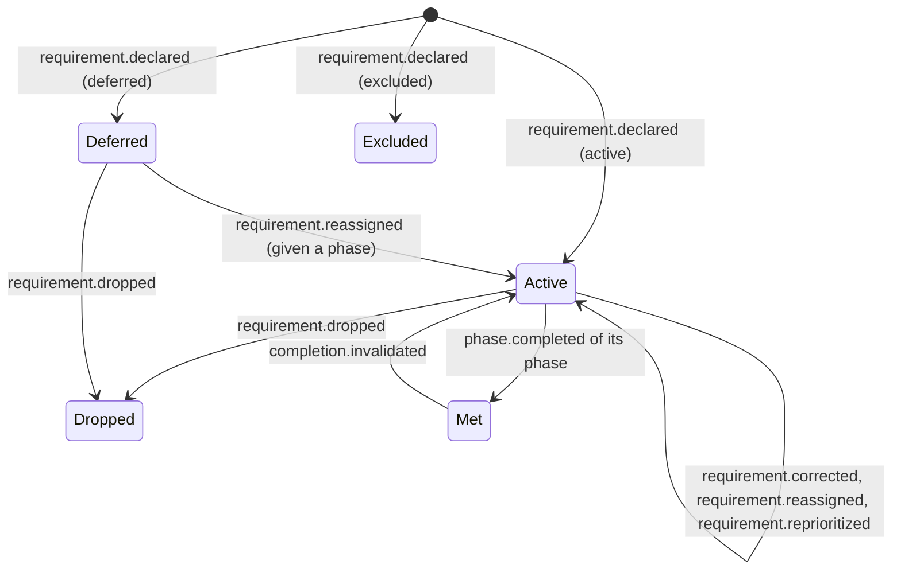
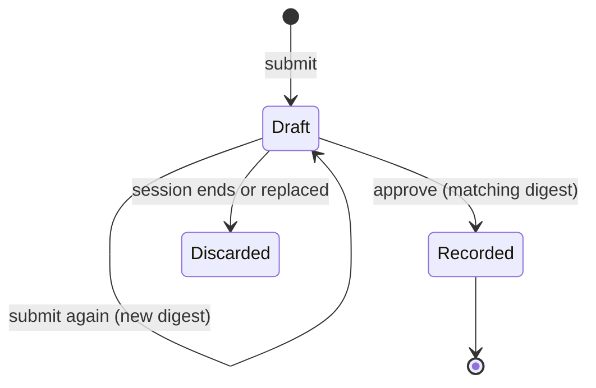
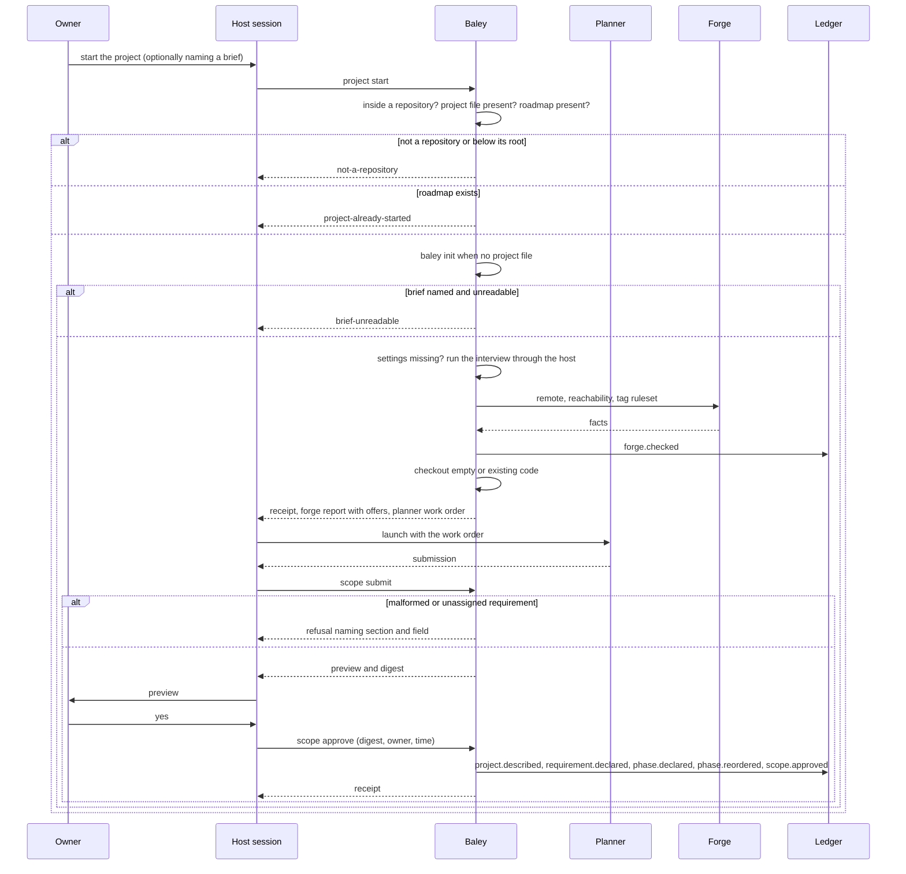
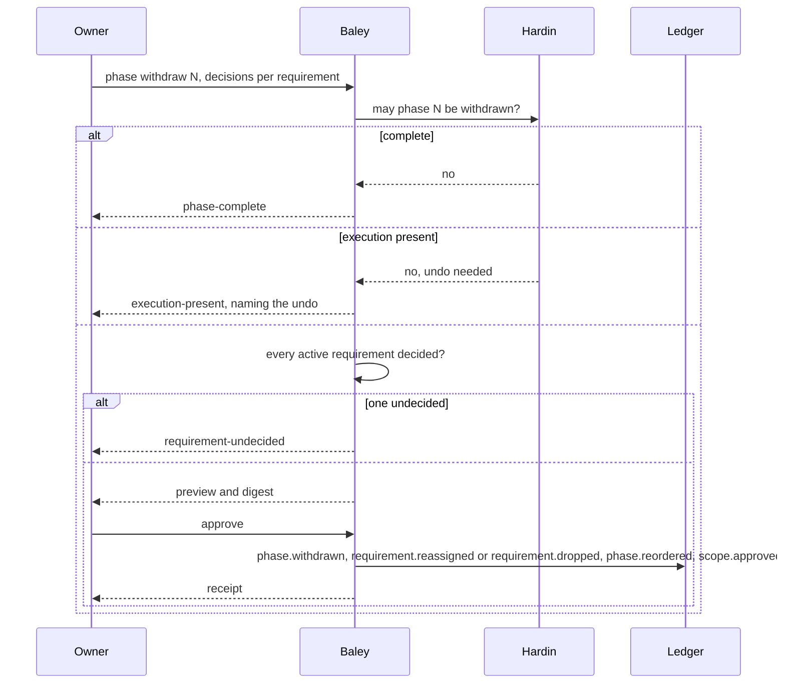

# 0004: Starting a project and changing scope

| | |
|---|---|
| Status | Accepted |
| Design issue | [#46](https://github.com/crenshawdev/baley/issues/46), [#45](https://github.com/crenshawdev/baley/issues/45); build issues [#23](https://github.com/crenshawdev/baley/issues/23), [#25](https://github.com/crenshawdev/baley/issues/25) |
| Requirement prefix | PRJ |
| Applies | [0002: System design](0002-system-design.md) |
| Related | ADRs: [0004](../adr/0004-project-identity.md), [0006](../adr/0006-no-markdown-records.md), [0007](../adr/0007-forge-anchors.md), [0009](../adr/0009-served-instructions.md) · C4 view: components ([0002](0002-system-design.md) Figure 4) |

The current design of this area, and nothing else. Edit it in place when the design changes; git holds the history. It describes the design only, never the work still to do.

## 1. Purpose and scope

This area decides how a project gets its first scope and how an approved scope changes afterwards:

- starting a project: the project description, the first requirements and the first roadmap, as one submission the owner approves;
- the roadmap commands: declaring, editing, reordering and withdrawing a phase;
- the requirement commands: declaring, correcting, reassigning and dropping a requirement;
- the backlog: a requirement is a story, and the backlog is the stories in priority order;
- what the start checks on the forge and in the settings, and what it offers to fix.

It does not decide a story's acceptance criteria (truths), their revision, sprint planning or plans ([0005: Context, plans and acceptance](0005-context-plans-and-acceptance.md)), how execution is undone ([0011: Milestones, landing, undo and pause](0011-milestones-landing-undo-pause.md)), how a repository or ruleset is created on the forge (0011), how settings are written ([0003: Configuration and routing](0003-configuration-and-routing.md)), or how the owner's approval reaches Baley from a host session ([0012: Host interface](0012-host-interface.md)).

Hand-offs: `baley init` ([0001](0001-evidence-ledger.md), EVD-R17) gives the repository its project id and file; this area's start runs it when it has not been run. The `roadmap` and `phase` views ([0001](0001-evidence-ledger.md)) serve what this area records to Hardin, context authoring and progress ([0013](0013-next-action-and-progress.md)). The planner that drafts the first scope is dispatched with a work order ([0002](0002-system-design.md) section 8) and routed by [0003](0003-configuration-and-routing.md).

In the component view of [0002](0002-system-design.md) (Figure 4) this area is one of the domain areas; it uses Hardin for what may happen next, the work order composer for the planner's dispatch, and the ports for the ledger, git and the forge.

## 2. Terms

| Term | Meaning |
|---|---|
| Project description | What the project is, its core value and its constraints, in the owner's words. |
| Requirement | One numbered statement of what the project must do, with a status: `active`, `deferred` or `excluded`. A requirement is a story: it carries its own acceptance criteria (truths), written in [0005](0005-context-plans-and-acceptance.md). |
| Backlog | The requirements in priority order. A story in no sprint waits in the backlog. |
| Phase | One working increment of the roadmap: a number, a name, a goal, detail text, dependencies on other phases, and the stories committed to it. A phase is a sprint ([0005](0005-context-plans-and-acceptance.md)). |
| Roadmap | The ordered list of phases. |
| Scope | The description, the requirements and the roadmap together. |
| Submission | A typed draft of a scope change, whole and validated, identified by its digest. Nothing in it is recorded until it is approved. |
| Approval | The owner's yes to one submission, bound to its digest, with the owner and the time. |
| Preview | The roadmap and requirement changes a submission would make, shown before approval. |
| Phase number | A whole number given to a phase when it is declared. It never changes and is never reused. |
| Order | The position of a phase in the roadmap: a separate fact from its number, changed by reorder. |
| Truth | One acceptance criterion of a story, in the sentence form [0005](0005-context-plans-and-acceptance.md) defines. A truth has a version. |
| Context | A sprint's approved goal and the truth versions of its committed stories at the time ([0005](0005-context-plans-and-acceptance.md)). |
| Withdraw | Remove a phase from the roadmap, keeping every record of it. |
| Brief | A file the owner points the start at, holding a description of the project written elsewhere. |
| Survey | The planner's reading of an existing codebase before drafting the first scope. |

## 3. Requirements

| Id | Rule | Why | Depends on | Status |
|---|---|---|---|---|
| PRJ-R1 | One command, `project start`, starts a project in a new repository and in an existing codebase alike. Baley reads the checkout: when it holds source files and commits, the planner's work order includes a survey of what exists before drafting; when it is empty, it does not. The records are the same either way. | One contract to learn and test; Baley can tell the two cases apart itself. | SYS-P2 | Active |
| PRJ-R2 | The start records one submission, approved by the owner by digest, all or nothing: the project description, the first requirements and the first roadmap. Nothing is recorded before the approval. | Scope exists only once the owner has said yes to the whole of it. | SYS-P5, EVD-R2 | Active |
| PRJ-R3 | Every field of a submission is validated before any event is recorded; a malformed submission is refused naming the section and the field at fault. | A refusal that names the fault is fixable at once. | SYS-P3 | Active |
| PRJ-R4 | Requirements carry a priority order, and an active requirement is committed to at most one phase that is not complete; one committed to none waits in the backlog. A submission that commits one to two such phases is refused naming the requirement. | The backlog is the order of what is promised; a sprint commits from it. | PRJ-R3, PLN-R1 | Active |
| PRJ-R5 | A brief named with `--brief <file>` is read before anything else and handed to the planner inside its work order; an unreadable brief is refused naming the file, and nothing is recorded. | The owner's own writing is the best input, and a failure to read it must not leave a half-started project. | PRJ-R1 | Active |
| PRJ-R6 | On a repository with no project, the start runs `baley init` first; `baley init` remains its own command. On a project that already has a roadmap, the start is refused with `project-already-started`; changes go through the scope-change commands. | One front door for a new project; one record of how the project began. | EVD-R17, ADR 0004 | Active |
| PRJ-R7 | There is no research step. Reading the codebase and the problem is part of the planner's work order; only the approved submission is recorded. | Research prose is not evidence of anything; the approved scope is. | ADR 0006 | Active |
| PRJ-R8 | The start checks the forge: a remote exists, the forge is reachable, and the tag ruleset that anchors rely on is in place; it records what it found as `forge.checked`. When something is missing it offers to create it; creation is an external step run only on the owner's approval, under claim, act, record, by [0011](0011-milestones-landing-undo-pause.md). A project with no forge runs unanchored and the ledger says so. | Anchors need a forge, and the owner should learn that at the start, not at the first landing. | ADR 0007, SYS-P5, SYS-P7 | Active |
| PRJ-R9 | When the start finds no global settings file, or no settings in the project file, it runs the settings interview of [0003](0003-configuration-and-routing.md) as part of the start: the global file first when it is missing, then the project's settings. When both exist it runs nothing. The interview reaches the owner through the terminal when the start is run there, and through the host's question mechanism when it is run from a session. | A new user gets a working setup in one sitting; an existing user is not asked again. | CFG-R11, SYS-P12 | Active |
| PRJ-R10 | A phase's number is assigned when it is declared, as the next whole number, and never changes. Its order is a separate recorded fact, changed by `phase reorder`. Inserting a phase is declaring it and reordering it. Decimal numbers do not exist. | Every reference to a phase in the record stays true forever. | EVD-R2 | Active |
| PRJ-R11 | One phase declaration shape is used by the start, by `phase declare` and by every later edit: name, goal, detail text, dependencies on other phases, and the requirements it serves. Editing records a new declaration and keeps the earlier one. | One shape to validate and serve. | PRJ-R3 | Active |
| PRJ-R12 | A phase with no execution recorded (declared, context approved, or plans approved) may be withdrawn directly. The owner decides, for each active requirement it served, the phase it moves to or that it is dropped, and approves the previewed roadmap and requirement changes. | Scope can shrink, and every promise it carried is accounted for. | PRJ-R4, PRJ-R13 | Active |
| PRJ-R13 | A phase whose execution has started is withdrawn only after its execution is undone (`phase.undone`, [0011](0011-milestones-landing-undo-pause.md)). Until then `phase withdraw` is refused with `execution-present`, naming the phase and the undo it needs. A complete phase is never withdrawn; the request is refused with `phase-complete`. | Removing a phase from the roadmap must not leave its code in the repository unaccounted for, and finished work stays finished. | SYS-P4 | Active |
| PRJ-R14 | A story's truths may be revised after they were approved, including after a sprint that committed the story has started execution. A truth whose text changes gets the next version; an unchanged truth keeps its version; earlier versions are kept. The operation is [0005](0005-context-plans-and-acceptance.md)'s `story truths submit`. | The owner's understanding changes, and the record must follow it without losing history. | EVD-R2 | Active |
| PRJ-R15 | After a revision, a plan bound to an older truth version is no longer approved for execution; the sprint is re-planned before more work runs, and committed code stays. A completion based on older truths stops applying. | Work is measured against the truths in force. | PRJ-R14, PLN-R4, [0007](0007-verification.md) | Active |
| PRJ-R16 | A revision is refused with `dispatch-active` while a worker is dispatched on a phase that committed the story. | A running worker must finish or be stopped under the truths it was given. | PRJ-R14 | Active |
| PRJ-R17 | A requirement's wording is corrected by `requirement edit`, at any time, for any active requirement; every earlier wording is kept. Correcting a requirement no phase serves (dropped or excluded) is refused with `requirement-not-served`. | One place to fix wording, and no editing of what the project no longer promises. | EVD-R2 | Active |
| PRJ-R18 | A request that names a phase, requirement or plan that does not exist is refused with `no-such-phase`, `no-such-requirement` or `no-such-plan`, naming it. "Unavailable" is answered only for a temporary condition. | A mistake must read as a mistake. | SYS-P10 | Active |
| PRJ-R19 | Every scope change (start, declare, edit, reorder, withdraw, requirement declare, edit, reassign, drop, context revise) is a submission with a preview and an owner approval by digest, recorded as events that keep every earlier record. | Scope changes only with a record of what changed, who approved it and when. | SYS-P5, SYS-P6 | Active |
| PRJ-R20 | The project description is recorded as `project.described` on the project stream and served to refinement and planning ([0005](0005-context-plans-and-acceptance.md)) beside the roadmap. It is revised the same way as any scope change. | The planner and the analyzer work from what the owner said the project is. | PRJ-R2 | Active |

## 4. Roles and actors

| Actor | Receives | Returns | Model and effort from |
|---|---|---|---|
| Owner | Previews; the interview questions; the forge report and offers | The description and answers in the session; approvals by digest; requirement decisions on a withdraw | Not applicable |
| Planner (dispatched worker) | A work order: the project description so far, the brief if any, the survey instruction when the checkout has code, the declaration shape, the truth and requirement rules | A typed submission: description, requirements, roadmap | `roles.planner.model`, `roles.planner.effort` ([0003](0003-configuration-and-routing.md)) |
| Host session | The planner's work order to launch; the preview and the questions to relay | The owner's approval and answers | Not applicable |
| Baley: this area | Submissions and approvals | Previews, refusals, receipts, events | Not applicable |
| Hardin ([0002](0002-system-design.md)) | A scope change request | Whether it may happen now (execution present, dispatch active, phase complete) | Not applicable |
| Forge adapter ([0011](0011-milestones-landing-undo-pause.md)) | A check request; a create request on approval | Remote, reachability and ruleset facts; the created repository or ruleset | Not applicable |

The analyzer and the plan checker take no part in this area; they act on a story's refinement and a sprint's plans ([0005](0005-context-plans-and-acceptance.md)).

## 5. Commands and operations

Every operation here is a typed operation on the host interface, reachable from a session through the stub skill that names it ([ADR 0009](../adr/0009-served-instructions.md)) and from the command line under `baley project`, `baley phase`, `baley requirement` and `baley context`. Each change follows the same three steps: submit (returns a preview and a digest), approve (the owner's yes to that digest), record. A submission that is not approved is a draft held by Baley until it is approved, replaced or the session ends; a draft is never a record.

### project start

- **Inputs:** the working directory; optional `--brief <file>`.
- **Outputs:** a receipt naming what the start did and found: `baley init` run or already done; settings interview run or not needed; the forge report (`forge.checked`) with any offer to create; the checkout classification (empty or existing code); the planner's work order id.
- **Refusals:**

  | Code | When | Requirement |
  |---|---|---|
  | `not-a-repository` | The directory is not inside a git repository, or is below the root (names the root) | EVD-R17 |
  | `project-already-started` | The project already has a roadmap | PRJ-R6 |
  | `brief-unreadable` | The brief cannot be read (names the file) | PRJ-R5 |
  | `config-unavailable` | The settings cannot be read after the interview | CFG-R9 |

### scope submit

- **Inputs:** a submission: description (what, core value, constraints), requirements (id, sentence, status), roadmap (phases in order, each with the declaration shape), the work order id it answers.
- **Outputs:** the preview (the roadmap and requirements as they would be recorded), the submission digest.
- **Refusals:**

  | Code | When | Requirement |
  |---|---|---|
  | `malformed-submission` | A field is missing, blank or off type (names section and field) | PRJ-R3 |
  | `requirement-double-assigned` | An active requirement is committed to two open phases (names it) | PRJ-R4 |
  | `dependency-cycle` | Phase dependencies form a cycle (names the phases) | PRJ-R11 |
  | `project-already-started` | A roadmap exists | PRJ-R6 |

### scope approve

- **Inputs:** the submission digest; the owner and the time ([0012](0012-host-interface.md) says how a session establishes both).
- **Outputs:** the events recorded: `project.described`, one `requirement.declared` per requirement, one `phase.declared` and `phase.reordered` per phase, `scope.approved` binding the digest; the receipt.
- **Refusals:**

  | Code | When | Requirement |
  |---|---|---|
  | `stale-draft` | A newer submission for the same change exists (names the first differing part) | PRJ-R19 |
  | `unknown-draft` | No draft with that digest is held | PRJ-R19 |

### phase declare

- **Inputs:** the declaration shape: name, goal, detail, dependencies, requirements served; optional position (default: last).
- **Outputs:** preview and digest; on approval `phase.declared` with the next number and `phase.reordered`.
- **Refusals:** `malformed-submission`, `requirement-double-assigned`, `dependency-cycle`, `no-such-requirement`, `no-such-phase` (a dependency that does not exist) (PRJ-R3, PRJ-R4, PRJ-R11, PRJ-R18).

### phase edit

- **Inputs:** a phase number and the fields that change (name, goal, detail, dependencies, requirements served).
- **Outputs:** preview and digest; on approval a new `phase.declared` for the same number, keeping the earlier one.
- **Refusals:** as `phase declare`, plus `no-such-phase`, plus `phase-complete` when the requirements served would change on a complete phase (PRJ-R13).

### phase reorder

- **Inputs:** the full order of phase numbers.
- **Outputs:** preview and digest; on approval `phase.reordered`.
- **Refusals:** `no-such-phase`, `order-incomplete` (a phase missing or repeated), `dependency-order` (a phase placed before one it depends on) (PRJ-R10, PRJ-R11, PRJ-R18).

### phase withdraw

- **Inputs:** a phase number; for each active requirement it serves, the phase it moves to or `drop`.
- **Outputs:** preview (the roadmap without the phase, the requirements' new phases or dropped status) and digest; on approval `phase.withdrawn`, one `requirement.reassigned` or `requirement.dropped` per requirement, `phase.reordered`.
- **Refusals:**

  | Code | When | Requirement |
  |---|---|---|
  | `no-such-phase` | The phase does not exist | PRJ-R18 |
  | `execution-present` | Execution has started and is not undone (names the phase and the undo) | PRJ-R13 |
  | `phase-complete` | The phase is complete | PRJ-R13 |
  | `requirement-undecided` | An active requirement it serves has no decision (names it) | PRJ-R12 |
  | `no-such-phase` | A requirement is moved to a phase that does not exist | PRJ-R18 |

### requirement declare, requirement edit, requirement reassign, requirement drop

- **Inputs:** `declare`: sentence, status, phase served. `edit`: id, new sentence. `reassign`: id, new phase. `drop`: id.
- **Outputs:** preview and digest; on approval `requirement.declared`, `requirement.corrected`, `requirement.reassigned` or `requirement.dropped`.
- **Refusals:**

  | Code | When | Requirement |
  |---|---|---|
  | `no-such-requirement` | The id does not exist | PRJ-R18 |
  | `no-such-phase` | The phase does not exist | PRJ-R18 |
  | `requirement-not-served` | `edit` on a dropped or excluded requirement | PRJ-R17 |
  | `requirement-shipped` | `reassign` or `drop` on a requirement a complete phase served | PRJ-R13 |
  | `malformed-submission` | Blank sentence or unknown status | PRJ-R3 |

### backlog reorder

- **Inputs:** the full priority order of active and deferred requirement ids.
- **Outputs:** preview and digest; on approval `requirement.reprioritized`.
- **Refusals:** `no-such-requirement`, `order-incomplete` (an id missing or repeated) (PRJ-R4, PRJ-R18).

### Revising a story's truths

The operation is `story truths submit` and `story truths approve` in [0005](0005-context-plans-and-acceptance.md); PRJ-R14 to PRJ-R16 are the rules it applies to a story already committed to a sprint.

## 6. Records

### project.described (event, `project` stream)

| Field | Type | Meaning |
|---|---|---|
| `what` | text | What the project is |
| `core_value` | text | The one thing it must do well |
| `constraints` | list of text | What it must not do or depend on |
| `submission` | digest | The submission this came from |

### requirement.declared, requirement.corrected, requirement.reassigned, requirement.reprioritized, requirement.dropped (events, `roadmap` stream)

| Field | Type | Meaning |
|---|---|---|
| `id` | requirement id | Assigned at declaration, never reused |
| `sentence` | text | The wording (declared, corrected) |
| `status` | `active`, `deferred`, `excluded`, `dropped` | The status after the event |
| `phase` | phase number or absent | The phase it is committed to (declared, reassigned); absent means the backlog |
| `order` | list of requirement ids | The full priority order after the event (reprioritized) |
| `submission` | digest | The submission this came from |

### phase.declared, phase.reordered, phase.withdrawn (events, `roadmap` stream)

| Field | Type | Meaning |
|---|---|---|
| `number` | integer | The phase's permanent number (declared, withdrawn) |
| `name`, `goal` | text | (declared) |
| `detail` | payload reference | The detail text as a `record` payload (declared) |
| `depends_on` | list of phase numbers | (declared) |
| `requirements` | list of requirement ids | The active requirements served (declared) |
| `order` | list of phase numbers | The full order after the event (reordered) |
| `submission` | digest | The submission this came from |

### scope.approved (event, `project` stream)

| Field | Type | Meaning |
|---|---|---|
| `submission` | digest | The approved submission |
| `kind` | enum | `start`, `phase-declare`, `phase-edit`, `phase-reorder`, `phase-withdraw`, `requirement-*`, `context-revise` |
| `owner`, `at` | actor, time | Who approved and when |

### forge.checked (event, `project` stream)

| Field | Type | Meaning |
|---|---|---|
| `remote` | URL or absent | The remote found |
| `reachable` | bool | Whether the forge answered |
| `ruleset` | `present`, `missing`, `unknown` | The tag ruleset anchors rely on |
| `offered` | list | What the start offered to create |

### story.refined (event, `roadmap` stream; defined in [0005](0005-context-plans-and-acceptance.md))

This area adds one rule to it: each truth carries a `version`, and a revision records a new `story.refined` whose unchanged truths keep their versions.

### Views

| View | Key | Content |
|---|---|---|
| `roadmap` | project | The ordered phases with their current declaration, status and committed stories; the requirements in priority order with status, wording, phase and truth count; the project description |
| `phase` | project, phase | Adds the current context (truth versions), plans, execution and completion state Hardin needs |

## 7. States

```mermaid
stateDiagram-v2
  [*] --> Declared: phase.declared
  Declared --> Declared: phase.declared (edit), phase.reordered
  Declared --> ContextApproved: every committed story refined (story.refined)
  ContextApproved --> ContextApproved: story.refined (revision)
  ContextApproved --> Planned: plan.approved
  Planned --> ContextApproved: story.refined (revision; plans invalid)
  Planned --> Executing: first task admitted
  Executing --> Planned: phase.undone
  Executing --> Complete: phase.completed
  Complete --> Executing: completion.invalidated
  Declared --> Withdrawn: phase.withdrawn
  ContextApproved --> Withdrawn: phase.withdrawn
  Planned --> Withdrawn: phase.withdrawn
  Withdrawn --> [*]
```

*Figure 1. States of a phase as this area sees them. Execution and completion transitions belong to [0006](0006-execution.md) and [0007](0007-verification.md); a withdraw from Executing is refused until `phase.undone` returns it to Planned; Complete is never withdrawn.*

*Figure 2. States of a requirement. Excluded and Dropped are final; Met is derived from its phase's completion ([0007](0007-verification.md)).*

*Figure 3. States of a submission. Only Recorded produces events.*

## 8. Workflows

*Figure 4. Starting a project.*

*Figure 5. Withdrawing a phase.*

The revision of a story's truths is [0005](0005-context-plans-and-acceptance.md) Figure 4.

## 9. Settings

Not applicable. This area reads no setting of its own. The start runs the settings interview of [0003](0003-configuration-and-routing.md) when settings are missing (PRJ-R9), and the planner's route comes from `roles.planner.model` and `roles.planner.effort` ([0003](0003-configuration-and-routing.md)).

## 10. Instructions served

| Instruction | Served to | Carries requirements |
|---|---|---|
| Start planner | The planner, inside the start work order: the description so far, the brief, the survey instruction when the checkout has code, the declaration shape, the requirement statuses, the assignment rule, the truth rules of [0005](0005-context-plans-and-acceptance.md) | PRJ-R1, PRJ-R4, PRJ-R7, PRJ-R11 |
| Scope change stubs | The host session, as the stub skills for start, phase, requirement and context revise: which operation to call and that the owner approves the preview | PRJ-R19 |

## 11. Build status

The code today is the Cadence engine crate awaiting rename. It parses and edits `ROADMAP.md` and `REQUIREMENTS.md` under `.planning/`, which this design replaces.

| Requirement | Status | Where |
|---|---|---|
| PRJ-R1, PRJ-R2, PRJ-R5, PRJ-R6, PRJ-R7 | Not built | No start operation exists; `baley init` is not built (#23) |
| PRJ-R3 | Partly built | Context submissions are validated field by field (`crates/cadence/src/context/validation.rs:15-101`); no scope submission exists |
| PRJ-R4 | Not built | `REQUIREMENTS.md` rows are seeded at plan-submit (`crates/cadence/src/plan_service.rs:327-345`); no assignment check |
| PRJ-R8, PRJ-R9 | Not built | |
| PRJ-R10 | Not built | Phase ids parsed as floating-point numbers (`crates/cadence/src/derivation/model.rs:22`); order is the textual order of `ROADMAP.md` (`crates/cadence/src/derivation/parse.rs:150-191`) |
| PRJ-R11, PRJ-R12, PRJ-R13 | Not built | No phase declaration, edit or withdraw; `ROADMAP.md` is edited only to tick a phase (`crates/cadence/src/verification/completion.rs:161-179`) |
| PRJ-R14, PRJ-R15, PRJ-R16 | Not built | A second context approval is refused `native-context-exists` (`crates/cadence/src/context_service.rs:129-137`); truth version is always 1 (`crates/cadence/src/context/persistence.rs:33-49`); the plan check accepts only version 1 (`crates/cadence/src/plan/limits.rs:233-236`) |
| PRJ-R17 | Not built | |
| PRJ-R18 | Partly built | Context intake answers `unavailable` for a phase not on the roadmap (`crates/cadence/src/context_service.rs:33-44`) |
| PRJ-R19 | Partly built | Context submit, draft and approve by digest with `stale-draft` and `unknown-draft` (`crates/cadence/src/context_service.rs:86-152`); drafts are memory-only and lost on restart (`crates/cadence/src/context_service.rs:95-98`); owner and time are any non-blank strings |
| PRJ-R20 | Not built | `PROJECT.md` is never read or written (`crates/cadence/src`, no reader) |

## 12. Open questions

| Question | Decided by |
|---|---|
| How a session establishes the owner's identity and the time of an approval, and how the interview's questions reach the owner from a session | [0012: Host interface](0012-host-interface.md) |
