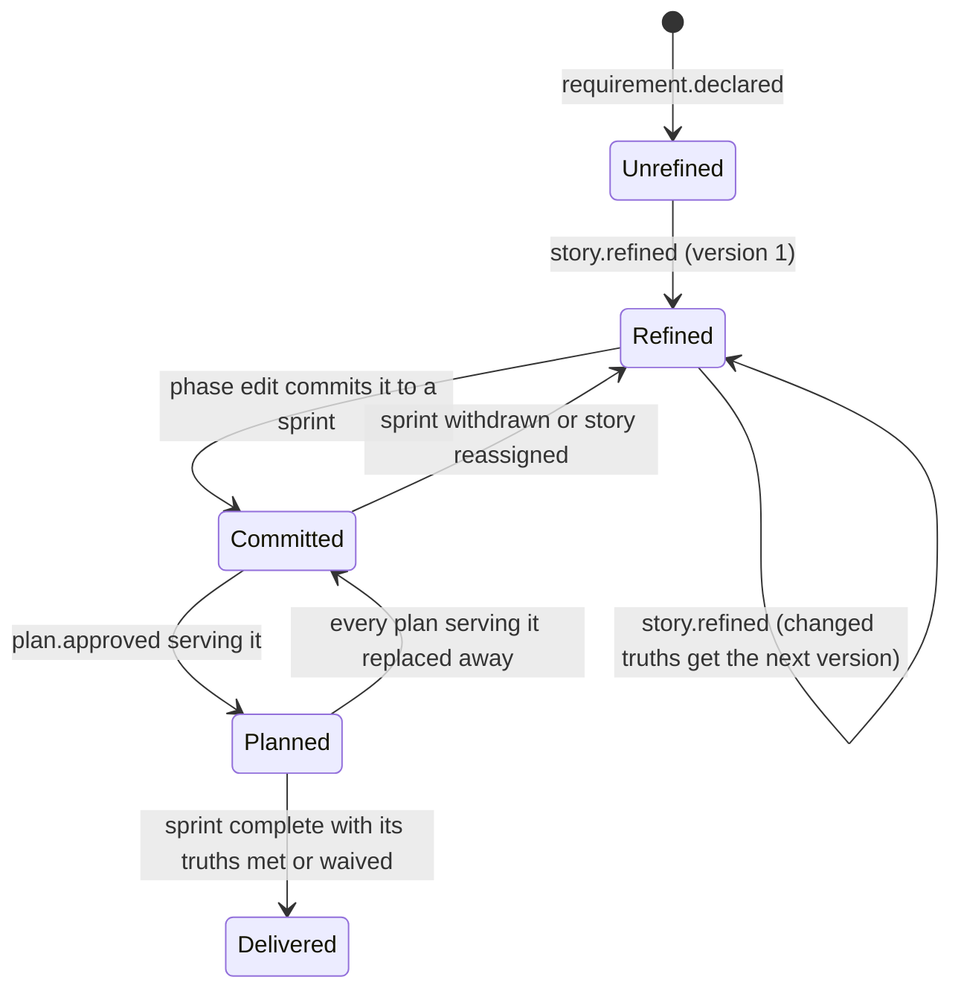
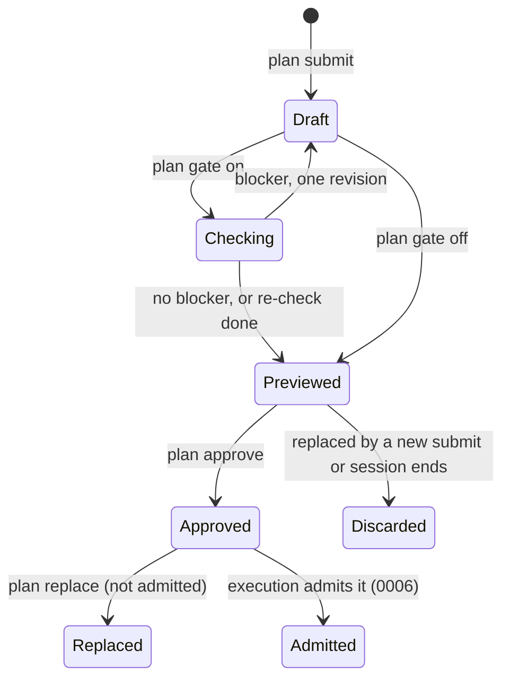
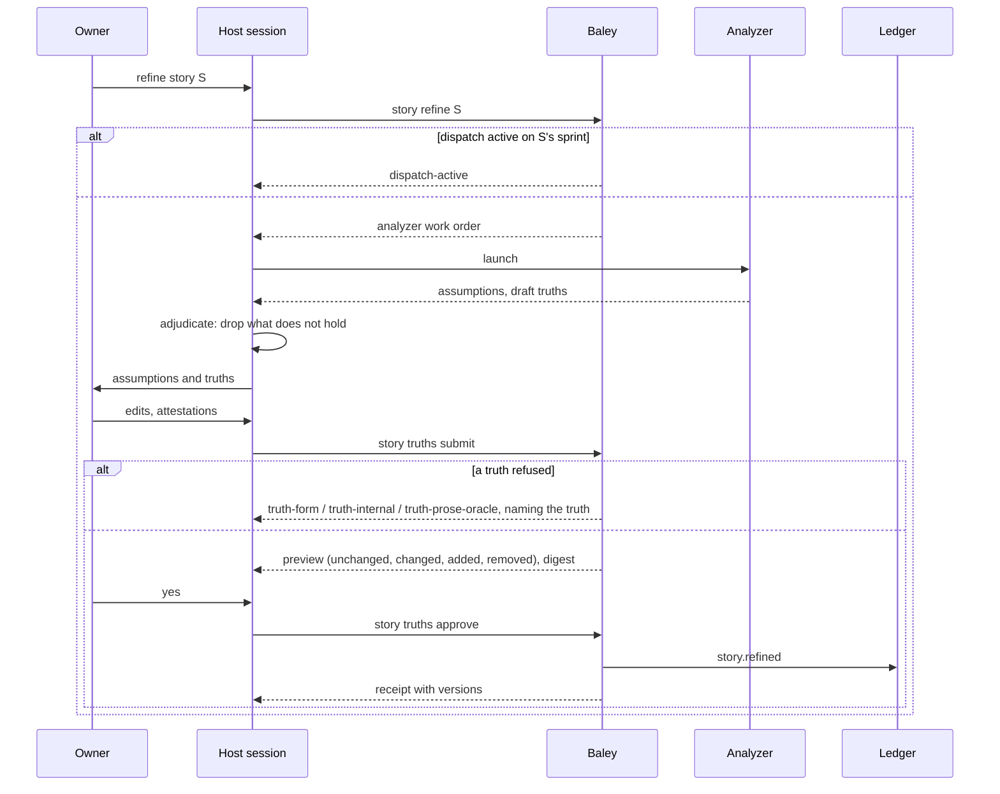
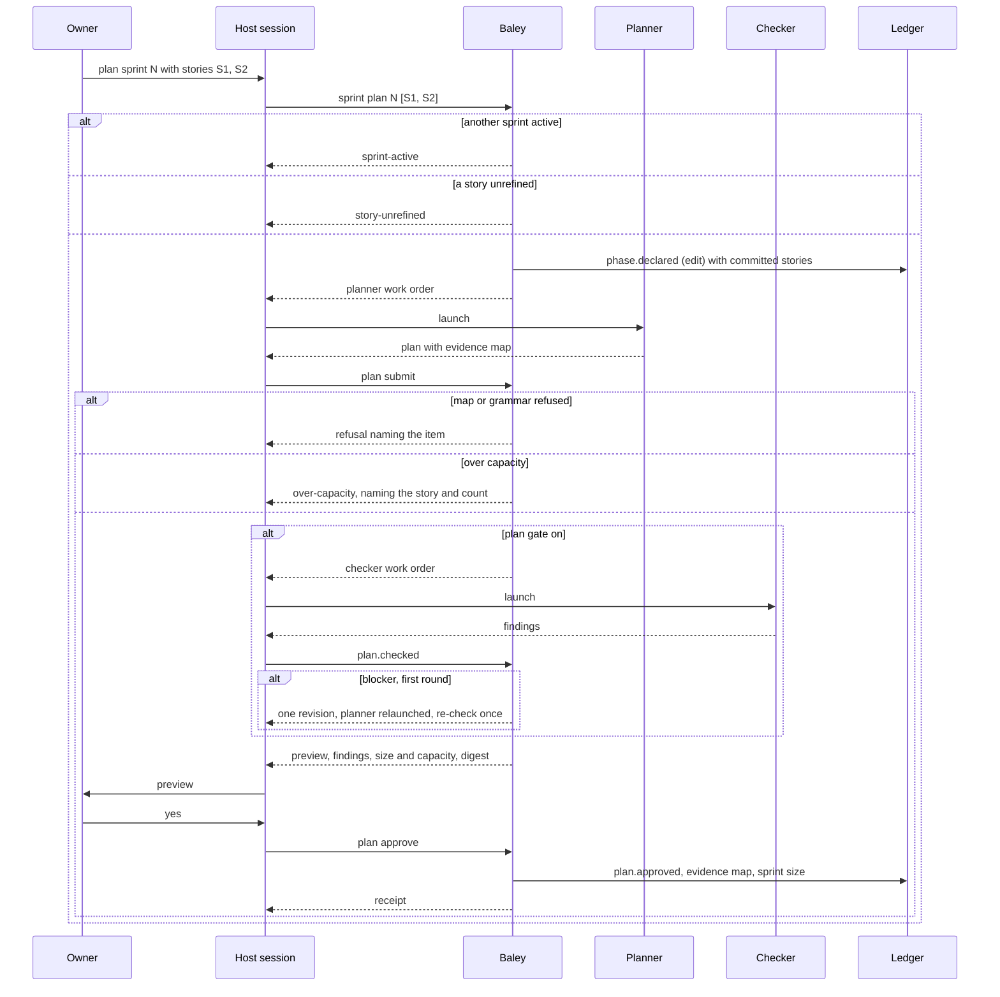
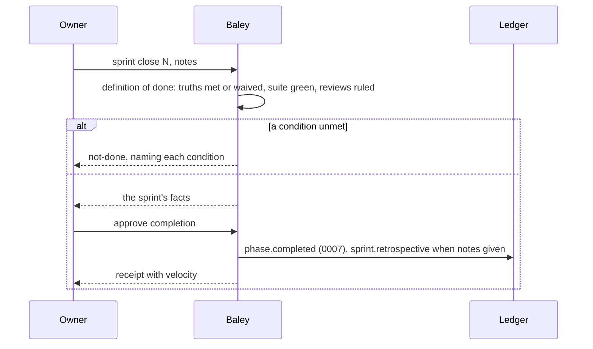

# 0005: Context, plans and acceptance

| | |
|---|---|
| Status | Draft |
| Design issue | none; build issue [#25](https://github.com/crenshawdev/baley/issues/25) |
| Requirement prefix | PLN |
| Applies | [0002: System design](0002-system-design.md) |
| Related | ADRs: [0006](../adr/0006-no-markdown-records.md), [0009](../adr/0009-served-instructions.md), acceptance as stories and sprints [TARGET] · C4 view: components ([0002](0002-system-design.md) Figure 4) |

The current design of this area, and nothing else. Edit it in place when the design changes; git holds the history. It describes the design only, never the work still to do.

## 1. Purpose and scope

Baley runs a project the way a Scrum team runs one, and this area is where that is codified: the backlog of stories, each with its acceptance criteria; the sprint that commits stories and is planned as tasks; the plan check; and what has to be true for a sprint to be done. It decides:

- what a story's acceptance criteria (truths) are, how they are written, and who approves them;
- what a sprint is, how stories are committed to it, and how its size and capacity are counted;
- the plan: its grammar, its file leases, its tasks, its suite, and the evidence map that binds each truth to the one check that proves it;
- how a plan is checked, approved, numbered and replaced;
- the rules Baley gives the planner for deriving tests, and where Baley's say over the project's tests ends;
- what "done" means for a sprint, and the retrospective.

It does not decide how tasks are admitted and run, red then green, or the suite gate ([0006: Execution](0006-execution.md)); how verdicts are returned and a truth's status derived ([0007: Verification](0007-verification.md)); when a review fires and what a provider review looks like ([0008: Review](0008-review.md)); how the backlog and sprints are declared, edited, reordered and withdrawn ([0004: Starting a project and changing scope](0004-starting-a-project-and-changing-scope.md)); or how a planner, analyzer or checker is routed ([0003](0003-configuration-and-routing.md)).

Hand-offs: 0004 declares stories and sprints; this area refines stories with truths and fills a sprint with plans. 0006 admits an approved plan. 0007 verifies against the evidence map this area recorded. The work order composer ([0002](0002-system-design.md) section 8) dispatches the analyzer, the planner and the checker with the instructions of section 10.

In the component view of [0002](0002-system-design.md) (Figure 4) this area is one of the domain areas.

## 2. Terms

| Term | Meaning |
|---|---|
| Backlog | The project's requirements in priority order. |
| Story | One requirement (0004). It carries its own acceptance criteria. |
| Truth | One acceptance criterion of a story: one sentence saying what a person can observe when the story is delivered. A truth has a version. |
| Refinement | Writing or revising a story's truths with the owner. |
| Sprint | One phase (0004): a goal and the stories committed to it. One sprint is active per project. |
| Sprint planning | Committing stories to a sprint and writing its plans. |
| Increment | What a completed sprint delivers: something the owner can use, proven by its stories' truths and the suite. |
| Unit of work | One task: one signed commit with one narrowest verify command. |
| Size | The number of tasks a story's approved plans need; a sprint's size is the sum over its stories. |
| Capacity | The owner's ceiling on a sprint's size, in tasks. |
| Velocity | Tasks completed per sprint, as a fact shown, never a decision input. |
| Plan | One typed document for a sprint: the stories it serves, its file lease, its tasks, its suite and its evidence map. A sprint may have several plans. |
| Lease | The exact files and directories a plan's tasks may change. |
| Suite | The project's test command, run by Baley at plan close ([0006](0006-execution.md)). |
| Evidence map | For each truth a plan serves, the items that have to exist and be connected for the truth to hold, and how each is checked. |
| Check | The one test that proves a truth: cause its trigger, look for its outcome. |
| Artifact, link, observation | The other evidence kinds: a thing that must exist; a value one part hands another; something a person or live system must see. |
| Plan check | A review of a submitted plan by the checker, before the owner sees it. |
| Definition of done | The conditions a sprint must meet to be complete: every committed story's truths met or waived, the suite green, every review ruled. |
| Retrospective | The owner's notes at sprint close, recorded in the owner's words. |
| Analyzer | The dispatched role that surfaces assumptions and drafts truths during refinement. |
| Planner | The dispatched role that writes plans and evidence maps. |
| Checker | The dispatched role that reviews a plan. |

## 3. Requirements

| Id | Rule | Why | Depends on | Status |
|---|---|---|---|---|
| PLN-R1 | The backlog is the project's requirements in priority order; a story is a requirement, and a story carries its own truths. A sprint's truths are the sum of its committed stories' truths. | Acceptance criteria belong to the thing being promised, and a sprint promises a set of stories. | PRJ-R1, PRJ-R20 | Active |
| PLN-R2 | A truth is one sentence in a fixed form: `When <one trigger>, <one observer> sees / gets / is refused <one outcome>.`, or the property form `For any <input>, <observer> gets <outcome>.` One trigger (no "or" before the comma), one observer, one outcome; a second clause may only sharpen the same outcome. | A vague promise cannot be written, and seven cannot secretly be twenty. | | Active |
| PLN-R3 | Baley refuses a truth that is not in the form (`truth-form`), whose outcome names an internal such as a function or a field instead of something seen from outside (`truth-internal`), or whose expected value would come from a model call (`truth-prose-oracle`). The owner attests observability and a fixed oracle; Baley records the attestation and does not classify the sentence. | The answer must not move without the code moving, and the promise must be visible to a person. | PLN-R2 | Active |
| PLN-R4 | Truths are written with the owner during a story's refinement and approved by digest; they belong to the story, not to a plan. A truth whose text changes gets the next version; an unchanged truth keeps its version; every version is kept. Evidence written against an older version is stale. | Several plans deliver the same promises, and a promise that changed must not be proven by old evidence. | PLN-R1, PRJ-R14 | Active |
| PLN-R5 | There is no cap on truths per story. Baley shows the count; a story that reads too large is split by the planner with the owner's approval. | A number handed to the model becomes a target. | PLN-R17 | Active |
| PLN-R6 | Refinement dispatches the analyzer with the story, the project description, the roadmap and the code; it returns assumptions found and draft truths; the host session adjudicates them; the owner approves the truths. Assumptions the owner accepts are recorded with the refinement. | What the owner did not say is found before it is built on. | SYS-P2, SYS-P5 | Active |
| PLN-R7 | A sprint is a phase: a goal and the stories committed to it. Sprint planning commits stories in backlog order unless the owner reorders, and writes the sprint's plans. One sprint is active per project; a second is refused with `sprint-active` until the first is complete or withdrawn. | One sprint at a time is the discipline; the record shows which. | PRJ-R7, PRJ-R11 | Active |
| PLN-R8 | A sprint is a working increment: its exit proof is its committed stories' truths, each verified by its one check, plus the suite. There is no separate whole-application test command. | Progress is real at every step. | PLN-R19 | Active |
| PLN-R9 | Nobody estimates. A story's size is the number of tasks its approved plans need; a sprint's size is the sum. `planning.sprint_capacity` (tasks, default none) is the ceiling: a plan whose tasks would take the sprint over capacity is refused with `over-capacity`, naming the story and the count, and the story waits for the next sprint. Size changes only when a plan is approved or replaced. Velocity is shown per sprint and never used to decide. | Units of work are counted, not guessed, so there is no churn and no number for the model to hit. | PLN-R17 | Active |
| PLN-R10 | One sprint by default. The planner may propose splitting a story or a sprint; a split counts only when the owner approves it. | Scope never changes without the owner. | SYS-P5 | Active |
| PLN-R11 | A plan is typed content: sprint, plan number, the story ids it serves, `files` and `directories` (the lease: exact paths, no trailing separator on a file, at most 256 declarations, no duplicates, `files: []` only with directories), goal, context, notes, ordered `tasks` (unique id, title, files within the lease, action, one or more `verify` commands each naming the narrowest command that settles the task), the suite, and the evidence map. Unknown keys and prose bodies are refused (`typed-content`). Task prose never contributes paths. | Baley reads records, never documents. | ADR 0006, SYS-P3 | Active |
| PLN-R12 | The evidence map binds every truth a plan serves to evidence items of four kinds: `artifact`, `link`, `check`, `observation`. Each item names its truth and version and a one-line reason ("what change would break this"). Exactly one `check` per truth version across the sprint; a second is refused with `truth-check-limit`. A `check` names its command, its expected literal or property, its test file and function, its setup, its call, its `boundary` (the one unit it exercises) and its `fakes` (every filesystem, process and clock seam that unit touches). A `link` is allowed only where the truth's own words name the value crossing (`link-value-not-named`). An `observation` is written only when what it names can be seen at the sprint's close, and can never make a truth met, only `concerns` ([0007](0007-verification.md)). | The check is the truth; the other kinds are things the verifier inspects; nothing multiplies. | PLN-R4 | Active |
| PLN-R13 | Baley refuses at plan submit: a truth the plan serves with no item (`uncovered-truth`); an item naming no truth or a stale truth version (`evidence-item-truth`, `truth-version-mismatch`); a truth with items but no check (`truth-without-check`); a check with a blank command, expected value or test file (`check-command`, `check-expected`, `check-test-file`); a task file outside the lease (`lease`); a story not committed to the sprint (`story-not-in-sprint`); a plan for a sprint with no refined stories (`no-truths`); the same item id with a different definition across plans (`evidence-item-conflict`). | The map must be complete and consistent before anyone builds against it. | PLN-R11, PLN-R12 | Active |
| PLN-R14 | Plan numbers within a sprint are assigned in order and never reused. Replacing an approved plan needs its own owner approval naming the plan and the digest it replaces; a plan admitted to execution is not replaced (`admitted-plan`); a gap plan gets a new number ([0006](0006-execution.md)). | Every plan the record ever named can be found. | EVD-R2 | Active |
| PLN-R15 | A plan is submitted whole, previewed, held as a draft by Baley, and approved by the owner by digest with owner and time. Approving an older digest when a newer draft exists is refused with `stale-draft`, naming the first differing part. A retry of the same approval is answered once. Drafts survive a server restart and are discarded when replaced or when the session that made them ends. | The owner approves exactly what was shown. | SYS-P5, SYS-R6 | Active |
| PLN-R16 | Between submit and preview, when `review.triggers.plan.gate` is not `off`, Baley dispatches the checker with the plan and its stories' truths. The checker returns findings, each with a severity: a truth no task makes true is a blocker; a task no truth needs is a warning; a finding without severity is refused. A blocker buys one planner revision and one re-check, then the plan goes to the owner with the findings. Warnings never buy a round. The gate value says what the findings do ([0008](0008-review.md)). | The plan is judged against the goal before the owner spends time on it, at the cheapest effort, and the owner can turn it off. | PLN-R7, CFG-R12 | Active |
| PLN-R17 | Baley never hands the model a number to hit: no coverage percentage, test count, tests per file or truth count. The only numbers are the owner's settings, applied by Baley and reported as refusals when crossed. | Any number given to the model becomes a target. | | Active |
| PLN-R18 | The planner derives tests under the rules of section 10, compiled into Baley and served in the work order: one responsibility per test, one seam at most, the real logic that owns the decision, expected values from the requirement, tests that depend only on the project's language toolchain and its own test libraries, no program started, a fresh temporary directory as the one filesystem seam. The project's language and test command come from the project file (`workflow.test_command`) and its root manifest; Baley being written in Rust chooses nothing for the project. | Bounded, meaningful evidence in any language. | SYS-R8, CFG-R5 | Active |
| PLN-R19 | Baley owns truths, the evidence map, the red-then-green record for checks ([0006](0006-execution.md)) and the verdict ([0007](0007-verification.md)). The project owns how its tests are written and run: style, framework, count, coverage, mutation, CI. Baley ships one default test style as guidance and never refuses on style. CI status is information at landing, never acceptance evidence. | Acceptance is few and reviewed; tests are many and the developer's. | | Active |
| PLN-R20 | A sprint is complete when every committed story's truths are met or waived, the suite is green, and every review the sprint raised is ruled. Baley derives this from the record ([0007](0007-verification.md)); the owner's approval of completion is the sprint review. | Done means proven. | SYS-P4 | Active |
| PLN-R21 | At sprint close Baley shows the sprint's facts (tasks planned and done, checks red then green, suite runs, reviews and rulings, waivers, deviations, refusals hit) and takes the owner's notes as an optional `sprint.retrospective` record in the owner's words. | A decision the owner makes after a sprint is a scope or policy change, and the record says why. | PLN-R20 | Active |
| PLN-R22 | Stories are mirrored one way to forge issues and sprints to forge milestones through the forge adapter; forge edits are ignored; the ledger stays the truth. | Teammates who live on the forge see the backlog there. | SYS-P6, [0011](0011-milestones-landing-undo-pause.md) [TARGET] | Backlog |

## 4. Roles and actors

| Actor | Receives | Returns | Model and effort from |
|---|---|---|---|
| Owner | Draft truths and assumptions; plan previews; checker findings; sprint facts at close | Approvals by digest; reorders and splits; retrospective notes | Not applicable |
| Analyzer (dispatched) | The story, the project description, the roadmap, the code; the truth form and refusals | Assumptions found; draft truths | `roles.analyzer.*` ([0003](0003-configuration-and-routing.md)) |
| Planner (dispatched) | The sprint's goal and stories with their truths, the lease and task grammar, the evidence map grammar, the test derivation rules, the capacity ceiling as a fact | A typed plan with its evidence map; a proposed split when needed | `roles.planner.*` |
| Checker (dispatched) | The submitted plan and its stories' truths | Findings with severity | `roles.checker.*`, gated by `review.triggers.plan.gate` |
| Host session | Work orders to launch; drafts to put to the owner | The owner's answers and approvals; adjudicated analyzer and checker output | Not applicable |
| Baley: this area | Submissions, approvals | Previews, refusals, records | Not applicable |
| Hardin | A refinement, sprint or plan request | Whether it may happen now (sprint active, dispatch active, plan admitted) | Not applicable |

## 5. Commands and operations

Every change follows submit (preview and digest), approve (owner, by digest), record. Operations are reachable from a session through the stub skills ([ADR 0009](../adr/0009-served-instructions.md)) and from the command line under `baley story`, `baley sprint` and `baley plan`.

### story refine

- **Inputs:** a story id.
- **Outputs:** the analyzer's work order id; when it returns, the assumptions and draft truths for the owner.
- **Refusals:** `no-such-story` (PRJ-R18); `dispatch-active` when a worker is dispatched on a sprint that committed the story (PRJ-R16).

### story truths submit, story truths approve

- **Inputs:** `submit`: the story id and its truths (id, form, trigger, observer, verb, outcome, kind literal or property, the owner's observability and fixed-oracle attestations) and the accepted assumptions. `approve`: the digest, owner, time.
- **Outputs:** `submit`: preview marking each truth unchanged, changed (next version), added or removed; the digest. `approve`: `story.refined` recorded.
- **Refusals:**

  | Code | When | Requirement |
  |---|---|---|
  | `truth-form` | Not in the sentence form; a second trigger, observer or outcome | PLN-R2 |
  | `truth-internal` | The outcome names an internal | PLN-R3 |
  | `truth-prose-oracle` | The expected value would come from a model | PLN-R3 |
  | `truth-attestation` | An attestation missing or false | PLN-R3 |
  | `truth-id` | Blank or colliding truth id within the story | PLN-R4 |
  | `no-such-story` | | PRJ-R18 |
  | `stale-draft`, `unknown-draft` | | PLN-R15 |

### sprint plan

- **Inputs:** the sprint (phase) number; the stories to commit in order (default: the next backlog stories the owner picks).
- **Outputs:** the sprint's committed stories recorded through `phase edit` (0004); the planner's work order id.
- **Refusals:** `sprint-active` (PLN-R7); `no-such-phase`, `no-such-story` (PRJ-R18); `story-unrefined` when a committed story has no approved truths (PLN-R1); `story-in-sprint` when the story is committed to another open sprint (PRJ-R4).

### plan submit

- **Inputs:** the typed plan (PLN-R11) with its evidence map (PLN-R12).
- **Outputs:** the checker's work order when the plan gate is on; then the preview, the checker's findings, the plan's size and the sprint's size against capacity, and the digest.
- **Refusals:** every code of PLN-R13; `typed-content` (PLN-R11); `over-capacity` (PLN-R9); `sprint-not-active` (PLN-R7); `plan-check-blocker` after the one revision and re-check, carrying the findings (PLN-R16).

### plan approve

- **Inputs:** the digest, owner, time.
- **Outputs:** `plan.approved` with the next plan number; the evidence map recorded; the sprint's size updated.
- **Refusals:** `stale-draft`, `unknown-draft` (PLN-R15).

### plan replace

- **Inputs:** the plan number, the digest being replaced, the new plan.
- **Outputs:** as `plan submit` then `plan approve`, recording `plan.replaced`.
- **Refusals:** as `plan submit`; `admitted-plan` (PLN-R14); `no-such-plan` (PRJ-R18).

### sprint close

- **Inputs:** the sprint number; optional retrospective notes.
- **Outputs:** the sprint's facts; when the definition of done holds and the owner approves, `phase.completed` ([0007](0007-verification.md)) and `sprint.retrospective` when notes were given.
- **Refusals:** `not-done` naming each unmet condition (a story's truth unmet, the suite not green, a review unruled) (PLN-R20).

## 6. Records

### truth (part of `story.refined`, `roadmap` stream)

| Field | Type | Meaning |
|---|---|---|
| `story` | requirement id | The story it belongs to |
| `id` | truth id | Unique within the story |
| `version` | integer | Starts at 1; next on a text change |
| `form` | `when`, `for-any` | The sentence form |
| `trigger`, `observer`, `verb`, `outcome` | text | The sentence's slots; `verb` is `sees`, `gets` or `is refused` |
| `kind` | `literal`, `property` | Whether the outcome is one value or a property |
| `observable`, `fixed_oracle` | bool | The owner's attestations |

`story.refined` also carries the accepted assumptions (id, text) and the submission digest. A truth's status (`pending`, `met`, `concerns`, `unmet`, `waived`) is derived by [0007](0007-verification.md), never stored.

### plan (payload of `plan.approved`, `phase/<n>` stream)

| Field | Type | Meaning |
|---|---|---|
| `sprint`, `plan` | integers | The sprint and the plan number |
| `stories` | list of requirement ids | The stories it serves |
| `files`, `directories` | lists of paths | The lease |
| `goal`, `context`, `notes` | text | For the executor |
| `tasks` | list | `id`, `title`, `files`, `action`, `verify` |
| `suite` | command | The suite Baley runs at close |
| `evidence_map` | list of items | See below |
| `size` | integer | The number of tasks |

### evidence item

| Field | Type | Meaning |
|---|---|---|
| `id` | item id | Unique within the sprint |
| `truth`, `truth_version` | truth id, integer | The truth it serves |
| `kind` | `artifact`, `link`, `check`, `observation` | |
| `spec` | table | `artifact`: path or record. `link`: caller, callee, value. `check`: command, expected {literal or property, value}, test {file, function}, setup, call, boundary, fakes. `observation`: what is to be seen, by whom. |
| `reason` | text | What change would break this |

### plan.checked (event, `phase/<n>` stream)

| Field | Type | Meaning |
|---|---|---|
| `plan_digest` | digest | The submission checked |
| `findings` | list | severity (`blocker`, `warning`), location, claim, fix |
| `round` | 1 or 2 | First check or the re-check |

### plan.replaced (event), sprint.retrospective (event)

`plan.replaced`: plan number, old digest, new digest, owner, time. `sprint.retrospective`: sprint number, the owner's notes, the facts shown, owner, time.

### Views

| View | Key | Content |
|---|---|---|
| `backlog` | project | Stories in priority order with truth counts, refinement state, size when planned, the sprint each is committed to |
| `sprint` | project, sprint | Goal, committed stories, plans with sizes, capacity, size, tasks done, definition of done state, velocity of closed sprints |
| `plan` | project, sprint, plan | The approved plan, its evidence map, its check state |

## 7. States

*Figure 1. States of a story in this area. Withdrawn and dropped states are in [0004](0004-starting-a-project-and-changing-scope.md) Figure 2.*

*Figure 2. States of a plan. Admitted and later states belong to [0006](0006-execution.md).*

```mermaid
stateDiagram-v2
  [*] --> Planned: phase.declared with committed stories
  Planned --> Active: first plan.approved
  Active --> Active: plan.approved, plan.replaced, execution
  Active --> Done: definition of done holds
  Done --> Closed: owner approves completion; sprint.retrospective optional
  Active --> Planned: every plan replaced away
```

*Figure 3. States of a sprint as this area sees them. The phase lifecycle as a whole is [0004](0004-starting-a-project-and-changing-scope.md) Figure 1.*

## 8. Workflows

*Figure 4. Refining a story.*

*Figure 5. Sprint planning and a plan's submission, check and approval.*

*Figure 6. Closing a sprint.*

## 9. Settings

| Setting | Type | Default | Scope | Owner | Effect |
|---|---|---|---|---|---|
| `planning.sprint_capacity` | integer, min 1, or absent | absent (no ceiling) | both | 0005 | The ceiling on a sprint's size in tasks (PLN-R9) |
| `review.triggers.plan.gate` | see [0003](0003-configuration-and-routing.md) | `advisory` | both | [0008](0008-review.md) | Whether the checker runs and what its findings do (PLN-R16) |
| `workflow.test_command` | command | absent | project | [0006](0006-execution.md) | The suite named in every plan (PLN-R18) |
| `roles.analyzer.*`, `roles.planner.*`, `roles.checker.*` | see [0003](0003-configuration-and-routing.md) | | both | 0003 | The three roles' model and effort |

## 10. Instructions served

| Instruction | Served to | Carries requirements |
|---|---|---|
| Analyzer | The analyzer, in its refinement work order: the truth form, the three refusals, "surface assumptions, draft truths, never decide" | PLN-R2, PLN-R3, PLN-R6 |
| Planner | The planner, in its planning work order: the plan grammar, the lease rules, the evidence map grammar, one check per truth, the test derivation rules below, the capacity ceiling as a fact, "propose a split rather than overfill" | PLN-R5, PLN-R9 to PLN-R13, PLN-R17, PLN-R18 |
| Checker | The checker, in its check work order: the six dimensions (requirement coverage, task completeness, sequencing, goal-backward truths, scope sanity, proportionality), severity rules, "derive what must be true from the goal before opening the plan" | PLN-R16 |
| Default test style | The planner and, through [0006](0006-execution.md), the executor, when the project has set nothing: test a unit through what it exposes; fake only the outside world; never start a program; skip trivial code; write the expected value by hand | PLN-R19 |
| Stubs | The host session: which operation each of `story refine`, `sprint plan`, `plan submit`, `sprint close` calls, and that the owner approves each preview | PLN-R15 |

The test derivation rules the planner receives, as served:

> Treat a plan step as a container for work; separate its independently testable responsibilities instead of testing the whole step. For each responsibility, choose input classes, decision edges and failure responses justified by the requirement. Take expected values from that requirement; never invent behavior to make an answer available. Flag ambiguity for the owner to clarify.
>
> A generated unit test exercises one responsibility and one behavior, using at most one simulated external seam; split a unit that touches two. Run the real logic that owns the decision with supplied observations and independently justified expectations. In the one check's existing fields, connect the approved truth, production responsibility, inputs or seam, expected observable result and test. Name every other test in the task action with the meaningful defect it would catch. Stop when another case would distinguish no new required behavior or meaningful failure. Reuse adequate existing tests and relevant regressions; do not pursue test counts, a test per function, blanket permutations or coverage percentages. Use the managed project's approved language and test framework; Baley being written in Rust does not choose the project's language.
>
> Write every check at one unit. `boundary` is the one unit the check exercises, named as a unit and not as a workflow. `fakes` names every filesystem, process and clock seam that unit touches; do not leave it empty when the unit touches one. A check never starts a program to get its answer: not the project's binary, not git, not gpg, not a shell.
>
> Naming a fake is not permission to script one. A check builds the values it needs and asserts the rule over them. If the check has to supply the answer the unit is about to reach for, it measures nothing. When the unit stops in the middle of judging to ask git, the filesystem or the clock, that unit is not testable as written: say so in the plan and move the asking out, so the judging takes its facts as arguments. The small function that does the asking gets no check of its own.
>
> A generated test may rely only on the project's language toolchain and test libraries, including mocking libraries, from that language's package ecosystem. It must need no other language runtime, host-installed program, particular hardware or pre-existing machine state, and give the same result wherever the project builds. Test code starts no program. A test may create a fresh temporary directory as its one filesystem seam, keeps its reads and writes inside it, and makes no assertion depend on filesystem permissions, case sensitivity, symlink support or crash durability.
>
> When this sprint first makes a running-program obligation runnable, add it to the map as a pending observation. Unit tests cannot establish integration, GUI interaction, real persistence, performance or an assembled workflow, and passing them does not close that obligation. State what remains unverified.

## 11. Build status

The code today is the Cadence engine crate awaiting rename. Truths belong to a phase's context there, plans are rendered to `PLAN-N.md`, and nothing knows a story, a sprint or a size.

| Requirement | Status | Where |
|---|---|---|
| PLN-R1, PLN-R7 to PLN-R10, PLN-R20 to PLN-R22 | Not built | Truths are per phase (`crates/cadence/src/context/model.rs:36-46`); no backlog, sprint, size or capacity |
| PLN-R2, PLN-R3 | Built, per phase | `crates/cadence/src/context/validation.rs:15-101` (form, one trigger, one observer, verbs, kinds, attestations) |
| PLN-R4 | Partly built | Version always 1, no revision (`crates/cadence/src/context/persistence.rs:33-49`, `crates/cadence/src/context_service.rs:129-137`) |
| PLN-R5 | Not built | More than seven truths refused `seven-truths` (`crates/cadence/src/context/validation.rs:28-37`), to be removed |
| PLN-R6 | Not built | `/cad-context` says "Do not dispatch an analyzer" (`crates/cadence/src/context/instructions.rs:43-44`) |
| PLN-R11 | Built, minus stories | Typed content and lease rules (`crates/cadence/src/plan/model.rs:29-75`, `crates/cadence/src/plan/validation.rs:89-152`) |
| PLN-R12, PLN-R13 | Built, minus the sprint refusals | `crates/cadence/src/plan/associations.rs:190-280`, `crates/cadence/src/plan/limits.rs:110-258`, `crates/cadence/src/plan/evidence.rs:12-111` |
| PLN-R14 | Built | `crates/cadence/src/plan/inventory.rs:129-170`, `crates/cadence/src/plan/validation.rs:23-84` |
| PLN-R15 | Partly built | Draft, digest, `stale-draft` (`crates/cadence/src/plan_service.rs:148-198`); drafts are memory-only and lost on restart (`crates/cadence/src/context_service.rs:95-98`) |
| PLN-R16 | Not built | `/cad-plan` forbids checker dispatch (`crates/cadence/src/plan/instructions.rs:504-506`); the 3.x checker verdict record survives as a fact kind (`crates/cadence/src/evidence/checker.rs:54-66`) |
| PLN-R17, PLN-R18, PLN-R19 | Built as text | The derivation rules are compiled at `crates/cadence/src/plan/instructions.rs:120-180` |

## 12. Open questions

| Question | Decided by |
|---|---|
| The exact conditions under which a check's verdict is `rejected` for a test that could not have failed | [0007: Verification](0007-verification.md) |
| How the analyzer and checker work orders are delivered and adjudicated on each host | [0012: Host interface](0012-host-interface.md) [TARGET] |
