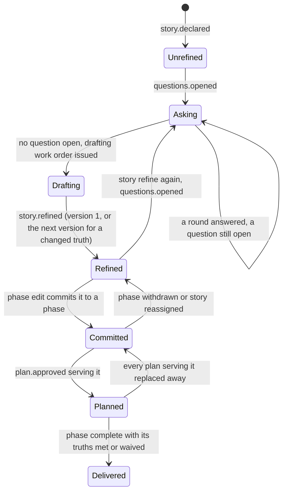
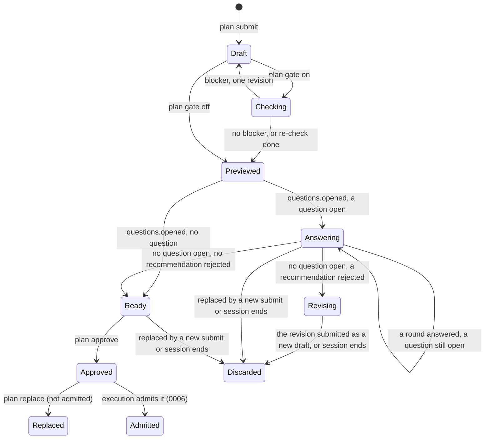
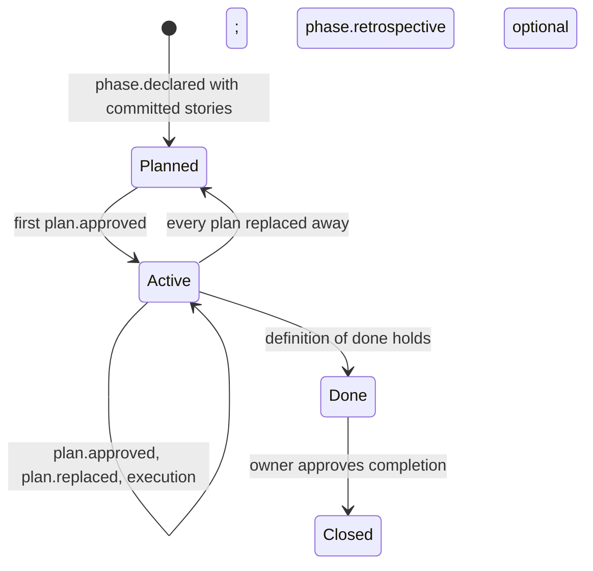
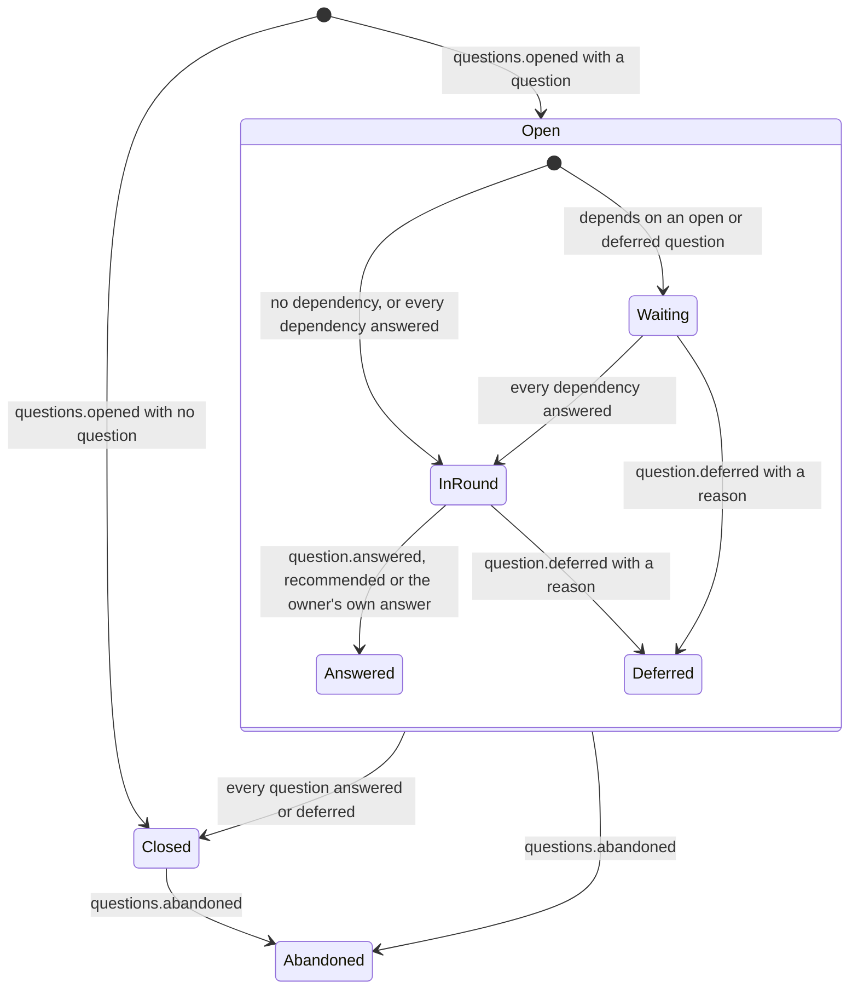
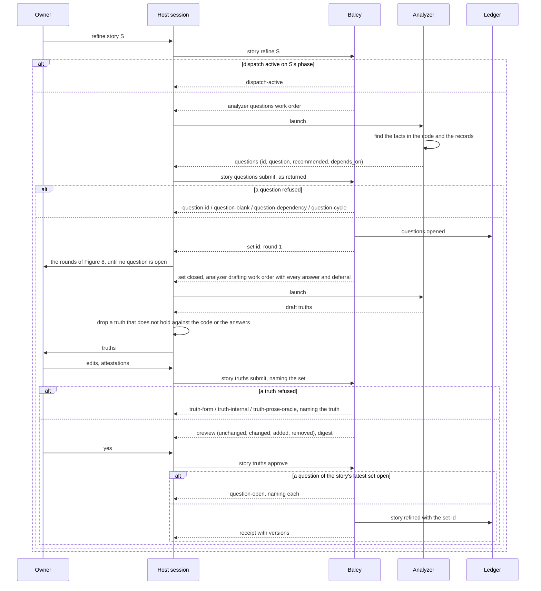
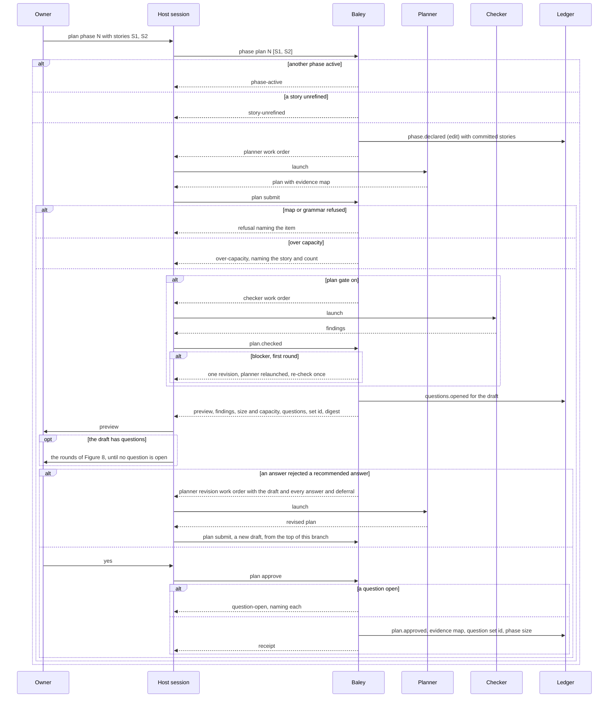
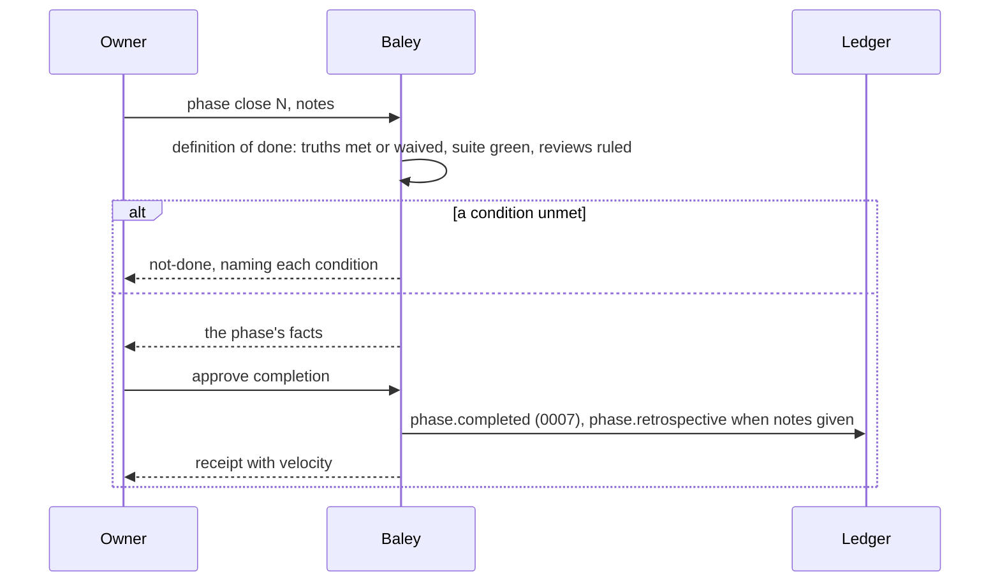
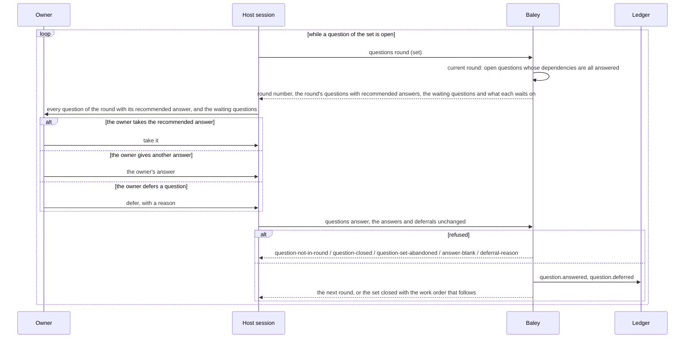

# 0005: Context, plans and acceptance

| | |
|---|---|
| Status | Accepted |
| Design issue | none; build issue [#25](https://github.com/crenshawdev/baley/issues/25) |
| Requirement prefix | PLN |
| Applies | [0002: System design](0002-system-design.md) |
| Related | ADRs: [0006](../adr/0006-no-markdown-records.md), [0009](../adr/0009-served-instructions.md), [0017](../adr/0017-stories-and-sprints.md), [0030](../adr/0030-question-rounds.md), [0031](../adr/0031-one-term-per-concept.md) · C4 view: components ([0002](0002-system-design.md) Figure 4) |

The current design of this area, and nothing else. Edit it in place when the design changes; git holds the history. It describes the design only, never the work still to do.

## 1. Purpose and scope

Baley runs a project the way a Scrum team runs one, and this area is where that is codified: the backlog of stories, each with its acceptance criteria; the phase that commits stories and is planned as tasks; the plan check; and what has to be true for a phase to be done. It decides:

- what a story's acceptance criteria (truths) are, how they are written, and who approves them;
- how the decisions a story or a plan needs are put to the owner: the questions the analyzer and the planner ask, the rounds Baley works out from their dependencies, and the record of every answer and deferral;
- what a phase is, how stories are committed to it, and how its size and capacity are counted;
- the plan: its grammar, its file leases, its tasks, its suite, and the evidence map that binds each truth to the one check that proves it;
- how a plan is checked, approved, numbered and replaced;
- the rules Baley gives the planner for deriving tests, and where Baley's say over the project's tests ends;
- what "done" means for a phase, and the retrospective.

It does not decide how tasks are admitted and run, red then green, or the suite gate ([0006: Execution](0006-execution.md)); how verdicts are returned and a truth's status derived ([0007: Verification](0007-verification.md)); when a review fires and what a provider review looks like ([0008: Review](0008-review.md)); how the backlog and phases are declared, edited, reordered and withdrawn ([0004: Starting a project and changing scope](0004-starting-a-project-and-changing-scope.md)); or how a planner, analyzer or checker is routed ([0003](0003-configuration-and-routing.md)).

Hand-offs: 0004 declares stories and phases; this area refines stories with truths and fills a phase with plans. 0006 admits an approved plan. 0007 verifies against the evidence map this area recorded. The work order composer ([0002](0002-system-design.md) section 8) dispatches the analyzer, the planner and the checker with the instructions of section 10.

In the component view of [0002](0002-system-design.md) (Figure 4) this area is one of the domain areas.

## 2. Terms

| Term | Meaning |
|---|---|
| Backlog | The project's stories in priority order. |
| Story | One numbered statement of what the project must do, declared by the owner on the roadmap ([0004](0004-starting-a-project-and-changing-scope.md)). It carries its own acceptance criteria. |
| Truth | One acceptance criterion of a story: one sentence saying what a person can observe when the story is delivered. A truth has a version. |
| Refinement | Writing or revising a story's truths with the owner: the analyzer asks its questions, the owner answers them in rounds, then the analyzer drafts truths from the answers. |
| Question | One decision the owner must make, typed: an id, the question, a recommended answer, and the ids of the questions whose answers it depends on. A question never asks for a fact the code or the records can settle. |
| Question set | The questions of one refinement, or of one plan draft, put to the owner together and recorded together. |
| Open question | A question that is neither answered nor deferred. |
| Round | The open questions of a set whose dependencies are all answered: the ones the owner can decide now. Baley works out each round from the dependencies; nobody chooses it. |
| Deferral | The owner's recorded choice to leave a question undecided for now, with a reason. |
| Phase | The working increment of the roadmap, defined in [0004](0004-starting-a-project-and-changing-scope.md) (Terms): a goal and the stories committed to it. One phase is active per project (PLN-R7). |
| Phase planning | Committing stories to a phase and writing its plans. |
| Increment | What a completed phase delivers: something the owner can use, proven by its stories' truths and the suite. |
| Unit of work | One task: one signed commit with one narrowest verify command. |
| Size | The number of tasks a story's approved plans need; a phase's size is the sum over its stories. |
| Capacity | The owner's ceiling on a phase's size, in tasks. |
| Velocity | Tasks completed per phase, as a fact shown, never a decision input. |
| Plan | One typed document for a phase: the stories it serves, its file lease, its tasks, its suite and its evidence map. A phase may have several plans. |
| Lease | The exact files and directories a plan's tasks may change. |
| Suite | The project's test command, run by Baley at plan close ([0006](0006-execution.md)). |
| Evidence map | For each truth a plan serves, the items that have to exist and be connected for the truth to hold, and how each is checked. |
| Check | The one test that proves a truth: cause its trigger, look for its outcome. |
| Artifact, link, observation | The other evidence kinds: a thing that must exist; a value one part hands another; something a person or live system must see. |
| Plan check | A review of a submitted plan by the checker, before the owner sees it. |
| Definition of done | The conditions a phase must meet to be complete: every committed story's truths met or waived, the suite green, every review ruled. |
| Retrospective | The owner's notes at phase close, recorded in the owner's words. |
| Analyzer | The dispatched role that, during refinement, finds facts from the code and the records, asks questions for the decisions left to the owner, and drafts truths from the answers. |
| Planner | The dispatched role that writes plans and evidence maps, and asks questions for the decisions a plan needs from the owner. |
| Checker | The dispatched role that reviews a plan. |

## 3. Requirements

| Id | Rule | Why | Depends on | Status |
|---|---|---|---|---|
| PLN-R1 | The backlog is the project's stories in priority order, and a story carries its own truths. A phase's truths are the sum of its committed stories' truths. | Acceptance criteria belong to the thing being promised, and a phase promises a set of stories. | PRJ-R1, PRJ-R20 | Active |
| PLN-R2 | A truth is one sentence in a fixed form: `When <one trigger>, <one observer> sees / gets / is refused <one outcome>.`, or the property form `For any <input>, <observer> gets <outcome>.` One trigger (no "or" before the comma), one observer, one outcome; a second clause may only sharpen the same outcome. | A vague promise cannot be written, and seven cannot secretly be twenty. | | Active |
| PLN-R3 | Baley refuses a truth that is not in the form (`truth-form`), whose outcome names an internal such as a function or a field instead of something seen from outside (`truth-internal`), or whose expected value would come from a model call (`truth-prose-oracle`). The owner attests observability and a fixed oracle; Baley records the attestation and does not classify the sentence. | The answer must not move without the code moving, and the promise must be visible to a person. | PLN-R2 | Active |
| PLN-R4 | Truths are written with the owner during a story's refinement and approved by digest; they belong to the story, not to a plan. A truth whose text changes gets the next version; an unchanged truth keeps its version; every version is kept. Evidence written against an older version is stale. | Several plans deliver the same promises, and a promise that changed must not be proven by old evidence. | PLN-R1, PRJ-R14 | Active |
| PLN-R5 | There is no cap on truths per story. Baley shows the count; a story that reads too large is split by the planner with the owner's approval. | A number handed to the model becomes a target. | PLN-R17 | Active |
| PLN-R6 | Refinement dispatches the analyzer twice. The first work order carries the story, the project description, the roadmap and the code; the analyzer finds the facts itself from the code and the records and returns questions (PLN-R23) only for the decisions left to the owner, never draft truths. The host session submits the questions as returned, and they go to the owner in rounds (PLN-R24). When no question of the set is open, Baley issues the second work order, carrying the story, the questions and every recorded answer and deferral; the analyzer returns draft truths drawn from them. The host session drops a draft truth that does not hold against the code or the answers, and the owner edits, attests and approves the truths (PLN-R26). | What the owner did not say is found and decided before it is built on, a fact the code already holds is never put to the owner, and truths are drafted on decisions already made. | SYS-P2, SYS-P5, PLN-R23, PLN-R24 | Active |
| PLN-R7 | A phase ([0004](0004-starting-a-project-and-changing-scope.md)) is a goal and the stories committed to it. Phase planning commits stories in backlog order unless the owner reorders, and writes the phase's plans. One phase is active per project; a second is refused with `phase-active` until the first is complete or withdrawn. | One phase at a time is the discipline; the record shows which. | PRJ-R7, PRJ-R11 | Active |
| PLN-R8 | A phase is a working increment: its exit proof is its committed stories' truths, each verified by its one check, plus the suite. There is no separate whole-application test command. | Progress is real at every step. | PLN-R19 | Active |
| PLN-R9 | Nobody estimates. A story's size is the number of tasks its approved plans need; a phase's size is the sum. `planning.phase_capacity` (tasks, default none) is the ceiling: a plan whose tasks would take the phase over capacity is refused with `over-capacity`, naming the story and the count, and the story waits for the next phase. Size changes only when a plan is approved or replaced. Velocity is shown per phase and never used to decide. | Units of work are counted, not guessed, so there is no churn and no number for the model to hit. | PLN-R17 | Active |
| PLN-R10 | One phase by default. The planner may propose splitting a story or a phase; a split counts only when the owner approves it. | Scope never changes without the owner. | SYS-P5 | Active |
| PLN-R11 | A plan is typed content: phase, plan number, the story ids it serves, `files` and `directories` (the lease: exact paths, no trailing separator on a file, at most 256 declarations, no duplicates, `files: []` only with directories), goal, context, notes, ordered `tasks` (unique id, title, files within the lease, action, one or more `verify` commands each naming the narrowest command that settles the task), the suite, the evidence map, and `questions` (the decisions the plan needs from the owner, each in the shape of PLN-R23, empty when there are none). Unknown keys and prose bodies are refused (`typed-content`). Task prose never contributes paths, and a decision the owner must make is never left in `notes` or task prose. | Baley reads records, never documents. | ADR 0006, SYS-P3, PLN-R23 | Active |
| PLN-R12 | The evidence map binds every truth a plan serves to evidence items of four kinds: `artifact`, `link`, `check`, `observation`. Each item names its truth and version and a one-line reason ("what change would break this"). Exactly one `check` per truth version across the phase; a second is refused with `truth-check-limit`. A `check` names its command, its expected literal or property, its test file and function, its setup, its call, its `boundary` (the one unit it exercises) and its `fakes` (every filesystem, process and clock seam that unit touches). A `link` is allowed only where the truth's own words name the value crossing (`link-value-not-named`). An `observation` is written only when what it names can be seen at the phase's close, and can never make a truth met, only `concerns` ([0007](0007-verification.md)). | The check is the truth; the other kinds are things the verifier inspects; nothing multiplies. | PLN-R4 | Active |
| PLN-R13 | Baley refuses at plan submit: a truth the plan serves with no item (`uncovered-truth`); an item naming no truth or a stale truth version (`evidence-item-truth`, `truth-version-mismatch`); a truth with items but no check (`truth-without-check`); a check with a blank command, expected value or test file (`check-command`, `check-expected`, `check-test-file`); a task file outside the lease (`lease`); a story not committed to the phase (`story-not-in-phase`); a plan for a phase with no refined stories (`no-truths`); the same item id with a different definition across plans (`evidence-item-conflict`). | The map must be complete and consistent before anyone builds against it. | PLN-R11, PLN-R12 | Active |
| PLN-R14 | Plan numbers within a phase are assigned in order and never reused. Replacing an approved plan needs its own owner approval naming the plan and the digest it replaces; a plan admitted to execution is not replaced (`admitted-plan`); a gap plan gets a new number ([0006](0006-execution.md)). | Every plan the record ever named can be found. | EVD-R2 | Active |
| PLN-R15 | A plan is submitted whole, previewed, held as a draft by Baley, and approved by the owner by digest with owner and time. Approving an older digest when a newer draft exists is refused with `stale-draft`, naming the first differing part. A retry of the same approval is answered once. Drafts survive a server restart and are discarded when replaced or when the session that made them ends. | The owner approves exactly what was shown. | SYS-P5, SYS-R6 | Active |
| PLN-R16 | Between submit and preview, when `review.triggers.plan.gate` is not `off`, Baley dispatches the checker with the plan and its stories' truths. The checker returns findings, each with a severity: a truth no task makes true is a blocker; a task no truth needs is a warning; a finding without severity is refused. A blocker buys one planner revision and one re-check, then the plan goes to the owner with the findings. Warnings never buy a round. The gate value says what the findings do ([0008](0008-review.md)). | The plan is judged against the goal before the owner spends time on it, at the cheapest effort, and the owner can turn it off. | PLN-R7, CFG-R12 | Active |
| PLN-R17 | Baley never hands the model a number to hit: no coverage percentage, test count, tests per file or truth count. The only numbers are the owner's settings, applied by Baley and reported as refusals when crossed. | Any number given to the model becomes a target. | | Active |
| PLN-R18 | The planner derives tests under the rules of section 10, compiled into Baley and served in the work order: one responsibility per test, one seam at most, the real logic that owns the decision, expected values from the requirement, tests that depend only on the project's language toolchain and its own test libraries, no program started, a fresh temporary directory as the one filesystem seam. The project's language and test command come from the project file (`workflow.test_command`) and its root manifest; Baley being written in Rust chooses nothing for the project. | Bounded, meaningful evidence in any language. | SYS-R8, CFG-R5 | Active |
| PLN-R19 | Baley owns truths, the evidence map, the red-then-green record for checks ([0006](0006-execution.md)) and the verdict ([0007](0007-verification.md)). The project owns how its tests are written and run: style, framework, count, coverage, mutation, CI. Baley ships one default test style as guidance and never refuses on style. CI status is information at landing, never acceptance evidence. | Acceptance is few and reviewed; tests are many and the developer's. | | Active |
| PLN-R20 | A phase is complete when every committed story's truths are met or waived, the suite is green, and every review the phase raised is ruled. Baley derives this from the record ([0007](0007-verification.md)); the owner's approval of completion is the review of the increment. | Done means proven. | SYS-P4 | Active |
| PLN-R21 | At phase close Baley shows the phase's facts (tasks planned and done, checks red then green, suite runs, reviews and rulings, waivers, deviations, refusals hit) and takes the owner's notes as an optional `phase.retrospective` record in the owner's words. | A decision the owner makes after a phase is a scope or policy change, and the record says why. | PLN-R20 | Active |
| PLN-R22 | Stories are mirrored one way to forge issues and phases to forge milestones through the forge adapter; forge edits are ignored; the ledger stays the truth. | Teammates who live on the forge see the backlog there. | SYS-P6, [0011](0011-milestones-landing-undo-pause.md) | Backlog |
| PLN-R23 | A question is typed content: `id` (unique within its set), `question` (one decision the owner must make), `recommended` (the answer the asker recommends), and `depends_on` (the ids of questions in the same set whose answers it needs, empty when none). The analyzer's questions for one refinement form one question set; a plan draft's `questions` field forms another. Baley refuses a set with a blank or colliding id (`question-id`), a blank question or recommended answer (`question-blank`), a dependency on an id outside the set or on the question itself (`question-dependency`), or a dependency cycle (`question-cycle`). Unknown keys are refused (`typed-content`). | Every question arrives with the asker's best answer and its place in the order, so the owner can decide quickly and in the right order; a cycle would hold a question that can never be asked. | ADR 0006, SYS-P3 | Active |
| PLN-R24 | Baley works out each round from a set's dependencies, deterministically over plain values. A question is open until it is answered or deferred. An open question whose `depends_on` are all answered is in the current round; an open question that depends on an open or a deferred question waits. Round 1 is every question with no dependency. Each `questions answer` call is one round, numbered in the order recorded; after it Baley works out the next round from the answers so far. The set is closed when no question is open. The host session puts every question of the current round to the owner, each with its recommended answer, shows the waiting questions and what each waits on, and relays the owner's answers and deferrals unchanged; it answers, drops, merges, rewords and reorders none. An answer to a waiting question is refused with `question-not-in-round`. | The owner decides only what can be decided now, in an order the record fixes, and nobody decides in the owner's place. | PLN-R23, SYS-P5 | Active |
| PLN-R25 | Every answer is recorded as `question.answered` with the owner's answer, whether it takes the recommended answer, the round, the owner and the time. An answer that rejects the recommended answer is recorded the same way, in the owner's words. A deferral is recorded as `question.deferred` with the owner's reason. Answers and deferrals are never edited or removed; a question already answered or deferred is refused with `question-closed`, and a blank answer with `answer-blank`. A later set for the same story, or the discard of the plan draft a set belongs to (replaced, or its session ended, PLN-R15), abandons the older set: Baley records `questions.abandoned` naming the set and the cause, its recorded answers and deferrals stay, and a call on it is refused with `question-set-abandoned`. | A rejected recommendation, and why, is as much a decision as an accepted one, and the next reader needs both. | PLN-R24, ADR 0006 | Active |
| PLN-R26 | `story truths approve` is refused with `question-open` while a question of the story's latest set is open, and with `question-set-abandoned` when the draft being approved was drafted from a set that is no longer the story's latest; `plan approve` is refused with `question-open` while a question of the draft's set is open. The owner closes a question without answering it only by deferring it on the record, with a reason, whether it is in the current round or waiting; a deferral with a blank reason is refused with `deferral-reason`. A deferral closes only its own question: a question that waits on a deferred one can never enter a round, and stays open until the owner defers it too. | Nothing is approved on a decision nobody made, unless the owner says on the record that it can wait and why. | PLN-R24, PLN-R25, SYS-P5 | Active |
| PLN-R27 | The planner puts every decision a plan needs from the owner in the plan's `questions` field and writes the plan on the recommended answers. Baley opens the draft's question set when it gives the preview, and the rounds of PLN-R24 run before `plan approve`. When the set closes with an answer that rejects a recommended answer, the draft is not approved as written: `plan approve` on it is refused with `answer-not-applied`, and Baley issues the planner a revision work order carrying the draft and every answer and deferral on its set. The host session submits the revision as a new draft, whose questions are only decisions not yet made. A deferral leaves the plan on that question's recommended answer, and the preview shows it as deferred. | A plan written on a recommendation the owner turned down must not be approved as written, and the revision starts from the owner's answers. | PLN-R11, PLN-R15, PLN-R26 | Active |

## 4. Roles and actors

| Actor | Receives | Returns | Model and effort from |
|---|---|---|---|
| Owner | Each round's questions with their recommended answers, and the waiting questions; draft truths; plan previews; checker findings; phase facts at close | Answers (the recommended answer or the owner's own) and deferrals with reasons; approvals by digest; reorders and splits; retrospective notes | Not applicable |
| Analyzer (dispatched) | Questions work order: the story, the project description, the roadmap, the code, the question grammar. Drafting work order: the story, its question set with every answer and deferral, the truth form and refusals | Questions (first work order); draft truths (second work order) | `roles.analyzer.*` ([0003](0003-configuration-and-routing.md)) |
| Planner (dispatched) | The phase's goal and stories with their truths, the lease and task grammar, the evidence map grammar, the question grammar, the test derivation rules, the capacity ceiling as a fact; in a revision work order, the draft and every answer and deferral on its set | A typed plan with its evidence map and its questions; a proposed split when needed | `roles.planner.*` |
| Checker (dispatched) | The submitted plan and its stories' truths | Findings with severity | `roles.checker.*`, gated by `review.triggers.plan.gate` |
| Host session | Work orders to launch; each round's questions; drafts to put to the owner | The analyzer's questions as returned; the owner's answers and deferrals, relayed unchanged; approvals; adjudicated draft truths and checker output | Not applicable |
| Baley: this area | Submissions, approvals | Previews, refusals, records | Not applicable |
| Hardin | A refinement, phase or plan request | Whether it may happen now (phase active, dispatch active, plan admitted) | Not applicable |

## 5. Commands and operations

Every change follows submit (preview and digest), approve (owner, by digest), record. Answers and deferrals are the one exception: they are the owner's own acts, relayed by the host session, and `questions answer` records them as given (PLN-R25). Operations are reachable from a session through the stub skills ([ADR 0009](../adr/0009-served-instructions.md)) and from the command line under `baley story`, `baley questions`, `baley phase` and `baley plan`.

### story refine

- **Inputs:** a story id.
- **Outputs:** the analyzer's questions work order id (PLN-R6). The analyzer returns its questions to the host session, which submits them with `story questions submit`.
- **Refusals:** `no-such-story` (PRJ-R18); `dispatch-active` when a worker is dispatched on a phase that committed the story (PRJ-R16).

### story questions submit

- **Inputs:** the story id, the analyzer's questions work order id, and the questions as the analyzer returned them (PLN-R23).
- **Outputs:** `questions.opened` recorded; the set id and round 1 as `questions round` gives it. An empty set is closed at once, and the output is the analyzer's drafting work order (PLN-R6). A set already open for the story is abandoned (PLN-R25).
- **Refusals:** `question-id`, `question-blank`, `question-dependency`, `question-cycle`, `typed-content` (PLN-R23); `no-such-story` (PRJ-R18); `dispatch-active` (PRJ-R16).

### questions round

- **Inputs:** a question set id.
- **Outputs:** read only. The round number; the current round's questions, each with its recommended answer; each waiting question with the open or deferred questions it waits on; the answered questions with their answers and the deferred ones with their reasons; `closed` when no question is open; `abandoned` when a later set replaced it (PLN-R24, PLN-R25).
- **Refusals:** `no-such-question-set` (PLN-R24).

### questions answer

- **Inputs:** the set id; for each question the owner settles, either an answer (the recommended answer taken, or the owner's own answer) or a deferral with its reason; owner, time. The call may settle some or all of the current round, and may defer any open question, waiting or not.
- **Outputs:** `question.answered` and `question.deferred` recorded together, all or none; the next round. When no question is open: for a story's set, the analyzer's drafting work order (PLN-R6); for a plan draft's set, either `ready` (the draft may be approved) or, when an answer rejected a recommended answer, the planner's revision work order (PLN-R27).
- **Refusals:**

  | Code | When | Requirement |
  |---|---|---|
  | `no-such-question-set`, `no-such-question` | The set, or a question id within it, does not exist | PLN-R24 |
  | `question-not-in-round` | An answer to a question that waits on an open or deferred question | PLN-R24 |
  | `question-closed` | The question is already answered or deferred | PLN-R25 |
  | `question-set-abandoned` | A later set for the story, or the discard of its plan draft, abandoned the set | PLN-R25 |
  | `answer-blank` | An answer with no text | PLN-R25 |
  | `deferral-reason` | A deferral with no reason | PLN-R26 |

### story truths submit, story truths approve

- **Inputs:** `submit`: the story id, the question set its truths were drafted from, and its truths (id, form, trigger, observer, verb, outcome, kind literal or property, the owner's observability and fixed-oracle attestations). `approve`: the digest, owner, time.
- **Outputs:** `submit`: preview marking each truth unchanged, changed (next version), added or removed; the digest. `approve`: `story.refined` recorded.
- **Refusals:**

  | Code | When | Requirement |
  |---|---|---|
  | `truth-form` | Not in the sentence form; a second trigger, observer or outcome | PLN-R2 |
  | `truth-internal` | The outcome names an internal | PLN-R3 |
  | `truth-prose-oracle` | The expected value would come from a model | PLN-R3 |
  | `truth-attestation` | An attestation missing or false | PLN-R3 |
  | `truth-id` | Blank or colliding truth id within the story | PLN-R4 |
  | `question-open` | `approve` while a question of the story's latest set is open | PLN-R26 |
  | `no-such-question-set` | `submit` names a set that does not exist or belongs to another story | PLN-R24 |
  | `question-set-abandoned` | `submit` names a set that is not the story's latest, or `approve` holds a draft drafted from one | PLN-R25, PLN-R26 |
  | `no-such-story` | | PRJ-R18 |
  | `stale-draft`, `unknown-draft` | | PLN-R15 |

### phase plan

- **Inputs:** the phase number; the stories to commit in order (default: the next backlog stories the owner picks).
- **Outputs:** the phase's committed stories recorded through `phase edit` (0004); the planner's work order id.
- **Refusals:** `phase-active` (PLN-R7); `no-such-phase`, `no-such-story` (PRJ-R18); `story-unrefined` when a committed story has no approved truths (PLN-R1); `story-in-phase` when the story is committed to another open phase (PRJ-R4).

### plan submit

- **Inputs:** the typed plan (PLN-R11) with its evidence map (PLN-R12) and its questions (PLN-R23).
- **Outputs:** the checker's work order when the plan gate is on; then the preview, the checker's findings, the plan's size and the phase's size against capacity, and the digest. With the preview Baley records `questions.opened` for the draft and gives the set id and round 1; a draft with no questions has an empty set, closed at once (PLN-R27). A new submit discards the draft it replaces and abandons that draft's set (PLN-R15, PLN-R25).
- **Refusals:** every code of PLN-R13; `typed-content` (PLN-R11); `question-id`, `question-blank`, `question-dependency`, `question-cycle` (PLN-R23); `over-capacity` (PLN-R9); `phase-not-active` (PLN-R7); `plan-check-blocker` after the one revision and re-check, carrying the findings (PLN-R16).

### plan approve

- **Inputs:** the digest, owner, time.
- **Outputs:** `plan.approved` with the next plan number; the evidence map and the question set id recorded; the phase's size updated.
- **Refusals:** `stale-draft`, `unknown-draft` (PLN-R15); `question-open` while a question of the draft's set is open (PLN-R26); `answer-not-applied` when an answer on the draft's set rejected a recommended answer (PLN-R27).

### plan replace

- **Inputs:** the plan number, the digest being replaced, the new plan.
- **Outputs:** as `plan submit` then `plan approve`, recording `plan.replaced`.
- **Refusals:** as `plan submit`; `admitted-plan` (PLN-R14); `no-such-plan` (PRJ-R18).

### phase close

- **Inputs:** the phase number; optional retrospective notes.
- **Outputs:** the phase's facts; when the definition of done holds and the owner approves, `phase.completed` ([0007](0007-verification.md)) and `phase.retrospective` when notes were given.
- **Refusals:** `not-done` naming each unmet condition (a story's truth unmet, the suite not green, a review unruled) (PLN-R20).

## 6. Records

### truth (part of `story.refined`, `roadmap` stream)

| Field | Type | Meaning |
|---|---|---|
| `story` | story id | The story it belongs to |
| `id` | truth id | Unique within the story |
| `version` | integer | Starts at 1; next on a text change |
| `form` | `when`, `for-any` | The sentence form |
| `trigger`, `observer`, `verb`, `outcome` | text | The sentence's slots; `verb` is `sees`, `gets` or `is refused` |
| `kind` | `literal`, `property` | Whether the outcome is one value or a property |
| `observable`, `fixed_oracle` | bool | The owner's attestations |

`story.refined` also carries the id of the question set its truths were drafted from and the submission digest; the answers and deferrals stay on that set's own records. A truth's status (`pending`, `met`, `concerns`, `unmet`, `waived`) is derived by [0007](0007-verification.md), never stored.

### plan (payload of `plan.approved`, `phase/<n>` stream)

| Field | Type | Meaning |
|---|---|---|
| `phase`, `plan` | integers | The phase and the plan number |
| `stories` | list of story ids | The stories it serves |
| `files`, `directories` | lists of paths | The lease |
| `goal`, `context`, `notes` | text | For the executor |
| `tasks` | list | `id`, `title`, `files`, `action`, `verify` |
| `suite` | command | The suite Baley runs at close |
| `evidence_map` | list of items | See below |
| `questions` | list of questions | The plan's questions (PLN-R23), as submitted |
| `question_set` | set id | The set its questions were put to the owner in; the answers and deferrals are that set's records |
| `size` | integer | The number of tasks |

### evidence item

| Field | Type | Meaning |
|---|---|---|
| `id` | item id | Unique within the phase |
| `truth`, `truth_version` | truth id, integer | The truth it serves |
| `kind` | `artifact`, `link`, `check`, `observation` | |
| `spec` | table | `artifact`: path or record. `link`: caller, callee, value. `check`: command, expected {literal or property, value}, test {file, function}, setup, call, boundary, fakes. `observation`: what is to be seen, by whom. |
| `reason` | text | What change would break this |

### questions.opened (event; `roadmap` stream for a story's set, `phase/<n>` stream for a plan draft's set)

| Field | Type | Meaning |
|---|---|---|
| `set` | set id | Assigned by Baley, unique in the project |
| `subject` | `story`, `plan` | Whose decisions these are |
| `story` | story id | For a story's set: the story being refined |
| `work_order` | work order id | For a story's set: the analyzer's questions work order that returned them |
| `phase`, `plan_digest` | integer, digest | For a plan draft's set: the phase and the draft whose `questions` field these are |
| `questions` | list of questions | See below |
| `at` | time | When Baley recorded the set |

A set's state (open, closed, abandoned) and each question's state (waiting, in the current round, answered, deferred) are derived from these records, the answers and deferrals on them, and `questions.abandoned`; they are never stored.

### question (part of `questions.opened` and of a plan's `questions`)

| Field | Type | Meaning |
|---|---|---|
| `id` | question id | Unique within the set |
| `question` | text | The one decision the owner must make |
| `recommended` | text | The answer the asker recommends |
| `depends_on` | list of question ids | The questions in the same set whose answers it needs; empty when none |

### question.answered, question.deferred (events, same stream as their set)

| Field | Type | Meaning |
|---|---|---|
| `set`, `question` | set id, question id | The question settled |
| `round` | integer | The round it was settled in |
| `answer` | text | `question.answered` only: the owner's answer; the recommended text when the owner took it |
| `accepted` | bool | `question.answered` only: true when the owner took the recommended answer, false when the owner rejected it |
| `reason` | text | `question.deferred` only: why the owner leaves it undecided |
| `owner`, `at` | owner, time | Who settled it and when |

One `questions answer` call writes its answers and deferrals in one transaction.

### questions.abandoned (event, same stream as its set)

| Field | Type | Meaning |
|---|---|---|
| `set` | set id | The set abandoned |
| `cause` | `superseded`, `draft-replaced`, `session-ended` | A later set for the same story; the plan draft replaced; the session that held the plan draft ended |
| `at` | time | When Baley recorded it |

Baley records it in the same transaction as the later set's `questions.opened` or the new draft, and when it discards a draft because its session ended.

### plan.checked (event, `phase/<n>` stream)

| Field | Type | Meaning |
|---|---|---|
| `plan_digest` | digest | The submission checked |
| `findings` | list | severity (`blocker`, `warning`), location, claim, fix |
| `round` | 1 or 2 | First check or the re-check |

### plan.replaced (event), phase.retrospective (event)

`plan.replaced`: plan number, old digest, new digest, owner, time. `phase.retrospective`: phase number, the owner's notes, the facts shown, owner, time.

### Views

| View | Key | Content |
|---|---|---|
| `backlog` | project | Stories in priority order with truth counts, refinement state (unrefined, questions open with the current round, drafting, refined), size when planned, the phase each is committed to |
| `phase_plan` | project, phase | Goal, committed stories, plans with sizes, capacity, size, tasks done, definition of done state, velocity of closed phases. It is separate from the `phase` view of [0004](0004-starting-a-project-and-changing-scope.md), which serves Hardin the phase's context, plans, execution and completion state |
| `plan` | project, phase, plan | The approved plan, its evidence map, its question set, its check state |
| `questions` | project, set | The set's subject; each question with its state (waiting and on what, in the current round, answered with the answer and whether it took the recommendation, deferred with the reason); the current round number; whether the set is open, closed or abandoned |

## 7. States

```mermaid
stateDiagram-v2
  [*] --> Unrefined: story.declared
  Unrefined --> Asking: questions.opened
  Asking --> Asking: a round answered, a question still open
  Asking --> Drafting: no question open, drafting work order issued
  Drafting --> Refined: story.refined (version 1, or the next version for a changed truth)
  Refined --> Asking: story refine again, questions.opened
  Refined --> Committed: phase edit commits it to a phase
  Committed --> Refined: phase withdrawn or story reassigned
  Committed --> Planned: plan.approved serving it
  Planned --> Committed: every plan serving it replaced away
  Planned --> Delivered: phase complete with its truths met or waived
```

*Figure 1. States of a story in this area. Asking and Drafting are the rounds of its latest question set and the analyzer's drafting of truths from the answers; a story in Asking or Drafting that was refined before keeps its approved truths until the new ones are approved. Withdrawn and dropped states are in [0004](0004-starting-a-project-and-changing-scope.md) Figure 2.*

```mermaid
stateDiagram-v2
  [*] --> Draft: plan submit
  Draft --> Checking: plan gate on
  Checking --> Draft: blocker, one revision
  Checking --> Previewed: no blocker, or re-check done
  Draft --> Previewed: plan gate off
  Previewed --> Answering: questions.opened, a question open
  Previewed --> Ready: questions.opened, no question
  Answering --> Answering: a round answered, a question still open
  Answering --> Ready: no question open, no recommendation rejected
  Answering --> Revising: no question open, a recommendation rejected
  Ready --> Approved: plan approve
  Revising --> Discarded: the revision submitted as a new draft, or session ends
  Answering --> Discarded: replaced by a new submit or session ends
  Ready --> Discarded: replaced by a new submit or session ends
  Approved --> Replaced: plan replace (not admitted)
  Approved --> Admitted: execution admits it (0006)
```

*Figure 2. States of a plan. Previewed is the moment Baley gives the preview and records the draft's question set. `plan approve` is refused in Answering (`question-open`) and in Revising (`answer-not-applied`). Admitted and later states belong to [0006](0006-execution.md).*

```mermaid
stateDiagram-v2
  [*] --> Planned: phase.declared with committed stories
  Planned --> Active: first plan.approved
  Active --> Active: plan.approved, plan.replaced, execution
  Active --> Done: definition of done holds
  Done --> Closed: owner approves completion; phase.retrospective optional
  Active --> Planned: every plan replaced away
```

*Figure 3. States of a phase as this area sees them. The phase lifecycle as a whole is [0004](0004-starting-a-project-and-changing-scope.md) Figure 1.*

```mermaid
stateDiagram-v2
  [*] --> Open: questions.opened with a question
  [*] --> Closed: questions.opened with no question
  state Open {
    [*] --> InRound: no dependency, or every dependency answered
    [*] --> Waiting: depends on an open or deferred question
    Waiting --> InRound: every dependency answered
    InRound --> Answered: question.answered, recommended or the owner's own answer
    InRound --> Deferred: question.deferred with a reason
    Waiting --> Deferred: question.deferred with a reason
  }
  Open --> Closed: every question answered or deferred
  Open --> Abandoned: questions.abandoned
  Closed --> Abandoned: questions.abandoned
```

*Figure 7. States of a question set and, inside it, of each question. A set is abandoned when a later set for the same story is opened or its plan draft is discarded. The current round is every question in InRound. A question that waits on a deferred question never enters a round and closes only by its own deferral. Abandoned is terminal and keeps every recorded answer and deferral. The figure is numbered after the workflows so that the figure numbers other documents cite stay fixed.*

## 8. Workflows

```mermaid
sequenceDiagram
  participant O as Owner
  participant H as Host session
  participant B as Baley
  participant A as Analyzer
  participant L as Ledger
  O->>H: refine story S
  H->>B: story refine S
  alt dispatch active on S's phase
    B-->>H: dispatch-active
  else
    B-->>H: analyzer questions work order
    H->>A: launch
    A->>A: find the facts in the code and the records
    A-->>H: questions (id, question, recommended, depends_on)
    H->>B: story questions submit, as returned
    alt a question refused
      B-->>H: question-id / question-blank / question-dependency / question-cycle
    else
      B->>L: questions.opened
      B-->>H: set id, round 1
      H->>O: the rounds of Figure 8, until no question is open
      B-->>H: set closed, analyzer drafting work order with every answer and deferral
      H->>A: launch
      A-->>H: draft truths
      H->>H: drop a truth that does not hold against the code or the answers
      H->>O: truths
      O->>H: edits, attestations
      H->>B: story truths submit, naming the set
      alt a truth refused
        B-->>H: truth-form / truth-internal / truth-prose-oracle, naming the truth
      else
        B-->>H: preview (unchanged, changed, added, removed), digest
        O->>H: yes
        H->>B: story truths approve
        alt a question of the story's latest set open
          B-->>H: question-open, naming each
        else
          B->>L: story.refined with the set id
          B-->>H: receipt with versions
        end
      end
    end
  end
```

*Figure 4. Refining a story. The analyzer is dispatched twice: once for its questions and, after the owner's rounds, once for the draft truths. An empty question set closes at once and the drafting work order follows the submit.*

```mermaid
sequenceDiagram
  participant O as Owner
  participant H as Host session
  participant B as Baley
  participant P as Planner
  participant C as Checker
  participant L as Ledger
  O->>H: plan phase N with stories S1, S2
  H->>B: phase plan N [S1, S2]
  alt another phase active
    B-->>H: phase-active
  else a story unrefined
    B-->>H: story-unrefined
  else
    B->>L: phase.declared (edit) with committed stories
    B-->>H: planner work order
    H->>P: launch
    P-->>H: plan with evidence map
    H->>B: plan submit
    alt map or grammar refused
      B-->>H: refusal naming the item
    else over capacity
      B-->>H: over-capacity, naming the story and count
    else
      alt plan gate on
        B-->>H: checker work order
        H->>C: launch
        C-->>H: findings
        H->>B: plan.checked
        alt blocker, first round
          B-->>H: one revision, planner relaunched, re-check once
        end
      end
      B->>L: questions.opened for the draft
      B-->>H: preview, findings, size and capacity, questions, set id, digest
      H->>O: preview
      opt the draft has questions
        H->>O: the rounds of Figure 8, until no question is open
      end
      alt an answer rejected a recommended answer
        B-->>H: planner revision work order with the draft and every answer and deferral
        H->>P: launch
        P-->>H: revised plan
        H->>B: plan submit, a new draft, from the top of this branch
      else
        O->>H: yes
        H->>B: plan approve
        alt a question open
          B-->>H: question-open, naming each
        else
          B->>L: plan.approved, evidence map, question set id, phase size
          B-->>H: receipt
        end
      end
    end
  end
```

*Figure 5. Phase planning and a plan's submission, check, questions and approval. A revised draft is checked and previewed again and opens its own question set. Approving a draft whose set holds a rejected recommendation is refused with `answer-not-applied`.*

```mermaid
sequenceDiagram
  participant O as Owner
  participant B as Baley
  participant L as Ledger
  O->>B: phase close N, notes
  B->>B: definition of done: truths met or waived, suite green, reviews ruled
  alt a condition unmet
    B-->>O: not-done, naming each condition
  else
    B-->>O: the phase's facts
    O->>B: approve completion
    B->>L: phase.completed (0007), phase.retrospective when notes given
    B-->>O: receipt with velocity
  end
```

*Figure 6. Closing a phase.*

```mermaid
sequenceDiagram
  participant O as Owner
  participant H as Host session
  participant B as Baley
  participant L as Ledger
  loop while a question of the set is open
    H->>B: questions round (set)
    B->>B: current round: open questions whose dependencies are all answered
    B-->>H: round number, the round's questions with recommended answers, the waiting questions and what each waits on
    H->>O: every question of the round with its recommended answer, and the waiting questions
    alt the owner takes the recommended answer
      O->>H: take it
    else the owner gives another answer
      O->>H: the owner's answer
    else the owner defers a question
      O->>H: defer, with a reason
    end
    H->>B: questions answer, the answers and deferrals unchanged
    alt refused
      B-->>H: question-not-in-round / question-closed / question-set-abandoned / answer-blank / deferral-reason
    else
      B->>L: question.answered, question.deferred
      B-->>H: the next round, or the set closed with the work order that follows
    end
  end
```

*Figure 8. Putting a question set to the owner in rounds, for a story's refinement and for a plan draft alike. The host session relays questions and answers and decides nothing. The owner may answer part of a round and may defer a waiting question. When the set closes, a story's set yields the analyzer's drafting work order and a plan draft's set yields `ready` or the planner's revision work order.*

## 9. Settings

| Setting | Type | Default | Scope | Owner | Effect |
|---|---|---|---|---|---|
| `planning.phase_capacity` | integer, min 1, or absent | absent (no ceiling) | both | 0005 | The ceiling on a phase's size in tasks (PLN-R9) |
| `review.triggers.plan.gate` | see [0003](0003-configuration-and-routing.md) | `advisory` | both | [0008](0008-review.md) | Whether the checker runs and what its findings do (PLN-R16) |
| `workflow.test_command` | command | absent | project | [0006](0006-execution.md) | The suite named in every plan (PLN-R18) |
| `roles.analyzer.*`, `roles.planner.*`, `roles.checker.*` | see [0003](0003-configuration-and-routing.md) | | both | 0003 | The three roles' model and effort |

## 10. Instructions served

| Instruction | Served to | Carries requirements |
|---|---|---|
| Analyzer questions | The analyzer, in its questions work order: the question grammar and its refusals; find every fact yourself from the code and the records and never ask the owner for one; ask only for the decisions left to the owner, each with a recommended answer and the ids of the questions it depends on; draft no truths yet; never decide | PLN-R6, PLN-R23 |
| Analyzer drafting | The analyzer, in its drafting work order: the truth form, the three refusals, the story's questions with every answer and deferral; draft truths on the owner's answers, not on the recommendations; assume no answer to a deferred question; never decide | PLN-R2, PLN-R3, PLN-R6, PLN-R25 |
| Planner | The planner, in its planning work order: the plan grammar with its `questions` field, the question grammar, the lease rules, the evidence map grammar, one check per truth, the test derivation rules below, the capacity ceiling as a fact, "propose a split rather than overfill", "put every decision the plan needs from the owner in `questions` with a recommended answer, write the plan on the recommended answers, and leave no decision in `notes` or task prose". In a revision work order it also receives the draft and every answer and deferral on its set, and applies them | PLN-R5, PLN-R9 to PLN-R13, PLN-R17, PLN-R18, PLN-R23, PLN-R27 |
| Checker | The checker, in its check work order: the six dimensions (story coverage, task completeness, sequencing, goal-backward truths, scope sanity, proportionality), severity rules, "derive what must be true from the goal before opening the plan" | PLN-R16 |
| Default test style | The planner and, through [0006](0006-execution.md), the executor, when the project has set nothing: test a unit through what it exposes; fake only the outside world; never start a program; skip trivial code; write the expected value by hand | PLN-R19 |
| Stubs | The host session: which operation each of `story refine`, `story questions submit`, `questions round`, `questions answer`, `story truths submit`, `phase plan`, `plan submit`, `phase close` calls, and that the owner approves each preview | PLN-R15 |
| Rounds | The host session, with every question set: submit the analyzer's questions as returned; put every question of the current round to the owner with its recommended answer and show the waiting questions; relay each answer and deferral unchanged; answer, drop, merge, reword and reorder none; ask again after each call until the set is closed | PLN-R24, PLN-R25, PLN-R26 |

The test derivation rules the planner receives, as served:

> Treat a plan step as a container for work; separate its independently testable responsibilities instead of testing the whole step. For each responsibility, choose input classes, decision edges and failure responses justified by the requirement. Take expected values from that requirement; never invent behavior to make an answer available. Put each ambiguity the requirement leaves as a question in the plan's `questions` field, with a recommended answer, for the owner to decide.
>
> A generated unit test exercises one responsibility and one behavior, using at most one simulated external seam; split a unit that touches two. Run the real logic that owns the decision with supplied observations and independently justified expectations. In the one check's existing fields, connect the approved truth, production responsibility, inputs or seam, expected observable result and test. Name every other test in the task action with the meaningful defect it would catch. Stop when another case would distinguish no new required behavior or meaningful failure. Reuse adequate existing tests and relevant regressions; do not pursue test counts, a test per function, blanket permutations or coverage percentages. Use the managed project's approved language and test framework; Baley being written in Rust does not choose the project's language.
>
> Write every check at one unit. `boundary` is the one unit the check exercises, named as a unit and not as a workflow. `fakes` names every filesystem, process and clock seam that unit touches; do not leave it empty when the unit touches one. A check never starts a program to get its answer: not the project's binary, not git, not gpg, not a shell.
>
> Naming a fake is not permission to script one. A check builds the values it needs and asserts the rule over them. If the check has to supply the answer the unit is about to reach for, it measures nothing. When the unit stops in the middle of judging to ask git, the filesystem or the clock, that unit is not testable as written: say so in the plan and move the asking out, so the judging takes its facts as arguments. The small function that does the asking gets no check of its own.
>
> A generated test may rely only on the project's language toolchain and test libraries, including mocking libraries, from that language's package ecosystem. It must need no other language runtime, host-installed program, particular hardware or pre-existing machine state, and give the same result wherever the project builds. Test code starts no program. A test may create a fresh temporary directory as its one filesystem seam, keeps its reads and writes inside it, and makes no assertion depend on filesystem permissions, case sensitivity, symlink support or crash durability.
>
> When this phase first makes a running-program obligation runnable, add it to the map as a pending observation. Unit tests cannot establish integration, GUI interaction, real persistence, performance or an assembled workflow, and passing them does not close that obligation. State what remains unverified.

## 11. Build status

The binary crate holds the inherited engine. Truths belong to a phase's context there, plans are rendered to `PLAN-N.md`, and nothing knows a story, the stories a phase commits, or a size.

| Requirement | Status | Where |
|---|---|---|
| PLN-R1, PLN-R7 to PLN-R10, PLN-R20 to PLN-R22 | Not built | Truths are per phase (`crates/baley/src/context/model.rs:36-46`); no backlog, committed stories, size or capacity |
| PLN-R2, PLN-R3 | Built, per phase | `crates/baley/src/context/validation.rs:17-103` (form, one trigger, one observer, verbs, kinds, attestations) |
| PLN-R4 | Partly built | Version always 1, no revision (`crates/baley/src/context/persistence.rs:33-49`, `crates/baley/src/context_service.rs:184-192`) |
| PLN-R5 | Not built | More than seven truths refused `seven-truths` (`crates/baley/src/context/validation.rs:30-39`), to be removed |
| PLN-R6 | Not built | `/bal-context` says "Do not dispatch an analyzer" (`crates/baley/src/context/instructions.rs:43-44`) and has the session hold the interview itself |
| PLN-R11 | Built, minus stories and questions | Typed content and lease rules (`crates/baley/src/plan/model.rs:29-75`, `crates/baley/src/plan/validation.rs:110-186`); the plan has no `questions` field |
| PLN-R12, PLN-R13 | Built, minus the refusals about committed stories (`story-not-in-phase`, `no-truths`) | `crates/baley/src/plan/associations.rs:317-487`, `crates/baley/src/plan/limits.rs:187-438`, `crates/baley/src/plan/evidence.rs:12-116` |
| PLN-R14 | Built | `crates/baley/src/plan/inventory.rs:129-179`, `crates/baley/src/plan/validation.rs:23-105` |
| PLN-R15 | Partly built | Draft, digest, `stale-draft` (`crates/baley/src/plan_service.rs:163-260`); drafts are memory-only and lost on restart (`crates/baley/src/context_service.rs:131-137`) |
| PLN-R16 | Not built | `/bal-plan` forbids checker dispatch (`crates/baley/src/plan/instructions.rs:504-506`); the 3.x checker verdict record survives as a fact kind (`crates/baley/src/evidence/checker.rs:54-66`) |
| PLN-R17, PLN-R18, PLN-R19 | Built as text | The derivation rules are compiled at `crates/baley/src/plan/instructions.rs:120-180`; the compiled text still tells the planner to flag ambiguity for the owner in prose (`crates/baley/src/plan/instructions.rs:124`) |
| PLN-R23 to PLN-R27 | Not built | The phase context carries `assumptions` as strings the session writes (`crates/baley/src/context/model.rs:44`); there is no question, question set, round, answer or deferral record, no `questions` view, and no `question-open` or `answer-not-applied` refusal |

## 12. Open questions

| Question | Decided by |
|---|---|
| The exact conditions under which a check's verdict is `rejected` for a test that could not have failed | [0007: Verification](0007-verification.md) |
| How the analyzer, planner and checker work orders are delivered to the session's subagents on Claude Code, how their output is adjudicated there, and how the session puts a round's questions to the owner and returns the answers | [0012: Host interface](0012-host-interface.md) |
