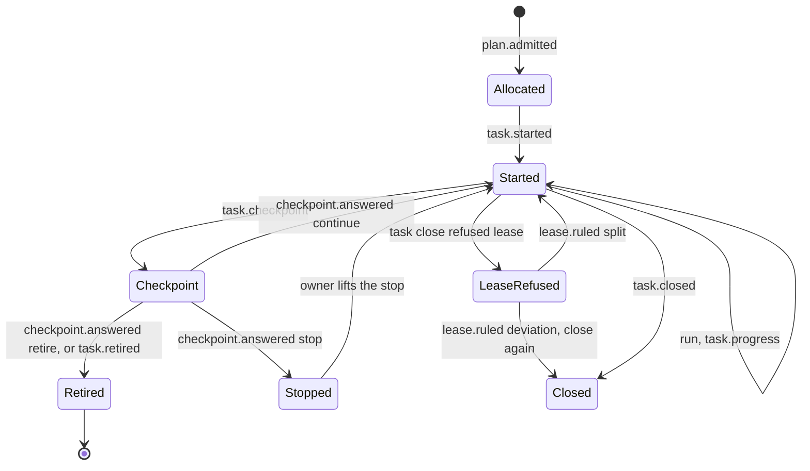
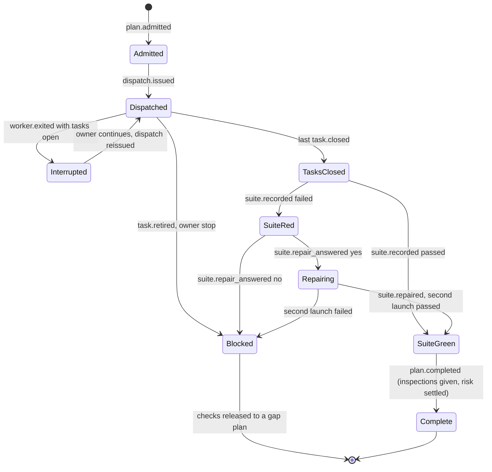
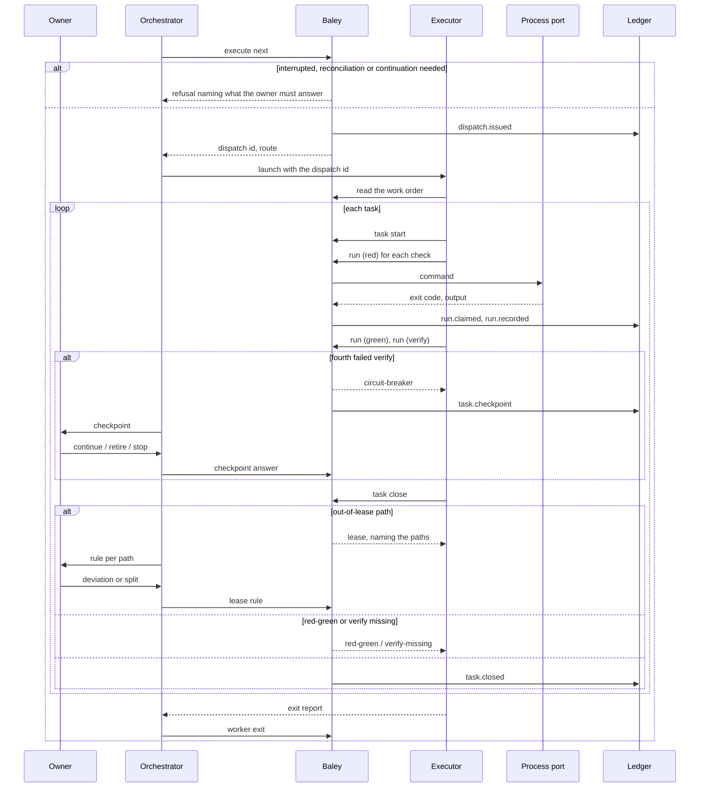
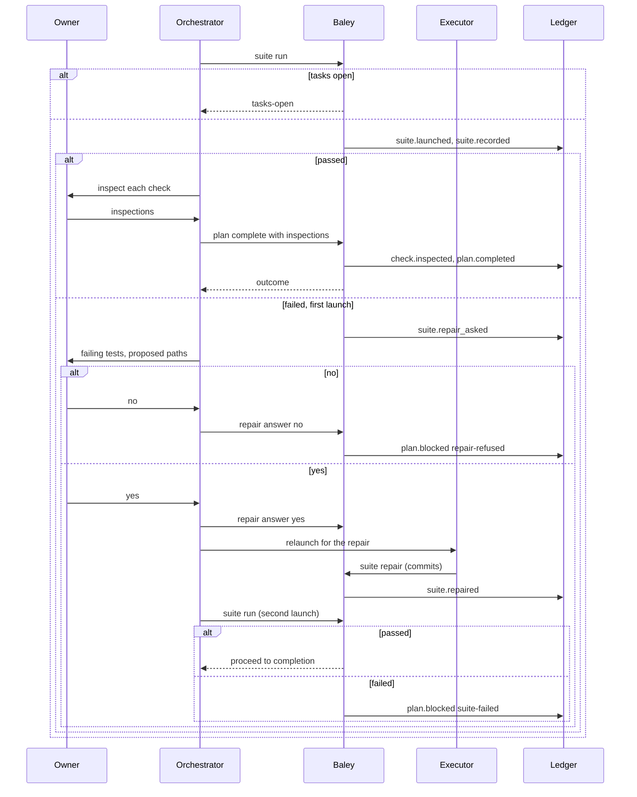

# 0006: Execution

| | |
|---|---|
| Status | Accepted |
| Design issue | [#51](https://github.com/crenshawdev/baley/issues/51), [#55](https://github.com/crenshawdev/baley/issues/55); build issues [#25](https://github.com/crenshawdev/baley/issues/25), [#40](https://github.com/crenshawdev/baley/issues/40) |
| Requirement prefix | EXE |
| Applies | [0002: System design](0002-system-design.md) |
| Related | ADRs: [0008](../adr/0008-host-sandbox-isolation.md), [0009](../adr/0009-served-instructions.md), [0018](../adr/0018-lease-enforced-at-close.md) · C4 view: components ([0002](0002-system-design.md) Figure 4) |

The current design of this area, and nothing else. Edit it in place when the design changes; git holds the history. It describes the design only, never the work still to do.

## 1. Purpose and scope

This area decides how an approved plan becomes committed, tested code:

- admission: binding a sprint's approved plans and their checks to an execution that can begin;
- the executor's work order and what the executor may and may not do;
- tasks: one signed commit each, red then green for every check, the narrowest verify per task;
- the lease: what a task may change, how a violation is caught, and what the owner rules;
- the command runner: Baley runs every test and check command itself and judges by exit code;
- the circuit breaker on a task that keeps failing;
- the suite gate at plan close, with one owner-approved repair;
- retiring a task, gap plans, plan completion, the owner's inspection of checks;
- a worker that exits without finishing, reconciliation, deviations.

It does not decide the plan's content or its evidence map ([0005](0005-context-plans-and-acceptance.md)); the verdict on each evidence item and a truth's status ([0007: Verification](0007-verification.md)); when a diff review or a risk gate fires after execution ([0008](0008-review.md), [0009](0009-risk.md)); what the guard does with git commands and protected branches ([0010: Guard](0010-guard.md)); which branch work lands on and how execution is undone ([0011](0011-milestones-landing-undo-pause.md)); or how a work order reaches a worker on each host ([0012](0012-host-interface.md)). Off-roadmap tasks (`baley task`) are [0014](0014-support-families.md).

Hand-offs: 0005 approves plans; this area admits them. The work order composer ([0002](0002-system-design.md) section 8) builds the executor's work order with the route from [0003](0003-configuration-and-routing.md). 0007 verifies what this area recorded. Every command Baley runs goes through the process port ([0002](0002-system-design.md), SYS-P8) under claim, act, record ([0001](0001-evidence-ledger.md), EVD-R26).

In the component view of [0002](0002-system-design.md) (Figure 4) this area is one of the domain areas.

## 2. Terms

| Term | Meaning |
|---|---|
| Admission | Binding the sprint's approved plans, their evidence maps and the allocation of each check to a task, at exact versions, so execution can begin. |
| Allocation | Which task delivers which check. Every check has exactly one task. |
| Dispatch | One work order to the executor for one plan: the unfinished tasks, their checks, the lease, the commands, the route. One dispatch is active per sprint. |
| Attempt | One executor run on a dispatch. A retry is a new attempt on the same dispatch. |
| Task | One unit of work: one signed commit, one or more verify commands, the checks it delivers. |
| Verify | A task's narrowest command that settles it: one test, one binary, never the suite. |
| Red, green | For a check: the run where its test fails before the code exists, and the run where it passes after; each is bound to a commit. |
| Run | One execution of a command by Baley: claimed, launched, recorded with exit code, output and a classification. |
| Lease | The files and directories a plan's tasks may change (0005). |
| Deviation | Something the executor did or found outside the plan: an out-of-lease path the owner accepted, or a stated finding that a truth or decision is wrong or unachievable. |
| Checkpoint | A stop where the executor needs the owner's answer before going on. |
| Suite | The project's test command (`workflow.test_command`), run once at plan close. |
| Repair | The one owner-approved fix and relaunch after a red suite. |
| Retire | Ending a task that cannot be done, releasing its checks. |
| Gap plan | A plan added to a sprint after admission to deliver what a blocked plan did not. |
| Inspection | The owner's per-check confirmation at plan completion that the check tests what it claims and stubs nothing it asserts about. |
| Orchestrator | The host session in its relay job (0002): launches the executor, reports its exit, relays owner answers, requests the suite and completion. |

## 3. Requirements

| Id | Rule | Why | Depends on | Status |
|---|---|---|---|---|
| EXE-R1 | Execution of a sprint begins with an admission that binds its approved plans, their evidence maps and an allocation giving every check exactly one task, all at exact versions; a plan, map or truth that changed since is refused (`stale-binding`). A later extension admits more plans and keeps every earlier binding verbatim. | The executor builds against exactly what the owner approved. | PLN-R14, PLN-R15, SYS-P4 | Active |
| EXE-R2 | One dispatch is active per sprint. It is issued for the first admitted plan with no outcome, or the plan the owner names. Its id binds the plan, the admission, the base commit and the unfinished tasks; the same state issues the same dispatch, and a changed state supersedes it (`dispatch-superseded`). | A worker can be handed the same work twice and never a different work under the same id. | SYS-P2, SYS-R6 | Active |
| EXE-R3 | The executor's work order carries everything: identity, goal, context, notes, each unfinished task with its verify commands and checks, each check's spec, the completed history, the continuation, the suite command, the lease, the command policy, the route, and the instructions of section 10. The executor reads it from Baley by id and reads nothing else of Baley's. | Baley hands the model everything it needs; the model decides nothing about the process. | SYS-P2, SYS-P9 | Active |
| EXE-R4 | A task closes on exactly one signed commit whose subject follows Conventional Commits and names the task id, reachable from HEAD and after the dispatch base; one commit closes one task. | One unit of work, one record of it. | SYS-P6 | Active |
| EXE-R5 | For every check a task delivers: a red run of its command, at a commit where its test exists and compiles and fails; then a green run at a later commit where it passes; the check's test file is byte-identical at red, green and the closing commit; the red commit is an ancestor of the green, the green of the closing commit. A close without this pair, or with a pair whose test file changed, is refused (`red-green`). | A failure that was watched is the only proof the test reaches the code. | PLN-R12 | Active |
| EXE-R6 | Every verify command a task names has a passing run at the closing commit within the closing attempt; a close without one is refused (`verify-missing`). | The task's own claim is settled by its narrowest command. | EXE-R7 | Active |
| EXE-R7 | Baley runs every command itself: the executor asks Baley to run a named verify, red, green or suite command; Baley claims the run, checks that the working tree is clean and the material (HEAD, tree, test file, command) unchanged, launches the command in the project root through the process port, and records the exit code, the output (bounded, keeping every result line) and a classification. The judgment is the exit code; a standard report file (JUnit XML) when present names the failing tests. A command not admitted for the task is refused (`command-not-admitted`). | Evidence is first-hand and every language works. | SYS-R8, SYS-P7, PLN-R18 | Active |
| EXE-R8 | A task close is refused (`lease`) when a committed or staged path lies outside the plan's lease, naming each path. The owner rules per path: accept it as a deviation, or have the executor split the commit. On a host whose hook sees file writes, the guard denies an out-of-lease write as it happens ([0010](0010-guard.md)); on a host whose hook sees only commands, the close refusal is the floor. A lease never blocks reads and never blocks another plan's tasks. | The lease means something on both hosts, and the owner decides exceptions. | SYS-P11, SYS-P12 | Active |
| EXE-R9 | Baley never edits source. The hosts' own tools edit source; Baley reads source and writes records. | One write surface, and it is the host's. | EVD-R18 | Active |
| EXE-R10 | Baley counts failed runs of one task's verify within one attempt. After three, a fourth run is refused (`circuit-breaker`) and a checkpoint goes to the owner naming the task, the three failures and the executor's last stated cause. The owner answers continue (one more attempt of three), retire, or stop. The number is Baley's and is never told to the model. | An executor does not loop on its own failure. | SYS-P5, PLN-R17 | Active |
| EXE-R11 | The executor closes its last task, reports and stops. The orchestrator, never the executor, requests the suite and plan completion. | The party that did the work does not hold the gate on it. | SYS-P5 | Active |
| EXE-R12 | The suite runs once at plan close, after every task is closed. A red suite raises one question to the owner naming the failing tests and the paths the executor proposes to touch. Yes buys exactly one repair (signed commits after the failed run, paths outside the lease recorded as deviations) and one relaunch. No, a second red, or a refused repair blocks the plan; there is never a third launch. | Repair is bounded and on the record. | EXE-R7, EXE-R11 | Active |
| EXE-R13 | A task may be retired by the owner with a reason. Retirement releases the task's checks for a later plan and blocks the plan; a blocked plan's remaining checks are released the same way. | A blocked task does not block the sprint silently. | EXE-R1 | Active |
| EXE-R14 | A gap plan is a plan approved after admission (0005) and admitted by extension, linked to the plan it repairs. A sprint is complete only when every admitted plan is complete or every check of a blocked plan is delivered by a later plan. | Nothing blocked is quietly counted as done. | EXE-R13, PLN-R20 | Active |
| EXE-R15 | A plan completes when every task is closed, the latest suite launch passed, the owner has inspected every check the plan delivered, and any risk the sprint raised is settled ([0009](0009-risk.md)). The inspection is per check, given at plan completion, and states that the check tests what it claims and stubs nothing it asserts about. | Done is proven and the owner has looked. | EXE-R5, EXE-R12 | Active |
| EXE-R16 | The orchestrator reports the executor's exit with its outcome. A dispatch whose executor exited without closing every task is interrupted; nothing continues until the owner says so. There is no timeout. | A dead worker is detected the same way on every host. | SYS-P12 | Active |
| EXE-R17 | Before any continuation, Baley reconciles the checkout: commits after the last acknowledged progress, or a dirty tree, refuse the continuation (`reconciliation-required`) until the owner rules on them. | Work Baley did not see is never built on blindly. | SYS-P7 | Active |
| EXE-R18 | Deviations are recorded on the plan's outcome and shown to the verifier: out-of-lease paths the owner accepted, repair paths outside the lease, and the executor's stated findings that a truth or a decision is wrong or unachievable. A surprise in a verify's output, even a passing one, is a stated deviation. | The verifier and the owner see everything that went beside the plan. | EXE-R8, EXE-R12 | Active |
| EXE-R19 | Every executor stop is a checkpoint answered by the owner: a decision the plan did not make, a blocked package or tool, a contradiction with a truth or decision, a lease the task cannot honor, the circuit breaker. An owner stop is lifted only by the owner. | The owner decides; the executor does not work around. | SYS-P5 | Active |
| EXE-R20 | Each dispatch round records the host's token count as reported by the orchestrator. | Cost per round is a fact the owner can see. | | Active |
| EXE-R21 | Execution is sequential: one dispatch per sprint, plans in admitted order, no parallel agents and no worktrees. | One writer to one checkout. | SYS-R6 | Active |
| EXE-R22 | The cheap git facts a task close and a run depend on (HEAD, whether the index matches) are read inside the write transaction that records them, and the command is refused if either moved. | The record binds to the checkout as it was at the moment of recording. | EVD-R7 | Active |

## 4. Roles and actors

| Actor | Receives | Returns | Model and effort from |
|---|---|---|---|
| Owner | Checkpoints; the suite repair question; lease rulings; inspection requests; retire and stop decisions | Answers with owner and time | Not applicable |
| Executor (dispatched) | The work order (EXE-R3) | Task starts, run requests, progress, checkpoints, task closes, a short exit report | `roles.executor.*` ([0003](0003-configuration-and-routing.md)); a retry may move one rung (CFG-R16) |
| Orchestrator (host session) | The dispatch id and the route | Launches the executor; reports its exit; relays owner answers; requests the suite, repair, and completion | Not applicable |
| Baley: this area | Admission, dispatch, run and close requests | Refusals, receipts, runs, outcomes | Not applicable |
| Hardin | What may happen next in the sprint | Admit, dispatch, continue, suite, complete, or the refusal | Not applicable |
| Process port | A command, a directory | Exit code, output, report file | Not applicable |

## 5. Commands and operations

Operations are typed operations on the host interface; the owner-only ones are also command-line commands under `baley exec`. Every request carries a request id and is answered once (EVD-R26).

### execution admit, execution extend

- **Inputs:** sprint; the plans with their approval digests and map versions; the allocation (task per check).
- **Outputs:** the admission record and its version.
- **Refusals:** `stale-binding` (a plan, map or truth changed), `allocation-incomplete` (a check with no task or two), `check-command` (an allocated check's command is not one of its task's verify commands), `admitted-set` (`admit` on a sprint already admitted; use `extend`) (EXE-R1).

### execute next

- **Inputs:** sprint; optional plan number (owner's choice).
- **Outputs:** the dispatch id and route to launch, or `complete`, or a refusal.
- **Refusals:** `interrupted` (an unanswered worker exit), `reconciliation-required` (EXE-R17), `continuation-required` (a checkpoint or stop unanswered), `active-plan-conflict` (another plan's dispatch is active), `suite-failed` (every plan has an outcome and the sprint is not complete) (EXE-R2, EXE-R16, EXE-R19).

### task start, task progress, task checkpoint, task close

- **Inputs:** `start`: dispatch, task, attempt. `progress`: acknowledged commit, or a stated deviation with evidence. `checkpoint`: kind and question. `close`: the closing commit, per check the red and green commits and runs, the verify runs.
- **Outputs:** the task's new version; on close, the plan's outcome so far.
- **Refusals:**

  | Code | When | Requirement |
  |---|---|---|
  | `dispatch-superseded` | The dispatch id is not the active one | EXE-R2 |
  | `red-green` | A check without its pair, a pair out of order, or a test file that changed | EXE-R5 |
  | `verify-missing` | A verify command without a passing run at the closing commit | EXE-R6 |
  | `lease` | A committed or staged path outside the lease, named | EXE-R8 |
  | `commit` | Unsigned, wrong subject, not after the base, not reachable from HEAD, or already closed another task | EXE-R4 |
  | `checkout-moved` | HEAD or the index moved between observation and record | EXE-R22 |

### run

- **Inputs:** dispatch, task, the command, the stage (`verify`, `red`, `green`), the check for red and green.
- **Outputs:** the run record: exit code, bounded output, classification, report file summary when present.
- **Refusals:** `command-not-admitted`, `tree-dirty`, `material-changed`, `circuit-breaker` (EXE-R7, EXE-R10).

### lease rule (owner)

- **Inputs:** the task, each named path, the ruling (`deviation` or `split`).
- **Outputs:** the ruling recorded; a `deviation` ruling lets the close proceed; a `split` ruling returns the task to the executor with the paths named.
- **Refusals:** `no-such-path` (EXE-R8).

### checkpoint answer, task retire, stop (owner)

- **Inputs:** the checkpoint and the answer (`continue`, `retire`, `stop`); `retire` carries a reason.
- **Outputs:** the answer recorded; retire blocks the plan and releases the task's checks.
- **Refusals:** `no-such-checkpoint`, `already-answered` (EXE-R10, EXE-R13, EXE-R19).

### suite run, suite repair answer, suite repair, plan complete

- **Inputs:** `suite run`: the plan (orchestrator). `repair answer`: the question, yes or no (owner). `repair`: the repair commits (executor). `plan complete`: the plan, with the owner's inspections (orchestrator).
- **Outputs:** the run record; the repair question; the relaunch; the plan's outcome.
- **Refusals:** `tasks-open`, `suite-launched` (a second launch without an approved repair), `repair-refused`, `inspection-missing`, `suite-red`, `risk-unsettled` (EXE-R11, EXE-R12, EXE-R15).

### worker exit (orchestrator)

- **Inputs:** the dispatch, the outcome (`exited`, `failed`), detail.
- **Outputs:** the dispatch marked interrupted when tasks remain.
- **Refusals:** `no-such-dispatch` (EXE-R16).

### round record (orchestrator)

- **Inputs:** the dispatch round, the host token count.
- **Outputs:** recorded (EXE-R20).

## 6. Records

### plan.admitted (event, `phase/<n>` stream)

| Field | Type | Meaning |
|---|---|---|
| `version` | integer | 1 for the admission, then each extension |
| `plans` | list | plan number, approval digest, map version |
| `allocation` | list | check id, check version, task id |
| `repairs` | list | for a gap plan, the plan it repairs |

### dispatch.issued (event, `phase/<n>` stream)

| Field | Type | Meaning |
|---|---|---|
| `id` | digest | Binds plan, admission version, base commit, unfinished tasks |
| `plan`, `attempt` | integers | |
| `route` | route ([0003](0003-configuration-and-routing.md)) | Model, rung, sources |
| `work_order` | payload reference | The work order as served |

### task events (`phase/<n>` stream)

| Event | Fields |
|---|---|
| `task.started` | dispatch, task, attempt, base commit |
| `task.progress` | task, acknowledged commit, or deviation (text, evidence) |
| `task.checkpoint` | task, kind (`decision`, `blocked`, `contradiction`, `lease`, `circuit-breaker`), question |
| `checkpoint.answered` | checkpoint, answer, owner, time |
| `task.closed` | task, closing commit, per check: red commit, red run, green commit, green run, test file digest; verify runs |
| `task.retired` | task, reason, owner, time |
| `lease.ruled` | task, path, ruling, owner, time |

### run events (`phase/<n>` stream)

| Event | Fields |
|---|---|
| `run.claimed` | dispatch, task, command, stage, check, material (HEAD, tree, test file digest) |
| `run.recorded` | run, exit code, output (payload reference; first and last 64 KiB plus every result line), classification (`passed`, `failed`, `unknown`), report summary |

### suite and plan events (`phase/<n>` stream)

| Event | Fields |
|---|---|
| `suite.launched`, `suite.recorded` | plan, launch number (1 or 2), run |
| `suite.repair_asked` | plan, failing tests, proposed paths |
| `suite.repair_answered` | question, yes or no, owner, time |
| `suite.repaired` | question, commits, paths, out-of-lease paths |
| `check.inspected` | check, test file digest, red run, green run, no subject stub, owner, time |
| `plan.completed` | plan, closing commits, deviations |
| `plan.blocked` | plan, reason (`task-retired`, `suite-failed`, `repair-refused`, `owner-stop`), released checks |
| `worker.exited` | dispatch, outcome, detail, interrupted |
| `round.recorded` | dispatch, attempt, host token count |

### Views

| View | Key | Content |
|---|---|---|
| `dispatch` | project, sprint | The active dispatch, its tasks and their state, checkpoints, runs |
| `plan` | project, sprint, plan | Adds admission version, outcome, deviations, suite state, inspections |
| `run` | project, run | One run's launch and result |

## 7. States

*Figure 1. States of a task.*

*Figure 2. States of a plan under execution.*

```mermaid
stateDiagram-v2
  [*] --> Claimed: run.claimed
  Claimed --> Recorded: run.recorded
  Claimed --> Abandoned: process exit seen with no record; reconciled
  Recorded --> [*]
```

*Figure 3. States of a run.*

## 8. Workflows

*Figure 4. A dispatch: from issue to the executor's exit.*

*Figure 5. The suite gate, the one repair, and plan completion.*

## 9. Settings

| Setting | Type | Default | Scope | Owner | Effect |
|---|---|---|---|---|---|
| `workflow.test_command` | command | absent | project | 0006 | The suite Baley runs at plan close (EXE-R12); a project with none cannot admit a plan |
| `workflow.lint_command` | command | absent | project | 0006 | Run once at plan close beside the suite; a failure is reported, never a gate |
| `roles.executor.model`, `roles.executor.effort`, `escalate_on_failure` | see [0003](0003-configuration-and-routing.md) | | both | 0003 | The executor's route and its retry rung |
| `git.protected_branches`, `git.on_protected`, `git.auto_branch`, `git.base_branch` | see [0003](0003-configuration-and-routing.md) | | project | [0010](0010-guard.md), [0011](0011-milestones-landing-undo-pause.md) | Which branch a dispatch works on and what the guard does there |

## 10. Instructions served

| Instruction | Served to | Carries requirements |
|---|---|---|
| Executor | The executor, in its work order: read the work order by id; for each check write the test first in a tests-only file, commit it compiling and failing, ask Baley to run it red, implement, ask Baley to run it green, never touch the test file again until close; run only the task's named verify commands through Baley; predict each verify's output first and state any surprise as a deviation; one signed conventional commit per task naming the task id; stage files by name, never everything; never push, force-push, amend, reset or spawn a reviewer; stop at a checkpoint and wait; close the last task, report, and stop; the default test style of [0005](0005-context-plans-and-acceptance.md) when the project has set nothing | EXE-R3 to EXE-R7, EXE-R11, EXE-R18, EXE-R19 |
| Orchestrator | The host session, as the execute stub: admit, execute next, launch the named worker with the dispatch id and route, report its exit, relay checkpoints and lease rulings to the owner, collect inspections, request the suite, relay the repair question, request completion, record the round's token count | EXE-R11, EXE-R15, EXE-R16, EXE-R20 |

The lease is stated to the executor as the exact files and directories, with the rule that a change outside them stops the close until the owner rules.

## 11. Build status

The code today is the Cadence engine crate awaiting rename. Its native execution path is close to this design; the differences are listed per requirement.

| Requirement | Status | Where |
|---|---|---|
| EXE-R1 | Built | `crates/cadence/src/execution/admission.rs:84-124, 178-272`, `crates/cadence/src/execution/allocation.rs:69-118` |
| EXE-R2 | Built | `crates/cadence/src/execution/dispatch.rs:43-55, 178-211, 234-287` |
| EXE-R3 | Built, with the old read shape | `crates/cadence/src/execution/instructions.rs:16-24`, `crates/cadence/src/read/document.rs:33-160` |
| EXE-R4 | Partly built | Signature checked on the closing commit only (`crates/cadence/src/execution/receipts.rs:700-701, 729-734`) |
| EXE-R5 | Built | `crates/cadence/src/execution/receipts.rs:456-490` |
| EXE-R6 | Built | `crates/cadence/src/execution/receipts.rs:502-514` |
| EXE-R7 | Partly built | Runner at `crates/cadence/src/execution/runner.rs:303-394, 497-547`; classification understands only cargo and nextest lines (`runner.rs:603-636`), no exit-code rule or report file |
| EXE-R8 | Not built as designed | Out-of-lease commits close as deviations (`crates/cadence/src/execution/receipts.rs:722-727`); staged paths refuse (`:735-739`); guard denies no lease path |
| EXE-R9 | Built | No source edit exists |
| EXE-R10 | Not built | Documented in 3.x only |
| EXE-R11 | Built as prose | The binary accepts suite and completion from any caller (`crates/cadence/src/execution_runner_service.rs:34-91`) |
| EXE-R12 | Built | `crates/cadence/src/execution/history.rs:1051-1169` |
| EXE-R13 | Built | `crates/cadence/src/execution/history.rs:336-357, 435-469` |
| EXE-R14 | Partly built | Gap plans enter by extension (`crates/cadence/src/execution/admission.rs:103-105`); nothing links a gap plan to the plan it repairs; completion accepts any later completed plan (`crates/cadence/src/execution/history.rs:897-910`) |
| EXE-R15 | Built | `crates/cadence/src/execution/history.rs:1171-1219`, `crates/cadence/src/execution/receipts.rs:134-237` |
| EXE-R16 | Built | `crates/cadence/src/execution/runner.rs:137-216` |
| EXE-R17 | Built | `crates/cadence/src/execution_service.rs:1281-1286`, `crates/cadence/src/execution/runner.rs:232-263` |
| EXE-R18 | Partly built | Executor-stated deviations are not copied onto the plan outcome (`crates/cadence/src/execution/history.rs:917-968`) |
| EXE-R19 | Built | `crates/cadence/src/execution_service.rs:246-300, 387-417` |
| EXE-R20 | Built | `crates/cadence/src/execution/history.rs:1030-1050` |
| EXE-R21 | Built | Plans in numeric order (`crates/cadence/src/execution/plan.rs:495-519`) |
| EXE-R22 | Not built | `GitObservation` values supplied by the caller (`crates/baley-store-sqlite/src/transact.rs`, #40) |

## 12. Open questions

| Question | Decided by |
|---|---|
| Whether Codex runs a hook before `apply_patch`, which decides whether the guard's early lease stop exists there | [0010: Guard](0010-guard.md), by a probe on Codex |
| The exact report formats Baley reads beside the exit code, per language | [0012: Host interface](0012-host-interface.md) with the process port |
