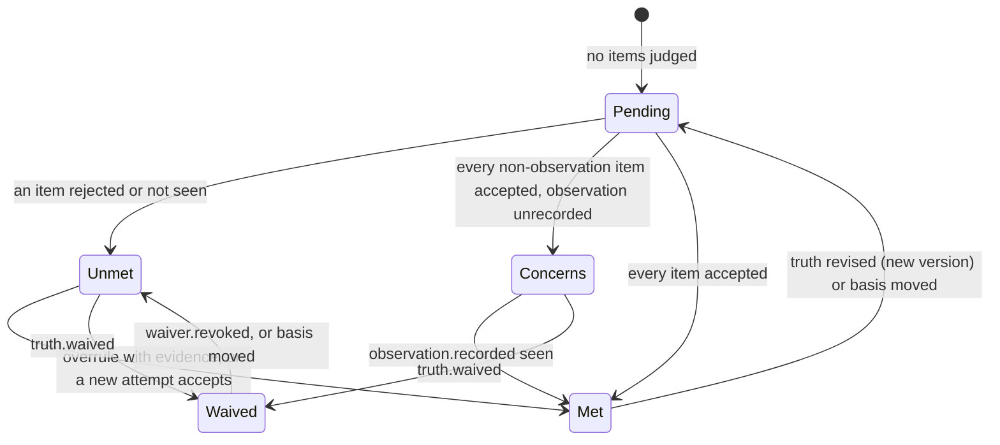
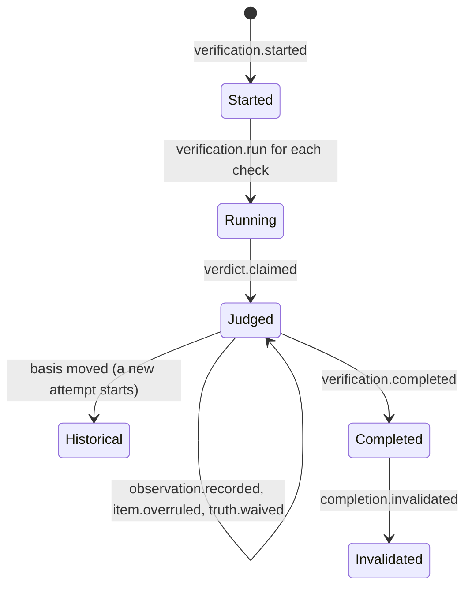
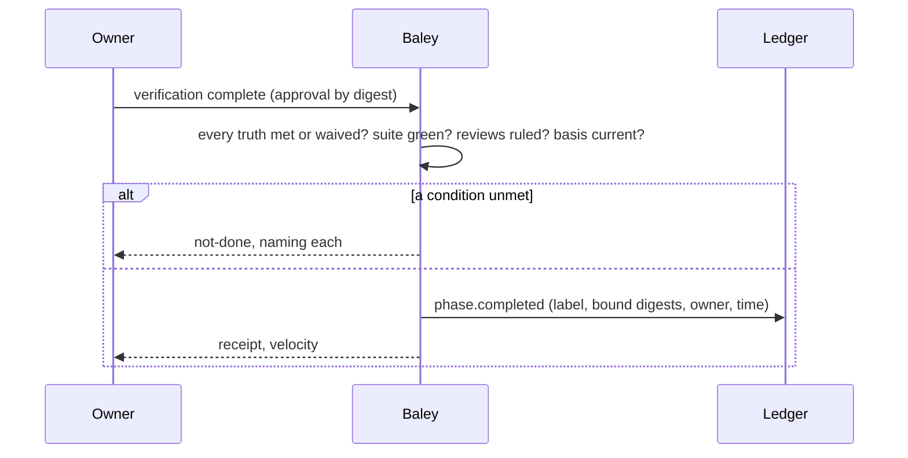

# 0007: Verification

| | |
|---|---|
| Status | Draft |
| Design issue | none; build issues [#25](https://github.com/crenshawdev/baley/issues/25), [#93](https://github.com/crenshawdev/baley/issues/93) |
| Requirement prefix | VER |
| Applies | [0002: System design](0002-system-design.md) |
| Related | ADRs: [0006](../adr/0006-no-markdown-records.md), [0009](../adr/0009-served-instructions.md) · C4 view: components ([0002](0002-system-design.md) Figure 4) |

The current design of this area, and nothing else. Edit it in place when the design changes; git holds the history. It describes the design only, never the work still to do.

## 1. Purpose and scope

This area decides how a sprint's evidence becomes a decision:

- what the verifier receives and what it returns: one verdict per evidence item;
- how Baley re-runs every check itself before a verdict on it counts;
- how a truth's status is derived from verdicts, the owner's observation records, overrules and waivers;
- what completes a sprint, what the owner approves, and when a completion stops applying;
- the audit: the read-only trace from a story to its proof.

It does not decide what a truth or an evidence map is ([0005](0005-context-plans-and-acceptance.md)); how checks were made red then green or how the suite ran ([0006](0006-execution.md)); when a review fires on the finished sprint ([0008: Review](0008-review.md) [TARGET]); or what closes a milestone ([0011](0011-milestones-landing-undo-pause.md) [TARGET]).

Hand-offs: 0006 hands over a sprint whose plans are complete; this area verifies it; 0005's definition of done and sprint close use the status this area derives; 0011 closes milestones over completed sprints.

In the component view of [0002](0002-system-design.md) (Figure 4) this area is one of the domain areas.

## 2. Terms

| Term | Meaning |
|---|---|
| Attempt | One verification of one sprint at one basis. |
| Basis | The digest of everything the attempt judges: the sprint's context (its stories' truth versions), plans and evidence maps, admissions, execution outcomes and the source at HEAD. |
| Verdict | The verifier's judgment on one evidence item: `accepted`, `rejected` or `not_seen`, with what was observed. |
| Independent run | Baley's own run of a check's command for this attempt, separate from the executor's red and green runs. |
| Status | A truth's derived state: `pending`, `met`, `concerns`, `unmet`, `waived`. Never written by a model. |
| Observation record | The owner's record that an observation item was seen, or not, with time. |
| Overrule | The owner's record, with evidence, that a rejected item is accepted. |
| Waiver | The owner's record that an unmet truth is accepted as it is, with a reason. |
| Completion | The record that a sprint is done, bound to the basis it was judged at. |
| Audit | A read-only query from a story to the truths, evidence, verdicts and status that prove it. |
| Verifier | The dispatched role that inspects every evidence item. |

## 3. Requirements

| Id | Rule | Why | Depends on | Status |
|---|---|---|---|---|
| VER-R1 | Verification of a sprint starts only when every admitted plan is complete or repaired by a completed gap plan, no dispatch is active, every task close and run re-validates, and the working tree equals HEAD apart from what Baley itself installed (`source-dirty` otherwise). | The verifier judges finished, committed work. | EXE-R14, EXE-R17 | Active |
| VER-R2 | Each attempt is recorded with its basis before the verifier is dispatched. A verdict submitted against a different basis is refused (`stale-basis`). | A verdict binds to exactly what it judged. | SYS-P7 | Active |
| VER-R3 | The verifier's work order carries the truths (by story and version), the evidence map, each item's spec, and the executor's recorded runs by id and size, never the bytes; it reads run output through Baley in bounded parts. It never receives plan prose, summaries or the executor's report. | A summary is not evidence, and a work order stays bounded. | SYS-P2, PLN-R12 | Active |
| VER-R4 | The verifier returns one verdict per item in the map: `accepted`, `rejected` or `not_seen`, with what it observed. A verdict on an item not in the map, a duplicate, a missing item, a blank observation or a truth status are refused (`verdict-shape`). A second patch for one attempt is refused. | The model judges evidence; it never writes a status. | SYS-P3 | Active |
| VER-R5 | For every `check` item Baley runs the check's command itself, once for the attempt, through the process port, and records the run; a verdict of `accepted` on a check whose independent run did not pass is refused (`check-not-passed`). The verifier never runs the suite. | Baley's own run is the evidence; the model reports what it saw. | SYS-R8, EXE-R7 | Active |
| VER-R6 | A check whose test could not have failed (the verifier finds it asserts nothing the truth cares about, or stubs the thing it claims) is returned `rejected`, never `accepted`. | A passing grade on a weak assertion is worse than none. | PLN-R12 | Active |
| VER-R7 | Baley derives each truth's status from the current judgment: no items gives `pending`; any item `rejected` or `not_seen` and not overruled gives `unmet`; every item accepted (by the verifier, by an overrule, or by the owner's observation record) gives `met`; every non-observation item accepted and an observation item nobody has recorded gives `concerns`. | Claims are no broader than evidence. | VER-R4, VER-R9, VER-R10 | Active |
| VER-R8 | The current judgment is the latest complete verdict patch whose basis equals the basis observed now; earlier patches are history and stay visible, rejections included. | Nothing that did not count is hidden from the next planner. | VER-R2 | Active |
| VER-R9 | The owner records an observation item as `seen` or `not_seen`, with time. A `seen` record makes the item count as accepted; `not_seen` leaves it not accepted. A model's verdict on an observation item never makes its truth `met`. | What a person must see is proven by the person. | VER-R7 | Active |
| VER-R10 | The owner may overrule a rejected item: the record names the item, the evidence (a run Baley made, a commit, or a stated reason) and the time; the item then counts as accepted; the verifier's rejection stays visible beside it. An overrule without evidence is refused (`overrule-evidence`). | The verifier can be wrong, and the owner answers for the call. | SYS-P5 | Active |
| VER-R11 | The owner may waive a truth that is not `met`, with a reason and time, bound to the truth's version and the current attempt. A waived truth shows as `waived` beside the met ones, never among them; waiving a met truth is refused (`already-met`). A waiver stops applying when the basis or the truth version changes. More than one waiver in a sprint adds the advice to revisit the plan. | An accepted failure is recorded as exactly that. | VER-R7 | Active |
| VER-R12 | A sprint completes when every committed story's truths are `met` or `waived`, the latest suite passed, and every review the sprint raised is ruled ([0008](0008-review.md) [TARGET]). Completion is the owner's approval by digest of the sprint's facts, with owner and time, recorded as `phase.completed` labelled `complete` or `complete-with-waivers`. A request while a condition is unmet is refused (`not-done`) naming each condition. | Done means proven and approved. | PLN-R20, VER-R7 | Active |
| VER-R13 | A completion binds the sprint's context, plans, admissions and execution. When any of them changes (a truth revised, a plan replaced, an extension admitted, execution undone), `completion.invalidated` is projected and the sprint is no longer complete; a source change alone does not invalidate it. | Completion stands for what was judged, not for whatever came later. | PRJ-R15, EVD-R2 | Active |
| VER-R14 | The audit is a read-only query: for a story, or a sprint, or the project, the trace story, sprint, plan, truth, evidence item, verdict, status, with every break named (a story with no sprint, a truth with no check, a check with no independent run, a sprint with no completion). | The owner can see where proof is missing before being told. | | Active |
| VER-R15 | The verifier is routed by `roles.verifier.*` and a retry moves one rung when `escalate_on_failure` is set; the attempt number comes from the ledger. | Same routing rule as every role. | CFG-R16 | Active |

## 4. Roles and actors

| Actor | Receives | Returns | Model and effort from |
|---|---|---|---|
| Owner | Truth statuses; rejected items with the verifier's observation; observation items to see; the sprint's facts at completion | Observation records; overrules with evidence; waivers with reasons; completion approval | Not applicable |
| Verifier (dispatched) | The work order (VER-R3) | One verdict per item with what was observed | `roles.verifier.*` ([0003](0003-configuration-and-routing.md)) |
| Orchestrator (host session) | The attempt id and route | Launches the verifier; returns its patch; relays owner records | Not applicable |
| Baley: this area | Attempts, patches, owner records, completion requests | Independent runs, derived statuses, refusals, records | Not applicable |
| Hardin | Whether verification or completion may happen now | Allow or refuse with what is missing | Not applicable |
| Process port | A check's command | Exit code, output, report | Not applicable |

## 5. Commands and operations

Operations are typed operations on the host interface; owner-only ones are also command-line commands under `baley verify`.

### verify next

- **Inputs:** the sprint.
- **Outputs:** the attempt id, its basis, the verifier's route; or `complete` when a current judgment already exists.
- **Refusals:** `plans-open`, `dispatch-active`, `source-dirty`, `close-invalid` (a task close or run no longer re-validates) (VER-R1).

### verification run

- **Inputs:** the attempt, the check item.
- **Outputs:** the independent run record.
- **Refusals:** `no-such-item`, `not-a-check`, `stale-basis`, `already-run` (VER-R5).

### verification submit

- **Inputs:** the attempt, one verdict per item.
- **Outputs:** the derived status of every truth; the items rejected or not seen.
- **Refusals:** `verdict-shape`, `check-not-passed`, `stale-basis`, `already-submitted` (VER-R4, VER-R5).

### observation record, overrule, waive (owner)

- **Inputs:** `observation record`: the item, `seen` or `not_seen`, time. `overrule`: the item, the evidence, time. `waive`: the truth and version, the reason, time.
- **Outputs:** the record and the truths' derived statuses.
- **Refusals:**

  | Code | When | Requirement |
  |---|---|---|
  | `no-such-item`, `no-such-truth` | | PRJ-R18 |
  | `not-an-observation` | `observation record` on a check, artifact or link | VER-R9 |
  | `not-rejected` | `overrule` on an item not rejected in the current judgment | VER-R10 |
  | `overrule-evidence` | No evidence given, or a named run or commit does not exist | VER-R10 |
  | `already-met` | `waive` on a met truth | VER-R11 |
  | `stale-basis` | The basis moved since the record was prepared | VER-R2 |

### verification complete

- **Inputs:** the sprint, the attempt, the owner's approval by digest of the sprint's facts, owner, time; optional retrospective notes ([0005](0005-context-plans-and-acceptance.md), PLN-R21).
- **Outputs:** `phase.completed`; the velocity of the closed sprint.
- **Refusals:** `not-done` naming each unmet condition; `stale-basis` (VER-R12).

### audit

- **Inputs:** a story, a sprint, or nothing (the project).
- **Outputs:** the trace with every break named (VER-R14).
- **Refusals:** `no-such-story`, `no-such-phase` (PRJ-R18).

## 6. Records

### verification events (`verification/<attempt>` stream)

| Event | Fields |
|---|---|
| `verification.started` | sprint, attempt, basis (and its parts: context digest, plans, maps, admission version, execution digest, HEAD), route |
| `verification.run` | attempt, item, run (as [0006](0006-execution.md) `run.recorded`) |
| `verdict.claimed` | attempt, per item: verdict, observed (bounded), runs cited |
| `observation.recorded` | attempt, item, `seen` or `not_seen`, owner, time |
| `item.overruled` | attempt, item, evidence (run, commit or reason), owner, time |
| `truth.waived` | attempt, story, truth, version, reason, owner, time |
| `waiver.revoked` | the waiver, owner, time |
| `verification.completed` | attempt, label |

### phase.completed, completion.invalidated (events, `phase/<n>` stream)

| Field | Type | Meaning |
|---|---|---|
| `attempt` | attempt id | The attempt whose judgment completed the sprint |
| `label` | `complete`, `complete-with-waivers` | |
| `bound` | digests | Context, plans, admissions, execution the completion binds |
| `owner`, `at` | actor, time | The approval (completed) |
| `changed` | which bound part | What changed (invalidated) |

### Views

| View | Key | Content |
|---|---|---|
| `verification` | project, sprint | The current attempt and judgment: per truth the status and per item the verdict, run, observation record, overrule, waiver; the history of earlier attempts |
| `phase` | project, sprint | Adds completion state and whether it still applies |
| `backlog` | project | Each story's truths with status ([0005](0005-context-plans-and-acceptance.md)) |

## 7. States



*Figure 1. Derived states of a truth.*



*Figure 2. States of a verification attempt.*

## 8. Workflows

```mermaid
sequenceDiagram
  participant O as Owner
  participant H as Orchestrator
  participant B as Baley
  participant V as Verifier
  participant P as Process port
  participant L as Ledger
  H->>B: verify next
  alt plans open, dispatch active or tree dirty
    B-->>H: refusal naming it
  else
    B->>L: verification.started (basis)
    B-->>H: attempt id, route
    H->>V: launch
    V->>B: read the work order
    loop each check
      V->>B: verification run
      B->>P: command
      P-->>B: exit code, output
      B->>L: verification.run
    end
    V->>B: verification submit (one verdict per item)
    alt shape wrong, or accepted check whose run failed
      B-->>V: verdict-shape / check-not-passed
    else
      B->>L: verdict.claimed
      B->>B: derive each truth's status
      B-->>H: statuses, rejected and not-seen items
      H->>O: statuses; observations to see; rejections
      O->>H: observation records, overrules with evidence, waivers
      H->>B: the owner's records
      B->>L: observation.recorded, item.overruled, truth.waived
      B-->>H: statuses
    end
  end
```

*Figure 3. A verification attempt.*



*Figure 4. Completing a sprint.*

## 9. Settings

| Setting | Type | Default | Scope | Owner | Effect |
|---|---|---|---|---|---|
| `roles.verifier.model`, `roles.verifier.effort`, `escalate_on_failure` | see [0003](0003-configuration-and-routing.md) | | both | 0003 | The verifier's route and retry rung (VER-R15) |

## 10. Instructions served

| Instruction | Served to | Carries requirements |
|---|---|---|
| Verifier | The verifier, in its work order: for each item open it, ask Baley to run it, or trace it; return one verdict per item with what you observed; a summary is not evidence; an item whose check could not have failed is rejected; you do not set a truth's status; read run output through Baley by id | VER-R3 to VER-R6 |
| Verify stub | The host session: call verify next, launch the named verifier with the attempt id, return its patch, relay the owner's records, request completion with the owner's approval | VER-R2, VER-R12 |

## 11. Build status

The code today is the Cadence engine crate awaiting rename; its verification path is close to this design.

| Requirement | Status | Where |
|---|---|---|
| VER-R1 | Built | `crates/cadence/src/verification/inputs.rs:51-95, 145-221` |
| VER-R2 | Built | `crates/cadence/src/verification/model.rs:32-47`, `crates/cadence/src/verification_service.rs:162-201` |
| VER-R3 | Partly built | Identities and route answered, no prompt (`crates/cadence/src/verification_service.rs:251-273`); output by digest (D-177) |
| VER-R4 | Built | `crates/cadence/src/verification/verdicts.rs:98-160` |
| VER-R5 | Partly built | Independent run required (`crates/cadence/src/verification/verdicts.rs:136-153`, `crates/cadence/src/verification/runner.rs:136-200`); only cargo, nextest and "Ran N" summaries count (`runner.rs:48-64`), no exit-code rule |
| VER-R6 | Built as instruction | `crates/cadence/src/verification/instructions.rs` |
| VER-R7 | Partly built | Status reduction (`crates/cadence/src/verification/status.rs:50-59`); no overrule or observation record in the reduction |
| VER-R8 | Built | `crates/cadence/src/verification/status.rs:115-126` |
| VER-R9 | Partly built | Human results as owner-approved passed/failed/skipped bound to a rendered `UAT.md` (`crates/cadence/src/verification/human.rs:97-160, 233-247`); a passed result resolves the item but does not make the truth met |
| VER-R10 | Not built | |
| VER-R11 | Built | `crates/cadence/src/verification/waivers.rs:105-257`, `crates/cadence/src/verification/status.rs:128-191` |
| VER-R12 | Partly built | Completion gate (`crates/cadence/src/verification/completion.rs:209-302`); carries no owner or time; ticks `ROADMAP.md` and edits `REQUIREMENTS.md` (`completion.rs:281-302`) |
| VER-R13 | Built | `crates/cadence/src/verification/completion.rs:79-129` |
| VER-R14 | Built over Markdown | `crates/cadence/src/verification/audit.rs:84-240`; parses `REQUIREMENTS.md` bold spans (#93) |
| VER-R15 | Partly built | Route resolved with attempt `None` (`crates/cadence/src/verification_service.rs:187`) |

## 12. Open questions

| Question | Decided by |
|---|---|
| How the verifier reads run output on each host within the bounded read contract | [0012: Host interface](0012-host-interface.md) [TARGET] |
