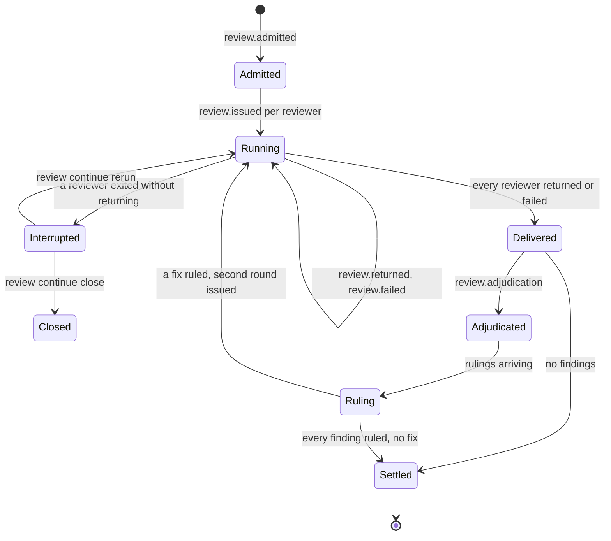
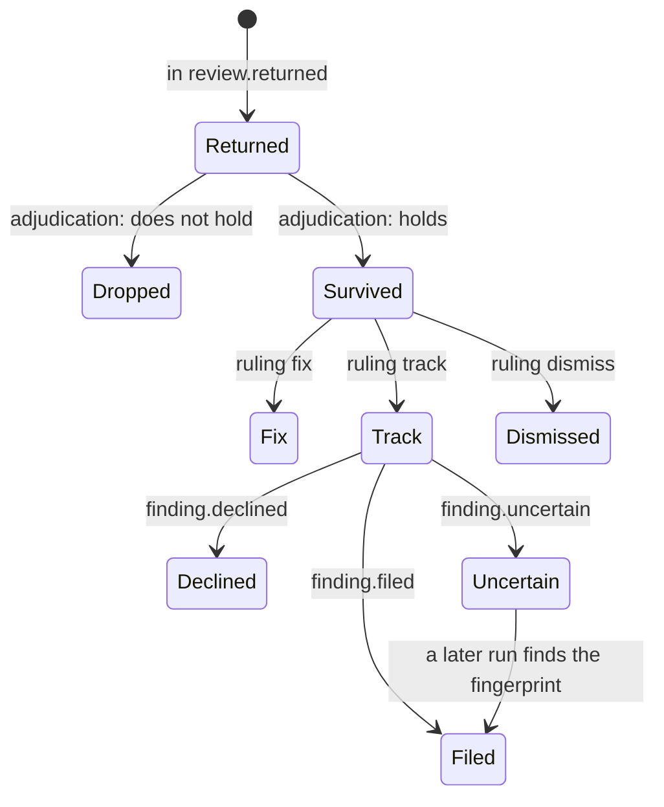
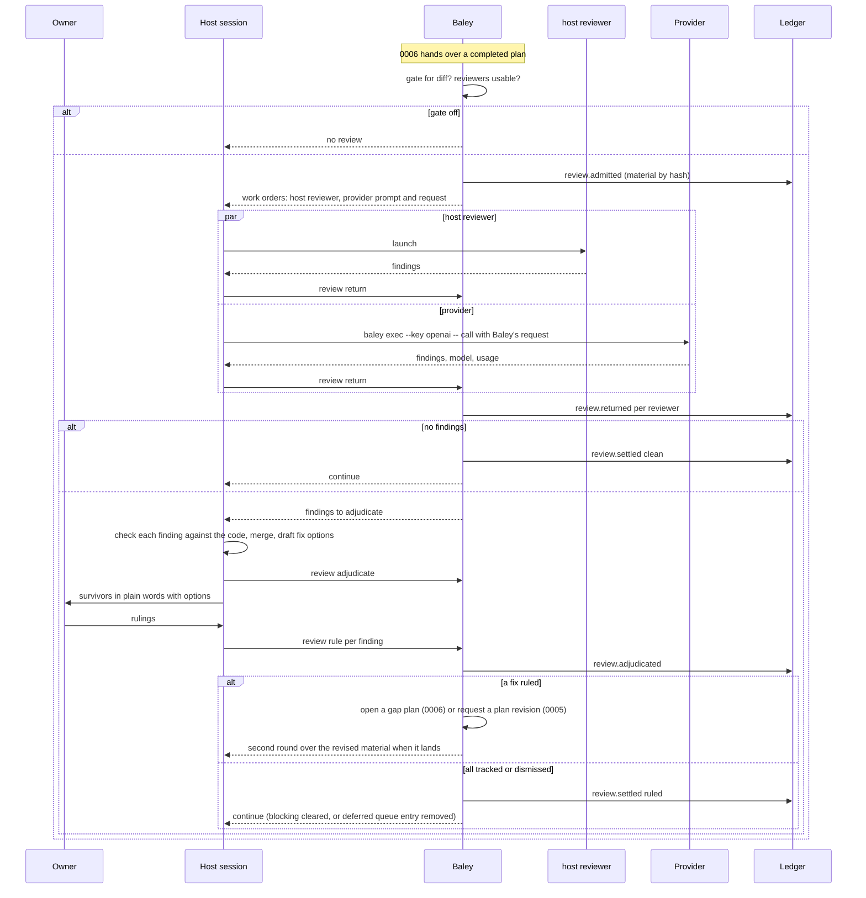
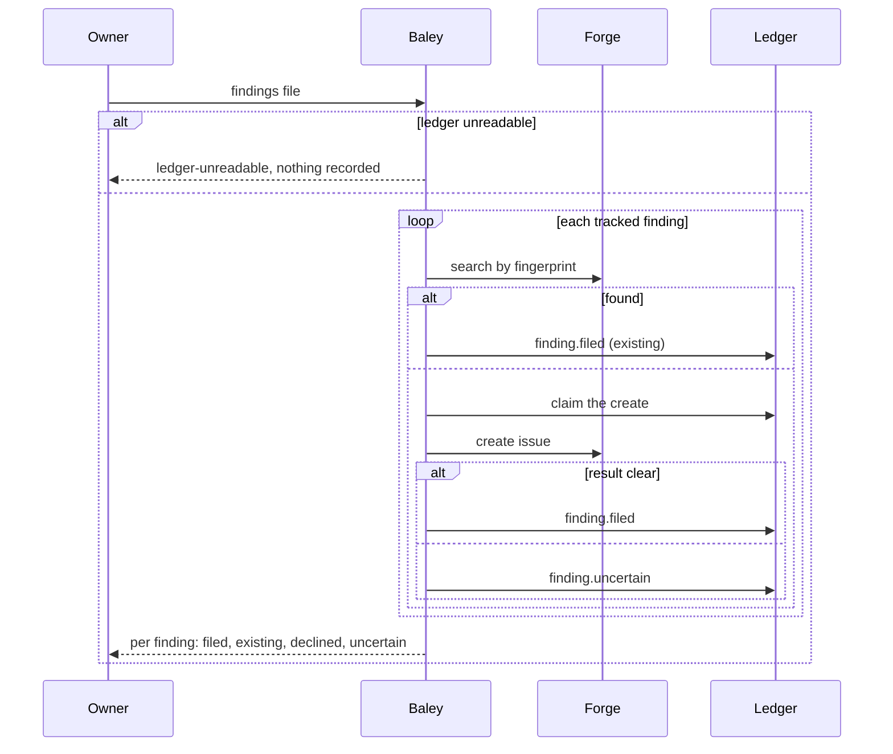

# 0008: Review

| | |
|---|---|
| Status | Draft |
| Design issue | [#48](https://github.com/crenshawdev/baley/issues/48); build issue [#26](https://github.com/crenshawdev/baley/issues/26) |
| Requirement prefix | REV |
| Applies | [0002: System design](0002-system-design.md) |
| Related | ADRs: [0007](../adr/0007-forge-anchors.md), [0009](../adr/0009-served-instructions.md), outside models called by the host session [TARGET] · C4 view: components ([0002](0002-system-design.md) Figure 4) |

The current design of this area, and nothing else. Edit it in place when the design changes; git holds the history. It describes the design only, never the work still to do.

## 1. Purpose and scope

This area decides how other models critique the work and what the owner does with what they find:

- the three triggered reviews (a plan, a finished plan's diff, a risk surface), their gates and what each gate holds;
- the reviewers: the host's own subagent and outside providers, and how the host session makes an outside call on Baley's prompt;
- the review work order, the material it carries, and the typed findings that come back;
- adjudication by the host session and the owner's ruling on every finding;
- what a ruling produces: a plan revision, a gap plan, a tracked issue, or nothing;
- the deferred queue and what waits on it;
- the on-demand reviews: minimalism, decision, diagnosis;
- filing the findings the owner chooses to track as issues on the forge.

It does not decide how risk is detected or when its review fires ([0009: Risk](0009-risk.md) [TARGET]); the plan checker's dimensions and the plan revision it produces ([0005](0005-context-plans-and-acceptance.md)); gap plans and execution ([0006](0006-execution.md)); debug episodes and consult ([0014](0014-support-families.md) [TARGET]); or how the forge is reached ([0011](0011-milestones-landing-undo-pause.md) [TARGET]).

Hand-offs: 0005 raises the plan review; 0006 raises the diff review at plan completion; 0009 raises the risk review; landing (0011) waits on the deferred queue; the work order composer ([0002](0002-system-design.md) section 8) builds every review work order with the route from [0003](0003-configuration-and-routing.md).

In the component view of [0002](0002-system-design.md) (Figure 4) this area is one of the domain areas.

## 2. Terms

| Term | Meaning |
|---|---|
| Review | One critique of one target by one or more reviewers, ending in the owner's rulings. |
| Trigger | What raised a review: `plan` (a submitted plan), `diff` (a completed plan's committed range), `risk_surface` (a risk match, 0009). |
| Kind | An on-demand review: `minimalism`, `decision`, `diagnosis`. A review has a trigger or a kind, never both. |
| Gate | What the trigger's review holds: `off`, `advisory`, `deferred`, `blocking`, `adjudicated`. |
| Reviewer | A voice that critiques: `host` (the host's own subagent, routed as the reviewer role) or a provider (`openai`, `gemini`, `deepseek`). |
| Tier | A provider's model class for a trigger: `flagship`, `balanced`, `cheap`, mapped to a model name per provider (0003). |
| Round | One pass of every reviewer over the target. A review has at most two rounds. |
| Material | The exact bytes reviewed: a plan payload with its context, a committed range, a staged tree, a named file or directory; retained by content hash. |
| Finding | One typed claim from a reviewer: file, line, severity (`blocker`, `high`, `medium`, `low`), claim, failure scenario. |
| Adjudication | The host session's check of each finding against the code: what holds, what does not, and the fix options, brought to the owner in plain words. |
| Ruling | The owner's decision on one finding: `fix`, `track` or `dismiss` with a reason. |
| Settlement | The state of a review once every finding of its current round has a ruling. |
| Deferred queue | Reviews with a `deferred` gate whose rulings are still owed. |
| Filing | Creating an issue on the forge for a finding the owner ruled `track`. |
| Fingerprint | The stable identity of a finding used to find an existing issue for it. |

## 3. Requirements

| Id | Rule | Why | Depends on | Status |
|---|---|---|---|---|
| REV-R1 | A review has exactly one trigger (`plan`, `diff`, `risk_surface`) or one kind (`minimalism`, `decision`, `diagnosis`). Triggered reviews carry the trigger's gate; on-demand kinds have no gate. | One shape, two ways in. | | Active |
| REV-R2 | Gates: `off` raises no review; `advisory` lets work continue once the round is delivered and adjudicated; `deferred` queues the review and lets work continue until landing; `blocking` and `adjudicated` hold the work until every finding of the current round has an owner ruling. A round with no findings settles on delivery. Pending, interrupted or failed delivery never lets work continue. | The owner sets how strictly each review holds the work; nothing clears a gate but a ruling. | SYS-P5 | Active |
| REV-R3 | Every reviewer in `review.reviewers` runs on every triggered review; there is no mode. The `host` reviewer is the host's own subagent routed by `roles.reviewer.*`; a provider reviewer uses the model of `review.providers.
.tiers.<trigger tier>` and the effort of `review.triggers.<t>.effort`. A provider with no model for the tier, or no key when a key is needed, is named as not run; an empty usable set falls back to `host`. A reviewer that could not run never counts as a pass. | Every configured voice is heard, and a missing one is visible. | CFG-R12, CFG-R28 | Active |
| REV-R4 | Baley builds one review work order per reviewer: the material by hash, the trigger's intent, the finding schema, and for a provider the complete prompt and request. The host session makes the outside call and returns the typed findings; Baley never calls a provider. Keys reach the call only through `baley exec --key` (SYS-R11). The prompt is measured against `review.max_prompt_tokens` and refused when over (`prompt-too-large`); the call is bounded by `review.request_timeout_ms`. | Responsibility stays with the party that acts, and cost stays bounded. | SYS-R9, SYS-R11, SYS-P2 | Active |
| REV-R5 | Material is acquired once at admission, retained as `material` payloads by content hash, and never replaced by current source. A committed range is read from git; a staged tree from the index; a plan from its approved payload with the sprint's context and stories. Material past the source bound is refused naming the file and size. | Every reviewer and the owner see the same bytes, and the record can show them later. | EVD-R11, EVD-R14 | Active |
| REV-R6 | A reviewer returns findings only, each with file, line, severity, claim and failure scenario; at most 100 per round; a finding missing a field is refused (`finding-shape`) and the return fails. The raw return is retained. An empty list is a valid result only after a real attempt; a launch or transport failure is recorded as a failure, never as an empty review. | Findings are data the owner can rule on; a failure is not a pass. | SYS-P3 | Active |
| REV-R7 | Before any finding reaches the owner, the host session adjudicates: it checks each finding against the code, drops what does not hold with the reason recorded, and brings each survivor in plain words with the options for fixing it. Findings from several reviewers that name the same fault are presented once, with each reviewer credited. | The owner rules on verified claims, not on raw output. | SYS-P5 (0002 section 2) | Active |
| REV-R8 | The owner rules on every surviving finding: `fix`, `track` (goes to filing) or `dismiss` with a reason. Each ruling is one `review.adjudicated` record naming the review, round, finding and reviewers. Baley never applies a finding, reruns a review or re-plans on its own. | Who answers for the work decides what is done about it. | SYS-P5 | Active |
| REV-R9 | A `fix` ruling produces work through the normal path. Plan review: the planner revises the plan and it is re-submitted, checked and approved (0005). Diff or risk review: Baley opens a gap plan (0006) holding the fix as tasks; the planner writes it, the owner approves it, the executor runs it under the lease. On-demand kinds: the ruling records the wanted change for the next sprint planning; nothing runs from it. | A fix is planned and proven like any other change. | PLN-R14, EXE-R14 | Active |
| REV-R10 | A `fix` ruling on a triggered review grants one more round over the revised material, recorded as used; there is never a third round. The second round's findings are adjudicated and ruled the same way. | Review converges by the owner's decision, not by looping. | REV-R8 | Active |
| REV-R11 | A `deferred` review stays in the deferred queue until every finding of its current round is ruled. Landing ([0011](0011-milestones-landing-undo-pause.md) [TARGET]) refuses its external steps while the queue holds an unruled review, and next action ([0013](0013-next-action-and-progress.md) [TARGET]) surfaces the queue in its order. Nothing beside the queue can hide a member. | Deferred means later, not never. | REV-R2 | Active |
| REV-R12 | A review is a new request with a fresh id whenever the reviewer set, the material or the trigger differs; a retry of the same request is answered from the record. Changing the reviewers on the same material is a new review, never a replay. | A changed policy gets a fresh critique. | EVD-R26 | Active |
| REV-R13 | A review whose reviewer exited without returning is interrupted; it is neither closed nor rerun until the owner says so. A late return that matches the request closes it. | A killed process is never taken as success. | SYS-P7 | Active |
| REV-R14 | On-demand reviews are one command with a kind: `minimalism` over a named file, a directory or a sprint's range; `decision` over one recorded decision; `diagnosis` over a debug episode's reported cause (0014). Each uses the `host` reviewer and the owner's chosen providers, the same findings, adjudication and rulings, and no gate. | One mechanism for every critique. | REV-R1 | Active |
| REV-R15 | Filing: only a finding the owner ruled `track` is filed, and only when the owner runs filing; a finding never filed itself. Before each create, the forge is searched for the finding's fingerprint; an existing issue is recorded instead of a second one. The create is claimed before it runs and recorded after (`finding.filed` with the issue); an unclear result leaves the finding `uncertain`, and a later run that finds its fingerprint records it as filed. A finding the owner declines to file is recorded `declined` and not offered again. Filing refuses when the ledger cannot be read, and records nothing. | Tracked findings reach the tracker once, on the owner's word, with a record. | SYS-P7, ADR 0007 | Active |
| REV-R16 | Filing supports GitHub in the first release. | One proven lookup, create and reconciliation before duplicate protection is claimed. | CFG-R29 | Active |
| REV-R17 | Filing supports GitLab and Forgejo, each with its own proven lookup, create and reconciliation. | The owner has accounts on all of them. | REV-R15 | Backlog |
| REV-R18 | Stories and sprints are mirrored to forge issues and milestones (PLN-R22); a filed finding links to its story's issue where one exists. | Findings sit beside the work on the forge. | PLN-R22 | Backlog |
| REV-R19 | Every review round records, per reviewer, what was requested (model, effort, tier) and what was observed (the provider's reported model, token usage as exact integers, duration); an omitted count is unknown, never zero, and no estimate stands in for an observed usage. | Cost is a fact on the record. | SYS-P6 | Active |
| REV-R20 | Provider request and response bodies are redacted of keys before retention; a payload whose redaction would change its meaning is refused before the call. | Keys never enter the record. | SYS-R11, CFG-R26 | Active |

## 4. Roles and actors

| Actor | Receives | Returns | Model and effort from |
|---|---|---|---|
| Owner | Adjudicated findings with fix options; the deferred queue; filing candidates | Rulings (fix, track, dismiss with reason); the word to file; declines | Not applicable |
| Reviewer `host` (dispatched) | The review work order: material, intent, finding schema | Findings | `roles.reviewer.*` ([0003](0003-configuration-and-routing.md)) |
| Provider reviewer (called by the host session) | The complete prompt and request Baley built | Findings, the provider's model and usage | `review.providers.
.tiers.<tier>`, `review.triggers.<t>.effort` |
| Host session | Work orders; findings to adjudicate | The outside call's result; the adjudication; the owner's rulings | Not applicable |
| Baley: this area | Admissions, returns, rulings, filing requests | Work orders, refusals, settlement, records | Not applicable |
| Forge adapter ([0011](0011-milestones-landing-undo-pause.md) [TARGET]) | A fingerprint lookup; a create on approval | Existing issue or none; the created issue | Not applicable |

## 5. Commands and operations

Operations are typed operations on the host interface; the owner-only ones are also command-line commands under `baley review`.

### review admit

- **Inputs:** the trigger (from 0005, 0006 or 0009) or the kind (from the owner); the target; the caller.
- **Outputs:** the review id, the gate, the reviewers that will run and those named as not run, one work order per reviewer.
- **Refusals:**

  | Code | When | Requirement |
  |---|---|---|
  | `trigger-or-kind` | Both or neither given | REV-R1 |
  | `gate-off` | The trigger's gate is `off` | REV-R2 |
  | `material-unavailable` | A named file, range or tree cannot be read, or exceeds the source bound (names it) | REV-R5 |
  | `no-reviewer` | No reviewer usable and `host` cannot be routed | REV-R3 |
  | `prompt-too-large` | A provider prompt exceeds `review.max_prompt_tokens` | REV-R4 |

### review return

- **Inputs:** the review, the reviewer, the typed findings (or a failure with its kind), the observed model and usage.
- **Outputs:** the round's state: which reviewers have returned.
- **Refusals:** `finding-shape`, `no-such-review`, `already-returned`, `not-issued` (a return for a reviewer that was never issued) (REV-R6, REV-R12).

### review adjudicate

- **Inputs:** the review and round; per finding: holds or dropped with the reason, the merged findings, the fix options.
- **Outputs:** the survivors for the owner.
- **Refusals:** `round-incomplete` (a reviewer still pending or interrupted), `no-such-finding` (REV-R7, REV-R13).

### review rule (owner)

- **Inputs:** the review, round, finding; `fix`, `track` or `dismiss`; the reason for `dismiss`.
- **Outputs:** `review.adjudicated`; when every finding is ruled, the review's settlement and, for a `fix`, what it produced (a plan revision request, a gap plan opened, or a recorded change).
- **Refusals:** `no-such-finding`, `already-ruled`, `not-adjudicated` (the finding did not go through adjudication), `third-round` (a `fix` after the second round; the finding may only be tracked or dismissed) (REV-R8, REV-R10).

### review continue (owner)

- **Inputs:** an interrupted review; `rerun` or `close`.
- **Outputs:** a new issue of the reviewer, or the review closed as interrupted.
- **Refusals:** `not-interrupted` (REV-R13).

### review queue

- **Inputs:** the project.
- **Outputs:** the deferred queue: each unruled review, its trigger, sprint and the findings owed (REV-R11).

### findings file (owner)

- **Inputs:** the findings to file (defaults to every `track` ruling not yet filed or declined); optional declines.
- **Outputs:** per finding: filed with the issue, already present with the existing issue, declined, or uncertain.
- **Refusals:** `ledger-unreadable`, `forge-unavailable`, `not-tracked` (a finding not ruled `track`) (REV-R15).

## 6. Records

### review.admitted (event, `review/<id>` stream)

| Field | Type | Meaning |
|---|---|---|
| `trigger` or `kind` | enum | REV-R1 |
| `caller` | enum | `plan`, `execute`, `risk`, `owner` |
| `target` | table | Sprint and plan; committed range; staged tree; file or directory; decision id; debug episode |
| `material` | list of payload references | The retained bytes by hash |
| `gate` | enum | The gate in force, from `policy.effective` |
| `reviewers` | list | Each with requested model, effort, tier; or `not-run` with the reason |
| `policy_version` | integer | The policy the review was admitted under |

### review.issued, review.returned, review.failed (events)

`review.issued`: reviewer, round, work order id. `review.returned`: reviewer, round, findings (payload reference), observed model, usage (input, output, reasoning tokens as integers or unknown), duration. `review.failed`: reviewer, round, kind (`launch`, `transport`, `malformed`, `interrupted`), detail.

### finding (part of `review.returned`)

| Field | Type | Meaning |
|---|---|---|
| `id` | review, round, reviewer, index | Stable identity |
| `file`, `line` | path, integer | Where |
| `severity` | `blocker`, `high`, `medium`, `low` | |
| `claim`, `failure_scenario` | text | What is wrong and what goes wrong |
| `fingerprint` | digest | Over file, claim and failure scenario, for filing |

### review.adjudication (event)

Per finding: `holds` or `dropped` with the reason; merged with (other findings naming the same fault); fix options. By the host session.

### review.adjudicated (event)

| Field | Type | Meaning |
|---|---|---|
| `finding` | finding id | |
| `ruling` | `fix`, `track`, `dismiss` | |
| `reason` | text | Required for `dismiss` |
| `produced` | reference or absent | The plan revision request, gap plan, or recorded change a `fix` produced |
| `owner`, `at` | actor, time | |

### review.settled, review.deferred (events)

`review.settled`: round, label (`clean`, `ruled`), the extra round used or not. `review.deferred`: queued at, and on settlement, removed.

### finding.filed, finding.declined, finding.uncertain (events, `review/<id>` stream)

`finding.filed`: finding, forge, issue number or URL, claimed at, recorded at, `existing` when found by fingerprint. `finding.declined`: finding, owner, time. `finding.uncertain`: finding, the claim, the error.

### Views

| View | Key | Content |
|---|---|---|
| `review` | project, review | Trigger or kind, gate, target, reviewers and their state, findings with adjudication and rulings, settlement, rounds, filing state |
| `review_queue` | project | Deferred reviews with rulings owed, in the order next action uses |

## 7. States

*Figure 1. States of a review. A `deferred` gate places the review in the queue from Delivered until Settled.*

*Figure 2. States of a finding.*

## 8. Workflows

*Figure 3. A triggered review from admission to settlement.*

*Figure 4. Filing tracked findings.*

## 9. Settings

| Setting | Type | Default | Scope | Owner | Effect |
|---|---|---|---|---|---|
| `review.reviewers` | list of `host`, `openai`, `gemini`, `deepseek` | `["host"]` | both | 0008 | Which reviewers run on every triggered review (REV-R3) |
| `review.providers.
.tiers.<flagship,balanced,cheap>` | model name | absent | both | 0008 | The model per tier per provider, checked against the catalog (CFG-R14) |
| `review.triggers.<plan,diff,risk_surface>.gate` | `off`, `advisory`, `deferred`, `blocking`, `adjudicated` | plan `advisory`, diff `off`, risk_surface `blocking` | both | 0008 | What each review holds (REV-R2); the plan gate is also the checker's switch (PLN-R16) |
| `review.triggers.<t>.tier` | `flagship`, `balanced`, `cheap` | `cheap` | both | 0008 | Which provider tier reviews |
| `review.triggers.<t>.effort` | `minimal`, `low`, `medium`, `high` | plan `low`, diff `minimal`, risk_surface `low` | both | 0008 | Provider effort per trigger |
| `review.request_timeout_ms` | integer, 1 to 600000 | 540000 | both | 0008 | Bound on one outside call |
| `review.max_prompt_tokens` | integer, min 1 | 120000 | both | 0008 | Bound on a provider prompt |
| `roles.reviewer.*` | see [0003](0003-configuration-and-routing.md) | | both | 0003 | The `host` reviewer's route |

`review.mode` is removed: every listed reviewer runs and the host session adjudicates. `review.consult.*` belongs to debug ([0014](0014-support-families.md) [TARGET]).

## 10. Instructions served

| Instruction | Served to | Carries requirements |
|---|---|---|
| Reviewer | The `host` reviewer and, inside the provider prompt, each provider: refute, do not bless; a finding needs a file, a line and a concrete failure; approach differences are not findings; no inflation, no softening; empty only after a real attempt; return findings only, in the schema | REV-R6 |
| Adjudicator | The host session, as the review stub: for each finding open the code it names and decide whether it holds; drop what does not, with the reason; merge duplicates across reviewers; write each survivor in plain words with the options for fixing it; bring them to the owner; never apply a fix | REV-R7, REV-R8 |
| Outside call | The host session: make the provider call through `baley exec --key <provider>` with the request Baley built, unchanged; return the typed findings and the provider's reported model and usage | REV-R4, REV-R19 |
| Review stubs | The host session: which operation `review`, `review queue` and `findings file` call | REV-R14, REV-R15 |

## 11. Build status

The code today is the Cadence engine crate awaiting rename. Its review records are close to this design; its gates cannot clear and Baley itself calls providers.

| Requirement | Status | Where |
|---|---|---|
| REV-R1 | Built | `crates/cadence/src/review/policy.rs:7-11`, `crates/cadence/src/review_service.rs:189` |
| REV-R2 | Partly built | Gate actions (`crates/cadence/src/review/policy.rs:83-106`); blocking and adjudicated wait for a settlement nothing writes (`crates/cadence/src/review_service.rs:426`) |
| REV-R3 | Partly built | Selection modes still exist (`crates/cadence/src/review/selection.rs:55-179`); fallback fixed to `claude-subagent` (`review_service.rs:574-578`) |
| REV-R4 | Not built as designed | Baley calls providers itself (`crates/cadence/src/review/provider/delivery.rs`, `transport.rs:59-117`); prompt bound built (`payload.rs:128-134`) |
| REV-R5 | Built | `crates/cadence/src/review/material.rs:425-687`, `crates/cadence/src/review/admission.rs:22-47` |
| REV-R6 | Built | `crates/cadence/src/review/contract.rs:80-172`, `crates/cadence/src/review/returns.rs:326-374` |
| REV-R7, REV-R8, REV-R9, REV-R10 | Not built | No adjudication or ruling operation (`crates/cadence/src/review/views.rs` transports supplied views only); the extra round exists on an unreachable pause path (`crates/cadence/src/pause_service.rs:976-996`) |
| REV-R11 | Partly built | Queue written (`crates/cadence/src/review/deferred.rs:128-170`); no operation leaves `Unruled`, so landing blocks forever (`crates/cadence/src/landing_service.rs:123-127`) |
| REV-R12 | Partly built | Replay key from target bytes alone (`crates/cadence/src/review_service.rs:1338`) |
| REV-R13 | Partly built | `recover_attempt` has no caller (`crates/cadence/src/review/recovery.rs:42-96`) |
| REV-R14 | Partly built | Minimalism and decision built (`crates/cadence/src/review/specialist.rs:23-46`, `crates/cadence/src/review/selection.rs:298-323`); diagnosis has no caller |
| REV-R15, REV-R16 | Not built | Landing's tracker check only reads (`crates/cadence/src/landing/report.rs:1`) |
| REV-R19 | Built | `crates/cadence/src/review/provider/usage.rs:8-9, 85-106`, `records.rs:22-46` |
| REV-R20 | Built | `crates/cadence/src/review/provider/payload.rs:25-80` |

## 12. Open questions

| Question | Decided by |
|---|---|
| How soon after a create the forge's search can be trusted to find the new issue by fingerprint | [0011: Milestones, landing, undo and pause](0011-milestones-landing-undo-pause.md) [TARGET] with the forge adapter, by a measurement on GitHub |
| How the host session's outside call is made on each host and how its result returns typed | [0012: Host interface](0012-host-interface.md) [TARGET] |
