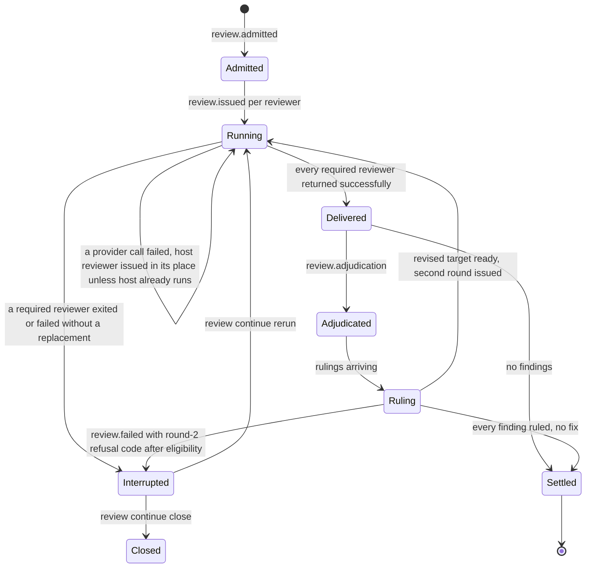
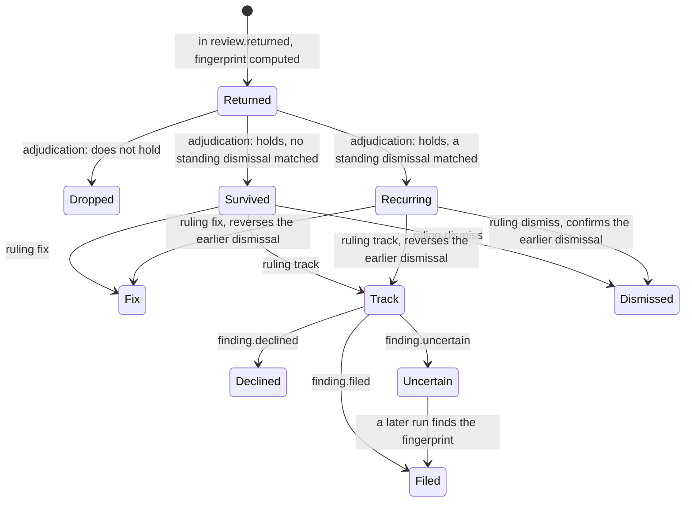
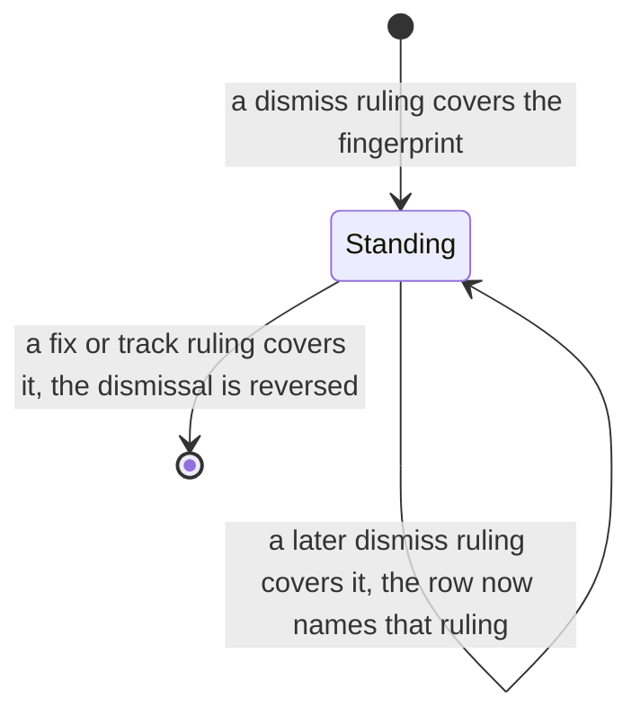
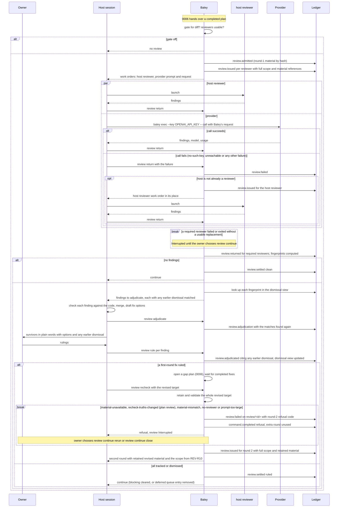
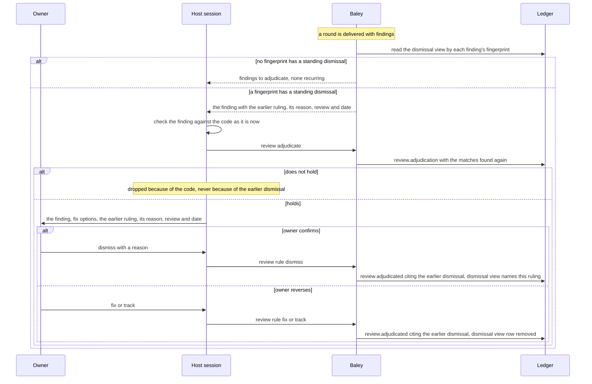
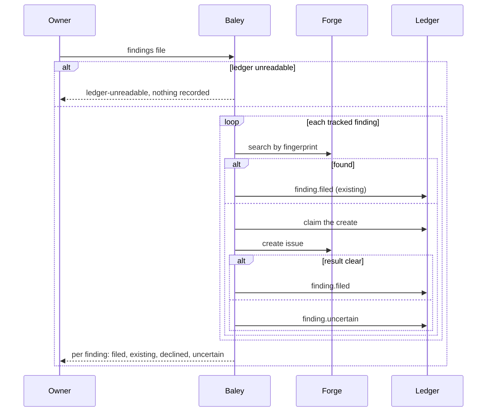

# 0008: Review

| | |
|---|---|
| Status | Accepted |
| Design issue | [#48](https://github.com/crenshawdev/baley/issues/48); build issue [#26](https://github.com/crenshawdev/baley/issues/26) |
| Requirement prefix | REV |
| Applies | [0002: System design](0002-system-design.md) |
| Related | ADRs: [0007](../adr/0007-forge-anchors.md), [0009](../adr/0009-served-instructions.md), [0013](../adr/0013-host-session-calls-outside-models.md), [0019](../adr/0019-reviews-adjudicated-and-ruled.md), [0027](../adr/0027-vendor-folders-and-plain-keys.md), [0037](../adr/0037-plan-recheck-scope.md) · C4 view: components ([0002](0002-system-design.md) Figure 4) |

The current design of this area, and nothing else. Edit it in place when the design changes; git holds the history. It describes the design only, never the work still to do.

## 1. Purpose and scope

This area decides how other models critique the work and what the owner does with what they find:

- the three triggered reviews (a plan, a finished plan's diff, a risk surface), their gates and what each gate holds;
- the reviewers: the host's own subagent and outside providers, and how the host session makes an outside call on Baley's prompt;
- the review work order, the material it carries, and the typed findings that come back;
- adjudication by the host session and the owner's ruling on every finding;
- recognizing a returned finding the owner dismissed before, and bringing that dismissal back to the owner to confirm or reverse;
- what a ruling produces: a plan revision, a gap plan, a tracked issue, or nothing;
- the deferred queue and what waits on it;
- the on-demand reviews: minimalism, decision, diagnosis;
- filing the findings the owner chooses to track as issues on the forge.

It does not decide how risk is detected or when its review fires ([0009: Risk](0009-risk.md)); the plan checker's dimensions and the plan revision it produces ([0005](0005-context-plans-and-acceptance.md)); gap plans and execution ([0006](0006-execution.md)); debug episodes, their reproduction and when a stuck one is offered a diagnosis review ([0014](0014-support-families.md)); or how the forge is reached ([0011](0011-milestones-landing-undo-pause.md)).

Hand-offs: 0005 raises the plan review; 0006 raises the diff review at plan completion; 0009 raises the risk review; landing (0011) waits on the deferred queue; the work order composer ([0002](0002-system-design.md) section 8) builds every review work order with the route from [0003](0003-configuration-and-routing.md).

In the component view of [0002](0002-system-design.md) (Figure 4) this area is one of the domain areas.

## 2. Terms

| Term | Meaning |
|---|---|
| Review | One critique of one target by one or more reviewers, ending in the owner's rulings. |
| Trigger | What raised a review: `plan` (a submitted plan), `diff` (a completed plan's committed range), `risk_surface` (a risk match, 0009). |
| Kind | An on-demand review: `minimalism`, `decision`, `diagnosis`. A review has a trigger or a kind, never both. |
| Gate | What the trigger's review holds: `off`, `advisory`, `deferred`, `blocking`, `adjudicated`. |
| Reviewer | A voice that critiques: `host` (the host's own subagent, routed as the reviewer role) or a provider (`openai`, `gemini`, `deepseek`). |
| Tier | A provider's model class for a trigger: `flagship`, `balanced`, `cheap`, mapped to a model name per provider (0003). |
| Round | One pass of every reviewer over the target. A review has at most two rounds. |
| Material | The exact bytes reviewed: a plan payload with its context, a committed range, a staged tree, a named file or directory, a recorded decision, or a debug episode's record with its reproduction and the runs Baley recorded of it; retained by content hash. |
| Finding | One typed claim from a reviewer: file, line, severity (`blocker`, `high`, `medium`, `low`), claim, failure scenario. |
| Adjudication | The host session's check of each finding against the code: what holds, what does not, and the fix options, brought to the owner in plain words with any earlier dismissal Baley matched. |
| Ruling | The owner's decision on one finding: `fix`, `track` or `dismiss` with a reason. |
| Standing dismissal | For one fingerprint in one project, the latest ruling that covers it, when that ruling is `dismiss`. A later `fix` or `track` ruling covering the same fingerprint ends it. |
| Recurring finding | A returned finding whose fingerprint, or the fingerprint of a finding merged with it, has a standing dismissal in the same project. Baley decides the match, never a model. |
| Confirm, reverse | What the owner's ruling on a recurring finding does to the earlier dismissal: `dismiss` confirms it, `fix` or `track` reverses it. Either ruling cites the earlier one. |
| Settlement | The state of a review once every finding of its current round has a ruling. |
| Deferred queue | Reviews with a `deferred` gate whose rulings are still owed. |
| Filing | Creating an issue on the forge for a finding the owner ruled `track`. |
| Fingerprint | The stable identity of a finding, computed by Baley from its file, claim and failure scenario (REV-R21). Filing uses it to find an existing issue; adjudication uses it to find a standing dismissal. |

## 3. Requirements

| Id | Rule | Why | Depends on | Status |
|---|---|---|---|---|
| REV-R1 | A review has exactly one trigger (`plan`, `diff`, `risk_surface`) or one kind (`minimalism`, `decision`, `diagnosis`). Triggered reviews carry the trigger's gate; on-demand kinds have no gate. | One shape, two ways in. | | Active |
| REV-R2 | Gates: `off` raises no review; `advisory` lets work continue once the round is delivered and adjudicated; `deferred` queues the review and lets work continue until landing; `blocking` and `adjudicated` hold the work until every finding of the current round has an owner ruling. A round with no findings settles on delivery. Pending, interrupted or failed delivery never lets work continue. | The owner sets how strictly each review holds the work; nothing clears a gate but a ruling. | SYS-P5 | Active |
| REV-R3 | Every reviewer in `review.reviewers` runs on every triggered review; there is no mode. The `host` reviewer is the host's own subagent routed by `roles.reviewer.*`; a provider reviewer uses the model of `review.providers.
.tiers.<trigger tier>` and the effort of `review.triggers.<t>.effort`. A provider with no model for the tier is named as not run at admission. Admission does not read `keys.env`. When a provider's call fails for any reason (`baley exec --key` refusing with `no-such-key` because `keys.env` has no line for it, the provider unreachable, or any other failure of the call), the failure is recorded as `review.failed`; a key refusal from `baley exec --key` has kind `launch`. In place of a provider that is not run or whose call failed, the `host` reviewer, the host's own subagent routed by `roles.reviewer.*`, is issued and reviews like any host review. When `host` is already in `review.reviewers`, no second host review runs, and the provider stays recorded as not run or failed. A reviewer that could not run never counts as a pass. | Every configured voice is heard, a missing one is visible, and a review never goes without a reviewer because a provider could not be reached. | CFG-R12, CFG-R27, CFG-R28 | Active |
| REV-R4 | Baley builds one review work order per reviewer: the material by hash, the trigger's intent, the finding schema, and for a provider the complete prompt and request. The host session makes the outside call and returns the typed findings; Baley never calls a provider. Keys reach the call only through `baley exec --key` (SYS-R11). The prompt is measured against `review.max_prompt_tokens` and refused when over (`prompt-too-large`); the call is bounded by `review.request_timeout_ms`. A round-2 work order carries its scope, its first-round reference and the retained material for that round; every reviewer in the round receives the same selected material. The work order binds the baseline, the revised target, the truth versions for a plan, the material references and the policy version that selected the scope. Before issue, retained inputs must match round 1 and the revised target. Scope is resolved once when the round-2 work orders are created, and retries and replacement reviewers keep that binding. | Responsibility stays with the party that acts, and cost stays bounded. | SYS-R9, SYS-R11, SYS-P2 | Active |
| REV-R5 | Material is acquired once for each round, at admission for round 1 and before round 2 is issued, retained by content hash and never replaced with current source during that round. A committed range is read from git; a staged tree from the index; a plan from its submitted draft payload with the phase's context and versioned story truths; a decision from its record; a debug episode from its recorded events, with the recorded output of each run of its reproduction. The original plan, revised plan and truth snapshots are retained before a replaced draft is discarded. Plan and truth snapshots use `record` references; generated review input and prompts use `material` references. Material past the source bound is refused naming the file and size. A missing or unreadable required input refuses the re-check with `material-unavailable`, changed truth versions with `recheck-truths-changed`, and any other mismatch against round 1, the revised target or the issued work order with `material-mismatch`. Baley substitutes neither current source nor another scope. The `review recheck` operation records a refusal after eligibility and moves the review to Interrupted as described in section 5, including when plan truths changed. | Every reviewer and the owner see the same bytes, and the record can show them later. | EVD-R11, EVD-R14 | Active |
| REV-R6 | A reviewer returns findings only, each with file, line, severity, claim and failure scenario; at most 100 per round; a finding missing a field is refused (`finding-shape`) and the return fails. The raw return is retained. An empty list is a valid result only after a real attempt; a launch or transport failure is recorded as a failure, never as an empty review. | Findings are data the owner can rule on; a failure is not a pass. | SYS-P3 | Active |
| REV-R7 | Before any finding reaches the owner, the host session adjudicates: it checks each finding against the code, drops what does not hold with the reason recorded, and brings each survivor in plain words with the options for fixing it and with any earlier dismissal Baley matched (REV-R22). Findings from several reviewers that name the same fault are presented once, with each reviewer credited. | The owner rules on verified claims, not on raw output. | SYS-P5 (0002 section 2), REV-R22 | Active |
| REV-R8 | The owner rules on every surviving finding: `fix`, `track` (goes to filing) or `dismiss` with a reason. Each ruling is one `review.adjudicated` record naming the review, round, finding and reviewers, and citing any earlier dismissal the finding matched (REV-R23). Baley never applies a finding, reruns a review or re-plans on its own. | Who answers for the work decides what is done about it. | SYS-P5, REV-R23 | Active |
| REV-R9 | A `fix` ruling produces work through the normal path. Plan review: the planner revises the plan and it is re-submitted, checked and approved (0005). Diff or risk review: Baley opens a gap plan (0006) holding the fix as tasks; the planner writes it, the owner approves it, the executor runs it under the lease. On-demand kinds: the ruling records the wanted change for the next phase planning; nothing runs from it. | A fix is planned and proven like any other change. | PLN-R14, EXE-R14 | Active |
| REV-R10 | A `fix` ruling on a triggered review grants one more round over the revised material, recorded as used; there is never a third round. The second round's findings are adjudicated and ruled the same way. For a `plan` trigger, round 2 uses the plan scope defined by [0005](0005-context-plans-and-acceptance.md), PLN-R16, and `review.triggers.plan.recheck`, with the draft reviewed in round 1 as its baseline and the same versioned truths. Both plan scopes check each finding the owner ruled `fix`. For a `diff` or `risk_surface` trigger, round 2 reviews the entire revised target and checks each finding the owner chose to fix; the plan setting has no effect. The revised target includes the original reviewed changes and the completed fixes, with its original base, revised endpoint and exact included commits retained. These rounds may report new defects. | Review converges by the owner's decision, not by looping. | REV-R8 | Active |
| REV-R11 | A `deferred` review stays in the deferred queue until every finding of its current round is ruled. Landing ([0011](0011-milestones-landing-undo-pause.md)) refuses its external steps while the queue holds an unruled review, and next action ([0013](0013-next-action-and-progress.md)) surfaces the queue in its order. Nothing beside the queue can hide a member. | Deferred means later, not never. | REV-R2 | Active |
| REV-R12 | Except for the authorized second round under REV-R10, a review is a new request with a fresh id whenever the reviewer set, the material or the trigger differs; a retry of the same request is answered from the record. Changing the reviewers on the same material is a new review, never a replay. The authorized second round is a new request within the same review, linked to round 1 and consuming its one extra round; revised material does not reset that budget. A retry of that request preserves its scope and material. | A changed policy gets a fresh critique. | EVD-R26 | Active |
| REV-R13 | A review whose required reviewer exited without returning, or failed without a usable replacement under REV-R3, is interrupted; it is neither closed nor rerun until the owner says so. This includes launch, transport and malformed-return failures, and any refusal that stops round 2 after eligibility (section 5). A valid late return that matches the request completes that reviewer's delivery. Failed delivery never counts as a successful empty return. | A killed process is never taken as success. | SYS-P7 | Active |
| REV-R14 | On-demand reviews are one command with a kind: `minimalism` over a named file, a directory or a phase's range; `decision` over one recorded decision; `diagnosis` over a stuck debug episode ([0014](0014-support-families.md) SUP-R7): its symptom, its reproduction (the command, the symptom signature and the reproduction files by path and digest) and every run Baley recorded of it with exit code, bounded output and classification (SUP-R13, SUP-R14), its hypotheses, observations and named files. Each uses the `host` reviewer and the owner's chosen providers, the same findings, adjudication and rulings, and no gate. | One mechanism for every critique. | REV-R1 | Active |
| REV-R15 | Filing: only a finding the owner ruled `track` is filed, and only when the owner runs filing; a finding never filed itself. Before each create, the forge is searched for the finding's fingerprint (REV-R21); an existing issue is recorded instead of a second one. The create is claimed before it runs and recorded after (`finding.filed` with the issue); an unclear result leaves the finding `uncertain`, and a later run that finds its fingerprint records it as filed. A finding the owner declines to file is recorded `declined` and not offered again. Filing refuses when the ledger cannot be read, and records nothing. | Tracked findings reach the tracker once, on the owner's word, with a record. | SYS-P7, ADR 0007, REV-R21 | Active |
| REV-R16 | Filing supports GitHub in the first release. | One proven lookup, create and reconciliation before duplicate protection is claimed. | CFG-R29 | Active |
| REV-R17 | Filing supports GitLab and Forgejo, each with its own proven lookup, create and reconciliation. | The owner has accounts on all of them. | REV-R15 | Backlog |
| REV-R18 | Stories and phases are mirrored to forge issues and milestones (PLN-R22); a filed finding links to its story's issue where one exists. | Findings sit beside the work on the forge. | PLN-R22 | Backlog |
| REV-R19 | Every review round records, per reviewer, what was requested (model, effort, tier) and what was observed (the provider's reported model, token usage as exact integers, duration); an omitted count is unknown, never zero, and no estimate stands in for an observed usage. | Cost is a fact on the record. | SYS-P6 | Active |
| REV-R20 | Provider request and response bodies are redacted of keys before retention; a payload whose redaction would change its meaning is refused before the call. | Keys never enter the record. | SYS-R11, CFG-R26 | Active |
| REV-R21 | Baley computes each returned finding's fingerprint when it records the return: SHA-256, written as 64 lowercase hex digits, over three fields in this order: the file path relative to the repository root with `/` separators and no leading `./`, the claim, and the failure scenario. Each field is encoded as UTF-8 and preceded by its length in bytes as an unsigned 64-bit big-endian integer. The claim and failure scenario are normalized before encoding: Unicode NFC, leading and trailing Unicode White_Space removed, every run of White_Space made one U+0020, then the Unicode default lowercase mapping, independent of locale. For example, file `src/lib.rs`, claim `  Off by ONE<TAB>at the end ` and failure scenario `An empty input  panics` normalize to `off by one at the end` and `an empty input panics`, and fingerprint to `e82c29dab5c2019d883dd8f15be2a88b2aa55400cefcaab6746a89bfebd1042a`. Line, severity, reviewer, round and review are not part of it. A reviewer or the host session never supplies a fingerprint. | One identity, computed the same way every time, lets filing find an existing issue and adjudication find an earlier dismissal without a model's judgement. Lines move as code changes and severity is a reviewer's opinion, so neither identifies the fault. | REV-R6 | Active |
| REV-R22 | When a round is delivered for adjudication, Baley looks up every returned finding's fingerprint in the project's `dismissal` view and hands each match to the host session with the finding: the earlier ruling (review, round, finding), its reason and the date it was ruled. A finding matches when its fingerprint has a standing dismissal in the same project; a merged finding matches when any finding merged into it does, and carries every match. Baley looks up again when it records `review.adjudication` and records the matches there; the recorded matches are the ones the owner sees and the ruling cites. The model never decides a match. A match never suppresses a finding: the finding is checked against the code as it is now like any other, an earlier dismissal is never a reason to drop it, and a survivor goes to the owner with the earlier dismissal beside it. Reviewers are never given earlier rulings. For round 2, Baley selects the findings the owner ruled `fix` and places their ids and finding content in the work order as findings to re-check, without the rulings, reasons or earlier dismissals. | The code may have changed since the dismissal, so the owner decides again, with the memory of what was decided and why. | REV-R7, REV-R21 | Active |
| REV-R23 | The owner rules on a recurring finding like any survivor, and the ruling decides the earlier dismissal: `dismiss` with a reason confirms it, `fix` or `track` reverses it. Baley copies the recorded matches into the `review.adjudicated` record as its citation; the owner does not supply them. A ruling covers the finding's fingerprint and those of the findings merged into it. Every `dismiss` ruling becomes the standing dismissal of each fingerprint it covers, replacing an earlier one; every `fix` or `track` ruling ends the standing dismissal of each fingerprint it covers. | Each decision on a returning fault is on the record with the one it confirms or overturns, and the lookup always finds the latest. | REV-R8, REV-R22 | Active |

## 4. Roles and actors

| Actor | Receives | Returns | Model and effort from |
|---|---|---|---|
| Owner | Adjudicated findings with fix options, each recurring one with its earlier dismissal (ruling, reason, review, date); the deferred queue; filing candidates | Rulings (fix, track, dismiss with reason), which confirm or reverse an earlier dismissal; the word to file; declines | Not applicable |
| Reviewer `host` (dispatched, also in place of a provider that cannot be called) | The review work order: material, intent, finding schema | Findings | `roles.reviewer.*` ([0003](0003-configuration-and-routing.md)) |
| Provider reviewer (called by the host session) | The complete prompt and request Baley built | Findings, the provider's model and usage | `review.providers.
.tiers.<tier>`, `review.triggers.<t>.effort` |
| Host session | Work orders; findings to adjudicate, each with any earlier dismissal Baley matched | The outside call's result; the adjudication; the owner's rulings | Not applicable |
| Baley: this area | Admissions, returns, rulings, filing requests | Work orders, refusals, fingerprints, matches against standing dismissals, settlement, records | Not applicable |
| Forge adapter ([0011](0011-milestones-landing-undo-pause.md)) | A fingerprint lookup; a create on approval | Existing issue or none; the created issue | Not applicable |

## 5. Commands and operations

Operations are typed operations on the host interface; the owner-only ones are also command-line commands under `baley review`.

### review admit

- **Inputs:** the trigger (from 0005, 0006 or 0009) or the kind (from the owner); the target; the caller.
- **Outputs:** the review id, the gate, the reviewers that will run and those named as not run (a provider with no model for the tier), with the `host` reviewer in place of a provider named as not run unless `host` already runs (REV-R3), one work order per reviewer. Admission does not read `keys.env`.
- **Refusals:**

  | Code | When | Requirement |
  |---|---|---|
  | `trigger-or-kind` | Both or neither given | REV-R1 |
  | `gate-off` | The trigger's gate is `off` | REV-R2 |
  | `material-unavailable` | A named file, range or tree cannot be read, or exceeds the source bound (names it) | REV-R5 |
  | `no-reviewer` | No reviewer usable and `host` cannot be routed | REV-R3 |
  | `prompt-too-large` | A provider prompt exceeds `review.max_prompt_tokens` | REV-R4 |

### review return

- **Inputs:** the review, the reviewer, the typed findings (or a failure with its kind), the observed model and usage.
- **Outputs:** the round's state: which reviewers have returned. Baley computes each finding's fingerprint as it records the return (REV-R21). The return that completes the round also carries the findings to adjudicate, each with its fingerprint and any standing dismissal it matched: the earlier ruling, its reason, its review and its date (REV-R22).
- **Refusals:** `finding-shape`, `no-such-review`, `already-returned`, `not-issued` (a return for a reviewer that was never issued) (REV-R6, REV-R12).

### review adjudicate

- **Inputs:** the review and round; per finding: holds or dropped with the reason, the merged findings, the fix options. The host session supplies no match; Baley looks the matches up again as it records (REV-R22).
- **Outputs:** the survivors for the owner, each recurring one with every earlier dismissal it matched: the earlier ruling, its reason, its review and its date.
- **Refusals:** `round-incomplete` (a required reviewer still pending, interrupted or failed without a successful replacement), `no-such-finding` (REV-R7, REV-R13).

### review rule (owner)

- **Inputs:** the review, round, finding; `fix`, `track` or `dismiss`; the reason for `dismiss`. On a recurring finding, `dismiss` confirms the earlier dismissal and `fix` or `track` reverses it; the owner does not name the earlier ruling (REV-R23).
- **Outputs:** `review.adjudicated`, citing the matches recorded at adjudication; the `dismissal` view updated for every fingerprint the ruling covers (REV-R23); when every finding is ruled, the review's settlement and, for a `fix`, what it produced (a plan revision request, a gap plan opened, or a recorded change).
- **Refusals:** `no-such-finding`, `already-ruled`, `not-adjudicated` (the finding did not go through adjudication), `third-round` (a `fix` after the second round; the finding may only be tracked or dismissed) (REV-R8, REV-R10).

### review continue (owner)

- **Inputs:** an interrupted review; `rerun` or `close`.
- **Outputs:** for `rerun`, a retry of the interrupted round, including preparation if no work order was issued; for `close`, the review closed as interrupted.
- **Refusals:** `not-interrupted` (REV-R13); for `rerun`, the preparation refusals of `review recheck`: `material-unavailable`, `recheck-truths-changed`, `material-mismatch`, `no-reviewer` and `prompt-too-large`. A refused rerun records the refusal as below and leaves the review Interrupted.

### review recheck

- **Inputs:** the review id and revised target. The review must be in Ruling, with its first round fully ruled and a `fix` on a triggered review. For a plan review, the target is the revised draft of the plan reviewed in round 1, before approval. For a diff or risk review, the fixes must be completed through REV-R9. Those owner rulings authorize the extra round (REV-R10).
- **Outputs:** `review.issued` for each reviewer, recorded before returning the round-2 work orders. Baley selects the first-round reference, scope, policy version, findings to re-check and material binding once (REV-R4, REV-R22). The review moves from Ruling to Running and uses its extra round. Retries recover the issued binding.
- **Refusals:**

  | Code | When | Requirement |
  |---|---|---|
  | `no-such-review` | The review does not exist | REV-R12 |
  | `recheck-not-ready` | The review is not in Ruling, the first round is not fully ruled, no triggered `fix` authorizes a re-check, the revised plan draft is not ready, or a diff or risk review's fixes are not complete | REV-R8, REV-R9, REV-R10 |
  | `third-round` | The extra round has already been used and this is not its retry | REV-R10, REV-R12 |
  | `material-unavailable` | Required retained material is missing, unreadable or exceeds the source bound | REV-R5 |
  | `recheck-truths-changed` | A plan's truth versions differ from round 1 | REV-R5 |
  | `material-mismatch` | The supplied revised target or retained inputs do not match the first round and completed fixes, or a retry differs from the issued binding | REV-R4, REV-R5 |
  | `no-reviewer` | No reviewer is usable and the host cannot be routed | REV-R3 |
  | `prompt-too-large` | A provider prompt exceeds the configured bound | REV-R4 |

After eligibility is established, any refusal that stops round 2 (`material-unavailable`, `recheck-truths-changed`, `material-mismatch`, `no-reviewer` or `prompt-too-large`) is recorded as `review.failed` on `review/<id>`, carrying the refusal code, and in the request's `command.completed` outcome. The failure event moves the review to Interrupted. The refusal never settles the review. All owner rulings and the work they produced stand; the extra round remains unused if no work order was issued. A retry returns that recorded refusal. The owner chooses `review continue rerun` to retry the interrupted round or `review continue close` to close the review as interrupted. Eligibility refusals leave the review unchanged. An already issued round keeps its binding and its used extra round on retry.

### review queue

- **Inputs:** the project.
- **Outputs:** the deferred queue: each unruled review, its trigger, phase and the findings owed (REV-R11).

### findings file (owner)

- **Inputs:** the findings to file (defaults to every `track` ruling not yet filed or declined); optional declines.
- **Outputs:** per finding: filed with the issue, already present with the existing issue, declined, or uncertain.
- **Refusals:** `ledger-unreadable`, `forge-unavailable`, `not-tracked` (a finding not ruled `track`) (REV-R15).

## 6. Records

### review.admitted (event, `review/<id>` stream)

| Field | Type | Meaning |
|---|---|---|
| `trigger` or `kind` | enum | REV-R1 |
| `caller` | enum | `plan`, `execute`, `risk`, `owner` |
| `target` | table | Phase and plan; committed range; staged tree; file or directory; decision id; debug episode with its reproduction and recorded runs |
| `material` | list of payload references | The retained round-1 bytes by hash; each later round names its own material in `review.issued` |
| `gate` | enum | The gate in force, from `policy.effective` |
| `reviewers` | list | Each with requested model, effort, tier; or `not-run` with the reason |
| `policy_version` | integer | The policy the review was admitted under |

### review.issued, review.returned, review.failed (events, `review/<id>` stream)

`review.issued`: reviewer, round, work order id, scope (`full` or `diff`), material references, `scope_policy_version` and, for round 2, the round-1 reference and findings to re-check. The findings carry their ids and content without owner rulings or reasons (REV-R22). Round 1 is full; round 2 follows REV-R10 and is issued by `review recheck`. The record copies these fields from the issued work order. It also copies the target binding: the submitted plan digest and versioned story truths for a plan, or the original base, endpoint and exact included commits for diff and risk review. In round 2 the plan binding includes both original and revised digests and the same truth versions, and the diff or risk binding keeps the original base with the revised endpoint and exact included commits. The event envelope records the policy of the command that issues the work order; `scope_policy_version` identifies the policy that selected the round's scope, retained on retries and replacement issues.

`review.returned`: reviewer, round, findings (payload reference), observed model, usage (input, output, reasoning tokens as integers or unknown), duration. `review.failed`: reviewer for a reviewer failure, round, kind (`launch`, `transport`, `malformed`, `interrupted`), detail. A round-2 preparation refusal records round 2, kind `interrupted` and the refusal code in `detail`. A key refusal from `baley exec --key` during an outside review (`no-such-key`, `keys-file-exposed`, `keys-file-invalid`) is a failed call like any other: it is recorded with kind `launch` and triggers the host fallback of REV-R3.

### finding (part of `review.returned`)

| Field | Type | Meaning |
|---|---|---|
| `id` | review, round, reviewer, index | Stable identity |
| `file`, `line` | path, integer | Where |
| `severity` | `blocker`, `high`, `medium`, `low` | |
| `claim`, `failure_scenario` | text | What is wrong and what goes wrong |
| `fingerprint` | digest | SHA-256 over the normalized file path, claim and failure scenario (REV-R21). Computed by Baley when it records the return, never returned by a reviewer. Used for filing and for matching standing dismissals |

### review.adjudication (event)

Per finding, from the host session: `holds` or `dropped` with the reason; merged with (other findings naming the same fault); fix options. Per finding, from Baley: `prior_dismissals`, the standing dismissals its fingerprint or a merged finding's fingerprint matched when this record was written, each as the earlier ruling (review, round, finding), its reason and its date; empty when none matched (REV-R22).

### review.adjudicated (event)

| Field | Type | Meaning |
|---|---|---|
| `finding` | finding id | |
| `ruling` | `fix`, `track`, `dismiss` | |
| `reason` | text | Required for `dismiss`, including one that confirms an earlier dismissal |
| `fingerprints` | list of digests | The fingerprints this ruling covers: the finding's own and those of the findings merged into it (REV-R23) |
| `prior_dismissals` | list of `review.adjudicated` references, or empty | The earlier dismissals this ruling cites, copied by Baley from `review.adjudication`. With `dismiss` the ruling confirms them; with `fix` or `track` it reverses them (REV-R23) |
| `produced` | reference or absent | The plan revision request, gap plan, or recorded change a `fix` produced |
| `owner`, `at` | actor, time | |

### review.settled, review.deferred (events)

`review.settled`: round, label (`clean`, `ruled`), the extra round used or not. A refused or failed round never produces `review.settled`. `review.deferred`: queued at, and removed once every finding of its current round is ruled.

### finding.filed, finding.declined, finding.uncertain (events, `review/<id>` stream)

`finding.filed`: finding, forge, issue number or URL, claimed at, recorded at, `existing` when found by fingerprint. `finding.declined`: finding, owner, time. `finding.uncertain`: finding, the claim, the error.

### Views

| View | Key | Content |
|---|---|---|
| `review` | project, review | Trigger or kind, gate, target, reviewers and their state, findings with their fingerprints, adjudication, earlier dismissals matched and rulings, settlement, rounds with their scope and material references, filing state |
| `review_queue` | project | Deferred reviews with rulings owed, in the order next action uses |
| `dismissal` | project, fingerprint | The standing dismissal of one fingerprint: the latest `dismiss` ruling covering it (review, round, finding, reason, owner, date) and the earlier dismissals that ruling confirmed. A `dismiss` ruling writes or replaces the row for each fingerprint it covers; a `fix` or `track` ruling removes it. Serves the match at adjudication (REV-R22, REV-R23) |

The `review` projector reads the round-2 refusal from `review.failed` on `review/<id>` and moves the review to Interrupted with its refusal code. A rebuild derives that state from the same event.

## 7. States

```mermaid
stateDiagram-v2
  [*] --> Admitted: review.admitted
  Admitted --> Running: review.issued per reviewer
  Running --> Running: a reviewer returned, others still pending
  Running --> Running: a provider call failed, host reviewer issued in its place unless host already runs
  Running --> Interrupted: a required reviewer exited or failed without a replacement
  Interrupted --> Running: review continue rerun
  Interrupted --> Closed: review continue close
  Running --> Delivered: every required reviewer returned successfully
  Delivered --> Settled: no findings
  Delivered --> Adjudicated: review.adjudication
  Adjudicated --> Ruling: rulings arriving
  Ruling --> Settled: every finding ruled, no fix
  Ruling --> Running: revised target ready, second round issued
  Ruling --> Interrupted: review.failed with round-2 refusal code after eligibility
  Settled --> [*]
```

*Figure 1. States of a review. A `deferred` gate places the review in the queue while rulings on its current round are owed.*

The required reviewers are the admitted reviewers, with any provider that cannot deliver replaced by the host under REV-R3. A provider named as not run or recorded as failed is covered only when that host reviewer returns a valid result. Every required reviewer must return a valid findings list, including an empty list after a real attempt, before the round is Delivered. A launch, transport or malformed-return failure without a usable replacement moves the review to Interrupted just as an exit does; the owner chooses `review continue rerun` or `review continue close`. Such a failure never counts as an empty return or settles the review. Covered provider failures remain visible as failures, and delivery rests on the successful host result.

```mermaid
stateDiagram-v2
  [*] --> Returned: in review.returned, fingerprint computed
  Returned --> Dropped: adjudication: does not hold
  Returned --> Survived: adjudication: holds, no standing dismissal matched
  Returned --> Recurring: adjudication: holds, a standing dismissal matched
  Survived --> Fix: ruling fix
  Survived --> Track: ruling track
  Survived --> Dismissed: ruling dismiss
  Recurring --> Dismissed: ruling dismiss, confirms the earlier dismissal
  Recurring --> Fix: ruling fix, reverses the earlier dismissal
  Recurring --> Track: ruling track, reverses the earlier dismissal
  Track --> Filed: finding.filed
  Track --> Declined: finding.declined
  Track --> Uncertain: finding.uncertain
  Uncertain --> Filed: a later run finds the fingerprint
```

*Figure 2. States of a finding. Recurring is a surviving finding whose fingerprint, or a merged finding's fingerprint, has a standing dismissal in the project. It reaches the owner with the earlier dismissal beside it. A match never moves a finding to Dropped: only the check against the code does.*

```mermaid
stateDiagram-v2
  [*] --> Standing: a dismiss ruling covers the fingerprint
  Standing --> Standing: a later dismiss ruling covers it, the row now names that ruling
  Standing --> [*]: a fix or track ruling covers it, the dismissal is reversed
```

*Figure 3. States of a fingerprint's row in the `dismissal` view. While Standing, every returned finding with that fingerprint is a recurring finding. After a reversal the fingerprint has no row until a new `dismiss` ruling covers it.*

## 8. Workflows

```mermaid
sequenceDiagram
  participant O as Owner
  participant H as Host session
  participant B as Baley
  participant R as host reviewer
  participant P as Provider
  participant L as Ledger
  Note over B: 0006 hands over a completed plan
  B->>B: gate for diff? reviewers usable?
  alt gate off
    B-->>H: no review
  else
    B->>L: review.admitted (round-1 material by hash)
    B->>L: review.issued per reviewer with full scope and material references
    B-->>H: work orders: host reviewer, provider prompt and request
    par host reviewer
      H->>R: launch
      R-->>H: findings
      H->>B: review return
    and provider
      H->>P: baley exec --key OPENAI_API_KEY -- call with Baley's request
      alt call succeeds
        P-->>H: findings, model, usage
        H->>B: review return
      else call fails (no-such-key, unreachable or any other failure)
        H->>B: review return with the failure
        B->>L: review.failed
        opt host is not already a reviewer
          B->>L: review.issued for the host reviewer
          B-->>H: host reviewer work order in its place
          H->>R: launch
          R-->>H: findings
          H->>B: review return
        end
      end
    end
    break a required reviewer failed or exited without a usable replacement
      Note over B: Interrupted until the owner chooses review continue
    end
    B->>L: review.returned for required reviewers, fingerprints computed
    alt no findings
      B->>L: review.settled clean
      B-->>H: continue
    else
      B->>L: look up each fingerprint in the dismissal view
      B-->>H: findings to adjudicate, each with any earlier dismissal matched
      H->>H: check each finding against the code, merge, draft fix options
      H->>B: review adjudicate
      B->>L: review.adjudication with the matches found again
      H->>O: survivors in plain words with options and any earlier dismissal
      O->>H: rulings
      H->>B: review rule per finding
      B->>L: review.adjudicated citing any earlier dismissal, dismissal view updated
      alt a first-round fix ruled
        B->>B: open a gap plan (0006), wait for completed fixes
        H->>B: review recheck with the revised target
        B->>B: retain and validate the whole revised target
        break material-unavailable, recheck-truths-changed (plan review), material-mismatch, no-reviewer or prompt-too-large
          B->>L: review.failed on review/<id> with round-2 refusal code
          B->>L: command.completed refusal, extra round unused
          B-->>H: refusal, review Interrupted
          Note over O,B: owner chooses review continue rerun or review continue close
        end
        B->>L: review.issued for round 2 with full scope and retained material
        B-->>H: second round with retained revised material and the scope from REV-R10
      else all tracked or dismissed
        B->>L: review.settled ruled
        B-->>H: continue (blocking cleared, or deferred queue entry removed)
      end
    end
  end
```

*Figure 4. A triggered diff review from admission to settlement. The match against standing dismissals is shown in detail in Figure 5. Scope is selected for the new round and kept with its material. Plan reviews request a plan revision through 0005 and use its full or diff reading scope; diff and risk reviews retain the whole revised target. Every trigger checks the findings the owner ruled `fix`. Round 2 repeats delivery, adjudication and rulings, but a further fix is refused with `third-round`.*

```mermaid
sequenceDiagram
  participant O as Owner
  participant H as Host session
  participant B as Baley
  participant L as Ledger
  Note over B: a round is delivered with findings
  B->>L: read the dismissal view by each finding's fingerprint
  alt no fingerprint has a standing dismissal
    B-->>H: findings to adjudicate, none recurring
  else a fingerprint has a standing dismissal
    B-->>H: the finding with the earlier ruling, its reason, review and date
    H->>H: check the finding against the code as it is now
    H->>B: review adjudicate
    B->>L: review.adjudication with the matches found again
    alt does not hold
      Note over H: dropped because of the code, never because of the earlier dismissal
    else holds
      H->>O: the finding, fix options, the earlier ruling, its reason, review and date
      alt owner confirms
        O->>H: dismiss with a reason
        H->>B: review rule dismiss
        B->>L: review.adjudicated citing the earlier dismissal, dismissal view names this ruling
      else owner reverses
        O->>H: fix or track
        H->>B: review rule fix or track
        B->>L: review.adjudicated citing the earlier dismissal, dismissal view row removed
      end
    end
  end
```

*Figure 5. A finding that matches an earlier dismissal. Baley decides the match from the fingerprint. The host session checks the finding against the code as it is now and brings a survivor to the owner with the earlier ruling. The owner confirms or reverses, and the new ruling cites the earlier one. A fix then proceeds as in Figure 4.*

```mermaid
sequenceDiagram
  participant O as Owner
  participant B as Baley
  participant F as Forge
  participant L as Ledger
  O->>B: findings file
  alt ledger unreadable
    B-->>O: ledger-unreadable, nothing recorded
  else
    loop each tracked finding
      B->>F: search by fingerprint
      alt found
        B->>L: finding.filed (existing)
      else
        B->>L: claim the create
        B->>F: create issue
        alt result clear
          B->>L: finding.filed
        else
          B->>L: finding.uncertain
        end
      end
    end
    B-->>O: per finding: filed, existing, declined, uncertain
  end
```

*Figure 6. Filing tracked findings.*

## 9. Settings

| Setting | Type | Default | Scope | Owner | Effect |
|---|---|---|---|---|---|
| `review.reviewers` | list of `host`, `openai`, `gemini`, `deepseek` | `["host"]` | both | 0008 | Which reviewers run on every triggered review (REV-R3) |
| `review.providers.
.tiers.<flagship,balanced,cheap>` | model name | absent | both | 0008 | The model per tier per provider, checked against the catalog (CFG-R14) |
| `review.triggers.<plan,diff,risk_surface>.gate` | `off`, `advisory`, `deferred`, `blocking`, `adjudicated` | plan `advisory`, diff `off`, risk_surface `blocking` | both | 0008 | What each review holds (REV-R2); the plan gate is also the checker's switch (PLN-R16) |
| `review.triggers.plan.recheck` | `full`, `diff` | `full` | both | [0005](0005-context-plans-and-acceptance.md) | The reading scope of round 2 for a plan check or plan review: `full` reads the whole revised plan; `diff` reads every addition, modification and deletion with before-and-after context. Both scopes check closure: every first-round blocker for the checker (PLN-R16), and every finding the owner ruled `fix` for a plan review (REV-R10). Both may report new defects. It does not control `diff` or `risk_surface` reviews. |
| `review.triggers.<t>.tier` | `flagship`, `balanced`, `cheap` | `cheap` | both | 0008 | Which provider tier reviews |
| `review.triggers.<t>.effort` | `minimal`, `low`, `medium`, `high` | plan `low`, diff `minimal`, risk_surface `low` | both | 0008 | Provider effort per trigger |
| `review.request_timeout_ms` | integer, 1 to 600000 | 540000 | both | 0008 | Bound on one outside call |
| `review.max_prompt_tokens` | integer, min 1 | 120000 | both | 0008 | Bound on a provider prompt |
| `roles.reviewer.*` | see [0003](0003-configuration-and-routing.md) | | both | 0003 | The `host` reviewer's route |

`review.mode` and `review.consult.*` are removed: every listed reviewer runs and the host session adjudicates; a stuck debug episode uses the `diagnosis` kind ([0014](0014-support-families.md)).

## 10. Instructions served

| Instruction | Served to | Carries requirements |
|---|---|---|
| Reviewer | The `host` reviewer and, inside the provider prompt, each provider: refute, do not bless; a finding needs a file, a line and a concrete failure; approach differences are not findings; no inflation, no softening; empty only after a real attempt; return findings only, in the schema. Follow the recorded scope for this round, check each finding supplied for re-check and report new defects in that scope. Baley supplies the findings selected by `fix` rulings without those rulings or their reasons under REV-R22 | REV-R4, REV-R6, REV-R10, REV-R22 |
| Adjudicator | The host session, as the review stub: for each finding open the code it names and decide whether it holds; drop what does not, with the reason; an earlier dismissal Baley attached is never a reason to drop, since the code may have changed since; merge duplicates across reviewers; write each survivor in plain words with the options for fixing it; for a recurring finding, show every earlier dismissal Baley attached with its ruling, reason, review and date, and ask the owner to confirm it with `dismiss` and a reason or reverse it with `fix` or `track`; bring them to the owner; never decide a match, never leave out an attached dismissal, never apply a fix | REV-R7, REV-R8, REV-R22, REV-R23 |
| Outside call | The host session: make the provider call through `baley exec --key` with the request Baley built, unchanged; return the typed findings and the provider's reported model and usage | REV-R4, REV-R19 |
| Review stubs | The host session: which operation `review`, `review queue` and `findings file` call | REV-R14, REV-R15 |

## 11. Build status

The binary parks the inherited engine for Build 9 to delete, and nothing in production reaches it (`crates/baley/src/inherited.rs:1-4`). The session server answers the review query spellings (`crates/baley/src/mcp/operations.rs:117-126`) and the review apply spellings (`crates/baley/src/mcp/operations.rs:158-162`) as unavailable, and the operation baseline names Build 4 for them. Production makes no provider call for a review, and it reaches the review front door and its aliases through `baley review-instructions` (`crates/baley/src/instruction_surfaces.rs:27-32`). The parked engine's review records are close to this design, but its gates cannot clear and it calls providers itself.

| Requirement | Status | Where |
|---|---|---|
| REV-R1 | Not built | Only the parked engine admits a review with exactly one trigger or one kind (`crates/baley/src/review/policy.rs:5-11`, `crates/baley/src/review_service.rs:188-201`). The session server answers `review-admit` as unavailable (`crates/baley/src/mcp/operations.rs:158`) until Build 4 |
| REV-R2 | Not built | Only the parked engine maps a gate to an action (`crates/baley/src/review/policy.rs:83-106`), and its blocking and adjudicated gates wait for a settlement nothing writes (`crates/baley/src/review_service.rs:442`). The session server answers `review-admit` as unavailable (`crates/baley/src/mcp/operations.rs:158`) until Build 4 |
| REV-R3 | Not built | Only the parked engine selects reviewers by a mode, with its fallback fixed to `claude-subagent` (`crates/baley/src/review_service.rs:607-611`), and walks them in turn (`crates/baley/src/review/selection.rs:52-90`). The session server answers `review-next` and `review-select` as unavailable (`crates/baley/src/mcp/operations.rs:117, 126`) until Build 4 |
| REV-R4 | Not built | Only the parked engine calls providers itself: it runs the delivery (`crates/baley/src/review/provider/delivery.rs:78-112`), sends the request (`crates/baley/src/review/provider/transport.rs:114-142`) and bounds the prompt (`crates/baley/src/review/provider/payload.rs:195-210`). The session server answers `review-next` and `review-admit` as unavailable (`crates/baley/src/mcp/operations.rs:117, 158`) until Build 4 |
| REV-R5 | Not built | Only the parked engine retains material once at admission (`crates/baley/src/review/material.rs:442-711`, `crates/baley/src/review/admission.rs:22-52`). The session server answers `review-admit` and `review-material-append` as unavailable (`crates/baley/src/mcp/operations.rs:158, 161`) until Build 4 |
| REV-R6 | Not built | Only the parked engine validates returned findings (`crates/baley/src/review/contract.rs:80-172`) and decides the return (`crates/baley/src/review/returns.rs:266-402`). The session server answers `review-return` as unavailable (`crates/baley/src/mcp/operations.rs:160`) until Build 4 |
| REV-R7, REV-R8, REV-R9, REV-R10 | Not built | The parked engine has no adjudication or ruling operation (`crates/baley/src/review/views.rs:1-24` transports supplied views only), and its extra round exists only on the parked pause path (`crates/baley/src/pause_service.rs:1010-1035`). The session server answers the review apply spellings as unavailable (`crates/baley/src/mcp/operations.rs:158-162`) until Build 4. The scoped second-round material and issue record are not built |
| REV-R11 | Not built | Only the parked engine writes the deferred queue (`crates/baley/src/review/deferred.rs:127-176`), and no operation leaves `Unruled`, so its landing blocks forever (`crates/baley/src/landing_service.rs:279-288`). The session server answers `review-deferred` and `review-enqueue` as unavailable (`crates/baley/src/mcp/operations.rs:124, 162`) until Build 4 |
| REV-R12 | Not built | Only the parked engine keys a replay from the target bytes alone (`crates/baley/src/review_service.rs:1416`). The session server answers `review-select` as unavailable (`crates/baley/src/mcp/operations.rs:126`) until Build 4 |
| REV-R13 | Not built | The parked engine reads a roster (`crates/baley/src/review_service.rs:1268`), but `recover_attempt` has no caller (`crates/baley/src/review/recovery.rs:42-102`). The session server answers `review-attempt` and `review-roster` as unavailable (`crates/baley/src/mcp/operations.rs:121-122`) until Build 4 |
| REV-R14 | Not built | Only the parked engine runs an on-demand review: minimalism (`crates/baley/src/review/specialist.rs:13-46`) and decision lines (`crates/baley/src/review/selection.rs:329-381`), and the diagnosis target it builds has no caller (`crates/baley/src/review_service.rs:954-974`). The specialist front doors still render through `baley review-instructions --alias` (`crates/baley/src/instruction_surfaces.rs:30-32`), while the specialist review itself is parked. The session server answers `review-select` and `review-admit` as unavailable (`crates/baley/src/mcp/operations.rs:126, 158`) until Build 4 |
| REV-R15, REV-R16 | Not built | The tracker check of the parked landing only reads (`crates/baley/src/landing/report.rs:1`) |
| REV-R19 | Not built | Only the parked engine records the usage of each reviewer (`crates/baley/src/review/provider/usage.rs:8-9, 116-161`, `crates/baley/src/review/provider/records.rs:34-77`). The session server answers `review-observation` and `review-return` as unavailable (`crates/baley/src/mcp/operations.rs:159-160`) until Build 4 |
| REV-R20 | Not built | Only the parked engine redacts keys from a provider payload before retention (`crates/baley/src/review/provider/payload.rs:25-113`). The session server answers `review-admit` as unavailable (`crates/baley/src/mcp/operations.rs:158`) until Build 4 |
| REV-R21, REV-R22, REV-R23 | Not built | The parked review contract returns a finding with no fingerprint (`crates/baley/src/review/contract.rs:155-170`), no ruling is recorded and no `dismissal` view exists |

## 12. Open questions

| Question | Decided by |
|---|---|
| Whether `review continue rerun` for round 2 may take a corrected revised target | Build 4, at round-2 preparation in `review continue rerun` and the `review.issued` binding |
| How soon after a create the forge's search can be trusted to find the new issue by fingerprint | [0011: Milestones, landing, undo and pause](0011-milestones-landing-undo-pause.md) with the forge adapter, by a measurement on GitHub |
| How the host session's outside call is made on Claude Code and how its result returns typed | [0012: Host interface](0012-host-interface.md) |
| Whether a reworded claim of a dismissed fault should also match. The fingerprint matches only a file, claim and failure scenario equal after normalization (REV-R21), so a reviewer's rewording of the same fault reaches the owner without its earlier dismissal | This area (0008), by measuring how often dismissed faults return reworded once REV-R22 is built |
