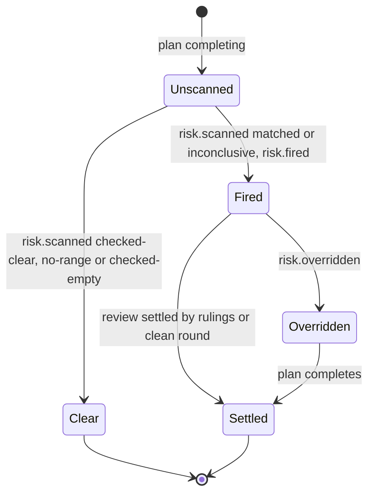
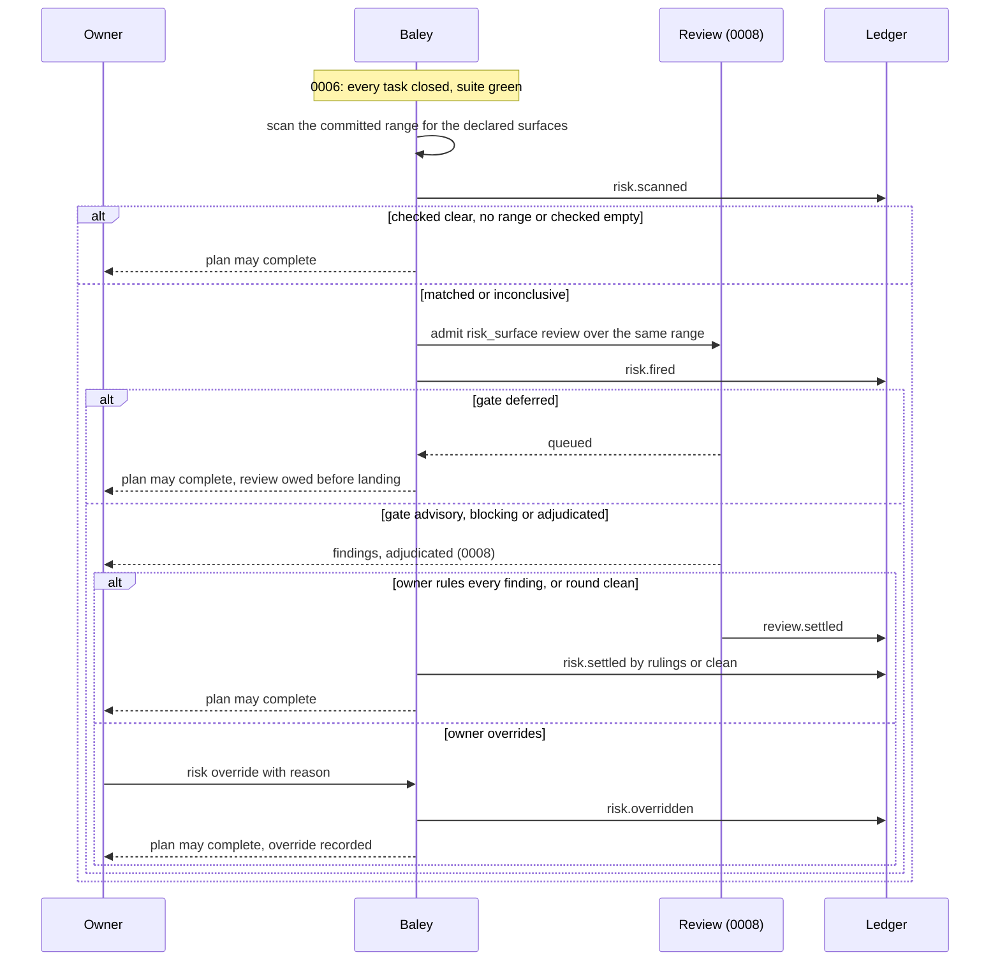
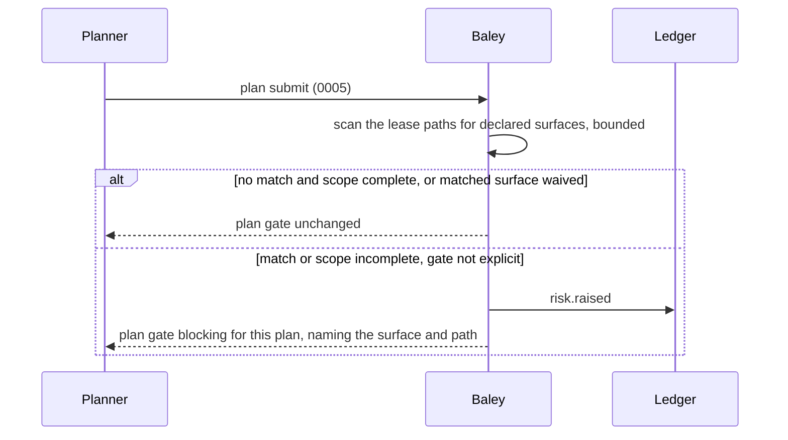

# 0009: Risk

| | |
|---|---|
| Status | Accepted |
| Design issue | none; build issue [#26](https://github.com/crenshawdev/baley/issues/26) |
| Requirement prefix | RSK |
| Applies | [0002: System design](0002-system-design.md) |
| Related | ADRs: [0009](../adr/0009-served-instructions.md) · C4 view: components ([0002](0002-system-design.md) Figure 4) |

The current design of this area, and nothing else. Edit it in place when the design changes; git holds the history. It describes the design only, never the work still to do.

## 1. Purpose and scope

This area decides how Baley notices that a change touches something dangerous and what that costs the work:

- the risk surfaces a project declares, and how Baley suggests them at project start;
- detection: the classifier Baley runs over a completed plan's committed range, and its fire rule;
- the plan-time gate raise: a plan whose lease touches a declared surface gets a stricter plan review;
- what a fired risk does: the `risk_surface` review of [0008](0008-review.md), and what settles it;
- the owner's override and the per-surface waiver of the plan-time raise.

It does not decide how a review runs, is adjudicated or ruled ([0008](0008-review.md)); the lease itself ([0005](0005-context-plans-and-acceptance.md), [0006](0006-execution.md)); what the guard does with a dangerous git command ([0010: Guard](0010-guard.md)); or the risk scan of an off-roadmap task or a debug episode ([0014](0014-support-families.md) [TARGET]), which use this area's classifier.

Hand-offs: 0004's project start calls `detect surfaces`; 0005's plan submit asks this area for the gate raise; 0006's plan completion asks this area whether the plan's risk is settled; 0008 runs the review this area raises.

In the component view of [0002](0002-system-design.md) (Figure 4) this area is one of the domain areas.

## 2. Terms

| Term | Meaning |
|---|---|
| Surface | A category of change that is dangerous when wrong: `auth`, `migrations`, `billing`, `concurrency`, `destructive`, `secrets`, `api_contract`, `untrusted_input`. |
| Declared surfaces | The surfaces the project says it has, in `baley.toml`. Unanswered means all eight. |
| Signal | A path segment, file name, extension, or a pattern in a changed line that points at a surface. |
| Scan | Baley's run of the classifier over a range of changes, giving matched surfaces, or inconclusive. |
| Material | The exact range scanned: base and head commits for a committed range; base and index for a staged tree. |
| Fire | A scan that matched a declared surface, or was inconclusive; it raises the `risk_surface` review. |
| Settlement | The state where every fire of a plan is answered: by the review's rulings, a clean review, or an override. |
| Override | The owner's record that a fire is excused for one plan, with a reason. |
| Gate raise | Setting a plan's review gate to `blocking` at submit because its lease touches a declared surface. |
| Waiver | A declared surface excluded from the gate raise, per project. It never excludes the surface from the scan. |
| Inconclusive | A scan that could not decide: a binary or undecodable diff, or a range past the source bound. |

## 3. Requirements

| Id | Rule | Why | Depends on | Status |
|---|---|---|---|---|
| RSK-R1 | The surfaces are the eight named in section 2, compiled into Baley with their signals. A project declares which apply in `review.triggers.risk_surface.surfaces`; absent or empty means all eight, and Baley says so wherever the surfaces are used. | Danger that is not declared is still scanned for. | CFG-R5 | Active |
| RSK-R2 | `detect surfaces` reads the repository root and its immediate children and the five manifest families (`package.json`, `Cargo.toml`, `pyproject.toml`, `go.mod`, `requirements.txt`), never file bodies beyond them and never through symbolic links, and reports which surfaces the manifests evidence, which stay silent, and a recommendation. It writes nothing; the owner answers and the answer is written to `baley.toml`. | The owner decides the surfaces with evidence in front of them. | PRJ-R8, CFG-R11 | Active |
| RSK-R3 | When a plan is submitted, Baley scans the plan's lease paths for the declared surfaces, by path and by body, once. An unwaived match, or a scope past the source bound, raises that plan's review gate to `blocking` unless the plan gate is set explicitly in the settings; an explicit gate, and a gate already `blocking` or `adjudicated`, are left as they are. The raise never changes a model, a rung, another trigger's gate, or the surfaces scanned at completion. It is not computed again at dispatch. | A plan that will touch danger is reviewed harder before code exists, at one bounded cost. | PLN-R16, CFG-R18 | Active |
| RSK-R4 | When a plan completes, Baley scans its committed range (the dispatch base to the last closing commit, accepted task commits only) with the classifier: path segments, file names, extensions, and patterns over changed lines, for the declared surfaces. A binary, gitlink or undecodable diff, or a range past the source bound, is inconclusive. An empty range is `no-range`; a range whose changed files are all excluded is `checked-empty`. | Risk is judged on what was actually changed. | EXE-R15 | Active |
| RSK-R5 | A scan that matched, or is inconclusive, fires once per plan: it raises the `risk_surface` review of [0008](0008-review.md) over the same material, under `review.triggers.risk_surface.gate`. A checked scan with no match fires nothing. A plan fires at most once for its committed range. | One review per plan, on the exact range. | REV-R1, REV-R2 | Active |
| RSK-R6 | A plan's risk is settled when every fire is answered: the review settled by rulings or by a clean round, or an override recorded. Plan completion waits for settlement; a fire that is pending, interrupted or failed never counts as settled. | Nothing dangerous completes unlooked-at. | EXE-R15, REV-R2 | Active |
| RSK-R7 | The owner may override a fire with a reason. The override names the plan it excuses, is recorded with owner and time, and stops applying when that plan completes; later work needs its own answer. | The owner's authority, on the record, for one plan. | SYS-P5 | Active |
| RSK-R8 | The scan reads authored material only: source and configuration in the range. Baley's own records, review returns and any file Baley itself wrote are excluded. | The gate judges the owner's changes, not Baley's bookkeeping. | | Active |
| RSK-R9 | `review.triggers.risk_surface.waive_routing_floor` names declared surfaces excluded from the gate raise; a waiver never removes a surface from the completion scan, and an inconclusive scope is not waivable. A project value of `[]` clears a global waiver. | The owner can quiet the early warning, never the real check. | RSK-R3 | Active |
| RSK-R10 | Every scan records its material, the surfaces in force, the classifier version, the outcome, and each matched signal with its path and line; every fire records the review it raised; every settlement records what answered it. | The record says why work was held and what released it. | SYS-P6 | Active |
| RSK-R11 | Owner-defined surfaces: a project may add a surface with a name and path patterns in `baley.toml`, detected by path only, treated like a declared surface in the raise, the scan and the review. | A project's own danger can be named. | RSK-R1 | Backlog |

## 4. Roles and actors

| Actor | Receives | Returns | Model and effort from |
|---|---|---|---|
| Owner | Detected surfaces with evidence; fires with their matched signals; the review's findings (0008) | The surfaces answer; rulings; overrides with reasons; waivers in settings | Not applicable |
| Baley: this area | Lease paths at plan submit; the committed range at plan completion | Gate raise; scan outcome; fire; settlement state | Not applicable |
| Hardin | Whether a plan may complete | Settled, or the fire that is open | Not applicable |
| Reviewers ([0008](0008-review.md)) | The `risk_surface` review work order over the fired material | Findings | See 0008 |

No worker is dispatched by this area; detection is Baley's code.

## 5. Commands and operations

### detect surfaces

- **Inputs:** the project.
- **Outputs:** per surface: evidenced (with the manifest and line), silent, or not detectable from manifests; the recommendation; up to four choices built from the evidence and the prior answer.
- **Refusals:** `not-a-project` (PRJ-R18).

### surfaces answer (owner)

- **Inputs:** the surfaces list, or all.
- **Outputs:** written to `baley.toml` as `review.triggers.risk_surface.surfaces` through [0003](0003-configuration-and-routing.md) `config set`; `policy.effective` recorded.
- **Refusals:** `unknown-surface` (RSK-R1).

### risk raise (internal, at plan submit)

- **Inputs:** the plan's lease.
- **Outputs:** the gate for the plan review, with the reason (matched surface and path, scope incomplete, or none); recorded as `risk.raised` when raised.
- **Refusals:** none; a scope past the bound counts as a match (RSK-R3).

### risk scan (internal, at plan completion)

- **Inputs:** the plan, its committed range.
- **Outputs:** `risk.scanned` with the outcome; `risk.fired` with the review id when it fires.
- **Refusals:** `range-moved` (the range differs from the dispatch's accepted commits) (RSK-R4).

### risk status

- **Inputs:** the plan.
- **Outputs:** `missing`, `checked-clear`, `no-range`, `checked-empty`, `fired-pending`, `fired-deferred`, `overridden`, `settled`, with the fire and review ids.

### risk override (owner)

- **Inputs:** the plan, the fire, the reason.
- **Outputs:** `risk.overridden`.
- **Refusals:** `no-such-fire`, `already-settled`, `reason-required` (RSK-R7).

## 6. Records

### risk.raised (event, `phase/<n>` stream)

| Field | Type | Meaning |
|---|---|---|
| `plan_digest` | digest | The submission raised |
| `gate_before`, `gate_after` | gate | What the plan gate was and became |
| `reason` | table | Matched surface, path and signal; or `scope-incomplete` with the bound crossed |

### risk.scanned (event, `phase/<n>` stream)

| Field | Type | Meaning |
|---|---|---|
| `plan` | integer | |
| `material` | base commit, head commit | The range scanned |
| `surfaces` | list | The surfaces in force |
| `classifier_version` | integer | The compiled signal table's version |
| `outcome` | `checked-clear`, `matched`, `inconclusive`, `no-range`, `checked-empty` | |
| `matches` | list | surface, path, line, signal |
| `excluded` | list of paths | Files excluded as Baley's own or as records |

### risk.fired, risk.overridden, risk.settled (events, `phase/<n>` stream)

`risk.fired`: plan, scan, review id (0008). `risk.overridden`: plan, fire, reason, owner, time. `risk.settled`: plan, fire, by (`rulings`, `clean`, `override`).

### Views

| View | Key | Content |
|---|---|---|
| `plan` | project, sprint, plan | Adds the raise, the scan, the fire and settlement state ([0006](0006-execution.md)) |
| `risk` | project | Declared surfaces and their source; open fires per plan; overrides in force |

## 7. States

*Figure 1. Risk states of a plan at completion.*

## 8. Workflows

*Figure 2. Risk at plan completion.*

*Figure 3. The gate raise at plan submit.*

## 9. Settings

| Setting | Type | Default | Scope | Owner | Effect |
|---|---|---|---|---|---|
| `review.triggers.risk_surface.surfaces` | list of the eight surfaces | absent (all eight) | project | 0009 | The surfaces scanned and raised on (RSK-R1) |
| `review.triggers.risk_surface.waive_routing_floor` | list of surfaces | absent | project | 0009 | Surfaces excluded from the gate raise only (RSK-R9) |
| `review.triggers.risk_surface.gate`, `.tier`, `.effort` | see [0008](0008-review.md) | `blocking`, `cheap`, `low` | both | 0008 | The review a fire raises |
| `review.triggers.plan.gate` | see [0008](0008-review.md) | `advisory` | both | 0008 | The gate the raise sets to `blocking` when not explicit (RSK-R3) |

## 10. Instructions served

| Instruction | Served to | Carries requirements |
|---|---|---|
| Surfaces in the work order | The planner and the executor, inside their work orders: the declared surfaces (or "all eight, unanswered"), so the planner declares a lease knowing what raises the gate and the executor knows what a change will trigger; neither decides anything about risk | RSK-R1 |
| Detect stub | The host session during project start: call `detect surfaces`, put the evidence to the owner, submit the answer | RSK-R2 |

## 11. Build status

The code today is the Cadence engine crate awaiting rename; its risk rail is close to this design, with a re-arm and a per-route floor this design removes.

| Requirement | Status | Where |
|---|---|---|
| RSK-R1 | Built | `crates/cadence/src/rail/risk.rs:6-15, 57-85` |
| RSK-R2 | Built | `crates/cadence/src/rail/surfaces.rs:8-29, 338-490` |
| RSK-R3 | Not built as designed | Floor runs inside every route (`crates/cadence/src/config/floor.rs:47-65, 325-507`) and recommends deep verify (`floor.rs:518-555`) |
| RSK-R4 | Built | `crates/cadence/src/rail_service.rs:83-157`, `crates/cadence/src/rail/risk_diff.rs:24-423` |
| RSK-R5 | Partly built | Fire rule (`crates/cadence/src/rail/receipts.rs:197-206`); risk_surface is never admitted for phase execution (`crates/cadence/src/execution_service.rs:1887-1921`) |
| RSK-R6 | Partly built | Settlement algebra in rail receipts (`crates/cadence/src/rail/receipts.rs:218-335`); consequence ids are not linked to a review (`receipts.rs:142-144`) |
| RSK-R7 | Built | `Override{reason}` (`crates/cadence/src/rail/receipts.rs:102-119`) |
| RSK-R8 | Built | Exclusions in `crates/cadence/src/rail/git.rs:132-150, 232-262` |
| RSK-R9 | Built | `crates/cadence/src/config/policy.rs:65`, `crates/cadence/src/config/floor.rs:529-545` |
| RSK-R10 | Partly built | Rail observations recorded (`crates/cadence/src/rail_service.rs:164-185`); no classifier version |
| Re-arm (removed) | Built today | `crates/cadence/src/rail/receipts.rs:174-195`, to be removed |

## 12. Open questions

| Question | Decided by |
|---|---|
| None | |
