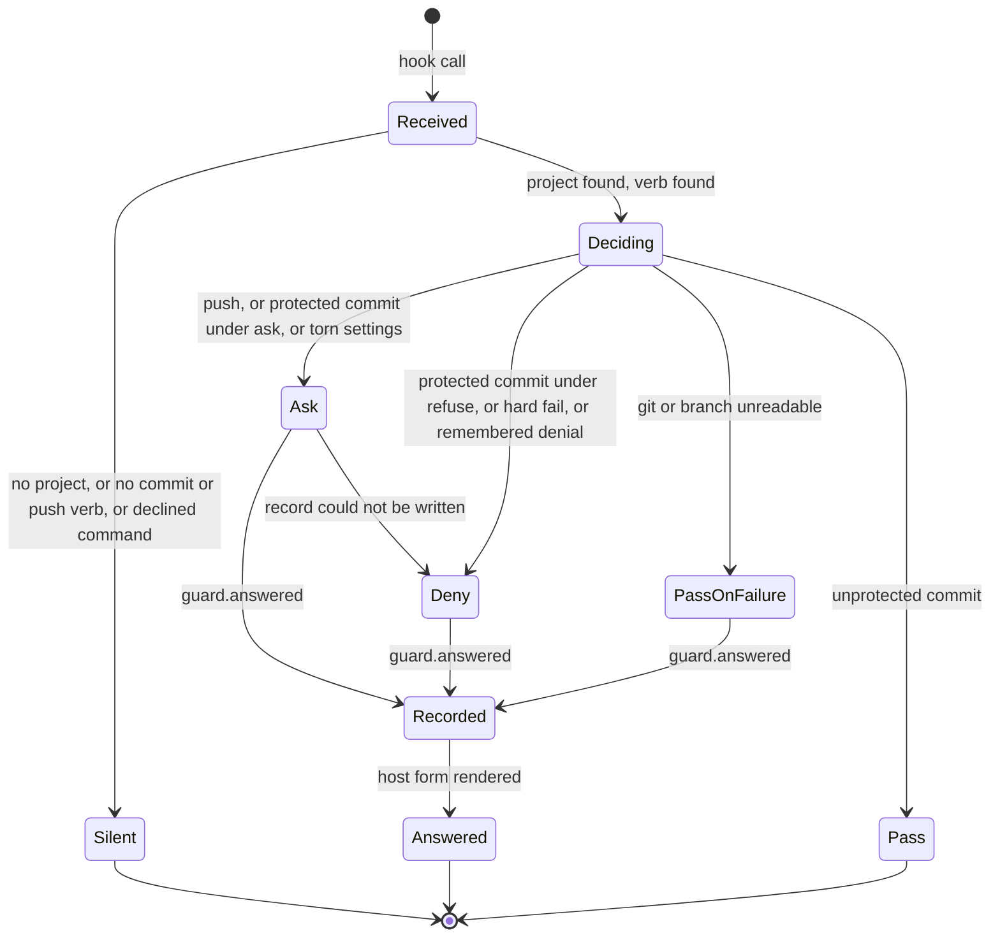
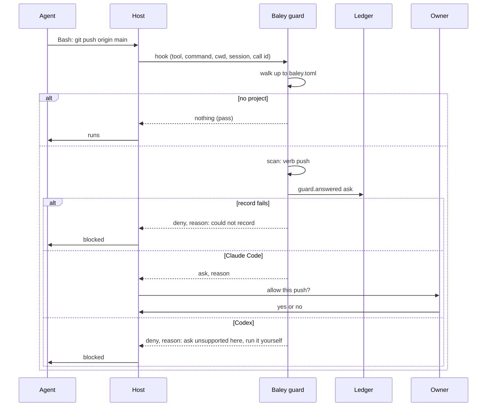
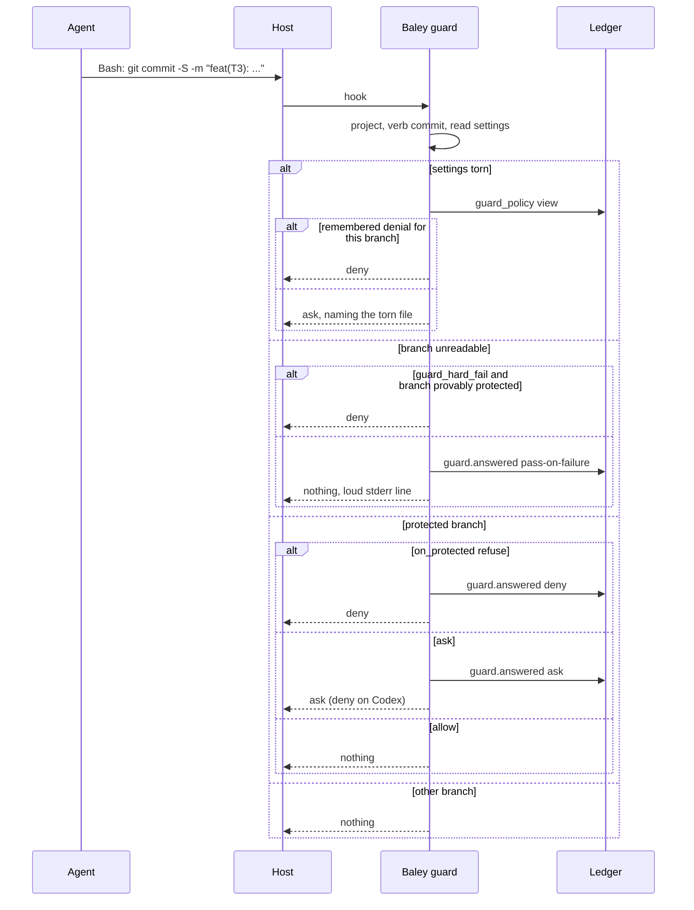

# 0010: Guard

| | |
|---|---|
| Status | Accepted |
| Design issue | none; build issue [#24](https://github.com/crenshawdev/baley/issues/24) |
| Requirement prefix | GRD |
| Applies | [0002: System design](0002-system-design.md) |
| Related | ADRs: [0008](../adr/0008-host-sandbox-isolation.md), [0009](../adr/0009-served-instructions.md) · C4 view: components ([0002](0002-system-design.md) Figure 4) |

The current design of this area, and nothing else. Edit it in place when the design changes; git holds the history. It describes the design only, never the work still to do.

## 1. Purpose and scope

This area decides what Baley does at the host's edge, before a tool call an agent makes runs:

- the one hook Baley installs, what it sees on each host, and how it finds the project;
- the Bash guard: which git commands it acts on, what it asks, what it refuses, and what it does when it cannot decide;
- the Write/Edit guard: which paths an agent may not write;
- how each answer is recorded, remembered and replayed;
- the answer adapter per host, and the host sandbox that keeps agents out of Baley's home.

It does not decide the lease itself or what an out-of-lease commit does at task close ([0006](0006-execution.md)); which branch work happens on or how landing pushes ([0011](0011-milestones-landing-undo-pause.md)); risk detection ([0009](0009-risk.md)); or how stubs are rendered and installed ([0012](0012-host-interface.md) [TARGET]).

Hand-offs: 0003 gives the guard project discovery and the settings it reads; 0006 gives it the active lease; 0012 installs the hook and the sandbox configuration; the ledger (0001) stores every guard outcome.

In the component view of [0002](0002-system-design.md) (Figure 4) the guard is the third way into the host interface, beside the MCP server and the command line.

## 2. Terms

| Term | Meaning |
|---|---|
| Hook | The host's pre-tool-use call into Baley: on Claude Code for `Bash`, `Write` and `Edit`; on Codex for `Bash`. The host passes the tool, its input, the working directory, the session and a call id. |
| Guard | Baley's answer to a hook call: `pass`, `ask`, `deny`, or `pass on failure`. |
| Verb | The git subcommand a Bash command carries: `commit` or `push`. |
| Protected branch | A branch named in `git.protected_branches`. |
| Torn settings | A settings file that cannot be read or parsed at the moment of the call. |
| Guard failure | A call the guard could not decide because git or the branch could not be read. |
| Hard fail | The opt-in rule (`git.guard_hard_fail`) that turns a guard failure on a provably protected branch into a deny. |
| Remembered policy | The last complete, successfully read policy for the project, kept so that a denial can still be given when the settings are torn. It never supplies an allow. |
| Redelivery | The host calling the hook again with the same call id after a timeout. |
| Answer adapter | The per-host translation of a guard answer into what that host accepts. |
| Sandbox | The host's own restriction on what an agent process may read and write ([ADR 0008](../adr/0008-host-sandbox-isolation.md)). |

## 3. Requirements

| Id | Rule | Why | Depends on | Status |
|---|---|---|---|---|
| GRD-R1 | Baley installs one hook per host: a pre-tool-use call for `Bash`, `Write` and `Edit` on Claude Code, and for `Bash` on Codex, with a bounded timeout. There is no other hook. | One edge, the same on both hosts as far as each allows. | SYS-P11, SYS-P12 | Active |
| GRD-R2 | The guard finds the project by walking up from the call's working directory to the nearest `baley.toml`, stopping at the git repository root (CFG-R4). Outside a project the guard is silent for Bash; the Write/Edit rules that need no project (the global settings file) still apply. | The guard acts only where Baley is responsible. | CFG-R4 | Active |
| GRD-R3 | The Bash guard acts on a command only when it carries a git `commit` or `push` verb. It splits the command on `;`, `|`, `&`, `&&`, `||` and newlines, takes segments whose first word is `git` or ends in `/git`, skips git's global flags and their operands, and declines to judge a command containing substitutions, backticks, redirects, subshells, braces, a leading comment, a NUL or an unclosed quote. A declined command passes with nothing recorded. No other git verb is covered; this is a stated limit of the design. | Commit and push are where work reaches the record and the forge; everything else was tried and did not pay. | | Active |
| GRD-R4 | A `push` always asks, on any branch, with a fixed reason. | Publishing is the owner's step. | SYS-P5 | Active |
| GRD-R5 | A `commit` on a protected branch follows `git.on_protected`: `ask`, `refuse` (deny) or `allow`; an unknown value asks. On any other branch a commit passes. | The owner sets the branch discipline once. | CFG-R5 | Active |
| GRD-R6 | When git or the current branch cannot be read, the guard passes, prints a loud line on stderr, and records a guard failure. When `git.guard_hard_fail` is set and the branch is provably protected from what could be read, it denies instead. | A guard that cannot decide must not silently become a wall or a hole. | | Active |
| GRD-R7 | When a settings file is torn, the guard asks, naming the file; a denial from the remembered policy still stands. The remembered policy keeps only denials, never an allow. | Torn settings must not open the door. | CFG-R9 | Active |
| GRD-R8 | Every `ask`, `deny` and guard failure is recorded before it is answered: the command digest (never the command), the working directory, the project, the verb, the branch, the policy in force, the outcome and the reason. A plain pass records nothing. | The record shows what the guard held and why. | SYS-P6 | Active |
| GRD-R9 | When the record cannot be written, an `ask` becomes `deny` with the reason that the guard could not record its decision, on stderr and in the answer; a `deny` stays a deny; a pass stays a pass. | An unrecorded ask is the gap the record exists to close. | GRD-R8 | Active |
| GRD-R10 | A redelivered call with the same call id gets its confirmed answer again, from the record, even after the policy changed. | The host may deliver a call twice; the answer must not differ. | EVD-R26 | Active |
| GRD-R11 | The Write/Edit guard denies a write to the global settings file, the project file `baley.toml`, any file Baley rendered as a stub, and, during an active dispatch, any path outside the dispatch's lease (EXE-R8). Path resolution canonicalizes the existing prefix and refuses control bytes, doubled separators and non-directory parents; a path it cannot resolve is denied. | The owner sets policy, Baley renders stubs, and the lease means something as the write happens. | CFG-R11, ADR 0009, EXE-R8 | Active |
| GRD-R12 | The answer adapter renders each answer in the host's form. Claude Code takes `allow`, `deny` and `ask`. Codex takes `deny` and an exit code; it rejects `ask`, so on Codex every `ask` is answered `deny` with the reason and the instruction to run the command outside the agent. | The host that offers less sets the floor. | SYS-P12 | Active |
| GRD-R13 | The host sandbox, configured at install, keeps agent processes from reading or writing Baley's home; the guard is a second layer, not the first. `baley doctor` checks the sandbox configuration on each host and reports what an agent can reach. | The record is protected by the host, and tampering is detected by the chain and its anchors. | ADR 0008 | Active |
| GRD-R14 | The guard reads the hook's input up to a fixed bound, answers within the hook's timeout, and never launches a program except git for the branch; when git is unavailable it reads the branch from `.git/HEAD` directly, bounded and without following symbolic links. | The guard must answer fast and must not become a way to run things. | | Active |

## 4. Roles and actors

| Actor | Receives | Returns | Model and effort from |
|---|---|---|---|
| Host | The guard's answer in its own form | Runs, asks the owner, or blocks the tool call | Not applicable |
| Owner | An `ask` put by the host | Yes or no, in the host | Not applicable |
| Agent (any worker or the session) | A denied or held tool call with its reason | Nothing; it does not argue with the guard | Not applicable |
| Baley guard | The hook input | pass, ask, deny, pass on failure | Not applicable |
| Ledger | Guard records | | Not applicable |

No model is dispatched by this area.

## 5. Commands and operations

### baley guard (hook entry)

- **Inputs:** the hook's JSON on standard input: tool name, tool input (command, or file path and content), working directory, session id, call id.
- **Outputs:** nothing for pass and pass on failure; for ask and deny, the host's permission form with the reason (Claude Code), or a deny with exit code 2 (Codex).
- **Refusals (as answers):**

  | Answer | When | Requirement |
  |---|---|---|
  | `ask` | push; protected commit under `ask`; torn settings | GRD-R4, GRD-R5, GRD-R7 |
  | `deny` | protected commit under `refuse`; hard fail; remembered denial under torn settings; a Write/Edit to a protected path or outside the lease; an unrecordable ask; any ask on Codex | GRD-R5, GRD-R6, GRD-R7, GRD-R9, GRD-R11, GRD-R12 |
  | `pass on failure` | git or branch unreadable without hard fail | GRD-R6 |
  | `pass` | everything else, including a declined command and any call outside a project | GRD-R2, GRD-R3 |

### baley doctor (the guard's part)

- **Inputs:** the host name.
- **Outputs:** whether the hook is installed and points at this binary; whether the sandbox keeps an agent from reading and writing Baley's home; the answer forms the host honours.
- **Refusals:** none; findings are reported (GRD-R13).

## 6. Records

### guard.answered (event, `project` stream; `guard` stream for calls outside a project that still denied)

| Field | Type | Meaning |
|---|---|---|
| `call` | session id, call id | The hook call, for redelivery |
| `tool` | `bash`, `write`, `edit` | |
| `command_digest` or `path` | digest, path | Never the command text |
| `cwd` | path | |
| `verb` | `commit`, `push`, absent | |
| `branch` | name or unknown | |
| `policy` | table | `on_protected`, `protected_branches`, `guard_hard_fail` as read, and which file each came from, or `torn` |
| `outcome` | `ask`, `deny`, `pass-on-failure` | |
| `reason` | text | |
| `unavailable` | list | Inputs that could not be read |

### guard.policy_recorded (event, `project` stream)

The last complete policy read, kept for GRD-R7. The `guard_policy` view holds the latest per project.

### Views

| View | Key | Content |
|---|---|---|
| `guard` | project, call | The confirmed answer for redelivery |
| `guard_policy` | project | The remembered policy, denials only |

## 7. States

*Figure 1. States of one Bash guard call.*

## 8. Workflows

*Figure 2. A push through the guard on each host.*

*Figure 3. A commit through the guard.*

## 9. Settings

| Setting | Type | Default | Scope | Owner | Effect |
|---|---|---|---|---|---|
| `git.protected_branches` | list of branch names | `["main", "master"]` | project | 0010 | Branches a commit is asked about or refused on (GRD-R5) |
| `git.on_protected` | `ask`, `refuse`, `allow` | `ask` | project | 0010 | What a commit on a protected branch gets (GRD-R5) |
| `git.guard_hard_fail` | bool | `false` | project | 0010 | Deny instead of pass when inputs are unreadable on a provably protected branch (GRD-R6) |

## 10. Instructions served

Not applicable. The guard gives no instructions; an agent sees only the host's own message for a held or blocked call, carrying the guard's reason.

## 11. Build status

The code today is the Cadence engine crate awaiting rename; its guard is close to this design.

| Requirement | Status | Where |
|---|---|---|
| GRD-R1 | Partly built | One hook for Claude Code (`hooks/hooks.json`); no Codex hook installation |
| GRD-R2 | Partly built | Bash walks up to `.planning` (`crates/cadence/src/guard/bash.rs:27-44`); Write/Edit has no discovery (`crates/cadence/src/guard/mod.rs:116-126`) |
| GRD-R3 | Built | `crates/cadence/src/guard/bash.rs:47-151, 450-464` |
| GRD-R4 | Built | `crates/cadence/src/guard/bash.rs:475-480` |
| GRD-R5 | Built | `crates/cadence/src/guard/bash.rs:160-252, 363-429` |
| GRD-R6 | Built | `crates/cadence/src/guard/bash.rs:363-429` |
| GRD-R7 | Built | `crates/cadence/src/guard/audit.rs:150-195` |
| GRD-R8 | Built | `crates/cadence/src/guard/audit.rs:9-127` |
| GRD-R9 | Not built | An unrecordable ask becomes allow (`crates/cadence/src/guard/bash.rs:438-448`) |
| GRD-R10 | Built | `crates/cadence/src/guard/bash.rs:485-495` |
| GRD-R11 | Partly built | Settings files and rendered stubs denied (`crates/cadence/src/guard/mod.rs:323-357`); `.planning` paths still listed (`mod.rs:358-385`); no lease check |
| GRD-R12 | Not built | Claude Code form only (`crates/cadence/src/guard/mod.rs:223-244`) |
| GRD-R13 | Not built | No doctor; the sandbox probe is a spike (`spikes/host-matrix`) |
| GRD-R14 | Built | `crates/cadence/src/guard/mod.rs:14, 105-130`, `crates/cadence/src/guard/bash.rs:254-361` |

## 12. Open questions

| Question | Decided by |
|---|---|
| Whether Codex runs a hook before `apply_patch`, which would give the Write/Edit rules a Codex path | [0012: Host interface](0012-host-interface.md) [TARGET], by a probe on Codex |
