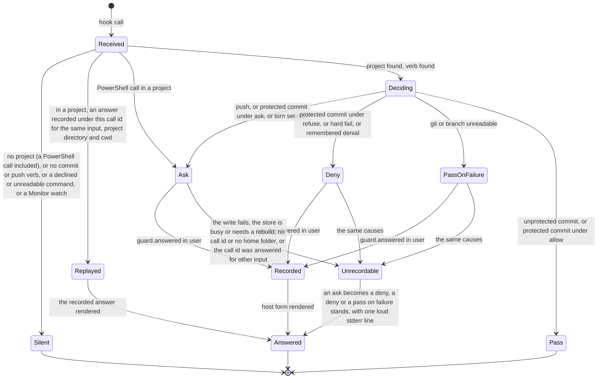
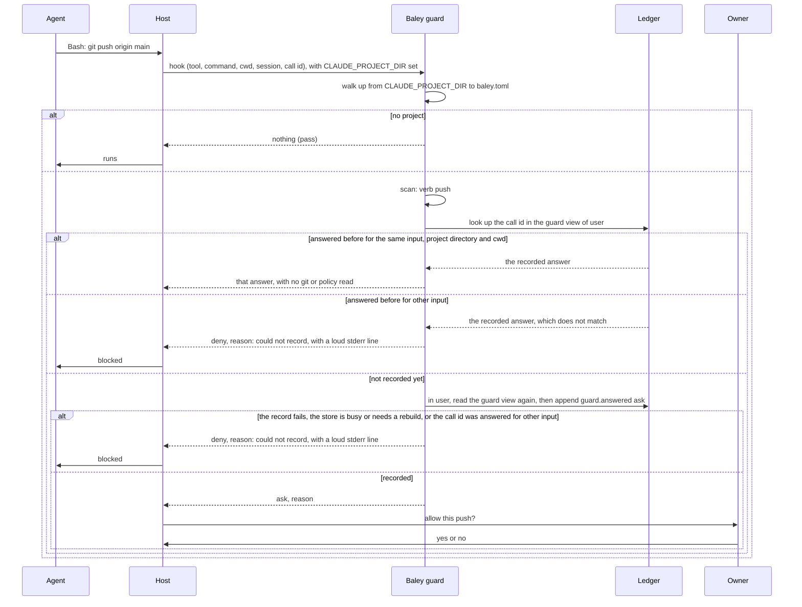
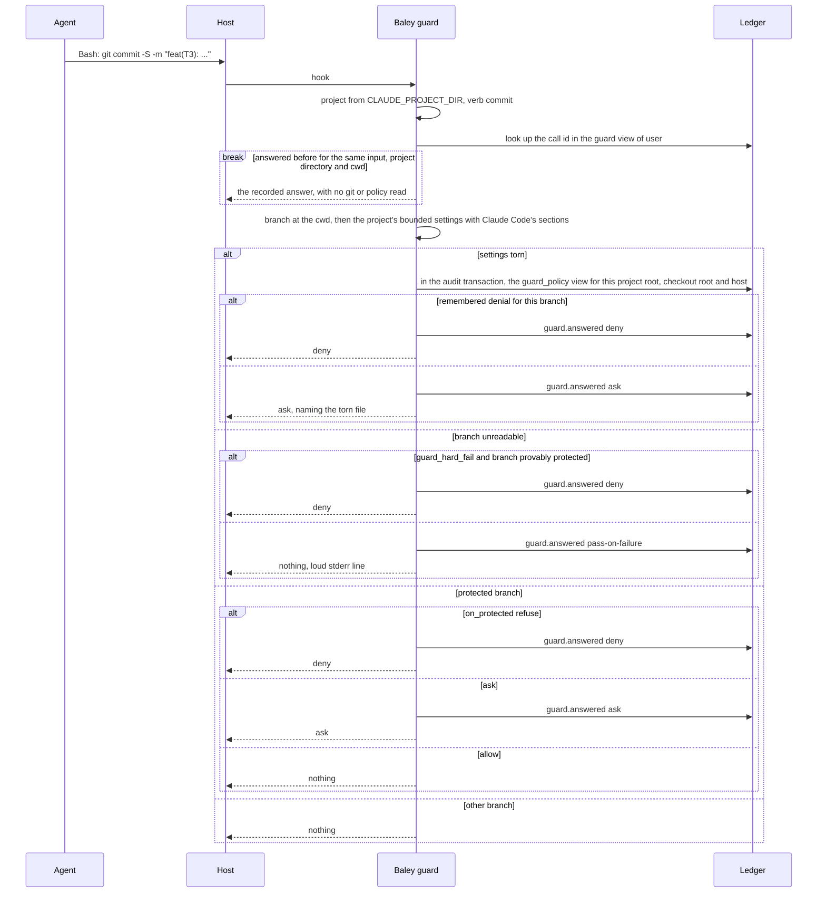

# 0010: Guard

| | |
|---|---|
| Status | Accepted |
| Design issue | none; build issue [#24](https://github.com/crenshawdev/baley/issues/24) |
| Requirement prefix | GRD |
| Applies | [0002: System design](0002-system-design.md) |
| Related | ADRs: [0008](../adr/0008-host-sandbox-isolation.md), [0009](../adr/0009-served-instructions.md), [0027](../adr/0027-vendor-folders-and-plain-keys.md), [0033](../adr/0033-host-security-bar.md) · C4 view: components ([0002](0002-system-design.md) Figure 4) |

The current design of this area, and nothing else. Edit it in place when the design changes; git holds the history. It describes the design only, never the work still to do.

## 1. Purpose and scope

This area decides what Baley does at the host's edge, before a tool call an agent makes runs:

- the one hook Baley installs, what it sees on Claude Code, and how it finds the project;
- the command guard, for `Bash`, `Monitor` and `PowerShell` commands: which git commands it acts on, what it asks, what it refuses, and what it does when it cannot decide;
- the file guard, for `Write`, `Edit` and `NotebookEdit`: which paths an agent may not write;
- how each answer is recorded, remembered and replayed;
- the answer adapter that renders an answer in the host's hook form, and the protection that keeps agents from reading or writing Baley's home and its config folder.

It does not decide the lease itself or what an out-of-lease commit does at task close ([0006](0006-execution.md)); which branch work happens on or how landing pushes ([0011](0011-milestones-landing-undo-pause.md)); risk detection ([0009](0009-risk.md)); or how stubs are rendered and installed ([0012](0012-host-interface.md)).

Hand-offs: 0003 gives the guard project discovery and the settings it reads; 0006 gives it the active lease; 0012 installs the hook and the sandbox configuration; the ledger (0001) stores every guard record, in the per-user project `user`.

In the component view of [0002](0002-system-design.md) (Figure 4) the guard is the third way into the host interface, beside the MCP server and the command line.

## 2. Terms

| Term | Meaning |
|---|---|
| Hook | Claude Code's pre-tool-use call into Baley, for `Bash`, `Monitor`, `PowerShell`, `Read`, `Grep`, `Glob`, `Write`, `Edit` and `NotebookEdit`. The host passes the tool, its input, the working directory, the session and a call id, and sets `CLAUDE_PROJECT_DIR` in the hook's environment. |
| Guard | Baley's answer to a hook call: `pass`, `ask`, `deny`, or `pass on failure`. |
| Verb | The git subcommand a `Bash` or `Monitor` command carries: `commit` or `push`. A `PowerShell` command is not scanned. |
| Protected branch | A branch named in `git.protected_branches`. |
| Torn settings | A settings file that cannot be read or parsed at the moment of the call, or that holds a value outside its type or grammar (CFG-R9), such as a bare-string branch list or an unknown `git.on_protected`. |
| Guard failure | A call the guard could not decide because git or the branch could not be read. |
| Hard fail | The opt-in rule (`git.guard_hard_fail`) that turns a guard failure on a provably protected branch into a deny. |
| Remembered policy | The denials of the last complete policy the guard read, kept per session project root, target checkout root and host so that a denial can still be given when the settings are torn: whether `git.on_protected` was `refuse`, whether hard fail was on, and the protected list when either was. It never supplies an allow. |
| Redelivery | The host calling the hook again with the same call id after a timeout. |
| Answer adapter | The renderer that turns a guard answer into Claude Code's pre-tool hook output: an `ask` or `deny` decision with its reason on stdout, nothing for a pass, and one stderr line for a pass on failure. It never answers `allow`. |
| Unrecordable | A decision the guard cannot record before it answers (GRD-R9). Nothing is appended for it. |
| Sandbox | The host's own restriction on what an agent process may read and write ([ADR 0008](../adr/0008-host-sandbox-isolation.md)). |

## 3. Requirements

| Id | Rule | Why | Depends on | Status |
|---|---|---|---|---|
| GRD-R1 | Baley installs one hook: Claude Code's pre-tool-use call for `Bash`, `Monitor`, `PowerShell`, `Read`, `Grep`, `Glob`, `Write`, `Edit` and `NotebookEdit`, with a bounded timeout. There is no other hook. | One edge for every tool that runs a shell command or reads or writes a file. | SYS-P11, SYS-P12 | Active |
| GRD-R2 | The guard takes the project from the hook's `CLAUDE_PROJECT_DIR`, walking up from it to the nearest `baley.toml` and stopping at the git repository root (CFG-R4). A `CLAUDE_PROJECT_DIR` that is missing, empty, not UTF-8, relative, over 4,096 bytes or not a directory, or one in no project, means no project: the working directory never stands in for it, and no project is invented for the record. The hook's working directory resolves the paths a tool call names and names the checkout whose branch is read, so a `/cd` never changes the project. Outside a project the guard is silent for `Bash`, `Monitor` and `PowerShell` calls and records nothing. The path rules need no project and apply either way: the `Write`, `Edit` and `NotebookEdit` refusal (GRD-R11) and the refusal of a `Read`, `Grep` or `Glob` call that reaches Baley's home or its config folder (GRD-R13). | The guard acts only where Baley is responsible. | CFG-R4 | Active |
| GRD-R3 | The command guard reads the command of a `Bash` call and of a `Monitor` command watch with one scan, and acts on a command only when it carries a git `commit` or `push` verb. It splits the command on `;`, `|`, `&`, `&&`, `||` and newlines, takes segments whose first word is `git` or ends in `/git`, skips git's global flags and their operands, and declines to judge a command containing substitutions, backticks, redirects, subshells, braces, a leading comment, a NUL, an unclosed quote or a trailing backslash. A command that carries both verbs is judged as a push. A declined command passes with nothing recorded, and so does a `Monitor` watch with no command, which is not scanned. In a bound project a `PowerShell` call asks, whether or not it mentions git, and the reason names the grammar the scan cannot judge. A `PowerShell` call is never scanned. No other git verb is covered; this is a stated limit of the design. | Commit and push are where work reaches the record and the forge; everything else was tried and did not pay. Baley reads POSIX shell, so it asks about PowerShell instead of guessing. | | Active |
| GRD-R4 | A `push` always asks, on any branch, with a fixed reason. | Publishing is the owner's step. | SYS-P5 | Active |
| GRD-R5 | A `commit` on a protected branch follows `git.on_protected`: `ask`, `refuse` (deny) or `allow`, acting on the branch git read. An unknown value is outside the setting's grammar, so the file is torn (CFG-R9) and the commit asks, naming the file, unless a remembered denial applies (GRD-R7). On any other branch a commit passes. | The owner sets the branch discipline once. | CFG-R5, CFG-R9 | Active |
| GRD-R6 | When git or the current branch cannot be read, the guard passes, prints a loud line on stderr, and records a guard failure. When `git.guard_hard_fail` is set and the branch is provably protected from what could be read, it denies instead. | A guard that cannot decide must not silently become a wall or a hole. | | Active |
| GRD-R7 | When a settings file is torn, the guard asks, naming the file. Two denials from the remembered policy still stand: a remembered `refuse` on a branch git read that is in the remembered protected list, and a remembered hard fail on a provably protected branch when git cannot read the branch. A remembered `allow` or `ask` never relaxes the ask. The remembered policy keeps only denials, never an allow. | Torn settings must not open the door. | CFG-R9 | Active |
| GRD-R8 | Every `ask`, `deny` and guard failure is recorded before it is answered, for every tool: a path tool's denial and a `PowerShell` ask are recorded as a commit's answer is. The record holds the host, the session and the call id; `CLAUDE_PROJECT_DIR` as given and the working directory, as separate facts; the tool and the digest of the input fields the guard read, never the command; a path tool's resolved target as text; the verb, the branch, the settings in force, the outcome and the reason. When HEAD's copy of `baley.toml` is torn, the record keeps Baley's words for it with git's stderr excerpt replaced by `[redacted]`, while the live answer keeps the bounded excerpt. Records go to the per-user project `user` at policy version 0, so recording needs no project in this machine's ledger and admits no checkout. A plain pass, a command the scan declines and a `Monitor` watch record nothing, and input the guard cannot read is denied with nothing recorded, since it carries no call to record it by. | The record shows what the guard held and why, and keeps no command text and no output of git beyond Baley's own words. | SYS-P6 | Active |
| GRD-R9 | When the decision cannot be recorded, an `ask` becomes `deny` with the reason that the guard could not record its decision, and a loud stderr line names the cause. A decision is unrecordable when the write fails, a guard store that stays busy past its storage time included; when `user`'s views need a rebuild, and then the line names `baley rebuild user`; when the call carries no call id, or a working directory, `CLAUDE_PROJECT_DIR` or session that cannot be recorded as given; when its call id was already recorded for another input digest, project directory or working directory; or when Baley's home folder cannot be resolved. Nothing is appended for an unrecordable decision, so one call id never has two records. A `deny` stays a deny, a pass on failure stays a loud pass and a plain pass stays a pass. A decision that was recorded is not changed, so a recorded ask about torn settings stays an ask. | An unrecorded ask is the gap the record exists to close. | GRD-R8 | Active |
| GRD-R10 | A call whose host, session and call id match a recorded answer, with the same input digest, project directory and working directory, gets that answer again from the record, even after the policy changed. A command with a commit or push verb, or a `PowerShell` call, in a project is looked up before any git or policy read, and the transaction that would record a call looks it up again before it appends, so two deliveries racing each other get one record and one answer. | The host may deliver a call twice; the answer must not differ. | EVD-R26 | Active |
| GRD-R11 | The file guard denies a `Write`, `Edit` or `NotebookEdit` call whose target is inside or is one of these protected paths: Baley's home folder; Baley's config folder (the global settings file `config.toml` and the keys file `keys.env`, [0003](0003-configuration-and-routing.md) CFG-R2, CFG-R24); the `baley.toml` of the session's project and the `baley.toml` of the checkout the hook's working directory is in, by path or by file identity, but no other file of that name; and the stub paths Baley supplies. It judges them from any working directory, with or without a project. Path resolution canonicalizes the existing prefix, reads both the spelling given and the spelling with each backslash taken as a slash, and refuses an empty value, control bytes, a leading `//` or drive-letter prefix, and a non-directory parent. It judges containment by component and by the (device, inode) identity of existing ancestors, so a sibling such as `baley-old` is not inside `baley` and a differently cased spelling on a case-insensitive volume is still caught. A path it cannot resolve is denied. During an active dispatch, a path outside the dispatch's lease is denied (EXE-R8). Build 5 owns the lease: the decision takes it as an input whose only value today is no active dispatch, and Build 5 defines what a lease names and the deny for a write outside it. | The owner sets policy and holds the keys, Baley renders stubs, and the lease means something as the write happens. | CFG-R11, CFG-R24, ADR 0009, EXE-R8 | Active |
| GRD-R12 | The answer adapter renders each answer in Claude Code's pre-tool hook form. An `ask` or `deny` is a `hookSpecificOutput` object with `hookEventName` `PreToolUse`, `permissionDecision` `ask` or `deny`, and the reason as `permissionDecisionReason`, cut to 10,000 bytes on a character boundary, on stdout with exit 0. A plain pass prints nothing and exits 0, so the host's own permission rules decide. It is never `allow`, which would skip them. A pass on failure prints its reason as one stderr line and exits 0. When an `ask` or `deny` cannot be written to stdout, the guard exits 2 with the reason on stderr, which blocks the call. | One guard decision, rendered in the host's form, and a pass never widens what the host allows. | SYS-P8 | Active |
| GRD-R13 | Agents can neither read nor write Baley's home or its config folder. Three mechanisms carry it, configured at install: Claude Code's sandbox, for shell commands and their children (`Bash`, `Monitor`, `PowerShell`); its `Read` and `Edit` deny rules, for the built-in file tools; and the guard's refusal of a `Read`, `Grep` or `Glob` call that reaches either folder, because Claude Code applies `Read` rules to `Grep` and `Glob` only on a best-effort basis. The guard takes the call's target from `Read`'s `file_path` or from `Grep`'s or `Glob`'s `path`, which is the hook's working directory when absent. It also takes the folders a `Grep` `glob` or a `Glob` `pattern` names before its first wildcard, joined to that target. It refuses when a target lies inside either folder or holds one, compared by component and by file identity, so a sibling such as `baley-old` is not matched. It refuses a pattern with a `..` component after a wildcard, and a path it cannot resolve. An unavailable sandbox is reported, never passed over. A `keys.env` that is a symbolic link is covered only where its target lies inside those folders. `baley doctor` checks the configuration and reports what an agent can reach, reads included. | The record and the keys are protected by the host and the guard together, and tampering is detected by the chain and its anchors. | ADR 0008, ADR 0033 | Active |
| GRD-R14 | The guard reads at most 64 KiB of the hook's input and answers within the hook's 10-second timeout, on one budget that starts when the guard starts: 8 seconds of work; git at most 5 seconds in total, across the branch lookup and the up to three launches that read HEAD's copy of `baley.toml`; storage waits at most 2 seconds; and at least 1 second kept after the work for ending and reaping a child and writing the answer. Every limit shrinks with the work already done, and none is reset for a later step. The guard launches no program except git, for the branch and for HEAD's copy of the settings. When git gives no branch, because it cannot run, fails or has no time left, the guard reads the branch from `.git/HEAD` directly, bounded and without following symbolic links. It collects no remote and no root commit. Input it cannot read, or that is over the bound, is denied for `Read`, `Grep`, `Glob`, `Write`, `Edit` and `NotebookEdit`, and passes for the command tools. Standard input that fails to read at all is denied, since the tool is then unknown. | The guard must answer fast and must not become a way to run things. | | Active |

## 4. Roles and actors

| Actor | Receives | Returns | Model and effort from |
|---|---|---|---|
| Host | The guard's answer in its own form | Runs, asks the owner, or blocks the tool call | Not applicable |
| Owner | An `ask` put by the host | Yes or no, in the host | Not applicable |
| Agent (any worker or the session) | A denied or held tool call with its reason | Nothing; it does not argue with the guard | Not applicable |
| Baley guard | The hook input | pass, ask, deny, pass on failure | Not applicable |
| Ledger | Guard records, in the per-user project `user` | The answer recorded under a call id, and the denials remembered for torn settings | Not applicable |

No model is dispatched by this area.

## 5. Commands and operations

### baley guard (hook entry)

- **Inputs:** the hook's JSON on standard input, read up to 64 KiB. The guard reads these fields:
  - `tool_name`, the tool, and `tool_input`, its input;
  - `cwd`, the working directory;
  - `session_id`;
  - `tool_use_id`, the call id, which is never invented: a call with none cannot be recorded (GRD-R9);
  - `hook_event_name`, which must be `PreToolUse` when present.

  Each tool's `tool_input` is read as follows:

  | Tool | Fields read |
  |---|---|
  | `Bash` | `command` |
  | `Monitor`, command form | `command` |
  | `Monitor`, watch form | none: a watch has no `command` and is not scanned |
  | `PowerShell` | none: the call is judged by its tool name |
  | `Read` | `file_path` |
  | `Grep` | `path` and `glob`, both optional: an absent `path` means the hook's working directory. Grep's search `pattern` is not read |
  | `Glob` | `pattern`, required, and `path`: an absent `path` means the hook's working directory |
  | `Write`, `Edit` | `file_path` |
  | `NotebookEdit` | `notebook_path` |

  From its environment it reads `CLAUDE_PROJECT_DIR`, kept as given for the record.
- **Project and target:** the policy comes from the session project at `CLAUDE_PROJECT_DIR`, found by the walk of GRD-R2. The hook's working directory gives the branch, read from the checkout it is in, and the base that tool targets resolve against. A second walk, from the working directory, finds that checkout's `baley.toml`, which the file guard protects beside the session project's.
- **Policy reads:** only a commit in a project reads a policy, after its branch. The guard reads the global `config.toml` and the working tree's `baley.toml`, each to at most 1 MiB, and HEAD's copy of `baley.toml` at the session project's root through the bounded git reader, and merges them with Claude Code's `[host.claude-code]` sections. A file over the cap, a working-tree file it cannot read, and a config folder it cannot find each make the settings torn. It admits no checkout, runs no policy step and records no `policy.effective`.
- **Recording:** a guard record is one `guard.record` command in the per-user project `user`, on stream `guard`, at policy version 0, by `baley`, with the hook form of the caller.
  - A command with a `commit` or `push` verb, or a `PowerShell` call, in a project first looks up the answer recorded under its call id, on a short store open of its own before any git or policy read. A replay is answered from the record, with no git or policy read and nothing appended. With no `user` there is no record, and the lookup creates none.
  - An answer to record takes a second short open for the audit transaction, which creates `user` when it is missing.
  - Inside the transaction the call's `guard` document is read again before anything is appended, so a replay or a clash appends nothing.
  - Under torn settings the remembered denials are read there, and only there, and the commit is judged again with them. Under a complete policy, `guard.policy_recorded` is appended beside `guard.answered` when the denials changed.
  - A new answer counts as recorded only once the transaction commits.
- **Outputs:** per the renderer (GRD-R12). An ask or deny is a `hookSpecificOutput` decision on stdout with exit 0. A plain pass prints nothing and exits 0. A pass on failure prints its reason on stderr and exits 0. When an ask or deny cannot be written to stdout, the guard exits 2 with the reason on stderr, which blocks the call. Each unrecordable decision adds one loud stderr line naming its cause.
- **Refusals (as answers):**

  | Answer | When | Requirement |
  |---|---|---|
  | `ask` | push; protected commit under `ask`; torn settings; a `PowerShell` call in a project | GRD-R3, GRD-R4, GRD-R5, GRD-R7 |
  | `deny` | protected commit under `refuse`; hard fail; remembered denial under torn settings; a Write, Edit or NotebookEdit to Baley's home or config folder, a protected `baley.toml` or a stub, or, once Build 5 supplies the lease, outside it during a dispatch; a `Read`, `Grep` or `Glob` call whose target or pattern reaches either folder, with or without a project; malformed, oversized or incomplete input for one of the six path tools; standard input that cannot be read at all; a path call when Baley's home and config folders cannot be found; an unrecordable ask: a write that fails, a guard store busy past its storage time, views that need a rebuild, no call id or a caller text that cannot be recorded as given, a call id answered before for other input, or Baley's home folder unresolved | GRD-R5, GRD-R6, GRD-R7, GRD-R9, GRD-R11, GRD-R13, GRD-R14 |
  | `pass on failure` | git or branch unreadable without hard fail | GRD-R6 |
  | `pass` | everything else, including a declined or unreadable command, a `Monitor` watch, and any `Bash`, `Monitor` or `PowerShell` call outside a project | GRD-R2, GRD-R3 |

- **Time (GRD-R14):** one budget per call, started before the input is read, inside Claude Code's 10-second hook timeout:
  - 8 seconds of work, ending 8 seconds after the start. The input read counts against it but is bounded by size, not time.
  - git at most 5 seconds in total. Each launch gets the smaller of git's time left and the work time left, and is charged the time it took. Once either is spent, nothing launches, since a zero timeout would still start git only to kill it.
  - storage waits at most 2 seconds in total, and never past the end of the work time.
  - at least 1 second after the work, for ending and reaping a child and writing the answer.
- **Programs:** git is the only program the guard starts: `symbolic-ref` for the branch, and `rev-parse`, `ls-tree` and `cat-file` for HEAD's copy of `baley.toml`, each in its own process group and killed at its timeout. The launch validator accepts a guard launch only at the timeout its budget grant gave it, above zero and at most 5 seconds. Every other caller keeps its exact registered deadline.
- **Storage:** the guard opens the ledger at most twice, for the lookup and for the audit transaction, each time on the storage time its budget has left and charged the time the open and its work took, so no open is held while git runs. Each open takes the writer queue and its connections by nonblocking tries until that time is spent, and runs each statement with SQLite's busy timeout set to the storage time left when the statement starts. A wait past the storage time answers busy. A project whose views are behind this binary's answers needs-rebuild, and the guard never rebuilds them and never takes the maintenance lock. A project with no events gets its first stamps in the guard's own bounded writer turn. Busy and needs-rebuild both leave the decision unrecordable (GRD-R9). Once a write transaction has begun, it runs to commit or rollback, and no deadline interrupts it.

### baley doctor (the guard's part)

- **Inputs:** the host name.
- **Outputs:** whether the hook is installed and points at this binary; whether the sandbox keeps an agent from writing Baley's home and config folder, and from reading them; the answer forms the host honours.
- **Refusals:** none; findings are reported (GRD-R13).

## 6. Records

### guard.answered (event, per-user project `user`, `guard` stream)

One recorded answer: an ask, a deny or a pass on failure, version 1. It is appended by a `guard.record` command at policy version 0 by `baley`, whose caller is the hook form ([0012](0012-host-interface.md) section 6). The session project is a fact here and in the caller, never the ledger project, so recording needs no project in this machine's ledger.

| Field | Type | Meaning |
|---|---|---|
| `host` | text | `claude-code` |
| `session` | text or null | The host's own session id, null when the call had none |
| `call` | text | The host's call id, `tool_use_id` |
| `project_directory` | text or null | `CLAUDE_PROJECT_DIR` as the host gave it, null when unset |
| `cwd` | path | The hook's working directory |
| `tool` | `Bash`, `Monitor`, `PowerShell`, `Read`, `Grep`, `Glob`, `Write`, `Edit`, `NotebookEdit` | The tool's name as the host gives it |
| `input_digest` | hex SHA-256 | Of the canonical JSON of the tool's name and the input fields the guard read (section 5). Never the command text |
| `target` | path or null | A path tool's resolved target, as text |
| `verb` | `commit`, `push` or null | |
| `branch` | name or null | The branch git read, or the one `.git/HEAD` named |
| `settings` | object or null | A complete policy's `protected_branches`, `on_protected` and `hard_fail`; or `torn`, naming the torn file in Baley's words with git's excerpt replaced by `[redacted]`; or null when no settings were read, as for a push, a `PowerShell` ask or a path answer |
| `outcome` | `ask`, `deny`, `pass-on-failure` | |
| `reason` | text | The reason, with git's excerpt redacted as in `settings` |

### guard.policy_recorded (event, per-user project `user`, `guard` stream)

The denials of the last complete policy for one session project, target checkout and host, kept for GRD-R7, version 1. It is appended only inside the transaction that appends a `guard.answered`, and only when the denials differ from those remembered under its key, so a newer complete policy with no denial clears an older `refuse`.

| Field | Type | Meaning |
|---|---|---|
| `project_root` | path | The session project's canonical repository root |
| `checkout_root` | path or null | The canonical root of the checkout the hook's working directory is in, null when it is in none |
| `host` | text | `claude-code` |
| `refuse` | bool | Whether `git.on_protected` was `refuse` |
| `hard_fail` | bool | Whether `git.guard_hard_fail` was on |
| `protected_branches` | list | `git.protected_branches`, kept only when `refuse` or `hard_fail` is set, and empty otherwise |

### Views

Both views live in `user`, and each keeps the latest event for its key.

| View | Key | Content |
|---|---|---|
| `guard` | host, session (`""` for none), call id | The confirmed answer: input digest, project directory, working directory, outcome, reason and the event's sequence. Read before git for a redelivery, and again inside the audit transaction |
| `guard_policy` | session project root, target checkout root (`""` for none), host | The remembered denials only: `refuse`, `hard_fail`, and the protected list when either is set. Read only under torn settings, inside the audit transaction |

## 7. States

```mermaid
stateDiagram-v2
  [*] --> Received: hook call
  Received --> Silent: no project (a PowerShell call included), or no commit or push verb, or a declined or unreadable command, or a Monitor watch
  Received --> Replayed: in a project, an answer recorded under this call id for the same input, project directory and cwd
  Received --> Ask: PowerShell call in a project
  Received --> Deciding: project found, verb found
  Deciding --> Ask: push, or protected commit under ask, or torn settings
  Deciding --> Deny: protected commit under refuse, or hard fail, or remembered denial
  Deciding --> PassOnFailure: git or branch unreadable
  Deciding --> Pass: unprotected commit, or protected commit under allow
  Ask --> Recorded: guard.answered in user
  Deny --> Recorded: guard.answered in user
  PassOnFailure --> Recorded: guard.answered in user
  Ask --> Unrecordable: the write fails, the store is busy or needs a rebuild, no call id or no home folder, or the call id was answered for other input
  Deny --> Unrecordable: the same causes
  PassOnFailure --> Unrecordable: the same causes
  Unrecordable --> Answered: an ask becomes a deny, a deny or a pass on failure stands, with one loud stderr line
  Recorded --> Answered: host form rendered
  Replayed --> Answered: the recorded answer rendered
  Silent --> [*]
  Pass --> [*]
  Answered --> [*]
```

*Figure 1. States of one command guard call. A path call that the file or read guard denies is recorded and answered the same way. The lookup for a replay comes before any git or policy read, and the audit transaction looks again before it appends, so a call that another delivery answered first gets that answer instead of a second record.*

## 8. Workflows

```mermaid
sequenceDiagram
  participant A as Agent
  participant H as Host
  participant G as Baley guard
  participant L as Ledger
  participant O as Owner
  A->>H: Bash: git push origin main
  H->>G: hook (tool, command, cwd, session, call id), with CLAUDE_PROJECT_DIR set
  G->>G: walk up from CLAUDE_PROJECT_DIR to baley.toml
  alt no project
    G-->>H: nothing (pass)
    H->>A: runs
  else
    G->>G: scan: verb push
    G->>L: look up the call id in the guard view of user
    alt answered before for the same input, project directory and cwd
      L-->>G: the recorded answer
      G-->>H: that answer, with no git or policy read
    else answered before for other input
      L-->>G: the recorded answer, which does not match
      G-->>H: deny, reason: could not record, with a loud stderr line
      H->>A: blocked
    else not recorded yet
      G->>L: in user, read the guard view again, then append guard.answered ask
      alt the record fails, the store is busy or needs a rebuild, or the call id was answered for other input
        G-->>H: deny, reason: could not record, with a loud stderr line
        H->>A: blocked
      else recorded
        G-->>H: ask, reason
        H->>O: allow this push?
        O->>H: yes or no
      end
    end
  end
```

*Figure 2. A push through the guard. The lookup and the record are two short store opens, and the record is one `guard.record` command in `user` at policy version 0. A call id the lookup finds answered for other input takes no second open. A call with no call id never reaches the record, and its ask is denied the same way.*

```mermaid
sequenceDiagram
  participant A as Agent
  participant H as Host
  participant G as Baley guard
  participant L as Ledger
  A->>H: Bash: git commit -S -m "feat(T3): ..."
  H->>G: hook
  G->>G: project from CLAUDE_PROJECT_DIR, verb commit
  G->>L: look up the call id in the guard view of user
  break answered before for the same input, project directory and cwd
    G-->>H: the recorded answer, with no git or policy read
  end
  G->>G: branch at the cwd, then the project's bounded settings with Claude Code's sections
  alt settings torn
    G->>L: in the audit transaction, the guard_policy view for this project root, checkout root and host
    alt remembered denial for this branch
      G->>L: guard.answered deny
      G-->>H: deny
    else
      G->>L: guard.answered ask
      G-->>H: ask, naming the torn file
    end
  else branch unreadable
    alt guard_hard_fail and branch provably protected
      G->>L: guard.answered deny
      G-->>H: deny
    else
      G->>L: guard.answered pass-on-failure
      G-->>H: nothing, loud stderr line
    end
  else protected branch
    alt on_protected refuse
      G->>L: guard.answered deny
      G-->>H: deny
    else ask
      G->>L: guard.answered ask
      G-->>H: ask
    else allow
      G-->>H: nothing
    end
  else other branch
    G-->>H: nothing
  end
```

*Figure 3. A commit through the guard. Every record here is made in the audit transaction in `user`, after the call's `guard` document is read again. Under a complete policy the same transaction appends `guard.policy_recorded` when the policy's denials differ from those remembered for this project root, checkout root and host. A plain pass records nothing and remembers nothing. When a record cannot be made, an ask becomes a deny and a deny or a pass on failure stands, as in Figure 2.*

## 9. Settings

| Setting | Type | Default | Scope | Owner | Effect |
|---|---|---|---|---|---|
| `git.protected_branches` | list of branch names | `["main", "master"]` | project | 0010 | Branches a commit is asked about or refused on (GRD-R5) |
| `git.on_protected` | `ask`, `refuse`, `allow` | `ask` | project | 0010 | What a commit on a protected branch gets (GRD-R5) |
| `git.guard_hard_fail` | bool | `false` | project | 0010 | Deny instead of pass when inputs are unreadable on a provably protected branch (GRD-R6) |

`git.protected_branches` is a TOML array of non-empty branch names, and `[]` protects no branch. A bare string, an entry that is not a string and a blank entry each make the file unavailable. So does a `git.on_protected` other than `ask`, `refuse` or `allow`, and a `git.guard_hard_fail` that is not a boolean. An unavailable file is torn settings, which GRD-R5 and GRD-R7 answer. `baley config set` writes the two scalars but refuses the list, naming `baley.toml`, where the owner edits it ([0003](0003-configuration-and-routing.md) section 5).

## 10. Instructions served

Not applicable. The guard gives no instructions; an agent sees only the host's own message for a held or blocked call, carrying the guard's reason.

## 11. Build status

`baley guard` runs the library hook (`crates/baley/src/main.rs:123`, `crates/baley/src/guard_hook/mod.rs:36-150`). It reads one call from standard input, binds the project from `CLAUDE_PROJECT_DIR`, judges the call with `baley-core`'s guard module (`crates/baley-core/src/guard/`) and the library's `hook_input` and `protected_paths` modules, records what it must in the per-user project `user`, and answers in Claude Code's hook form. The inherited guard is gone, and with it its `.planning` walk, its JSON settings, its `.planning`, `config.v4.json` and rendered-file protections, and its audit in the old store. What stays open is owned elsewhere: the stub paths come through T11's placement seam and T15 installs them, the lease is Build 5's, Build 3 T12 observes how Claude Code handles each answer and a live redelivery, and the doctor is T13's.

| Requirement | Status | Where |
|---|---|---|
| GRD-R1 | Partly built | One Claude Code `PreToolUse` entry runs `baley guard` with a 10-second timeout for `Bash\|Monitor\|PowerShell\|Read\|Grep\|Glob\|Write\|Edit\|NotebookEdit` (`hooks/hooks.json:3-14`), and the library classifies all nine tools (`crates/baley/src/hook_input/mod.rs:101-195`). The file is hand-written: T11 renders the hook's content and T15 installs it. Whether Claude Code's matcher accepts `Monitor` and `PowerShell` is observed by T12 |
| GRD-R2 | Built | The hook judges `CLAUDE_PROJECT_DIR` with the server's rules (`crates/baley/src/mcp/context.rs:154-167`) and binds a project only when the walk from it finds a managed checkout. The walk from the working directory gives the checkout whose branch is read and its `baley.toml`, never the project (`crates/baley/src/guard_hook/context.rs:44-131`). With no project bound, a command or `PowerShell` call passes with nothing recorded, and path calls are judged at the working directory either way (`crates/baley/src/guard_hook/decide.rs:77-185`, `crates/baley-core/src/guard/answer.rs:61-70, 138-144`) |
| GRD-R3 | Built | The scanner is in the core (`crates/baley-core/src/guard/scan.rs:19-123`), the PowerShell ask is a core decision (`crates/baley-core/src/guard/answer.rs:133-144`), and the library classifies `Bash`, `Monitor` command and watch forms, and `PowerShell` (`crates/baley/src/hook_input/mod.rs:101-195`). The hook scans a `Bash` or `Monitor` command and passes a declined command or a watch with nothing recorded (`crates/baley/src/guard_hook/decide.rs:78-133`). The field names Claude Code sends for `Monitor` and `PowerShell` are observed by T12 (section 12) |
| GRD-R4 | Built | The core answer (`crates/baley-core/src/guard/answer.rs:61-73`). The hook asks on every push in a project before it reads a branch or a settings file (`crates/baley/src/guard_hook/decide.rs:109-112`) |
| GRD-R5 | Built | The core answer, with the settings read from a complete policy (`crates/baley-core/src/guard/answer.rs:82-102`, `crates/baley-core/src/guard/settings.rs:12-54`) and the three settings in the schema (`crates/baley-core/src/policy/schema.rs:296-316`). The hook reads the session project's policy with Claude Code's host sections (`crates/baley/src/guard_hook/policy.rs:29-92`) and judges a commit on the branch git read at the working directory (`crates/baley/src/guard_hook/decide.rs:113-130`) |
| GRD-R6 | Built | The core answer (`crates/baley-core/src/guard/answer.rs:90-100`). The hook asks git for the branch at the working directory on the guard's budget, reads `.git/HEAD` without following links beside it, and judges the two (`crates/baley/src/guard_hook/branch.rs:23-139`, `crates/baley/src/guard_hook/mod.rs:106-110`). A pass on failure is recorded (`crates/baley/src/guard_hook/decide.rs:223-235`) and printed as one stderr line (`crates/baley/src/guard_hook/render.rs:56-62`). Claude Code's hooks reference sends a hook's stderr on exit 0 to its debug log only, so where the owner sees that line is observed by T12, and T13's doctor reports the hook's observations |
| GRD-R7 | Built | The core answer for torn settings and the two remembered denials (`crates/baley-core/src/guard/answer.rs:104-131`), and the denials kept, their change judge and the `guard_policy` view (`crates/baley-core/src/guard/remembered.rs:28-226`). Under torn settings the hook reads the denials remembered for the session project root, the target checkout root and Claude Code inside the audit transaction and judges the commit again with them, and a complete policy appends `guard.policy_recorded` beside its answer only when its denials changed (`crates/baley/src/guard_hook/record.rs:273-341`) |
| GRD-R8 | Built | The two events and their payloads (`crates/baley-core/src/guard/event.rs:19-42, 131-181`) and the input digest (`crates/baley-core/src/guard/event.rs:63-91`). The hook selects every ask, deny and pass on failure of a call with an envelope, with its input digest, a path tool's target and a commit's facts (`crates/baley/src/guard_hook/decide.rs:59-75, 223-235`), and records it as one `guard.record` command in `user` at policy version 0, by `baley`, with the hook caller, creating `user` when missing (`crates/baley/src/guard_hook/record.rs:152-271`). A torn HEAD copy's cause is kept with `[redacted]` in place of git's excerpt, which the bounded reader gives apart (`crates/baley/src/guard_hook/record.rs:343-358`, `crates/baley/src/committed.rs:84-137`). Both events and both views are registered at view set 7 (`crates/baley/src/ledger/open.rs:15-44`) |
| GRD-R9 | Built | The core mapping from an answer and the audit precondition (`crates/baley-core/src/guard/recording.rs:27-34`). The hook builds the call's identity from its envelope and `CLAUDE_PROJECT_DIR`, or the line saying why it cannot, and invents none (`crates/baley/src/guard_hook/unrecordable.rs:12-41`). Every store failure is unrecordable with its cause named, and needs-rebuild names `baley rebuild user` (`crates/baley/src/guard_hook/unrecordable.rs:43-58`). A call id answered for other input is unrecordable (`crates/baley/src/guard_hook/record.rs:202-223`, `crates/baley/src/guard_hook/unrecordable.rs:60-64`), and a new answer counts as recorded only once its transaction commits (`crates/baley/src/guard_hook/record.rs:262-270`). Without Baley's home folder nothing is recorded, and the precondition decides the final answer (`crates/baley/src/guard_hook/mod.rs:73-81, 123-149`). Where the owner sees the loud line is observed by T12, and T13's doctor reports views that need a rebuild |
| GRD-R10 | Built | The `guard` view, its projector and the redelivery judge (`crates/baley-core/src/guard/redelivery.rs:13-205`). A command with a commit or push verb, or a `PowerShell` call, in a project is looked up on a short store open of its own before any git or policy read (`crates/baley/src/guard_hook/decide.rs:84-90, 101-107`, `crates/baley/src/guard_hook/mod.rs:88-105`, `crates/baley/src/guard_hook/record.rs:365-385`), and the audit transaction reads the view again before it appends (`crates/baley/src/guard_hook/record.rs:202-223`). Whether Claude Code re-delivers one `tool_use_id` is observed by T12 |
| GRD-R11 | Partly built | The library write decision and its lease input (`crates/baley/src/protected_paths/write.rs:18-101`), with path resolution and containment (`crates/baley/src/protected_paths/resolve.rs:151-238`, `crates/baley/src/protected_paths/contain.rs:14-129`). A protected file that does not exist yet is matched through its deepest existing ancestor, so a case-variant spelling cannot create it (`crates/baley/src/protected_paths/write.rs:111-133`, `crates/baley/src/protected_paths/contain.rs:44-75`). The hook judges `Write`, `Edit` and `NotebookEdit` at the working directory with or without a project, and denies them when Baley's folders cannot be resolved (`crates/baley/src/guard_hook/decide.rs:135-185`). It protects the home and config folders, the session project's `baley.toml` and the one that binds the working directory's checkout (`crates/baley/src/guard_hook/context.rs:76-131`). The stub list stays empty until T11's placement seam supplies it and T15 installs the stubs. Build 5 owns the lease |
| GRD-R12 | Built | The renderer (`crates/baley/src/guard_hook/render.rs:6-99`) and the hook's write of its answer, with the blocking exit when stdout fails (`crates/baley/src/guard_hook/mod.rs:174-197`). How Claude Code handles each answer is observed by T12, and the doctor's report of the answer forms is T13's |
| GRD-R13 | Partly built | The library read decision (`crates/baley/src/protected_paths/read.rs:22-105`), which the hook calls for `Read`, `Grep` and `Glob` at the working directory with or without a project (`crates/baley/src/guard_hook/decide.rs:174-176`), and which the matcher puts in front of those tools (`hooks/hooks.json:5`). T11 renders the sandbox settings and the `Read` and `Edit` deny rules, T15 applies them once delivery is decided, and the doctor is T13's. The sandbox probe is a spike (`spikes/host-matrix`) that Build 3 T12 extends to separate home and config folders and the built-in file tools |
| GRD-R14 | Built | The hook starts the budget before it reads standard input, and reads one byte past the bound (`crates/baley/src/guard_hook/mod.rs:50-61`). The classifier applies the bound to every tool and denies unreadable input for the six path tools (`crates/baley/src/hook_input/mod.rs:19-21, 133-149, 225-233`). The budget's limits and grants are pure decisions over supplied times (`crates/baley/src/guard_budget.rs:20-115`). Git for the branch launches only on a grant from it and is charged the time it took, and `.git/HEAD` is read opened without following links and capped at 4,096 bytes (`crates/baley/src/guard_hook/branch.rs:23-139`). The launch validator accepts a guard caller's git only at the timeout its grant gave it, above zero and at most 5 seconds, in its own process group, and every other caller only at its exact registered deadline (`crates/baley/src/process.rs:128-138, 233-274`, `crates/baley/src/git_process.rs:49-99`). The bounded reader of HEAD's copy of `baley.toml` launches under its own guard caller on the same git allowance, keeps at most 1 MiB of each stream and keeps at most 256 bytes of git's first stderr line for its error (`crates/baley/src/committed.rs:75-137, 200-208`), and the global and working-tree files are read capped at 1 MiB (`crates/baley/src/settings.rs:42-51, 115-126`). Each of the hook's two store opens takes the storage time the budget has left and is charged the time it took (`crates/baley/src/guard_hook/mod.rs:152-167`). The guard's storage options (`crates/baley/src/ledger/open.rs:56-69`) open a store that takes its writer queue and connections by nonblocking tries until its storage time is spent and sets each statement's busy timeout to the time left (`crates/baley-store-sqlite/src/queue.rs:73-90, 175-242`, `crates/baley-store-sqlite/src/store.rs:31-65, 423-454, 687-700`). Such a store takes its maintenance lock the same bounded way (`crates/baley-store-sqlite/src/store.rs:416-421`), but the guard path never asks for it: it answers views behind this binary's as needs-rebuild instead of rebuilding them (`crates/baley-store-sqlite/src/rebuild.rs:83-103`). The hook starts no async runtime. Each guard process's write to `user` checks that every event type in `user`'s chain is readable, because a store keeps the head it last checked only in memory (`crates/baley-store-sqlite/src/transact.rs:370-411`). T12 measures that cost and the hook's times under lock contention, and Build 9 bounds the check |

## 12. Open questions

The guard's tool-input facts below are not yet measured on Claude Code. The host-matrix probe has observed only the `Bash` input's `command` field. Other names section 5 lists come from Claude Code tool calls seen in session transcripts, and the ones the first item names have not been seen at all. Build 3 T12 measures them live. Until then the guard applies the rule stated with each item.

- **Field names.** No tool call seen so far shows the `tool_input` fields of `Monitor`'s WebSocket form, `PowerShell`, `NotebookEdit`, `Grep`'s `glob` or `Glob`'s `path`. Meanwhile the guard reads the names section 5 lists. A path tool that lacks a field it requires (`file_path`, `notebook_path` or `Glob`'s `pattern`) is denied, so a wrong name for one of those fails closed. `Grep`'s `path` and `glob` and `Glob`'s `path` are optional, so a wrong name for one of them is read as absent: the call is judged against the hook's working directory, or without its `glob`, and can pass. A `Monitor` input with no `command` is a watch and passes, so a wrong name for `Monitor`'s command field would pass a `Monitor` command unjudged. A `PowerShell` call is judged by its tool name and none of its input is read, so its input digest holds that name alone. Claude Code's hooks reference, read on 2026-10-06, settles the documented names for two of these: `Monitor` sends `command` or `ws`, which matches how the guard tells a command from a watch, and `PowerShell` sends `command` with the same fields as `Bash`, which the guard leaves unread by design. Neither has been seen in a tool call yet.
- **Pattern reach.** Whether a `Glob` `pattern` or a `Grep` `glob` can reach outside `path`, and whether either follows symbolic links inside a searched folder, is not known. Meanwhile the guard checks the folders a pattern names before its first wildcard whatever `path` is, refuses a `..` component after a wildcard, and does not look inside the searched folder. Links inside it are left to the sandbox and the `Read` deny rules (GRD-R13).
- **Absent path.** Whether an absent `Grep` or `Glob` `path` means the hook's working directory is not known. Meanwhile the guard takes it as the working directory.
- **On-disk case.** Whether `canonicalize` returns the on-disk case of a path on a case-insensitive macOS volume is not known. The identity check in GRD-R11 and GRD-R13 compares existing ancestors by (device, inode), so it covers either answer.
