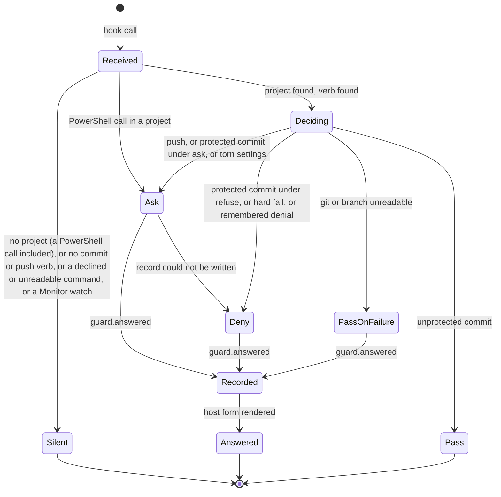
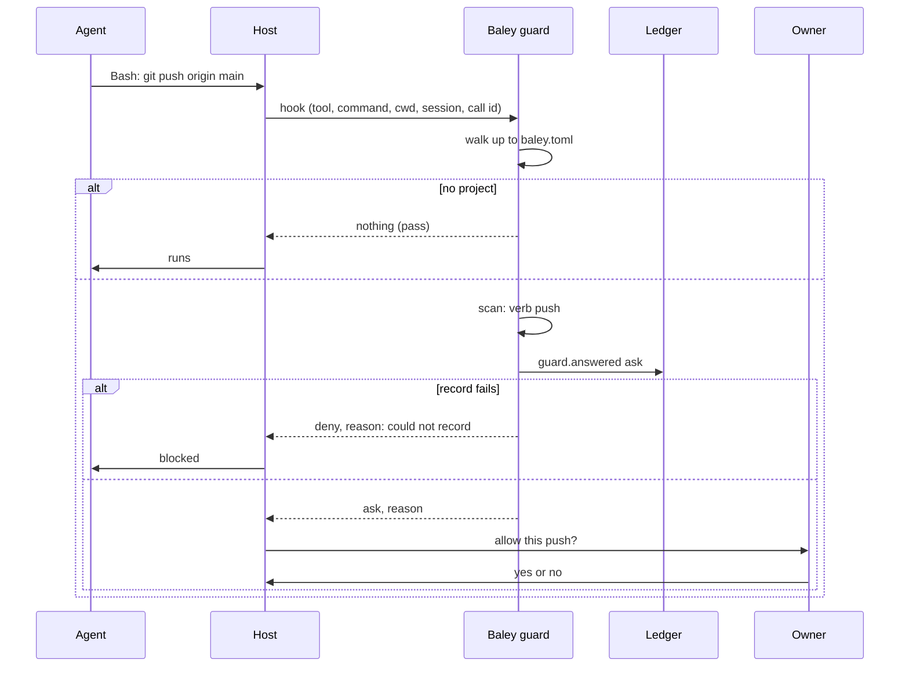
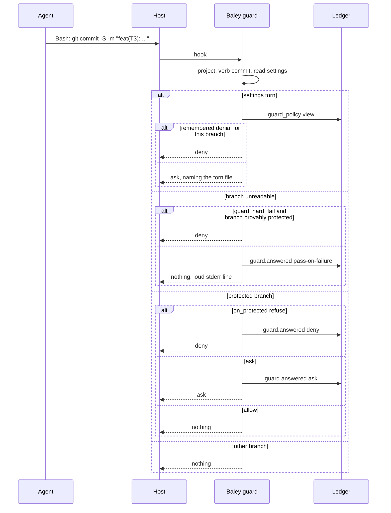

# 0010: Guard

| | |
|---|---|
| Status | Accepted |
| Design issue | none; build issue [#24](https://github.com/crenshawdev/baley/issues/24) |
| Requirement prefix | GRD |
| Applies | [0002: System design](0002-system-design.md) |
| Related | ADRs: [0008](../adr/0008-host-sandbox-isolation.md), [0009](../adr/0009-served-instructions.md), [0027](../adr/0027-vendor-folders-and-plain-keys.md), [0033](../adr/0033-host-security-bar.md) · C4 view: components ([0002](0002-system-design.md) Figure 4) |

The current design of this area, and nothing else. Edit it in place when the design changes; git holds the history. It describes the design only, never the work still to do.

## 1. Purpose and scope

This area decides what Baley does at the host's edge, before a tool call an agent makes runs:

- the one hook Baley installs, what it sees on Claude Code, and how it finds the project;
- the command guard, for `Bash`, `Monitor` and `PowerShell` commands: which git commands it acts on, what it asks, what it refuses, and what it does when it cannot decide;
- the file guard, for `Write`, `Edit` and `NotebookEdit`: which paths an agent may not write;
- how each answer is recorded, remembered and replayed;
- the answer adapter that renders an answer in the host's hook form, and the protection that keeps agents from reading or writing Baley's home and its config folder.

It does not decide the lease itself or what an out-of-lease commit does at task close ([0006](0006-execution.md)); which branch work happens on or how landing pushes ([0011](0011-milestones-landing-undo-pause.md)); risk detection ([0009](0009-risk.md)); or how stubs are rendered and installed ([0012](0012-host-interface.md)).

Hand-offs: 0003 gives the guard project discovery and the settings it reads; 0006 gives it the active lease; 0012 installs the hook and the sandbox configuration; the ledger (0001) stores every guard outcome.

In the component view of [0002](0002-system-design.md) (Figure 4) the guard is the third way into the host interface, beside the MCP server and the command line.

## 2. Terms

| Term | Meaning |
|---|---|
| Hook | Claude Code's pre-tool-use call into Baley, for `Bash`, `Monitor`, `PowerShell`, `Read`, `Grep`, `Glob`, `Write`, `Edit` and `NotebookEdit`. The host passes the tool, its input, the working directory, the session and a call id. |
| Guard | Baley's answer to a hook call: `pass`, `ask`, `deny`, or `pass on failure`. |
| Verb | The git subcommand a `Bash` or `Monitor` command carries: `commit` or `push`. A `PowerShell` command is not scanned. |
| Protected branch | A branch named in `git.protected_branches`. |
| Torn settings | A settings file that cannot be read or parsed at the moment of the call, or that holds a value outside its type or grammar (CFG-R9), such as a bare-string branch list or an unknown `git.on_protected`. |
| Guard failure | A call the guard could not decide because git or the branch could not be read. |
| Hard fail | The opt-in rule (`git.guard_hard_fail`) that turns a guard failure on a provably protected branch into a deny. |
| Remembered policy | The last complete, successfully read policy for the project, kept so that a denial can still be given when the settings are torn. It never supplies an allow. |
| Redelivery | The host calling the hook again with the same call id after a timeout. |
| Answer adapter | The translation of a guard answer into the host's hook form. Claude Code takes `allow`, `deny` and `ask`. |
| Sandbox | The host's own restriction on what an agent process may read and write ([ADR 0008](../adr/0008-host-sandbox-isolation.md)). |

## 3. Requirements

| Id | Rule | Why | Depends on | Status |
|---|---|---|---|---|
| GRD-R1 | Baley installs one hook: Claude Code's pre-tool-use call for `Bash`, `Monitor`, `PowerShell`, `Read`, `Grep`, `Glob`, `Write`, `Edit` and `NotebookEdit`, with a bounded timeout. There is no other hook. | One edge for every tool that runs a shell command or reads or writes a file. | SYS-P11, SYS-P12 | Active |
| GRD-R2 | The guard takes the project from the hook's `CLAUDE_PROJECT_DIR`, walking up from it to the nearest `baley.toml` and stopping at the git repository root (CFG-R4). The hook's working directory resolves the paths a tool call names and names the checkout whose branch is read, so a `/cd` never changes the project. Outside a project the guard is silent for `Bash`, `Monitor` and `PowerShell` calls. The path rules need no project and apply either way: the `Write`, `Edit` and `NotebookEdit` refusal (GRD-R11) and the refusal of a `Read`, `Grep` or `Glob` call that reaches Baley's home or its config folder (GRD-R13). | The guard acts only where Baley is responsible. | CFG-R4 | Active |
| GRD-R3 | The command guard reads the command of a `Bash` call and of a `Monitor` command watch with one scan, and acts on a command only when it carries a git `commit` or `push` verb. It splits the command on `;`, `|`, `&`, `&&`, `||` and newlines, takes segments whose first word is `git` or ends in `/git`, skips git's global flags and their operands, and declines to judge a command containing substitutions, backticks, redirects, subshells, braces, a leading comment, a NUL, an unclosed quote or a trailing backslash. A command that carries both verbs is judged as a push. A declined command passes with nothing recorded, and so does a `Monitor` watch with no command, which is not scanned. In a bound project a `PowerShell` call asks, whether or not it mentions git, and the reason names the grammar the scan cannot judge. A `PowerShell` call is never scanned. No other git verb is covered; this is a stated limit of the design. | Commit and push are where work reaches the record and the forge; everything else was tried and did not pay. Baley reads POSIX shell, so it asks about PowerShell instead of guessing. | | Active |
| GRD-R4 | A `push` always asks, on any branch, with a fixed reason. | Publishing is the owner's step. | SYS-P5 | Active |
| GRD-R5 | A `commit` on a protected branch follows `git.on_protected`: `ask`, `refuse` (deny) or `allow`, acting on the branch git read. An unknown value is outside the setting's grammar, so the file is torn (CFG-R9) and the commit asks, naming the file, unless a remembered denial applies (GRD-R7). On any other branch a commit passes. | The owner sets the branch discipline once. | CFG-R5, CFG-R9 | Active |
| GRD-R6 | When git or the current branch cannot be read, the guard passes, prints a loud line on stderr, and records a guard failure. When `git.guard_hard_fail` is set and the branch is provably protected from what could be read, it denies instead. | A guard that cannot decide must not silently become a wall or a hole. | | Active |
| GRD-R7 | When a settings file is torn, the guard asks, naming the file. Two denials from the remembered policy still stand: a remembered `refuse` on a branch git read that is in the remembered protected list, and a remembered hard fail on a provably protected branch when git cannot read the branch. A remembered `allow` or `ask` never relaxes the ask. The remembered policy keeps only denials, never an allow. | Torn settings must not open the door. | CFG-R9 | Active |
| GRD-R8 | Every `ask`, `deny` and guard failure is recorded before it is answered: the command digest (never the command), the working directory, the project, the verb, the branch, the policy in force, the outcome and the reason. A plain pass records nothing. | The record shows what the guard held and why. | SYS-P6 | Active |
| GRD-R9 | When the decision cannot be recorded, an `ask` becomes `deny` with the reason that the guard could not record its decision, on stderr and in the answer. A decision is unrecordable when the write fails, when the views need a rebuild, or when the call carries no call id to replay it by. A `deny` stays a deny, a pass on failure stays a loud pass and a plain pass stays a pass. A decision that was recorded is not changed, so a recorded ask about torn settings stays an ask. | An unrecorded ask is the gap the record exists to close. | GRD-R8 | Active |
| GRD-R10 | A redelivered call with the same call id gets its confirmed answer again, from the record, even after the policy changed. | The host may deliver a call twice; the answer must not differ. | EVD-R26 | Active |
| GRD-R11 | The file guard denies a `Write`, `Edit` or `NotebookEdit` call whose target is inside or is one of these protected paths: Baley's home folder; Baley's config folder (the global settings file `config.toml` and the keys file `keys.env`, [0003](0003-configuration-and-routing.md) CFG-R2, CFG-R24); the `baley.toml` of the session's project and the `baley.toml` of the checkout the hook's working directory is in, by path or by file identity, but no other file of that name; and the stub paths Baley supplies. It judges them from any working directory, with or without a project. Path resolution canonicalizes the existing prefix, reads both the spelling given and the spelling with each backslash taken as a slash, and refuses an empty value, control bytes, a leading `//` or drive-letter prefix, and a non-directory parent. It judges containment by component and by the (device, inode) identity of existing ancestors, so a sibling such as `baley-old` is not inside `baley` and a differently cased spelling on a case-insensitive volume is still caught. A path it cannot resolve is denied. During an active dispatch, a path outside the dispatch's lease is denied (EXE-R8). Build 5 owns the lease: the decision takes it as an input whose only value today is no active dispatch, and Build 5 defines what a lease names and the deny for a write outside it. | The owner sets policy and holds the keys, Baley renders stubs, and the lease means something as the write happens. | CFG-R11, CFG-R24, ADR 0009, EXE-R8 | Active |
| GRD-R12 | The answer adapter renders each answer in the host's hook form. Claude Code takes `allow`, `deny` and `ask`. | One guard decision, rendered in the host's form. | SYS-P8 | Active |
| GRD-R13 | Agents can neither read nor write Baley's home or its config folder. Three mechanisms carry it, configured at install: Claude Code's sandbox, for shell commands and their children (`Bash`, `Monitor`, `PowerShell`); its `Read` and `Edit` deny rules, for the built-in file tools; and the guard's refusal of a `Read`, `Grep` or `Glob` call that reaches either folder, because Claude Code applies `Read` rules to `Grep` and `Glob` only on a best-effort basis. The guard takes the call's target from `Read`'s `file_path` or from `Grep`'s or `Glob`'s `path`, which is the hook's working directory when absent. It also takes the folders a `Grep` `glob` or a `Glob` `pattern` names before its first wildcard, joined to that target. It refuses when a target lies inside either folder or holds one, compared by component and by file identity, so a sibling such as `baley-old` is not matched. It refuses a pattern with a `..` component after a wildcard, and a path it cannot resolve. An unavailable sandbox is reported, never passed over. A `keys.env` that is a symbolic link is covered only where its target lies inside those folders. `baley doctor` checks the configuration and reports what an agent can reach, reads included. | The record and the keys are protected by the host and the guard together, and tampering is detected by the chain and its anchors. | ADR 0008, ADR 0033 | Active |
| GRD-R14 | The guard reads the hook's input up to a fixed bound, answers within the hook's timeout, and never launches a program except git for the branch; when git is unavailable it reads the branch from `.git/HEAD` directly, bounded and without following symbolic links. Input it cannot read, or that is over the bound, is denied for `Read`, `Grep`, `Glob`, `Write`, `Edit` and `NotebookEdit`, and passes for the command tools. | The guard must answer fast and must not become a way to run things. | | Active |

## 4. Roles and actors

| Actor | Receives | Returns | Model and effort from |
|---|---|---|---|
| Host | The guard's answer in its own form | Runs, asks the owner, or blocks the tool call | Not applicable |
| Owner | An `ask` put by the host | Yes or no, in the host | Not applicable |
| Agent (any worker or the session) | A denied or held tool call with its reason | Nothing; it does not argue with the guard | Not applicable |
| Baley guard | The hook input | pass, ask, deny, pass on failure | Not applicable |
| Ledger | Guard records | | Not applicable |

No model is dispatched by this area.

## 5. Commands and operations

### baley guard (hook entry)

- **Inputs:** the hook's JSON on standard input, read up to 64 KiB. The guard reads these fields:
  - `tool_name`, the tool, and `tool_input`, its input;
  - `cwd`, the working directory;
  - `session_id`;
  - `tool_use_id`, the call id, which is never invented: a call with none cannot be recorded (GRD-R9);
  - `hook_event_name`, which must be `PreToolUse` when present.

  Each tool's `tool_input` is read as follows:

  | Tool | Fields read |
  |---|---|
  | `Bash` | `command` |
  | `Monitor`, command form | `command` |
  | `Monitor`, watch form | none: a watch has no `command` and is not scanned |
  | `PowerShell` | none: the call is judged by its tool name |
  | `Read` | `file_path` |
  | `Grep` | `path` and `glob`, both optional: an absent `path` means the hook's working directory. Grep's search `pattern` is not read |
  | `Glob` | `pattern`, required, and `path`: an absent `path` means the hook's working directory |
  | `Write`, `Edit` | `file_path` |
  | `NotebookEdit` | `notebook_path` |

- **Outputs:** nothing for pass and pass on failure; for ask and deny, Claude Code's permission form with the reason.
- **Refusals (as answers):**

  | Answer | When | Requirement |
  |---|---|---|
  | `ask` | push; protected commit under `ask`; torn settings; a `PowerShell` call in a project | GRD-R3, GRD-R4, GRD-R5, GRD-R7 |
  | `deny` | protected commit under `refuse`; hard fail; remembered denial under torn settings; a Write, Edit or NotebookEdit to Baley's home or config folder, a protected `baley.toml` or a stub, or, once Build 5 supplies the lease, outside it during a dispatch; a `Read`, `Grep` or `Glob` call whose target or pattern reaches either folder, with or without a project; malformed, oversized or incomplete input for one of the six path tools; an unrecordable ask, a missing call id included | GRD-R5, GRD-R6, GRD-R7, GRD-R9, GRD-R11, GRD-R13, GRD-R14 |
  | `pass on failure` | git or branch unreadable without hard fail | GRD-R6 |
  | `pass` | everything else, including a declined or unreadable command, a `Monitor` watch, and any `Bash`, `Monitor` or `PowerShell` call outside a project | GRD-R2, GRD-R3 |

### baley doctor (the guard's part)

- **Inputs:** the host name.
- **Outputs:** whether the hook is installed and points at this binary; whether the sandbox keeps an agent from writing Baley's home and config folder, and from reading them; the answer forms the host honours.
- **Refusals:** none; findings are reported (GRD-R13).

## 6. Records

### guard.answered (event, `project` stream; `guard` stream for calls outside a project that still denied)

| Field | Type | Meaning |
|---|---|---|
| `call` | session id, call id | The hook call, for redelivery |
| `tool` | `bash`, `monitor`, `powershell`, `read`, `grep`, `glob`, `write`, `edit`, `notebookedit` | |
| `command_digest` or `path` | digest, path | Never the command text |
| `cwd` | path | |
| `verb` | `commit`, `push`, absent | |
| `branch` | name or unknown | |
| `policy` | table | `on_protected`, `protected_branches`, `guard_hard_fail` as read, and which file each came from, or `torn` |
| `outcome` | `ask`, `deny`, `pass-on-failure` | |
| `reason` | text | |
| `unavailable` | list | Inputs that could not be read |

### guard.policy_recorded (event, `project` stream)

The last complete policy read, kept for GRD-R7. The `guard_policy` view holds the latest per project.

### Views

| View | Key | Content |
|---|---|---|
| `guard` | project, call | The confirmed answer for redelivery |
| `guard_policy` | project | The remembered policy, denials only |

## 7. States

```mermaid
stateDiagram-v2
  [*] --> Received: hook call
  Received --> Silent: no project (a PowerShell call included), or no commit or push verb, or a declined or unreadable command, or a Monitor watch
  Received --> Ask: PowerShell call in a project
  Received --> Deciding: project found, verb found
  Deciding --> Ask: push, or protected commit under ask, or torn settings
  Deciding --> Deny: protected commit under refuse, or hard fail, or remembered denial
  Deciding --> PassOnFailure: git or branch unreadable
  Deciding --> Pass: unprotected commit
  Ask --> Recorded: guard.answered
  Deny --> Recorded: guard.answered
  PassOnFailure --> Recorded: guard.answered
  Ask --> Deny: record could not be written
  Recorded --> Answered: host form rendered
  Silent --> [*]
  Pass --> [*]
  Answered --> [*]
```

*Figure 1. States of one command guard call.*

## 8. Workflows

```mermaid
sequenceDiagram
  participant A as Agent
  participant H as Host
  participant G as Baley guard
  participant L as Ledger
  participant O as Owner
  A->>H: Bash: git push origin main
  H->>G: hook (tool, command, cwd, session, call id)
  G->>G: walk up to baley.toml
  alt no project
    G-->>H: nothing (pass)
    H->>A: runs
  else
    G->>G: scan: verb push
    G->>L: guard.answered ask
    alt record fails
      G-->>H: deny, reason: could not record
      H->>A: blocked
    else
      G-->>H: ask, reason
      H->>O: allow this push?
      O->>H: yes or no
    end
  end
```

*Figure 2. A push through the guard.*

```mermaid
sequenceDiagram
  participant A as Agent
  participant H as Host
  participant G as Baley guard
  participant L as Ledger
  A->>H: Bash: git commit -S -m "feat(T3): ..."
  H->>G: hook
  G->>G: project, verb commit, read settings
  alt settings torn
    G->>L: guard_policy view
    alt remembered denial for this branch
      G-->>H: deny
    else
      G-->>H: ask, naming the torn file
    end
  else branch unreadable
    alt guard_hard_fail and branch provably protected
      G-->>H: deny
    else
      G->>L: guard.answered pass-on-failure
      G-->>H: nothing, loud stderr line
    end
  else protected branch
    alt on_protected refuse
      G->>L: guard.answered deny
      G-->>H: deny
    else ask
      G->>L: guard.answered ask
      G-->>H: ask
    else allow
      G-->>H: nothing
    end
  else other branch
    G-->>H: nothing
  end
```

*Figure 3. A commit through the guard.*

## 9. Settings

| Setting | Type | Default | Scope | Owner | Effect |
|---|---|---|---|---|---|
| `git.protected_branches` | list of branch names | `["main", "master"]` | project | 0010 | Branches a commit is asked about or refused on (GRD-R5) |
| `git.on_protected` | `ask`, `refuse`, `allow` | `ask` | project | 0010 | What a commit on a protected branch gets (GRD-R5) |
| `git.guard_hard_fail` | bool | `false` | project | 0010 | Deny instead of pass when inputs are unreadable on a provably protected branch (GRD-R6) |

`git.protected_branches` is a TOML array of non-empty branch names, and `[]` protects no branch. A bare string, an entry that is not a string and a blank entry each make the file unavailable. So does a `git.on_protected` other than `ask`, `refuse` or `allow`, and a `git.guard_hard_fail` that is not a boolean. An unavailable file is torn settings, which GRD-R5 and GRD-R7 answer. `baley config set` writes the two scalars but refuses the list, naming `baley.toml`, where the owner edits it ([0003](0003-configuration-and-routing.md) section 5).

## 10. Instructions served

Not applicable. The guard gives no instructions; an agent sees only the host's own message for a held or blocked call, carrying the guard's reason.

## 11. Build status

The running `baley guard` is the binary's inherited guard. It uses the core scanner and the core reason text. The guard's rules are also built as pure decisions in `baley-core`'s guard module (`crates/baley-core/src/guard/`) and in the library's `hook_input` and `protected_paths` modules, and Build 3 T10 calls them from the hook. Until then the live hook still runs its inherited discovery, settings, protections and audit, which T10 replaces.

| Requirement | Status | Where |
|---|---|---|
| GRD-R1 | Partly built | One Claude Code hook (`hooks/hooks.json:5`) whose matcher is `Bash\|Write\|Edit`, so `Monitor`, `PowerShell`, `Read`, `Grep`, `Glob` and `NotebookEdit` are not matched yet. T10 widens it. The library classifies all nine tools (`crates/baley/src/hook_input/mod.rs:101-195`) |
| GRD-R2 | Partly built | The pure decisions take whether a project is bound as an input (`crates/baley-core/src/guard/answer.rs:61-70, 138-144`). The live hook still walks up to `.planning` for `Bash` (`crates/baley/src/guard/bash.rs:28-45`), and its Write/Edit path has no discovery (`crates/baley/src/guard/mod.rs:186-207`). Discovery from `CLAUDE_PROJECT_DIR` is T10's |
| GRD-R3 | Partly built | The scanner is in the core (`crates/baley-core/src/guard/scan.rs:19-123`), the PowerShell ask is a core decision (`crates/baley-core/src/guard/answer.rs:138-144`), and the library classifies `Bash`, `Monitor` command and watch forms, and `PowerShell` (`crates/baley/src/hook_input/mod.rs:101-195`). The live hook scans `Bash` only (`crates/baley/src/guard/bash.rs:359-376`) |
| GRD-R4 | Partly built | The core answer (`crates/baley-core/src/guard/answer.rs:61-73`). The live hook asks on a push with the core reason (`crates/baley/src/guard/bash.rs:371-398, 414-419`) |
| GRD-R5 | Partly built | The core answer, with the settings read from a complete policy (`crates/baley-core/src/guard/answer.rs:82-102`, `crates/baley-core/src/guard/settings.rs:12-54`) and the three settings in the schema (`crates/baley-core/src/policy/schema.rs:296-316`). The live hook decides from its inherited JSON settings (`crates/baley/src/guard/bash.rs:63-155, 272-338`) with the core reason text. T10 replaces them |
| GRD-R6 | Partly built | The core answer (`crates/baley-core/src/guard/answer.rs:90-100`). The live hook gathers the branch and the `.git/HEAD` fallback itself (`crates/baley/src/guard/bash.rs:157-270`) and decides at `crates/baley/src/guard/bash.rs:272-338` |
| GRD-R7 | Partly built | The core answer for torn settings and the two remembered denials (`crates/baley-core/src/guard/answer.rs:106-131`). The live hook honours a remembered hard fail but not a remembered refuse (`crates/baley/src/guard/bash.rs:291-298`), until T10 |
| GRD-R8 | Partly built | The inherited hook records commit and push answers into the old store (`crates/baley/src/guard/audit.rs:51-123`). The `guard.answered` records of section 6 and the other tools' records are T10's |
| GRD-R9 | Partly built | The core mapping from an answer and the audit precondition (`crates/baley-core/src/guard/recording.rs:27-34`). The live hook still passes an unrecordable ask (`audit_failed`, `crates/baley/src/guard/bash.rs:347-357`) and invents an identity for a call with no call id (`crates/baley/src/guard/audit.rs:9-20`) until T10 |
| GRD-R10 | Built | `crates/baley/src/guard/bash.rs:404-413` |
| GRD-R11 | Partly built | The library write decision and its lease input (`crates/baley/src/protected_paths/write.rs:18-99`), with path resolution and containment (`crates/baley/src/protected_paths/resolve.rs:151-238`, `crates/baley/src/protected_paths/contain.rs:23-58`). Build 5 owns the lease. The live hook still applies its inherited `.planning`, `config.v4.json` and rendered-skill protections through its own resolver (`crates/baley/src/guard/mod.rs:186-207, 246-334, 351-391`), which T10 deletes, and `NotebookEdit` is not matched yet (GRD-R1) |
| GRD-R12 | Not built | Only Claude Code's form is written, inline in the guard (`crates/baley/src/guard/mod.rs:223-244`). The renderer this requirement describes is built with Build 3 T10 |
| GRD-R13 | Partly built | The library read decision (`crates/baley/src/protected_paths/read.rs:22-105`) is built and T10 calls it. The sandbox settings and the `Read` and `Edit` deny rules are T11's, and the doctor is T13's. The sandbox probe is a spike (`spikes/host-matrix`) that Build 3 T12 extends to separate home and config folders and the built-in file tools |
| GRD-R14 | Partly built | The live hook reads input to the bound and answers `Write` and `Edit` input it cannot read with a deny (`crates/baley/src/guard/mod.rs:15, 105-174`), and runs git for the branch (`crates/baley/src/guard/bash.rs:157-270`). The library classifier applies the bound to every tool and denies unreadable input for the six path tools (`crates/baley/src/hook_input/mod.rs:19-21, 133-149, 225-233`) |

## 12. Open questions

No question is open.
