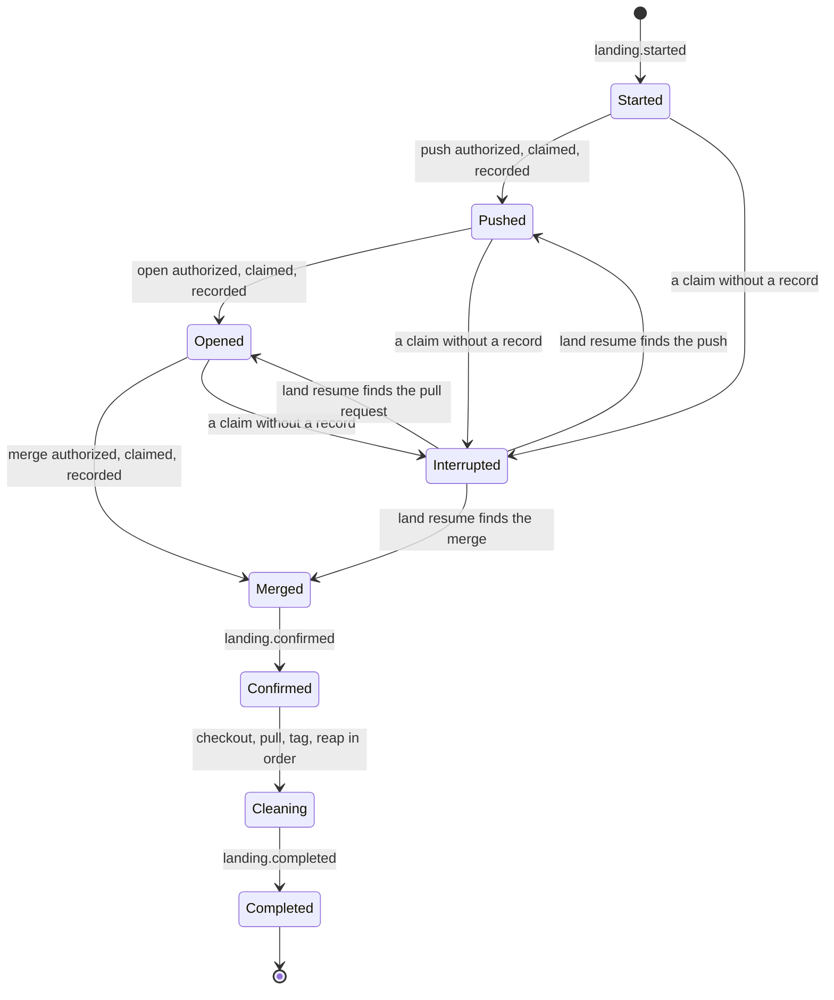
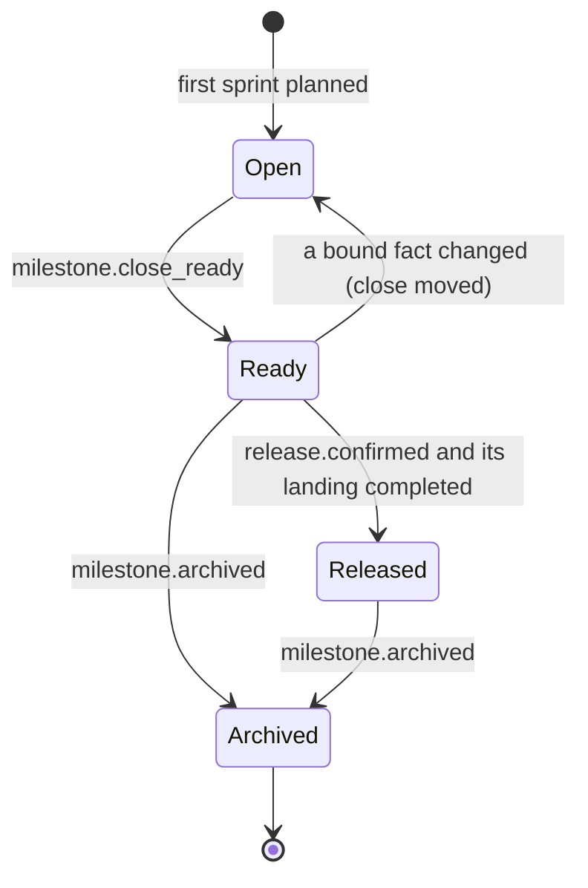
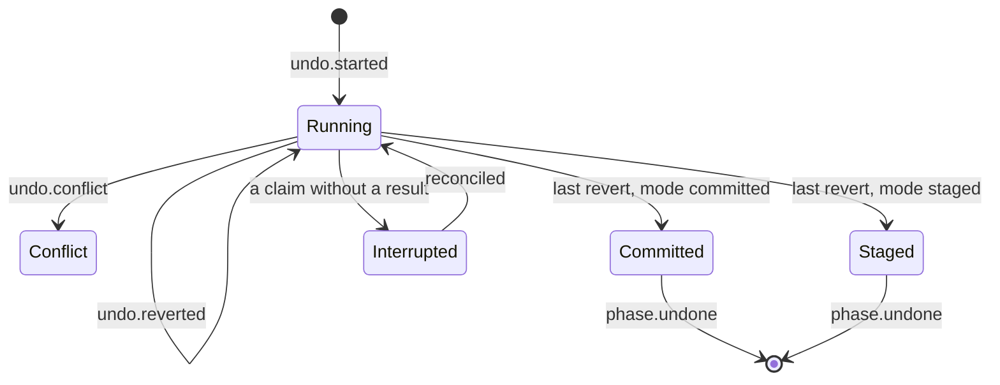
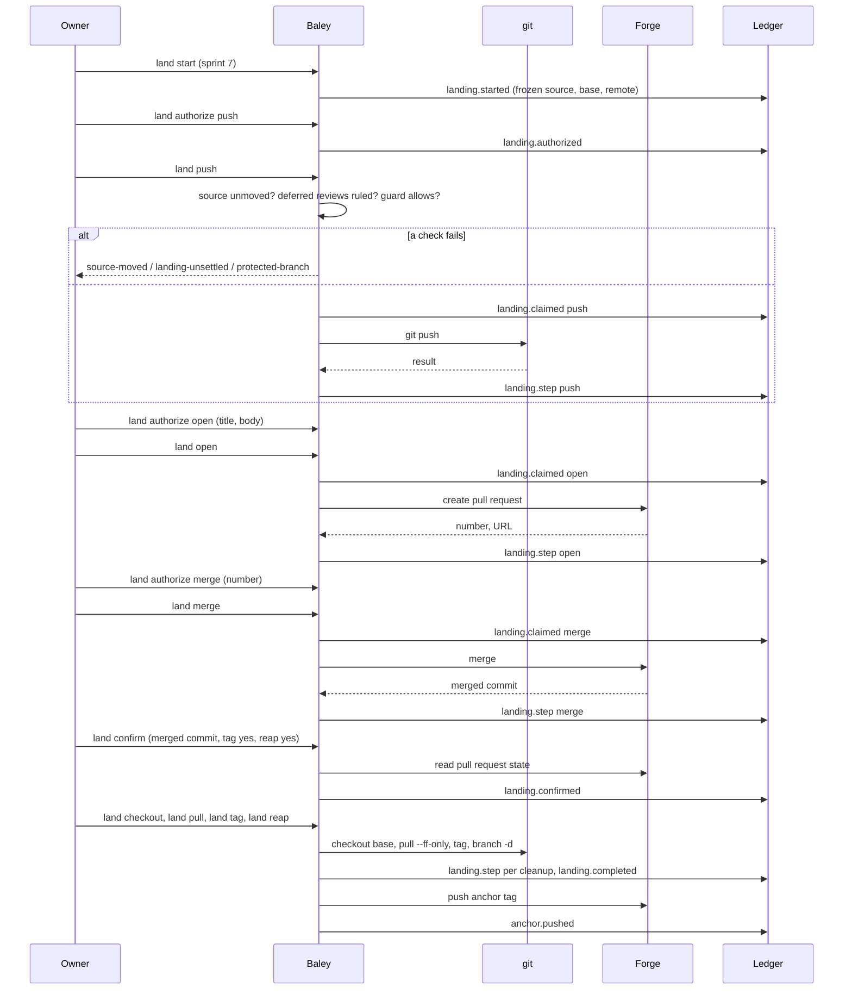
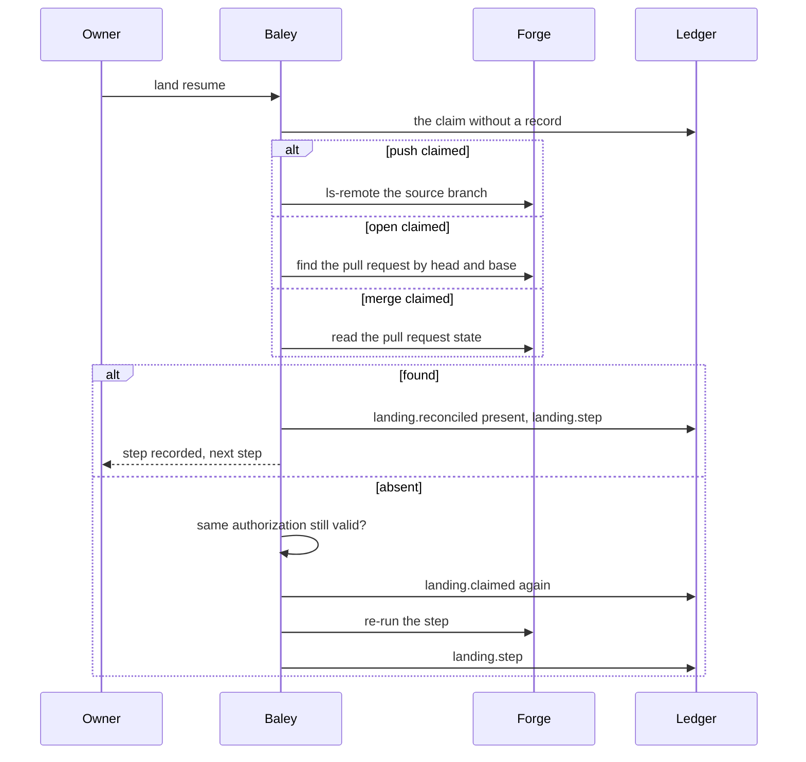
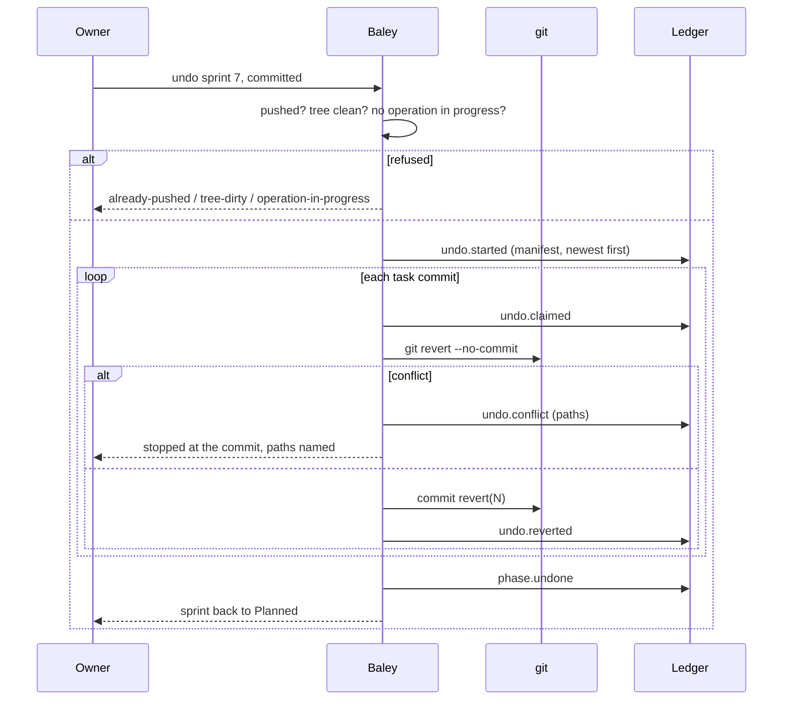

# 0011: Milestones, landing, undo and pause

| | |
|---|---|
| Status | Accepted |
| Design issue | none; build issue [#27](https://github.com/crenshawdev/baley/issues/27) |
| Requirement prefix | LND |
| Applies | [0002: System design](0002-system-design.md) |
| Related | ADRs: [0007](../adr/0007-forge-anchors.md), [0004](../adr/0004-project-identity.md) · C4 view: components ([0002](0002-system-design.md) Figure 4) |

The current design of this area, and nothing else. Edit it in place when the design changes; git holds the history. It describes the design only, never the work still to do.

## 1. Purpose and scope

This area decides how finished work leaves the checkout and how work in flight is put down and picked up:

- the branch a sprint works on, and landing: pushing, opening the pull request, merging, tagging, and the cleanup after, each step on the owner's word;
- the tracker check landing reports;
- milestones: closing one when its sprints are done, archiving it, and releasing the managed project;
- undo: reverting a sprint's task commits;
- pause and resume: putting work down with its state preserved, and an owner's stop;
- the forge adapter every forge step goes through, and the chain anchors it pushes.

It does not decide when a sprint is complete ([0007](0007-verification.md)); what the guard does with a push an agent attempts ([0010](0010-guard.md)); reviews a landing waits on ([0008](0008-review.md)); the forge mirror of stories and sprints (`Backlog`, [0005](0005-context-plans-and-acceptance.md) PLN-R22); or how Baley itself is released ([#14](https://github.com/crenshawdev/baley/issues/14), its own design).

Hand-offs: 0007 completes sprints; this area lands them. 0006's `phase.undone` is this area's undo. 0004's project start offers the forge creation this area performs. 0008's filing and 0009's anchors go through this area's forge adapter.

In the component view of [0002](0002-system-design.md) (Figure 4) this area is one of the domain areas, and the forge adapter is one of the ports.

## 2. Terms

| Term | Meaning |
|---|---|
| Base branch | The branch work is integrated into: `git.base_branch`, or the repository's default. |
| Integration branch | Where a sprint's task commits go: a branch per sprint, per milestone, or the base branch itself (`git.integration_branch`). |
| Landing | Taking an integration branch to the base branch on the forge: push, open a pull request, merge, then local cleanup. |
| Authorization | The owner's grant for exactly one external step of one landing, bound to the landing's exact state. |
| External step | A step that changes something outside the checkout: push, open, merge, tag push, forge create. |
| Claim | The record that an external step is about to run, written before it runs ([0001](0001-evidence-ledger.md), EVD-R26). |
| Reconciliation | Reading the real state (the remote, the forge) after an interrupted step to record what happened. |
| Merge confirmation | The owner's record that the pull request merged, with the cleanup choices: tag or not, reap the branch or not. |
| Reap | Deleting the merged integration branch locally. |
| Tracker check | Landing's read-only report of the forge's open issues for the project. |
| Milestone | A named group of sprints (Asimov names in this repository; any name in a managed project). |
| Close | The record that a milestone's sprints are complete, its reviews ruled and its risk settled. |
| Archive | The later owner step, bound to one exact close, that removes the milestone's sprints from the active roadmap and applies retention; nothing is deleted from the ledger. |
| Release | Tagging the managed project at a version, with its version manifest bumped, over a landing. |
| Undo | Reverting a sprint's task commits, newest first, before they are pushed. |
| Pause | A work-in-progress commit of the authorized paths and a resume record. |
| Stop | The owner's order to halt; lifted only by the owner. |
| Anchor | The immutable tag `baley-anchor/<project>/<seq>` carrying the chain head (ADR 0007). |

## 3. Requirements

| Id | Rule | Why | Depends on | Status |
|---|---|---|---|---|
| LND-R1 | `git.integration_branch` is `sprint` (default), `milestone` or `trunk`. With `sprint`, each sprint works on `baley/sprint-<n>-<slug>`, created when the sprint is first planned per `git.auto_branch`, and lands with its own pull request after completion. With `milestone`, one branch `baley/<milestone-slug>` carries every sprint of the milestone and lands once. With `trunk`, task commits go on the base branch and landing is the push. A branch is never created on a protected branch's name. | The increment reaches the base branch at the pace the owner chooses; a sprint is the default unit that ships. | CFG-R5, GRD-R5 | Active |
| LND-R2 | Landing starts by freezing its source (branch and head), base (branch and head) and remote; these never change for that landing. Each external step needs its own authorization by the owner, naming the landing, its generation, source, base and remote, with owner and time; a step without a matching authorization is refused (`unauthorized`). No step publishes, opens or merges anything without one. | Every change to the outside world is the owner's, one step at a time. | SYS-P5, EVD-R27 | Active |
| LND-R3 | Every external step is claimed before it runs and recorded after; a claim with no record blocks a plain retry (`reconciliation-required`), and `land resume` reads the remote or the forge first and records what it finds, re-running the step only under the same authorization when it is absent. | An interrupted push or merge is never repeated blindly. | SYS-P7, EVD-R26 | Active |
| LND-R4 | Before any external step, Baley checks that the checkout still matches the frozen source (branch, head, remote URL), that no deferred review is unruled (`landing-unsettled`, [0008](0008-review.md) REV-R11), and that the guard's protected-branch rule does not deny; an `ask` there is satisfied by the owner's authorization. | The owner authorized a state; a different state needs a new word. | REV-R11, GRD-R5 | Active |
| LND-R5 | The steps run in order: push (`git push` of the source head to the source branch), open (a pull request from source to base on the configured forge, needing the push record and an unmoved remote base), merge (the pull request by number, needing the open record and a matching head), then the owner's merge confirmation, then local cleanup in fixed order: checkout the base, pull it fast-forward only, tag the merged commit when the owner chose to, reap the source branch when the owner chose to and it is merged, not protected and not checked out. A declined tag or reap is recorded as skipped. With `trunk`, landing is push then pull. | One known order, each step with its preconditions, nothing implicit. | LND-R2, LND-R3 | Active |
| LND-R6 | The merge confirmation is the owner's record of the merged pull request and commit and the cleanup choices (tag name and message or none; reap or not), checked against the forge's state (merged, matching commit, remote base equal to the merged commit). A landing bound to a release forces the release's tag. | Cleanup follows what actually merged. | LND-R5 | Active |
| LND-R7 | `land read` reports the checkout state (branch, head, dirty, ahead), the remote heads, the landing's done and next steps, and the tracker check: the forge's open issues for the project, read-only, with a stable reason for anything it could not read and a flag when the listing was cut at the forge's page size. | The owner sees where the landing stands and what the tracker holds before merging. | | Active |
| LND-R8 | The forge is reached through its own command-line tool (`gh` for GitHub) run through the process port with a bounded timeout, prompts disabled and output capped; the forge, repository and host used must equal `git.forge_provider`, `git.forge_repo` and `git.forge_host`. Pull request discovery is bounded and an ambiguous match is refused. | Baley never embeds a forge's authentication; the owner's own login is used. | SYS-R10, CFG-R5 | Active |
| LND-R9 | GitHub is the forge of the first release. | One forge proven end to end before another is claimed. | CFG-R29 | Active |
| LND-R10 | GitLab and Forgejo are forges, each through its own tool (`glab`, `tea`), with the same steps proven on each. | The owner has accounts on all three. | LND-R8 | Backlog |
| LND-R11 | At project start, when the forge check finds no remote or no tag ruleset (PRJ-R8), Baley offers to create a private repository or the ruleset; each is an external step under LND-R2 and LND-R3. | The forge is set up the same way everything else on it is changed. | PRJ-R8 | Active |
| LND-R12 | A milestone closes when every sprint in it is complete, every review it raised is ruled and every risk settled; the close records readiness bound to those facts and changes nothing else. A milestone with an unmet condition is refused (`milestone-incomplete`, `milestone-unsettled`) naming it. | Nothing half-finished is shipped. | VER-R12, REV-R11, RSK-R6 | Active |
| LND-R13 | Archive is a separate owner step bound to one exact close: the milestone's sprints leave the active roadmap, run outputs are trimmed per the retention rule ([0001](0001-evidence-ledger.md)), and the roadmap view no longer lists them by default. Nothing is deleted from the ledger. One archive per close. | The active roadmap stays small; the record stays whole. | EVD-R14 | Active |
| LND-R14 | Release of the managed project is proposed then confirmed. Propose: the tag `v<semver>` must be well-formed, not collide with an existing tag or version, and be newer than the newest; the project's version manifest (a JSON, TOML or similar file the owner names, holding a version string) is read; a landing exists, unstarted, at HEAD. Confirm: the owner's record with time re-observes manifest, tags and HEAD, bumps the manifest in one commit, and binds the release to the landing, which then pushes the tag after merge. | A version is cut once, on the record, over a landing the owner runs. | LND-R2, LND-R6 | Active |
| LND-R15 | Undo reverts a sprint's task commits, newest first, in `committed` mode (one signed revert commit per task commit) or `staged` mode (the reverts left in the index). The manifest comes from the sprint's recorded task closes only; a sprint with pushed commits is refused (`already-pushed`); the tree must be clean and no revert, cherry-pick or merge in progress; each revert is claimed before it runs and a conflict stops with the conflicting paths recorded; an interrupted revert is reconciled before anything continues. One undo per sprint; the sprint returns to Planned (0004 Figure 1). | Work is taken back exactly as it was recorded, and never twice. | EXE-R4, SYS-P7 | Active |
| LND-R16 | Pause makes a work-in-progress commit of the paths the active dispatch authorized, then records `pause.recorded` with the preserved HEAD, branch, policy version, dispatch and the next step in one sentence. Resume checks every binding and records `pause.resumed`; a binding that moved is refused naming it. Next action offers the resume only for the sprint that was paused. | Work is put down whole and picked up where it was. | EXE-R17, CFG-R8 | Active |
| LND-R17 | An owner's stop halts the sprint's work at once, holds through restarts, and is lifted only by the owner's resume, with or without a checkpoint. A stop is never refused. | The owner said stop. | SYS-P5, EXE-R19 | Active |
| LND-R18 | Baley pushes an anchor tag at each verified sprint, each milestone step and each landing, and at least daily while a project is active, as an external step needing no authorization (it changes no source); a failed anchor push is an outcome, recorded and retried on the next occasion. | Rewrite and rollback are detectable from outside the machine. | ADR 0007 | Active |
| LND-R19 | Every refusal in this area is recorded with its reason and facts, and a replayed request is answered from the record. | The owner can see why a landing did not move. | EVD-R26 | Active |

## 4. Roles and actors

| Actor | Receives | Returns | Model and effort from |
|---|---|---|---|
| Owner | The landing's state and next step; the tracker check; the merge confirmation questions; milestone readiness; release proposals; undo previews; pause and resume facts | Authorizations; the merge confirmation with tag and reap choices; close, archive, release confirmations; undo, pause, resume, stop | Not applicable |
| Baley: this area | Requests | Claims, effects, records, refusals | Not applicable |
| Forge adapter (port) | An external step | The remote's and the forge's answer | Not applicable |
| Process port | git and the forge tool | Exit code and output | Not applicable |
| Hardin | Whether a landing, close, undo or resume may happen | Allow or the refusal | Not applicable |

No model is dispatched by this area; the host session relays nothing here beyond putting the owner's commands through.

## 5. Commands and operations

Owner commands under `baley land`, `baley milestone`, `baley release`, `baley undo`, `baley pause`, `baley resume`, `baley stop`; each also a typed operation on the host interface.

### land start, land authorize, land push, land open, land merge, land resume, land confirm, land checkout, land pull, land tag, land reap, land read

- **Inputs:** `start`: the sprint or milestone; `authorize`: the step (push, open with title and body, merge with the pull request number, tag push with the tag and object), the landing's identity and generation, owner, time; the steps: the landing; `confirm`: the merged pull request and commit, tag choice, reap choice; `read`: the project.
- **Outputs:** each step's record and the landing's generation; `read` as LND-R7.
- **Refusals:**

  | Code | When | Requirement |
  |---|---|---|
  | `unauthorized` | No matching authorization at this generation | LND-R2 |
  | `source-moved` | Branch, head or remote differ from the frozen source | LND-R4 |
  | `landing-unsettled` | An unruled deferred review exists | LND-R4 |
  | `protected-branch` | The guard rule denies | LND-R4 |
  | `reconciliation-required` | A claim without a record | LND-R3 |
  | `step-order` | A step whose predecessor has no record | LND-R5 |
  | `not-merged`, `merge-mismatch` | Confirmation against a forge state that disagrees | LND-R6 |
  | `tree-dirty` | Cleanup on a dirty index or worktree | LND-R5 |
  | `reap-refused` | The source is protected, checked out, moved or not merged | LND-R5 |
  | `forge-mismatch` | The authorized forge differs from the settings | LND-R8 |
  | `ambiguous-pull-request` | Discovery matched more than one | LND-R8 |

### milestone read, milestone close, milestone archive

- **Inputs:** the milestone; `archive`: the exact close id.
- **Outputs:** readiness per sprint with what is unmet; `milestone.close_ready`; `milestone.archived`.
- **Refusals:** `milestone-incomplete`, `milestone-unsettled` (naming the sprint, review or risk), `close-moved` (archive against a close whose facts changed), `archive-exists` (LND-R12, LND-R13).

### release propose, release confirm

- **Inputs:** `propose`: the tag, the manifest path; `confirm`: the proposal digest, owner, time.
- **Outputs:** the proposal with newest tag, drift and digest; `release.proposed`, `release.confirmed` with the bump commit and the bound landing.
- **Refusals:** `tag-format`, `release-collision`, `not-newest`, `manifest-unreadable`, `no-landing` (no unstarted landing at HEAD), `stale-proposal` (LND-R14).

### undo

- **Inputs:** the sprint, `committed` or `staged`, the manifest id from `undo read`.
- **Outputs:** per commit the revert record; the final state `committed`, `staged` or `conflict` with paths.
- **Refusals:** `already-pushed`, `tree-dirty`, `operation-in-progress`, `undo-exists`, `manifest-stale`, `reconciliation-required` (LND-R15).

### pause, resume, stop

- **Inputs:** `pause`: the one-line next step; `resume`: nothing; `stop`: nothing.
- **Outputs:** `pause.recorded` with bindings; `pause.resumed`; the stop and its lift recorded as checkpoints ([0006](0006-execution.md)).
- **Refusals:** `binding-moved` naming the binding (resume); a stop is never refused (LND-R16, LND-R17).

## 6. Records

### landing (events, `milestone/<name>` stream, or `phase/<n>` for a sprint landing)

| Event | Fields |
|---|---|
| `landing.started` | landing id, source (branch, head), base (branch, head), remote (name, URL), integration mode |
| `landing.authorized` | landing, generation, step, step arguments, owner, time |
| `landing.claimed` | landing, generation, step, what will run |
| `landing.step` | landing, step, result (pushed head; pull request number and URL; merged commit; tag pushed; checked out; pulled; tagged; reaped; skipped), generation after |
| `landing.reconciled` | landing, step, what the remote or forge showed |
| `landing.confirmed` | landing, merged pull request, merged commit, tag choice, reap choice, owner, time |
| `landing.completed` | landing |
| `tracker.checked` | landing, open issues (number, title), cut flag, skip reason |

### milestone.close_ready, milestone.archived, release.proposed, release.confirmed (events, `milestone/<name>` stream)

`close_ready`: milestone, sprints, the completion, review and risk facts bound. `archived`: the close id, sprints archived, outputs trimmed. `release.proposed`: tag, manifest path and version, newest tag, drift, digest, landing. `release.confirmed`: proposal digest, bump commit, owner, time.

### undo events (`phase/<n>` stream)

`undo.started`: sprint, mode, manifest (commits in revert order). `undo.claimed`: commit, head, index before. `undo.reverted`: commit, revert commit or index after. `undo.conflict`: commit, conflicting paths. `phase.undone`: sprint, final state.

### pause.recorded, pause.resumed (events, `pause` stream)

`pause.recorded`: sprint, work-in-progress commit, preserved head, branch, policy version, dispatch, next step. `pause.resumed`: the pause, the checks passed, owner, time.

### anchor.pushed, anchor.failed (events, `project` stream)

Tag name, sequence, head hash, remote; or the failure reason.

### Views

| View | Key | Content |
|---|---|---|
| `milestone` | project, milestone | Sprints and their completion, close, archive, release and landing state |
| `landing` | project, landing | Frozen source, base and remote; steps done and next; authorizations; confirmation |
| `pause` | project | The active pause and its bindings, or none |

## 7. States

*Figure 1. States of a landing. With `trunk`, Started goes to Pushed then Cleaning (pull only).*

*Figure 2. States of a milestone.*

*Figure 3. States of an undo.*

## 8. Workflows

*Figure 4. Landing a sprint on GitHub.*

*Figure 5. Reconciling an interrupted landing step.*

*Figure 6. Undoing a sprint.*

## 9. Settings

| Setting | Type | Default | Scope | Owner | Effect |
|---|---|---|---|---|---|
| `git.integration_branch` | `sprint`, `milestone`, `trunk` | `sprint` | project | 0011 | Where task commits go and what a landing lands (LND-R1) |
| `git.auto_branch` | `ask`, `auto`, `off` | `ask` | project | 0011 | Whether Baley creates the integration branch (LND-R1) |
| `git.base_branch` | branch name or absent | absent (the repository default) | project | 0011 | The branch landings merge into (LND-R1) |
| `git.forge_provider` | `github`, `gitlab`, `forgejo` | absent | project | 0011 | The forge tool used (LND-R8); `gitlab` and `forgejo` are `Backlog` (LND-R10) |
| `git.forge_repo` | `owner/repo` | absent | project | 0011 | The repository on the forge (LND-R8) |
| `git.forge_host` | host name, optional port | absent | project | 0011 | The forge host for self-hosted forges (LND-R8) |
| `git.protected_branches`, `git.on_protected` | see [0010](0010-guard.md) | | project | 0010 | The rule an external step checks (LND-R4) |

`git.create_tag`, `git.on_land_cleanup` and `git.issue_check` are removed: tag and reap are the owner's choice at each merge confirmation, and the tracker check always runs.

## 10. Instructions served

| Instruction | Served to | Carries requirements |
|---|---|---|
| Landing stub | The host session: which operation each `land`, `milestone`, `release`, `undo`, `pause`, `resume` and `stop` command calls, and that every external step needs the owner's authorization first | LND-R2, LND-R5 |

No worker is dispatched; no instruction reaches a model beyond the stub.

## 11. Build status

The code today is the Cadence engine crate awaiting rename; its landing, milestone and undo paths are close to this design, and its pause is unreachable.

| Requirement | Status | Where |
|---|---|---|
| LND-R1 | Partly built | Integration branch `cadence/v<semver>` per milestone only, on the unreachable pause path (`crates/cadence/src/pause/branch.rs:275-333`); no sprint branch |
| LND-R2 | Built | `crates/cadence/src/landing_service.rs:71-101`, `crates/cadence/src/landing/authorization.rs:11-45` |
| LND-R3 | Built | `crates/cadence/src/landing_service.rs:245-290`, `crates/cadence/src/landing/reconcile.rs:21-65` |
| LND-R4 | Built | `crates/cadence/src/landing_service.rs:123-128`, `crates/cadence/src/landing/effects.rs:58-92` |
| LND-R5 | Built | `crates/cadence/src/landing/effects.rs:97-126`, `crates/cadence/src/landing/cleanup.rs:9, 85-255` |
| LND-R6 | Built | `crates/cadence/src/landing/cleanup.rs:30-73` |
| LND-R7 | Partly built | `crates/cadence/src/landing/report.rs:45-76`; every failure is `unavailable` and the listing is cut at 30 without saying so (`crates/cadence/src/landing/forge.rs:75`) |
| LND-R8 | Built | `crates/cadence/src/landing/forge.rs:8-70, 100-163`, `crates/cadence/src/landing/effects.rs:12-45` |
| LND-R11 | Not built | |
| LND-R12 | Built | `crates/cadence/src/milestone_service.rs:91-123`, `crates/cadence/src/milestone/preflight.rs:12-37` |
| LND-R13 | Not built as designed | Prune deletes phase directories and rewrites Markdown (`crates/cadence/src/milestone/prune.rs:110-238`) |
| LND-R14 | Built | `crates/cadence/src/milestone/release.rs:81-209` |
| LND-R15 | Built | `crates/cadence/src/undo/manifest.rs:15-86`, `crates/cadence/src/undo/revert.rs:19-49`, `crates/cadence/src/undo_service.rs:91-133`; no pushed check |
| LND-R16 | Not reachable | `crates/cadence/src/pause_service.rs:1227` has no MCP route (`crates/cadence/src/server.rs:127-134`) |
| LND-R17 | Partly built | Stop as an owner answer (`crates/cadence/src/execution_service.rs:281-289`) |
| LND-R18 | Not built | Anchors are designed in 0001 and not yet pushed by any code |
| LND-R19 | Built | Receipts per namespace (`crates/cadence/src/milestone_service.rs:146-259`, `crates/cadence/src/landing_service.rs:137-138`) |

## 12. Open questions

| Question | Decided by |
|---|---|
| How soon after a create the forge's search finds the new object (pull request, issue) by its identity | Measured on GitHub when the forge adapter is built; the answer is written here |
