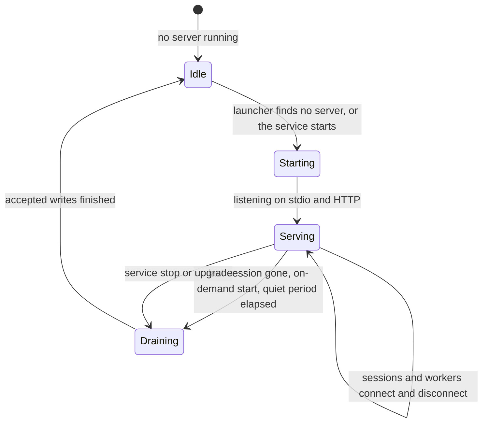
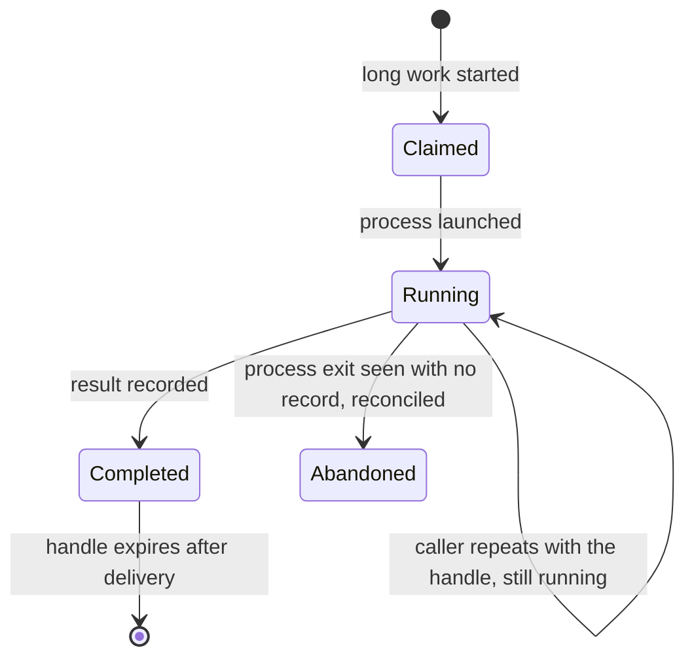
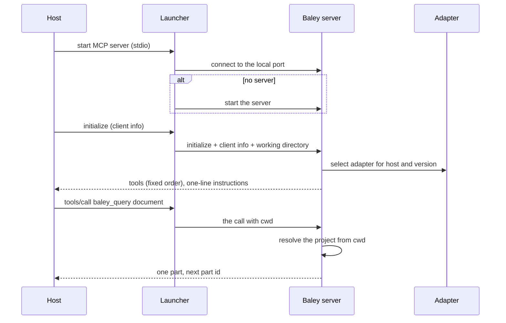
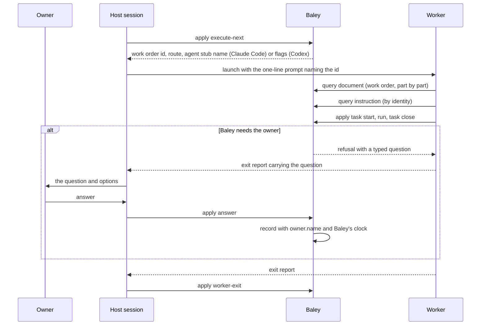
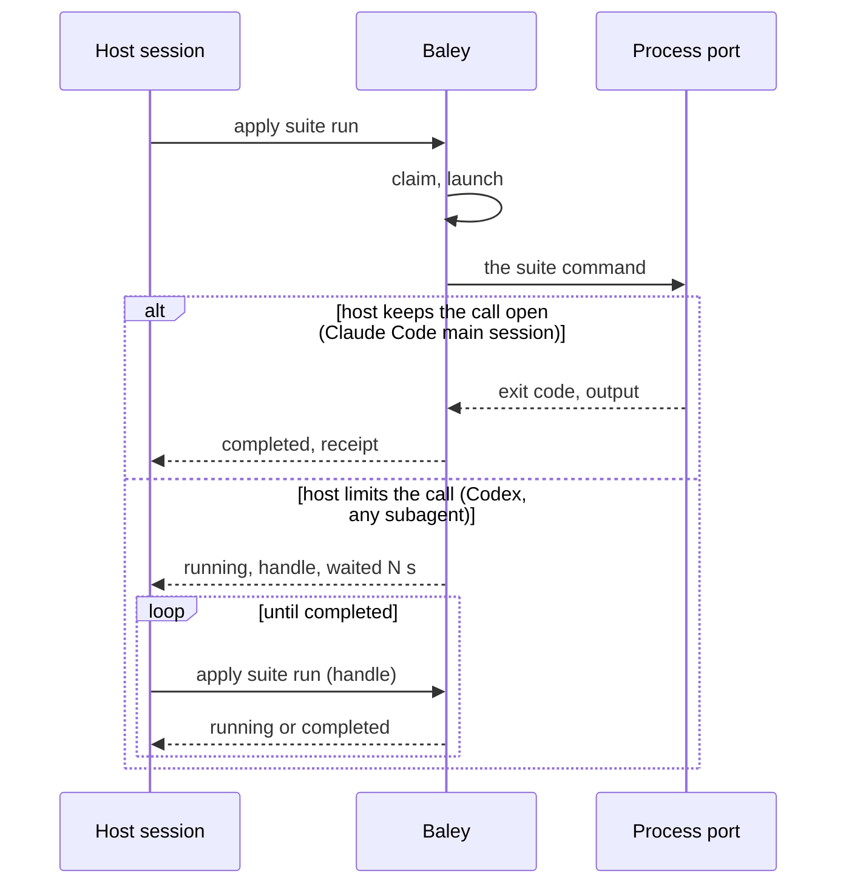
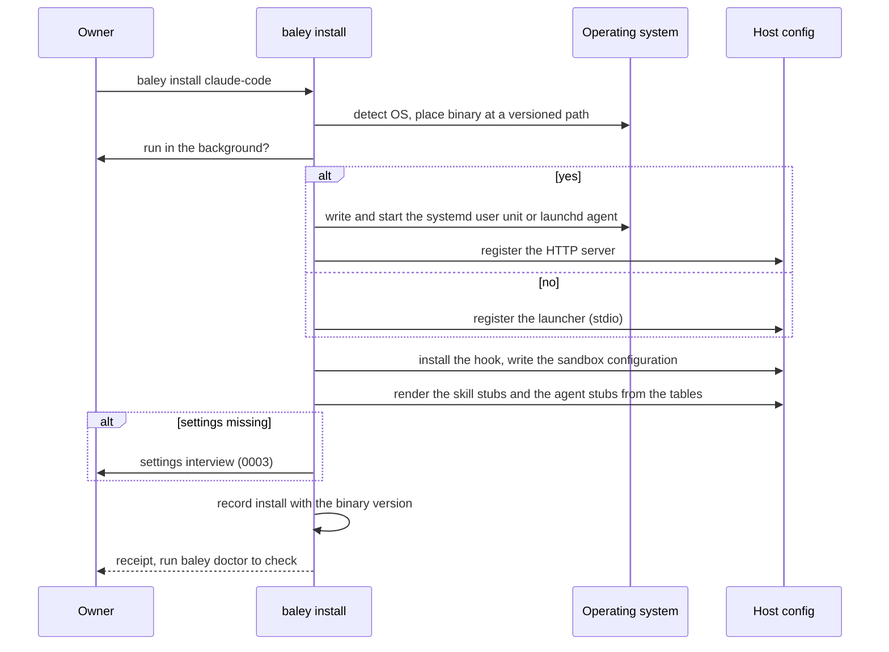

# 0012: Host interface

| | |
|---|---|
| Status | Draft |
| Design issue | none; build issues [#25](https://github.com/crenshawdev/baley/issues/25), [#127](https://github.com/crenshawdev/baley/issues/127), [#14](https://github.com/crenshawdev/baley/issues/14) (install) |
| Requirement prefix | HST |
| Applies | [0002: System design](0002-system-design.md) |
| Related | ADRs: [0008](../adr/0008-host-sandbox-isolation.md), [0009](../adr/0009-served-instructions.md), one shared server over stdio and HTTP [TARGET] · C4 view: components ([0002](0002-system-design.md) Figure 4) |

The current design of this area, and nothing else. Edit it in place when the design changes; git holds the history. It describes the design only, never the work still to do.

## 1. Purpose and scope

This area decides every way a host, a worker or the owner reaches Baley, and how Baley reaches back:

- the shared server: its transports, protocol revisions, the launcher and the background service;
- the host adapter: how Baley knows which host is connected and what that host can do;
- the wire: the tools, the operation contract, refusals, bounded reads by identity, long work;
- how Baley's questions reach the owner and how the owner's answers are recorded;
- served instructions and the stubs a host loads: skills and per-rung agent definitions, written at install;
- the command line;
- install and doctor: registration, hook, sandbox, stubs, service, on each host.

It does not decide the content of any instruction (each area owns its own), the settings ([0003](0003-configuration-and-routing.md)), the guard's decisions ([0010](0010-guard.md)), or how Baley's own binary is built, signed and fetched ([#14](https://github.com/crenshawdev/baley/issues/14)).

Hand-offs: every area's operations are served here; the work order composer ([0002](0002-system-design.md) section 8) hands this area the work orders to deliver; [0003](0003-configuration-and-routing.md) gives the route and the host alias tables; [0010](0010-guard.md) gives the hook's decisions; the ledger records every call's refusal or receipt.

In the component view of [0002](0002-system-design.md) (Figure 4) this area is the host interface component and the host adapter among the ports.

## 2. Terms

| Term | Meaning |
|---|---|
| Host | Claude Code or Codex: the program the owner works in, which launches workers and connects to Baley over MCP. |
| Session | One host conversation with its own MCP connection. |
| Worker | A subagent or exec process the host launches for one work order, with its own connection. |
| Server | The one Baley process per user that every session and worker connects to. |
| Launcher | The small stdio process a host starts when Baley is not run as a service; it starts the server if none runs, otherwise joins it, and relays the session's stdio to it. |
| Service | Baley run in the background by the operating system (a systemd user unit or a launchd agent), reached over HTTP. |
| Adapter | The per-host code that knows what a host can do and translates: how a work order is launched, how effort is passed, how a question reaches the owner, how a long call behaves, how an answer is shaped. |
| Client info | What a host sends when it connects: its name and version. |
| Operation | One typed request under the `query` or `apply` tool, named by a string that is only ever added, never renamed or removed. |
| Refusal | A typed answer that a request was not done, with a code and a place. |
| Identity | The name by which a record or an instruction is read: a kind plus keys, never a path. |
| Part | One bounded piece of a served record or instruction, at most 24,576 bytes, with the identity of the next part. |
| Work order | The complete dispatch for one worker ([0002](0002-system-design.md) section 8), read by id. |
| Stub | A file a host needs on disk to list or launch something, rendered by Baley at install from its tables: frontmatter and one line pointing at Baley. |
| Relay | The host session putting Baley's question to the owner and returning the answer. |
| Elicitation | The MCP request by which a server asks the host to show the person a form. |

## 3. Requirements

| Id | Rule | Why | Depends on | Status |
|---|---|---|---|---|
| HST-R1 | One Baley server per user serves every session and worker (SYS-R1). It listens on stdio through the launcher and on HTTP on a local port, and answers both MCP revisions 2025-11-25 and 2026-07-28 on each (SYS-R2). Baley advertises only the revisions it has been tested on. | Every connection reaches the same record, whichever way the host connects. | SYS-R1, SYS-R2 | Active |
| HST-R2 | `baley install` detects the operating system and asks whether Baley runs in the background. Yes: Baley writes, enables and starts its own systemd user unit (Linux) or launchd agent (macOS), and registers the host to connect over HTTP. No: Baley registers the host with the launcher over stdio. `baley service install`, `baley service remove` switch later. `baley doctor` reports which is in force and whether the server answers. | The owner chooses; Baley always knows how it was started. | SYS-R3 | Active |
| HST-R3 | The launcher starts the server when none runs and joins it otherwise, never a second one; a server started on demand exits after a quiet period with no session connected. The launcher passes the host's client info and the session's working directory to the server on every request. | One server in every case, and every request knows where it came from. | SYS-R4, CFG-R4 | Active |
| HST-R4 | Baley identifies the host and version from the client info on every connection and selects that host's adapter. An unknown host gets the floor adapter: stdio, wait-in-steps, relay, no rendered files. | The host that offers less sets the floor; a new host is a new adapter. | SYS-P8, SYS-P12 | Active |
| HST-R5 | Three tools: `baley_version`, `baley_query` and `baley_apply`. Every request names an `operation`; operation names are only ever added. The advertised input schema is a flat object; the full schema of each operation is served by the `schema` operation in parts. A refusal is a typed result with a code and a place, never a protocol error; a protocol error is reserved for a malformed frame or an unknown tool. | A small typed wire that both hosts load once and never see change. | SYS-P10 | Active |
| HST-R6 | Every record and every instruction is read by identity, in parts of at most 24,576 bytes, each naming the next part; nothing is sent twice and nothing is echoed back. Source code is never served: workers read it with the host's own tools. Tools are returned in a fixed order with cache hints. | Bounded reads, no scanning, no duplicate bytes in a context. | SYS-P10, ADR 0009 | Active |
| HST-R7 | Every call carries the caller's working directory; the server resolves the project from it (CFG-R4) and records the host, session, call id and, for a worker, its work order id with every write. Calls are served concurrently at the edge and decided on the core's worker pool with per-session bounded queues (SYS-R5). | A shared server serves many sessions safely and the record says who did what. | SYS-R5, CFG-R4 | Active |
| HST-R8 | Long work (a suite, a check, a landing step) is claimed and started, and the call answers when the host allows it: on a host that keeps a main-session call open past its foreground limit, the call returns on completion; everywhere else the call returns a handle and `still running` after a bounded wait, and the caller repeats the call with the handle until it completes. The adapter chooses; the work runs the same either way, and a handle survives a session's reconnect. | Hosts limit how long a tool call may run; the work must not. | SYS-R7 | Active |
| HST-R9 | Baley's questions to the owner are returned in the tool result as typed questions with their options; the host session puts them to the owner and returns the answer through the answering operation, deciding nothing itself. Where the adapter has proven elicitation reaches the person (a main session on either host), it may use it for the same questions with the same records. Every answer is recorded with `owner.name` and Baley's clock. | The owner answers, the session relays, the record holds the answer. | SYS-P5, CFG-R8 | Active |
| HST-R10 | The owner's identity on every approval is `owner.name` from the global settings, asked by the interview and defaulting to git `user.name`; the time is Baley's clock when the approval arrives. A session never supplies either. | One owner, one clock. | SYS-P5 | Active |
| HST-R11 | Every instruction a model sees is compiled into the binary and served by identity in parts; each carries a version and a hash, recorded with every work order and front-door call. There is no disk loader and no owner override. | One source of every instruction, provable after the fact. | SYS-P9, ADR 0009 | Active |
| HST-R12 | Each host loads only stubs, rendered by Baley at install from its tables into the host's user-level locations, never committed and never hand-edited (the guard denies the write): a skill stub per front door (frontmatter plus one line naming the operation that returns the instructions), and, on Claude Code, an agent definition stub per role and rung (frontmatter with model and effort plus one line pointing at Baley), because that host reads effort from the definition. Codex gets no agent files: the adapter passes the model and effort as launch flags. `baley install` rewrites the stubs on every upgrade; `baley doctor` checks them byte for byte against the binary. | Roles and rungs are Baley's tables; what a host needs on disk follows from them and cannot drift. | ADR 0009, CFG-R12, CFG-R15 | Active |
| HST-R13 | The server's MCP instructions field holds one line naming the `help` operation and nothing else. | Both hosts cut or hide it; the stubs carry the entry points. | | Active |
| HST-R14 | A work order is delivered as its id and route; the host session launches the worker Baley names with the agent stub (Claude Code) or the flags (Codex) and the one-line prompt naming the id; the worker reads its work order from Baley by id. The session changes nothing in it. | Baley hands the model everything; the session relays. | SYS-P2 | Active |
| HST-R15 | Provider calls (outside reviews, model detection is Baley's own) are made by the host session through `baley exec --key <provider> -- <command>`, which injects the key for that one process and replaces every occurrence of it in the process's output before returning. | Keys stay out of conversations and transcripts. | SYS-R11, CFG-R27 | Active |
| HST-R16 | The command line serves the owner: `baley init`, `project`, `story`, `sprint`, `plan`, `exec`, `verify`, `review`, `land`, `milestone`, `release`, `undo`, `pause`, `resume`, `stop`, `config`, `key`, `models`, `install`, `service`, `doctor`, `verify-ledger`, `backup`, `export`, `help`. Every command answers with a receipt or a refusal with a code; the same operations are reachable over MCP where a session needs them. There is no `serve` the owner runs by hand beyond `baley service`. | One way in for a person, the same rules as the wire. | | Active |
| HST-R17 | `baley install` on each host: places the binary, registers the MCP server (user level), installs the hook (Claude Code: `PreToolUse` for `Bash`, `Write`, `Edit`; Codex: `Bash`), writes the sandbox configuration that keeps agents out of Baley's home, renders the stubs, asks the service question, offers the settings interview when settings are missing, and records the install with the binary version. `baley doctor` re-checks every one of these and reports each with a fix. Neither host gets a session-start hook. | A machine is set up once, the same way, and can be checked. | SYS-R3, ADR 0008, ADR 0009, CFG-R11 | Active |
| HST-R18 | Every store failure behind a call is answered as a refusal with a code, never as an MCP error; refused `apply` calls are recorded, and a refusal that cannot be recorded is answered as a server failure, not a refusal. | The model self-corrects on a refusal; the record never lies about one. | SYS-P10, EVD-R26 | Active |
| HST-R19 | Frames are bounded (4 MiB raw, depth 128) before the protocol layer sees them; hook input is bounded (64 KiB); every child process runs with a deadline through the process port. | No caller can exhaust the server. | SYS-R5 | Active |
| HST-R20 | On Claude Code, the three tools are marked always-loaded so the main session and every subagent see them without a tool search; on Codex the same is requested where the host allows it. | Every capability reaches every agent. | SYS-P12 | Active |
| HST-R21 | MCP prompts are served on Claude Code as a second entry point for the front doors, listing the same commands the skill stubs list. | A host that lists prompts as commands gets them without a file. | HST-R12 | Backlog |
| HST-R22 | Skills over MCP (`io.modelcontextprotocol/skills`) replaces the skill stub files on a host that supports it. | The spec's own extension has ADR 0009's shape. | ADR 0009 | Backlog |

## 4. Roles and actors

| Actor | Receives | Returns | Model and effort from |
|---|---|---|---|
| Owner | The command line's receipts and refusals; questions relayed by the session | Commands; answers | Not applicable |
| Host session | Tool results; work orders to launch; questions to relay | Tool calls; launched workers; the owner's answers | Not applicable |
| Worker | Its work order by id; served instructions and records in parts | Typed results through `apply` | The route in its work order ([0003](0003-configuration-and-routing.md)) |
| Launcher | A host's stdio | The server's answers | Not applicable |
| Host adapter (port) | The client info; a work order; a question; a long call | The host-specific mechanism for each | Not applicable |
| Baley server | Every call | Results, parts, refusals | Not applicable |

## 5. Commands and operations

### baley_version (tool)

- **Inputs:** none.
- **Outputs:** binary version, protocol revisions served, host detected, transport.
- **Refusals:** none.

### baley_query (tool)

- **Inputs:** `operation` and its typed arguments; the caller's working directory; an optional `part`.
- **Outputs:** the operation's typed result, or one part with the next part's identity.
- **Refusals:** `unknown-operation`, `malformed-arguments` (naming the field), `not-a-project`, plus the operation's own codes.

Query operations are the reads of every area: `help`, `schema`, `document` (a record by identity: work order, plan, story, sprint, run, review, verification, roadmap row), `document-search`, `instruction` (an instruction by identity), `progress`, `next` ([0013](0013-next-action-and-progress.md)), `why`, `recall`, `search` ([0014](0014-support-families.md) [TARGET]), `route`, `status` operations per area.

### baley_apply (tool)

- **Inputs:** `operation`, a request id, its typed arguments, the caller's working directory.
- **Outputs:** the operation's typed receipt; a replay of the same request id returns the same receipt.
- **Refusals:** as `baley_query`, plus `request-id-reuse` (same id, different payload) and the operation's own codes.

Apply operations are the writes of every area, each named in its document: scope, story, sprint and plan operations (0004, 0005); execution operations (0006); verification operations (0007); review operations (0008); risk operations (0009); landing, milestone, release, undo, pause (0011); capture, task, debug, spike (0014); `answer` (the owner's answer to a relayed question); `worker-exit`; `round-record`.

### Long-call handle

- **Inputs:** an apply operation that starts long work; later, the same operation with the handle.
- **Outputs:** `completed` with the receipt, or `running` with the handle and how long the call waited.
- **Refusals:** `unknown-handle`, `handle-expired` (HST-R8).

### baley install, baley service, baley doctor

- **Inputs:** `install`: the host (`claude-code`, `codex`, or both); `service`: `install` or `remove`; `doctor`: the host.
- **Outputs:** `install`: what was placed, registered, rendered and asked, and the binary version recorded; `service`: the unit or agent written or removed; `doctor`: each check with its state and fix.
- **Refusals:** `unknown-host`, `not-writable` (a location Baley cannot write, named), `service-unsupported` (an operating system with neither systemd user units nor launchd) (HST-R2, HST-R17).

### baley exec

- **Inputs:** `--key <provider>`, `--`, the command.
- **Outputs:** the command's exit code and its output with the key replaced by `[baley:<provider>-key]`.
- **Refusals:** `no-such-key` (HST-R15).

## 6. Records

### install.recorded (event, per-user, `install` stream)

| Field | Type | Meaning |
|---|---|---|
| `host` | `claude-code`, `codex` | |
| `binary_version` | version | |
| `service` | `systemd`, `launchd`, `launcher` | How Baley starts |
| `transport` | `stdio`, `http` | |
| `registered` | table | Where the MCP registration and the hook were written |
| `stubs` | list | Path and hash of every stub rendered |
| `sandbox` | table | What was written and what `doctor` found |

### connection (not an event; a `session` view row)

Host, version, protocol revision, transport, working directory, session id, connected at, last call at.

### Per-call fields on every recorded event

`host`, `session`, `call_id`, `work_order` (for a worker), `instruction_hashes` (for a front-door or work-order call).

### long_call (table, not an event)

Handle, operation, request id, claim, started at, state, result reference.

### Views

| View | Key | Content |
|---|---|---|
| `session` | user | Connected sessions and workers with host, transport and directory |
| `install` | user, host | The current install record and the last doctor result |

## 7. States

*Figure 1. States of the server.*

*Figure 2. States of a long call.*

## 8. Workflows

*Figure 3. A session connecting through the launcher.*

*Figure 4. Delivering a work order and relaying a question.*

*Figure 5. A long call on each host.*

*Figure 6. Installing on a host.*

## 9. Settings

| Setting | Type | Default | Scope | Owner | Effect |
|---|---|---|---|---|---|
| `owner.name` | text | git `user.name` | global | 0012 | The owner recorded on every approval (HST-R10) |
| `[host.<name>]` sections | see [0003](0003-configuration-and-routing.md) | | both | 0003 | Per-host overrides the adapter applies |

The service choice, transport and port are recorded by install, not settings; `baley service` changes them.

## 10. Instructions served

| Instruction | Served to | Carries requirements |
|---|---|---|
| Skill stubs | Each host, on disk at install: per front door, frontmatter and one line: "call `baley_query` `instruction` with this identity and follow it" | HST-R12 |
| Agent stubs (Claude Code) | The host, on disk at install: per role and rung, frontmatter with model and effort and one line: "read your work order from Baley by the id in your prompt" | HST-R12 |
| Front-door instructions | The host session, by identity: what the command does, which operations it calls, that the owner approves and answers, that the session relays and adjudicates and never decides | HST-R9, HST-R14 |
| Read contract | Every worker and session, by identity: read records and instructions by identity in parts; read source with the host's tools; never search for instructions | HST-R6 |
| Help | The host session and the owner: the list of commands with one line each | HST-R13, HST-R16 |

The text of every instruction is owned by the area it serves; this area serves it.

## 11. Build status

The code today is the Cadence engine crate awaiting rename: one stdio server bound to one project per process, Claude Code only.

| Requirement | Status | Where |
|---|---|---|
| HST-R1, HST-R2, HST-R3 | Not built | `serve` binds one project per process on stdio (`crates/cadence/src/main.rs:92, 150-154`, `crates/cadence/src/server.rs:730-737`); no HTTP, no service, no launcher |
| HST-R4 | Not built | No adapter; the host model list is Claude-only (`crates/cadence/src/config/roles.rs:16`) |
| HST-R5 | Built, under the old names | Three tools (`crates/cadence/src/server.rs:890-909`), append-only operation names asserted (`server.rs:453-484`), flat schema plus `schema` operation (`server.rs:578-612, 689-728`) |
| HST-R6 | Built | Parts at 24,576 bytes (`crates/cadence/src/read/instructions.rs:5`, `server.rs:689`); `document` and `document-search` only (`server.rs:292-295`) |
| HST-R7 | Partly built | One admission queue serializes every call (`crates/cadence/src/review_ingress.rs:641-706`); no per-call working directory |
| HST-R8 | Not built | Suite runs inside one call; Codex registration sets a 7,200 s tool timeout (`.codex/config.toml`) |
| HST-R9, HST-R10 | Partly built | Owner questions are gate records answered by `execution-authorize` with any non-blank owner and time (`crates/cadence/src/execution_service.rs:246-300`) |
| HST-R11 | Built | Compiled instructions, no disk loader (`crates/cadence/src/plan/instructions.rs:12-16`, `crates/cadence/src/instruction_surfaces.rs:3-29`) |
| HST-R12 | Not built | `*-instructions` commands print full skills to stdout (`crates/cadence/src/main.rs:116-146`); no stub rendering, no install |
| HST-R13 | Not built | The full read contract is sent as instructions (`crates/cadence/src/server.rs:883-888`) |
| HST-R14 | Built | Dispatch answers id and route, never a prompt (`crates/cadence/src/execution/boundary.rs:76-124`) |
| HST-R15 | Not built | |
| HST-R16 | Not built | The CLI has `serve`, `guard`, `skill-description` and the render commands only (`crates/cadence/src/main.rs:27-87`) |
| HST-R17 | Not built | Registrations are hand-written (`.mcp.json`, `.codex/config.toml`, `hooks/hooks.json`) |
| HST-R18 | Partly built | Store failures are MCP errors (`crates/cadence/src/server.rs:813-823`); refused applies recorded best effort (`server.rs:1548-1554`) |
| HST-R19 | Built | `crates/cadence/src/review_ingress.rs:17-23`, `crates/cadence/src/guard/mod.rs:14`, `crates/cadence/src/process.rs:23-65` |
| HST-R20 | Not built | |

## 12. Open questions

| Question | Settled by |
|---|---|
| Whether Codex runs a hook before `apply_patch` | A probe on Codex when the hook is built; the answer is written into [0010](0010-guard.md) |
| Whether Codex connects reliably to a local HTTP MCP server (openai/codex#11284) | A test on Codex when the service transport is built |
| Whether elicitation reaches the person from a headless session on each host | A probe on both hosts before the adapter may choose it (HST-R9) |
| The report file formats Baley reads beside the exit code, per language | The process port's first languages, recorded in [0006](0006-execution.md) |
| Whether Codex offers an always-loaded tool marker | Checked against Codex when HST-R20 is built |
