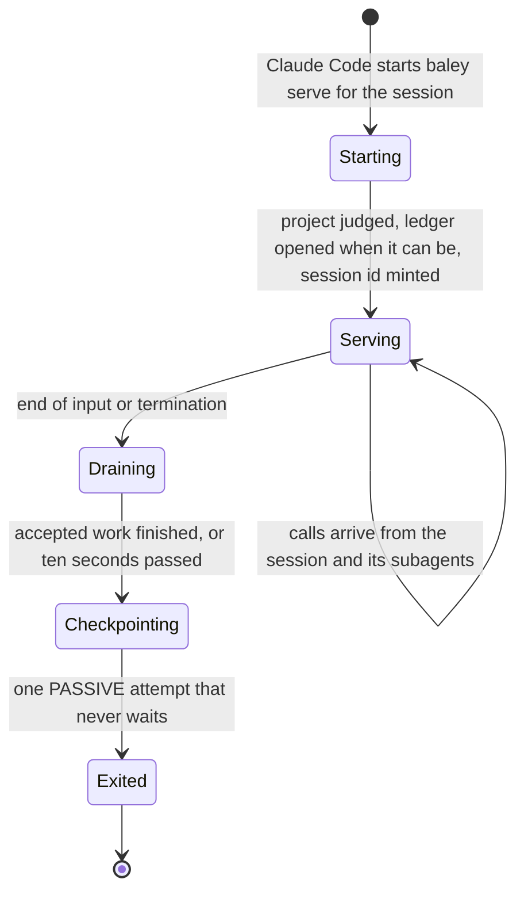
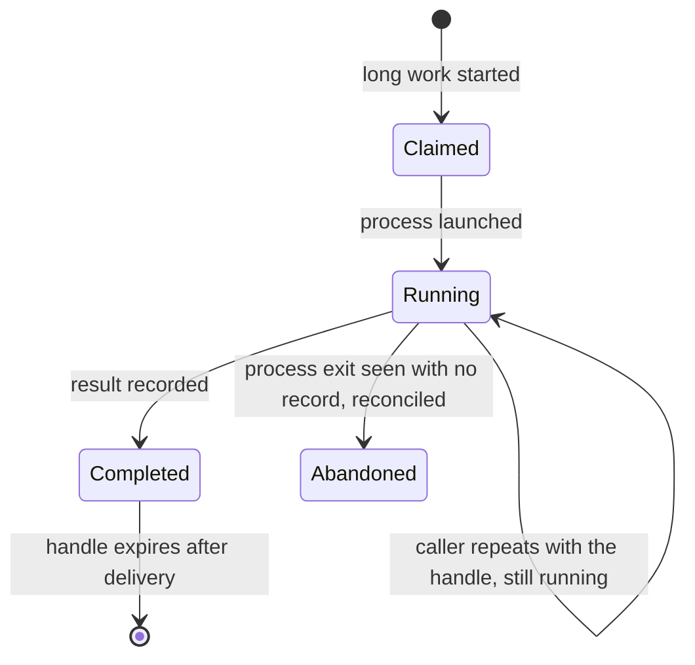
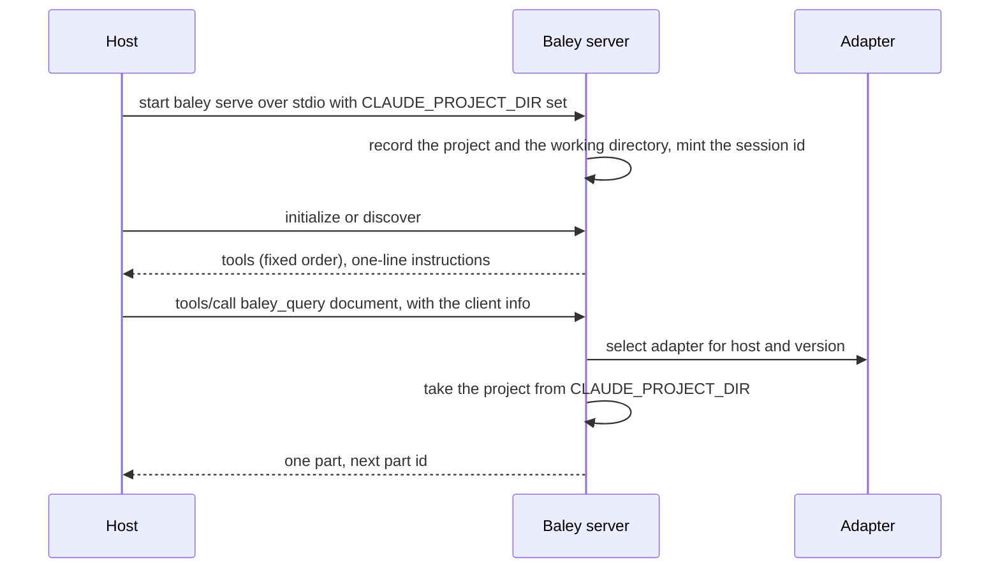
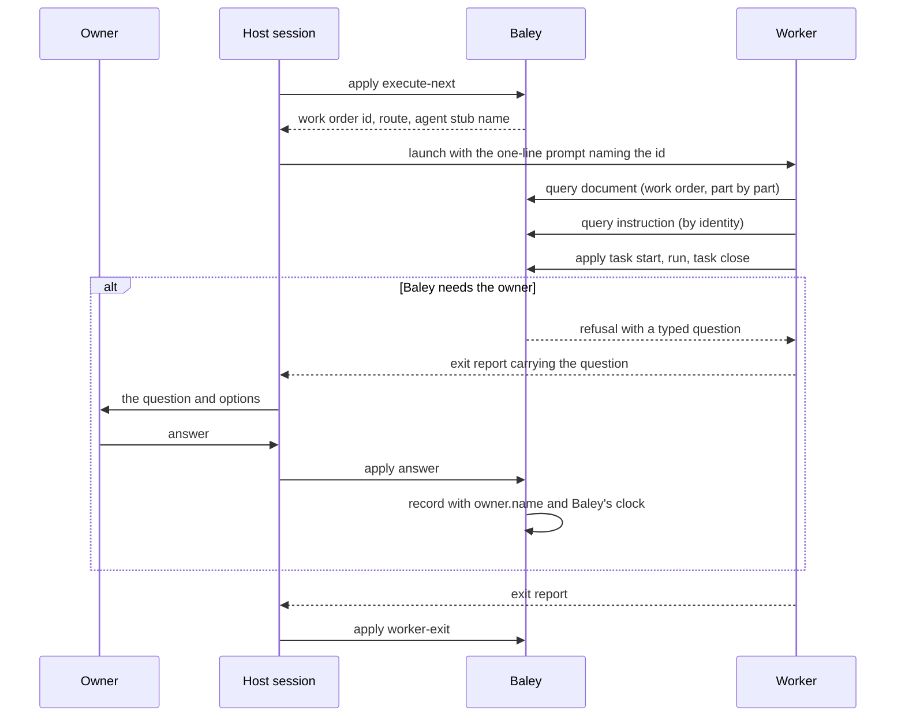
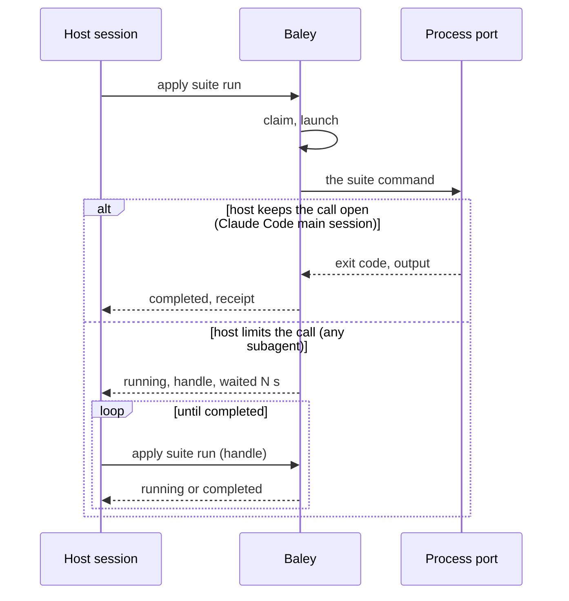
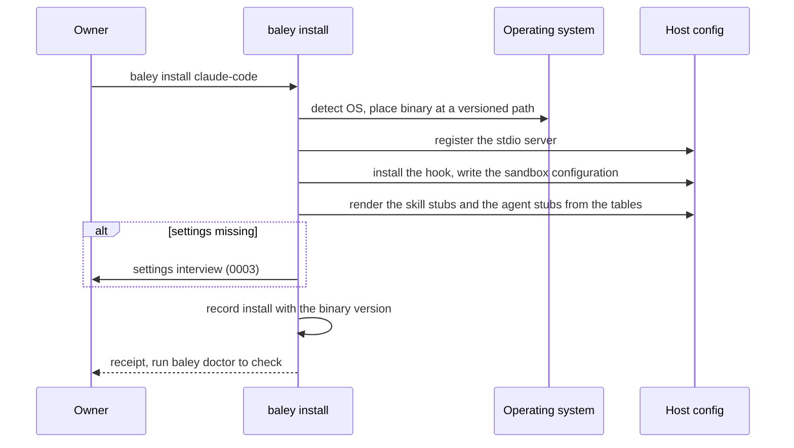

# 0012: Host interface

| | |
|---|---|
| Status | Accepted |
| Design issue | none; build issues [#25](https://github.com/crenshawdev/baley/issues/25), [#127](https://github.com/crenshawdev/baley/issues/127), [#14](https://github.com/crenshawdev/baley/issues/14) (install) |
| Requirement prefix | HST |
| Applies | [0002: System design](0002-system-design.md) |
| Related | ADRs: [0008](../adr/0008-host-sandbox-isolation.md), [0009](../adr/0009-served-instructions.md), [0011](../adr/0011-one-shared-server.md), [0012](../adr/0012-optimistic-concurrency.md), [0027](../adr/0027-vendor-folders-and-plain-keys.md), [0028](../adr/0028-one-http-stack.md), [0033](../adr/0033-host-security-bar.md), [0034](../adr/0034-one-server-per-session.md) · C4 view: components ([0002](0002-system-design.md) Figure 4) |

The current design of this area, and nothing else. Edit it in place when the design changes; git holds the history. It describes the design only, never the work still to do.

## 1. Purpose and scope

This area decides every way a host, a worker or the owner reaches Baley, and how Baley reaches back:

- the per-session server: its stdio connection, protocol revisions, the project it serves and the bounded queue its calls share;
- the host adapter: how Baley knows which host is connected and what that host can do;
- the wire: the tools, the operation contract, refusals, bounded reads by identity, long work;
- how Baley's questions reach the owner and how the owner's answers are recorded;
- served instructions and the stubs a host loads: skills and per-rung agent definitions, written at install;
- the command line;
- install and doctor: registration, hook, sandbox and stubs, on Claude Code.

It does not decide the content of any instruction (each area owns its own), the settings ([0003](0003-configuration-and-routing.md)), the guard's decisions ([0010](0010-guard.md)), or how Baley's own binary is built, signed and fetched ([#14](https://github.com/crenshawdev/baley/issues/14)).

Hand-offs: every area's operations are served here; the work order composer ([0002](0002-system-design.md) section 8) hands this area the work orders to deliver; [0003](0003-configuration-and-routing.md) gives the route and the host alias tables; [0010](0010-guard.md) gives the hook's decisions; the ledger records every call's refusal or receipt.

In the component view of [0002](0002-system-design.md) (Figure 4) this area is the host interface component and the host adapter among the ports.

## 2. Terms

| Term | Meaning |
|---|---|
| Host | Claude Code, the program the owner works in, whose session starts workers as subagents and connects to Baley over MCP. |
| Session | One host conversation, with its own Baley server over stdio. |
| Worker | A subagent the host session starts for one work order. It shares its session's connection. |
| Server | The Baley process a session starts: one per session, over stdio, serving the session and its subagents. |
| Adapter | The per-host code that knows what a host can do and translates: how a work order is launched, how effort is passed (the rung's own level, run at the model's highest supported level at or below it, HST-R12), how a question reaches the owner, how a long call behaves, how an answer is shaped. |
| Client info | What a host sends when it connects: its name and version. |
| Operation | One typed request under the `query` or `apply` tool, named by a string that is only ever added, never renamed or removed. |
| Refusal | A typed answer that a request was not done, with a code and a place. |
| Identity | The name by which a record or an instruction is read: a kind plus keys, never a path. |
| Part | One bounded piece of a served record or instruction, at most 24,576 bytes, with the identity of the next part. |
| Work order | The complete dispatch for one worker ([0002](0002-system-design.md) section 8), read by id. |
| Stub | A file a host needs on disk to list or launch something, rendered by Baley at install from its tables: frontmatter and one line pointing at Baley. |
| Relay | The host session putting Baley's question to the owner and returning the answer. |
| Elicitation | The MCP request by which a server asks the host to show the person a form. |

## 3. Requirements

| Id | Rule | Why | Depends on | Status |
|---|---|---|---|---|
| HST-R1 | Each Claude Code session starts its own Baley server over stdio, and that server serves the session and its subagents (SYS-R1). It answers MCP revisions 2025-11-25 and 2026-07-28 and advertises no other, since those are the two it has been tested on (SYS-R2). | Every session reaches the same record through the store, and the owner starts and keeps running nothing. | SYS-R1, SYS-R2 | Active |
| HST-R2 | `baley install` detects the operating system and asks whether Baley runs in the background. Yes: Baley writes, enables and starts its own systemd user unit (Linux) or launchd agent (macOS), and registers the host to connect over HTTP. No: Baley registers the host with the launcher over stdio. `baley service install`, `baley service remove` switch later. `baley doctor` reports which is in force and whether the server answers. | The owner chooses; Baley always knows how it was started. Withdrawn: Claude Code starts one stdio server per session, so there is nothing to choose (ADR 0034). | SYS-R3 | Withdrawn |
| HST-R3 | The launcher starts the server when none runs and joins it otherwise, never a second one; a server started on demand exits after a quiet period with no session connected. The launcher passes the host's client info and the session's working directory to the server on every request. | One server in every case, and every request knows where it came from. Withdrawn: a server's lifetime is its session's, and the project comes from the session's environment (ADR 0034). | SYS-R4, CFG-R4 | Withdrawn |
| HST-R4 | Baley identifies the host and version from the client info of each `tools/call` and selects that host's adapter. The info comes from `initialize` in a 2025-11-25 session and from the request's own `_meta` in a 2026-07-28 one, never from an earlier call. Negotiation, discover and `tools/list` serve any well-formed client. A `tools/call` from a missing or unsupported client, `baley_version` included, is answered `failed` with code `unknown-host` before any operation runs, carrying the client info reported, the supported host (`claude-code`) and `recorded: false`. It is never an initialize or protocol error, and an unsupported host is never served at a floor. The name is the client's own report, so the answer states what Baley supports and is no defence. | Baley supports a host only when it meets the security bar, and a new host is a new adapter and an ADR (ADR 0033). | SYS-P8, SYS-P12 | Active |
| HST-R5 | Three tools: `baley_version`, `baley_query` and `baley_apply`. Every request names an `operation`; operation names are only ever added. The advertised input schema is a flat object; the full schema of each operation is served by the `schema` operation in parts. A refusal is a typed result with a code and a place, never a protocol error. A server failure that records nothing is a typed `failed` result with a code, a place, `recorded: false` and `retryable`, and is not a refusal or a protocol error either. A protocol error is reserved for a malformed or oversized frame, a missing protocol-required metadata key or an unknown tool. | A small typed wire that the host loads once and never sees change. | SYS-P10 | Active |
| HST-R6 | Every record and every instruction is read by identity, in parts of at most 24,576 bytes, each naming the next part; nothing is sent twice and nothing is echoed back. Source code is never served: workers read it with the host's own tools. Tools are returned in a fixed order with cache hints. | Bounded reads, no scanning, no duplicate bytes in a context. | SYS-P10, ADR 0009 | Active |
| HST-R7 | The project comes from the session's `CLAUDE_PROJECT_DIR`, which the server reads once when it starts (CFG-R4), and no call argument selects it. The server records the working directory it started in beside the project, and a directory that differs from the project is valid. It records with every write the caller value of [design 0001's event envelope](0001-evidence-ledger.md#events): the host, the Baley session the server minted, the call identity and its source, the client version and the host's own session when the host supplies them and, for a worker, its work order id. The `tools/call` decisions run one at a time on the server's own worker, behind one bounded queue that the session and its subagents share: one call running, four waiting and 16 MiB of raw frame bytes among them. A call past either bound is answered `failed` with code `server-overloaded`, which is retryable, before anything is prepared (SYS-R5). | Every call is tied to its project and session without asking the host for more, and the record says who did what. | SYS-R5, CFG-R4 | Active |
| HST-R8 | Long work (a suite, a check, a landing step) is claimed and started, and the call answers when the host allows it: on a host that keeps a main-session call open past its foreground limit, the call returns on completion; everywhere else the call returns a handle and `still running` after a bounded wait, and the caller repeats the call with the handle until it completes. The adapter chooses; the work runs the same either way, and a handle survives a session's reconnect. | Hosts limit how long a tool call may run; the work must not. | SYS-R7 | Active |
| HST-R9 | Baley's questions to the owner are returned in the tool result as typed questions with their options; the host session puts them to the owner and returns the answer through the answering operation, deciding nothing itself. Where the adapter has proven elicitation reaches the person (a main session on Claude Code), it may use it for the same questions with the same records. Every answer is recorded with `owner.name` and Baley's clock. | The owner answers, the session relays, the record holds the answer. | SYS-P5, CFG-R8 | Active |
| HST-R10 | The owner's identity on every approval is `owner.name` from the global settings, asked by the interview and defaulting to git `user.name`; the time is Baley's clock when the approval arrives. A session never supplies either. | One owner, one clock. | SYS-P5 | Active |
| HST-R11 | Every instruction a model sees is compiled into the binary and served by identity in parts; each carries a version and a hash, recorded as instruction evidence in the caller of every event a work-order or front-door call appends. There is no disk loader and no owner override. | One source of every instruction, provable after the fact. | SYS-P9, ADR 0009 | Active |
| HST-R12 | Claude Code loads only stubs, rendered by Baley at install from its tables into its user-level locations, never committed and never hand-edited (the guard denies the write): a skill stub per front door (frontmatter plus one line naming the operation that returns the instructions), and an agent definition stub per role and rung (frontmatter with model and effort plus one line pointing at Baley), because the host reads effort from the definition. A rung's stub carries that rung's own effort level, since Claude Code's map is the identity map (CFG-R15). Support depends on the model: Claude Code runs a level a model does not support as the highest supported level at or below it (Opus and Sonnet 4.6 have no `xhigh`), and a model without effort (Haiku) gets none, recorded as not applicable and never a made-up level. The work order's route records the requested rung and the effective level apart (CFG-R17), from a dated per-model table of supported levels whose source is Claude Code's model configuration documentation (https://code.claude.com/docs/en/model-config#adjust-effort-level). An alias not yet resolved, or a host cap on effort, stays recorded as unknown until observed. `RungMap` is unchanged. Build 4's first dispatch task builds the table and the records, and the owner reviews the initial table in its pull request. `baley install` rewrites the stubs on every upgrade; `baley doctor` checks them byte for byte against the binary. | Roles and rungs are Baley's tables; what a host needs on disk follows from them and cannot drift. | ADR 0009, CFG-R12, CFG-R15, CFG-R17 | Active |
| HST-R13 | The server's MCP instructions field holds one line naming the `help` operation and nothing else. | Claude Code cuts or hides it; the stubs carry the entry points. | | Active |
| HST-R14 | A work order is delivered as its id and route; the host session launches the worker Baley names with the agent stub and the one-line prompt naming the id; the worker reads its work order from Baley by id. The session changes nothing in it. | Baley hands the model everything; the session relays. | SYS-P2 | Active |
| HST-R15 | Provider calls (outside reviews, model detection is Baley's own) are made by the host session through `baley exec --key <NAME> -- <command>`. `NAME` is the key's name exactly as written in `keys.env`; Baley sets the key under that same name in that one process's environment and replaces every occurrence of it in the process's output before returning. | Keys stay out of conversations and transcripts. | SYS-R11, CFG-R27 | Active |
| HST-R16 | The command line serves the owner: `baley init`, `project`, `scope`, `story`, `backlog`, `phase`, `plan`, `exec`, `verify`, `review`, `land`, `milestone`, `release`, `undo`, `pause`, `resume`, `stop`, `config`, `models`, `install`, `doctor`, `verify-ledger`, `export`, `help`. Every command answers with a receipt or a refusal with a code; the same operations are reachable over MCP where a session needs them. The owner never starts `serve`: Claude Code does, once per session. | One way in for a person, the same rules as the wire. | | Active |
| HST-R17 | `baley install` on Claude Code places the binary, registers the MCP server (user level), installs the hook with the nine-tool matcher of GRD-R1, writes the sandbox configuration (`denyRead` and `denyWrite` over Baley's home and its config folder, `failIfUnavailable` true, `allowUnsandboxedCommands` false) and `Read` and `Edit` deny rules over both, renders the stubs, offers the settings interview when settings are missing, and records the install with the binary version. `baley doctor` re-checks every one of these and reports each with a fix. Claude Code gets no session-start hook. How Baley is delivered and who writes these files wait on the owner's delivery decision (the roadmap's held Build 3 tasks), while their content is rendered in Build 3. | A machine is set up once, the same way, and can be checked. | ADR 0008, ADR 0009, ADR 0033, CFG-R11 | Active |
| HST-R18 | Every store failure behind a call is answered as a refusal with a code, never as an MCP error; refused `apply` calls are recorded, and a refusal that cannot be recorded is answered as a server failure, not a refusal. | The model self-corrects on a refusal; the record never lies about one. | SYS-P10, EVD-R26 | Active |
| HST-R19 | Frames are bounded (4 MiB raw for the whole frame, depth 128) before the protocol layer sees them. A frame over either bound is discarded to its newline and answered with a JSON-RPC error, and the connection keeps serving. Hook input is bounded (64 KiB); every child process Baley starts for its own work runs with a deadline through the process port; a command run through `baley exec` runs until it ends. | No caller can exhaust the server. | SYS-R5 | Active |
| HST-R20 | On Claude Code, each of the three tool descriptors carries `_meta["anthropic/alwaysLoad"]: true`, so the main session and every subagent see the tools without a tool search, whatever the registration says. | Every capability reaches every agent. | SYS-P12 | Active |
| HST-R21 | MCP prompts are served on Claude Code as a second entry point for the front doors, listing the same commands the skill stubs list. | A host that lists prompts as commands gets them without a file. | HST-R12 | Backlog |
| HST-R22 | Skills over MCP (`io.modelcontextprotocol/skills`) replaces the skill stub files on a host that supports it. | The spec's own extension has ADR 0009's shape. | ADR 0009 | Backlog |

## 4. Roles and actors

| Actor | Receives | Returns | Model and effort from |
|---|---|---|---|
| Owner | The command line's receipts and refusals; questions relayed by the session | Commands; answers | Not applicable |
| Host session | Tool results; work orders to launch; questions to relay | Tool calls; launched workers; the owner's answers | Not applicable |
| Worker | Its work order by id; served instructions and records in parts | Typed results through `apply` | The route in its work order ([0003](0003-configuration-and-routing.md)): the rung's own effort level, recorded apart from the level the model runs at (HST-R12) |
| Host adapter (port) | The client info; a work order; a question; a long call | The host-specific mechanism for each | Not applicable |
| Baley server | Its session's calls, from the session and its subagents | Results, parts, refusals and `failed` answers | Not applicable |

## 5. Commands and operations

### baley_version (tool)

- **Inputs:** none.
- **Outputs:** `version`, `os` and `arch` of the running binary.
- **Refusals:** `unknown-host`, a `failed` answer for a client that is missing or unsupported (HST-R4), and `invalid-arguments` for any argument.

### baley_query (tool)

- **Inputs:** `operation` and its typed arguments; an optional `part`.
- **Outputs:** the operation's typed result, or one part with the next part's identity.
- **Refusals:** `unknown-operation`, `malformed-arguments` (naming the field), `not-a-project`, plus the operation's own codes.

Query operations are the reads of every area: `help`, `schema`, `document` (a record by identity: work order, plan, story, phase, run, review, verification, roadmap row), `document-search`, `instruction` (an instruction by identity), `progress`, `next` ([0013](0013-next-action-and-progress.md)), `why`, `recall`, `search` ([0014](0014-support-families.md)), `route`, `status` operations per area.

### baley_apply (tool)

- **Inputs:** `operation`, a request id, its typed arguments.
- **Outputs:** the operation's typed receipt; a replay of the same request id returns the same receipt.
- **Refusals:** as `baley_query`, plus `request-id-reuse` (same id, different payload) and the operation's own codes.

Apply operations are the writes of every area, each named in its document: scope, story, phase and plan operations (0004, 0005); execution operations (0006); verification operations (0007); review operations (0008); risk operations (0009); landing, milestone, release, undo, pause (0011); capture, task, debug, spike (0014); `answer` (the owner's answer to a relayed question); `worker-exit`; `round-record`.

### Long-call handle

- **Inputs:** an apply operation that starts long work; later, the same operation with the handle.
- **Outputs:** `completed` with the receipt, or `running` with the handle and how long the call waited.
- **Refusals:** `unknown-handle`, `handle-expired` (HST-R8).

### baley install, baley doctor

- **Inputs:** `install`: the host (`claude-code`); `doctor`: the host.
- **Outputs:** `install`: what was placed, registered, rendered and asked, and the binary version recorded; `doctor`: each check with its state and fix.
- **Refusals:** `unknown-host`, `not-writable` (a location Baley cannot write, named) (HST-R17).

### baley exec

- **Inputs:** `--key <NAME>`, once, the key's name exactly as written in `keys.env`; `--`; the command and its arguments, passed on unchanged. The command reads Baley's stdin.
- **Outputs:** the command's stdout and stderr, each with every occurrence of the key's exact bytes replaced by `[baley:<NAME>]`, for example `[baley:OPENAI_API_KEY]`, passed on as they arrive, except that the latest output, up to the key's length, waits until more arrives or the stream ends. The command's stdout and stderr are pipes, not the terminal. The key is set under `NAME` in the command's environment only. There is no time limit and no process group of the command's own. The exit code is the command's, or 128 plus the number of the signal that ended it. Nothing is recorded: `baley exec` opens no ledger and creates no folder or file. An encoded copy of the key (for example base64) is not replaced.
- **Refusals:** each on stderr as `baley: <code>: ...`, exit 2, before the command runs: `baley-home-invalid` and `user-home-invalid` when Baley's folders cannot be resolved ([0001](0001-evidence-ledger.md)); `keys-file-exposed` (naming the file and the `chmod 600` or `chown` fix); `keys-file-invalid` when a line is not a valid key line, a value is empty or a name appears twice (naming each line by number); `keys-file-unreadable` when the path is not a regular file or cannot be read (naming the file and the cause); `no-such-key` when `keys.env` has no line with that name (HST-R15); `command-not-started` when the command cannot be started (naming it and the cause). A missing `--key`, `--` or command is a usage error, exit 2. When waiting for the command fails, or the command's output cannot be passed on for a reason other than the reader closing Baley's output, Baley says so on stderr and exits 3.

## 6. Records

### install.recorded (event, per-user, `install` stream)

| Field | Type | Meaning |
|---|---|---|
| `host` | `claude-code` | |
| `binary_version` | version | |
| `registered` | table | Where the MCP registration and the hook were written |
| `stubs` | list | Path and hash of every stub rendered |
| `sandbox` | table | What was written and what `doctor` found |

### The caller on every recorded event

Every event a call records carries one `caller` in its envelope, hashed with the event. [Design 0001's Events table](0001-evidence-ledger.md#events) holds the exact keys, values and limits. The caller has two forms.

- The server form is what the server records for a request. It holds the project directory, the working directory, the host, the Baley session the server minted, and the call identity: the request's JSON-RPC id, with its source. It may also hold the client version, the host's own session id, a work order id and instruction evidence.
- The hook form is what the guard hook records for a tool call. It holds the host, the working directory and the call identity: Claude Code's tool-use id, with its source. It may also hold the project directory, the host's own session id, a work order id and instruction evidence. It has no Baley session, so a hook cannot claim one.

Instruction evidence is a list of entries, each an instruction's identity, version and hash. Every text is checked when the caller is built and again when it is read back, and each has a byte limit. A command-line command and a reconciliation have no caller: the envelope has no `caller` key, and a caller is never `null`. No caller enters a request digest or request key, so a replay records nothing and the original caller stays on the event the request first produced. No call fills a caller yet ([section 11](#11-build-status)).

### long_call (table, not an event)

Handle, operation, request id, claim, started at, state, result reference.

### Views

| View | Key | Content |
|---|---|---|
| `install` | user, host | The current install record and the last doctor result |

## 7. States

```mermaid
stateDiagram-v2
  [*] --> Starting: Claude Code starts baley serve for the session
  Starting --> Serving: project judged, ledger opened when it can be, session id minted
  Serving --> Serving: calls arrive from the session and its subagents
  Serving --> Draining: end of input or termination
  Draining --> Checkpointing: accepted work finished, or ten seconds passed
  Checkpointing --> Exited: one PASSIVE attempt that never waits
  Exited --> [*]
```

*Figure 1. States of a session's server. Nothing checkpoints and no timer runs while the connection is open: the server ends only when its input ends or it is told to terminate.*

```mermaid
stateDiagram-v2
  [*] --> Claimed: long work started
  Claimed --> Running: process launched
  Running --> Completed: result recorded
  Running --> Running: caller repeats with the handle, still running
  Running --> Abandoned: process exit seen with no record, reconciled
  Completed --> [*]: handle expires after delivery
```

*Figure 2. States of a long call.*

## 8. Workflows

```mermaid
sequenceDiagram
  participant H as Host
  participant S as Baley server
  participant A as Adapter
  H->>S: start baley serve over stdio with CLAUDE_PROJECT_DIR set
  S->>S: record the project and the working directory, mint the session id
  H->>S: initialize or discover
  S-->>H: tools (fixed order), one-line instructions
  H->>S: tools/call baley_query document, with the client info
  S->>A: select adapter for host and version
  S->>S: take the project from CLAUDE_PROJECT_DIR
  S-->>H: one part, next part id
```

*Figure 3. A session starting its server and making a call.*

```mermaid
sequenceDiagram
  participant O as Owner
  participant H as Host session
  participant S as Baley
  participant W as Worker
  H->>S: apply execute-next
  S-->>H: work order id, route, agent stub name
  H->>W: launch with the one-line prompt naming the id
  W->>S: query document (work order, part by part)
  W->>S: query instruction (by identity)
  W->>S: apply task start, run, task close
  alt Baley needs the owner
    S-->>W: refusal with a typed question
    W-->>H: exit report carrying the question
    H->>O: the question and options
    O->>H: answer
    H->>S: apply answer
    S->>S: record with owner.name and Baley's clock
  end
  W-->>H: exit report
  H->>S: apply worker-exit
```

*Figure 4. Delivering a work order and relaying a question.*

```mermaid
sequenceDiagram
  participant H as Host session
  participant S as Baley
  participant P as Process port
  H->>S: apply suite run
  S->>S: claim, launch
  S->>P: the suite command
  alt host keeps the call open (Claude Code main session)
    P-->>S: exit code, output
    S-->>H: completed, receipt
  else host limits the call (any subagent)
    S-->>H: running, handle, waited N s
    loop until completed
      H->>S: apply suite run (handle)
      S-->>H: running or completed
    end
  end
```

*Figure 5. A long call.*

```mermaid
sequenceDiagram
  participant O as Owner
  participant B as baley install
  participant OS as Operating system
  participant HC as Host config
  O->>B: baley install claude-code
  B->>OS: detect OS, place binary at a versioned path
  B->>HC: register the stdio server
  B->>HC: install the hook, write the sandbox configuration
  B->>HC: render the skill stubs and the agent stubs from the tables
  alt settings missing
    B->>O: settings interview (0003)
  end
  B->>B: record install with the binary version
  B-->>O: receipt, run baley doctor to check
```

*Figure 6. Installing on a host.*

## 9. Settings

| Setting | Type | Default | Scope | Owner | Effect |
|---|---|---|---|---|---|
| `owner.name` | text | git `user.name` | global | 0012 | The owner recorded on every approval (HST-R10) |
| `[host.<name>]` sections | see [0003](0003-configuration-and-routing.md) | | both | 0003 | Per-host overrides the adapter applies |

## 10. Instructions served

| Instruction | Served to | Carries requirements |
|---|---|---|
| Skill stubs | The host, on disk at install: per front door, frontmatter and one line: "call `baley_query` `instruction` with this identity and follow it" | HST-R12 |
| Agent stubs (Claude Code) | The host, on disk at install: per role and rung, frontmatter with the model and the rung's own effort level, and one line: "read your work order from Baley by the id in your prompt" | HST-R12 |
| Front-door instructions | The host session, by identity: what the command does, which operations it calls, that the owner approves and answers, that the session relays and adjudicates and never decides | HST-R9, HST-R14 |
| Read contract | Every worker and session, by identity: read records and instructions by identity in parts; read source with the host's tools; never search for instructions | HST-R6 |
| Help | The host session and the owner: the list of commands with one line each | HST-R13, HST-R16 |

The text of every instruction is owned by the area it serves; this area serves it.

## 11. Build status

The library holds the per-session server (`crates/baley/src/mcp/`), and `baley serve` starts it. The binary also holds the inherited engine, parked for Build 9 to delete (`crates/baley/src/inherited.rs:1-4`). Nothing in production reaches it, and its tests still run.

| Requirement | Status | Where |
|---|---|---|
| HST-R1 | Built | `baley serve` runs one stdio server for the session (`crates/baley/src/main.rs:61-62, 187-200`, `crates/baley/src/mcp/serve.rs:123-201`), and it advertises only the two tested revisions (`crates/baley/src/mcp/tools.rs:65-68`, `crates/baley/src/mcp/handler.rs:118-120`) |
| HST-R2, HST-R3 | Withdrawn | Nothing to build: each session starts its own stdio server (ADR 0034) |
| HST-R4 | Built | The 2025 decoder reads `initialize` and the 2026 decoder reads the request's `_meta` (`crates/baley/src/mcp/client.rs:24-40`). The host is selected per call (`crates/baley/src/mcp/client.rs:95-126`, `crates/baley/src/mcp/handler.rs:54-79, 122-130`), and a missing or unsupported client is answered `failed` `unknown-host` before the queue (`crates/baley/src/mcp/gate.rs:71-110, 162-178`). The supported hosts are `Host::ALL` (`crates/baley-core/src/policy/schema.rs:108`) |
| HST-R5 | Built | Three tools in a fixed order (`crates/baley/src/mcp/tools.rs:83-120`), append-only operation names asserted (`crates/baley/src/mcp/operations.rs:391-503, 516-520`), a flat schema plus the `schema` operation (`crates/baley/src/mcp/tools.rs:122-141`, `crates/baley/src/mcp/operations.rs:314-386`), and `failed` as its own arm of the envelope (`crates/baley/src/envelope.rs:80-139`). The gate raises a protocol error only for an unknown tool (`crates/baley/src/mcp/gate.rs:77, 153-160`) |
| HST-R6 | Partly built | Parts at 24,576 bytes (`crates/baley/src/read/instructions.rs:5-7`, `crates/baley/src/mcp/operations.rs:296-297, 359-386`), `help` and `schema` answer (`crates/baley/src/mcp/operations.rs:305-347`), and the tools carry a fixed order and cache hints (`crates/baley/src/mcp/tools.rs:70-81`). `document` and `document-search` answer `operation-unavailable` with the build that replaces them (`crates/baley/src/mcp/operations.rs:98-99, 263-275`) until the served reads are rebuilt (T7) |
| HST-R7 | Partly built | The session context is gathered once and judged (`crates/baley/src/mcp/context.rs:20-50, 127-158`), each call's context and caller are formed (`crates/baley/src/mcp/context.rs:213-237, 286-314`), and decisions run one at a time on the worker behind one queue (`crates/baley/src/mcp/queue.rs:15-93`, `crates/baley/src/mcp/worker.rs:80-171`, `crates/baley/src/mcp/admission.rs:28-59`). The port holds the caller value (`crates/baley-store/src/caller.rs:569-576`), `Work::push` stamps the command's caller on every event it appends (`crates/baley-store-sqlite/src/transact.rs:851-885`) and the `event.caller` column stores it (`crates/baley-store-sqlite/src/schema.rs:51`). No call records a caller yet: `run_decision` forms it and sets it aside (`crates/baley/src/mcp/handler.rs:82-98`) until per-request preparation (T5), and captures (T8) and the guard's records (T10) fill the other forms |
| HST-R8 | Not built | Suite runs inside one call |
| HST-R9, HST-R10 | Not built | The parked engine holds owner questions as gate records answered by `execution-authorize` with any non-blank owner and time (`crates/baley/src/execution_service.rs:364-500`). The session server answers that operation as unavailable (`crates/baley/src/mcp/operations.rs:128-195`) until Build 5 |
| HST-R11 | Partly built | Compiled instructions, no disk loader (`crates/baley/src/plan/instructions.rs:12-16`, `crates/baley/src/instruction_surfaces.rs:3-41`). The caller has a place for each instruction's identity, version and hash (`crates/baley-store/src/caller.rs:273-298`), and no call fills it until the compiled instruction identities (T7) and per-request preparation (T5) land |
| HST-R12 | Not built | `*-instructions` commands print full skills to stdout (`crates/baley/src/main.rs:139-176`), with no stub rendering and no install. The effort table and the requested and effective records are Build 4's first dispatch task |
| HST-R13 | Built | The initialize instructions are one line naming `help` (`crates/baley/src/mcp/tools.rs:52-63`, asserted at `crates/baley/src/mcp/tools.rs:226-232`) |
| HST-R14 | Not built | The parked engine builds a dispatch answer of an id and a route, never a prompt (`crates/baley/src/execution/boundary.rs:93-147`). The session server answers `execute-next` as unavailable (`crates/baley/src/mcp/operations.rs:112`) until Build 5 |
| HST-R15 | Partly built | `baley exec` sets the key in the command's environment and redacts both streams (`crates/baley/src/exec.rs:87-203`, `crates/baley/src/process.rs:125-131, 283-302` for `owner_command` and `stdio_plan`). The parked review engine still makes provider calls with keys it reads itself (`crates/baley/src/review/provider/credentials.rs:52-112`) until Build 4 moves outside calls to the host session. |
| HST-R16 | Partly built | The CLI has `serve`, which Claude Code starts and the owner does not, `guard`, `skill-description`, the render commands, the ledger commands (`verify`, `doctor`, `export`, `purge`, `scrub`, `rebuild`, `anchor`, `acknowledge-restore`), `exec`, `init`, `config` (`show`, `set` and `interview`) and `models` (`list`, `add`, `remove` and `update`) (`crates/baley/src/main.rs:24-95`). It has no `service` command, and the other commands are later builds. |
| HST-R17 | Not built | The tracked `hooks/hooks.json` is hand-written, and the remaining registrations are hand-written in owner-local files outside the repository's tracked content |
| HST-R18 | Partly built | The `failed` answer is built: a code, a place, `recorded: false` and `retryable`, returned as a successful tool result (`crates/baley/src/envelope.rs:80-139`, `crates/baley/src/mcp/gate.rs:66-69`). The server uses it for `unknown-host` (`crates/baley/src/mcp/gate.rs:162-178`), `server-overloaded` (`crates/baley/src/mcp/admission.rs:50-59`) and the project and caller faults (`crates/baley/src/mcp/gate.rs:112-151`). No operation reaches the store yet, so no store failure is answered and no refused apply is recorded until per-request preparation (T5) |
| HST-R19 | Partly built | The decoder bounds a whole frame at 4 MiB and its depth at 128 (`crates/baley/src/mcp/frame.rs:14-18, 143`). A frame over a bound or not JSON is discarded to its newline and answered with a JSON-RPC error while reading goes on (`crates/baley/src/mcp/frame.rs:470-493`, `crates/baley/src/mcp/transport.rs:52-73, 218-247`). Hook input is bounded (`crates/baley/src/guard/mod.rs:15`). Every git child runs with its registered deadline, enforced by `validate_launch` (`crates/baley/src/process.rs:218-249`, `crates/baley/src/git_process.rs`). The suite runner's `sh -c` (`crates/baley/src/execution/runner.rs`) runs with none, owned by Build 5, and a command under `baley exec` runs with none by design. |
| HST-R20 | Built | Each descriptor carries the marker (`crates/baley/src/mcp/tools.rs:83-120`, asserted at `crates/baley/src/mcp/tools.rs:186-196`) |

## 12. Open questions

| Question | Settled by |
|---|---|
| Whether elicitation reaches the person from a subagent on Claude Code | A probe on Claude Code before the adapter may choose it (HST-R9) |
| The report file formats Baley reads beside the exit code, per language | The process port's first languages, recorded in [0006](0006-execution.md) |
