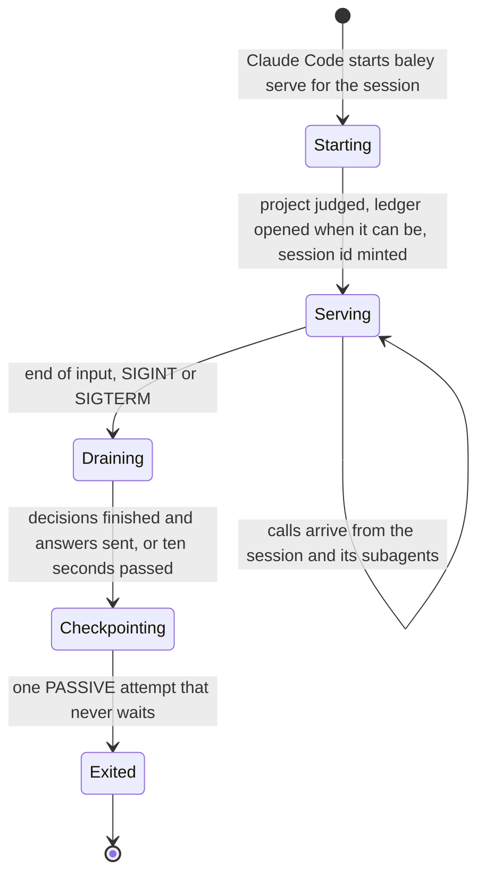
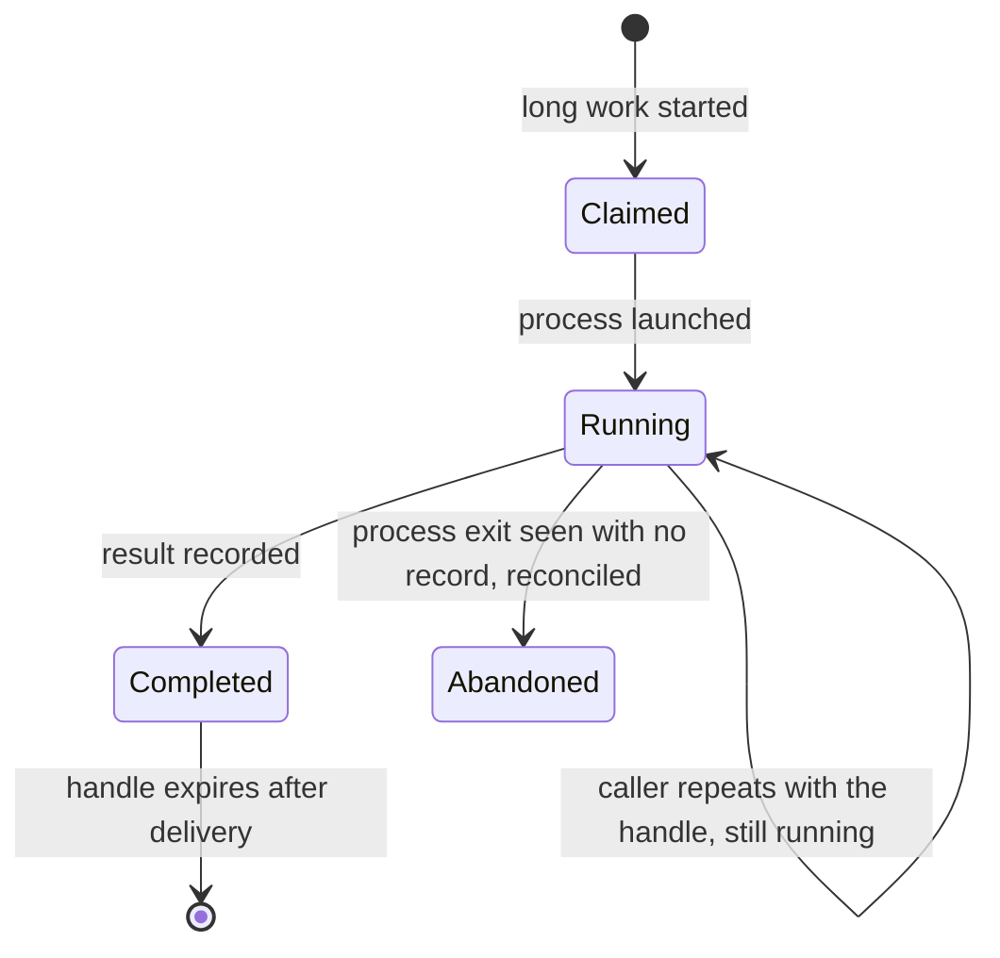
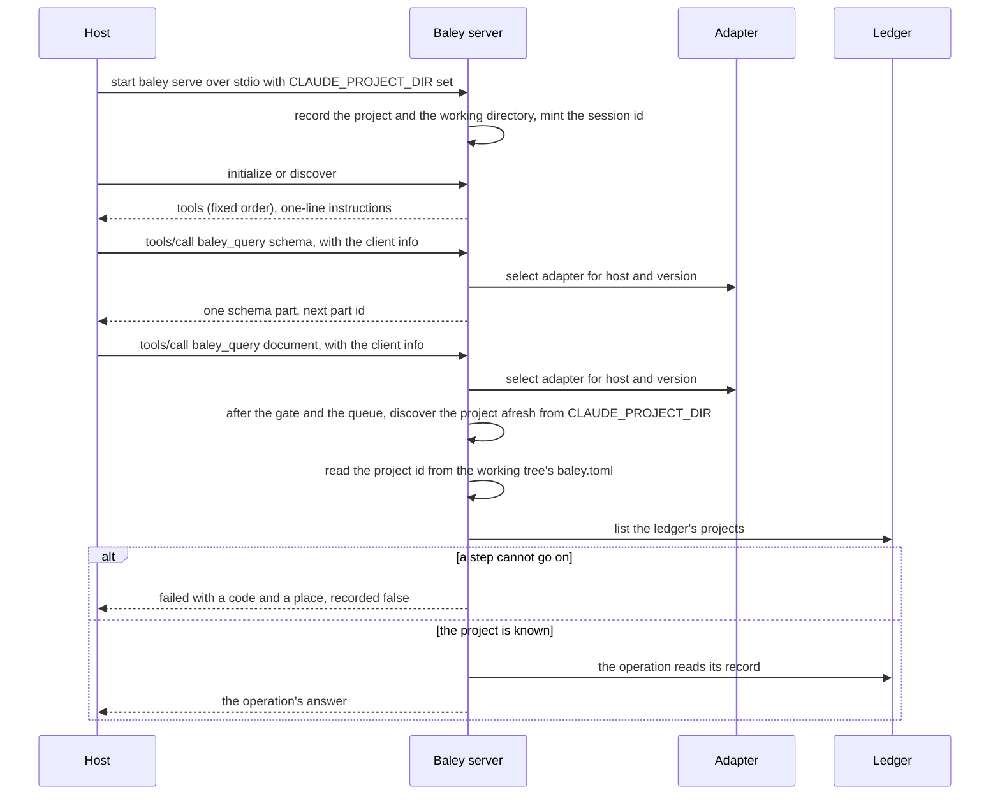
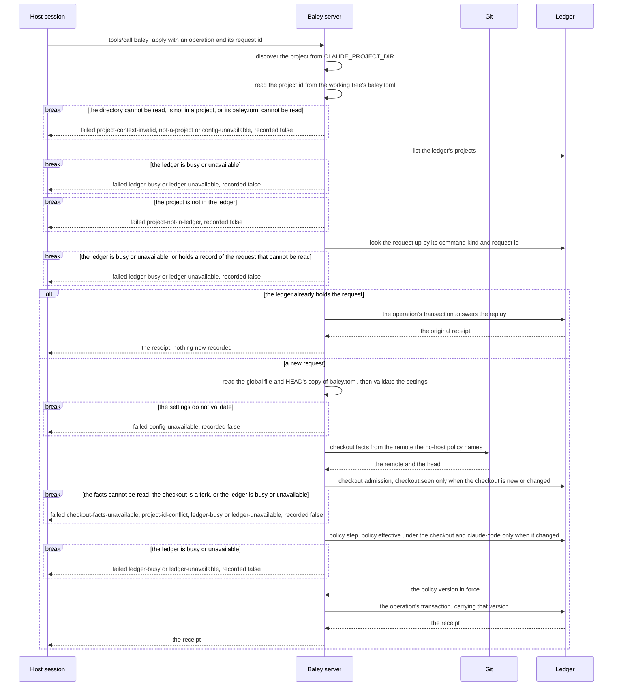
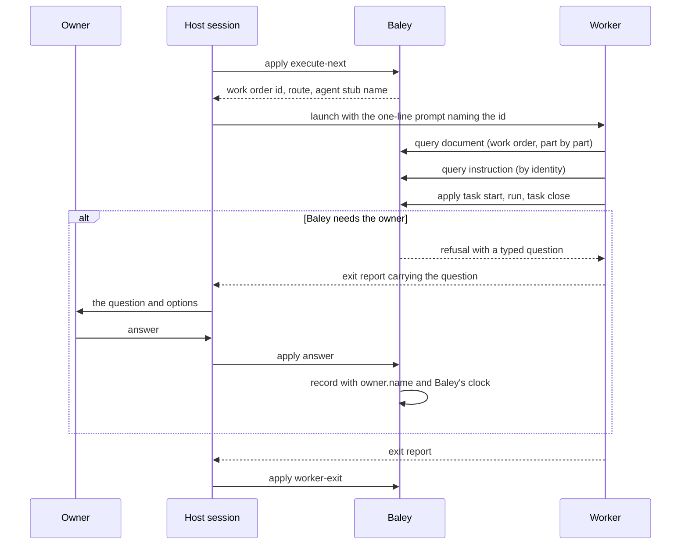
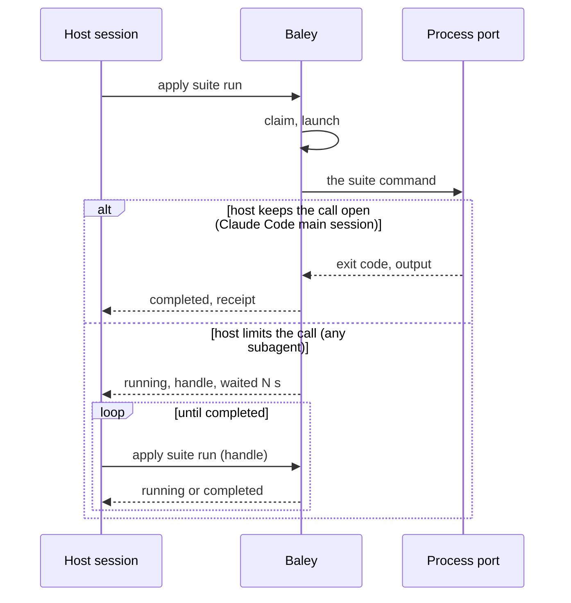
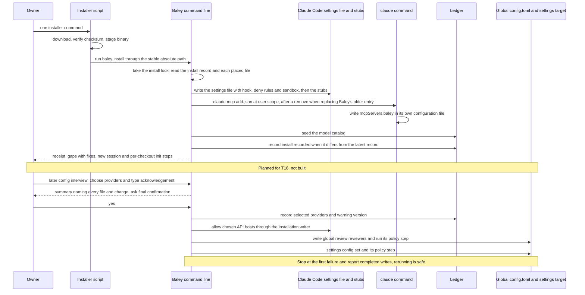
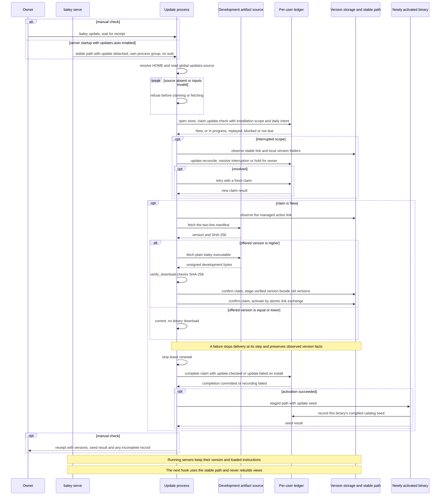

# 0012: Host interface

| | |
|---|---|
| Status | Accepted |
| Design issue | none; build issues [#25](https://github.com/crenshawdev/baley/issues/25), [#127](https://github.com/crenshawdev/baley/issues/127), [#14](https://github.com/crenshawdev/baley/issues/14) (install) |
| Requirement prefix | HST |
| Applies | [0002: System design](0002-system-design.md) |
| Related | ADRs: [0008](../adr/0008-host-sandbox-isolation.md), [0009](../adr/0009-served-instructions.md), [0011](../adr/0011-one-shared-server.md), [0012](../adr/0012-optimistic-concurrency.md), [0027](../adr/0027-vendor-folders-and-plain-keys.md), [0028](../adr/0028-one-http-stack.md), [0033](../adr/0033-host-security-bar.md), [0034](../adr/0034-one-server-per-session.md), [0038](../adr/0038-installer-and-opt-in-updates.md), [0039](../adr/0039-session-owned-provider-credentials.md) · C4 view: components ([0002](0002-system-design.md) Figure 4) |

The current design of this area, and nothing else. Edit it in place when the design changes; git holds the history. It describes the design only, never the work still to do.

## 1. Purpose and scope

This area decides every way a host, a worker or the owner reaches Baley, and how Baley reaches back:

- the per-session server: its stdio connection, protocol revisions, the project it serves and the bounded queue its calls share;
- the host adapter: how Baley knows which host is connected and what that host can do;
- the wire: the tools, the operation contract, refusals, bounded reads by identity, long work;
- how Baley's questions reach the owner and how the owner's answers are recorded;
- served instructions and the stubs a host loads: skills and per-rung agent definitions, written at install;
- the command line;
- install, updates and doctor: delivery, registration, hook, sandbox and stubs, on Claude Code.

It does not decide the content of any instruction (each area owns its own), the settings ([0003](0003-configuration-and-routing.md)), the guard's decisions ([0010](0010-guard.md)), or how Baley's release artifacts are built and published ([#14](https://github.com/crenshawdev/baley/issues/14)).

Hand-offs: every area's operations are served here; the work order composer ([0002](0002-system-design.md) section 8) hands this area the work orders to deliver; [0003](0003-configuration-and-routing.md) gives the route and the host alias tables; [0010](0010-guard.md) gives the hook's decisions; the ledger records every call's refusal or receipt.

In the component view of [0002](0002-system-design.md) (Figure 4) this area is the host interface component and the host adapter among the ports.

## 2. Terms

| Term | Meaning |
|---|---|
| Host | Claude Code, the program the owner works in, whose session starts workers as subagents and connects to Baley over MCP. |
| Session | One host conversation, with its own Baley server over stdio. |
| Worker | A subagent the host session starts for one work order. It shares its session's connection. |
| Server | The Baley process a session starts: one per session, over stdio, serving the session and its subagents. |
| Adapter | The per-host code that knows what a host can do and translates: how a work order is launched, how effort is passed (the rung's own level, run at the model's highest supported level at or below it, HST-R12), how a question reaches the owner, how a long call behaves, how an answer is shaped. |
| Client info | What a host sends when it connects: its name and version. |
| Operation | One typed request under the `query` or `apply` tool, named by a string that is only ever added, never renamed or removed. |
| Refusal | A typed answer that a request was not done, with a code and a place. |
| Identity | The name by which a record or an instruction is read. A record is read by a kind plus keys, and an instruction by its short name, such as `bal-help`. Neither is ever a path. |
| Part | One bounded piece of a served record or instruction, at most 24,576 bytes, with the identity of the next part. |
| Work order | The complete dispatch for one worker ([0002](0002-system-design.md) section 8), read by id. |
| Stub | A file a host needs on disk to list or launch something, rendered by Baley at install from its tables: frontmatter and one line pointing at Baley. |
| Relay | The host session putting Baley's question to the owner and returning the answer. |
| Elicitation | The MCP request by which a server asks the host to show the person a form. |

## 3. Requirements

| Id | Rule | Why | Depends on | Status |
|---|---|---|---|---|
| HST-R1 | Each Claude Code session starts its own Baley server over stdio, and that server serves the session and its subagents (SYS-R1). It answers MCP revisions 2025-11-25 and 2026-07-28 and advertises no other, since those are the two it has been tested on (SYS-R2). | Every session reaches the same record through the store, and the owner starts and keeps running nothing. | SYS-R1, SYS-R2 | Active |
| HST-R2 | Withdrawn. Claude Code starts one stdio server per session. Install has no service or launcher choice ([ADR 0034](../adr/0034-one-server-per-session.md)). | A session owns its server. | SYS-R3 | Withdrawn |
| HST-R3 | Withdrawn. No shared server is started or joined, and there is no idle exit. A server lives for its session and takes its project from the session environment ([ADR 0034](../adr/0034-one-server-per-session.md)). | The host starts the server. | SYS-R4, CFG-R4 | Withdrawn |
| HST-R4 | Baley identifies the host and version from the client info of each `tools/call` and selects that host's adapter. The info comes from `initialize` in a 2025-11-25 session and from the request's own `_meta` in a 2026-07-28 one, never from an earlier call. Negotiation, discover and `tools/list` serve any well-formed client. A `tools/call` from a missing or unsupported client, `baley_version` included, is answered `failed` with code `unknown-host` before any operation runs, carrying the client info reported, the supported host (`claude-code`) and `recorded: false`. It is never an initialize or protocol error, and an unsupported host is never served at a floor. The name is the client's own report, so the answer states what Baley supports and is no defence. | Baley supports a host only when it meets the security bar, and a new host is a new adapter and an ADR (ADR 0033). | SYS-P8, SYS-P12 | Active |
| HST-R5 | Three tools: `baley_version`, `baley_query` and `baley_apply`. `baley_query` and `baley_apply` requests each name an `operation`, and `baley_version` takes no arguments. Operation names are only ever added. The advertised input schema is a flat object with no `oneOf`, `anyOf` or `allOf` at the top, since the Messages API refuses a tool schema that has one. Beside `operation` it types every argument the served operations take, taken from the same request shapes the `schema` operation serves in parts. A refusal is a typed result with a code and a place, never a protocol error. A server failure that records nothing is a typed `failed` result with a code, a place, `recorded: false` and `retryable`, and is not a refusal or a protocol error either. A protocol error is reserved for a malformed or oversized frame, a missing protocol-required metadata key or an unknown tool. | A small typed wire that the host loads once and never sees change. | SYS-P10 | Active |
| HST-R6 | Every record and every instruction is read by identity, in parts of at most 24,576 bytes, each naming the next part; nothing is sent twice and nothing is echoed back. Source code is never served: workers read it with the host's own tools. Tools are returned in a fixed order with cache hints. | Bounded reads, no scanning, no duplicate bytes in a context. | SYS-P10, ADR 0009 | Active |
| HST-R7 | The project comes from the session's `CLAUDE_PROJECT_DIR`, which the server reads once when it starts (CFG-R4). Every project call first judges its own arguments, and a refusal there is answered before anything is prepared. The call then discovers its project afresh from that directory, and no call argument, working directory or project field selects it. The call needs the project in this machine's ledger. The server records the working directory it started in beside the project, and a directory that differs from the project is valid. A read appends nothing. After the project check, a write runs, in order, the replay lookup, the settings read and validation, checkout admission, and the policy step under the host's key, then its own command with the version the step returned. Checkout admission, the step and the command are recorded as the actor `baley`, with the call's caller and the server's time. The server records with every write the caller value of [design 0001's event envelope](0001-evidence-ledger.md#events): the host, the Baley session the server minted, the call identity and its source, the client version and the host's own session when the host supplies them and, for a worker, its work order id. The `tools/call` decisions run one at a time on the server's own worker, behind one bounded queue that the session and its subagents share: one call running, four waiting and 16 MiB of raw frame bytes among them. A call past either bound is answered `failed` with code `server-overloaded`, which is retryable, before anything is prepared (SYS-R5). | Every call is tied to its project and session without asking the host for more, a read cannot change the record, and a write is checked the way the command line checks one. The record says who did what. | SYS-R5, CFG-R4 | Active |
| HST-R8 | Long work (a suite, a check, a landing step) is claimed and started, and the call answers when the host allows it: on a host that keeps a main-session call open past its foreground limit, the call returns on completion; everywhere else the call returns a handle and `still running` after a bounded wait, and the caller repeats the call with the handle until it completes. The adapter chooses; the work runs the same either way, and a handle survives a session's reconnect. | Hosts limit how long a tool call may run; the work must not. | SYS-R7 | Active |
| HST-R9 | Baley's questions to the owner are returned in the tool result as typed questions with their options; the host session puts them to the owner and returns the answer through the answering operation, deciding nothing itself. Where the adapter has proven elicitation reaches the person (a main session on Claude Code), it may use it for the same questions with the same records. Every answer is recorded with `owner.name` and Baley's clock. | The owner answers, the session relays, the record holds the answer. | SYS-P5, CFG-R8 | Active |
| HST-R10 | The owner's identity on every approval is `owner.name` from the global settings, defaulting to git `user.name`. The time is Baley's clock when the approval arrives. This identity setting is planned for the approval build; until that build adds it, T16 records git `user.name` as the owner identity on `providers.acknowledged`. T16 is not the setting's first reader, and the built thirteen-question settings interview does not ask it. A session never supplies either. | One owner, one clock. | SYS-P5 | Active |
| HST-R11 | Every instruction a model sees is compiled into the binary and served by identity in parts; each carries a version and a hash, recorded as instruction evidence in the caller of every event a work-order or front-door call appends. There is no disk loader and no owner override. | One source of every instruction, provable after the fact. | SYS-P9, ADR 0009 | Active |
| HST-R12 | Claude Code loads only stubs, written by `baley install` from the binary's tables into Claude Code's user-level locations, without a plugin, never committed and never hand-edited (the guard denies the write): a skill stub per front door (frontmatter plus one line naming the operation that returns the instructions), and an agent definition stub per role and rung (frontmatter with model and effort plus one line pointing at Baley), because the host reads effort from the definition. A rung's stub carries that rung's own effort level, since Claude Code's map is the identity map (CFG-R15). Support depends on the model: Claude Code runs a level a model does not support as the highest supported level at or below it (Opus and Sonnet 4.6 have no `xhigh`), and a model without effort (Haiku) gets none, recorded as not applicable and never a made-up level. The work order's route records the requested rung and the effective level apart (CFG-R17), from a dated per-model table of supported levels whose source is Claude Code's model configuration documentation (https://code.claude.com/docs/en/model-config#adjust-effort-level). An alias not yet resolved, or a host cap on effort, stays recorded as unknown until observed. `RungMap` is unchanged. Build 4's first dispatch task builds the table and the records, and the owner reviews the initial table in its pull request. `baley install` renders the stubs for each version. Updates activate them for new sessions only, with the stable-path wiring (HST-R17); `baley doctor` checks them byte for byte against the version they serve. | Roles and rungs are Baley's tables; what a host needs on disk follows from them and cannot drift. | ADR 0009, CFG-R12, CFG-R15, CFG-R17 | Active |
| HST-R13 | The server's MCP instructions field holds one line naming the `help` operation and nothing else. | Claude Code cuts or hides it; the stubs carry the entry points. | | Active |
| HST-R14 | A work order is delivered as its id and route; the host session launches the worker Baley names with the agent stub and the one-line prompt naming the id; the worker reads its work order from Baley by id. The session changes nothing in it. | Baley hands the model everything; the session relays. | SYS-P2 | Active |
| HST-R15 | Release 1 outside reviews use provider APIs only. Baley builds the request and work order with the address, header and environment variable name. The session sends it with the owner's environment key and returns the raw response through `review return`; Baley parses and checks it. Model lists follow the same session-fetch boundary, or the owner uses `baley models add` or `baley models import <provider>`. Baley never reads, stores or sends a key, makes no model call and has no `baley exec --key` or output scrubber. | Responsibility and credentials stay with the session ([ADR 0039](../adr/0039-session-owned-provider-credentials.md)). | SYS-R9, SYS-R11, CFG-R20, CFG-R27, REV-R4 | Active |
| HST-R16 | The command line serves the owner: `baley init`, `project`, `scope`, `story`, `backlog`, `phase`, `plan`, `exec`, `verify`, `review`, `land`, `milestone`, `release`, `undo`, `pause`, `resume`, `stop`, `config`, `models`, `install`, `update`, `doctor`, `verify-ledger`, `export`, `help`. Every command answers with a receipt or a refusal with a code; the same operations are reachable over MCP where a session needs them. The `exec` group is for execution ([0006](0006-execution.md)); only the `baley exec --key` credential wrapper is removed. The owner never starts `serve`: Claude Code does, once per session. | One way in for a person, the same rules as the wire. | | Active |
| HST-R17 | One installer command verifies and places the binary behind `~/.local/bin/baley`, then runs `baley install`. No npm or plugin is used. The binary writes the user-level MCP entry, the GRD-R1 pre-tool hook, stubs, sandbox settings and `Read` and `Edit` deny rules, with every executable reference at one absolute stable path. It preserves separately owned settings and registrations. The sandbox is enabled, fails if unavailable, permits no unsandboxed command retry, and denies reads and writes of the resolved home and config folder under `sandbox.filesystem`. The installed executable path and staged-version folder are protected from writes through the sandbox, file-tool deny rules and GRD-R11: T11 supplies the executable path to the protected-path projection; T14 defines and adds the staged-version folder. Only the chosen providers' API hosts are added for provider access, with no key folder or `~/.codex` exception. Install takes interview defaults, seeds the model catalog without a provider call and records the result. Provider use requires CFG-R28's typed acknowledgement later. Updates are opt-in, off by default, checked at most daily by a detached process started by `baley serve`, never by the guard or within its budget. Every released download is signature-verified and staged beside the old version behind the stable path, used by new session servers and by the next hook call through the stable path. Running servers keep their version; T14 keeps a newer hook compatible with an older server and its ledger state, and T17 checks it. The release design #14 owns the signature format, trust root and both verifiers. T14 and T17 build and qualify unsigned development artifacts only at the `verify_download` seam between download and staging; no release exists before #14. Manual `baley update` is always available. `baley doctor` checks the installed result and reports fixes. There is no session-start hook. | One command installs the complete wiring, and updates preserve running sessions ([ADR 0038](../adr/0038-installer-and-opt-in-updates.md)). | ADR 0008, ADR 0009, ADR 0033, ADR 0038, ADR 0039, CFG-R11, CFG-R28 | Active |
| HST-R18 | A call that fails without recording anything itself, a store failure included, is answered `failed` with a code, a place, `recorded: false` and `retryable`, never as an MCP error or a refusal. `retryable` is true only for `server-overloaded` and a busy ledger (`ledger-busy`). Checkout admission and the policy step are separate transactions, as on the command line, so a checkout admission recorded before a later step failed stays recorded, and a retry records nothing more for an unchanged checkout. A refusal judged from an `apply` call's own arguments (its shape, request id, kind, text or instruction identity) is answered before preparation and records nothing, so a corrected retry may reuse the request id. A refusal judged against the ledger's state, such as `no-such-phase`, is recorded with its command. `request-id-reuse` is judged against the ledger too, but records nothing, because its request id already names a recorded request. A refusal that cannot be recorded is answered as a server failure, not a refusal. | The model self-corrects on a refusal and retries only what can succeed unchanged; the record never lies about a refusal. | SYS-P10, EVD-R26 | Active |
| HST-R19 | Frames are bounded (4 MiB raw for the whole frame, depth 128) before the protocol layer sees them. A frame over either bound is discarded to its newline and answered with a JSON-RPC error, and the connection keeps serving. Hook input is bounded (64 KiB). Every child process Baley starts for its own work runs with a deadline through the process port: its caller's registered deadline, or, for the guard's git callers, a timeout of at most 5 seconds that the guard's budget chose from the time it has left ([0010](0010-guard.md), GRD-R14). The detached update check started by `baley serve` is the exception: it has no timeout, and the server never waits for it. | No caller can exhaust the server. | SYS-R5 | Active |
| HST-R20 | On Claude Code, each of the three tool descriptors carries `_meta["anthropic/alwaysLoad"]: true`, so the main session and every subagent see the tools without a tool search, whatever the registration says. | Every capability reaches every agent. | SYS-P12 | Active |
| HST-R21 | MCP prompts are served on Claude Code as a second entry point for the front doors, listing the same commands the skill stubs list. | A host that lists prompts as commands gets them without a file. | HST-R12 | Backlog |
| HST-R22 | Skills over MCP (`io.modelcontextprotocol/skills`) replaces the skill stub files on a host that supports it. | The spec's own extension has ADR 0009's shape. | ADR 0009 | Backlog |

## 4. Roles and actors

| Actor | Receives | Returns | Model and effort from |
|---|---|---|---|
| Owner | The command line's receipts and refusals; questions relayed by the session | Commands; answers | Not applicable |
| Host session | Tool results; work orders to launch; questions to relay | Tool calls; launched workers; the owner's answers | Not applicable |
| Worker | Its work order by id; served instructions and records in parts | Typed results through `apply` | The route in its work order ([0003](0003-configuration-and-routing.md)): the rung's own effort level, recorded apart from the level the model runs at (HST-R12) |
| Host adapter (port) | The client info; a work order; a question; a long call | The host-specific mechanism for each | Not applicable |
| Baley server | Its session's calls, from the session and its subagents | Results, parts, refusals and `failed` answers | Not applicable |

## 5. Commands and operations

### baley_version (tool)

- **Inputs:** none.
- **Outputs:** `version`, `os` and `arch` of the running binary.
- **Refusals:** `unknown-host`, a `failed` answer for a client that is missing or unsupported (HST-R4), and `invalid-arguments` for any argument.

### baley_query (tool)

- **Inputs:** `operation` and its typed arguments; an optional `part`.
- **Outputs:** the operation's typed result, or one part with the next part's identity.
- **Refusals:** `unknown-operation`, `operation-unavailable` (a spelling an earlier server served, naming the build that replaces it), `invalid-arguments` (the reason names the field), plus the operation's own codes. A project that cannot be prepared is not a refusal: the call is answered `failed`, from the table under `baley_apply`.

Query operations are the reads of every area: `help`, `schema`, `document` (a record by identity: capture, work order, plan, story, phase, run, review, verification, roadmap row), `document-search`, `instruction` (an instruction by identity), `progress`, `next` ([0013](0013-next-action-and-progress.md)), `why`, `recall`, `search` ([0014](0014-support-families.md)), `route`, `status` operations per area.

`help` takes an optional command `name`, `schema` takes `tool` and `for`, `instruction` takes `identity`, and `document` takes `identity` as `{kind, id}`, such as `{"kind": "capture", "id": "<capture id>"}`. Each of these four operations takes an optional one-based `part`. Each served operation schema is self-contained, with nested shapes inlined. The input schemas of `baley_query` and `baley_apply` carry the same shapes as properties beside `operation`, so a host is given `identity` as an object and `part` as an integer rather than free text. An argument two operations type differently, such as `identity`, is an `anyOf` of their shapes, and each shape ends by naming the operations that take it and whether each requires it. Other properties stay allowed, so a retired spelling still reaches the server and is answered `operation-unavailable`. Today the built `document` schema accepts only the `capture` identity kind: an object requiring `kind: "capture"` and a string `id`, refusing other fields. An answer that fits in 24,576 bytes comes whole. A larger one comes in parts, each carrying `bound`, `part`, `body` and `next`, where `next` is the next part's number, or null on the last part, and joining the bodies in order gives the answer's bytes. The bound counts body bytes, not the encoded result, and the tool result carries each answer both as text and as structured content. `instruction` answers with the text and its identity, version and hash. `document` answers a capture's text, whole or in parts, and the whole answer and every part carry the identity with the capture's kind, phase, byte count and recording time. When the project released the capture's body, it answers a tombstone with that project's purge reason from its view instead, even while another project still holds the bytes. If only another project purged the body, this project still reads its text. A global body lookup that reports a purge after the view was read triggers a fresh read of this project's view: only its own tombstone supplies the reason. If the view does not confirm that purge, the read answers `failed` `ledger-unavailable` instead of borrowing a global reason. The refusals are `instruction-unavailable`, which names the build that owns an identity not yet served, `unknown-instruction` for any other identity, `no-such-capture` for a capture id the project does not hold, `help-part-not-found`, `schema-part-not-found`, `instruction-part-not-found` and `document-part-not-found` for a part that does not exist, and `invalid-arguments` for a field the shape lacks, so an `instruction` field, the identity a session sends on `baley_apply`, is refused on any read, `document` included. `help`, `schema` and `instruction` need no project, `document` needs one, and no read records anything.

### baley_apply (tool)

- **Inputs:** `operation`, a request id, which is a UUID in lowercase hyphenated form, and its typed arguments. `capture` also takes `instruction`, the identity of the instruction the session follows.
- **Outputs:** the operation's typed receipt; a replay of the same request id returns the same receipt.
- **Refusals:** as `baley_query`, plus `request-id-reuse` (same id, different payload), which records nothing, and the operation's own codes. A request id in any other form is refused `invalid-arguments` naming `request_id`. The registry judges `instruction`, and an unknown identity or one not served is refused `unknown-instruction` or `instruction-unavailable` naming `instruction`, with nothing recorded.

For `capture`, the registry's instruction evidence is attached to the caller before preparation begins. The same caller reaches checkout admission, the policy step and the capture command, so their `checkout.seen`, `policy.effective`, `capture.recorded` and completion events carry it. A call that names no instruction adds no evidence.

Apply operations are the writes of every area, each named in its document: scope, story, phase and plan operations (0004, 0005); execution operations (0006); verification operations (0007); review operations (0008); risk operations (0009); landing, milestone, release, undo, pause (0011); capture, task, debug, spike (0014); `answer` (the owner's answer to a relayed question); `worker-exit`; `round-record`; Build 4's `models-return` for a provider list bound to a fetch work order ([0003](0003-configuration-and-routing.md#5-commands-and-operations)).

### Failed answers of a project call

Before a project read or write runs its operation, the server prepares it (section 8). A step that cannot go on answers `failed` with a code, a place and `recorded: false`. These join the `failed` answers the gate gives before preparation: `unknown-host`, `server-overloaded`, `project-context-missing` (`CLAUDE_PROJECT_DIR` is not set) and `caller-invalid`. The gate answers `project-context-invalid` too, for a variable that was unusable when the server started, and preparation answers it for a directory that cannot be read now.

| Code | Place | Retryable | Answered | The owner's step | First reached by |
|---|---|---|---|---|---|
| `project-context-invalid` | `CLAUDE_PROJECT_DIR` | no | read and write | Restore the project directory, which was removed after the server started. | Build 3 T8, `capture` and `document` |
| `not-a-project` | `CLAUDE_PROJECT_DIR` | no | read and write | Run `baley init` in the repository, or start the session inside one that holds a `baley.toml`. | Build 3 T8, `capture` and `document` |
| `config-unavailable` | `settings` | no | read and write | Repair the settings file the reason names. A read judges only the working tree's `baley.toml`, and a write also judges the global file and HEAD's copy. | Build 3 T8, `capture` and `document` |
| `project-not-in-ledger` | `project` | no | read and write | Run `baley init` in the checkout, which ties its project to this machine's ledger. | Build 3 T8, `capture` and `document` |
| `ledger-busy` | `ledger` | yes | read and write | None. The caller repeats the same call. | Build 3 T8, `capture` and `document` |
| `ledger-unavailable` | `ledger` | no | read and write | Run `baley doctor`. A server whose ledger could not be opened at start needs a new session once the ledger opens. | Build 3 T8, `capture` and `document` |
| `checkout-facts-unavailable` | `git` | no | write only | Fix the git fault the reason names, such as a remote that cannot be read. | Build 3 T8, `capture` |
| `project-id-conflict` | `checkout` | no | write only | Run `baley init --new-id` in the fork's checkout, which gives it its own project. | Build 3 T8, `capture` |

`recorded: false` means the call recorded nothing itself. A write's `ledger-busy` or `ledger-unavailable` answered at the policy step can follow a checkout admission that stays recorded, and a retry records nothing more for an unchanged checkout.

### Long-call handle

- **Inputs:** an apply operation that starts long work; later, the same operation with the handle.
- **Outputs:** `completed` with the receipt, or `running` with the handle and how long the call waited.
- **Refusals:** `unknown-handle`, `handle-expired` (HST-R8).

The session's decision worker is separate from long work. It runs accepted decisions to completion even when a caller stops waiting. It frees a completed decision's queue slot before sending its answer, but keeps the drain pending until that send finishes. An empty queue is drained only when no answer is in flight, including after admission closes or waiting decisions are abandoned. A dropped receiver discards its answer and still permits the drain. This ordering covers delivery to the call's receiver, not flushing the transport. At shutdown the server waits up to ten seconds for that drain. At the bound it first abandons waiting decisions. Either way it then makes its one exit checkpoint attempt.

### Installer and baley install

The development installer is `sh install.sh https://<source>`. It takes exactly one argument, a source beginning with `https://`, and removes trailing slashes. It supports Linux and macOS on `x86_64` and `aarch64`, mapping Darwin to `macos` and `arm64` to `aarch64`. It fetches `<source>/<os>-<arch>/manifest` and `<source>/<os>-<arch>/baley`, a plain executable, with `curl -q --proto '=https' --tlsv1.2 -fsSL`. The `-q` prevents curl configuration from changing the requests. There is no archive or published release (`install.sh:92-129, 142-145`).

Both delivery paths read exactly two UTF-8 lines, each ending with a newline, with no extra content:

```text
version 0.2.0
sha256 <64 lowercase hex digits>
```

The placeholder on the second line stands for the executable's SHA-256. A version has exactly three decimal parts, `major.minor.patch`, each fitting `u64`, with no sign or leading zero except a lone `0`. The installer's `verify_download` compares the downloaded executable's SHA-256 with the manifest, using `sha256sum` or `shasum -a 256`. It has no verification bypass. This checks unsigned development bytes only. #14 owns signature verification in both delivery paths at `verify_download`, the trust root, release format and publication (`install.sh:37-71, 147-171`, `crates/baley/src/update/manifest.rs:101-133, 178-201`).

The stable path is `$HOME/.local/bin/baley`, a symbolic link to `$HOME/.local/lib/crenshawdev/baley/versions/<version>/baley`. These paths are the same on Linux and macOS. `BALEY_HOME` and `XDG_*` move neither. `HOME` must be absolute, nonempty UTF-8 without a `..` component. Repeated slashes and `.` components are removed without following folder links. The installation's identity is the resulting stable path text, never its target (`crates/baley/src/update/installation.rs:75-134`).

The script allows an absent stable path or a link whose stored target is exactly the absolute `<versions>/<version>/baley`, with the version spelled by the same rule as the updater. It refuses other occupants and links to folders, and rechecks before activation. A reused staged file must be regular, not a link, have the manifest's digest and be executable. For a new staged file, the script sets mode `755` on the downloaded file before moving it into the versions folder, then moves it to its final name. It creates a temporary link in `~/.local/bin` and moves that link onto the stable path. It removes no version. Its receipt prints `baley: placed version <version> at <stable path>`, then `baley: versions present in <versions folder>:` and the version folders holding regular binaries. A failure exits 1. The script's last step runs `"$stable" install`, after its receipt, and the installer ends with that command's exit status, so a refused or partial install fails the installer. The script itself writes no host wiring, records no install event and seeds no catalog: `baley install` does that (`install.sh:73-90, 173-212`).

`baley install` writes Claude Code's wiring at the stable path and takes setup defaults. T16 adds provider choice and acknowledgement, and T17 checks the installed result and runs the script live. A new Claude Code session loads the wiring, and each checkout still needs the owner's `baley init`. The command is `baley install [--host <name>]` (`crates/baley/src/install/command.rs:28-52`, `crates/baley/src/main.rs:37-38, 120`).

- **Inputs:** the host, default `claude-code`, and `HOME`, `CLAUDE_CONFIG_DIR` and the resolved Baley folders. Any other host is refused `unknown-host` before anything else runs, naming the supported hosts from `Host::ALL`. Every executable reference install writes is the absolute stable path, `~/.local/bin/baley`, from the installation layout and never from the running binary's own path (`crates/baley/src/install/command.rs:116-126`, `crates/baley/src/host_artifacts/installed.rs:55-107`).
- **Outputs:** the artifacts in the table below, then the catalog seed and `install.recorded`. Existing owner settings and separately owned registrations are preserved. Replacement needs evidence of Baley's ownership, never a matching name alone (UPK-R2 in [0015](0015-repository-upkeep-and-build-gate.md)).
- **Receipt:** see below. A partial install is never reported complete.
- **Refusals:** see below. Signature or checksum failure activates nothing, in the installer before install runs.

**Where each artifact goes.** The Claude folder is `CLAUDE_CONFIG_DIR` when it is set, else `~/.claude`. A set value must be non-empty, absolute and UTF-8, and its trailing slashes are dropped. `HOME` must be usable even then, because it places the stable path. Nothing else moves these paths: `BALEY_HOME` and `XDG_*` move only Baley's own folders.

| Artifact | Place | Written by |
|---|---|---|
| Guard hook, `permissions.deny` rules and `sandbox` block | `<Claude folder>/settings.json`, one document | Install, through `replace::replace` (a temporary file in the same folder, renamed only if the file's digest is still the one read, never through a link) |
| Skill stubs | `<Claude folder>/skills/<identity>/SKILL.md`, one folder per served front door | Install, through the same replacement |
| MCP registration `mcpServers.baley` | `$CLAUDE_CONFIG_DIR/.claude.json` when the variable is set, else `~/.claude.json` | Claude Code, by `claude mcp add-json --scope user baley <entry>`. Install never writes this file |

Claude Code rewrites `.claude.json` whole, by rename, again and again while a session runs (`spikes/host-matrix/claude-live-2026-10-08-run1.md:675-679, 759-763`), so a write by Baley could be refused for a changed digest or be written back over by an open session. Baley asks Claude Code to make the change instead. `claude mcp add-json` refuses a name that exists, so replacing Baley's older entry runs `claude mcp remove --scope user baley` first, after the file is read and judged a second time. Each `claude` launch has its own process group, a 30-second timeout, 64 KiB kept per stream, no input and install's own environment. Claude Code relocates its configuration under `CLAUDE_CONFIG_DIR`, and user-scope servers then live in `$CLAUDE_CONFIG_DIR/.claude.json` (read from the installed binary, and a live run stored a user-scope registration in an isolated folder, `spikes/host-matrix/live-claude.md:177`, `spikes/host-matrix/claude-live-2026-10-08-run3.md#ses.b.registered`). Install itself has not run against a live Claude Code, and T17 does that. The entry has `command` the stable path and `args` `["serve"]`, with no `alwaysLoad`, `env` or `type` key. The hook item is the nine-tool matcher with a single command hook that runs the single-quoted stable path and `guard` within 10 seconds (`crates/baley/src/install/registration.rs:19-57`, `crates/baley/src/host_artifacts/registration.rs:20-26`, `crates/baley/src/host_artifacts/hook.rs:13-50`).

**Ownership.** Install proves an artifact is Baley's from the latest `install.recorded` for the host and from this binary's own render. A name or a folder proves nothing.

- A stub is Baley's when its bytes equal this binary's render, or when its SHA-256 is the hash the latest record holds for that identity. A stub that holds other bytes, is a link, or cannot be read refuses the install (`crates/baley/src/install/stubs.rs:26-71`).
- A JSON entry is Baley's when it equals this binary's render or what the latest record holds for it. The registration is compared by one rule, shared with composition and the doctor: the same `command` and `args`, `env` absent or empty, and `type` absent or `stdio`. Every other key, `alwaysLoad` included, is ignored. So an `mcpServers.baley` entry that sets any `env` entry is never this binary's, because it can point the server at another ledger, and an `http` or `sse` entry that still holds Baley's command and arguments is not Baley's either, because Claude Code does not launch it through `command` (`crates/baley/src/host_artifacts/compose.rs:177-196`, `crates/baley/src/install/registration.rs:66-115`).
- Older Baley entries leave only on the record's evidence. The `PreToolUse` item the record holds, when it differs from this binary's, and each `permissions.deny`, `sandbox.filesystem.denyRead` and `denyWrite` string the record lists that this binary does not render, are removed by whole-value comparison. With no record, nothing is removed. The owner's own items and rules stay (`crates/baley/src/install/settings.rs:120-170`).
- Running install again on a completed installation changes nothing: composition adds only entries that are absent, a stub whose bytes match is not written, and a registration that is this binary's runs no `claude` command.

**Refusals.** A refusal is judged before any write and places no file under the Claude folder, runs no `claude` command, seeds no catalog and records no `install.recorded`. It prints one line per conflict, names the artifact and its path, and exits 2. Baley's own lock file and ledger store may already exist. Every conflict found is listed, so one run shows all of them (`crates/baley/src/install/plan.rs:109-256`).

| Code | When |
|---|---|
| `unknown-host` | `--host` names anything but `claude-code` |
| `install-ownership-conflict` | A stub holds bytes that match neither this binary's stub nor a hash the record lists for it, or is a link. `mcpServers.baley` in `.claude.json` or in the settings file is not this binary's entry or the record's. A `PreToolUse` item runs another `guard` command and the record does not list it |
| `install-settings-conflict` | The settings file or `.claude.json` is not JSON, is JSON but not an object, is not a regular file, is a dangling link, or cannot be read. A key install adds entries under holds another kind of value. The settings file is a link and a write is needed. A Baley folder is not valid UTF-8, so its deny rules could not be written |
| `install-running` | Another `baley install` holds the install lock |
| `install-lock-unavailable` | The lock file cannot be created, opened or locked, with its path and cause |

Beside these, a `HOME`, `CLAUDE_CONFIG_DIR` or Baley folder value that cannot place the artifacts is refused with its own text, and a store that cannot be opened is reported by the shared renderer with its exit class.

**One install at a time.** Install is exclusive. After it has resolved the folders and the artifact paths, and before it opens the ledger, it takes an exclusive, non-waiting lock on `<Baley home>/install.lock`, a file created with mode `0600` that does not follow a link, and holds it until the record is written. A second install is refused `install-running` before it reads anything, because two runs planning from the same record could leave the record naming hashes the files no longer hold. Closing the file releases the lock, so a crashed install leaves nothing to clear (`crates/baley/src/install/command.rs:54-114, 126`).

**Partial installs.** A partial install writes what it can, names each gap with its fix and exits 1.

- Owner settings that weaken protection are kept and named, never overwritten: `disableAllHooks` or `sandbox.filesystem.disabled` true, any `sandbox.excludedCommands` entry, an absolute `allowRead` or `allowWrite` entry that re-opens a Baley folder, a `~/` or relative entry composition cannot judge, and a path the deny rules cannot render. Each gap says what to remove or change.
- Baley's secure value replaces the owner's `sandbox.enabled` false, `sandbox.failIfUnavailable` false or `sandbox.allowUnsandboxedCommands` true. The replacement is written and the receipt reports the old value, but only when the settings write placed it.
- On Linux without `bwrap` or `socat`, and on a platform without Claude Code's sandbox, the `sandbox` block is held back and the owner's own `sandbox` block is left as it was. The hook, the deny rules, the stubs and the registration are still written. The gap carries the doctor's fix text, which names the package and the commands that install it, and says to run install again.
- While nothing runnable sits at the stable path, the hook and the registration are held back, because they would run a path that does not exist. The stubs, the deny rules and the sandbox block are written. The gap says to run `install.sh`, or to place the binary or a link to it at that path, and run install again.
- A write that fails stops the run. The stubs and the registration after it are reported `not written`, with the cause, and the run still seeds the catalog and records what it did own. A failed `claude` command prints the full `claude mcp add-json` line for the owner to run by hand. Registration is attempted only when every file write was reached.

**Write order.** The settings file, then the stubs in manifest order, then the registration through `claude`. The catalog seed follows, in process through `models::seed`, then the record. A refused settings write, such as a file that changed after it was read, is reported in the receipt as `install-settings-conflict`, and an I/O failure as `not-writable` with the path (`crates/baley/src/install/plan.rs:213-233, 277-351`, `crates/baley/src/install/apply.rs:27-123`, `crates/baley/src/install/command.rs:133-209`).

**The record.** After the seed, install records `install.recorded` (section 6) with the ownership facts the run left: for each stub the hash of the bytes left at its path, the registration entry and the hook item that are Baley's after the run, and the entries Baley owns in the sandbox and deny lists. A step that did not complete keeps the previous record's entry for that artifact while the file still holds it, so the next run can still recognise Baley's older entry. The record is written only when it differs from the latest one. A run also names the record it planned from, so a run that planned from an older record cannot overwrite a newer one, which is a second guard beside the lock: it records nothing and the receipt says the record was not written (`crates/baley/src/install/plan.rs:371-472`, `crates/baley/src/install/record.rs:47-118`).

**Receipt.** The lines print in this order (`crates/baley/src/install/receipt.rs:69-218`):

1. `install outcome: complete` or `install outcome: partial`.
2. `baley <version> at <stable path>`.
3. One line per artifact in map order, `<artifact> at <path>: <state>`: the stubs by identity, the registration, the hook and the settings. The states are `written`, `registered`, `replaced`, `unchanged`, `written without the sandbox block` and `not written` with the cause.
4. The catalog seed line, then any write failure and a `the install record was not written` line.
5. A `replaced <key> ...` line for each owner value Baley's secure value replaced.
6. A `gap: ...` line for each gap, with its fix.
7. When the sandbox block is in the file, two lines saying the sandbox settings apply to every Claude Code session on this machine, including projects Baley does not manage, and that managed settings, command-line settings and a project's own `.claude/settings.json` and `.claude/settings.local.json` take precedence over the user settings file for single values such as `sandbox.enabled`.
8. The next steps: start a new Claude Code session, run `baley init` in each checkout, the `updates.auto` switch, `baley update`, `baley config interview` and `baley doctor`.

The outcome is complete only when every artifact is Baley's after the run, there is no gap, the catalog seed is recorded and no write or record failed. The exit status is 0 for complete and 1 for partial, 2 for a refusal, and a store failure uses the shared classes (2 for a refused or blocked store, 3 for a busy, unavailable or read-only one).

**The settings file.** Claude Code reads the user settings file below managed settings, command-line settings, a project's local settings and its shared settings. A project's own settings can therefore override single sandbox values such as `sandbox.enabled`, and a managed policy overrides them all. The sandbox in the user file applies to every Claude Code session on the machine, including projects Baley does not manage, and the receipt says so. Baley chose this file because it needs no administrator rights and holds the hook, the deny rules and the sandbox as one document that is composed once. Install writes nothing to `config.toml`: the interview's defaults are the compiled defaults, and a setting the owner changed later is not touched. Provider hosts and `review.reviewers` are T16's.

**Limits.** Two cases are not closed. Between install's second read of `mcpServers.baley` and the `claude mcp remove` that follows it, another writer can change the entry, so the remove can delete an entry install did not judge ([#251](https://github.com/crenshawdev/baley/issues/251)). When nothing runnable is at the stable path, install withholds the new hook but still removes an older hook the record lists, so a machine can end with no hook ([#252](https://github.com/crenshawdev/baley/issues/252)); the gap says so only by naming the empty stable path. The live behaviour of the written wiring in a Claude Code session is T17's to observe.

Install resolves the folders for its deny paths without pinning folder environment values into the MCP entry or hook. The server, hook and owner commands resolve their own runtime environment and must resolve the same `BALEY_HOME`, `XDG_CONFIG_HOME`, `XDG_DATA_HOME` and `HOME` inputs, and the sandbox paths must match the resulting folders. `doctor` reports disagreement instead of certifying a different, unprotected home.

### Sandbox and provider access

The library renders the filesystem and permission proposal below, and `baley install` merges it into the user settings file `<Claude folder>/settings.json`, replacing the example paths with the resolved absolute folders (section 5). The example shows Linux defaults for a home folder of `/home/owner`, with the files a default installation places and, last, the provider hosts T16 writes when both providers are selected and acknowledged. Install itself writes no `network` block: without outside providers it adds neither API host. Existing unrelated settings and hosts are preserved. The fields follow Claude Code's [sandbox settings](https://code.claude.com/docs/en/sandboxing).

```json
{
  "sandbox": {
    "enabled": true,
    "failIfUnavailable": true,
    "allowUnsandboxedCommands": false,
    "filesystem": {
      "denyRead": [
        "/home/owner/.local/share/crenshawdev/baley",
        "/home/owner/.config/crenshawdev/baley"
      ],
      "denyWrite": [
        "/home/owner/.local/share/crenshawdev/baley",
        "/home/owner/.config/crenshawdev/baley",
        "/home/owner/.local/lib/crenshawdev/baley/versions",
        "/home/owner/.claude/skills/bal-capture/SKILL.md",
        "/home/owner/.claude/skills/bal-help/SKILL.md",
        "/home/owner/.claude.json",
        "/home/owner/.claude/settings.json",
        "/home/owner/.local/bin/baley"
      ]
    },
    "network": {
      "allowedDomains": ["api.openai.com", "api.deepseek.com"]
    }
  },
  "permissions": {
    "deny": [
      "Read(//home/owner/.local/share/crenshawdev/baley/**)",
      "Edit(//home/owner/.local/share/crenshawdev/baley/**)",
      "Read(//home/owner/.config/crenshawdev/baley/**)",
      "Edit(//home/owner/.config/crenshawdev/baley/**)",
      "Edit(//home/owner/.local/lib/crenshawdev/baley/versions/**)",
      "Edit(//home/owner/.claude/skills/bal-capture/SKILL.md)",
      "Edit(//home/owner/.claude/skills/bal-help/SKILL.md)",
      "Edit(//home/owner/.claude.json)",
      "Edit(//home/owner/.claude/settings.json)",
      "Edit(//home/owner/.local/bin/baley)"
    ]
  }
}
```

Sandbox filesystem paths use ordinary absolute paths; `Read` and `Edit` rules use `//` for an absolute path. `Edit` covers Write and NotebookEdit. The guard also covers Read, Grep and Glob over the home and config folder, and protects the project file ([0010](0010-guard.md), GRD-R11 and GRD-R13); the placed stubs, the placed settings and registration files and the installed executable are on its list, and the versions folder is its write-only folder. Each write-only file gets a `denyWrite` entry and an `Edit` file rule, with no `Read` rule. In the default layout, the versions folder is `~/.local/lib/crenshawdev/baley/versions`, outside both the PATH folder and Baley's ledger home. Setting `BALEY_HOME` to the versions folder, a folder that contains it, or a version folder inside it is not supported: the home's read denials would cover the staged binaries, so sandboxed commands could not run them. The proposal protects it as a folder: its absolute path in `denyWrite` and `Edit(//<absolute-folder>/**)`, with no `denyRead` entry or `Read` rule, so sandboxed commands can run the binaries inside it. `PlacementMap::write_only_folders` supplies that folder separately from protected files, and the guard's write decision denies writes to the folder and its contents (`crates/baley/src/host_artifacts/placement.rs:290-330`, `crates/baley/src/protected_paths/write.rs:13-31, 75-103`). The live guard derives the same placements from the environment: the stable path and versions folder from `HOME`, and the Claude folder from `CLAUDE_CONFIG_DIR`. It reads no store for them and passes them at `guard_hook::context::judge`, which protects the files once each and the versions folder as a write-only folder. When the placements cannot be derived, because `HOME` or `CLAUDE_CONFIG_DIR` is unusable, the guard cannot clear any path call and fails closed: it denies the six path tools and cannot record, so an ask becomes a deny (`crates/baley/src/guard_hook/context.rs:65-90, 103-174`, `crates/baley/src/host_artifacts/installed.rs:55-107`). The doctor builds its map from the install record (see `baley doctor`). There is no key folder, no provider-tool state exception and no `~/.codex` allowance.

The library renders this shape, without the `network` block, from the resolved folders, the executable, the write-only files and the write-only folders, and reports a supplied path that is not absolute UTF-8, that a rule would read as a pattern, or that ends in a space a deny rule would drop, instead of rendering it (`crates/baley/src/host_artifacts/security.rs:91-109, 143-222`). It composes the shape into an existing settings document, keeping every unrelated key, `sandbox.network` included. Where the shape is composed, Baley's secure values replace a disabled sandbox, `failIfUnavailable` false and `allowUnsandboxedCommands` true, with each replacement reported. Composition reports and retains `sandbox.filesystem.disabled` true, `disableAllHooks` true, and `sandbox.enabled` false, `failIfUnavailable` false or `allowUnsandboxedCommands` true in a document the shape is not composed into, such as one holding only the hook or the registration. It also reports and retains every `sandbox.excludedCommands` entry, whatever it names, since Claude Code runs a listed command outside the sandbox even with `allowUnsandboxedCommands` false; the home or config folder re-opened by an absolute `allowRead` or `allowWrite` entry; a `~/` or relative `allowRead` or `allowWrite` entry, which Claude Code resolves against the owner's home folder or the settings file's place and which composition therefore cannot judge; a differing hook running `guard`; and a `mcpServers.baley` entry with another command or arguments, with `env` entries, or of a transport other than `stdio`. A conflict marks the result incomplete. `baley install` sorts what composition reports into refusals, replacements and gaps (section 5) (`crates/baley/src/host_artifacts/compose.rs:98-175, 206-287`, `crates/baley/src/install/settings.rs:352-489`). The coverage judge reports what the resulting document covers per tool and per read or write (`crates/baley/src/host_artifacts/coverage.rs:281-356`). Any excluded command leaves Bash, Monitor and PowerShell and every write-only file a gap (`crates/baley/src/host_artifacts/coverage.rs:375-398`), and a `~/` or relative allow entry leaves each verdict its list can open a gap, reported as not judged (`crates/baley/src/host_artifacts/coverage.rs:429-442`). Both read only these settings, in the one document they are given: a setting Claude Code also honours, such as `sandbox.enabledPlatforms` leaving out this platform, or one in another settings file, is not seen. The placement projection carries the installed executable path and the separate versions folder (`crates/baley/src/host_artifacts/placement.rs:290-330`). The coverage judge currently takes only home, config and write-only files, so the installed versions folder needs T17's checks. Install applies the composed result to the settings file, and the guard protects the same placements. The `network` block is T16's, written for the chosen providers; neither the library nor install renders a network key.

Build 3 T16 extends the interview with provider choice and typed acknowledgement ([0003](0003-configuration-and-routing.md), CFG-R28). The summary before the final `yes` lists every file to be written. That `yes` records the acknowledgement first, writes API-host allowances through the installation writer second, writes the global `review.reviewers` list third, and runs the settings `config set` last. These are separate writes. A failure stops at that step and reports what was written; re-running the interview reads the completed state and safely applies the remaining changes. It states: Baley never reads your keys. Every program Claude Code starts can see keys in your environment, agents and subagents included. Nothing scrubs a key a command prints. Your code goes to the chosen provider under its terms. The acknowledgement is recorded in the ledger and asked again when the warning changes. A fresh install enables no outside provider; a reinstall keeps acknowledged choices. Install never acknowledges a warning.

### baley update

Manual `baley update` runs in the foreground whether `updates.auto` is on or off and waits for its receipt. `baley serve` reads the global setting once at startup. When it is true, the server starts the absolute stable path with the hidden subcommand `update detached`, in its own process group, with null input and output, without a parent-death signal or a wait. The detached process has no overall deadline; its individual downloads are bounded. A settings, layout or launch error produces one `baley: update check skipped: ...` line on the server's stderr. The guard never starts or waits for an update (`crates/baley/src/mcp/serve.rs:163-178`, `crates/baley/src/update/detached.rs:9-58`).

The updater reads `updates.source` from global settings. It is an HTTPS address with no default, set with `baley config set --global updates.source=https://<source>`. An absent value refuses `update-source-unset` before opening the store or claiming. The schema requires `https://` followed by at least one character and rejects whitespace, control characters, queries and fragments. The source uses the development layout and two-line manifest above. No host argument or project is required. The CLI resolves the installation from `HOME`, obtains the UTC time and opens the per-user store (`crates/baley/src/update/command.rs:35-70, 108-161`).

The check takes an `update.check` claim before any fetch. Only a new claim permits a download. It judges the stable link as managed only when the stored target is exactly this installation's absolute `<versions>/<version>/baley` and following it finds a regular file. It fetches and parses the manifest, then compares the offered version numerically, major first. An equal or lower version records `current` without fetching the binary. A strictly higher version follows these steps (`crates/baley/src/update/command.rs:241-326`, `crates/baley/src/update/installation.rs:193-225`):

1. Fetch the plain executable through ADR 0028's `reqwest` client, with one client and a separate current-thread Tokio runtime for the check. Requests use HTTPS only, with no proxy, referer, authorization header, project content or provider credential. A manifest has a 20-second request bound and a 64 KiB body bound; the binary has a ten-minute request bound and a 256 MiB body bound. Connection setup is bounded at 20 seconds. Only a complete HTTP 200 response within the body bound is accepted (`crates/baley/src/update/fetch.rs:12-16, 66-83, 94-190`).
2. Pass the bytes through `verify_download`, which checks SHA-256 against the unsigned manifest, with no flag, setting or environment bypass. #14 replaces this verification seam before any release.
3. Stage at `<versions>/<version>/baley`. Reuse only a regular file with the same digest and the owner's execute bit. Otherwise a conflicting entry is refused. A new file is written under a temporary name, set to `755`, synced and renamed to `baley`, then its folder and the versions folder are synced. The claim is confirmed immediately before staging and again before activation (`crates/baley/src/update/deliver.rs:102-157, 197-253`, `crates/baley/src/update/command.rs:351-392`).
4. Recheck the stable link, create a temporary link beside it and activate with one atomic rename exchange of the two links (`renameat2` with `RENAME_EXCHANGE` on Linux, `renamex_np` with `RENAME_SWAP` on macOS). Sync the stable folder and inspect the displaced link. An unexpected occupant is restored by another exchange. An activation error attempts restoration where an exchange occurred; a failed restoration reports the retained temporary entry for inspection. No running executable is overwritten (`crates/baley/src/update/deliver.rs:159-195, 290-408`).
5. Stop lease renewal and complete the claim with its `update.checked` or `update.failed` event in the same transaction. Only after that completion attempt returns does a successfully activated version run its own hidden `baley update seed`, directly from its staged path, to record its compiled catalog without a provider call. The seed has a 60-second deadline and a 4 KiB output bound. A newer view set raised during seeding therefore cannot fence the older updater's completion attempt. The seed still runs if completion failed; the receipt then reports an incomplete record and the new active version (`crates/baley/src/update/command.rs:215-239`, `crates/baley/src/update/record.rs:51-82`, `crates/baley/src/update/seed.rs:34-101`).

Every version is kept. An activation receipt lists the version folders holding regular binaries, including the active version, in numeric order. #14 owns pruning at activation. New sessions start the newly active server, while running servers keep their executable and loaded instructions. Each new hook call follows the stable path. The hook never rebuilds views. The view set is 8, raised once by T15's `install` view, and update events go only into `user`, so the hook adds no new event type to the running session's project. The rise has a cost. A binary at view set 7 is read-only on `user` once a newer binary has written there and brought its views to 8, so it cannot write the guard's records, the model catalog or update outcomes that live in `user`. A project is fenced for older binaries only after a view-set-8 binary has written to it, and install writes only `user`, so the session's own project stays writable for an older server. Binaries built before T14 cannot write `user` once it holds an update event, and binaries built before T15 cannot write it once it holds `install.recorded`, because they do not know the event types. No such binary was released, since only development binaries exist. A later binary that raises the ledger epoch can still make an older server read-only under [ADR 0034](../adr/0034-one-server-per-session.md). `baley install` writes the stubs new sessions load, and a running session keeps what it loaded; T17 qualifies the newer hook beside an older server (`crates/baley/src/ledger/open.rs:19-78`).

The claim protocol in section 6 prevents manual and detached checks from overlapping. Only a detached check refuses a day already claimed, including one claimed manually. Manual checks can retry that day under a fresh request once the installation scope is free.

**Receipt.** The foreground command prints these lines in order (`crates/baley/src/update/receipt.rs:216-336`):

| Result | Lines |
|---|---|
| Current | `update outcome: current`, `active version at <installation>: <version>`, `offered version: <version>`, `nothing staged` |
| Activated | `update outcome: staged`, `staged version: <version>`, `<version> is now the active version at <installation>`, `new Claude Code sessions start <version>; running sessions keep the version they started with`, the catalog seed result, `kept versions: <versions>` |
| Seed result | `the catalog seed of <version> was recorded`, or `the catalog seed of <version> was not recorded: <cause>` |
| Recorded failure | `update failed at <step>: <code>: <cause>`, then the unchanged active version for a download, verification or staging failure, or the freshly observed active version for an activation failure. An unknown managed version is stated as such |
| Completion failed | The activation lines when activation succeeded, otherwise the observed active version, followed by `the record of this check is incomplete: <cause>; the next update check reconciles it` |
| Lease renewal errors | Append `<count> lease renewals failed; first error: <cause>` when any renewal failed |

Current and recorded activation outcomes exit 0, including an activation whose catalog seed failed. A recorded delivery failure or an incomplete record exits 1. Before-claim input refusals and stopped claim gates exit 2, including store errors returned by a claim or its automatic reconciliation. Store-open and user-project setup errors use the shared CLI exit classes: 2 for store refusals or blocked claims, 3 for busy, unavailable, read-only and other store errors. The shared renderer reserves 1 for cleanup failure or an unverified export. Successful receipts go to stdout; refusals and failures go to stderr with `baley: ` on each line (`crates/baley/src/update/receipt.rs:163-196, 216-287`, `crates/baley/src/ledger/display.rs:45-90`).

**Refusals and failure codes.** The bounded delivery codes are also the allowed `update.failed.code` values (`crates/baley/src/update/events.rs:78-126`).

| Code | Meaning |
|---|---|
| `update-source-unset` | Global `updates.source` is absent. The refusal names the command that sets it |
| `update-check-busy` | A claim is active or held for the owner. The receipt names the request and state, and names `baley update resolve` for an owner hold |
| `update-check-not-due` | A detached check found the installation already claimed for that UTC day. A manual check never refuses for this reason |
| `update-not-installed` | The stable path is not a managed installation link |
| `update-network-unavailable` | Client setup, transport, HTTP status or download body bounds prevented a complete download |
| `update-manifest-invalid` | The manifest does not have the exact two-line form, version or digest |
| `update-checksum-mismatch` | The downloaded binary's SHA-256 differs from the manifest |
| `update-staging-conflict` | The staged path already holds something other than the same regular binary with the owner's execute bit |
| `update-activation-conflict` | The stable link changed before activation or the exchange displaced an unexpected occupant |
| `not-writable` | Observing, writing, syncing, renaming or cleaning a delivery path failed. The cause names the path and operation's error |
| `update-interrupted` | The claim was lost or could not be confirmed before staging or activation, or an interrupted check was resolved from local observations |

The claim renderer also has `update-check-needs-reconciliation` for an interrupted gate and `update-check-refused` as a fallback when a refused answer has no code. The command handles an interrupted gate by reconciling and retrying the claim once before rendering it. Invalid `HOME` and folder inputs retain their own diagnostic text. Unreadable or invalid global settings report `config-unavailable` with the path and cause (`crates/baley-core/src/policy/parse.rs:238-242, 259-264`). Store errors use the shared CLI renderer, not the MCP codes `ledger-busy` and `ledger-unavailable`: a busy store says `the ledger is busy; run the command again`, a read-only store names the needed epoch, and other errors retain their store text. There is no `unknown-host` or `update-signature-invalid` path in this command (`crates/baley/src/update/claim.rs:24-33, 218-245`, `crates/baley/src/update/receipt.rs:163-213`, `crates/baley/src/ledger/display.rs:101-146`).

### baley update resolve

`baley update resolve` reads this installation's stable link and version folders and resolves an `update.check` held for the owner. It needs no source setting and makes no network request or activation. It uses `update.reconcile` with owner authority and actor `owner`, records `update.failed` with `update-interrupted` and the observed versions, and releases the installation scope even when the stable path is unmanaged. It does not repair that path; a later check can still refuse `update-not-installed`. Automatic reconciliation is described in section 6 (`crates/baley/src/update/command.rs:72-106`, `crates/baley/src/update/reconcile.rs:200-303`).

With no owner hold it prints `no update check is held for this installation` and exits 0; an interrupted claim not yet held for the owner is left to automatic reconciliation. On resolution it prints `resolved update check <request> for <installation>`, `observed active version: <version or none>; staged version: <version or none>`, and `the next baley update can run`, then exits 0. A live claim refuses `update-check-busy` and exits 2. Other store errors use the shared CLI renderer and exit classes (`crates/baley/src/update/reconcile.rs:305-340`).

### baley doctor

- **Inputs:** the resolved home and config folders, the latest install record for `claude-code` and the placements derived from `HOME` and `CLAUDE_CONFIG_DIR`, the same derivation install and the guard use. The command takes no flags, so the host is Claude Code. The executable is always the derived stable path, never the running binary. The install record tells installed from never installed: with no record every artifact is reported not installed, so a machine that has the binary and never ran install still reports each one so and raises nothing. With a record, a stub has its place when the record lists its identity, the registration, the hook and the settings when the record holds them, and the versions folder whenever a record exists. A `HOME` or `CLAUDE_CONFIG_DIR` that cannot place the artifacts, or a record that cannot be read, is reported and raises the exit status to 1, since an unreadable record is never taken for a machine where install never ran (`crates/baley/src/host_doctor/mod.rs:61-120`, `crates/baley/src/ledger/commands.rs:163-190`, `crates/baley/src/host_doctor/report.rs:26-40`).
- **Outputs, built:** the ledger lines first, then a host section headed `Claude Code host checks` (`crates/baley/src/host_doctor/report.rs:26-144`):
  - each artifact (the stubs, the registration, the hook and the settings) as not installed when the install record does not show it, as missing or unreadable when a place is given and the file is not usable, and otherwise as read (`crates/baley/src/host_doctor/mod.rs:353-484`);
  - each placed stub byte for byte against the manifest, with both SHA-256 digests when it differs (`crates/baley/src/host_doctor/placed.rs:185-193`);
  - the registration against the entry Baley renders for this binary, by the one rule install and composition use: the same `command` and `args`, `env` absent or empty, and `type` absent or `stdio`. An entry that sets `env` entries, or is of another transport, is reported as differing, with the entry found (`crates/baley/src/host_doctor/placed.rs:206-222`);
  - the executable's kind: missing, a dangling link, not a regular file, or without an execute bit (`crates/baley/src/host_doctor/placed.rs:143-167`);
  - the nine-tool hook check and the coverage of Baley's folders per tool and per read or write, worded as configuration of the named documents and not as proof, with `Grep` and `Glob` best-effort ([0010](0010-guard.md) section 5);
  - `bwrap` and `socat` on Linux, none on macOS and the sandbox unsupported on any other platform, looked up on the command's own `PATH` (`crates/baley/src/host_doctor/prerequisites.rs:75-193`);
  - the last recorded server call's `CLAUDE_PROJECT_DIR` and working directory on separate lines, read from the ledger and judged with the server's own rule (`crates/baley/src/host_doctor/server_context.rs:68-176`). An unusable variable is reported with `project-context-invalid`, the cause and what to set, and a missing one with `project-context-missing`. A working directory that differs from the project is valid and is not a finding. With no server call recorded, one line says so;
  - compatibility, where a ledger at a newer epoch is read-only for this binary, the write fence, where the server's startup `quick_check` is not observed from the command line and the `integrity_check` rows stand in for it, the home folder, and the config folder with a note when it is the home folder (`crates/baley/src/host_doctor/store_health.rs:49-63`, `crates/baley/src/host_doctor/report.rs:181-212`);
  - whether the guard's per-user records were behind this binary's when the doctor started, naming `baley rebuild user` (`crates/baley/src/host_doctor/guard_records.rs:38-78`).
- **Outputs, planned (T17):** the stable binary path and version, the installed MCP entry, hook and settings, the chosen provider hosts, the current warning acknowledgement and update setting, and a running session's version against the version staged for new sessions. T17 owns these checks under [ADR 0038](../adr/0038-installer-and-opt-in-updates.md). They run through the same observe, judge and report steps over the placement map built from the install record. The doctor reads no key and tests no credential.
- **Exit status:** placements or an install record that cannot be read, a gap in a given document, a placed file missing, unreadable or differing, a registration that differs, an executable that is missing, not a regular file or without an execute bit, a tool the hook leaves unguarded, `disableAllHooks` true in a hook or settings document, a missing sandbox program, an unsupported platform, a ledger at a newer epoch and guard records behind raise it to 1. An artifact that is not installed, the server's context and the folder lines do not. No host finding gives 2 or 3.
- **Limits:** only the documents given are judged. Other Claude Code settings files and `sandbox.enabledPlatforms` can change what applies. WSL1, containers that block bubblewrap, Ubuntu's AppArmor rule on user namespaces, ripgrep and the seccomp filter are not checked. A missing project variable is never seen from the ledger, because a server without it records nothing, so the doctor sees only a recorded project folder that is no longer a directory. There is no plugin, so there is no check of plugin defaults ([ADR 0038](../adr/0038-installer-and-opt-in-updates.md)).
- **Refusals:** none today. `unknown-host` comes with T17's host argument. A gap in a document names the setting to change, and a missing sandbox program names the package to install. An unwritable installed location is a failed check naming the location and its fix (T17). The host checks read the ledger and the placed files, append nothing and write no file. The store's own doctor runs before them and verifies each project's views, which first brings views behind this binary's current, so it can write the database. It appends no event.

## 6. Records

### install.recorded (event, per-user, `install` stream)

`baley install` records the ownership facts a run left, as the owner. The event goes on stream `install` in `user` at type version 1, with no upcasters, under command kind `install.record`, actor `owner`, policy version 0 and no caller. It is appended only when its payload differs from the latest record for the host, and a run that planned from an older record than the one now stored appends nothing (`crates/baley/src/install/event.rs:13-21, 111-140`, `crates/baley/src/install/record.rs:17, 47-118`).

| Field | Type | Meaning |
|---|---|---|
| `host` | `claude-code` | The host whose wiring was installed |
| `binary_version` | version | The version of the binary that ran install |
| `binary_path` | absolute path | The stable executable path |
| `complete` | bool | True only when every artifact is Baley's after the run, there is no gap, the catalog seed is recorded and no write failed |
| `registered` | table | `registration`: the file's path and the whole `mcpServers.baley` entry that is Baley's after the run, or null. `hook`: the settings file's path and the whole `PreToolUse` item that is Baley's, or null |
| `stubs` | list | `identity`, `path` and `sha256` of every stub that is Baley's after the run, in manifest order. A stub whose write failed keeps the previous record's entry |
| `sandbox` | table or null | `settings_path`, `sha256` of the settings file's bytes after the run, Baley's `home` and `config` folders, `write_only_files`, `write_only_folders`, and the entries Baley owns in `permissions_deny`, `deny_read` and `deny_write`. `held_back` says why the sandbox block was left out, or is null when it was written. Null when the settings file holds none of Baley's entries |
| `defaults` | table | Always empty: install applies no setting and records no provider acknowledgement |
| `updates` | table | `auto`, the effective `updates.auto` or null when the global settings could not be read, and `staged_version`, the version the stable path runs or null |

The whole entries are kept so a later run can recognise an older Baley entry and replace it. A matching name alone never does (section 5).

### The caller on every recorded event

Every event a call records carries one `caller` in its envelope, hashed with the event. [Design 0001's Events table](0001-evidence-ledger.md#events) holds the exact keys, values and limits. The caller has two forms.

- The server form is what the server records for a request. It holds the project directory, the working directory, the host, the Baley session the server minted, and the call identity: the request's JSON-RPC id, with its source. It may also hold the client version, the host's own session id, a work order id and instruction evidence.
- The hook form is what the guard hook records for a tool call. It holds the host, the working directory and the call identity: Claude Code's tool-use id, with its source. It may also hold the project directory, the host's own session id, a work order id and instruction evidence. It has no Baley session, so a hook cannot claim one.

The guard hook fills the hook form on every record it makes in the per-user project `user` ([0010](0010-guard.md) section 6): Claude Code as the host, the hook's working directory and the call's `tool_use_id`, with `CLAUDE_PROJECT_DIR` as given and the host's session when the call has them. It sets no work order id or instruction evidence, and a call with no `tool_use_id`, or with a text the form refuses, is not recorded at all.

Instruction evidence is a list of entries, each an instruction's identity, version and hash. A session sends only an instruction's identity, as `instruction` on a `baley_apply` call. The server takes the version and hash from its compiled registry, and refuses an identity the registry does not serve. Reading an instruction records nothing. Every text is checked when the caller is built and again when it is read back, and each has a byte limit. A command-line command, the detached updater and a reconciliation have no caller: the envelope has no `caller` key, and a caller is never `null`. No caller enters a request digest or request key, so a replay records nothing and the original caller stays on the event the request first produced. The server's preparation fills the server form on checkout admission, the policy step and the prepared command ([section 8](#8-workflows)), and [section 11](#11-build-status) says which operations reach it.

### long_call (table, not an event)

Handle, operation, request id, claim, started at, state, result reference.

### Views

| View | Key | Content |
|---|---|---|
| `install` | host, in `user` | The latest `install.recorded` for the host, as `{host, seq, payload}`. It holds install records only: the latest update outcome is read from its stream (`crates/baley/src/install/view.rs:11-90`) |

### Update checks

Update checks are ordinary events in the per-user project `user`, with actor `owner` for a manual `baley update` and `baley` for a detached check, policy version 0 and no caller. The store records the attempt as `command.claimed` on `command/update.check`. Completion records one `update.checked` or `update.failed`, version 1, on `install` and closes the request with `command.completed` in the same transaction. Reconciliation also records the store's `command.reconciled`. There is no separate update-check table, and update events have no projector. The `install` view above holds install records only; update events are read from their stream (`crates/baley/src/update/events.rs:17-30`, `crates/baley/src/update/record.rs:32-82`).

| Event | Inline facts |
|---|---|
| `update.checked` | `installation` (absolute stable path text, never the link target), `day` (UTC `YYYY-MM-DD`), `claim: {request_id, seq}`, `checked_at`, `outcome` (`current` or `staged`), `active_version`, `staged_version` |
| `update.failed` | `installation`, `day`, `claim: {request_id, seq}`, `observed_at`, `code` (one of section 5's eight delivery failure codes), `active_version`, `staged_version`. An interrupted attempt records `code: "update-interrupted"` and never counts as a successful check |

Version fields are strings when known and `null` otherwise. `claim.seq` is the sequence of the original `command.claimed` event. The completion keeps the claim's day even if it finishes after midnight. The `staged` outcome means the version was both staged and activated, so both version fields name it. An offered version appears in the current receipt, not in the event payload (`crates/baley/src/update/events.rs:127-180`, `crates/baley/src/update/receipt.rs:51-74`).

**Daily claim.** The updater uses the existing [0001 command claim and scope protocol](0001-evidence-ledger.md#commands), without a new port operation. Both manual and detached checks submit `update.check` with a fresh request UUID and exact scope token `update/<installation>`. The intent is exactly `{installation, day}`. `installation` is the absolute stable path as installed (`~/.local/bin/baley` with the home expanded), never its link target, so activation does not change the identity. `day` is the UTC calendar date from the supplied time. The command digest binds the command kind, project, intent, actor, policy version and scope. The claim owner carries the process id as decimal text, `host_session: "cli"` and the supplied start time. Only the detached check's decision calls `Transaction::event_exists` inside the claim transaction, matching `command.claimed` on `command/update.check`, with top-level fields `kind: "update.check"` and `intent` equal to that object. An existing claim, manual or detached, refuses that detached check with `update-check-not-due`. The manual decision never refuses for that reason. For an allowed decision the existing `claim` appends the claim and takes its lease in that writer turn, before any network work. The shared scope blocks overlapping checks, including across midnight. After completion releases the scope, another manual check may claim it under a fresh request that day. A failed or interrupted attempt also covers that day's automatic check; it does not prevent a fresh manual attempt after the scope is released (`crates/baley/src/update/claim.rs:62-169`).

Only `Claimed::New` permits fetching. `InProgress`, `Replayed`, a blocked scope or a refused decision never fetches. The anchor ticker renews the lease while the check runs, and renewal stops before `complete`. The updater also confirms the lease and its ownership immediately before staging and activation. A lost claim or failed confirmation stops the next effect with `update-interrupted` (`crates/baley/src/update/claim.rs:171-245`, `crates/baley/src/update/command.rs:186-239, 334-392`).

When a check finds an interrupted installation scope, it reconciles from the stable link and local version folders without re-executing the interrupted network check. A managed active link is enough to close the interrupted claim with `update.failed` and `update-interrupted`. A stable path Baley does not manage is ambiguous: missing, not a link, a link with a target outside the exact managed form, dangling or not pointing to a regular file. Automatic reconciliation then records a finding and leaves the claim held for the owner without an update result event. It does not infer a successful check from an observed activation. The highest local version above the active version is recorded as staged, or the highest local version when no active version is known (`crates/baley/src/update/reconcile.rs:45-169`).

Both forms of reconciliation use command kind `update.reconcile`, policy version 0 and no caller. The actor distinguishes them: `baley` with `ReconcileAuthority::Automatic`, `owner` with `ReconcileAuthority::Owner` through `baley update resolve`. Owner resolution can close an ambiguous claim and release its installation scope. After automatic resolution, the check tries a fresh claim once; that new claim still obeys the detached daily rule. Store fencing or unavailable state prevents a new check, and a completion failure after activation reports the new active version and the incomplete record (`crates/baley/src/update/reconcile.rs:171-303`, `crates/baley/src/update/command.rs:140-161`).

Provider risk acknowledgements are the per-user records in [0003 section 6](0003-configuration-and-routing.md#6-records), not inferred from an install receipt.

## 7. States


```mermaid
stateDiagram-v2
  [*] --> Starting: Claude Code starts baley serve for the session
  Starting --> Serving: project judged, ledger opened when it can be, session id minted
  Serving --> Serving: calls arrive from the session and its subagents
  Serving --> Draining: end of input, SIGINT or SIGTERM
  Draining --> Checkpointing: decisions finished and answers sent, or ten seconds passed
  Checkpointing --> Exited: one PASSIVE attempt that never waits
  Exited --> [*]
```

*Figure 1. States of a session's server. Drain completion requires an empty queue and no answer in flight. At the ten-second bound waiting decisions are abandoned before the checkpoint. While the connection is open only SQLite's own automatic checkpoint runs, every 1,000 pages: there is no idle checkpoint and no timer, and the server ends only when its input ends or it gets SIGINT or SIGTERM. Claude Code 2.1.294 stops a stdio server with SIGINT when its session ends.*


```mermaid
stateDiagram-v2
  [*] --> Claimed: long work started
  Claimed --> Running: process launched
  Running --> Completed: result recorded
  Running --> Running: caller repeats with the handle, still running
  Running --> Abandoned: process exit seen with no record, reconciled
  Completed --> [*]: handle expires after delivery
```

*Figure 2. States of a long call.*

## 8. Workflows


```mermaid
sequenceDiagram
  participant H as Host
  participant S as Baley server
  participant A as Adapter
  participant L as Ledger
  H->>S: start baley serve over stdio with CLAUDE_PROJECT_DIR set
  S->>S: record the project and the working directory, mint the session id
  H->>S: initialize or discover
  S-->>H: tools (fixed order), one-line instructions
  H->>S: tools/call baley_query schema, with the client info
  S->>A: select adapter for host and version
  S-->>H: one schema part, next part id
  H->>S: tools/call baley_query document, with the client info
  S->>A: select adapter for host and version
  S->>S: after the gate and the queue, discover the project afresh from CLAUDE_PROJECT_DIR
  S->>S: read the project id from the working tree's baley.toml
  S->>L: list the ledger's projects
  alt a step cannot go on
    S-->>H: failed with a code and a place, recorded false
  else the project is known
    S->>L: the operation reads its record
    S-->>H: the operation's answer
  end
```

*Figure 3. A session starting its server and making calls. The second call is a project read. After the gate and the queue it discovers the project from the session's `CLAUDE_PROJECT_DIR`, reads the project id from the working tree's `baley.toml` and checks that the ledger lists it, then the operation answers. A read stops there and appends nothing. Any step before the answer that cannot go on is answered `failed` with `recorded: false` (section 5).*


```mermaid
sequenceDiagram
  participant H as Host session
  participant S as Baley server
  participant G as Git
  participant L as Ledger
  H->>S: tools/call baley_apply with an operation and its request id
  S->>S: discover the project from CLAUDE_PROJECT_DIR
  S->>S: read the project id from the working tree's baley.toml
  break the directory cannot be read, is not in a project, or its baley.toml cannot be read
    S-->>H: failed project-context-invalid, not-a-project or config-unavailable, recorded false
  end
  S->>L: list the ledger's projects
  break the ledger is busy or unavailable
    S-->>H: failed ledger-busy or ledger-unavailable, recorded false
  end
  break the project is not in the ledger
    S-->>H: failed project-not-in-ledger, recorded false
  end
  S->>L: look the request up by its command kind and request id
  break the ledger is busy or unavailable, or holds a record of the request that cannot be read
    S-->>H: failed ledger-busy or ledger-unavailable, recorded false
  end
  alt the ledger already holds the request
    S->>L: the operation's transaction answers the replay
    L-->>S: the original receipt
    S-->>H: the receipt, nothing new recorded
  else a new request
    S->>S: read the global file and HEAD's copy of baley.toml, then validate the settings
    break the settings do not validate
      S-->>H: failed config-unavailable, recorded false
    end
    S->>G: checkout facts from the remote the no-host policy names
    G-->>S: the remote and the head
    S->>L: checkout admission, checkout.seen only when the checkout is new or changed
    break the facts cannot be read, the checkout is a fork, or the ledger is busy or unavailable
      S-->>H: failed checkout-facts-unavailable, project-id-conflict, ledger-busy or ledger-unavailable, recorded false
    end
    S->>L: policy step, policy.effective under the checkout and claude-code only when it changed
    break the ledger is busy or unavailable
      S-->>H: failed ledger-busy or ledger-unavailable, recorded false
    end
    L-->>S: the policy version in force
    S->>L: the operation's transaction, carrying that version
    L-->>S: the receipt
    S-->>H: the receipt
  end
```

*Figure 4. A project write, in the order the server prepares it. A request the ledger already holds goes straight to the operation's transaction, which keeps the final say on a replay, so a retry is answered with its receipt even when the settings no longer validate (HEAD's copy or the merge), but not when the working tree's `baley.toml` can no longer give the project id. A refusal ends preparation at its step: it answers `failed` with `recorded: false`, and a fork records nothing in the project. Checkout admission and the policy step are separate transactions, as on the command line, so a failure at the step leaves the admission's `checkout.seen` recorded. The guard takes none of this route.*


```mermaid
sequenceDiagram
  participant O as Owner
  participant H as Host session
  participant S as Baley
  participant W as Worker
  H->>S: apply execute-next
  S-->>H: work order id, route, agent stub name
  H->>W: launch with the one-line prompt naming the id
  W->>S: query document (work order, part by part)
  W->>S: query instruction (by identity)
  W->>S: apply task start, run, task close
  alt Baley needs the owner
    S-->>W: refusal with a typed question
    W-->>H: exit report carrying the question
    H->>O: the question and options
    O->>H: answer
    H->>S: apply answer
    S->>S: record with owner.name and Baley's clock
  end
  W-->>H: exit report
  H->>S: apply worker-exit
```

*Figure 5. Delivering a work order and relaying a question.*


```mermaid
sequenceDiagram
  participant H as Host session
  participant S as Baley
  participant P as Process port
  H->>S: apply suite run
  S->>S: claim, launch
  S->>P: the suite command
  alt host keeps the call open (Claude Code main session)
    P-->>S: exit code, output
    S-->>H: completed, receipt
  else host limits the call (any subagent)
    S-->>H: running, handle, waited N s
    loop until completed
      H->>S: apply suite run (handle)
      S-->>H: running or completed
    end
  end
```

*Figure 6. A long call.*


```mermaid
sequenceDiagram
  participant O as Owner
  participant I as Installer script
  participant B as Baley command line
  participant HC as Claude Code settings file and stubs
  participant CC as claude command
  participant L as Ledger
  participant C as Global config.toml and settings target
  O->>I: one installer command
  I->>I: download, verify checksum, stage binary
  I->>B: run baley install through the stable absolute path
  B->>B: take the install lock, read the install record and each placed file
  B->>HC: write the settings file with hook, deny rules and sandbox, then the stubs
  B->>CC: claude mcp add-json at user scope, after a remove when replacing Baley's older entry
  CC->>CC: write mcpServers.baley in its own configuration file
  B->>L: seed the model catalog
  B->>L: record install.recorded when it differs from the latest record
  B-->>O: receipt, gaps with fixes, new session and per-checkout init steps
  Note over O,C: Planned for T16, not built
  O->>B: later config interview, choose providers and type acknowledgement
  B-->>O: summary naming every file and change, ask final confirmation
  O->>B: yes
  B->>L: record selected providers and warning version
  B->>HC: allow chosen API hosts through the installation writer
  B->>C: write global review.reviewers and run its policy step
  B->>C: settings config set and its policy step
  Note over B,C: Stop at the first failure and report completed writes, rerunning is safe
```

*Figure 7. The one-command installation as built, and T16's provider selection as planned. The script runs `baley install` through the stable path. Install takes its lock, reads the install record and the placed files, then writes the settings file and the stubs, asks `claude` to register the server, seeds the catalog and records the result. A refusal ends it before any write, and a write that fails stops the run and leaves a partial receipt. Default setup never supplies acknowledgement. The planned final confirmation authorizes separate writes in order, and a failure stops that sequence. The released installer verifies every download through #14's verifier; T14 and T17 use unsigned development artifacts only before #14.*


```mermaid
sequenceDiagram
  participant O as Owner
  participant S as baley serve
  participant U as Update process
  participant R as Development artifact source
  participant L as Per-user ledger
  participant V as Version storage and stable path
  participant N as Newly activated binary
  alt manual check
    O->>U: baley update, wait for receipt
  else server startup with updates.auto enabled
    S->>U: stable path with update detached, own process group, no wait
  end
  U->>U: resolve HOME and read global updates.source
  break source absent or inputs invalid
    U->>U: refuse before claiming or fetching
  end
  U->>L: open store, claim update.check with installation scope and daily intent
  L-->>U: New, or in progress, replayed, blocked or not due
  opt interrupted scope
    U->>V: observe stable link and local version folders
    U->>L: update.reconcile, resolve interruption or hold for owner
    opt resolved
      U->>L: retry with a fresh claim
      L-->>U: new claim result
    end
  end
  opt claim is New
    U->>V: observe the managed active link
    U->>R: fetch the two-line manifest
    R-->>U: version and SHA-256
    alt offered version is higher
      U->>R: fetch plain baley executable
      R-->>U: unsigned development bytes
      U->>U: verify_download checks SHA-256
      U->>V: confirm claim, stage verified version beside old versions
      U->>V: confirm claim, activate by atomic link exchange
    else offered version is equal or lower
      U->>U: current, no binary download
    end
    Note over U,V: A failure stops delivery at its step and preserves observed version facts
    U->>U: stop lease renewal
    U->>L: complete claim with update.checked or update.failed on install
    L-->>U: completion committed or recording failed
    opt activation succeeded
      U->>N: staged path with update seed
      N->>L: record this binary's compiled catalog seed
      N-->>U: seed result
    end
  end
  opt manual check
    U-->>O: receipt with versions, seed result and any incomplete record
  end
  Note over S,V: Running servers keep their version and loaded instructions
  Note over S,V: The next hook uses the stable path and never rebuilds views
```

*Figure 8. Manual and opt-in detached checks share the claim, verification and activation path. Only a detached check applies the daily refusal, and a manual claim also covers the day's automatic check. Delivery stops on failure. The completion attempt returns before the newly activated binary seeds its catalog, even when recording failed, so a newer view set cannot fence that attempt. The detached process discards its receipt, and the server never waits for it. Running servers keep their binaries, the next hook follows the stable path, and the view set is 8, raised once by T15's `install` view and not by an update. `baley install` writes the stubs new sessions load, and T17 qualifies the newer hook beside an older server. #14 supplies signature verification at both download-to-staging seams before any release.*

## 9. Settings

| Setting | Type | Default | Scope | Owner | Effect |
|---|---|---|---|---|---|
| `updates.auto` | bool | `false` | global | 0012 | Enable at-most-daily detached checks from `baley serve` (HST-R17) |
| `updates.source` | HTTPS address | absent | global | 0012 | Development artifact source for `baley update`, set by `baley config set --global updates.source=https://<source>`. An absent source refuses the check; there is no release default. Requires a nonempty address after `https://`, with no whitespace, control character, query or fragment |
| `owner.name` | text | git `user.name` | global | 0012 | The owner recorded on every approval (HST-R10), added by the approval build |
| `[host.<name>]` sections | see [0003](0003-configuration-and-routing.md) | | both | 0003 | Per-host overrides the adapter applies |

Both update settings are in the standard schema used by `baley config set` and the settings interview (`crates/baley-core/src/policy/schema.rs:188-196, 332-346`). `owner.name` remains the approval build's setting.

No setting selects, loads or overrides an instruction, because every instruction is compiled in (HST-R11). No setting chooses an artifact's content or placement either: the content is rendered from the compiled tables and supplied values (section 10), and the placement is derived from `HOME` and `CLAUDE_CONFIG_DIR` by `baley install`, the guard and the doctor alike, not set (section 5).

## 10. Instructions served

| Instruction | Served to | Carries requirements |
|---|---|---|
| Skill stubs | The host, on disk once `baley install` places them: per served front door, frontmatter with the help table's `name` and `description`, and one line asking the session to call `baley_query` with `{"operation":"instruction","identity":"<identity>"}` and follow what it returns. A stub holds no instruction text and no `allowed-tools` line | HST-R12 |
| Agent stubs (Claude Code) | The host, on disk at install: per role and rung, frontmatter with the model and the rung's own effort level, and one line: "read your work order from Baley by the id in your prompt". Build 4 adds the renderer to `crates/baley/src/host_artifacts/`. A definition names the session's `baley` MCP entry and never defines an inline server, so every subagent shares the session's connection ([ADR 0034](../adr/0034-one-server-per-session.md)) | HST-R12 |
| Front-door instructions | The host session, by identity: what the command does, which operations it calls, that the owner approves and answers, that the session relays and adjudicates and never decides | HST-R9, HST-R14 |
| Read contract | Every worker and session, by identity: read records and instructions by identity in parts; read source with the host's tools; never search for instructions | HST-R6 |
| Help | The host session and the owner: the list of commands with one line each, each command's availability and owning build, and help's own identity, version and hash | HST-R13, HST-R16 |

The text of every instruction is owned by the area it serves; this area serves it.

Each instruction is compiled into the binary with an identity, a version and a hash. A front door's identity is its help-table name, and the read contract's is `bal-read-contract`. The version is a number pinned beside the text, raised whenever the text changes, and the hash is the lowercase hex SHA-256 of the text, which is every part joined. `instruction` serves the text by identity in parts, and answers an identity whose work is not built yet with the build that owns it. A front door's text asks the session to send its identity as `instruction` on each `baley_apply` call made under it.

Claude Code loads four artifacts Baley renders as content. Each is built from the compiled tables and supplied values only. The library renders them and writes none of them, and `baley install` writes them (section 5).

| Artifact | Inputs | Content | Requirement | Placement |
|---|---|---|---|---|
| Skill stub, one per served front door (`bal-help`, `bal-capture`) | The compiled help table and instruction registry | Frontmatter `name` and `description`, then the one-line `baley_query` `instruction` call. There is no `allowed-tools` line, so each `baley_query` call is approved by the owner (`crates/baley/src/host_artifacts/stubs.rs:20-44`) | HST-R12 | `<Claude folder>/skills/<identity>/SKILL.md`, written by `baley install` |
| MCP registration | The absolute executable, and whether to set `alwaysLoad` | `mcpServers.baley` with `command` the executable and `args` `["serve"]`, `alwaysLoad: true` only on request, and no `cwd`, `env`, URL, headers or token (`crates/baley/src/host_artifacts/registration.rs:7-26`) | HST-R17, HST-R20 | `mcpServers.baley` in `$CLAUDE_CONFIG_DIR/.claude.json`, else `~/.claude.json`, written by Claude Code through `claude mcp add-json --scope user`, which `baley install` runs. Install sets no `alwaysLoad` |
| Guard hook | The absolute executable | One `PreToolUse` item matching `Bash\|Monitor\|PowerShell\|Read\|Grep\|Glob\|Write\|Edit\|NotebookEdit`, with one command hook that runs the single-quoted executable and `guard` within 10 seconds (`crates/baley/src/host_artifacts/hook.rs:13-50`) | GRD-R1 | The `hooks.PreToolUse` array of `<Claude folder>/settings.json`, written by `baley install` |
| Sandbox and deny settings | The home and config folders, the executable, the write-only files and the write-only folders | The shape in section 5 without `sandbox.network`: home and config denied to reads and writes, the executable and each write-only file denied to writes, and the versions folder denied to writes with a folder rule and no read rule (`crates/baley/src/host_artifacts/security.rs:91-109, 143-222`) | GRD-R13, EVD-R24, CFG-R11, HST-R17 | The `sandbox` and `permissions.deny` keys of the same settings file, written by `baley install` |

The manifest lists each stub's host, identity, bytes and lowercase hex SHA-256, and no placement enters it, so the same binary always gives the same manifest (`crates/baley/src/host_artifacts/stubs.rs:46-88`). The placement map links each artifact to a supplied absolute path or `Unknown` and yields the files the doctor expects and the protected list, which holds the placed stubs, the placed settings and registration files and the executable; an `Unknown` placement yields neither and is reported as not installed, never as protection. Install and the guard build the map from the environment (`HOME`, `CLAUDE_CONFIG_DIR` and the compiled manifest), and the doctor builds it from the same derivation and leaves an artifact `Unknown` until the install record shows it (`crates/baley/src/host_artifacts/installed.rs:55-107`, `crates/baley/src/host_doctor/mod.rs:61-120`). The versions folder has its own supplied placement or `Unknown` and yields a write-only folder, never an expected file. The map refuses a stub whose file, with `.` and `..` resolved from the text and no link followed, is another artifact's file or the executable (`crates/baley/src/host_artifacts/placement.rs:154-223, 250-339`).

## 11. Build status

The library holds the per-session server (`crates/baley/src/mcp/`), and `baley serve` starts it. The same module prepares a project read or write from the session's own project (`crates/baley/src/mcp/prepare.rs`), and two served operations reach it: `capture`, a write, and `document`, a read (`crates/baley/src/mcp/handler.rs:154-179`). The library also holds the guard hook (`crates/baley/src/guard_hook/`), which `baley guard` runs once per tool call ([0010](0010-guard.md) section 11). It renders Claude Code's artifacts as content (`crates/baley/src/host_artifacts/`, section 10), and `baley install` writes them (`crates/baley/src/install/`, section 5). `baley artifact` prints each one to standard output and writes no file (`crates/baley/src/main.rs:27-28, 115`, `crates/baley/src/host_artifacts/command.rs:107-243`). The binary also holds the inherited engine, parked for Build 9 to delete (`crates/baley/src/inherited.rs:1-4`). Nothing in production reaches it, and its tests still run.

| Requirement | Status | Where |
|---|---|---|
| HST-R1 | Built | `baley serve` runs one stdio server for the session (`crates/baley/src/main.rs:66-67, 198-211`, `crates/baley/src/mcp/serve.rs:146-246`), and it advertises only the two tested revisions (`crates/baley/src/mcp/tools.rs:65-68`, `crates/baley/src/mcp/handler.rs:186-188`) |
| HST-R2, HST-R3 | Withdrawn | Nothing to build: each session starts its own stdio server (ADR 0034) |
| HST-R4 | Built | The 2025 decoder reads `initialize` and the 2026 decoder reads the request's `_meta` (`crates/baley/src/mcp/client.rs:24-40`). The host is selected per call (`crates/baley/src/mcp/client.rs:95-126`, `crates/baley/src/mcp/handler.rs:97-122, 190-198, 227`), and a missing or unsupported client is answered `failed` `unknown-host` before the queue (`crates/baley/src/mcp/gate.rs:71-110, 162-178`). The supported hosts are `Host::ALL` (`crates/baley-core/src/policy/schema.rs:134-140`) |
| HST-R5 | Built | Three tools in a fixed order (`crates/baley/src/mcp/tools.rs:83-120`), append-only operation names, with `instruction` appended last to the query baseline (`crates/baley/src/mcp/operations.rs:127`), held by the expected spellings and the test that checks both baselines against them (`crates/baley/src/mcp/operations.rs:479-592, 605-609`), a flat schema that types each served operation's arguments from the request shapes `schema` serves, with no combinator at the top (`crates/baley/src/mcp/tools.rs:122-227`, held by the tests at `crates/baley/src/mcp/tools.rs:303-477`), plus the `schema` operation, which serves each served operation's request shape, the `capture` and `document` shapes included (`crates/baley/src/mcp/operations.rs:290-327, 404-474`, `crates/baley/src/mcp/capture.rs:43-61`, `crates/baley/src/mcp/document.rs:26-49`), and `failed` as its own arm of the envelope (`crates/baley/src/envelope.rs:82-153`). The gate raises a protocol error only for an unknown tool (`crates/baley/src/mcp/gate.rs:77, 153-160`) |
| HST-R6 | Partly built | `help`, `schema`, `instruction` and `document` answer whole, or in parts of at most 24,576 body bytes, through one helper (`crates/baley/src/mcp/parts.rs:5-57`) in the four answers (`crates/baley/src/mcp/operations.rs:335-358, 360-402, 404-474`, `crates/baley/src/mcp/document.rs:125-161`). Instructions are read by identity through `instruction`, and the tools carry a fixed order and cache hints (`crates/baley/src/mcp/tools.rs:70-81`). `document` serves captures by identity, and every part carries the identity and the capture's metadata (`crates/baley/src/mcp/document.rs:39-49, 125-161, 212-323`). A purged capture answers with its own project's tombstone reason, re-reading that view when the body lookup observes a later purge (`crates/baley/src/mcp/document.rs:91-104, 258-287, 306-323`). Its other identity kinds are their builds', and `document-search` answers `operation-unavailable` until Build 8 (`crates/baley/src/mcp/operations.rs:101, 276-288`). In the 2026-10-08 runs part 1 of a 33,000-byte capture arrived as 24,576 bytes naming part 2 as next, byte-identical to the first 24,576 bytes of the fixture, in the main session and in a subagent (`claude-live-2026-10-08-run2.md#hand.parts.document-main`, `#hand.parts.document-subagent`). The first run's `document` calls had failed because Claude Code sent the nested identity as JSON text (`claude-live-2026-10-08-run1.md#hand.parts.document-main`, issue #232, fixed in bug pull request #234), and the second run was made against a commit that holds the fix. `help` (4,819 bytes) and `instruction` (1,366 bytes) arrived whole as one answer (`claude-live-2026-10-08-run2.md#hand.parts.help`, `#hand.parts.instruction`). Only part 1 was read, so the arrival of later parts is unverified, and the bytes on the wire were not measured, though each answer travels as text and as structured content (about twice the body) |
| HST-R7 | Partly built | The session context is gathered once and judged (`crates/baley/src/mcp/context.rs:20-50, 127-167`), each call's context and caller are formed (`crates/baley/src/mcp/context.rs:222-246, 295-323`), and decisions run one at a time on the worker behind one queue (`crates/baley/src/mcp/queue.rs:15-93`, `crates/baley/src/mcp/worker.rs:91-238`, `crates/baley/src/mcp/admission.rs:28-59`). The worker publishes a completed drain only when the queue is empty and the last answer has been sent, including on close or abandon (`crates/baley/src/mcp/worker.rs:50-71, 164-191, 226-237`). The port holds the caller value (`crates/baley-store/src/caller.rs:569-576`), `Work::push` stamps the command's caller on every event it appends (`crates/baley-store-sqlite/src/transact.rs:854-888`) and the `event.caller` column stores it (`crates/baley-store-sqlite/src/schema.rs:51`). Preparation finds the project afresh from the caller's project directory and checks that the ledger lists it, and a write goes on to the replay lookup, the settings, checkout admission and the policy step in that order. The plan is pure and the entry performs each step it asks for (`crates/baley/src/mcp/prepare.rs:263-415, 426-548`). Checkout admission and the step take the call's caller and the server's time and record as Baley (`crates/baley/src/checkout/admit.rs:52-93, 212-243`, `crates/baley/src/checkout/mod.rs:77-101`, `crates/baley/src/policy_step/mod.rs:16-46`, `crates/baley/src/policy_step/record.rs:24-66, 129-160`), and `run_decision` hands the operation the ledger, the host, the caller and the server's time (`crates/baley/src/mcp/handler.rs:58-71, 125-152`). `capture` and `document` carry `needs_project: true` (`crates/baley/src/mcp/operations.rs:100, 168, 200-208`) and reach preparation from their arms in `handler::operate` (`crates/baley/src/mcp/handler.rs:154-179`): each judges its arguments first, then `capture` prepares a write and `document` a read (`crates/baley/src/mcp/capture.rs:277-322`, `crates/baley/src/mcp/document.rs:174-207`). The capture entry selects the caller with instruction evidence before invoking preparation, so checkout admission, the policy step and the capture command all record that evidence (`crates/baley/src/mcp/capture.rs:169-210, 292-304`). The guard hook fills the hook form on every record it makes in `user` (`crates/baley/src/guard_hook/unrecordable.rs:12-41`, `crates/baley/src/guard_hook/record.rs:203-213`) |
| HST-R8 | Not built | Only the parked engine runs a suite inside one call (`crates/baley/src/execution_service.rs:275-287`, `crates/baley/src/execution/runner.rs:972-1005`). The session server answers the execution operations as unavailable (`crates/baley/src/mcp/operations.rs:131-198`) until Build 5, so no call it serves runs a suite |
| HST-R9, HST-R10 | Not built | The parked engine holds owner questions as gate records answered by `execution-authorize` with any non-blank owner and time (`crates/baley/src/execution_service.rs:364-500`). The session server answers that operation as unavailable (`crates/baley/src/mcp/operations.rs:131-198`) until Build 5 |
| HST-R11 | Partly built | The compiled registry gives every instruction an identity, a version and a SHA-256 hash pinned beside its text (`crates/baley/src/instruction/mod.rs:65-210`, `crates/baley/src/help/front_door.rs:6-13`, `crates/baley/src/instruction/read_contract.rs:7-14`, `crates/baley/src/instruction/capture.rs:4-12`). A test fails when a text changes without its version and hash (`crates/baley/src/instruction/tests.rs:86-142`). The lookup reads no file, environment variable or setting (`crates/baley/src/instruction/mod.rs:212-227`). `bal-help`, `bal-read-contract` and `bal-capture` are served, and every other front door answers unavailable naming its build (`crates/baley/src/instruction/mod.rs:65-210`). `bal-read-contract` is served at version 2, which names the `document` read of a capture (`crates/baley/src/instruction/read_contract.rs:10, 23`). The caller has a place for each instruction's identity, version and hash (`crates/baley-store/src/caller.rs:273-298`), and the registry turns a session's identity into instruction evidence carrying its own version and hash (`crates/baley/src/instruction/mod.rs:229-246`). `capture` attaches that evidence before handing its caller to preparation, so every event of the call carries it (`crates/baley/src/mcp/capture.rs:132-145, 169-210, 292-304`). The skill stub manifest renders from the registry and the help table, with each stub's SHA-256, and reads no file (`crates/baley/src/host_artifacts/stubs.rs:20-88`). The other front doors' writes and the work-order calls are their builds' |
| HST-R12 | Partly built | The skill stub content and manifest are built from the help table and the registry (`crates/baley/src/host_artifacts/stubs.rs:20-88`), and the placement map projects the stub paths into the files the doctor expects and the protected list (`crates/baley/src/host_artifacts/placement.rs:250-263, 290-330`). `baley install` writes the stubs to `<Claude folder>/skills/<identity>/SKILL.md` through the digest-checked replacement. It replaces one only when its bytes equal this binary's render or a hash the install record holds for that identity, and refuses the whole install otherwise (`crates/baley/src/install/stubs.rs:26-71`, `crates/baley/src/install/plan.rs:109-256`, `crates/baley/src/install/apply.rs:46-67`). The guard's protected list holds each placed stub, derived from the environment and passed at `guard_hook::context::judge` (`crates/baley/src/guard_hook/context.rs:103-174`). The doctor compares a placed stub byte for byte with the manifest and reports both digests when it differs (`crates/baley/src/host_doctor/placed.rs:185-193`, `crates/baley/src/host_doctor/mod.rs:353-484`), over a map built from the install record, so a stub the record does not list is reported as not installed (`crates/baley/src/host_doctor/mod.rs:61-120`). `baley artifact stub <identity>` prints a stub's manifest bytes (`crates/baley/src/host_artifacts/command.rs:126-136`). The inherited render commands still print full skills (`crates/baley/src/main.rs:150-187`). A running session keeps the stubs it loaded and a new session loads the installed ones, which no live run has yet observed (T17). The agent definition renderer, the effort table and the route records are Build 4's. |
| HST-R13 | Built | The initialize instructions are one line naming `help` (`crates/baley/src/mcp/tools.rs:52-63`, asserted at `crates/baley/src/mcp/tools.rs:488-494`) |
| HST-R14 | Not built | The parked engine builds a dispatch answer of an id and a route, never a prompt (`crates/baley/src/execution/boundary.rs:93-147`). The session server answers `execute-next` as unavailable (`crates/baley/src/mcp/operations.rs:114`) until Build 5 |
| HST-R15 | Not built | `baley exec --key` still reads and injects a key and redacts output (`crates/baley/src/exec.rs`). The binary's HTTPS model lister still reads credentials (`crates/baley/src/detection/lister.rs`). Their removal belongs to Build 4 (#25). The parked review engine also holds its own provider calls (`crates/baley/src/review/provider/credentials.rs`). Build 4 owns the session review work order and raw-response parser. |
| HST-R16 | Partly built | The CLI has `serve`, which Claude Code starts and the owner does not, `guard`, which runs the library hook for Claude Code's pre-tool call (`crates/baley/src/main.rs:135`, `crates/baley/src/guard_hook/mod.rs:36-150`), `skill-description`, the render commands, the ledger commands (`verify`, `doctor`, `export`, `purge`, `scrub`, `rebuild`, `anchor`, `acknowledge-restore`), `exec` (today only the `--key` credential wrapper ADR 0039 removes in Build 4), `artifact`, which prints Claude Code's artifacts and writes no file, `install`, which writes Claude Code's wiring at the stable path (`crates/baley/src/install/command.rs:28-52, 116-218`), `init`, `config` (`show`, `set` and `interview`), `models` (`list`, `add`, `remove` and `update`) and `update` (the foreground check and `resolve`, with hidden `detached` and `seed` subcommands) (`crates/baley/src/main.rs:23-100`, `crates/baley/src/update/command.rs:35-54`). The `exec` execution group is Build 5's. It has no `service` command, and the other commands are later builds. |
| HST-R17 | Partly built | Binary delivery is built for unsigned development artifacts: the installer verifies SHA-256, stages versions and places the stable link (`install.sh:37-210`), and `baley update` claims, downloads, verifies, stages, exchanges the active link, attempts completion with an update event and only then launches the new binary's catalog seed (`crates/baley/src/update/command.rs:108-326`, `crates/baley/src/update/deliver.rs:197-253, 325-408`). `baley serve` starts the opt-in detached check (`crates/baley/src/mcp/serve.rs:163-178`, `crates/baley/src/update/detached.rs:9-58`). Daily claims, update outcome events and owner recovery through `baley update resolve` are built (`crates/baley/src/update/claim.rs:62-169`, `crates/baley/src/update/events.rs:17-30, 127-180`, `crates/baley/src/update/reconcile.rs:200-340`). The view set is 8, raised once by the install projector, and the hook opens without rebuilding views (`crates/baley/src/ledger/open.rs:19-78`, `crates/baley/src/install/view.rs:11-90`). The versions folder is carried separately as a write-only folder and rendered with no read denial (`crates/baley/src/host_artifacts/placement.rs:290-330`, `crates/baley/src/host_artifacts/security.rs:143-222`). The registration, hook, security proposal, composition and coverage judge are built (`crates/baley/src/host_artifacts/registration.rs:12-26`, `crates/baley/src/host_artifacts/hook.rs:21-36`, `crates/baley/src/host_artifacts/compose.rs:98-126`, `crates/baley/src/host_artifacts/coverage.rs:281-356`). `baley install` is built: it writes the settings file with the hook, the deny rules and the sandbox block, writes the stubs, runs `claude mcp add-json --scope user baley`, seeds the catalog and records `install.recorded` (`crates/baley/src/install/command.rs:116-218`, `crates/baley/src/install/plan.rs:109-256`, `crates/baley/src/install/registration.rs:66-115`, `crates/baley/src/install/record.rs:47-118`). It proves ownership from the install record before replacing anything, refuses an artifact it cannot prove, reports gaps as a partial install, and holds one lock for its whole run (`crates/baley/src/install/stubs.rs:26-71`, `crates/baley/src/install/settings.rs:352-489`, `crates/baley/src/install/command.rs:54-114`). The script's last step runs it through the stable path (`install.sh:212`). The live guard derives the installed placements from the environment and protects them (`crates/baley/src/guard_hook/context.rs:103-174`). No hook file is tracked in the repository any more, and no test holds one to the renderer: the hook exists as the item install writes from the renderer (`crates/baley/src/host_artifacts/hook.rs:21-36`, `crates/baley/src/guard_budget.rs:20-22`). Binaries built before T15 cannot write `user` once it holds an `install.recorded`. T16 owns provider choice, typed acknowledgement, installation-writer API-host allowances and the separate global reviewer-list write before settings `config set`. The runtime doctor gathers, judges and reports the documents and ledger it is given over a placement map built from the install record, so an artifact the record does not show is reported as not installed (`crates/baley/src/host_doctor/mod.rs:61-120, 172-211, 353-484`, `crates/baley/src/host_doctor/report.rs:26-144`). T17 owns installed-result checks of the stable path and version, registration, hook, settings, provider hosts, warning acknowledgement and update setting, plus live qualification of the script and the newer hook beside an older server. #14 owns signature verification at both `verify_download` seams, the trust root, release format and publication. Both verifiers must be supplied and qualified before any release. #14 also owns pruning at activation. Removal of the built key paths belongs to Build 4 (#25). |
| HST-R18 | Built | The `failed` answer is built: a code, a place, `recorded: false` and `retryable`, returned as a successful tool result (`crates/baley/src/envelope.rs:82-153`, `crates/baley/src/mcp/gate.rs:66-69`). The server uses it for `unknown-host` (`crates/baley/src/mcp/gate.rs:162-178`), `server-overloaded` (`crates/baley/src/mcp/admission.rs:50-59`) and the project and caller faults (`crates/baley/src/mcp/gate.rs:112-151`). Only `server-overloaded` and `ledger-busy` are retryable (`crates/baley/src/envelope.rs:105-114`). Preparation answers each fault as `failed`: its codes and places (`crates/baley/src/mcp/prepare.rs:34-56`, `crates/baley-core/src/policy/parse.rs:16`, `crates/baley-core/src/checkout/judge.rs:12`), the answers a store failure, a git fault and a fork get (`crates/baley/src/mcp/prepare.rs:217-261`, `crates/baley/src/checkout/mod.rs:22-63`) and where the plan raises each (`crates/baley/src/mcp/prepare.rs:263-415`). A ledger that could not be opened at start answers `ledger-unavailable` (`crates/baley/src/mcp/serve.rs:73-100`). Checkout admission and the policy step are separate transactions, so a checkout admission recorded before a later step failed stays recorded (`crates/baley/src/mcp/prepare.rs:1-13`). `capture` answers a store fault `failed`, `ledger-busy` as retryable and any other as `ledger-unavailable`, answers bytes that were purged before `failed` `text-purged`, not retryable, and answers `request-id-reuse` as a refusal that records nothing (`crates/baley/src/mcp/capture.rs:324-378`). `document` maps its read faults the same way (`crates/baley/src/mcp/document.rs:215-323`). A capture's argument refusals are answered before preparation and record nothing (`crates/baley/src/mcp/capture.rs:87-167, 283-287`), and a named phase is refused `no-such-phase` inside the capture's transaction and recorded as a refused `command.completed` (`crates/baley/src/mcp/capture.rs:230-245`) |
| HST-R19 | Partly built | The decoder bounds a whole frame at 4 MiB and its depth at 128 (`crates/baley/src/mcp/frame.rs:14-18, 153, 246`). A frame over a bound or not JSON is discarded to its newline and answered with a JSON-RPC error while reading goes on (`crates/baley/src/mcp/frame.rs:470-493`, `crates/baley/src/mcp/transport.rs:52-73, 218-247`). Hook input is bounded (`crates/baley/src/hook_input/mod.rs:19-21`, `crates/baley/src/guard_hook/mod.rs:50-61`). Every git child runs with a deadline that `validate_launch` enforces (`crates/baley/src/process.rs:243-284`, `crates/baley/src/git_process.rs:49-99`): a caller outside the guard only at its exact registered deadline, and the guard's two callers, for the branch and for HEAD's copy of `baley.toml`, only at the timeout a budget grant gave the launch, above zero and at most 5 seconds, in their own process group. Only a grant sets that timeout, so one set by hand is refused (`crates/baley/src/process.rs:132-142`, `crates/baley/src/guard_budget.rs:34-116`). The detached updater has no process deadline and is never waited on (`crates/baley/src/update/detached.rs:21-25, 47-50`); its downloads are bounded, and the catalog-seed child has a 60-second deadline (`crates/baley/src/update/fetch.rs:12-16`, `crates/baley/src/update/seed.rs:34-44`). The suite runner's `sh -c` (`crates/baley/src/execution/runner.rs`) runs with none, owned by Build 5, and the still-built `baley exec --key` has no deadline. Its removal belongs to Build 4 (#25) under ADR 0039. |
| HST-R20 | Built | Each descriptor carries the marker (`crates/baley/src/mcp/tools.rs:83-120`, asserted at `crates/baley/src/mcp/tools.rs:272-282`). The registration renders the server-level `alwaysLoad: true` only when asked (`crates/baley/src/host_artifacts/registration.rs:20-26`), and the 2026-10-08 runs tried the plain form: with a registration that has no `alwaysLoad`, all three tools were callable without a tool search in the main session and in a subagent, in a session that does defer other tools, so the tool-level marker works alone (`claude-live-2026-10-08-run1.md#hand.tools.explicit-main`, `#hand.tools.explicit-subagent`, and again `claude-live-2026-10-08-run2.md#hand.tools.explicit-main`, `#hand.tools.explicit-subagent`). The first two runs had no login into the isolated configuration, so they could not start a session with the `alwaysLoad` form. The third run did, after the owner's login: `claude mcp add-json --scope user` stored a registration with `alwaysLoad: true`, a running session listed `baley` with 3 tools from the user scope, and in that session, which defers other servers' tools, all three tools were callable without a tool search in the main session and in a subagent, whose capture carries the session's `baley_session`. Claude Code accepted the `alwaysLoad` form (`claude-live-2026-10-08-run3.md#ses.b.registered`, `#hand.tools.user-main`, `#hand.tools.user-subagent`) |

## 12. Open questions

| Question | Settled by |
|---|---|
| Whether elicitation reaches the person from a subagent on Claude Code | A probe on Claude Code before the adapter may choose it (HST-R9) |
| The report file formats Baley reads beside the exit code, per language | The process port's first languages, recorded in [0006](0006-execution.md) |
| Which signature format, installer-side verifier available before Baley exists, and updater verifier authenticate the signed checksum manifest? | The release design [#14](https://github.com/crenshawdev/baley/issues/14) owns the signature format, trust root and both verifier implementations and qualification, including any new dependency. The shell installer needs an available verifier or a separately authenticated bootstrap verifier; POSIX shell alone cannot verify a signature. The updater may need a crate dependency. Neither is selected here. Both delivery paths have `verify_download` between download and staging, checking unsigned development artifacts only. T17 qualifies delivery with those artifacts. No release exists before #14. |
