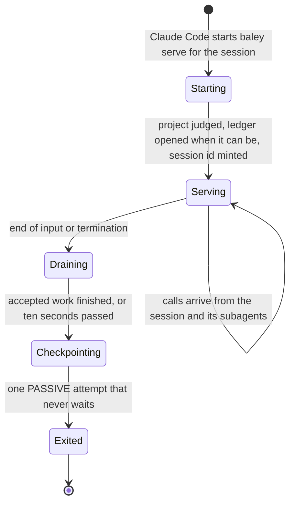
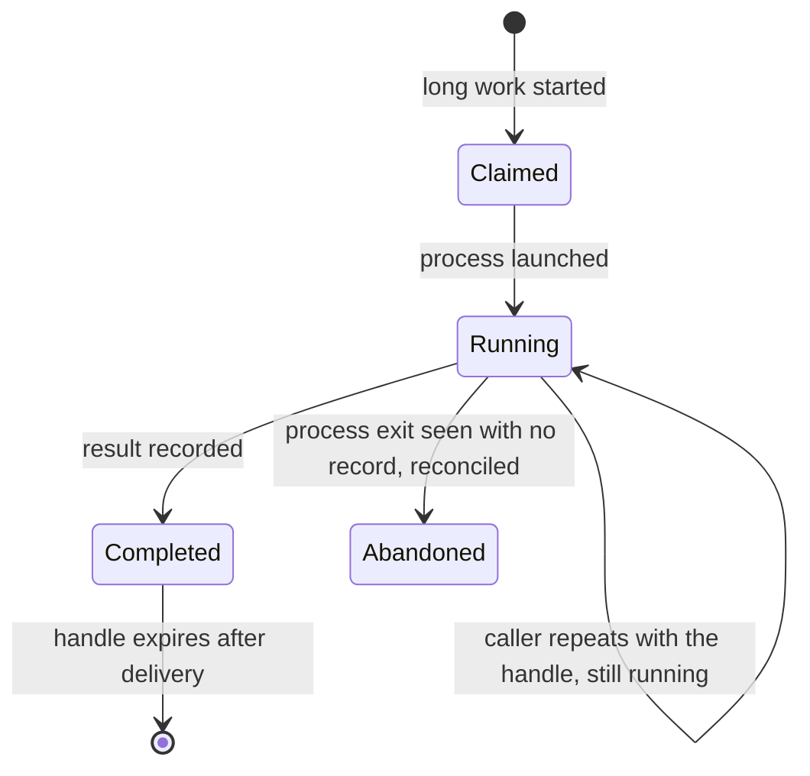
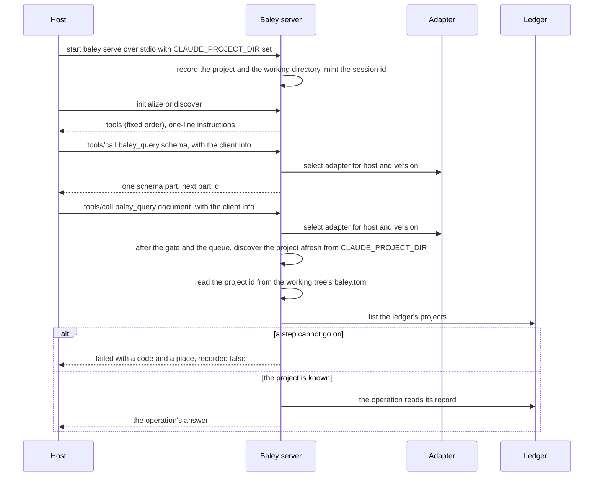
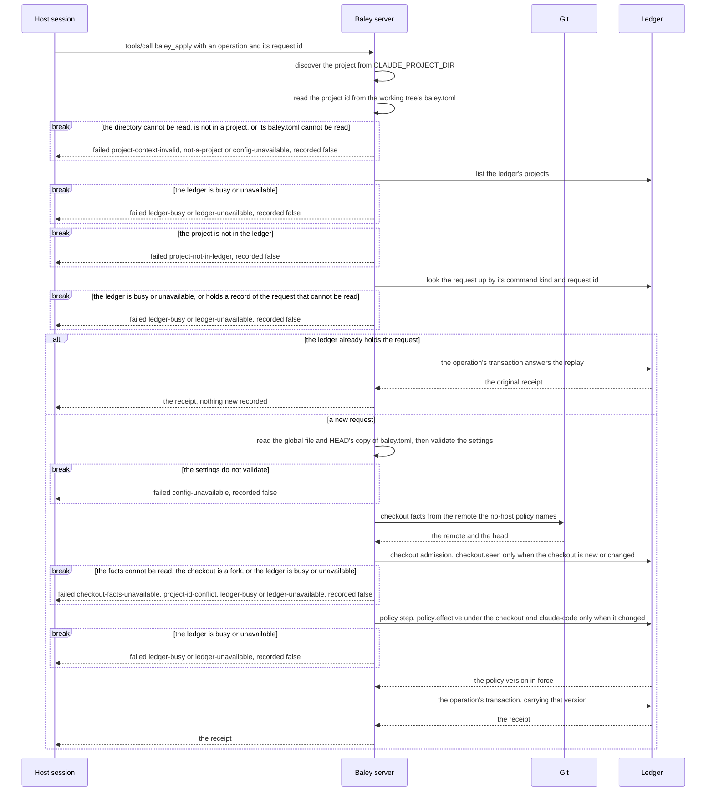
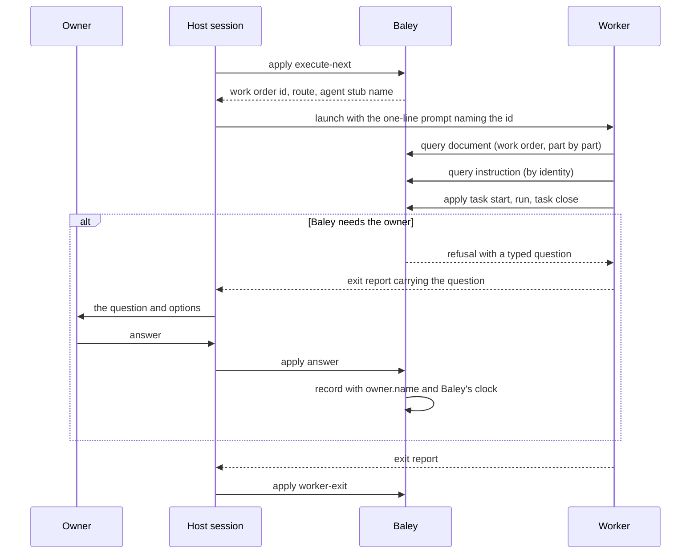
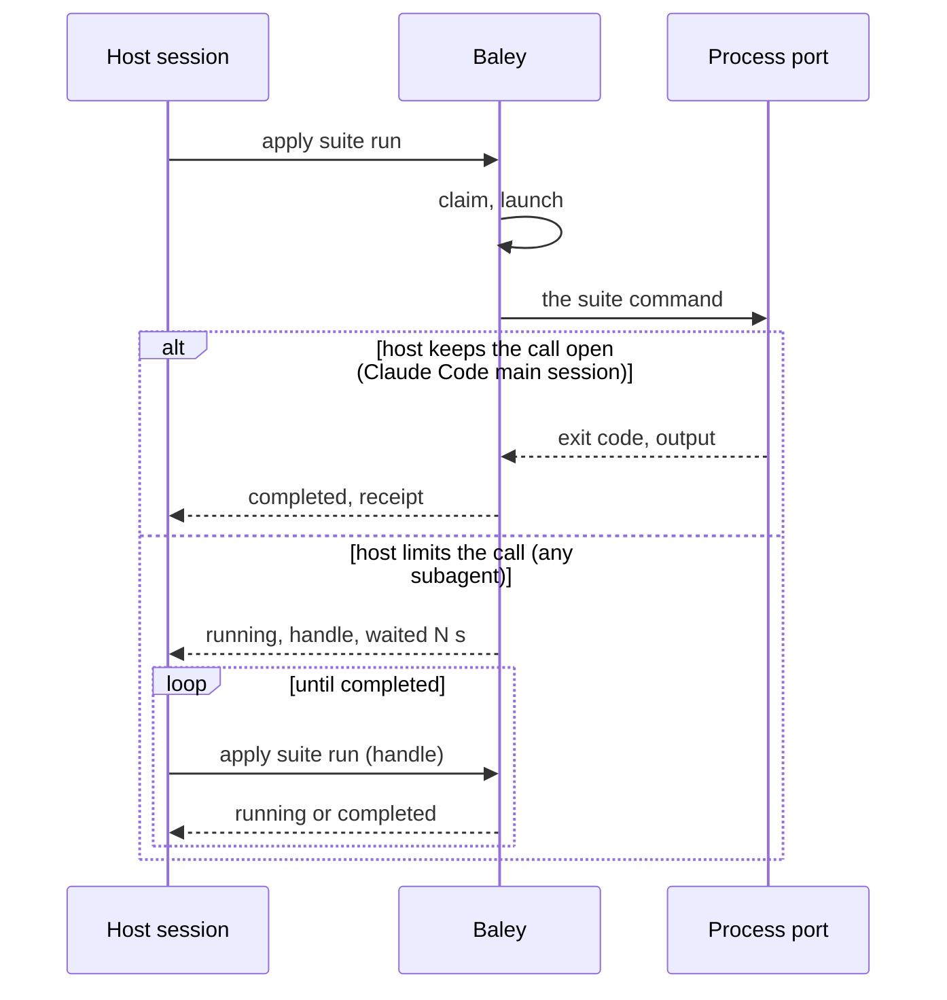
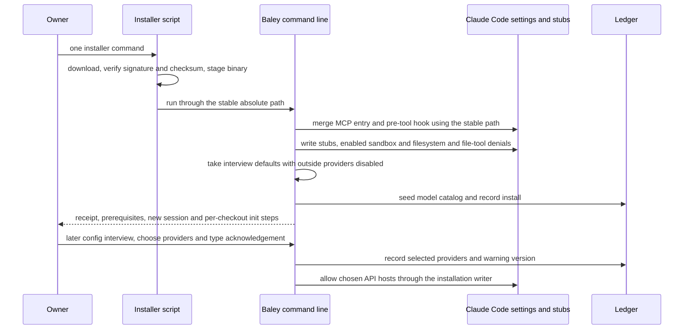
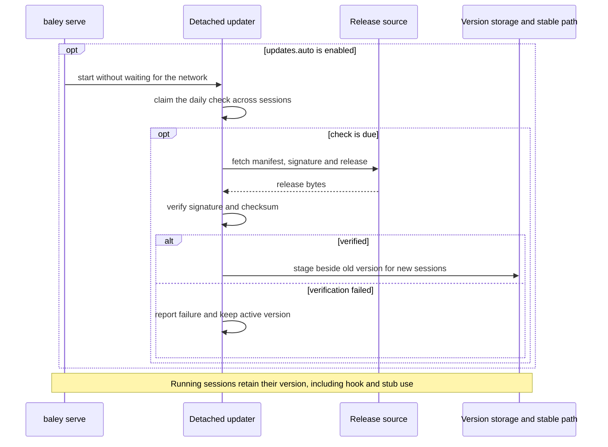

# 0012: Host interface

| | |
|---|---|
| Status | Accepted |
| Design issue | none; build issues [#25](https://github.com/crenshawdev/baley/issues/25), [#127](https://github.com/crenshawdev/baley/issues/127), [#14](https://github.com/crenshawdev/baley/issues/14) (install) |
| Requirement prefix | HST |
| Applies | [0002: System design](0002-system-design.md) |
| Related | ADRs: [0008](../adr/0008-host-sandbox-isolation.md), [0009](../adr/0009-served-instructions.md), [0011](../adr/0011-one-shared-server.md), [0012](../adr/0012-optimistic-concurrency.md), [0027](../adr/0027-vendor-folders-and-plain-keys.md), [0028](../adr/0028-one-http-stack.md), [0033](../adr/0033-host-security-bar.md), [0034](../adr/0034-one-server-per-session.md), [0038](../adr/0038-installer-and-opt-in-updates.md), [0039](../adr/0039-session-owned-provider-credentials.md) · C4 view: components ([0002](0002-system-design.md) Figure 4) |

The current design of this area, and nothing else. Edit it in place when the design changes; git holds the history. It describes the design only, never the work still to do.

## 1. Purpose and scope

This area decides every way a host, a worker or the owner reaches Baley, and how Baley reaches back:

- the per-session server: its stdio connection, protocol revisions, the project it serves and the bounded queue its calls share;
- the host adapter: how Baley knows which host is connected and what that host can do;
- the wire: the tools, the operation contract, refusals, bounded reads by identity, long work;
- how Baley's questions reach the owner and how the owner's answers are recorded;
- served instructions and the stubs a host loads: skills and per-rung agent definitions, written at install;
- the command line;
- install, updates and doctor: delivery, registration, hook, sandbox and stubs, on Claude Code.

It does not decide the content of any instruction (each area owns its own), the settings ([0003](0003-configuration-and-routing.md)), the guard's decisions ([0010](0010-guard.md)), or how Baley's release artifacts are built and published ([#14](https://github.com/crenshawdev/baley/issues/14)).

Hand-offs: every area's operations are served here; the work order composer ([0002](0002-system-design.md) section 8) hands this area the work orders to deliver; [0003](0003-configuration-and-routing.md) gives the route and the host alias tables; [0010](0010-guard.md) gives the hook's decisions; the ledger records every call's refusal or receipt.

In the component view of [0002](0002-system-design.md) (Figure 4) this area is the host interface component and the host adapter among the ports.

## 2. Terms

| Term | Meaning |
|---|---|
| Host | Claude Code, the program the owner works in, whose session starts workers as subagents and connects to Baley over MCP. |
| Session | One host conversation, with its own Baley server over stdio. |
| Worker | A subagent the host session starts for one work order. It shares its session's connection. |
| Server | The Baley process a session starts: one per session, over stdio, serving the session and its subagents. |
| Adapter | The per-host code that knows what a host can do and translates: how a work order is launched, how effort is passed (the rung's own level, run at the model's highest supported level at or below it, HST-R12), how a question reaches the owner, how a long call behaves, how an answer is shaped. |
| Client info | What a host sends when it connects: its name and version. |
| Operation | One typed request under the `query` or `apply` tool, named by a string that is only ever added, never renamed or removed. |
| Refusal | A typed answer that a request was not done, with a code and a place. |
| Identity | The name by which a record or an instruction is read. A record is read by a kind plus keys, and an instruction by its short name, such as `bal-help`. Neither is ever a path. |
| Part | One bounded piece of a served record or instruction, at most 24,576 bytes, with the identity of the next part. |
| Work order | The complete dispatch for one worker ([0002](0002-system-design.md) section 8), read by id. |
| Stub | A file a host needs on disk to list or launch something, rendered by Baley at install from its tables: frontmatter and one line pointing at Baley. |
| Relay | The host session putting Baley's question to the owner and returning the answer. |
| Elicitation | The MCP request by which a server asks the host to show the person a form. |

## 3. Requirements

| Id | Rule | Why | Depends on | Status |
|---|---|---|---|---|
| HST-R1 | Each Claude Code session starts its own Baley server over stdio, and that server serves the session and its subagents (SYS-R1). It answers MCP revisions 2025-11-25 and 2026-07-28 and advertises no other, since those are the two it has been tested on (SYS-R2). | Every session reaches the same record through the store, and the owner starts and keeps running nothing. | SYS-R1, SYS-R2 | Active |
| HST-R2 | Withdrawn. Claude Code starts one stdio server per session. Install has no service or launcher choice ([ADR 0034](../adr/0034-one-server-per-session.md)). | A session owns its server. | SYS-R3 | Withdrawn |
| HST-R3 | Withdrawn. No shared server is started or joined, and there is no idle exit. A server lives for its session and takes its project from the session environment ([ADR 0034](../adr/0034-one-server-per-session.md)). | The host starts the server. | SYS-R4, CFG-R4 | Withdrawn |
| HST-R4 | Baley identifies the host and version from the client info of each `tools/call` and selects that host's adapter. The info comes from `initialize` in a 2025-11-25 session and from the request's own `_meta` in a 2026-07-28 one, never from an earlier call. Negotiation, discover and `tools/list` serve any well-formed client. A `tools/call` from a missing or unsupported client, `baley_version` included, is answered `failed` with code `unknown-host` before any operation runs, carrying the client info reported, the supported host (`claude-code`) and `recorded: false`. It is never an initialize or protocol error, and an unsupported host is never served at a floor. The name is the client's own report, so the answer states what Baley supports and is no defence. | Baley supports a host only when it meets the security bar, and a new host is a new adapter and an ADR (ADR 0033). | SYS-P8, SYS-P12 | Active |
| HST-R5 | Three tools: `baley_version`, `baley_query` and `baley_apply`. `baley_query` and `baley_apply` requests each name an `operation`, and `baley_version` takes no arguments. Operation names are only ever added. The advertised input schema is a flat object; the full schema of each operation is served by the `schema` operation in parts. A refusal is a typed result with a code and a place, never a protocol error. A server failure that records nothing is a typed `failed` result with a code, a place, `recorded: false` and `retryable`, and is not a refusal or a protocol error either. A protocol error is reserved for a malformed or oversized frame, a missing protocol-required metadata key or an unknown tool. | A small typed wire that the host loads once and never sees change. | SYS-P10 | Active |
| HST-R6 | Every record and every instruction is read by identity, in parts of at most 24,576 bytes, each naming the next part; nothing is sent twice and nothing is echoed back. Source code is never served: workers read it with the host's own tools. Tools are returned in a fixed order with cache hints. | Bounded reads, no scanning, no duplicate bytes in a context. | SYS-P10, ADR 0009 | Active |
| HST-R7 | The project comes from the session's `CLAUDE_PROJECT_DIR`, which the server reads once when it starts (CFG-R4). Every project call first judges its own arguments, and a refusal there is answered before anything is prepared. The call then discovers its project afresh from that directory, and no call argument, working directory or project field selects it. The call needs the project in this machine's ledger. The server records the working directory it started in beside the project, and a directory that differs from the project is valid. A read appends nothing. After the project check, a write runs, in order, the replay lookup, the settings read and validation, checkout admission, and the policy step under the host's key, then its own command with the version the step returned. Checkout admission, the step and the command are recorded as the actor `baley`, with the call's caller and the server's time. The server records with every write the caller value of [design 0001's event envelope](0001-evidence-ledger.md#events): the host, the Baley session the server minted, the call identity and its source, the client version and the host's own session when the host supplies them and, for a worker, its work order id. The `tools/call` decisions run one at a time on the server's own worker, behind one bounded queue that the session and its subagents share: one call running, four waiting and 16 MiB of raw frame bytes among them. A call past either bound is answered `failed` with code `server-overloaded`, which is retryable, before anything is prepared (SYS-R5). | Every call is tied to its project and session without asking the host for more, a read cannot change the record, and a write is checked the way the command line checks one. The record says who did what. | SYS-R5, CFG-R4 | Active |
| HST-R8 | Long work (a suite, a check, a landing step) is claimed and started, and the call answers when the host allows it: on a host that keeps a main-session call open past its foreground limit, the call returns on completion; everywhere else the call returns a handle and `still running` after a bounded wait, and the caller repeats the call with the handle until it completes. The adapter chooses; the work runs the same either way, and a handle survives a session's reconnect. | Hosts limit how long a tool call may run; the work must not. | SYS-R7 | Active |
| HST-R9 | Baley's questions to the owner are returned in the tool result as typed questions with their options; the host session puts them to the owner and returns the answer through the answering operation, deciding nothing itself. Where the adapter has proven elicitation reaches the person (a main session on Claude Code), it may use it for the same questions with the same records. Every answer is recorded with `owner.name` and Baley's clock. | The owner answers, the session relays, the record holds the answer. | SYS-P5, CFG-R8 | Active |
| HST-R10 | The owner's identity on every approval is `owner.name` from the global settings, asked by the interview and defaulting to git `user.name`; the time is Baley's clock when the approval arrives. A session never supplies either. | One owner, one clock. | SYS-P5 | Active |
| HST-R11 | Every instruction a model sees is compiled into the binary and served by identity in parts; each carries a version and a hash, recorded as instruction evidence in the caller of every event a work-order or front-door call appends. There is no disk loader and no owner override. | One source of every instruction, provable after the fact. | SYS-P9, ADR 0009 | Active |
| HST-R12 | Claude Code loads only stubs, written by `baley install` from the binary's tables into Claude Code's user-level locations, without a plugin, never committed and never hand-edited (the guard denies the write): a skill stub per front door (frontmatter plus one line naming the operation that returns the instructions), and an agent definition stub per role and rung (frontmatter with model and effort plus one line pointing at Baley), because the host reads effort from the definition. A rung's stub carries that rung's own effort level, since Claude Code's map is the identity map (CFG-R15). Support depends on the model: Claude Code runs a level a model does not support as the highest supported level at or below it (Opus and Sonnet 4.6 have no `xhigh`), and a model without effort (Haiku) gets none, recorded as not applicable and never a made-up level. The work order's route records the requested rung and the effective level apart (CFG-R17), from a dated per-model table of supported levels whose source is Claude Code's model configuration documentation (https://code.claude.com/docs/en/model-config#adjust-effort-level). An alias not yet resolved, or a host cap on effort, stays recorded as unknown until observed. `RungMap` is unchanged. Build 4's first dispatch task builds the table and the records, and the owner reviews the initial table in its pull request. `baley install` renders the stubs for each version. Updates activate them for new sessions only, alongside that version's wiring (HST-R17); `baley doctor` checks them byte for byte against the version they serve. | Roles and rungs are Baley's tables; what a host needs on disk follows from them and cannot drift. | ADR 0009, CFG-R12, CFG-R15, CFG-R17 | Active |
| HST-R13 | The server's MCP instructions field holds one line naming the `help` operation and nothing else. | Claude Code cuts or hides it; the stubs carry the entry points. | | Active |
| HST-R14 | A work order is delivered as its id and route; the host session launches the worker Baley names with the agent stub and the one-line prompt naming the id; the worker reads its work order from Baley by id. The session changes nothing in it. | Baley hands the model everything; the session relays. | SYS-P2 | Active |
| HST-R15 | Release 1 outside reviews use provider APIs only. Baley builds the request and work order with the address, header and environment variable name. The session sends it with the owner's environment key and returns the raw response through `review return`; Baley parses and checks it. Model lists follow the same session-fetch boundary, or the owner uses `baley models add` or `baley models import <provider>`. Baley never reads, stores or sends a key, makes no model call and has no `baley exec` or output scrubber. | Responsibility and credentials stay with the session ([ADR 0039](../adr/0039-session-owned-provider-credentials.md)). | SYS-R9, SYS-R11, CFG-R20, CFG-R27, REV-R4 | Active |
| HST-R16 | The command line serves the owner: `baley init`, `project`, `scope`, `story`, `backlog`, `phase`, `plan`, `verify`, `review`, `land`, `milestone`, `release`, `undo`, `pause`, `resume`, `stop`, `config`, `models`, `install`, `update`, `doctor`, `verify-ledger`, `export`, `help`. Every command answers with a receipt or a refusal with a code; the same operations are reachable over MCP where a session needs them. The execution operations also have an owner command-line entry ([0006](0006-execution.md), spelling left to Build 5). The owner never starts `serve`: Claude Code does, once per session. | One way in for a person, the same rules as the wire. | | Active |
| HST-R17 | One installer command verifies and places the binary behind `~/.local/bin/baley`, then runs `baley install`. No npm or plugin is used. The binary writes the user-level MCP entry, the GRD-R1 pre-tool hook, stubs, sandbox settings and `Read` and `Edit` deny rules, with every executable reference at one absolute stable path. It preserves separately owned settings and registrations. The sandbox is enabled, fails if unavailable, permits no unsandboxed command retry, and denies reads and writes of the resolved home and config folder under `sandbox.filesystem`. Only the chosen providers' API hosts are added for provider access, with no key folder or `~/.codex` exception. Install takes interview defaults, seeds the model catalog without a provider call and records the result. Provider use requires CFG-R28's typed acknowledgement later. Updates are opt-in, off by default, checked at most daily by a detached process started by `baley serve`, never by the guard or within its budget. Each download is signature-verified and staged beside the old version behind the stable path, effective for new sessions only. Manual `baley update` is always available. `baley doctor` checks the installed result and reports fixes. There is no session-start hook. | One command installs the complete wiring, and updates preserve running sessions ([ADR 0038](../adr/0038-installer-and-opt-in-updates.md)). | ADR 0008, ADR 0009, ADR 0033, ADR 0039, CFG-R11, CFG-R28 | Active |
| HST-R18 | A call that fails without recording anything itself, a store failure included, is answered `failed` with a code, a place, `recorded: false` and `retryable`, never as an MCP error or a refusal. `retryable` is true only for `server-overloaded` and a busy ledger (`ledger-busy`). Checkout admission and the policy step are separate transactions, as on the command line, so a checkout admission recorded before a later step failed stays recorded, and a retry records nothing more for an unchanged checkout. A refusal judged from an `apply` call's own arguments (its shape, request id, kind, text or instruction identity) is answered before preparation and records nothing, so a corrected retry may reuse the request id. A refusal judged against the ledger's state, such as `no-such-phase`, is recorded with its command. `request-id-reuse` is judged against the ledger too, but records nothing, because its request id already names a recorded request. A refusal that cannot be recorded is answered as a server failure, not a refusal. | The model self-corrects on a refusal and retries only what can succeed unchanged; the record never lies about a refusal. | SYS-P10, EVD-R26 | Active |
| HST-R19 | Frames are bounded (4 MiB raw for the whole frame, depth 128) before the protocol layer sees them. A frame over either bound is discarded to its newline and answered with a JSON-RPC error, and the connection keeps serving. Hook input is bounded (64 KiB). Every child process Baley starts for its own work runs with a deadline through the process port: its caller's registered deadline, or, for the guard's git callers, a timeout of at most 5 seconds that the guard's budget chose from the time it has left ([0010](0010-guard.md), GRD-R14). | No caller can exhaust the server. | SYS-R5 | Active |
| HST-R20 | On Claude Code, each of the three tool descriptors carries `_meta["anthropic/alwaysLoad"]: true`, so the main session and every subagent see the tools without a tool search, whatever the registration says. | Every capability reaches every agent. | SYS-P12 | Active |
| HST-R21 | MCP prompts are served on Claude Code as a second entry point for the front doors, listing the same commands the skill stubs list. | A host that lists prompts as commands gets them without a file. | HST-R12 | Backlog |
| HST-R22 | Skills over MCP (`io.modelcontextprotocol/skills`) replaces the skill stub files on a host that supports it. | The spec's own extension has ADR 0009's shape. | ADR 0009 | Backlog |

## 4. Roles and actors

| Actor | Receives | Returns | Model and effort from |
|---|---|---|---|
| Owner | The command line's receipts and refusals; questions relayed by the session | Commands; answers | Not applicable |
| Host session | Tool results; work orders to launch; questions to relay | Tool calls; launched workers; the owner's answers | Not applicable |
| Worker | Its work order by id; served instructions and records in parts | Typed results through `apply` | The route in its work order ([0003](0003-configuration-and-routing.md)): the rung's own effort level, recorded apart from the level the model runs at (HST-R12) |
| Host adapter (port) | The client info; a work order; a question; a long call | The host-specific mechanism for each | Not applicable |
| Baley server | Its session's calls, from the session and its subagents | Results, parts, refusals and `failed` answers | Not applicable |

## 5. Commands and operations

### baley_version (tool)

- **Inputs:** none.
- **Outputs:** `version`, `os` and `arch` of the running binary.
- **Refusals:** `unknown-host`, a `failed` answer for a client that is missing or unsupported (HST-R4), and `invalid-arguments` for any argument.

### baley_query (tool)

- **Inputs:** `operation` and its typed arguments; an optional `part`.
- **Outputs:** the operation's typed result, or one part with the next part's identity.
- **Refusals:** `unknown-operation`, `operation-unavailable` (a spelling an earlier server served, naming the build that replaces it), `invalid-arguments` (the reason names the field), plus the operation's own codes. A project that cannot be prepared is not a refusal: the call is answered `failed`, from the table under `baley_apply`.

Query operations are the reads of every area: `help`, `schema`, `document` (a record by identity: capture, work order, plan, story, phase, run, review, verification, roadmap row), `document-search`, `instruction` (an instruction by identity), `progress`, `next` ([0013](0013-next-action-and-progress.md)), `why`, `recall`, `search` ([0014](0014-support-families.md)), `route`, `status` operations per area.

`help` takes an optional command `name`, `schema` takes `tool` and `for`, `instruction` takes `identity`, and `document` takes `identity` as `{kind, id}`, such as `{"kind": "capture", "id": "<capture id>"}`. Each takes an optional one-based `part`. An answer that fits in 24,576 bytes comes whole. A larger one comes in parts, each carrying `bound`, `part`, `body` and `next`, where `next` is the next part's number, or null on the last part, and joining the bodies in order gives the answer's bytes. The bound counts body bytes, not the encoded result, and the tool result carries each answer both as text and as structured content. `instruction` answers with the text and its identity, version and hash. `document` answers a capture's text, whole or in parts, and the whole answer and every part carry the identity with the capture's kind, phase, byte count and recording time. When the project released the capture's body, it answers a tombstone with the purge's reason instead. The refusals are `instruction-unavailable`, which names the build that owns an identity not yet served, `unknown-instruction` for any other identity, `no-such-capture` for a capture id the project does not hold, `help-part-not-found`, `schema-part-not-found`, `instruction-part-not-found` and `document-part-not-found` for a part that does not exist, and `invalid-arguments` for a field the shape lacks, so an `instruction` field, the identity a session sends on `baley_apply`, is refused on any read, `document` included. `help`, `schema` and `instruction` need no project, `document` needs one, and no read records anything.

### baley_apply (tool)

- **Inputs:** `operation`, a request id, which is a UUID in lowercase hyphenated form, and its typed arguments. `capture` also takes `instruction`, the identity of the instruction the session follows.
- **Outputs:** the operation's typed receipt; a replay of the same request id returns the same receipt.
- **Refusals:** as `baley_query`, plus `request-id-reuse` (same id, different payload), which records nothing, and the operation's own codes. A request id in any other form is refused `invalid-arguments` naming `request_id`. The registry judges `instruction`, and an unknown identity or one not served is refused `unknown-instruction` or `instruction-unavailable` naming `instruction`, with nothing recorded.

Apply operations are the writes of every area, each named in its document: scope, story, phase and plan operations (0004, 0005); execution operations (0006); verification operations (0007); review operations (0008); risk operations (0009); landing, milestone, release, undo, pause (0011); capture, task, debug, spike (0014); `answer` (the owner's answer to a relayed question); `worker-exit`; `round-record`.

### Failed answers of a project call

Before a project read or write runs its operation, the server prepares it (section 8). A step that cannot go on answers `failed` with a code, a place and `recorded: false`. These join the `failed` answers the gate gives before preparation: `unknown-host`, `server-overloaded`, `project-context-missing` (`CLAUDE_PROJECT_DIR` is not set) and `caller-invalid`. The gate answers `project-context-invalid` too, for a variable that was unusable when the server started, and preparation answers it for a directory that cannot be read now.

| Code | Place | Retryable | Answered | The owner's step | First reached by |
|---|---|---|---|---|---|
| `project-context-invalid` | `CLAUDE_PROJECT_DIR` | no | read and write | Restore the project directory, which was removed after the server started. | Build 3 T8, `capture` and `document` |
| `not-a-project` | `CLAUDE_PROJECT_DIR` | no | read and write | Run `baley init` in the repository, or start the session inside one that holds a `baley.toml`. | Build 3 T8, `capture` and `document` |
| `config-unavailable` | `settings` | no | read and write | Repair the settings file the reason names. A read judges only the working tree's `baley.toml`, and a write also judges the global file and HEAD's copy. | Build 3 T8, `capture` and `document` |
| `project-not-in-ledger` | `project` | no | read and write | Run `baley init` in the checkout, which ties its project to this machine's ledger. | Build 3 T8, `capture` and `document` |
| `ledger-busy` | `ledger` | yes | read and write | None. The caller repeats the same call. | Build 3 T8, `capture` and `document` |
| `ledger-unavailable` | `ledger` | no | read and write | Run `baley doctor`. A server whose ledger could not be opened at start needs a new session once the ledger opens. | Build 3 T8, `capture` and `document` |
| `checkout-facts-unavailable` | `git` | no | write only | Fix the git fault the reason names, such as a remote that cannot be read. | Build 3 T8, `capture` |
| `project-id-conflict` | `checkout` | no | write only | Run `baley init --new-id` in the fork's checkout, which gives it its own project. | Build 3 T8, `capture` |

`recorded: false` means the call recorded nothing itself. A write's `ledger-busy` or `ledger-unavailable` answered at the policy step can follow a checkout admission that stays recorded, and a retry records nothing more for an unchanged checkout.

### Long-call handle

- **Inputs:** an apply operation that starts long work; later, the same operation with the handle.
- **Outputs:** `completed` with the receipt, or `running` with the handle and how long the call waited.
- **Refusals:** `unknown-handle`, `handle-expired` (HST-R8).

### Installer and baley install

The owner runs one installer command. The script fetches the platform release, verifies its signature and checksum, stages the version behind `~/.local/bin/baley` and invokes `baley install`. Linux and macOS are supported. Missing Linux sandbox prerequisites (`bubblewrap` or `socat`) are reported with the fix, never treated as a successful protected install. A new Claude Code session loads the wiring; each checkout still needs the owner's `baley init`.

- **Inputs:** the host, default `claude-code`, and the resolved Baley folders. The installer and all written executable references use the absolute stable path.
- **Outputs:** user-level MCP registration for `baley serve`, the `baley guard` pre-tool hook with GRD-R1's nine-tool matcher and 10-second timeout, stubs, sandbox and file-tool denials, default settings, catalog seed and `install.recorded`. Existing owner settings and separately owned registrations, including Cadence's, are preserved. Replacement needs evidence of Baley's ownership, never a matching name alone (UPK-R2 in [0015](0015-repository-upkeep-and-build-gate.md)).
- **Receipt:** version, stable path, every installed artifact, checks and any prerequisite still missing, plus the `updates.auto` switch, the manual `baley update` command and `baley config interview` for later choices. A partial install is not reported complete.
- **Refusals:** `unknown-host`, `not-writable` naming the location, an ownership conflict or settings that cannot be safely merged. Signature or checksum failure activates nothing.

The server, hook and owner commands must resolve the same `BALEY_HOME`, `XDG_CONFIG_HOME`, `XDG_DATA_HOME` and `HOME` inputs, and the sandbox paths must match the resulting folders. `doctor` reports disagreement instead of certifying a different, unprotected home.

### Sandbox and provider access

`baley install` merges the following shape into Claude Code's settings, replacing the example paths with the resolved absolute folders. The example shows Linux defaults and both providers selected and acknowledged. Without outside providers, install adds neither API host. Existing unrelated settings and hosts are preserved. The fields follow Claude Code's [sandbox settings](https://code.claude.com/docs/en/sandboxing).

```json
{
  "sandbox": {
    "enabled": true,
    "failIfUnavailable": true,
    "allowUnsandboxedCommands": false,
    "filesystem": {
      "denyRead": [
        "/home/owner/.local/share/crenshawdev/baley",
        "/home/owner/.config/crenshawdev/baley"
      ],
      "denyWrite": [
        "/home/owner/.local/share/crenshawdev/baley",
        "/home/owner/.config/crenshawdev/baley"
      ]
    },
    "network": {
      "allowedDomains": ["api.openai.com", "api.deepseek.com"]
    }
  },
  "permissions": {
    "deny": [
      "Read(//home/owner/.local/share/crenshawdev/baley/**)",
      "Edit(//home/owner/.local/share/crenshawdev/baley/**)",
      "Read(//home/owner/.config/crenshawdev/baley/**)",
      "Edit(//home/owner/.config/crenshawdev/baley/**)"
    ]
  }
}
```

Sandbox filesystem paths use ordinary absolute paths; `Read` and `Edit` rules use `//` for an absolute path. `Edit` covers Write and NotebookEdit. The guard also covers Read, Grep and Glob over the home and config folder, and protects the project file and installed stubs ([0010](0010-guard.md), GRD-R11 and GRD-R13). The settings protect the ledger and configuration. There is no key folder, no provider-tool state exception and no `~/.codex` allowance.

The interview asks which providers to use and applies their API-host allowances through the same installation writer after a typed acknowledgement ([0003](0003-configuration-and-routing.md), CFG-R28). It states: Baley never reads your keys. Every program Claude Code starts can see keys in your environment, agents and subagents included. Nothing scrubs a key a command prints. Your code goes to the chosen provider under its terms. The acknowledgement is recorded in the ledger and asked again when the warning changes. An install using defaults does not acknowledge it.

### baley update

Manual update is available whether `updates.auto` is on or off. With it on, `baley serve` starts a detached update process at startup. A shared check record limits checks to at most once per day across sessions. The session server does not wait for the network, and the guard never starts or waits for an update.

The updater authenticates the signed checksum manifest and verifies the archive before staging the new version beside the old. Failure leaves the active version in place and reports the cause. The stable path, stubs and hook wiring activate the new version for new sessions only. Existing sessions keep their binary and instruction version. Fresh hook processes must respect this boundary too; a stable link alone does not establish it. Old versions remain while running sessions need them. Activation records the new version's shipped catalog seed without a provider call (CFG-R19). The receipt reports the staged version and when it takes effect. Under [ADR 0034](../adr/0034-one-server-per-session.md), an old server can become read-only after a newer binary raises the ledger epoch.

### baley doctor

Reports the stable binary path and version, MCP entry, hook matcher and timeout, stubs and their hashes, resolved folders, sandbox and file-tool denials, chosen provider hosts, current warning acknowledgement and update setting. Each failed or unavailable check names a fix. It reads no key and tests no credential. It distinguishes a running session's version from the version staged for new sessions.

## 6. Records

### install.recorded (event, per-user, `install` stream)

| Field | Type | Meaning |
|---|---|---|
| `host` | `claude-code` | |
| `binary_version` | version | The installed version |
| `binary_path` | absolute path | The stable executable path |
| `registered` | table | Where the MCP registration and the hook were written |
| `stubs` | list | Path and hash of every stub rendered |
| `sandbox` | table | Resolved protected paths, provider hosts and the settings written |
| `defaults` | table | Settings defaults applied, with no synthetic provider acknowledgement |
| `updates` | table | Opt-in state and staged version, if any |

### The caller on every recorded event

Every event a call records carries one `caller` in its envelope, hashed with the event. [Design 0001's Events table](0001-evidence-ledger.md#events) holds the exact keys, values and limits. The caller has two forms.

- The server form is what the server records for a request. It holds the project directory, the working directory, the host, the Baley session the server minted, and the call identity: the request's JSON-RPC id, with its source. It may also hold the client version, the host's own session id, a work order id and instruction evidence.
- The hook form is what the guard hook records for a tool call. It holds the host, the working directory and the call identity: Claude Code's tool-use id, with its source. It may also hold the project directory, the host's own session id, a work order id and instruction evidence. It has no Baley session, so a hook cannot claim one.

The guard hook fills the hook form on every record it makes in the per-user project `user` ([0010](0010-guard.md) section 6): Claude Code as the host, the hook's working directory and the call's `tool_use_id`, with `CLAUDE_PROJECT_DIR` as given and the host's session when the call has them. It sets no work order id or instruction evidence, and a call with no `tool_use_id`, or with a text the form refuses, is not recorded at all.

Instruction evidence is a list of entries, each an instruction's identity, version and hash. A session sends only an instruction's identity, as `instruction` on a `baley_apply` call. The server takes the version and hash from its compiled registry, and refuses an identity the registry does not serve. Reading an instruction records nothing. Every text is checked when the caller is built and again when it is read back, and each has a byte limit. A command-line command and a reconciliation have no caller: the envelope has no `caller` key, and a caller is never `null`. No caller enters a request digest or request key, so a replay records nothing and the original caller stays on the event the request first produced. The server's preparation fills the server form on checkout admission, the policy step and the prepared command ([section 8](#8-workflows)), and [section 11](#11-build-status) says which operations reach it.

### long_call (table, not an event)

Handle, operation, request id, claim, started at, state, result reference.

### Views

| View | Key | Content |
|---|---|---|
| `install` | user, host | The current install record and the last doctor result |

The update check record is shared across session starts and holds the last check time and staged version. Provider risk acknowledgements are the per-user records in [0003 section 6](0003-configuration-and-routing.md#6-records), not inferred from an install receipt.

## 7. States


```mermaid
stateDiagram-v2
  [*] --> Starting: Claude Code starts baley serve for the session
  Starting --> Serving: project judged, ledger opened when it can be, session id minted
  Serving --> Serving: calls arrive from the session and its subagents
  Serving --> Draining: end of input or termination
  Draining --> Checkpointing: accepted work finished, or ten seconds passed
  Checkpointing --> Exited: one PASSIVE attempt that never waits
  Exited --> [*]
```

*Figure 1. States of a session's server. While the connection is open only SQLite's own automatic checkpoint runs, every 1,000 pages: there is no idle checkpoint timer, and the server ends only when its input ends or it is told to terminate.*


```mermaid
stateDiagram-v2
  [*] --> Claimed: long work started
  Claimed --> Running: process launched
  Running --> Completed: result recorded
  Running --> Running: caller repeats with the handle, still running
  Running --> Abandoned: process exit seen with no record, reconciled
  Completed --> [*]: handle expires after delivery
```

*Figure 2. States of a long call.*

## 8. Workflows


```mermaid
sequenceDiagram
  participant H as Host
  participant S as Baley server
  participant A as Adapter
  participant L as Ledger
  H->>S: start baley serve over stdio with CLAUDE_PROJECT_DIR set
  S->>S: record the project and the working directory, mint the session id
  H->>S: initialize or discover
  S-->>H: tools (fixed order), one-line instructions
  H->>S: tools/call baley_query schema, with the client info
  S->>A: select adapter for host and version
  S-->>H: one schema part, next part id
  H->>S: tools/call baley_query document, with the client info
  S->>A: select adapter for host and version
  S->>S: after the gate and the queue, discover the project afresh from CLAUDE_PROJECT_DIR
  S->>S: read the project id from the working tree's baley.toml
  S->>L: list the ledger's projects
  alt a step cannot go on
    S-->>H: failed with a code and a place, recorded false
  else the project is known
    S->>L: the operation reads its record
    S-->>H: the operation's answer
  end
```

*Figure 3. A session starting its server and making calls. The second call is a project read. After the gate and the queue it discovers the project from the session's `CLAUDE_PROJECT_DIR`, reads the project id from the working tree's `baley.toml` and checks that the ledger lists it, then the operation answers. A read stops there and appends nothing. Any step before the answer that cannot go on is answered `failed` with `recorded: false` (section 5).*


```mermaid
sequenceDiagram
  participant H as Host session
  participant S as Baley server
  participant G as Git
  participant L as Ledger
  H->>S: tools/call baley_apply with an operation and its request id
  S->>S: discover the project from CLAUDE_PROJECT_DIR
  S->>S: read the project id from the working tree's baley.toml
  break the directory cannot be read, is not in a project, or its baley.toml cannot be read
    S-->>H: failed project-context-invalid, not-a-project or config-unavailable, recorded false
  end
  S->>L: list the ledger's projects
  break the ledger is busy or unavailable
    S-->>H: failed ledger-busy or ledger-unavailable, recorded false
  end
  break the project is not in the ledger
    S-->>H: failed project-not-in-ledger, recorded false
  end
  S->>L: look the request up by its command kind and request id
  break the ledger is busy or unavailable, or holds a record of the request that cannot be read
    S-->>H: failed ledger-busy or ledger-unavailable, recorded false
  end
  alt the ledger already holds the request
    S->>L: the operation's transaction answers the replay
    L-->>S: the original receipt
    S-->>H: the receipt, nothing new recorded
  else a new request
    S->>S: read the global file and HEAD's copy of baley.toml, then validate the settings
    break the settings do not validate
      S-->>H: failed config-unavailable, recorded false
    end
    S->>G: checkout facts from the remote the no-host policy names
    G-->>S: the remote and the head
    S->>L: checkout admission, checkout.seen only when the checkout is new or changed
    break the facts cannot be read, the checkout is a fork, or the ledger is busy or unavailable
      S-->>H: failed checkout-facts-unavailable, project-id-conflict, ledger-busy or ledger-unavailable, recorded false
    end
    S->>L: policy step, policy.effective under the checkout and claude-code only when it changed
    break the ledger is busy or unavailable
      S-->>H: failed ledger-busy or ledger-unavailable, recorded false
    end
    L-->>S: the policy version in force
    S->>L: the operation's transaction, carrying that version
    L-->>S: the receipt
    S-->>H: the receipt
  end
```

*Figure 4. A project write, in the order the server prepares it. A request the ledger already holds goes straight to the operation's transaction, which keeps the final say on a replay, so a retry is answered with its receipt even when the settings no longer validate (HEAD's copy or the merge), but not when the working tree's `baley.toml` can no longer give the project id. A refusal ends preparation at its step: it answers `failed` with `recorded: false`, and a fork records nothing in the project. Checkout admission and the policy step are separate transactions, as on the command line, so a failure at the step leaves the admission's `checkout.seen` recorded. The guard takes none of this route.*


```mermaid
sequenceDiagram
  participant O as Owner
  participant H as Host session
  participant S as Baley
  participant W as Worker
  H->>S: apply execute-next
  S-->>H: work order id, route, agent stub name
  H->>W: launch with the one-line prompt naming the id
  W->>S: query document (work order, part by part)
  W->>S: query instruction (by identity)
  W->>S: apply task start, run, task close
  alt Baley needs the owner
    S-->>W: refusal with a typed question
    W-->>H: exit report carrying the question
    H->>O: the question and options
    O->>H: answer
    H->>S: apply answer
    S->>S: record with owner.name and Baley's clock
  end
  W-->>H: exit report
  H->>S: apply worker-exit
```

*Figure 5. Delivering a work order and relaying a question.*


```mermaid
sequenceDiagram
  participant H as Host session
  participant S as Baley
  participant P as Process port
  H->>S: apply suite run
  S->>S: claim, launch
  S->>P: the suite command
  alt host keeps the call open (Claude Code main session)
    P-->>S: exit code, output
    S-->>H: completed, receipt
  else host limits the call (any subagent)
    S-->>H: running, handle, waited N s
    loop until completed
      H->>S: apply suite run (handle)
      S-->>H: running or completed
    end
  end
```

*Figure 6. A long call.*


```mermaid
sequenceDiagram
  participant O as Owner
  participant I as Installer script
  participant B as Baley command line
  participant HC as Claude Code settings and stubs
  participant L as Ledger
  O->>I: one installer command
  I->>I: download, verify signature and checksum, stage binary
  I->>B: run through the stable absolute path
  B->>HC: merge MCP entry and pre-tool hook using the stable path
  B->>HC: write stubs, enabled sandbox and filesystem and file-tool denials
  B->>B: take interview defaults with outside providers disabled
  B->>L: seed model catalog and record install
  B-->>O: receipt, prerequisites, new session and per-checkout init steps
  O->>B: later config interview, choose providers and type acknowledgement
  B->>L: record selected providers and warning version
  B->>HC: allow chosen API hosts through the installation writer
```

*Figure 7. One-command installation and later provider selection. The installer delivers the binary, and the binary writes all wiring. Default setup never supplies the provider risk acknowledgement.*


```mermaid
sequenceDiagram
  participant S as baley serve
  participant U as Detached updater
  participant R as Release source
  participant V as Version storage and stable path
  opt updates.auto is enabled
    S->>U: start without waiting for the network
    U->>U: claim the daily check across sessions
    opt check is due
      U->>R: fetch manifest, signature and release
      R-->>U: release bytes
      U->>U: verify signature and checksum
      alt verified
        U->>V: stage beside old version for new sessions
      else verification failed
        U->>U: report failure and keep active version
      end
    end
  end
  Note over S,V: Running sessions retain their version, including hook and stub use
```

*Figure 8. Opt-in update checking starts from `baley serve`, detached from the server and never from the guard. Manual `baley update` uses the same verification and activation path without the automatic-check switch.*

## 9. Settings

| Setting | Type | Default | Scope | Owner | Effect |
|---|---|---|---|---|---|
| `updates.auto` | bool | `false` | global | 0012 | Enable at-most-daily detached checks from `baley serve` (HST-R17) |
| `owner.name` | text | git `user.name` | global | 0012 | The owner recorded on every approval (HST-R10) |
| `[host.<name>]` sections | see [0003](0003-configuration-and-routing.md) | | both | 0003 | Per-host overrides the adapter applies |

No setting selects, loads or overrides an instruction, because every instruction is compiled in (HST-R11).

## 10. Instructions served

| Instruction | Served to | Carries requirements |
|---|---|---|
| Skill stubs | The host, on disk at install: per front door, frontmatter and one line: "call `baley_query` `instruction` with this identity and follow it" | HST-R12 |
| Agent stubs (Claude Code) | The host, on disk at install: per role and rung, frontmatter with the model and the rung's own effort level, and one line: "read your work order from Baley by the id in your prompt" | HST-R12 |
| Front-door instructions | The host session, by identity: what the command does, which operations it calls, that the owner approves and answers, that the session relays and adjudicates and never decides | HST-R9, HST-R14 |
| Read contract | Every worker and session, by identity: read records and instructions by identity in parts; read source with the host's tools; never search for instructions | HST-R6 |
| Help | The host session and the owner: the list of commands with one line each, each command's availability and owning build, and help's own identity, version and hash | HST-R13, HST-R16 |

The text of every instruction is owned by the area it serves; this area serves it.

Each instruction is compiled into the binary with an identity, a version and a hash. A front door's identity is its help-table name, and the read contract's is `bal-read-contract`. The version is a number pinned beside the text, raised whenever the text changes, and the hash is the lowercase hex SHA-256 of the text, which is every part joined. `instruction` serves the text by identity in parts, and answers an identity whose work is not built yet with the build that owns it. A front door's text asks the session to send its identity as `instruction` on each `baley_apply` call made under it.

## 11. Build status

The library holds the per-session server (`crates/baley/src/mcp/`), and `baley serve` starts it. The same module prepares a project read or write from the session's own project (`crates/baley/src/mcp/prepare.rs`), and two served operations reach it: `capture`, a write, and `document`, a read (`crates/baley/src/mcp/handler.rs:154-179`). The library also holds the guard hook (`crates/baley/src/guard_hook/`), which `baley guard` runs once per tool call ([0010](0010-guard.md) section 11). The binary also holds the inherited engine, parked for Build 9 to delete (`crates/baley/src/inherited.rs:1-4`). Nothing in production reaches it, and its tests still run.

| Requirement | Status | Where |
|---|---|---|
| HST-R1 | Built | `baley serve` runs one stdio server for the session (`crates/baley/src/main.rs:60-61, 186-199`, `crates/baley/src/mcp/serve.rs:125-210`), and it advertises only the two tested revisions (`crates/baley/src/mcp/tools.rs:65-68`, `crates/baley/src/mcp/handler.rs:186-188`) |
| HST-R2, HST-R3 | Withdrawn | Nothing to build: each session starts its own stdio server (ADR 0034) |
| HST-R4 | Built | The 2025 decoder reads `initialize` and the 2026 decoder reads the request's `_meta` (`crates/baley/src/mcp/client.rs:24-40`). The host is selected per call (`crates/baley/src/mcp/client.rs:95-126`, `crates/baley/src/mcp/handler.rs:97-122, 190-198, 227`), and a missing or unsupported client is answered `failed` `unknown-host` before the queue (`crates/baley/src/mcp/gate.rs:71-110, 162-178`). The supported hosts are `Host::ALL` (`crates/baley-core/src/policy/schema.rs:134-140`) |
| HST-R5 | Built | Three tools in a fixed order (`crates/baley/src/mcp/tools.rs:83-120`), append-only operation names, with `instruction` appended last to the query baseline (`crates/baley/src/mcp/operations.rs:127`), held by the expected spellings and the test that checks both baselines against them (`crates/baley/src/mcp/operations.rs:471-584, 597-601`), a flat schema (`crates/baley/src/mcp/tools.rs:122-141`) plus the `schema` operation, which serves each served operation's request shape, the `capture` and `document` shapes included (`crates/baley/src/mcp/operations.rs:290-327, 404-466`, `crates/baley/src/mcp/capture.rs:41-59`, `crates/baley/src/mcp/document.rs:26-49`), and `failed` as its own arm of the envelope (`crates/baley/src/envelope.rs:82-153`). The gate raises a protocol error only for an unknown tool (`crates/baley/src/mcp/gate.rs:77, 153-160`) |
| HST-R6 | Partly built | `help`, `schema`, `instruction` and `document` answer whole, or in parts of at most 24,576 body bytes, through one helper (`crates/baley/src/mcp/parts.rs:5-57`) in the four answers (`crates/baley/src/mcp/operations.rs:335-358, 360-402, 404-466`, `crates/baley/src/mcp/document.rs:136-172`). Instructions are read by identity through `instruction`, and the tools carry a fixed order and cache hints (`crates/baley/src/mcp/tools.rs:70-81`). `document` serves captures by identity, and every part carries the identity and the capture's metadata (`crates/baley/src/mcp/document.rs:39-49, 136-172, 223-290`). Its other identity kinds are their builds', and `document-search` answers `operation-unavailable` until Build 8 (`crates/baley/src/mcp/operations.rs:101, 276-288`). Whether Claude Code delivers a full part whole, given that each answer travels as text and as structured content (about twice the body on the wire), is T12's live measurement |
| HST-R7 | Partly built | The session context is gathered once and judged (`crates/baley/src/mcp/context.rs:20-50, 127-167`), each call's context and caller are formed (`crates/baley/src/mcp/context.rs:222-246, 295-323`), and decisions run one at a time on the worker behind one queue (`crates/baley/src/mcp/queue.rs:15-93`, `crates/baley/src/mcp/worker.rs:80-217`, `crates/baley/src/mcp/admission.rs:28-59`). The port holds the caller value (`crates/baley-store/src/caller.rs:569-576`), `Work::push` stamps the command's caller on every event it appends (`crates/baley-store-sqlite/src/transact.rs:854-888`) and the `event.caller` column stores it (`crates/baley-store-sqlite/src/schema.rs:51`). Preparation finds the project afresh from the caller's project directory and checks that the ledger lists it, and a write goes on to the replay lookup, the settings, checkout admission and the policy step in that order. The plan is pure and the entry performs each step it asks for (`crates/baley/src/mcp/prepare.rs:263-415, 426-548`). Checkout admission and the step take the call's caller and the server's time and record as Baley (`crates/baley/src/checkout/admit.rs:52-93, 212-243`, `crates/baley/src/checkout/mod.rs:77-101`, `crates/baley/src/policy_step/mod.rs:16-46`, `crates/baley/src/policy_step/record.rs:24-66, 129-160`), and `run_decision` hands the operation the ledger, the host, the caller and the server's time (`crates/baley/src/mcp/handler.rs:58-71, 125-152`). `capture` and `document` carry `needs_project: true` (`crates/baley/src/mcp/operations.rs:100, 168, 200-208`) and reach preparation from their arms in `handler::operate` (`crates/baley/src/mcp/handler.rs:154-179`): each judges its arguments first, then `capture` prepares a write and `document` a read (`crates/baley/src/mcp/capture.rs:247-292`, `crates/baley/src/mcp/document.rs:185-218`). Every event a `capture` call appends, checkout admission's, the policy step's and its own, carries the caller with its instruction evidence attached (`crates/baley/src/mcp/capture.rs:167-180, 258-274`). The guard hook fills the hook form on every record it makes in `user` (`crates/baley/src/guard_hook/unrecordable.rs:12-41`, `crates/baley/src/guard_hook/record.rs:190-200`) |
| HST-R8 | Not built | Only the parked engine runs a suite inside one call (`crates/baley/src/execution_service.rs:275-287`, `crates/baley/src/execution/runner.rs:972-1005`). The session server answers the execution operations as unavailable (`crates/baley/src/mcp/operations.rs:131-198`) until Build 5, so no call it serves runs a suite |
| HST-R9, HST-R10 | Not built | The parked engine holds owner questions as gate records answered by `execution-authorize` with any non-blank owner and time (`crates/baley/src/execution_service.rs:364-500`). The session server answers that operation as unavailable (`crates/baley/src/mcp/operations.rs:131-198`) until Build 5 |
| HST-R11 | Partly built | The compiled registry gives every instruction an identity, a version and a SHA-256 hash pinned beside its text (`crates/baley/src/instruction/mod.rs:65-210`, `crates/baley/src/help/front_door.rs:6-13`, `crates/baley/src/instruction/read_contract.rs:7-14`, `crates/baley/src/instruction/capture.rs:4-12`). A test fails when a text changes without its version and hash (`crates/baley/src/instruction/tests.rs:86-142`). The lookup reads no file, environment variable or setting (`crates/baley/src/instruction/mod.rs:212-227`). `bal-help`, `bal-read-contract` and `bal-capture` are served, and every other front door answers unavailable naming its build (`crates/baley/src/instruction/mod.rs:65-210`). `bal-read-contract` is served at version 2, which names the `document` read of a capture (`crates/baley/src/instruction/read_contract.rs:10, 23`). The caller has a place for each instruction's identity, version and hash (`crates/baley-store/src/caller.rs:273-298`), and the registry turns a session's identity into instruction evidence carrying its own version and hash (`crates/baley/src/instruction/mod.rs:229-246`). `capture` attaches that evidence to the caller it prepares under, so every event of a `capture` call carries it (`crates/baley/src/mcp/capture.rs:130-143, 167-180, 258`). The other front doors' writes and the work-order calls are their builds' |
| HST-R12 | Not built | Instruction render commands still print full skills (`crates/baley/src/main.rs:138-175`). There is no stub installer or version activation. The guard accepts a stub-path list through T11's placement seam, empty until T15 installs it (`crates/baley/src/protected_paths/write.rs:13-27`, `crates/baley/src/guard_hook/context.rs:76-131`). Build 4 owns the effort table and route records. |
| HST-R13 | Built | The initialize instructions are one line naming `help` (`crates/baley/src/mcp/tools.rs:52-63`, asserted at `crates/baley/src/mcp/tools.rs:226-232`) |
| HST-R14 | Not built | The parked engine builds a dispatch answer of an id and a route, never a prompt (`crates/baley/src/execution/boundary.rs:93-147`). The session server answers `execute-next` as unavailable (`crates/baley/src/mcp/operations.rs:114`) until Build 5 |
| HST-R15 | Not built | `baley exec` still reads and injects a key and redacts output (`crates/baley/src/exec.rs`). The binary's HTTPS model lister still reads credentials (`crates/baley/src/detection/lister.rs`). Their removal is unassigned. The parked review engine also holds its own provider calls (`crates/baley/src/review/provider/credentials.rs`). Build 4 owns the session review work order and raw-response parser. |
| HST-R16 | Partly built | The CLI has `serve`, which Claude Code starts and the owner does not, `guard`, which runs the library hook for Claude Code's pre-tool call (`crates/baley/src/main.rs:123`, `crates/baley/src/guard_hook/mod.rs:36-150`), `skill-description`, the render commands, the ledger commands (`verify`, `doctor`, `export`, `purge`, `scrub`, `rebuild`, `anchor`, `acknowledge-restore`), `exec`, `init`, `config` (`show`, `set` and `interview`) and `models` (`list`, `add`, `remove` and `update`) (`crates/baley/src/main.rs:23-94`). It has no `service` command, and the other commands are later builds. |
| HST-R17 | Not built | `hooks/hooks.json:3-14` holds a hand-written nine-tool `PreToolUse` entry with a 10-second timeout. No installer, `baley install`, updater or install record is built. Delivery is decided by ADR 0038; T14 to T17 implement and qualify it. The provider warning and acknowledgement are not built, and removal of the built key paths is unassigned. |
| HST-R18 | Built | The `failed` answer is built: a code, a place, `recorded: false` and `retryable`, returned as a successful tool result (`crates/baley/src/envelope.rs:82-153`, `crates/baley/src/mcp/gate.rs:66-69`). The server uses it for `unknown-host` (`crates/baley/src/mcp/gate.rs:162-178`), `server-overloaded` (`crates/baley/src/mcp/admission.rs:50-59`) and the project and caller faults (`crates/baley/src/mcp/gate.rs:112-151`). Only `server-overloaded` and `ledger-busy` are retryable (`crates/baley/src/envelope.rs:105-114`). Preparation answers each fault as `failed`: its codes and places (`crates/baley/src/mcp/prepare.rs:34-56`, `crates/baley-core/src/policy/parse.rs:16`, `crates/baley-core/src/checkout/judge.rs:12`), the answers a store failure, a git fault and a fork get (`crates/baley/src/mcp/prepare.rs:217-261`, `crates/baley/src/checkout/mod.rs:22-63`) and where the plan raises each (`crates/baley/src/mcp/prepare.rs:263-415`). A ledger that could not be opened at start answers `ledger-unavailable` (`crates/baley/src/mcp/serve.rs:66-93`). Checkout admission and the policy step are separate transactions, so a checkout admission recorded before a later step failed stays recorded (`crates/baley/src/mcp/prepare.rs:1-13`). `capture` answers a store fault `failed`, `ledger-busy` as retryable and any other as `ledger-unavailable`, answers bytes that were purged before `failed` `text-purged`, not retryable, and answers `request-id-reuse` as a refusal that records nothing (`crates/baley/src/mcp/capture.rs:294-348`). `document` maps its read faults the same way (`crates/baley/src/mcp/document.rs:226-290`). A capture's argument refusals are answered before preparation and record nothing (`crates/baley/src/mcp/capture.rs:85-165, 253-257`), and a named phase is refused `no-such-phase` inside the capture's transaction and recorded as a refused `command.completed` (`crates/baley/src/mcp/capture.rs:200-215`) |
| HST-R19 | Partly built | The decoder bounds a whole frame at 4 MiB and its depth at 128 (`crates/baley/src/mcp/frame.rs:14-18, 153, 246`). A frame over a bound or not JSON is discarded to its newline and answered with a JSON-RPC error while reading goes on (`crates/baley/src/mcp/frame.rs:470-493`, `crates/baley/src/mcp/transport.rs:52-73, 218-247`). Hook input is bounded (`crates/baley/src/hook_input/mod.rs:19-21`, `crates/baley/src/guard_hook/mod.rs:50-61`). Every git child runs with a deadline that `validate_launch` enforces (`crates/baley/src/process.rs:233-274`, `crates/baley/src/git_process.rs:49-99`): a caller outside the guard only at its exact registered deadline, and the guard's two callers, for the branch and for HEAD's copy of `baley.toml`, only at the timeout a budget grant gave the launch, above zero and at most 5 seconds, in their own process group. Only a grant sets that timeout, so one set by hand is refused (`crates/baley/src/process.rs:128-138`, `crates/baley/src/guard_budget.rs:33-115`). The suite runner's `sh -c` (`crates/baley/src/execution/runner.rs`) runs with none, owned by Build 5, and the still-built `baley exec` has no deadline. Its removal is unassigned under ADR 0039. |
| HST-R20 | Built | Each descriptor carries the marker (`crates/baley/src/mcp/tools.rs:83-120`, asserted at `crates/baley/src/mcp/tools.rs:186-196`) |

## 12. Open questions

| Question | Settled by |
|---|---|
| Whether elicitation reaches the person from a subagent on Claude Code | A probe on Claude Code before the adapter may choose it (HST-R9) |
| The report file formats Baley reads beside the exit code, per language | The process port's first languages, recorded in [0006](0006-execution.md) |
| Which signature format and verifier authenticate the signed checksum manifest? | The release design [#14](https://github.com/crenshawdev/baley/issues/14) and the implementing build task, which must name any new dependency before adding it. Verification probably needs a new dependency; none is selected here. |
| How do fresh hook processes and stub reads retain a running session's version across stable-path activation? | Build 3 T14 and T15, qualified by T17. A changed link alone does not prove new-session-only activation. |
| Which build removes the built key reader, `baley exec` and HTTPS model lister and adds provider acknowledgement? | John Crenshaw must assign it. Removal is unassigned at the seams named in [0003 section 12](0003-configuration-and-routing.md#12-open-questions). |
