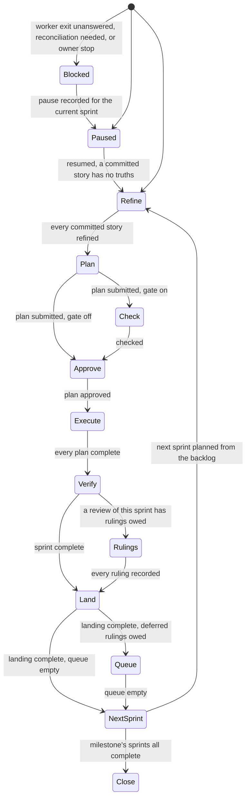
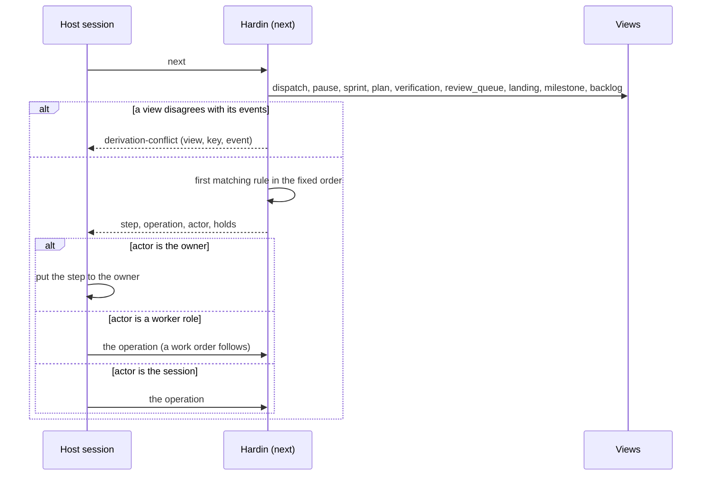
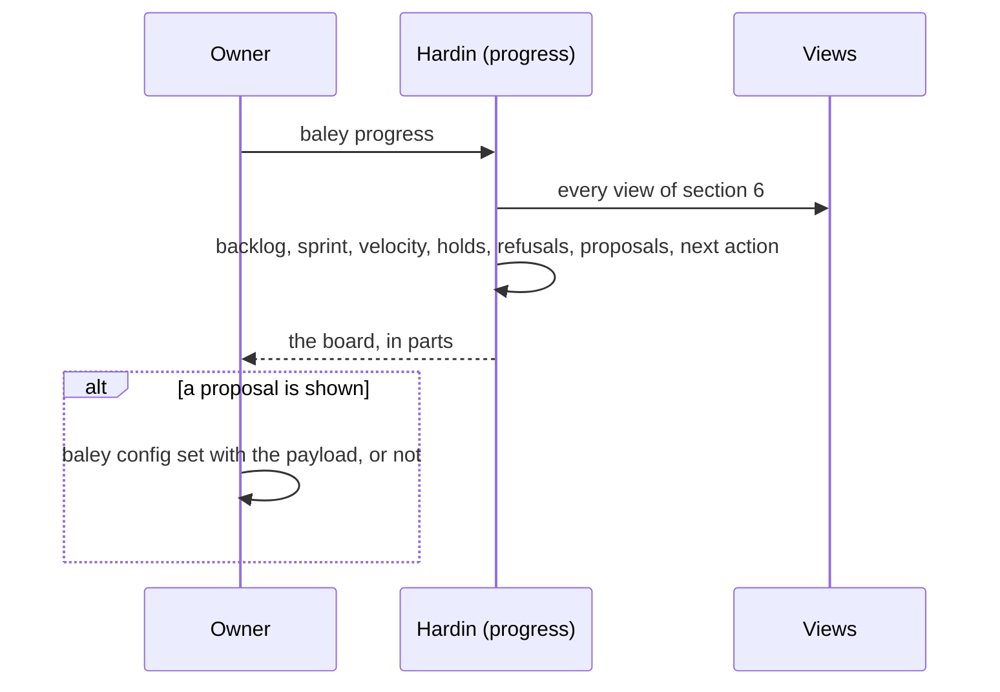

# 0013: Next action and progress

| | |
|---|---|
| Status | Draft |
| Design issue | none; build issue [#28](https://github.com/crenshawdev/baley/issues/28) |
| Requirement prefix | NXT |
| Applies | [0002: System design](0002-system-design.md) |
| Related | ADRs: [0001](../adr/0001-event-ledger.md), [0005](../adr/0005-storage-port.md) · C4 view: components ([0002](0002-system-design.md) Figure 4) |

The current design of this area, and nothing else. Edit it in place when the design changes; git holds the history. It describes the design only, never the work still to do.

## 1. Purpose and scope

This area is Hardin's front: it decides how Baley answers "where are we" and "what happens next":

- the derivation of state from the ledger's views, and the refusal when a record and a view disagree;
- the next-action rules, in one fixed order, and what each names;
- progress: the backlog, the active sprint, velocity, what is held and why;
- the read-only proposal `suggest` makes from the record;
- the dashboard, as a later renderer over the same answers.

It does not decide any state itself: every status it reports is derived by the area that owns it (story and sprint states in [0004](0004-starting-a-project-and-changing-scope.md) and [0005](0005-context-plans-and-acceptance.md), plans and dispatches in [0006](0006-execution.md), truths and completion in [0007](0007-verification.md), reviews in [0008](0008-review.md), landings, milestones and pauses in [0011](0011-milestones-landing-undo-pause.md)). It does not decide how the answer reaches a host ([0012](0012-host-interface.md)).

Hand-offs: every area projects the views this area reads; the host session calls `next` and `progress` and relays; the dashboard ([Backlog](#3-requirements)) renders what `progress` answers.

In the component view of [0002](0002-system-design.md) (Figure 4) this area is Hardin's query face.

## 2. Terms

| Term | Meaning |
|---|---|
| Derived state | A status computed from the ledger's views at the moment of the question, never stored as a fact of its own. |
| Current sprint | The active sprint (0005): the one with committed stories that is not complete or withdrawn. |
| Next action | The one step Baley names as what may happen now, with the operation that does it and who acts (owner, session, worker). |
| Held | A step that may not happen yet, with the record that holds it named. |
| Disagreement | A view that says one thing and the events that say another; a refusal, never repaired in place. |
| Velocity | Tasks completed per closed sprint, shown as a fact. |
| Proposal | A setting change `suggest` derives from the record, with the payload the owner may apply through `config set`. |

## 3. Requirements

| Id | Rule | Why | Depends on | Status |
|---|---|---|---|---|
| NXT-R1 | Every status Baley reports is derived from views at the time of the question; no status is stored as its own record. A query never writes. | State is a question the binary answers, not a file it keeps. | SYS-P4, EVD-R9 | Active |
| NXT-R2 | Next action reads only views (`backlog`, `sprint`, `plan`, `dispatch`, `verification`, `review_queue`, `landing`, `pause`, `guard`), never a walk over events; a decision that grants authority confirms its facts against events inside its own transaction (EVD-R27), which is the acting area's job, not this one's. | Fast answers from derived data; authority from the truth. | EVD-R9, EVD-R27 | Active |
| NXT-R3 | Next action is one fixed order of rules, first match wins: (1) an unanswered worker exit or a checkout needing reconciliation ([0006](0006-execution.md) EXE-R16, EXE-R17); (2) an owner stop in force ([0011](0011-milestones-landing-undo-pause.md) LND-R17); (3) a pause recorded for the current sprint (resume); (4) in the current sprint: a committed story with no truths (refine), no plan (plan), a plan awaiting its check or the owner's approval, a plan to execute, all plans complete and no current verification (verify), rulings owed on a review of this sprint, a landing in progress (its next step); (5) the deferred review queue with rulings owed ([0008](0008-review.md) REV-R11); (6) no current sprint: a milestone whose sprints are all complete (close), else sprint planning from the backlog (plan the next sprint), else, with an empty backlog, refine the backlog. | One answer, always the same for the same record. | PLN-R7, VER-R12, REV-R11, LND-R12 | Active |
| NXT-R4 | Each answer names the step, the operation that performs it, who acts (owner, session or a worker role), and, when the step is held, every record holding it. A step is never named as possible when its area would refuse it. | The session relays a step it can actually take. | SYS-P2 | Active |
| NXT-R5 | When a view disagrees with its events (a status the events do not support, a phase the roadmap view lists that no declaration made), the question is refused with `derivation-conflict` naming the view, the key and the event, and nothing is repaired in place; the owner runs `baley verify-ledger --views` ([0001](0001-evidence-ledger.md)). | A wrong view must not become a wrong decision. | EVD-R10 | Active |
| NXT-R6 | `progress` answers, in bounded parts: the backlog in priority order with each story's state, truth count and size; the current sprint with its goal, committed stories, plans and their state, tasks done of total, capacity and size, checks red and green, the suite's last result, reviews and rulings owed, risk state, landing state; the last closed sprints' velocity; every open hold (interrupted dispatch, stop, pause, deferred reviews, unsettled risk, unanswered questions); refusals hit since the last close; and the next action. Nothing in it is a record; every line names the view it came from. | The owner sees the whole board without asking twice. | NXT-R1, NXT-R3 | Active |
| NXT-R7 | `suggest` is read-only: from recorded routes and gate fires it proposes setting changes with a ready payload: two or more escalations on one role propose `roles.<role>.effort` at the rung that succeeded; two or more failed risk adjudications on one trigger propose the next stricter `review.triggers.<t>.gate`. The proposal is shown inside `progress` and by `baley suggest`; the owner applies it through `config set`; Baley never applies it. | The record can advise; the owner decides. | CFG-R11, CFG-R16 | Active |
| NXT-R8 | `why` answers, for a commit, a task, a plan or a story, the events that name it and the decisions they record, joined by the ledger's git facts ([0014](0014-support-families.md) owns the query; this area feeds it the derived state of what it names). | The owner can ask why something is the way it is. | EVD-R4 | Active |
| NXT-R9 | A dashboard renders what `progress` answers, over the same query, and derives nothing of its own. | A second derivation would disagree with the first. | NXT-R6 | Backlog |

## 4. Roles and actors

| Actor | Receives | Returns | Model and effort from |
|---|---|---|---|
| Owner | The progress board; the next action; proposals | Commands; `config set` on a proposal | Not applicable |
| Host session | The next action with its operation and actor | Calls the operation or relays to the owner | Not applicable |
| Baley: Hardin | The question, the caller's project | The derived answer or `derivation-conflict` | Not applicable |
| Views (0001) | | The derived data read | Not applicable |

No worker is dispatched by this area.

## 5. Commands and operations

### next

- **Inputs:** the project (from the caller's working directory); optional sprint.
- **Outputs:** the step, the operation, the actor, the holds; or `nothing` with the reason (an empty backlog and no sprint).
- **Refusals:** `derivation-conflict` (NXT-R5), `not-a-project` (PRJ-R18).

### progress

- **Inputs:** the project; optional `--sprint <n>`, `--backlog`, `--holds`.
- **Outputs:** the board of NXT-R6 in bounded parts.
- **Refusals:** `derivation-conflict`, `not-a-project`.

### suggest

- **Inputs:** the project; optional role or trigger.
- **Outputs:** proposals, each with the evidence (the routes or fires it counted) and the `config set` payload.
- **Refusals:** `not-a-project`.

## 6. Records

Not applicable as writers: this area writes nothing. It reads these views ([0001](0001-evidence-ledger.md) Appendix B, extended by the areas):

| View | Read for |
|---|---|
| `backlog` | Stories, priority, truths, size, sprint |
| `sprint` | Goal, committed stories, plans, capacity, size, tasks done, definition of done |
| `plan` | Approval, check, admission, outcome, deviations, suite, inspections, risk |
| `dispatch` | Active dispatch, tasks, checkpoints, interruption |
| `verification` | Current attempt, truth statuses, waivers, completion |
| `review`, `review_queue` | Rounds, rulings owed, deferred members |
| `landing`, `milestone`, `pause` | Steps done and next; readiness; the active pause |
| `guard` | Recent refusals and asks |
| `policy` | The effective settings and version, for `suggest` |

## 7. States

*Figure 1. The step next action names, derived at each question; there is no stored state behind it.*

## 8. Workflows

*Figure 2. Answering next action.*

*Figure 3. Progress and a proposal.*

## 9. Settings

Not applicable. This area reads no setting of its own; `workflow.skip_discuss` is removed (refinement is never skipped: a committed story without truths is refined first).

## 10. Instructions served

| Instruction | Served to | Carries requirements |
|---|---|---|
| Next stub | The host session: call `next`, then do what it names or put it to the owner; never choose a different step | NXT-R3, NXT-R4 |
| Progress stub | The host session: call `progress` and show the answer unchanged | NXT-R6 |

## 11. Build status

The code today is the Cadence engine crate awaiting rename; its next action derives from `ROADMAP.md` and a memo it writes back.

| Requirement | Status | Where |
|---|---|---|
| NXT-R1 | Not built as designed | A read writes the lifecycle memo into `state.json` (`crates/cadence/src/derivation_service.rs:139-167`) |
| NXT-R2 | Not built | Derivation parses `ROADMAP.md` and lists phase directories (`crates/cadence/src/derivation/capture.rs:120-168`) |
| NXT-R3 | Partly built | Rule order over phases, lowest number first (`crates/cadence/src/next_action/select.rs:54-119, 141-148`); no sprint, story or landing rules |
| NXT-R4 | Partly built | The resolve action tells the owner to hand-edit a roadmap tick (`crates/cadence/src/next_action/select.rs:27`) and points at a `/cad-phase add` that does not exist (`select.rs:36`) |
| NXT-R5 | Built | `derivation-conflict` and `state-conflict` (`crates/cadence/src/derivation/memo.rs:280-326`, `crates/cadence/src/derivation/consistency.rs:14-70`) |
| NXT-R6 | Partly built | Phase rows, record counts, capture bound, next action (`crates/cadence/src/progress/render.rs:14-73`, `crates/cadence/src/progress_service.rs:31-114`); bounded at 24,576 bytes with a refusal instead of parts |
| NXT-R7 | Built | `crates/cadence/src/suggest/rules.rs:4-67`, `crates/cadence/src/suggest_service.rs:91-116` |
| NXT-R8 | Built over Markdown | `why` in `crates/cadence/src/recall` ([0014](0014-support-families.md)) |

## 12. Open questions

| Question | Decided by |
|---|---|
| None | |
