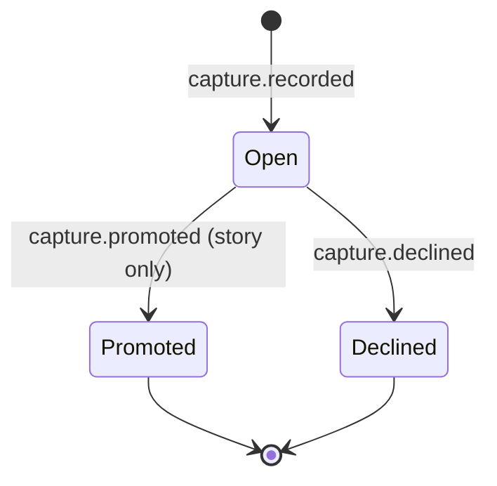
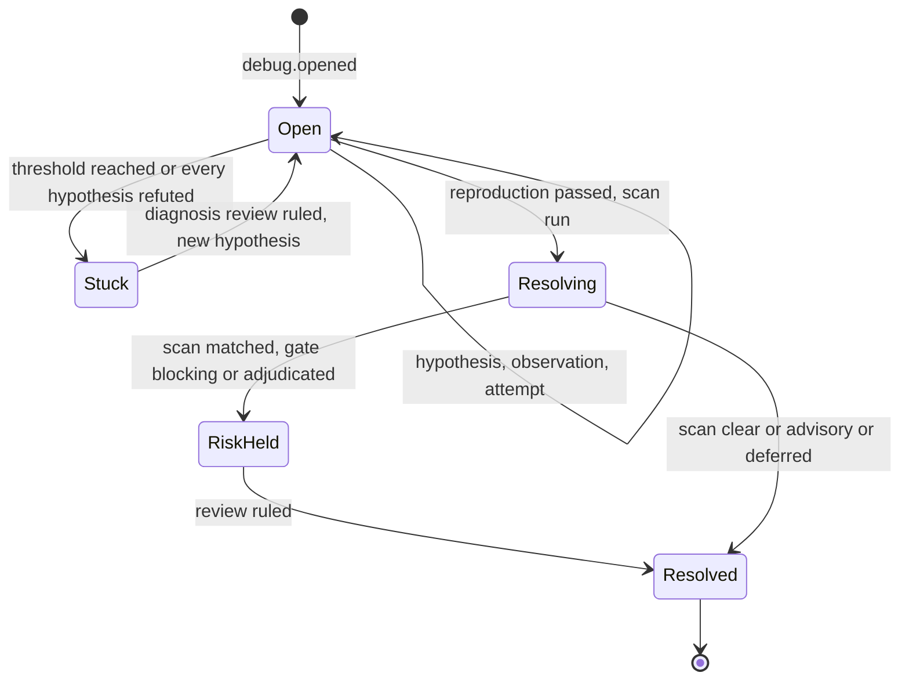
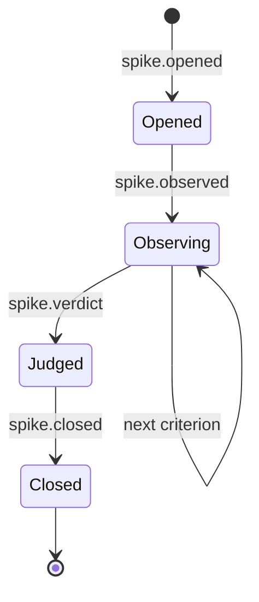
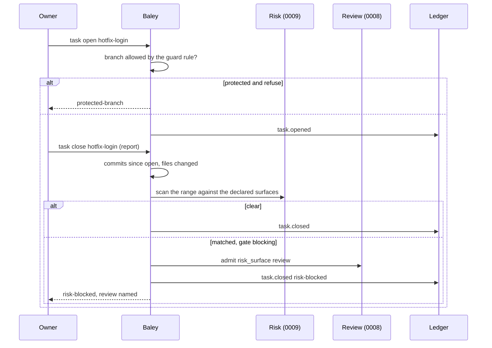
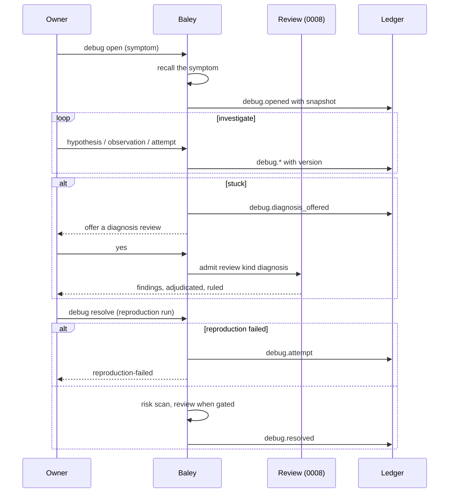

# 0014: Support families

| | |
|---|---|
| Status | Accepted |
| Design issue | none; build issues [#24](https://github.com/crenshawdev/baley/issues/24), [#29](https://github.com/crenshawdev/baley/issues/29) |
| Requirement prefix | SUP |
| Applies | [0002: System design](0002-system-design.md) |
| Related | ADRs: [0006](../adr/0006-no-markdown-records.md), [0009](../adr/0009-served-instructions.md) · C4 view: components ([0002](0002-system-design.md) Figure 4) |

The current design of this area, and nothing else. Edit it in place when the design changes; git holds the history. It describes the design only, never the work still to do.

## 1. Purpose and scope

This area decides the small families that sit beside the sprint loop:

- capture: a note, or a story candidate for the backlog;
- task: the hotfix path, a unit of work outside any sprint;
- debug: an episode with hypotheses, observations and attempts, resolved by a reproduction, with a diagnosis review when it is stuck;
- spike: a question answered by ordered criteria and a verdict, with the throwaway code kept outside the project;
- search and recall over the ledger's own text;
- why: from a commit, task, plan or story to the events that name it;
- help: the compiled command table.

It does not decide the backlog itself ([0004](0004-starting-a-project-and-changing-scope.md)), the risk scan ([0009](0009-risk.md)), the review mechanism a diagnosis uses ([0008](0008-review.md)), the guard's branch rule ([0010](0010-guard.md)), or how the ledger indexes text ([0001](0001-evidence-ledger.md), EVD-R13).

Hand-offs: a `story` capture becomes a requirement through 0004; a task close calls 0009's scan; a stuck debug calls 0008's diagnosis review; `why` reads the commit index of 0001 and the derived state of [0013](0013-next-action-and-progress.md).

In the component view of [0002](0002-system-design.md) (Figure 4) these are domain areas.

## 2. Terms

| Term | Meaning |
|---|---|
| Capture | A short record the owner or a session makes in passing: a `note`, or a `story` candidate. |
| Promotion | Turning a `story` capture into a requirement on the backlog (0004 `requirement declare`). |
| Task (hotfix) | A unit of work outside any sprint: a description, one or a few signed commits, a report, a risk scan at close. |
| Episode | One debug investigation: a symptom, hypotheses, observations, attempts, a resolution. |
| Hypothesis | A candidate cause with a rank reason and a state: untested, testing, refuted, confirmed. |
| Observation | A test of a hypothesis with its result and what it rules in or out. |
| Reproduction | The check that shows the symptom gone; a resolve needs it passing. |
| Stuck | An episode past the attempt threshold or with every hypothesis refuted. |
| Spike | A question, the decision it informs, ordered criteria (given, when, then, failure), one observation each, a verdict. |
| Throwaway location | The directory outside the project where a spike's code lives; never inside the checkout. |
| Recall | Full-text search over the ledger's recorded text: captures, stories, truths, decisions, findings, rulings, reasons. |
| Why | The events that name a commit, task, plan or story, joined by the ledger's git facts. |

## 3. Requirements

| Id | Rule | Why | Depends on | Status |
|---|---|---|---|---|
| SUP-R1 | A capture is one record with a kind, `note` or `story`, non-blank text, an optional sprint, and the caller; it writes no file and makes no commit. A replay of the same request returns the same capture. | Something noticed in passing is kept without ceremony. | ADR 0006, EVD-R26 | Active |
| SUP-R2 | A `story` capture is a backlog candidate: the owner promotes it with `requirement declare` (0004), which records the link, or declines it with `capture decline`. A declined capture is recorded as declined, never offered again and never returned by recall. | The backlog grows only by the owner's hand; what was declined stays declined. | PRJ-R19 | Active |
| SUP-R3 | `planning.max_capture_bullets` bounds the count of open captures (`note` and unpromoted `story`) as a report in progress; crossing it never refuses a capture. | A long list is information, not a wall. | NXT-R6 | Active |
| SUP-R4 | A task is opened with a slug and a description, on the branch the guard's rule allows (a protected branch follows `git.on_protected`); it has no plan, no lease and no truths. It closes with a report and, when commits landed, the risk scan of [0009](0009-risk.md) over its committed range against the declared surfaces; a match under a `blocking` or `adjudicated` gate holds the close until the review is ruled, `advisory` reports, `deferred` queues. A task's commits are signed and conventional. | A hotfix gets the same gate as everything else and nothing more. | RSK-R4, RSK-R5, GRD-R5, EXE-R4 | Active |
| SUP-R5 | A debug episode is opened with a symptom; at open, Baley runs recall on the symptom and records the hits as the episode's snapshot. Hypotheses are added or updated by id with a rank reason; an observation names the hypothesis it tests, its result and what it rules in or out, and moves the hypothesis to confirmed or refuted; attempts are recorded with what was tried. Every write carries the episode's expected version. | The investigation is a record the owner and the next session can read. | SYS-R6 | Active |
| SUP-R6 | An episode resolves only with a passing reproduction, a clean or settled risk scan over its staged or committed change, and, when the gate says so, a ruled review; a failed reproduction is recorded as an attempt. | A fix is proven, not declared. | RSK-R5, REV-R2 | Active |
| SUP-R7 | When an episode is stuck (attempts at or past `debug.attempt_threshold`, default 3, or every hypothesis refuted), Baley offers the owner a review of kind `diagnosis` ([0008](0008-review.md) REV-R14) over the episode's symptom, hypotheses, observations and named files; its findings are adjudicated and ruled like any review. There is no other outside call from debug. | Fresh eyes through the one review path. | REV-R14 | Active |
| SUP-R8 | A spike is opened with a question, the decision it informs, and ordered criteria; the open is immutable. Each criterion gets one observation, in order; the verdict (`validated`, `invalidated`, `inconclusive`) needs every criterion observed and freezes them. Close needs the verdict and an absolute throwaway location outside the project; nothing of the spike is committed to the project. | An experiment is recorded by what it set out to prove and what it found. | ADR 0006 | Active |
| SUP-R9 | Recall is full-text search over the ledger's recorded text, ranked by BM25, bounded by a limit (default 5) with the total count, filtered by sprint or kind when asked, excluding declined captures and everything purged; a blank query is refused. It reads no file and no git history and needs no setting. | The record answers what was said, without an index to keep. | EVD-R13 | Active |
| SUP-R10 | An exact question (a plan, a sprint, a story, a work order, a run) is answered by its typed identity through `document` ([0012](0012-host-interface.md) HST-R6), never by search; Baley serves no code search, and agents read source with the host's tools. | Search is for words; records are fetched by name. | SYS-P10 | Active |
| SUP-R11 | `why <commit or task or plan or story>` answers the events that name it, in order, with the decisions they record (the plan it served, the truth it proved, the finding it fixed, the ruling that allowed it), joined through the ledger's git facts; a commit the ledger never saw is answered as `not-in-record`. Nothing is read from Markdown or git history. | The owner can ask why a change exists and get the record's answer. | EVD-R4 | Active |
| SUP-R12 | `help` lists every command with one line each from the compiled table, and for one name returns its line and up to three closest names. | A user can always ask what exists. | HST-R13 | Active |

## 4. Roles and actors

| Actor | Receives | Returns | Model and effort from |
|---|---|---|---|
| Owner | Capture receipts; task closes with their scan; debug state; the diagnosis offer; spike verdicts; recall hits; why answers | Captures; promotions and declines; task and spike closes; hypotheses and observations; the word to run a diagnosis review | Not applicable |
| Host session | The same operations, relayed | | Not applicable |
| Baley: this area | Requests | Records, scans, refusals | Not applicable |
| Reviewers ([0008](0008-review.md)) | A `diagnosis` review work order | Findings | See 0008 |

No worker of its own is dispatched; the diagnosis review dispatches through 0008.

## 5. Commands and operations

### capture, capture decline, capture list

- **Inputs:** `capture`: kind, text, optional sprint; `decline`: the capture id; `list`: optional kind.
- **Outputs:** the capture record and the open count against the bound; the declined record; the list.
- **Refusals:** `blank-text`, `unknown-kind`, `no-such-phase`, `no-such-capture`, `already-promoted` (a `story` already declared as a requirement) (SUP-R1, SUP-R2).

### task open, task close

- **Inputs:** `open`: slug, description; `close`: slug, report (text or a file path read under the source bound), surfaces when the project has none declared.
- **Outputs:** `open`: the task record and the branch it is on; `close`: the commits and files observed, the scan outcome, the review raised when any, the task's state.
- **Refusals:** `slug-taken`, `protected-branch` (per `git.on_protected`), `surfaces-unanswered`, `risk-blocked` naming the review, `no-such-task`, `report-too-large` (SUP-R4).

### debug open, debug hypothesis, debug observation, debug attempt, debug resolve, debug list, debug read

- **Inputs:** `open`: slug, symptom; `hypothesis`: id, description, rank reason; `observation`: hypothesis, test, result, rules in, rules out; `attempt`: what was tried, result; `resolve`: the reproduction run, the resolution text; `read`: slug.
- **Outputs:** the episode's state and version; at resolve, the scan outcome and any review raised; when stuck, the diagnosis offer.
- **Refusals:** `version-stale`, `no-such-hypothesis`, `reproduction-failed` (recorded as an attempt), `risk-blocked`, `review-pending`, `episode-resolved` (SUP-R5 to SUP-R7).

### spike open, spike observation, spike verdict, spike close

- **Inputs:** `open`: slug, question, decision, criteria; `observation`: criterion, result; `verdict`: the verdict and criteria ids; `close`: throwaway location.
- **Outputs:** the spike's state.
- **Refusals:** `open-mismatch` (re-open with different content), `criterion-order`, `criterion-observed`, `verdict-incomplete`, `location-inside-project`, `no-verdict` (SUP-R8).

### recall

- **Inputs:** the query text; optional limit, sprint, kind.
- **Outputs:** hits (kind, identity, excerpt, score) and the total.
- **Refusals:** `blank-query` (SUP-R9).

### why

- **Inputs:** a commit, task, plan or story.
- **Outputs:** the events in order with their decisions.
- **Refusals:** `not-in-record`, `no-such-plan`, `no-such-story` (SUP-R11, PRJ-R18).

### help

- **Inputs:** optional command name.
- **Outputs:** the table, or one line with closest names (SUP-R12).

## 6. Records

### capture.recorded, capture.promoted, capture.declined (events, `capture` stream)

| Field | Type | Meaning |
|---|---|---|
| `id` | capture id | Digest of request, kind, text, sprint |
| `kind` | `note`, `story` | |
| `text` | text | |
| `sprint` | integer or absent | |
| `by` | actor | Owner or session |
| `requirement` | requirement id | The story it became (promoted) |
| `owner`, `at` | actor, time | (promoted, declined) |

### task events (`task/<slug>` stream)

`task.opened`: slug, description, branch, head at open, owner, time. `task.closed`: commits, files, report (payload reference), scan (as [0009](0009-risk.md) `risk.scanned`), review id when raised, state (`closed`, `risk-blocked`, `review-deferred`).

### debug events (`debug/<slug>` stream)

`debug.opened`: symptom, recall snapshot (hits by identity). `debug.hypothesis`: id, description, rank reason, state. `debug.observation`: hypothesis, test, result, rules in, rules out. `debug.attempt`: tried, result. `debug.diagnosis_offered`: reason (`threshold`, `all-refuted`); `debug.diagnosis_review`: review id. `debug.resolved`: reproduction run, resolution, scan, review id when any. Every event carries the episode version.

### spike events (`spike/<slug>` stream)

`spike.opened`: question, decision, criteria (id, given, when, then, failure). `spike.observed`: criterion, result. `spike.verdict`: verdict, criteria. `spike.closed`: throwaway location.

### Views

| View | Key | Content |
|---|---|---|
| `capture` | project | Open, promoted and declined captures by kind |
| `task` | project, slug | State, commits, scan, review |
| `debug` | project, slug | The episode as it stands, version |
| `spike` | project, slug | Criteria, observations, verdict, close |
| `search` | project | The full-text index over recorded text ([0001](0001-evidence-ledger.md)) |

## 7. States

*Figure 1. States of a capture. A `note` stays Open; it is a record, not a queue item.*

*Figure 2. States of a debug episode.*

*Figure 3. States of a spike.*

## 8. Workflows

*Figure 4. A hotfix task.*

*Figure 5. A debug episode.*

## 9. Settings

| Setting | Type | Default | Scope | Owner | Effect |
|---|---|---|---|---|---|
| `planning.max_capture_bullets` | integer, min 1 | 40 | both | 0014 | Report-only bound on open captures (SUP-R3) |
| `debug.attempt_threshold` | integer, min 1 | 3 | both | 0014 | Attempts before a diagnosis review is offered (SUP-R7) |

`memory.backend` and `review.consult.*` are removed: recall is always available and needs no index, and consult is the `diagnosis` review.

## 10. Instructions served

| Instruction | Served to | Carries requirements |
|---|---|---|
| Capture stub | The host session: record what the owner said, as `note` or `story`, and nothing else | SUP-R1 |
| Task stub | The host session and the agent doing the hotfix: open, commit signed and conventional, close with a report; the scan is Baley's | SUP-R4 |
| Debug stub | The host session: record every hypothesis, observation and attempt as it happens; resolve only with a reproduction Baley ran; accept the diagnosis offer only on the owner's word | SUP-R5 to SUP-R7 |
| Spike stub | The host session: the code lives outside the project; observe each criterion in order; give the verdict | SUP-R8 |
| Help | Everyone: the table | SUP-R12 |

## 11. Build status

The code today is the Cadence engine crate awaiting rename; capture, debug and spike write JSON snapshots and Markdown, recall and why parse Markdown and git history.

| Requirement | Status | Where |
|---|---|---|
| SUP-R1 | Built, three kinds | `crates/cadence/src/capture_service.rs:19-105`, `crates/cadence/src/capture/mod.rs:18-87` |
| SUP-R2 | Not built | No promote or decline operation; the bound counts every capture ever made |
| SUP-R3 | Built | `crates/cadence/src/session/mod.rs:587-594`, `crates/cadence/src/config/mod.rs:68-80` |
| SUP-R4 | Built over `.planning` | `crates/cadence/src/task_service.rs:79-273`; the episode is memory-only without a planning root (`task_service.rs:16-35`) |
| SUP-R5, SUP-R6 | Built | `crates/cadence/src/debug_service.rs:63-211`, `crates/cadence/src/debug/model.rs:7-69, 331-392` |
| SUP-R7 | Built as consult, to be replaced | `crates/cadence/src/debug_service.rs:225-272`, `crates/cadence/src/review/provider/consult.rs:10-76` |
| SUP-R8 | Built | `crates/cadence/src/spike/model.rs:7-221`, `crates/cadence/src/spike_service.rs:23-44` |
| SUP-R9 | Built over Markdown and git | `crates/cadence/src/recall/mod.rs:61-187, 389-501` |
| SUP-R10 | Built | Code search removed (2026-09-24); `document` by identity (`crates/cadence/src/read/document.rs`) |
| SUP-R11 | Built over Markdown | `crates/cadence/src/why/corpus.rs:509-694`, `crates/cadence/src/why_service.rs:23-120` |
| SUP-R12 | Built | `crates/cadence/src/help/table.rs:12-93` |

## 12. Open questions

| Question | Decided by |
|---|---|
| None | |
