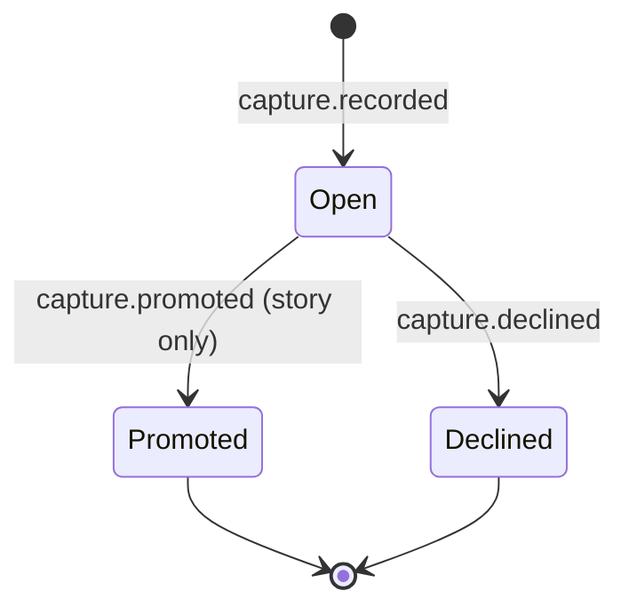
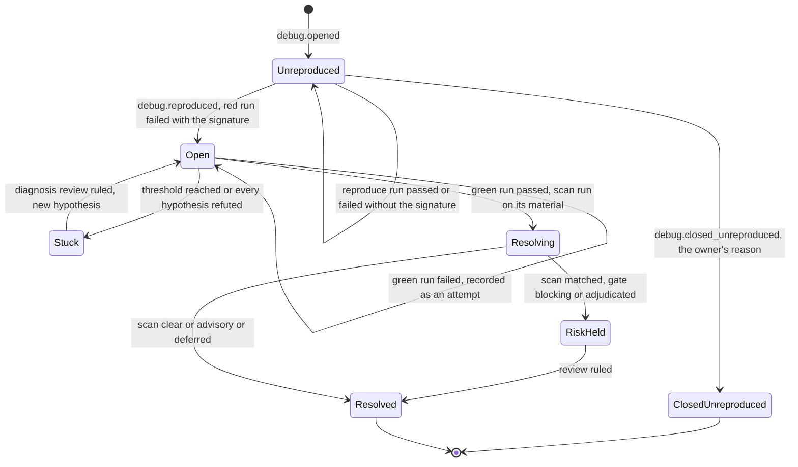
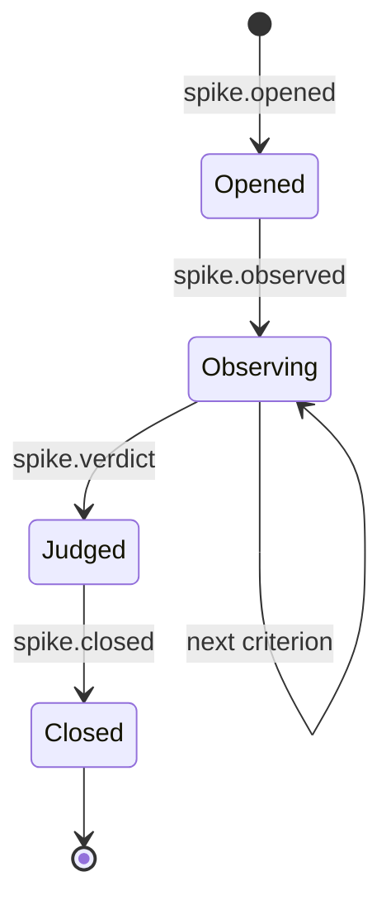
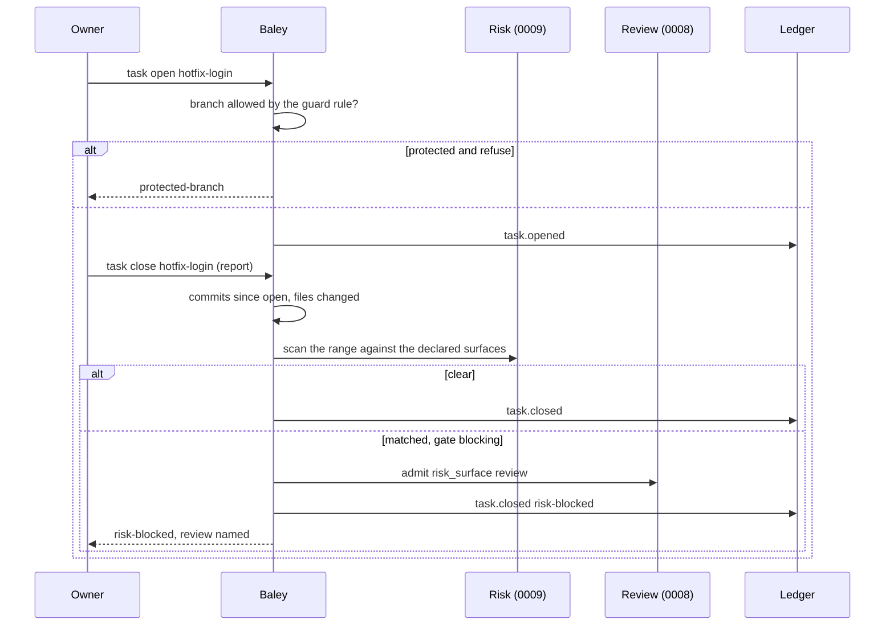
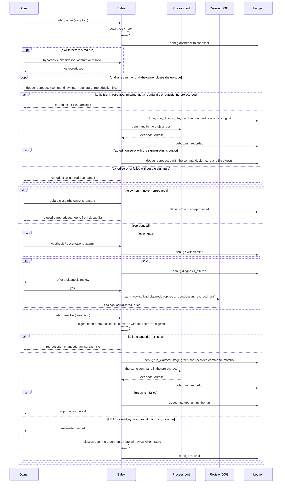

# 0014: Support families

| | |
|---|---|
| Status | Accepted |
| Design issue | none; build issues [#24](https://github.com/crenshawdev/baley/issues/24), [#29](https://github.com/crenshawdev/baley/issues/29) |
| Requirement prefix | SUP |
| Applies | [0002: System design](0002-system-design.md) |
| Related | ADRs: [0006](../adr/0006-no-markdown-records.md), [0009](../adr/0009-served-instructions.md), [0031](../adr/0031-one-term-per-concept.md) · C4 view: components ([0002](0002-system-design.md) Figure 4) |

The current design of this area, and nothing else. Edit it in place when the design changes; git holds the history. It describes the design only, never the work still to do.

## 1. Purpose and scope

This area decides the small families that sit beside the phase loop:

- capture: a note, or a story candidate for the backlog;
- task: the hotfix path, a unit of work outside any phase;
- debug: an episode whose reproduction Baley must first see fail on the symptom, then hypotheses, observations and attempts, resolved when Baley sees the same reproduction, over the same files, pass, with a diagnosis review when it is stuck, or closed by the owner with a reason when its symptom never reproduces;
- spike: a question answered by ordered criteria and a verdict, with the throwaway code kept outside the project;
- search and recall over the ledger's own text;
- why: from a commit, task, plan or story to the events that name it;
- help: the compiled command table.

It does not decide the backlog itself ([0004](0004-starting-a-project-and-changing-scope.md)), the risk scan ([0009](0009-risk.md)), the review mechanism a diagnosis uses ([0008](0008-review.md)), the guard's branch rule ([0010](0010-guard.md)), or how the ledger indexes text ([0001](0001-evidence-ledger.md), EVD-R13).

Hand-offs: a `story` capture becomes a story on the backlog through 0004's `story declare`; a task close calls 0009's scan; a debug reproduction runs through the process port of 0002 (SYS-P8) under claim, act, record ([0001](0001-evidence-ledger.md), EVD-R26), as every command in [0006](0006-execution.md) does; a stuck debug calls 0008's diagnosis review; `why` reads the commit index of 0001 and the derived state of [0013](0013-next-action-and-progress.md).

In the component view of [0002](0002-system-design.md) (Figure 4) these are domain areas.

## 2. Terms

| Term | Meaning |
|---|---|
| Capture | A short record the owner or a session makes in passing: a `note`, or a `story` candidate. |
| Promotion | Turning a `story` capture into a story on the backlog (0004 `story declare`). |
| Task (hotfix) | A unit of work outside any phase: a description, one or a few signed commits, a report, a risk scan at close. |
| Episode | One debug investigation: a symptom, a reproduction, hypotheses, observations, attempts, a resolution. |
| Hypothesis | A candidate cause with a rank reason and a state: untested, testing, refuted, confirmed. |
| Observation | A test of a hypothesis with its result and what it rules in or out. |
| Reproduction | One command that shows the episode's symptom, with its symptom signature and its reproduction files. Baley runs it; it must fail on the symptom before any hypothesis is accepted, and the same command, over the same files, must pass before the episode resolves. |
| Symptom signature | A non-blank piece of text that the reproduction's output contains when the symptom is present, such as an error message or a failing test's name. It is how Baley tells a failure on the symptom from a failure for some other reason. |
| Reproduction files | The files the reproduction command runs that make up the reproduction itself, such as the test file of a test command, a script or a fixture, named by paths relative to the project root. Baley records the digest of each at the red run and compares them at resolve. |
| Red run | The run of the reproduction that exits non-zero with the symptom signature in its output. Until one is recorded the episode is unreproduced. |
| Green run | The run of the same reproduction, at resolve, over reproduction files byte-identical to the red run's, that exits zero. |
| Unreproduced | An episode with no red run yet. It accepts `debug reproduce`, `debug close` and reads, and refuses hypotheses, observations, attempts and resolve. |
| Closed unreproduced | The end of an episode whose symptom never reproduced: the owner's record, with a reason, that it is closed without a red run. It leaves the open debug list and accepts no further write. |
| Stuck | An episode past the attempt threshold or with every hypothesis refuted. |
| Spike | A question, the decision it informs, ordered criteria (given, when, then, failure), one observation each, a verdict. |
| Throwaway location | The directory outside the project where a spike's code lives; never inside the checkout. |
| Recall | Full-text search over the ledger's recorded text: captures, stories, truths, decisions, findings, rulings, reasons. |
| Why | The events that name a commit, task, plan or story, joined by the ledger's git facts. |

## 3. Requirements

| Id | Rule | Why | Depends on | Status |
|---|---|---|---|---|
| SUP-R1 | A capture is one record with a kind, `note` or `story`, non-blank text, an optional phase, and the caller; it writes no file and makes no commit. A replay of the same request returns the same capture. | Something noticed in passing is kept without ceremony. | ADR 0006, EVD-R26 | Active |
| SUP-R2 | A `story` capture is a backlog candidate: the owner promotes it with `story declare` (0004), which records the link, or declines it with `capture decline`. A declined capture is recorded as declined, never offered again and never returned by recall. | The backlog grows only by the owner's hand; what was declined stays declined. | PRJ-R19 | Active |
| SUP-R3 | `planning.max_capture_bullets` bounds the count of open captures (`note` and unpromoted `story`) as a report in progress; crossing it never refuses a capture. | A long list is information, not a wall. | NXT-R6 | Active |
| SUP-R4 | A task is opened with a slug and a description, on the branch the guard's rule allows (a protected branch follows `git.on_protected`); it has no plan, no lease and no truths. It closes with a report and, when commits landed, the risk scan of [0009](0009-risk.md) over its committed range against the declared surfaces; a match under a `blocking` or `adjudicated` gate holds the close until the review is ruled, `advisory` reports, `deferred` queues. A task's commits are signed and conventional. | A hotfix gets the same gate as everything else and nothing more. | RSK-R4, RSK-R5, GRD-R5, EXE-R4 | Active |
| SUP-R5 | A debug episode is opened with a symptom; at open, Baley runs recall on the symptom and records the hits as the episode's snapshot. The episode is unreproduced until its red run is recorded (SUP-R13), and the owner may close it unreproduced (SUP-R16); until then a hypothesis, observation or attempt is refused (`not-reproduced`). After the red run, hypotheses are added or updated by id with a rank reason; an observation names the hypothesis it tests, its result and what it rules in or out, and moves the hypothesis to confirmed or refuted; attempts are recorded with what was tried. Every write carries the episode's expected version. | The investigation is a record the owner and the next session can read, and it starts only once the symptom has been caught. | SYS-R6, SUP-R13 | Active |
| SUP-R6 | An episode resolves only with a green run, a clean or settled risk scan over its staged or committed change, and, when the gate says so, a ruled review. The resolve names no command: Baley runs the reproduction recorded at the red run, the same command byte-identical, over reproduction files whose bytes match the red run's (SUP-R15), and the run must exit zero. A resolve before the red run is refused (`not-reproduced`). A green run that fails is recorded as a run and as an attempt, and the resolve is refused (`reproduction-failed`). The scan covers the material the green run recorded; a HEAD or working tree that moved between the run and the scan refuses the resolve (`material-changed`). | A fix is proven by the same command that caught the bug, against the change being resolved, not declared. | SUP-R13, SUP-R14, SUP-R15, RSK-R5, REV-R2 | Active |
| SUP-R7 | When an episode is stuck (attempts at or past `debug.attempt_threshold`, default 3, or every hypothesis refuted), Baley offers the owner a review of kind `diagnosis` ([0008](0008-review.md) REV-R14) over the episode's symptom, its reproduction (the command, the symptom signature and the reproduction files by path and digest) and every run Baley recorded of it with exit code, bounded output and classification (SUP-R13, SUP-R14), its hypotheses, observations and named files; its findings are adjudicated and ruled like any review. There is no other outside call from debug. | Fresh eyes through the one review path. | REV-R14, SUP-R13, SUP-R14 | Active |
| SUP-R8 | A spike is opened with a question, the decision it informs, and ordered criteria; the open is immutable. Each criterion gets one observation, in order; the verdict (`validated`, `invalidated`, `inconclusive`) needs every criterion observed and freezes them. Close needs the verdict and an absolute throwaway location outside the project; nothing of the spike is committed to the project. | An experiment is recorded by what it set out to prove and what it found. | ADR 0006 | Active |
| SUP-R9 | Recall is full-text search over the ledger's recorded text, ranked by BM25, bounded by a limit (default 5) with the total count, filtered by phase or kind when asked, excluding declined captures and everything purged; a blank query is refused. It reads no file and no git history and needs no setting. | The record answers what was said, without an index to keep. | EVD-R13 | Active |
| SUP-R10 | An exact question (a plan, a phase, a story, a work order, a run) is answered by its typed identity through `document` ([0012](0012-host-interface.md) HST-R6), never by search; Baley serves no code search, and agents read source with the host's tools. | Search is for words; records are fetched by name. | SYS-P10 | Active |
| SUP-R11 | `why <commit or task or plan or story>` answers the events that name it, in order, with the decisions they record (the plan it served, the truth it proved, the finding it fixed, the ruling that allowed it), joined through the ledger's git facts; a commit the ledger never saw is answered as `not-in-record`. Nothing is read from Markdown or git history. | The owner can ask why a change exists and get the record's answer. | EVD-R4 | Active |
| SUP-R12 | `help` lists every command with one line each from the compiled table, and for one name returns its line and up to three closest names. | A user can always ask what exists. | HST-R13 | Active |
| SUP-R13 | An episode's reproduction is one command and a symptom signature, both non-blank (`blank-text`), and its reproduction files (SUP-R15), given with `debug reproduce`; Baley runs it (SUP-R14). The run is the red run only when it exits non-zero and its output contains the symptom signature; Baley then records the episode as reproduced, and the episode leaves unreproduced. A run that exits zero, or fails without the signature, is recorded, the reproduce is refused (`reproduction-not-red`), and the episode stays unreproduced; the session may give the same command again or another one. Once the red run is recorded the reproduction, its command and its files, is fixed, and a further `debug reproduce` is refused (`reproduction-fixed`). | A check that never caught the bug cannot prove it gone; a failure Baley watched on the symptom is the proof that the reproduction reaches it. | SUP-R14, SUP-R15 | Active |
| SUP-R14 | Baley runs every reproduction itself, red and green; no run the session reports is evidence. Baley claims the run and records the stage, the command, the symptom signature and the material (HEAD, a digest of the working tree including staged and unstaged changes, since a debug fix need not be committed, and the SHA-256 digest of each reproduction file's bytes); it launches the command in the project root through the process port and records the exit code, the output (bounded as for [0006](0006-execution.md) EXE-R7, keeping every result line and the first line holding the signature) and a classification. The signature is matched against the whole output before it is bounded. The judgment is the exit code, and for red also the signature. | Evidence is first-hand, the same as for every other command Baley judges. | EXE-R7, SYS-P8, EVD-R26 | Active |
| SUP-R15 | `debug reproduce` names the reproduction files: one or more paths relative to the project root, each an existing regular file that resolves inside the project root, such as the test file of a test command or the script a command runs. A blank, repeated or missing path, a path that is not a regular file, or one that resolves outside the project root is refused (`reproduction-file`), naming it, and nothing is run. Baley records the SHA-256 digest of each file's bytes in the red run's material (SUP-R14) and, when the run is red, in `debug.reproduced`. At resolve, before it claims the green run, Baley digests each file again and compares it with the red run's digest; a file whose bytes differ, or that is missing, refuses the resolve (`reproduction-changed`), naming each such file, and nothing is run or recorded as an attempt. The comparison is Baley's, over bytes, never a model's judgment of whether a change matters. | A reproduction edited between the red run and the green run no longer proves that the fix, and not the edit, removed the symptom. [0006](0006-execution.md) EXE-R5 holds a check's test file byte-identical from red to green for the same reason. | SUP-R6, SUP-R13, SUP-R14, EXE-R5 | Active |
| SUP-R16 | The owner may close an unreproduced episode with `debug close`, giving a non-blank reason (`blank-text`), with owner and time; the host session calls it only on the owner's word and relays the reason unchanged. Baley records `debug.closed_unreproduced` with the reason, the runs recorded so far, the owner and the time, and the episode ends closed unreproduced: `debug list`, which answers open episodes only, no longer shows it, every later write is refused (`episode-closed`), and `debug read` and recall still serve it. A close of an episode that has a red run is refused (`episode-reproduced`); a reproduced episode ends only by resolve (SUP-R6). | An investigation whose symptom cannot be caught ends on the record with the owner's reason, rather than staying open or being resolved without proof. | SUP-R5, SUP-R13, SYS-P5 | Active |

## 4. Roles and actors

| Actor | Receives | Returns | Model and effort from |
|---|---|---|---|
| Owner | Capture receipts; task closes with their scan; debug state and reproduction runs; the diagnosis offer; spike verdicts; recall hits; why answers | Captures; promotions and declines; task and spike closes; the debug reproduction; hypotheses and observations; the word to run a diagnosis review; the word and the reason to close an episode that never reproduced | Not applicable |
| Host session | The same operations, relayed | | Not applicable |
| Baley: this area | Requests | Records, reproduction runs, reproduction file digests and their comparison, scans, refusals | Not applicable |
| Process port | A reproduction command, the project root | Exit code, output | Not applicable |
| Reviewers ([0008](0008-review.md)) | A `diagnosis` review work order | Findings | See 0008 |

No worker of its own is dispatched; the diagnosis review dispatches through 0008.

## 5. Commands and operations

### capture, capture decline, capture list

- **Inputs:** `capture`: kind, text, optional phase; `decline`: the capture id; `list`: optional kind.
- **Outputs:** the capture record and the open count against the bound; the declined record; the list.
- **Refusals:** `blank-text`, `unknown-kind`, `no-such-phase`, `no-such-capture`, `already-promoted` (a `story` capture already declared as a story) (SUP-R1, SUP-R2).

### task open, task close

- **Inputs:** `open`: slug, description; `close`: slug, report (text or a file path read under the source bound), surfaces when the project has none declared.
- **Outputs:** `open`: the task record and the branch it is on; `close`: the commits and files observed, the scan outcome, the review raised when any, the task's state.
- **Refusals:** `slug-taken`, `protected-branch` (per `git.on_protected`), `surfaces-unanswered`, `risk-blocked` naming the review, `no-such-task`, `report-too-large` (SUP-R4).

### debug open, debug reproduce, debug hypothesis, debug observation, debug attempt, debug resolve, debug close, debug list, debug read

- **Inputs:** `open`: slug, symptom; `reproduce`: the command, its symptom signature and its reproduction files (paths relative to the project root); `hypothesis`: id, description, rank reason; `observation`: hypothesis, test, result, rules in, rules out; `attempt`: what was tried, result; `resolve`: the resolution text, and no command or files, since Baley runs the recorded reproduction; `close`: slug, the owner's reason, owner, time; `list`: nothing; `read`: slug. Every write carries the episode's expected version.
- **Outputs:** the episode's state and version; at reproduce and at resolve, the run record (exit code, bounded output, classification, and for reproduce the line holding the symptom signature when found); at reproduce, each reproduction file with its digest; at resolve, the scan outcome and any review raised; when stuck, the diagnosis offer; at close, the episode closed unreproduced; `list`: the open episodes (unreproduced, open, stuck, resolving or held on risk), never a resolved or closed one.
- **Refusals:**

  | Code | When | Requirement |
  |---|---|---|
  | `version-stale` | The expected version is not the episode's | SUP-R5 |
  | `blank-text` | A blank command, symptom signature or close reason | SUP-R13, SUP-R16 |
  | `reproduction-file` | A reproduction file path that is blank, repeated or missing, is not a regular file, or resolves outside the project root (names it); nothing is run | SUP-R15 |
  | `not-reproduced` | A hypothesis, observation, attempt or resolve before the red run is recorded | SUP-R5, SUP-R6 |
  | `reproduction-not-red` | The reproduce run exited zero, or failed without the symptom signature in its output; the run is recorded | SUP-R13 |
  | `reproduction-fixed` | A reproduce after the red run is recorded | SUP-R13 |
  | `no-such-hypothesis` | An observation names a hypothesis the episode lacks | SUP-R5 |
  | `reproduction-changed` | At resolve, a reproduction file whose bytes differ from the red run's, or that is missing (names each); nothing is run or recorded as an attempt | SUP-R15 |
  | `reproduction-failed` | The green run exited non-zero; the run and an attempt are recorded | SUP-R6 |
  | `material-changed` | HEAD or the working tree moved between the green run and the risk scan | SUP-R6 |
  | `risk-blocked` | The scan matched under a `blocking` or `adjudicated` gate; the review raised is named | SUP-R6 |
  | `review-pending` | A resolve while that review is not yet ruled | SUP-R6 |
  | `episode-resolved` | Any write to a resolved episode | SUP-R6 |
  | `episode-reproduced` | A close of an episode that has a red run | SUP-R16 |
  | `episode-closed` | Any write to an episode closed unreproduced | SUP-R16 |

### spike open, spike observation, spike verdict, spike close

- **Inputs:** `open`: slug, question, decision, criteria; `observation`: criterion, result; `verdict`: the verdict and criteria ids; `close`: throwaway location.
- **Outputs:** the spike's state.
- **Refusals:** `open-mismatch` (re-open with different content), `criterion-order`, `criterion-observed`, `verdict-incomplete`, `location-inside-project`, `no-verdict` (SUP-R8).

### recall

- **Inputs:** the query text; optional limit, phase, kind.
- **Outputs:** hits (kind, identity, excerpt, score) and the total.
- **Refusals:** `blank-query` (SUP-R9).

### why

- **Inputs:** a commit, task, plan or story.
- **Outputs:** the events in order with their decisions.
- **Refusals:** `not-in-record`, `no-such-plan`, `no-such-story` (SUP-R11, PRJ-R18).

### help

- **Inputs:** optional command name.
- **Outputs:** the table, or one line with closest names (SUP-R12).

## 6. Records

### capture.recorded, capture.promoted, capture.declined (events, `capture` stream)

| Field | Type | Meaning |
|---|---|---|
| `id` | capture id | Digest of request, kind, text, phase |
| `kind` | `note`, `story` | |
| `text` | text | |
| `phase` | integer or absent | |
| `by` | actor | Owner or session |
| `story` | story id | The story it became (promoted) |
| `owner`, `at` | actor, time | (promoted, declined) |

### task events (`task/<slug>` stream)

`task.opened`: slug, description, branch, head at open, owner, time. `task.closed`: commits, files, report (payload reference), scan (as [0009](0009-risk.md) `risk.scanned`), review id when raised, state (`closed`, `risk-blocked`, `review-deferred`).

### debug events (`debug/<slug>` stream)

| Event | Fields |
|---|---|
| `debug.opened` | symptom, recall snapshot (hits by identity) |
| `debug.run_claimed` | run, stage (`red`, `green`), command, symptom signature, material (HEAD, working tree digest including staged and unstaged changes, and each reproduction file's path and SHA-256 digest) |
| `debug.run_recorded` | run, exit code, output (payload reference; first and last 64 KiB plus every result line and the first line holding the symptom signature), classification (`passed`, `failed`, `unknown`), signature found (yes or no) |
| `debug.reproduced` | command, symptom signature, reproduction files (path and SHA-256 digest of each), red run |
| `debug.hypothesis` | id, description, rank reason, state |
| `debug.observation` | hypothesis, test, result, rules in, rules out |
| `debug.attempt` | tried, result, green run when the attempt is a failed resolve |
| `debug.diagnosis_offered` | reason (`threshold`, `all-refuted`) |
| `debug.diagnosis_review` | review id |
| `debug.resolved` | green run, resolution, scan, review id when any |
| `debug.closed_unreproduced` | reason, runs recorded before the close, owner, time |

Every event carries the episode version. A reproduce whose run is not red writes `debug.run_claimed` and `debug.run_recorded` and nothing else; a reproduce refused `reproduction-file` writes nothing. The green run's command and reproduction files are the ones in `debug.reproduced`; its claim records the digests Baley compared before launching it, which equal the red run's. A resolve refused `reproduction-changed` writes nothing.

### spike events (`spike/<slug>` stream)

`spike.opened`: question, decision, criteria (id, given, when, then, failure). `spike.observed`: criterion, result. `spike.verdict`: verdict, criteria. `spike.closed`: throwaway location.

### Views

| View | Key | Content |
|---|---|---|
| `capture` | project | Open, promoted and declined captures by kind |
| `task` | project, slug | State, commits, scan, review |
| `debug` | project, slug | The episode as it stands: state (unreproduced, open, stuck, resolving, held on risk, resolved, closed unreproduced), reproduction with its files' digests and red run when recorded, runs, hypotheses, observations, attempts, the close reason when closed unreproduced, version |
| `spike` | project, slug | Criteria, observations, verdict, close |
| `search` | project | The full-text index over recorded text ([0001](0001-evidence-ledger.md)) |

## 7. States

```mermaid
stateDiagram-v2
  [*] --> Open: capture.recorded
  Open --> Promoted: capture.promoted (story only)
  Open --> Declined: capture.declined
  Promoted --> [*]
  Declined --> [*]
```

*Figure 1. States of a capture. A `note` stays Open; it is a record, not a queue item.*

```mermaid
stateDiagram-v2
  [*] --> Unreproduced: debug.opened
  Unreproduced --> Unreproduced: reproduce run passed or failed without the signature
  Unreproduced --> Open: debug.reproduced, red run failed with the signature
  Unreproduced --> ClosedUnreproduced: debug.closed_unreproduced, the owner's reason
  ClosedUnreproduced --> [*]
  Open --> Open: hypothesis, observation, attempt
  Open --> Open: resolve refused, a reproduction file changed
  Open --> Open: green run failed, recorded as an attempt
  Open --> Stuck: threshold reached or every hypothesis refuted
  Stuck --> Open: diagnosis review ruled, new hypothesis
  Open --> Resolving: green run passed, scan run on its material
  Resolving --> RiskHeld: scan matched, gate blocking or adjudicated
  RiskHeld --> Resolved: review ruled
  Resolving --> Resolved: scan clear or advisory or deferred
  Resolved --> [*]
```

*Figure 2. States of a debug episode. An Unreproduced episode refuses hypotheses, observations, attempts and resolve (`not-reproduced`), so it can neither get stuck nor resolve until Baley has seen its reproduction fail on the symptom; the owner may instead close it, with a reason, as ClosedUnreproduced, which leaves the open debug list and accepts no write. The red run's command and reproduction files are fixed from then on, and the green run at resolve is that same command over files byte-identical to the red run's; a changed or missing file refuses the resolve (`reproduction-changed`) and leaves the episode Open. Stuck is reached from Open only, and only a resolve ends a reproduced episode.*

```mermaid
stateDiagram-v2
  [*] --> Opened: spike.opened
  Opened --> Observing: spike.observed
  Observing --> Observing: next criterion
  Observing --> Judged: spike.verdict
  Judged --> Closed: spike.closed
  Closed --> [*]
```

*Figure 3. States of a spike.*

## 8. Workflows

```mermaid
sequenceDiagram
  participant O as Owner
  participant B as Baley
  participant R as Risk (0009)
  participant V as Review (0008)
  participant L as Ledger
  O->>B: task open hotfix-login
  B->>B: branch allowed by the guard rule?
  alt protected and refuse
    B-->>O: protected-branch
  else
    B->>L: task.opened
    O->>B: task close hotfix-login (report)
    B->>B: commits since open, files changed
    B->>R: scan the range against the declared surfaces
    alt clear
      B->>L: task.closed
    else matched, gate blocking
      B->>V: admit risk_surface review
      B->>L: task.closed risk-blocked
      B-->>O: risk-blocked, review named
    end
  end
```

*Figure 4. A hotfix task.*

```mermaid
sequenceDiagram
  participant O as Owner
  participant B as Baley
  participant P as Process port
  participant V as Review (0008)
  participant L as Ledger
  O->>B: debug open (symptom)
  B->>B: recall the symptom
  B->>L: debug.opened with snapshot
  opt a write before a red run
    O->>B: hypothesis, observation, attempt or resolve
    B-->>O: not-reproduced
  end
  loop until a red run, or until the owner closes the episode
    O->>B: debug reproduce (command, symptom signature, reproduction files)
    alt a file blank, repeated, missing, not a regular file or outside the project root
      B-->>O: reproduction-file, naming it
    else
      B->>L: debug.run_claimed, stage red, material with each file's digest
      B->>P: command in the project root
      P-->>B: exit code, output
      B->>L: debug.run_recorded
      alt exited non-zero with the signature in its output
        B->>L: debug.reproduced with the command, signature and file digests
      else exited zero, or failed without the signature
        B-->>O: reproduction-not-red, run named
      end
    end
  end
  alt the symptom never reproduced
    O->>B: debug close (the owner's reason)
    B->>L: debug.closed_unreproduced
    B-->>O: closed unreproduced, gone from debug list
  else reproduced
    loop investigate
      O->>B: hypothesis / observation / attempt
      B->>L: debug.* with version
    end
    alt stuck
      B->>L: debug.diagnosis_offered
      B-->>O: offer a diagnosis review
      O->>B: yes
      B->>V: admit review kind diagnosis (episode, reproduction, recorded runs)
      V-->>O: findings, adjudicated, ruled
    end
    O->>B: debug resolve (resolution)
    B->>B: digest each reproduction file, compare with the red run's digests
    alt a file changed or missing
      B-->>O: reproduction-changed, naming each file
    else
      B->>L: debug.run_claimed, stage green, the recorded command, material
      B->>P: the same command in the project root
      P-->>B: exit code, output
      B->>L: debug.run_recorded
      alt green run failed
        B->>L: debug.attempt naming the run
        B-->>O: reproduction-failed
      else HEAD or working tree moved after the green run
        B-->>O: material-changed
      else
        B->>B: risk scan over the green run's material, review when gated
        B->>L: debug.resolved
      end
    end
  end
```

*Figure 5. A debug episode. The reproduction comes first: Baley runs it until one run fails with the symptom signature, and refuses any hypothesis before then. The owner may instead close an episode whose symptom never reproduced, with a reason; it then leaves the open debug list. At resolve the owner names no command; Baley first compares the reproduction files with their digests at the red run and refuses the resolve if any changed, then reruns the reproduction recorded at the red run and scans the change the passing run saw. A second reproduce after the red run is refused (`reproduction-fixed`), and so is a close (`episode-reproduced`).*

## 9. Settings

| Setting | Type | Default | Scope | Owner | Effect |
|---|---|---|---|---|---|
| `planning.max_capture_bullets` | integer, min 1 | 40 | both | 0014 | Report-only bound on open captures (SUP-R3) |
| `debug.attempt_threshold` | integer, min 1 | 3 | both | 0014 | Attempts before a diagnosis review is offered (SUP-R7) |

`memory.backend` and `review.consult.*` are removed: recall is always available and needs no index, and consult is the `diagnosis` review.

## 10. Instructions served

| Instruction | Served to | Carries requirements |
|---|---|---|
| Capture stub | The host session: record what the owner said, as `note` or `story`, and nothing else | SUP-R1 |
| Task stub | The host session and the agent doing the hotfix: open, commit signed and conventional, close with a report; the scan is Baley's | SUP-R4 |
| Debug stub | The host session: before any hypothesis, give Baley the reproduction, one command, the text its output shows when the symptom is present, and the reproduction files, and let Baley run it; name as reproduction files the test file, script or fixture the command runs that make up the reproduction itself, never the code the fix is expected to change; if the run passes or fails for another reason, find a command that fails on the symptom and give that; record no hypothesis until Baley has recorded the red run; then record every hypothesis, observation and attempt as it happens; never change the reproduction command or any reproduction file after the red run, since Baley refuses a resolve over a changed file; resolve by asking Baley to rerun it, never by reporting a run of your own; accept the diagnosis offer only on the owner's word; close an episode that never reproduced only on the owner's word, with the owner's reason relayed unchanged | SUP-R5 to SUP-R7, SUP-R13 to SUP-R16 |
| Spike stub | The host session: the code lives outside the project; observe each criterion in order; give the verdict | SUP-R8 |
| Help | Everyone: the table | SUP-R12 |

## 11. Build status

The binary parks the inherited engine for Build 9 to delete, and nothing in production reaches it (`crates/baley/src/inherited.rs:1-4`). The session server answers `capture` (`crates/baley/src/mcp/operations.rs:165`) and `document` (`crates/baley/src/mcp/operations.rs:98`) as unavailable, and the operation baseline names Build 3 for them. It answers `recall`, the debug reads, `why` and `document-search` (`crates/baley/src/mcp/operations.rs:88-91, 97, 99`) and the debug, spike and task apply spellings (`crates/baley/src/mcp/operations.rs:183-194`) as unavailable naming Build 8. It serves `help` from the compiled table (`crates/baley/src/mcp/operations.rs:305-312`). Production reaches the capture, debug, spike, task, why and help front doors through their `*-instructions` renderers (`crates/baley/src/instruction_surfaces.rs:5-7, 12, 14, 18`). The JSON snapshots, Markdown and git-history parsing are the parked engine's.

| Requirement | Status | Where |
|---|---|---|
| SUP-R1 | Not built | Only the parked capture service records a capture, of three kinds (`crates/baley/src/capture_service.rs:19-132`, `crates/baley/src/capture/mod.rs:18-91`). The session server answers `capture` as unavailable (`crates/baley/src/mcp/operations.rs:165`) until Build 3 |
| SUP-R2 | Not built | The parked capture service has no promote or decline operation, and its bound counts every capture ever made |
| SUP-R3 | Not built | The capture bound is the session layer's `capture_report`, which only the parked capture service calls (`crates/baley/src/session/mod.rs:612-619`, `crates/baley/src/config/mod.rs:68-77`). The session server answers `capture` as unavailable (`crates/baley/src/mcp/operations.rs:165`) until Build 3 |
| SUP-R4 | Not built | Only the parked task service opens and closes a task episode (`crates/baley/src/task_service.rs:111-440`), and the episode is memory-only without a planning root (`crates/baley/src/task_service.rs:25-44`). The session server answers `task-open` and `task-close` as unavailable (`crates/baley/src/mcp/operations.rs:193-194`) until Build 8 |
| SUP-R5 | Not built | Only the parked engine records an open, a recall snapshot, hypotheses, observations, attempts and versions (`crates/baley/src/debug_service.rs:41-472`, `crates/baley/src/debug/model.rs:10-107, 518-567`), and it accepts a hypothesis, observation or attempt from open, with no red-run gate and no `not-reproduced` refusal (`crates/baley/src/debug/model.rs:520-567`). The session server answers the debug spellings as unavailable (`crates/baley/src/mcp/operations.rs:89-91, 183-186`) until Build 8 |
| SUP-R6 | Not built | Only the parked engine scans staged material for risk and gates the review (`crates/baley/src/debug_service.rs:168-472`), and its resolve takes the caller's own reproduction outcome (test, result, passed) instead of a run by Baley, needs no earlier red run and binds no command (`crates/baley/src/debug/model.rs:44-50, 603-633`). The session server answers `debug-resolve` as unavailable (`crates/baley/src/mcp/operations.rs:188`) until Build 8 |
| SUP-R13 | Not built | No `debug reproduce` operation, symptom signature, red run or `debug.reproduced` exists. The parked write match in `crates/baley/src/debug/model.rs:518` is where it plugs in |
| SUP-R14 | Not built | Debug runs no command. The process-port runner it would share is the parked `crates/baley/src/execution/runner.rs` |
| SUP-R15 | Not built | No reproduction files are named or digested. The digests belong in the red and green run claims of SUP-R14, and the resolve check beside the parked resolve at `crates/baley/src/debug/model.rs:603-633` |
| SUP-R16 | Not built | An episode is only `Open` or `Resolved` (`crates/baley/src/debug/model.rs:61-64`) and nothing ends it unresolved. The parked engine's `debug list` answers open episodes only (`crates/baley/src/debug_service.rs:76-79`) |
| SUP-R7 | Not built | Only the parked engine offers a consult: its policy (`crates/baley/src/debug_service.rs:474-563`) and the consult schema (`crates/baley/src/review/provider/consult.rs:12-130`). The session server answers `debug-consult` as unavailable (`crates/baley/src/mcp/operations.rs:187`) until Build 8 |
| SUP-R8 | Not built | Only the parked spike service holds a spike (`crates/baley/src/spike/model.rs:13-428`, `crates/baley/src/spike_service.rs:49-95`). The session server answers the spike spellings as unavailable (`crates/baley/src/mcp/operations.rs:189-192`) until Build 8 |
| SUP-R9 | Not built | Only the parked recall searches Markdown and git history (`crates/baley/src/recall/mod.rs:61-198, 396-531`). The session server answers `recall` as unavailable (`crates/baley/src/mcp/operations.rs:88`) until Build 8 |
| SUP-R10 | Partly built | The baseline serves no code search (`crates/baley/src/mcp/operations.rs:86-125`), and `document` answers as unavailable naming Build 3 (`crates/baley/src/mcp/operations.rs:98`) until the served reads are rebuilt. The identity read is the parked engine's (`crates/baley/src/read/document.rs:1257-1316`) |
| SUP-R11 | Not built | Only the parked engine answers `why` over Markdown (`crates/baley/src/why/corpus.rs:742-1138`, `crates/baley/src/why_service.rs:22-160`). The session server answers `why` as unavailable (`crates/baley/src/mcp/operations.rs:97`) until Build 8 |
| SUP-R12 | Built | `help` is served from the compiled table (`crates/baley/src/mcp/operations.rs:305-312`, `crates/baley/src/help/table.rs:12-201`) |

## 12. Open questions

| Question | Decided by |
|---|---|
| None | |
