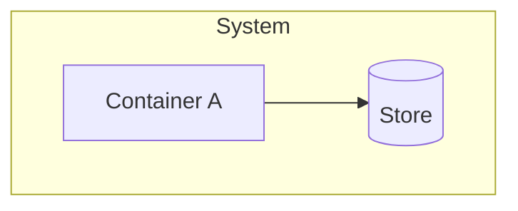

# NNNN: Title

| | |
|---|---|
| Status | Draft |
| Author | |
| Reviewers | |
| Design issue | #N |
| Milestone | |
| Requirement prefix | XXX |
| Supersedes | |
| Superseded by | |

## Summary

Two or three sentences: what is being built and the one reason it is needed. A reader who stops here should know what this document decides.

## Context

What exists today, what is wrong with it, and the evidence. Link measurements, issues and code. State facts, not opinions.

## Goals

What this design must achieve, each one observable.

## Non-goals

What this design deliberately does not do, and why. Anything a reader might reasonably expect that is out of scope belongs here.

## Threat model

Who or what the design defends against, what each can do, and what defends against it. Name what is not defended. Omit only when the design has no security surface, and say so.

## Requirements

| ID | Requirement | Source |
|---|---|---|
| XXX-R1 | One testable statement. | Where it comes from: an issue, a measurement, a decision. |

## Design

### Overview

The shape of the solution in prose, with the highest-level diagram that shows it.

### Detailed design

Components, their responsibilities and their interfaces. Data model, wire contracts and state machines, each with the diagram that fits it (see the diagram table in [README.md](README.md)). Every part names the requirements it satisfies.

### Workflows

Each user- or host-visible workflow as a swim lane or sequence diagram, with the failure paths drawn, not only the happy path.

## Cross-cutting concerns

### Security

Trust boundaries, what is validated where, what is secret and how it is kept out of logs, records and review payloads.

### Failure modes and recovery

What fails, how it is detected, what the user sees and how the system recovers. Crash consistency for anything written to disk.

### Performance

Expected sizes and rates, the budget for each operation, and how it is measured.

### Observability

What is recorded so a failure can be diagnosed after the fact.

### Compatibility and migration

What existing data, configuration or callers are affected, and how they move. How the change is rolled back.

## Rules preserved

For a redesign of existing behaviour: each current rule, where it lives in the code today, where it lives in the new design, and the test that proves it is unchanged. Omit for new behaviour.

## Alternatives considered

Each serious alternative, what it would have looked like and why it lost. Include doing nothing.

## Testing

How each requirement is proven, at which boundary, and what is out of reach of automated tests.

## Decisions

Decision records this design produces or depends on.

- [ADR NNNN: Title](../adr/NNNN-slug.md)

## Open questions

Questions that must be answered before this document is accepted, including acceptance gates such as a benchmark or a check on each supported host. Empty at acceptance.
