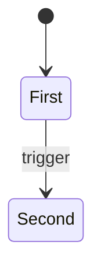
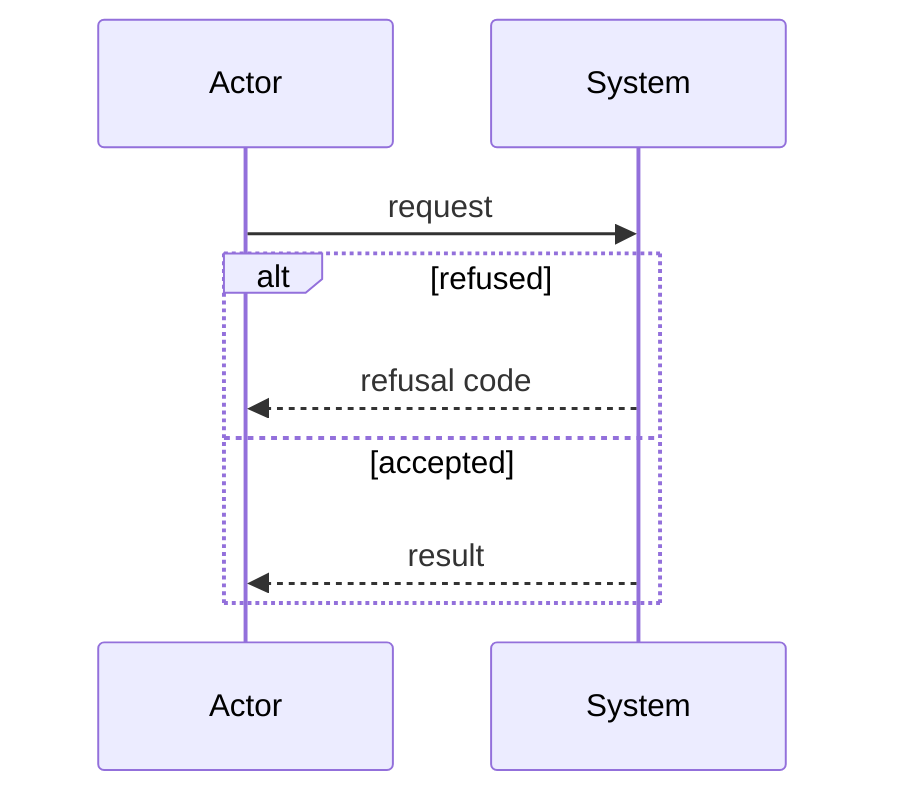

# NNNN: Title

| | |
|---|---|
| Status | Draft / In review / Accepted |
| Design issue | #N |
| Requirement prefix | PREFIX |
| Applies | [0002: System design](0002-system-design.md) |
| Related | ADRs: [TARGET] · C4 views: key, key |

The current design of this area, and nothing else. Edit it in place when the design changes; git holds the history. It describes the design only, never the work still to do.

## 1. Purpose and scope

What this area decides. What it does not decide. Hand-offs: which areas it passes work to or takes
work from, by document number.

## 2. Terms

| Term | Meaning |
|---|---|
| | |

## 3. Requirements

| Id | Rule | Why | Depends on | Status |
|---|---|---|---|---|
| PREFIX-R1 | One sentence stating the rule. | Why it exists. | Ids or ADRs | Active |

Status is `Active` (the design now), `Backlog` (decided, for a later release) or `Withdrawn` (dropped; the row and id stay).

## 4. Roles and actors

| Actor | Receives | Returns | Model and effort from |
|---|---|---|---|
| | | | |

## 5. Commands and operations

### operation-name

- **Inputs:**
- **Outputs:**
- **Refusals:**

  | Code | When | Requirement |
  |---|---|---|
  | | | |

## 6. Records

### record-name

| Field | Type | Meaning |
|---|---|---|
| | | |

## 7. States

*Figure: states of record-name.*

## 8. Workflows

*Figure: flow-name.*

## 9. Settings

| Setting | Type | Default | Set where | Effect |
|---|---|---|---|---|
| | | | | |

## 10. Instructions served

| Instruction | Served to | Carries requirements |
|---|---|---|
| | | |

## 11. Build status

| Requirement | Status | Where |
|---|---|---|
| PREFIX-R1 | Built / Partly built / Not built | path:line |

## 12. Open questions

| Question | Decided by |
|---|---|
| | |
