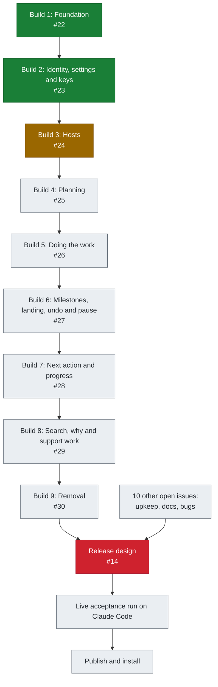
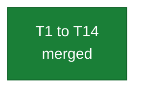
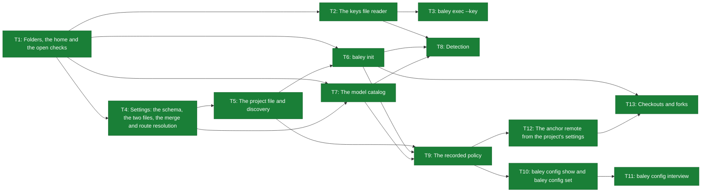

# Roadmap

This file is the order of work from now to Baley's first public release: nine builds, then the release design, a live acceptance run on Claude Code, and publishing. Status is Build 2 complete, Build 3 T1 to T10 merged, as of main `7052dcea`, on 2026-10-06, taken from the GitHub issues, milestones and pull requests of crenshawdev/baley and from the [design documents](design/) and [decision records](adr/). No issue, milestone or design document gives a date, so this file shows order only. The plan re-check design [#134](https://github.com/crenshawdev/baley/issues/134) is recorded as landed on 2026-10-06 in [ADR 0037](adr/0037-plan-recheck-scope.md); its implementation belongs to Builds 4 and 5. The repository upkeep design [#47](https://github.com/crenshawdev/baley/issues/47) is recorded as landed on 2026-10-06 in [0015](design/0015-repository-upkeep-and-build-gate.md); its implementation belongs to #49, #50 and #54, while UPK-R2 waits on the held [Build 3 delivery tasks T14 to T17](#build-3-hosts) ([#24](https://github.com/crenshawdev/baley/issues/24)). Each build pull request updates this roadmap.

## The path to the first release

Builds 1 to 9 run in order, and on GitHub each build issue is blocked by the one before it. All nine are in the milestone Evidence. The release design ([#14](https://github.com/crenshawdev/baley/issues/14)) waits on all nine builds and on every other open issue except the Build 3 findings [#184](https://github.com/crenshawdev/baley/issues/184), [#186](https://github.com/crenshawdev/baley/issues/186), [#190](https://github.com/crenshawdev/baley/issues/190), [#194](https://github.com/crenshawdev/baley/issues/194), [#200](https://github.com/crenshawdev/baley/issues/200), [#201](https://github.com/crenshawdev/baley/issues/201) and [#203](https://github.com/crenshawdev/baley/issues/203), which GitHub does not link to it.

Figure 1. The path from Build 1 to publishing. Arrows point from a piece of work to what waits on it. Once #47 closes with design 0015, 10 other issues block the release design; the six Build 3 findings left once T10 closes #194 are listed below but have no GitHub dependency link to it.

| Status | Meaning |
|---|---|
| Done | Merged |
| In progress | Pull requests are merging |
| Next | The next build to start |
| Blocked | Waits on an open issue outside the build chain as well as on the item before it |
| Planned | Not started |

## Build 1: Foundation

[#22](https://github.com/crenshawdev/baley/issues/22) · milestone Evidence · design [0001 evidence ledger](design/0001-evidence-ledger.md) · done

The evidence ledger store: a storage port with a SQLite adapter behind it, one conformance suite every adapter must pass, the hash chain, and forge anchors pushed with git. The owner's command line runs verify, doctor, export, purge, scrub, rebuild, anchor and acknowledge-restore, and `baley-bench` measures the real adapter. Nothing in the lifecycle uses the ledger yet.

ADRs: [0001 event ledger](adr/0001-event-ledger.md), [0002 SQLite](adr/0002-sqlite.md), [0003 per-user database](adr/0003-per-user-database.md), [0005 storage port](adr/0005-storage-port.md), [0007 forge anchors](adr/0007-forge-anchors.md), [0010 projector traits in the port](adr/0010-projector-traits-in-the-port.md), [0012 optimistic concurrency](adr/0012-optimistic-concurrency.md), [0021 claim rules in the port](adr/0021-claim-rules-in-the-port.md), [0022 acknowledged restore](adr/0022-acknowledged-restore.md), [0023 no backups in Baley](adr/0023-no-backups-in-baley.md), [0024 conformance suite and adapter tests](adr/0024-conformance-suite-and-adapter-tests.md), [0025 anchor tag objects](adr/0025-anchor-tag-objects.md), [0026 anchors read by Baley](adr/0026-anchors-read-by-baley.md).

Figure 2. Build 1's tasks. One pull request per task.

| Task | What | Pull requests | Status |
|---|---|---|---|
| T1 | Workspace split: four crates, `baley-core` fenced from the engine | [#31](https://github.com/crenshawdev/baley/pull/31) | Merged |
| T2 | Events, canonical JSON, the hash chain and the pure verifier | [#32](https://github.com/crenshawdev/baley/pull/32) | Merged |
| T3 | The storage port; the event and chain move into `baley-store` | [#33](https://github.com/crenshawdev/baley/pull/33) | Merged |
| T4 | Opening the store, the schema, the writer queue and the epoch | [#34](https://github.com/crenshawdev/baley/pull/34) | Merged |
| T5 | Payloads and references | [#35](https://github.com/crenshawdev/baley/pull/35) | Merged |
| T6 | Views: tables, indexes, `get` and `find` | [#36](https://github.com/crenshawdev/baley/pull/36) | Merged |
| T7 | `transact` and the `request` view | [#39](https://github.com/crenshawdev/baley/pull/39) | Merged |
| T8 | Retention, reduction and purge | [#41](https://github.com/crenshawdev/baley/pull/41) | Merged |
| T9 | Generations, rebuild and `verify --views` | [#42](https://github.com/crenshawdev/baley/pull/42), [#43](https://github.com/crenshawdev/baley/pull/43) | Merged |
| T10 | Claims, leases and reconciliation | [#132](https://github.com/crenshawdev/baley/pull/132) | Merged |
| T11 | Anchors and the adapter's `verify` | [#135](https://github.com/crenshawdev/baley/pull/135) | Merged |
| T12 | Export, doctor and the owner-only acknowledge-restore command; backups removed | [#138](https://github.com/crenshawdev/baley/pull/138) | Merged |
| T13 | The conformance suite, run against every store adapter | [#140](https://github.com/crenshawdev/baley/pull/140) | Merged |
| T14 | CLI commands `verify`, `doctor`, `export`, `purge`, `scrub`, `rebuild`, `anchor` and `acknowledge-restore`; the git forge and ticker, and `baley-bench` with `seed` | [#142](https://github.com/crenshawdev/baley/pull/142) | Merged |

## Build 2: Identity, settings and keys

[#23](https://github.com/crenshawdev/baley/issues/23) · milestone Evidence · done

Baley finds its per-user ledger safely, and `baley init` ties a repository to a project through a committed `baley.toml`. Baley keeps its files in its own folder under a crenshawdev vendor folder: the global settings file `config.toml` and the keys file `keys.env` in `$XDG_CONFIG_HOME/crenshawdev/baley` and the ledger in `$XDG_DATA_HOME/crenshawdev/baley` on Linux (an empty or relative XDG variable counts as unset), all three in `~/Library/Application Support/crenshawdev/baley` on macOS, and all three in `BALEY_HOME` when it is set ([ADR 0027](adr/0027-vendor-folders-and-plain-keys.md)). The ledger's home is not supported on a network share, and Baley does not check for one. Baley reads the two TOML settings files ([ADR 0015](adr/0015-settings-in-toml.md)) and resolves routes against a model catalog it refreshes by calling each provider's model-list endpoint with `reqwest` ([ADR 0028](adr/0028-one-http-stack.md)). Provider keys are plain `NAME=value` lines in `keys.env`, which the owner edits by hand and Baley only reads, refusing it with `keys-file-exposed` when group or others can read it or another user owns it, and with `keys-file-invalid` when a line is invalid, a value is empty or a name appears twice, and with `keys-file-unreadable` when it is not a regular file or cannot be read. There is no encryption, no master key and no OS secret store. Keys reach a command only through `baley exec --key`; detection also reads them for provider model-list requests. Key values never enter events, views or exports. All of it runs from the command line, on Linux and macOS.

- Designs: [0001 evidence ledger](design/0001-evidence-ledger.md), [0002 system design](design/0002-system-design.md), [0003 configuration and routing](design/0003-configuration-and-routing.md), [0012 host interface](design/0012-host-interface.md)
- ADRs: [0003 per-user database](adr/0003-per-user-database.md), [0004 project identity](adr/0004-project-identity.md), [0013 host session calls outside models](adr/0013-host-session-calls-outside-models.md), [0015 settings in TOML](adr/0015-settings-in-toml.md), [0027 vendor folders and plain keys](adr/0027-vendor-folders-and-plain-keys.md), [0028 one HTTP stack](adr/0028-one-http-stack.md)
- Carries: no bugs
- Blocked by: Build 1 ([#22](https://github.com/crenshawdev/baley/issues/22))

Figure 3. Build 2's tasks. Arrows point from a task to what waits on it. One pull request per task.

| Task | What | Pull requests | Status |
|---|---|---|---|
| T1 | Folders, the home and the open checks | [#149](https://github.com/crenshawdev/baley/pull/149) | Merged |
| T2 | The keys file reader | [#152](https://github.com/crenshawdev/baley/pull/152) | Merged |
| T3 | `baley exec --key` | [#154](https://github.com/crenshawdev/baley/pull/154) | Merged |
| T4 | Settings: the schema, the two files, the merge and route resolution | [#156](https://github.com/crenshawdev/baley/pull/156) | Merged |
| T5 | The project file and discovery | [#158](https://github.com/crenshawdev/baley/pull/158) | Merged |
| T6 | `baley init` | [#164](https://github.com/crenshawdev/baley/pull/164) | Merged |
| T7 | The model catalog | [#165](https://github.com/crenshawdev/baley/pull/165) | Merged |
| T8 | Detection | [#166](https://github.com/crenshawdev/baley/pull/166) | Merged |
| T9 | The recorded policy | [#167](https://github.com/crenshawdev/baley/pull/167) | Merged |
| T10 | `baley config show` and `baley config set` | [#170](https://github.com/crenshawdev/baley/pull/170) | Merged |
| T11 | `baley config interview` | [#171](https://github.com/crenshawdev/baley/pull/171) | Merged |
| T12 | The anchor remote from the project's settings | [#172](https://github.com/crenshawdev/baley/pull/172) | Merged |
| T13 | Checkouts and forks | [#173](https://github.com/crenshawdev/baley/pull/173) | Merged |

## Build 3: Hosts

[#24](https://github.com/crenshawdev/baley/issues/24) · milestone Evidence · in progress

Claude Code is the only host Baley supports in this release, and Build 3 removes Codex support. Each Claude Code session starts its own Baley MCP server over stdio, and the session's subagents reach it through the session's connection. There is no launcher, no HTTP listener and no background service, and every worker in this release is a subagent of its session. The server takes its project from `CLAUDE_PROJECT_DIR`, records its working directory beside it, and creates a session id that every call carries, with the host's own session id beside it when one is set. Ledger events record which caller wrote them. Each project call is prepared from the session's `CLAUDE_PROJECT_DIR` in the order the command line uses: a read appends nothing, and a write runs checkout admission and the host's policy step before its command. T8's `capture` and `document` are the first operations to use it. Another host can connect and list the tools, but every tool call it makes is refused with Claude Code named as the supported host. Sessions share the ledger through the store: every write takes the writer queue and decides inside its transaction ([ADR 0012](adr/0012-optimistic-concurrency.md)), and the build's acceptance includes two live Claude Code sessions writing one project at once, with the record checked afterwards. Agents can neither read nor write Baley's home or its config folder (`config.toml` and `keys.env`). Claude Code's sandbox, its file permission rules and Baley's guard hook carry that together, and `baley doctor` reports what an agent can reach. The compiled instructions are served ([ADR 0009](adr/0009-served-instructions.md)): T7 serves help, the operation schemas and the compiled instructions by identity in parts, and T8, which builds `document`, attaches the instruction identity a session sends on `capture` to the caller it records, with the version and hash taken from the registry. The build renders the stub content that the held delivery tasks will write, and it opens with warnings that say what a restore cannot undo. How Baley is delivered and updated, who writes its Claude artifacts and how setup is entered wait on an owner decision, so T14 to T17 are held. Captures are recorded.

- Designs: [0001 evidence ledger](design/0001-evidence-ledger.md), [0002 system design](design/0002-system-design.md), [0003 configuration and routing](design/0003-configuration-and-routing.md), [0010 guard](design/0010-guard.md), [0012 host interface](design/0012-host-interface.md), [0014 support families](design/0014-support-families.md), [0015 repository upkeep and the build gate](design/0015-repository-upkeep-and-build-gate.md)
- ADRs: [0008 host sandbox isolation](adr/0008-host-sandbox-isolation.md), [0009 served instructions](adr/0009-served-instructions.md), [0011 one shared server](adr/0011-one-shared-server.md), [0012 optimistic concurrency](adr/0012-optimistic-concurrency.md), [0020 sandbox is a write barrier](adr/0020-sandbox-is-a-write-barrier.md), [0028 one HTTP stack](adr/0028-one-http-stack.md), [0029 a host may offer more](adr/0029-a-host-may-offer-more.md), [0033 host security bar](adr/0033-host-security-bar.md), [0034 one server per session](adr/0034-one-server-per-session.md), [0035 restore purge uncertainty](adr/0035-restore-purge-uncertainty.md), [0036 per-user guard records](adr/0036-per-user-guard-records.md)
- Carries: [#71](https://github.com/crenshawdev/baley/issues/71), [#146](https://github.com/crenshawdev/baley/issues/146), [#194](https://github.com/crenshawdev/baley/issues/194)
- Blocked by: Build 2 ([#23](https://github.com/crenshawdev/baley/issues/23))

```mermaid
flowchart LR
    T1["T1: Restore warnings"]
    T2["T2: Claude seam and removal"]
    T3["T3: Caller provenance"]
    T4["T4: Session stdio server"]
    T5["T5: Request preparation"]
    T6["T6: Guard decisions"]
    T7["T7: Instructions and parts"]
    T8["T8: Captures"]
    T9["T9: Bounded guard access"]
    T10["T10: Guard records and answers"]
    T11["T11: Claude artifact content"]
    T12["T12: Live Claude qualification"]
    T13["T13: Runtime doctor"]
    Delivery["Pending delivery decision"]
    T14["T14: Binary delivery"]
    T15["T15: Artifact application"]
    T16["T16: Setup entry"]
    T17["T17: Installed doctor and qualification"]

    T1 --> T2
    T2 --> T3
    T2 --> T6
    T3 --> T4
    T4 --> T5
    T4 --> T9
    T4 --> T14
    T5 --> T7
    T5 --> T10
    T6 --> T9
    T7 --> T8
    T8 --> T11
    T9 --> T10
    T10 --> T11
    T11 --> T12
    T11 --> T13
    T11 --> T15
    T12 --> T14
    T12 -. evidence .-> T13
    Delivery -.-> T14
    T13 --> T17
    T14 --> T15
    T15 --> T16
    T16 --> T17

    classDef done fill:#1a7f37,stroke:#116329,color:#ffffff
    classDef planned fill:#eaeef2,stroke:#6e7781,color:#24292f
    classDef held fill:#ffffff,stroke:#6e7781,stroke-dasharray:4 3,color:#57606a
    class T1,T2,T3,T4,T5,T6,T7,T8,T9,T10 done
    class T11,T12,T13 planned
    class Delivery,T14,T15,T16,T17 held
```

Figure 4. Build 3's tasks. Arrows point from a task to what waits on it. A dotted arrow is an evidence link or a wait on the pending delivery decision, and a held task waits on that decision. One pull request per task.

| Task | What | Pull requests | Status |
|---|---|---|---|
| T1 | Explain purge uncertainty after a restore | [#176](https://github.com/crenshawdev/baley/pull/176) | Merged |
| T2 | Claude host seam and Codex removal | [#182](https://github.com/crenshawdev/baley/pull/182) | Merged |
| T3 | Caller provenance in the ledger | [#183](https://github.com/crenshawdev/baley/pull/183) | Merged |
| T4 | Per-session stdio server and store maintenance | [#189](https://github.com/crenshawdev/baley/pull/189) | Merged |
| T5 | Per-request discovery, admission and policy | [#191](https://github.com/crenshawdev/baley/pull/191) | Merged |
| T6 | Guard decisions and protected paths | [#196](https://github.com/crenshawdev/baley/pull/196) | Merged |
| T7 | Compiled instructions, help, schemas and parts | [#199](https://github.com/crenshawdev/baley/pull/199) | Merged |
| T8 | Ledger captures and project identity reads | [#202](https://github.com/crenshawdev/baley/pull/202) | Merged |
| T9 | Bounded guard process and storage access | [#204](https://github.com/crenshawdev/baley/pull/204) | Merged |
| T10 | Per-user guard records and Claude hook answers | [#207](https://github.com/crenshawdev/baley/pull/207) | Merged |
| T11 | Claude artifact content and logical stubs | | Planned |
| T12 | Live Claude qualification and concurrent sessions | | Planned |
| T13 | Runtime doctor host observations | | Planned |
| T14 | Binary delivery and update activation | | Held |
| T15 | Claude artifact ownership and application | | Held |
| T16 | Owner setup entry and completion record | | Held |
| T17 | Delivery doctor and installed qualification | | Held |

## Build 4: Planning

[#25](https://github.com/crenshawdev/baley/issues/25) · milestone Evidence · planned

The owner starts a project, shapes the story backlog, and commits stories to phases under a task capacity. Each story carries versioned truths, and each truth has one check. The analyzer and the planner ask the owner only the decisions left to the owner, each with a recommended answer, in rounds ordered by what each question depends on, and every answer and deferral is recorded ([ADR 0030](adr/0030-question-rounds.md)). Each phase's plan is written, checked, reviewed and risk-scanned, and approval binds the plan's exact digest. Every configured reviewer runs, and a provider that cannot be called is replaced by the host's own subagent reviewer unless that reviewer already runs. The host session makes the outside calls from Baley's work order and checks each finding, and the owner rules on each one that survives ([ADR 0013](adr/0013-host-session-calls-outside-models.md), [ADR 0019](adr/0019-reviews-adjudicated-and-ruled.md)). The first workers are dispatched here, so routing is finished here. The first dispatch task supplies Claude Code's identity rung map and a dated per-model table of supported effort levels. Claude Code runs an unsupported level as the highest supported level at or below it, and a model without effort is not applicable. The route records the requested rung and the effective level apart. `RungMap` is unchanged, and the owner reviews the initial table in that task's pull request.

Build 4 implements PLN-R16's full and diff plan re-check inputs, the setting's first reader and validation, immutable material for each round, and the scope recorded in plan-check and plan-review events and views. Design 0005 leaves the way the checker's revision and a plan review's revision combine for one plan as an open question owned by Build 4.

- Designs: [0001 evidence ledger](design/0001-evidence-ledger.md), [0002 system design](design/0002-system-design.md), [0003 configuration and routing](design/0003-configuration-and-routing.md), [0004 starting a project and changing scope](design/0004-starting-a-project-and-changing-scope.md), [0005 context, plans and acceptance](design/0005-context-plans-and-acceptance.md), [0008 review](design/0008-review.md), [0009 risk](design/0009-risk.md), [0012 host interface](design/0012-host-interface.md), [0014 support families](design/0014-support-families.md)
- ADRs: [0013 host session calls outside models](adr/0013-host-session-calls-outside-models.md), [0017 stories and sprints](adr/0017-stories-and-sprints.md), [0019 reviews adjudicated and ruled](adr/0019-reviews-adjudicated-and-ruled.md), [0030 question rounds](adr/0030-question-rounds.md), [0031 one term per concept](adr/0031-one-term-per-concept.md), [0037 plan re-check scope](adr/0037-plan-recheck-scope.md)
- Carries: [#40](https://github.com/crenshawdev/baley/issues/40), [#68](https://github.com/crenshawdev/baley/issues/68), [#69](https://github.com/crenshawdev/baley/issues/69), [#72](https://github.com/crenshawdev/baley/issues/72)
- Blocked by: Build 3 ([#24](https://github.com/crenshawdev/baley/issues/24))

## Build 5: Doing the work

[#26](https://github.com/crenshawdev/baley/issues/26) · milestone Evidence · planned

Baley runs a phase's tasks and runs every test and check itself, judging by exit code ([ADR 0014](adr/0014-baley-runs-tests.md)). A task close is refused for any path outside the lease until the owner rules on it ([ADR 0018](adr/0018-lease-enforced-at-close.md)). Build 5 also supplies the active dispatch's lease to the guard's write decision, whose only lease input until then is "no active dispatch", and adds the out-of-lease deny (GRD-R11, EXE-R8). The verifier gets specs and run ids, never the executor's summary. Diff review and the completion risk scan gate each plan. A `fix` ruling opens a gap plan, and a finding is filed on GitHub only on the owner's command. A returning finding the owner dismissed before is brought back beside that dismissal, and the owner confirms or reverses it.

Build 5 constructs the full revised targets for diff and completion risk review re-checks, including the original reviewed changes and completed gap-plan fixes.

- Designs: [0002 system design](design/0002-system-design.md), [0006 execution](design/0006-execution.md), [0007 verification](design/0007-verification.md), [0008 review](design/0008-review.md), [0009 risk](design/0009-risk.md), [0012 host interface](design/0012-host-interface.md)
- ADRs: [0014 Baley runs tests](adr/0014-baley-runs-tests.md), [0018 lease enforced at close](adr/0018-lease-enforced-at-close.md), [0019 reviews adjudicated and ruled](adr/0019-reviews-adjudicated-and-ruled.md), [0037 plan re-check scope](adr/0037-plan-recheck-scope.md)
- Carries: no bugs
- Blocked by: Build 4 ([#25](https://github.com/crenshawdev/baley/issues/25))

## Build 6: Milestones, landing, undo and pause

[#27](https://github.com/crenshawdev/baley/issues/27) · milestone Evidence · planned

Milestones close and archive. A finished phase lands on GitHub one step at a time, and each push, pull request, merge, tag and cleanup needs its own owner authorization. Landing waits while a deferred review is unruled. The managed project's releases are proposed and confirmed. Undo and pause work. Anchors are pushed at every occasion the design names.

- Designs: [0001 evidence ledger](design/0001-evidence-ledger.md), [0003 configuration and routing](design/0003-configuration-and-routing.md), [0004 starting a project and changing scope](design/0004-starting-a-project-and-changing-scope.md), [0008 review](design/0008-review.md), [0011 milestones, landing, undo and pause](design/0011-milestones-landing-undo-pause.md)
- ADRs: [0007 forge anchors](adr/0007-forge-anchors.md), [0031 one term per concept](adr/0031-one-term-per-concept.md)
- Carries: no bugs
- Blocked by: Build 5 ([#26](https://github.com/crenshawdev/baley/issues/26))

## Build 7: Next action and progress

[#28](https://github.com/crenshawdev/baley/issues/28) · milestone Evidence · planned

Baley answers what to do next and shows progress from keyed ledger views. A status read never writes.

- Designs: [0013 next action and progress](design/0013-next-action-and-progress.md), [0014 support families](design/0014-support-families.md)
- ADRs: [0031 one term per concept](adr/0031-one-term-per-concept.md)
- Carries: no bugs
- Blocked by: Build 6 ([#27](https://github.com/crenshawdev/baley/issues/27))

## Build 8: Search, why and support work

[#29](https://github.com/crenshawdev/baley/issues/29) · milestone Evidence · planned

Ranked recall and exact "why" queries, then task, debug and spike on the ledger. Purge also removes search rows. Baley runs each debug reproduction itself: red before any hypothesis, and green at resolve over reproduction files byte-identical to the red run's. The owner can close an episode that never reproduced, with a reason. Debug gets the diagnosis review. A spike works outside the project and commits nothing.

- Designs: [0001 evidence ledger](design/0001-evidence-ledger.md), [0008 review](design/0008-review.md), [0013 next action and progress](design/0013-next-action-and-progress.md), [0014 support families](design/0014-support-families.md)
- ADRs: none
- Carries: no bugs
- Blocked by: Build 7 ([#28](https://github.com/crenshawdev/baley/issues/28))

## Build 9: Removal

[#30](https://github.com/crenshawdev/baley/issues/30) · milestone Evidence · planned

Removes the old JSON record, the intent journal, participants, root binding, the Markdown renderers and parsers, and every `.planning` path. Builds `baley show` and record export to Markdown (EVD-R25), with the record-export spelling settled beside the standalone project export. Every owner command and every served instruction then reads the ledger. The real server's memory, start time and main operations are measured against design 0001's budgets. The timings are recorded as measurements, not test assertions.

- Designs: [0001 evidence ledger](design/0001-evidence-ledger.md), [0012 host interface](design/0012-host-interface.md), [0014 support families](design/0014-support-families.md)
- ADRs: [0006 no Markdown records](adr/0006-no-markdown-records.md), [0009 served instructions](adr/0009-served-instructions.md)
- Carries: [#93](https://github.com/crenshawdev/baley/issues/93)
- Blocked by: Build 8 ([#29](https://github.com/crenshawdev/baley/issues/29))

## Release

### R1. Release design

[#14](https://github.com/crenshawdev/baley/issues/14) · milestone Traders · not written · blocked

The tag gate (on main, CI green, version matches the crate). Static, reproducible Linux and macOS archives, refused if a checksum differs from the committed pin. Signed artifacts and provenance attestations. Release notes and whether a CHANGELOG starts. How releases relate to forge anchors and tag rules. Installation on Claude Code: MCP registration, instruction stubs and the sandbox rule. It also picks the first version number.

Blocked by Builds 1 to 9 and by every issue in [Other open issues](#other-open-issues) except the Build 3 findings #184, #186, #190, #200, #201 and #203.

### R2. Live acceptance run on Claude Code

Planned. One throwaway Rust project on Claude Code, with its own private GitHub repository, taken through the whole loop from starting the project to a landed change. Anything that breaks is fixed as a bug with its own unit test. No end-to-end tests are added to the suite. A written list records what is knowingly left untested. The host matrix (EVD-R24) and the server measurements are re-run. The run is defined in #14, which leaves open whether it gates every release or only the first.

### R3. Publish and install

Planned. Publish Baley and install it on a machine for Claude Code. Milestone Traders. It has no issue of its own.

## Other open issues

Every issue here except the Build 3 findings blocks the release design #14. GitHub links none of the six Build 3 findings to #14. "Carried by" means that build does the fix.

### Upkeep and docs

| Issue | What | Milestone | Depends on / blocks |
|---|---|---|---|
| [#44](https://github.com/crenshawdev/baley/issues/44) | Start the architecture overview | Evidence | None |
| [#49](https://github.com/crenshawdev/baley/issues/49) | Check formatting in CI; set six-job build and test limits | Encyclopedists | None. The `fmt` job and the six-job limits are built; requiring `fmt` in the `main` ruleset remains, once the job has passed on `main` |
| [#50](https://github.com/crenshawdev/baley/issues/50) | Prune the label set; add an impact field to the bug form | Encyclopedists | None. The bug form's impact field is built; deleting the seven unused labels remains |
| [#54](https://github.com/crenshawdev/baley/issues/54) | List the slow tests; read what the suite's count is made of | Encyclopedists | None |

### Bugs

| Issue | What | Milestone | Depends on / blocks |
|---|---|---|---|
| [#40](https://github.com/crenshawdev/baley/issues/40) | Read a command's cheap git facts inside the write transaction | Evidence | Carried by Build 4 |
| [#68](https://github.com/crenshawdev/baley/issues/68) | Git error text is stored and shown unredacted (URL credentials) | None | Carried by Build 4 |
| [#69](https://github.com/crenshawdev/baley/issues/69) | `model.escalate_on_failure` never applies to automatic retries | None | Carried by Build 4 |
| [#72](https://github.com/crenshawdev/baley/issues/72) | The provider schema accepts whitespace-only text the validator refuses | None | Carried by Build 4 |
| [#93](https://github.com/crenshawdev/baley/issues/93) | The audit admits any bold span as a requirement id and skips unreadable rows | None | Carried by Build 9 |
| [#70](https://github.com/crenshawdev/baley/issues/70) | Forgejo tracker calls pass the host as tea's `--login` name | None | No build carries it |

### Build 3 findings

| Issue | What | Milestone | Depends on / blocks |
|---|---|---|---|
| [#184](https://github.com/crenshawdev/baley/issues/184) | Closing or abandoning the session worker can announce a finished drain before the last answer is sent | Evidence | Its text names no build |
| [#186](https://github.com/crenshawdev/baley/issues/186) | The cancelled-receiver capacity test can fail while slot release is correct | Evidence | Its text names no build |
| [#190](https://github.com/crenshawdev/baley/issues/190) | `baley serve` drops calls it already read when input closes in the same burst | Evidence | Its text says T12 runs the live shutdown checks and fixes a confirmed defect in its own bug pull request |
| [#200](https://github.com/crenshawdev/baley/issues/200) | No unit test sees a capture's instruction evidence on the caller handed to preparation | Evidence | Its text names no build |
| [#201](https://github.com/crenshawdev/baley/issues/201) | Two projects purging the same bytes during a `document` read can each get the other's tombstone reason | Evidence | Its text names no build |
| [#203](https://github.com/crenshawdev/baley/issues/203) | An export through a store opened for the guard waits without limit for the new copy's writer queue | None | Its text names no build |

## Milestones

Counts from GitHub on 2026-10-06, with #194 counted as closed when Build 3 T10 lands. Evidence therefore shows 33 closed and 14 open issues.

| Milestone | Theme | Closed | Open | Open issues | State |
|---|---|---|---|---|---|
| [Evidence](https://github.com/crenshawdev/baley/milestone/1) | Replace the JSON store with one designed from how records are read and written, and move it out of the repository's .planning directory. | 33 | 14 | Builds 3 to 9, bug #40, #44 and findings #184, #186, #190, #200 and #201 | Open |
| [Encyclopedists](https://github.com/crenshawdev/baley/milestone/7) | Keep the repository's names, public face and build gate accurate: Baley names throughout, formatting, labels, description and topics, the README, and what the test suite costs. | 4 | 3 | #49, #50, #54 | Open |
| [Traders](https://github.com/crenshawdev/baley/milestone/5) | Publish Baley and install it on a machine for Claude Code, after a live run of the whole loop. | 0 | 1 | #14 | Open |
| [Seldon](https://github.com/crenshawdev/baley/milestone/3) | Bring a new or existing repository under Baley and write its first stories and roadmap. | 1 | 0 | None | Closed |
| [Mule](https://github.com/crenshawdev/baley/milestone/4) | Change what was approved: edit or withdraw a phase, move its stories, revise a truth or a story, keeping every earlier version on record. | 1 | 0 | None | Closed |
| [Little Lost Robot](https://github.com/crenshawdev/baley/milestone/6) | What an agent may touch: how a task's file lease is enforced, and whether Baley edits source itself. | 2 | 0 | None | Closed |
| [Terminus](https://github.com/crenshawdev/baley/milestone/2) | Open the repository to the public: a README for visitors, a security policy, issue templates, and branch protection with no bypass. | 2 | 0 | None | Closed |

## Not yet decided

What the records leave open or do not say.

- Builds 4 to 9 have no task breakdown. Each lists the design requirements it delivers, and all but Build 7 add a short list of settled points.
- There is no first version number. The release design #14 picks it.
- #44 was meant to land before Build 1 T10, which has merged. No order is given for bug #70.
- The board's Status field is set only on the build issues, #40 and #14.
